# 2. Stakeholders

Hệ thống CAB System có các nhóm stakeholder chính sau:

| ID     | Stakeholder                     | Vai trò và mối quan tâm                                                                                                                  |
| ------ | ------------------------------- | ---------------------------------------------------------------------------------------------------------------------------------------- |
| STK-01 | Khách hàng                      | Sử dụng hệ thống để đăng ký/đăng nhập, đặt xe, theo dõi chuyến đi, thanh toán và đánh giá tài xế.                                        |
| STK-02 | Tài xế                          | Sử dụng hệ thống để quản lý thông tin cá nhân và phương tiện, cập nhật trạng thái sẵn sàng, nhận và thực hiện chuyến xe.                 |
| STK-03 | Nhân viên vận hành              | Theo dõi và hỗ trợ hoạt động của khách hàng, tài xế và chuyến xe; xử lý các vấn đề phát sinh trong quá trình vận hành.                   |
| STK-04 | Công ty ABC                     | Đơn vị sở hữu và có nhu cầu xây dựng, phát triển hệ thống CAB nhằm phục vụ hoạt động đặt xe và mở rộng hệ thống trong tương lai.         |
| STK-05 | Ban lãnh đạo                    | Theo dõi tình hình hoạt động thông qua các thông tin và báo cáo về chuyến xe, doanh thu, tỷ lệ hoàn thành/hủy chuyến và hiệu quả tài xế. |
| STK-06 | Nhà cung cấp dịch vụ thanh toán | Cung cấp dịch vụ thanh toán điện tử được tích hợp với CAB System để xử lý giao dịch thanh toán.                                          |

## 2.1. Mối quan tâm của các stakeholder

- **Khách hàng:** Đặt xe, theo dõi chuyến, thanh toán và đánh giá tài xế.
- **Tài xế:** Nhận chuyến, thực hiện chuyến và cập nhật trạng thái chuyến.
- **Nhân viên vận hành:** Quản lý và hỗ trợ hoạt động vận hành của hệ thống.
- **Công ty ABC:** Đảm bảo hệ thống đáp ứng nhu cầu kinh doanh, có khả năng phục vụ số lượng lớn người dùng và có thể mở rộng trong tương lai.
- **Ban lãnh đạo:** Theo dõi hiệu quả hoạt động và các chỉ số kinh doanh của hệ thống.
- **Nhà cung cấp dịch vụ thanh toán:** Đảm bảo cung cấp dịch vụ thanh toán điện tử cho hệ thống.

## 2.2. Ghi chú

Các stakeholder trên được xác định từ yêu cầu của khách hàng. Quyền hạn, vai trò và Actor chính thức đã được xác định tại Chương 13 và Chương 14.

# 3. System Scope

## 3.1. In Scope

CAB System cung cấp các chức năng chính sau:

- **Quản lý tài khoản:** Đăng ký, đăng nhập và quản lý thông tin khách hàng, tài xế.
- **Quản lý tài xế và phương tiện:** Quản lý hồ sơ, phương tiện và trạng thái sẵn sàng của tài xế.
- **Đặt xe:** Khách hàng nhập điểm đón, điểm đến và lựa chọn loại phương tiện để tạo yêu cầu đặt xe.
- **Phân công tài xế:** Hệ thống tìm và phân công tài xế phù hợp dựa trên trạng thái sẵn sàng, loại phương tiện và khoảng cách đến điểm đón.
- **Quản lý chuyến xe:** Theo dõi và cập nhật trạng thái chuyến xe từ khi tiếp nhận đến khi hoàn thành.
- **Theo dõi chuyến xe:** Khách hàng có thể theo dõi trạng thái chuyến và thông tin tài xế được phân công.
- **Tính cước và thanh toán:** Tính cước chuyến xe và hỗ trợ thanh toán tiền mặt hoặc thanh toán điện tử.
- **Thông báo:** Gửi thông báo liên quan đến yêu cầu đặt xe, phân công tài xế, trạng thái chuyến và kết quả thanh toán.
- **Đánh giá:** Khách hàng có thể đánh giá tài xế sau khi chuyến xe hoàn thành.
- **Quản lý vận hành:** Nhân viên vận hành quản lý khách hàng, tài xế, phương tiện; theo dõi và hỗ trợ chuyến xe; đồng thời tra cứu giao dịch.
- **Tra cứu và báo cáo:** Tra cứu lịch sử chuyến, giao dịch và cung cấp thông tin về chuyến xe, doanh thu, tỷ lệ hoàn thành/hủy chuyến và hiệu quả tài xế.

Hệ thống quản lý các nhóm dữ liệu chính gồm tài khoản, khách hàng, tài xế, phương tiện, yêu cầu đặt xe, chuyến xe, vị trí tài xế, cước phí, thanh toán, thông báo và đánh giá.

## 3.2. Out of Scope

Các nội dung sau không thuộc phạm vi phiên bản hiện tại:

- AI và Machine Learning.
- Big Data và phân tích dữ liệu nâng cao.
- Các module nghiệp vụ doanh nghiệp không liên quan trực tiếp đến hoạt động đặt xe.
- Các tích hợp bên thứ ba không cần thiết cho hoạt động của hệ thống.
- Thông báo qua SMS và email.
- Các tính năng ngoài phạm vi nêu tại mục này; theo dõi vị trí và ETA real-time thuộc phạm vi theo Chương 18.
- Tích hợp nhiều nhà cung cấp hoặc nhiều phương thức thanh toán trong cùng phiên bản.

Các nội dung trên có thể được xem xét trong các phiên bản phát triển sau.

## 3.3. External Systems

CAB System có thể tương tác với các hệ thống bên ngoài sau:

| External System | Mục đích                                                                                                                                                                         |
| --------------- | -------------------------------------------------------------------------------------------------------------------------------------------------------------------------------- |
| VNPAY Sandbox   | Xử lý thanh toán điện tử                                                                                                                                                         |
| Dịch vụ định vị | Nhận tọa độ điểm đón và vị trí gần nhất của tài xế để tính khoảng cách và xác định tài xế phù hợp; hệ thống chỉ sử dụng ở bước xác định tài xế và không chọn nhà cung cấp cụ thể |

CAB System không lưu trữ thông tin thẻ hoặc dữ liệu tài khoản thanh toán nhạy cảm.

## 3.4. Scope Constraints

Để phù hợp với quy mô đồ án môn học, hệ thống áp dụng các quy định sau:

### 3.4.1. Tính cước

Tổng cước được tính theo:

**Tổng cước = Phí cơ bản theo loại phương tiện + (Quãng đường × Đơn giá theo km)**

Quãng đường được làm tròn đến **0,1 km**.

Không áp dụng phụ phí giờ cao điểm, thời tiết, khu vực hoặc các phụ phí nâng cao.

### 3.4.2. Phân công tài xế

Hệ thống chỉ xem xét các tài xế:

- Đang ở trạng thái sẵn sàng.
- Có loại phương tiện phù hợp với yêu cầu.
- Có vị trí hợp lệ được lưu trên hệ thống.

Trong số các tài xế phù hợp, hệ thống ưu tiên tài xế gần điểm đón nhất.

Nếu tài xế từ chối hoặc không phản hồi trong thời gian quy định, hệ thống chuyển yêu cầu cho tài xế phù hợp tiếp theo.

### 3.4.3. Thời gian phản hồi

Tài xế có **60 giây** để nhận hoặc từ chối yêu cầu chuyến xe.

Nếu không phản hồi trong thời gian này, yêu cầu được chuyển sang tài xế phù hợp tiếp theo.

Nếu không còn tài xế phù hợp, hệ thống thông báo cho khách hàng.

### 3.4.4. Hủy chuyến

Khách hàng được hủy chuyến trước khi chuyến xe bắt đầu.

Tài xế được từ chối yêu cầu trước khi nhận chuyến.

Phiên bản hiện tại không áp dụng phí hủy chuyến.

### 3.4.5. Mất kết nối

Khi mất kết nối:

- Hệ thống giữ trạng thái cuối cùng đã được ghi nhận thành công.
- Các thao tác chưa được hệ thống xác nhận không được xem là đã thực hiện.
- Khi kết nối trở lại, người dùng tiếp tục thao tác từ trạng thái hiện tại.

Không triển khai cơ chế hoạt động offline trong phiên bản hiện tại.

### 3.4.6. Lưu trữ dữ liệu

Hệ thống lưu dữ liệu cần thiết cho hoạt động, bao gồm tài khoản, khách hàng, tài xế, phương tiện, chuyến xe, cước phí, thanh toán và đánh giá.

Dữ liệu được lưu trữ **tối thiểu 12 tháng**.

Trong phạm vi phiên bản hiện tại, hệ thống không tự động xóa dữ liệu khi hết thời gian lưu trữ.

### 3.4.7. Quyền nhân viên vận hành

Phiên bản hiện tại sử dụng OperationsStaff và OperationsSupervisor theo mục 18.2.

Nhân viên vận hành được phép:

- Quản lý khách hàng.
- Quản lý tài xế.
- Quản lý phương tiện.
- Theo dõi và hỗ trợ chuyến xe.
- Tra cứu giao dịch.

Việc quản lý khách hàng, tài xế và phương tiện được thực hiện thông qua các thao tác **Create, Read, Update, Delete (CRUD)**; thao tác Delete là logical delete, cập nhật `IsDeleted = true`, chỉ loại khỏi dữ liệu đang vận hành và không xóa vật lý dữ liệu lưu trữ.

Sử dụng hai role OperationsStaff và OperationsSupervisor theo mục 18.2.

### 3.4.8. Thanh toán

Hệ thống hỗ trợ:

- Thanh toán tiền mặt.
- Thanh toán điện tử thông qua **VNPAY Sandbox**.

Hệ thống không lưu thông tin thẻ hoặc dữ liệu tài khoản thanh toán nhạy cảm.

Khi thanh toán điện tử thất bại, hệ thống chuyển giao dịch sang trạng thái **Failed**, thông báo kết quả cho khách hàng và cho phép **3 lần retry sau lần thử đầu tiên** (tổng cộng tối đa **4 attempts**; `RetryCount = 0` ở lần đầu).

### 3.4.9. Thông báo

Phiên bản hiện tại chỉ sử dụng **thông báo trong hệ thống (In-app Notification)**.

Các sự kiện chính được thông báo gồm:

- Tiếp nhận yêu cầu đặt xe.
- Phân công tài xế.
- Tài xế đến điểm đón.
- Hoàn thành chuyến xe.
- Kết quả thanh toán.
- Thay đổi liên quan đến chuyến xe.
- Tài xế được thông báo khi có yêu cầu chuyến mới phù hợp được phân công.

Không triển khai thông báo qua SMS hoặc email.

### 3.4.10. Vị trí tài xế

Hệ thống lưu vị trí gần nhất của tài xế để hỗ trợ tìm tài xế phù hợp.

Theo dõi vị trí và ETA real-time theo mục 18.1; không lưu lịch sử tuyến đường.

### 3.4.11. Khả năng mở rộng

Hệ thống được xây dựng theo hướng có thể mở rộng trong tương lai đối với:

- Loại dịch vụ.
- Phương thức thanh toán.
- Nhà cung cấp thanh toán.
- Kênh thông báo.

Việc triển khai nhiều nhà cung cấp hoặc nhiều phương thức trong phiên bản hiện tại không thuộc phạm vi.

# 4. BUSINESS REQUIREMENTS

## 4.1. Danh sách yêu cầu nghiệp vụ

| ID    | Yêu cầu nghiệp vụ                                                                                                                                 |
| ----- | ------------------------------------------------------------------------------------------------------------------------------------------------- |
| BR-01 | Hệ thống phải hỗ trợ khách hàng quản lý tài khoản và thông tin cá nhân.                                                                           |
| BR-02 | Hệ thống phải hỗ trợ tài xế quản lý tài khoản, thông tin cá nhân, phương tiện và trạng thái sẵn sàng nhận chuyến.                                 |
| BR-03 | Hệ thống phải cho phép khách hàng đặt chuyến bằng cách cung cấp điểm đón, điểm đến và loại phương tiện.                                           |
| BR-04 | Hệ thống phải tìm kiếm và phân công tài xế phù hợp cho yêu cầu đặt chuyến.                                                                        |
| BR-05 | Hệ thống phải cho phép tài xế nhận hoặc từ chối chuyến được phân công.                                                                            |
| BR-06 | Hệ thống phải quản lý và cập nhật trạng thái chuyến trong quá trình thực hiện.                                                                    |
| BR-07 | Hệ thống phải cho phép khách hàng theo dõi trạng thái chuyến và thông tin tài xế được phân công.                                                  |
| BR-08 | Hệ thống phải tính cước chuyến dựa trên loại phương tiện và quãng đường di chuyển.                                                                |
| BR-09 | Hệ thống phải hỗ trợ thanh toán bằng tiền mặt và thanh toán điện tử.                                                                              |
| BR-10 | Hệ thống phải thông báo cho khách hàng và tài xế về các sự kiện quan trọng liên quan đến chuyến đi và thanh toán.                                 |
| BR-11 | Hệ thống phải cho phép khách hàng đánh giá tài xế sau khi hoàn thành chuyến đi.                                                                   |
| BR-12 | Hệ thống phải hỗ trợ nhân viên vận hành quản lý khách hàng, tài xế, phương tiện và theo dõi, hỗ trợ chuyến đi.                                    |
| BR-13 | Hệ thống phải hỗ trợ nhân viên vận hành tra cứu thông tin giao dịch.                                                                              |
| BR-14 | Hệ thống phải cung cấp thông tin phục vụ theo dõi số lượng chuyến, doanh thu, tỷ lệ hoàn thành, tỷ lệ hủy và hiệu quả hoạt động của tài xế.       |
| BR-15 | Hệ thống phải sử dụng vị trí gần nhất được lưu của tài xế để phục vụ việc tìm kiếm và phân công tài xế.                                           |
| BR-16 | Hệ thống phải cho phép khách hàng hủy chuyến trước khi chuyến đi bắt đầu.                                                                         |
| BR-17 | Hệ thống phải tiếp tục tìm kiếm tài xế khác khi tài xế được đề xuất từ chối hoặc không phản hồi trong thời gian quy định.                         |
| BR-18 | Hệ thống phải có khả năng mở rộng để hỗ trợ thêm loại dịch vụ, phương thức thanh toán, nhà cung cấp thanh toán và kênh thông báo trong tương lai. |

## 4.2. Các quy định nghiệp vụ được áp dụng

### BR-C01. Quy định tính cước

Tổng cước chuyến được tính theo công thức:

**Tổng cước = Phí cơ bản + (Quãng đường × Đơn giá theo km)**

Quãng đường được làm tròn đến **0,1 km**.

### BR-C02. Loại phương tiện và mức cước

| Loại phương tiện | Phí cơ bản | Đơn giá/km |
| ---------------- | ---------: | ---------: |
| Xe máy           | 10.000 VNĐ |  8.000 VNĐ |
| Ô tô 4 chỗ       | 15.000 VNĐ | 12.000 VNĐ |
| Ô tô 7 chỗ       | 20.000 VNĐ | 14.000 VNĐ |

Hệ thống không áp dụng phụ phí theo giờ cao điểm, thời tiết, khu vực hoặc các điều kiện đặc biệt khác trong phiên bản hiện tại.

### BR-C03. Điều kiện phân công tài xế

Tài xế được xem xét phân công khi:

- Có trạng thái **Available**.
- Có loại phương tiện phù hợp với yêu cầu chuyến.
- Có vị trí hợp lệ được lưu trên hệ thống.

Trong các tài xế phù hợp, hệ thống ưu tiên tài xế có vị trí gần điểm đón nhất.

### BR-C04. Thời gian phản hồi của tài xế

Tài xế có **60 giây** để phản hồi yêu cầu chuyến.

Nếu tài xế từ chối hoặc không phản hồi trong 60 giây, hệ thống chuyển sang tìm kiếm tài xế phù hợp tiếp theo.

### BR-C05. Không tìm được tài xế

Nếu hệ thống không tìm được tài xế phù hợp, yêu cầu chuyến được chuyển sang trạng thái **NoDriverFound** và hệ thống thông báo cho khách hàng.

Yêu cầu chuyến kết thúc và khách hàng phải tạo yêu cầu mới nếu muốn đặt chuyến khác.

### BR-C06. Thanh toán điện tử thất bại

Khi thanh toán điện tử thất bại:

- Hệ thống chuyển giao dịch sang trạng thái **Failed**.
- Hệ thống thông báo cho khách hàng.
- Khách hàng được phép thực hiện lại thanh toán tối đa **3 lần**.

### BR-C07. Mất kết nối mạng

Khi xảy ra mất kết nối mạng:

- Hệ thống giữ lại trạng thái cuối cùng đã được lưu thành công.
- Các thao tác chưa được xác nhận lưu thành công không được ghi nhận.
- Khi kết nối được khôi phục, người dùng có thể tiếp tục thao tác.
- Hệ thống không hỗ trợ chế độ hoạt động offline.

### BR-C08. Thời gian lưu trữ dữ liệu

Dữ liệu của hệ thống được lưu trữ **tối thiểu 12 tháng**.

Trong phạm vi phiên bản hiện tại, hệ thống không tự động xóa dữ liệu khi hết thời gian lưu trữ.

### BR-C09. Quyền nhân viên vận hành

Hệ thống sử dụng hai vai trò **OperationsStaff** và **OperationsSupervisor** theo mục 18.2.

Operations Staff được phép:

- Quản lý khách hàng.
- Quản lý tài xế.
- Quản lý phương tiện.
- Theo dõi và hỗ trợ chuyến đi.
- Tra cứu giao dịch.
- Hỗ trợ xử lý các vấn đề liên quan đến chuyến đi.

Operations Staff được phép thực hiện các thao tác **Create, Read, Update, Delete (CRUD)** đối với Customer, Driver và Vehicle; thao tác Delete là logical delete (`IsDeleted = true`), không xóa vật lý dữ liệu lưu trữ.

Hệ thống áp dụng OperationsStaff và OperationsSupervisor với quyền theo mục 18.2.

### BR-C10. Thanh toán điện tử

Hệ thống sử dụng **VNPAY Sandbox** làm nhà cung cấp thanh toán điện tử duy nhất trong phiên bản hiện tại.

Hệ thống không lưu trữ thông tin thẻ hoặc thông tin tài khoản thanh toán nhạy cảm của khách hàng.

VNPAY Sandbox được sử dụng cho mục đích kiểm thử và trình diễn, không thực hiện giao dịch tiền thật.

### BR-C11. Kênh thông báo

Hệ thống sử dụng **thông báo trong ứng dụng (In-app Notification)**.

Phiên bản hiện tại không hỗ trợ thông báo qua SMS hoặc email.

### BR-C12. Thông tin vị trí tài xế

Hệ thống lưu vị trí gần nhất được cập nhật của tài xế để phục vụ tìm kiếm và phân công tài xế.

Hỗ trợ theo dõi vị trí và ETA real-time theo mục 18.1; không lưu lịch sử tuyến đường.

## 4.3. Quy tắc nghiệp vụ tổng quát

1. Chỉ tài xế có trạng thái **Available**, phương tiện phù hợp và vị trí hợp lệ mới được xem xét phân công.
2. Tài xế gần điểm đón nhất được ưu tiên khi phân công.
3. Tài xế có 60 giây để phản hồi yêu cầu chuyến.
4. Tài xế từ chối hoặc không phản hồi sẽ bị bỏ qua và hệ thống tiếp tục tìm tài xế khác.
5. Khi không còn tài xế phù hợp, yêu cầu được chuyển sang **NoDriverFound**.
6. Khách hàng được phép hủy chuyến trước khi chuyến đi bắt đầu.
7. Hệ thống không áp dụng phí hủy chuyến trong phiên bản hiện tại.
8. Thanh toán điện tử thất bại được retry 3 lần sau lần đầu, tổng cộng tối đa 4 attempts.
9. Hệ thống không lưu trữ thông tin thẻ hoặc tài khoản thanh toán nhạy cảm.
10. Hệ thống không áp dụng phụ phí theo giờ cao điểm, thời tiết, khu vực hoặc điều kiện đặc biệt.
11. Phiên bản hiện tại chỉ sử dụng một nhà cung cấp thanh toán điện tử là VNPAY Sandbox.
12. Phiên bản hiện tại chỉ sử dụng thông báo trong ứng dụng.
13. Fleet lưu vị trí gần nhất; hệ thống phát vị trí/ETA real-time theo mục 18.1, không lưu lịch sử tuyến đường.
14. Các loại dịch vụ, phương thức thanh toán, nhà cung cấp thanh toán và kênh thông báo mới có thể được bổ sung trong tương lai mà không phải xây dựng lại toàn bộ hệ thống.

## 4.4. Stakeholder liên quan

| ID     | Stakeholder      | Vai trò                                                                         |
| ------ | ---------------- | ------------------------------------------------------------------------------- |
| STK-01 | Customer         | Sử dụng dịch vụ đặt xe và thực hiện các hoạt động liên quan đến chuyến đi.      |
| STK-02 | Driver           | Cung cấp dịch vụ vận chuyển và thực hiện các hoạt động liên quan đến chuyến đi. |
| STK-03 | Operations Staff | Vận hành và quản lý các hoạt động của hệ thống.                                 |
| STK-04 | ABC Company      | Đơn vị sở hữu và vận hành dịch vụ CAB.                                          |
| STK-05 | Leadership       | Theo dõi tình hình hoạt động và thông tin quản lý của hệ thống.                 |
| STK-06 | Payment Provider | Cung cấp dịch vụ thanh toán điện tử cho hệ thống.                               |

# 5. REQUIREMENTS TRACEABILITY

Các yêu cầu nghiệp vụ, quy trình và yêu cầu chức năng được liên kết qua các ma trận truy xuất trong các chương tiếp theo.

# 6. BUSINESS PROCESS

## 6.1. Danh sách Business Process

| BP ID | Business Process                        | Mục tiêu                                                                                               | BR liên quan        |
| ----- | --------------------------------------- | ------------------------------------------------------------------------------------------------------ | ------------------- |
| BP-01 | Quản lý tài khoản khách hàng            | Quản lý tài khoản và thông tin cá nhân của khách hàng                                                  | BR-01               |
| BP-02 | Quản lý tài khoản tài xế và phương tiện | Quản lý thông tin tài xế, phương tiện và trạng thái sẵn sàng                                           | BR-02               |
| BP-03 | Đặt chuyến xe                           | Tiếp nhận và xử lý yêu cầu đặt chuyến                                                                  | BR-03, BR-16        |
| BP-04 | Phân công tài xế                        | Tìm kiếm và phân công tài xế phù hợp                                                                   | BR-04, BR-17        |
| BP-05 | Thực hiện chuyến xe                     | Thực hiện và cập nhật trạng thái chuyến xe                                                             | BR-05, BR-06        |
| BP-06 | Theo dõi chuyến xe và vị trí tài xế     | Theo dõi trạng thái chuyến và vị trí gần nhất của tài xế                                               | BR-07, BR-15        |
| BP-07 | Tính cước và thanh toán                 | Tính cước chuyến xe và xử lý thanh toán                                                                | BR-08, BR-09        |
| BP-08 | Thông báo chuyến xe và thanh toán       | Thông báo các sự kiện quan trọng liên quan đến chuyến xe và thanh toán                                 | BR-10               |
| BP-09 | Đánh giá chuyến xe                      | Ghi nhận đánh giá của khách hàng đối với tài xế                                                        | BR-11               |
| BP-10 | Vận hành và hỗ trợ hoạt động hệ thống   | Quản lý dữ liệu vận hành, theo dõi và hỗ trợ chuyến, tra cứu giao dịch và cung cấp thông tin hoạt động | BR-12, BR-13, BR-14 |
| BP-11 | Mở rộng dịch vụ và phương thức hỗ trợ   | Duy trì khả năng mở rộng hệ thống trong tương lai                                                      | BR-18               |

---

## 6.2. BP-01 — Quản lý tài khoản khách hàng

**Mục tiêu:** Quản lý tài khoản và thông tin cá nhân của khách hàng.

**BR liên quan:** BR-01.

**Đối tượng tham gia:**

- STK-01 — Customer
- STK-03 — Operations Staff

**Điều kiện bắt đầu:** Khách hàng đăng ký, đăng nhập hoặc có nhu cầu cập nhật thông tin.

**Quy trình chính:**

1. Khách hàng cung cấp thông tin tài khoản.
2. Hệ thống tiếp nhận và xử lý thông tin.
3. Khách hàng đăng nhập để sử dụng dịch vụ.
4. Khách hàng cập nhật thông tin khi cần.
5. Operations Staff có thể quản lý thông tin Customer theo phạm vi được quy định.
6. Hệ thống lưu thông tin đã cập nhật.

**Rẽ nhánh:**

- Thông tin không hợp lệ → không ghi nhận và yêu cầu chỉnh sửa.

**Kết quả:** Thông tin tài khoản khách hàng được tạo hoặc cập nhật.

---

## 6.3. BP-02 — Quản lý tài khoản tài xế và phương tiện

**Mục tiêu:** Quản lý thông tin tài xế, phương tiện và trạng thái sẵn sàng.

**BR liên quan:** BR-02.

**Đối tượng tham gia:**

- STK-02 — Driver
- STK-03 — Operations Staff

**Điều kiện bắt đầu:** Tài xế đăng ký, được tạo tài khoản hoặc thông tin tài xế/phương tiện cần được cập nhật.

**Quy trình chính:**

1. Driver cung cấp thông tin cá nhân và thông tin phương tiện.
2. Hệ thống tiếp nhận thông tin.
3. Operations Staff quản lý thông tin Driver.
4. Operations Staff quản lý thông tin Vehicle.
5. Driver cập nhật trạng thái sẵn sàng nhận chuyến.
6. Hệ thống ghi nhận trạng thái.

**Rẽ nhánh:**

- Available → được xem xét phân công.
- Không Available → không được xem xét phân công.

**Kết quả:** Thông tin Driver, Vehicle và trạng thái sẵn sàng được quản lý.

---

## 6.4. BP-03 — Đặt chuyến xe

**Mục tiêu:** Tiếp nhận và xử lý yêu cầu đặt chuyến của khách hàng.

**BR liên quan:** BR-03, BR-16.

**Đối tượng tham gia:**

- STK-01 — Customer

**Điều kiện bắt đầu:** Khách hàng đã đăng nhập và có nhu cầu đặt xe.

**Quy trình chính:**

1. Khách hàng cung cấp điểm đón.
2. Khách hàng cung cấp điểm đến.
3. Khách hàng lựa chọn loại phương tiện.
4. Khách hàng gửi yêu cầu đặt chuyến.
5. Hệ thống tiếp nhận yêu cầu.
6. Hệ thống kiểm tra thông tin yêu cầu.
7. Hệ thống chuyển yêu cầu sang quy trình phân công tài xế.

**Rẽ nhánh:**

- Thông tin không hợp lệ → không tạo yêu cầu và yêu cầu khách hàng chỉnh sửa.
- Khách hàng hủy trước khi chuyến bắt đầu → nếu chưa có Trip thì cập nhật `TripRequest = Cancelled`; nếu đã có Trip thì cập nhật `Trip = Cancelled`.
- Không áp dụng phí hủy chuyến.

**Kết quả:** Yêu cầu được tạo và chuyển sang phân công hoặc được hủy.

---

## 6.5. BP-04 — Phân công tài xế

**Mục tiêu:** Tìm kiếm và phân công tài xế phù hợp cho yêu cầu đặt chuyến.

**BR liên quan:** BR-04, BR-17.

**Đối tượng tham gia:**

- STK-02 — Driver

**Điều kiện bắt đầu:** Yêu cầu đặt chuyến đã được tiếp nhận.

**Quy trình chính:**

1. Hệ thống xác định tài xế có trạng thái Available.
2. Hệ thống kiểm tra phương tiện phù hợp với loại phương tiện được yêu cầu.
3. Hệ thống kiểm tra vị trí tài xế hợp lệ.
4. Hệ thống ưu tiên tài xế gần điểm đón nhất.
5. Hệ thống gửi yêu cầu chuyến cho tài xế được ưu tiên.
6. Tài xế phản hồi trong 60 giây.
7. Nếu tài xế chấp nhận → chuyển sang UC-10 để ghi nhận nhận chuyến, cập nhật TripRequest thành `Assigned` và tạo Trip.
8. Nếu tài xế từ chối hoặc không phản hồi → hệ thống tiếp tục tìm tài xế khác.

**Rẽ nhánh:**

- Nhận chuyến → chuyển sang UC-10 để hoàn tất phân công.
- Từ chối → chuyển sang tài xế tiếp theo.
- Không phản hồi sau 60 giây → chuyển sang tài xế tiếp theo.
- Không còn tài xế phù hợp → trạng thái **NoDriverFound** và thông báo khách hàng.

**Kết quả:** Tài xế phù hợp được phân công hoặc yêu cầu chuyển sang **NoDriverFound**.

---

## 6.6. BP-05 — Thực hiện chuyến xe

**Mục tiêu:** Thực hiện và cập nhật trạng thái chuyến từ khi tài xế nhận chuyến đến khi hoàn thành hoặc hủy.

**BR liên quan:** BR-05, BR-06.

**Đối tượng tham gia:**

- STK-01 — Customer
- STK-02 — Driver
- STK-03 — Operations Staff

**Điều kiện bắt đầu:** Tài xế đã được phân công.

**Quy trình chính:**

1. Driver nhận chuyến trong UC-10.
2. Hệ thống tạo Trip liên kết và đặt trạng thái đầu tiên là `Arrived`.
3. Driver di chuyển đến điểm đón.
4. Driver đón khách.
5. Driver cập nhật trạng thái `PickedUp` rồi `InProgress`.
6. Driver thực hiện chuyến đi.
7. Driver cập nhật trạng thái `Completed`.
8. Hệ thống ghi nhận trạng thái cuối cùng.
9. Operations Staff có thể theo dõi và hỗ trợ chuyến khi cần.

**Rẽ nhánh:**

- Customer hủy trước khi chuyến bắt đầu: nếu chưa có Trip thì cập nhật `TripRequest = Cancelled`; nếu đã có Trip thì cập nhật `Trip = Cancelled`.
- Chuyến hoàn thành → chuyển sang tính cước và thanh toán.

**Kết quả:** Chuyến được hoàn thành hoặc hủy.

---

## 6.7. BP-06 — Theo dõi chuyến xe và vị trí tài xế

**Mục tiêu:** Cho phép theo dõi trạng thái chuyến và vị trí gần nhất được lưu của tài xế.

**BR liên quan:** BR-07, BR-15.

**Đối tượng tham gia:**

- STK-01 — Customer
- STK-02 — Driver
- STK-03 — Operations Staff

**Điều kiện bắt đầu:** Chuyến đã được tạo và có thông tin cần theo dõi.

**Quy trình chính:**

1. Hệ thống ghi nhận trạng thái chuyến.
2. Hệ thống ghi nhận vị trí gần nhất của tài xế.
3. Customer xem trạng thái chuyến.
4. Customer xem thông tin tài xế.
5. Hệ thống cung cấp vị trí gần nhất đã lưu.
6. Operations Staff theo dõi thông tin chuyến để hỗ trợ khi cần.

**Rẽ nhánh:**

- Không có vị trí mới → sử dụng vị trí gần nhất đã lưu.

**Kết quả:** Customer và Operations Staff có thể theo dõi thông tin chuyến trong phạm vi được phép.

---

## 6.8. BP-07 — Tính cước và thanh toán

**Mục tiêu:** Tính cước chuyến xe và xử lý thanh toán.

**BR liên quan:** BR-08, BR-09.

**Đối tượng tham gia:**

- STK-01 — Customer
- STK-06 — Payment Provider

**Điều kiện bắt đầu:** Chuyến đã hoàn thành và có đủ thông tin tính cước.

**Quy trình chính:**

1. Xác định loại phương tiện.
2. Xác định quãng đường.
3. Làm tròn quãng đường đến 0,1 km.
4. Tính tổng cước.
5. Customer lựa chọn phương thức thanh toán.
6. Nếu tiền mặt → ghi nhận thanh toán.
7. Nếu điện tử → gửi yêu cầu đến VNPAY Sandbox.
8. Nhận kết quả thanh toán.
9. Ghi nhận trạng thái giao dịch.

**Rẽ nhánh:**

- Tiền mặt → ghi nhận thanh toán tiền mặt.
- Điện tử thành công → ghi nhận thanh toán thành công.
- Điện tử thất bại → **Failed**, cho phép retry 3 lần sau lần đầu (tối đa 4 attempts).

**Kết quả:** Cước được xác định và giao dịch được ghi nhận.

---

## 6.9. BP-08 — Thông báo chuyến xe và thanh toán

**Mục tiêu:** Thông báo các sự kiện quan trọng liên quan đến chuyến xe và thanh toán.

**BR liên quan:** BR-10.

**Đối tượng tham gia:**

- STK-01 — Customer
- STK-02 — Driver

**Điều kiện bắt đầu:** Một sự kiện liên quan đến chuyến xe hoặc thanh toán xảy ra.

**Quy trình chính:**

1. Hệ thống xác định sự kiện cần thông báo.
2. Hệ thống tạo thông báo.
3. Hệ thống gửi thông báo trong ứng dụng.
4. Đối tượng liên quan nhận thông báo.

**Các sự kiện chính:**

- Yêu cầu đặt chuyến được tiếp nhận.
- Tài xế nhận chuyến.
- Tài xế đến điểm đón.
- Chuyến hoàn thành.
- Kết quả thanh toán.

**Kết quả:** Thông tin sự kiện được gửi đến đối tượng liên quan.

---

## 6.10. BP-09 — Đánh giá chuyến xe

**Mục tiêu:** Ghi nhận đánh giá của khách hàng đối với tài xế.

**BR liên quan:** BR-11.

**Đối tượng tham gia:**

- STK-01 — Customer
- STK-02 — Driver

**Điều kiện bắt đầu:** Chuyến xe đã hoàn thành.

**Quy trình chính:**

1. Hệ thống cho phép Customer đánh giá.
2. Customer cung cấp đánh giá.
3. Hệ thống tiếp nhận đánh giá.
4. Hệ thống lưu kết quả.

**Kết quả:** Đánh giá của Customer đối với Driver được ghi nhận.

---

## 6.11. BP-10 — Vận hành và hỗ trợ hoạt động hệ thống

**Mục tiêu:** Quản lý dữ liệu vận hành, theo dõi và hỗ trợ chuyến, tra cứu giao dịch và cung cấp thông tin hoạt động.

**BR liên quan:** BR-12, BR-13, BR-14.

**Đối tượng tham gia:**

- STK-03 — Operations Staff
- STK-05 — Leadership

**Điều kiện bắt đầu:** Operations Staff đăng nhập và có nhu cầu quản lý, theo dõi, hỗ trợ hoặc tra cứu; Leadership có nhu cầu theo dõi thông tin hoạt động.

**Quy trình chính:**

1. Operations Staff quản lý Customer.
2. Operations Staff quản lý Driver.
3. Operations Staff quản lý Vehicle.
4. Operations Staff theo dõi và hỗ trợ chuyến.
5. Operations Staff tra cứu giao dịch.
6. Hệ thống cung cấp thông tin hoạt động theo phạm vi được quy định.
7. Leadership sử dụng thông tin hoạt động để theo dõi hệ thống.

**Kết quả:** Dữ liệu vận hành được quản lý, chuyến được theo dõi và hỗ trợ, giao dịch được tra cứu và thông tin hoạt động được cung cấp.

**Phạm vi quản lý của Operations Staff:**

- Customer: CRUD.
- Driver: CRUD.
- Vehicle: CRUD.
- Trip: chỉ theo dõi và hỗ trợ, không CRUD.

---

## 6.12. BP-11 — Mở rộng dịch vụ và phương thức hỗ trợ

**Mục tiêu:** Duy trì khả năng mở rộng hệ thống trong tương lai.

**BR liên quan:** BR-18.

**Đối tượng tham gia:**

- STK-04 — ABC Company
- STK-05 — Leadership

**Điều kiện bắt đầu:** Có nhu cầu bổ sung loại dịch vụ, phương thức thanh toán, nhà cung cấp thanh toán hoặc kênh thông báo.

**Quy trình chính:**

1. Xác định nhu cầu mở rộng.
2. Xác định thành phần cần bổ sung.
3. Đánh giá khả năng mở rộng.
4. Bổ sung thành phần mới trong phiên bản phù hợp.
5. Duy trì các nghiệp vụ hiện có.

**Kết quả:** Hệ thống có khả năng hỗ trợ các thành phần mới trong các phiên bản tương lai.

---

## 6.13. Quy tắc nghiệp vụ áp dụng cho Business Process

| ID     | Quy tắc                                                                                       |
| ------ | --------------------------------------------------------------------------------------------- |
| BP-R01 | Chỉ tài xế Available, có phương tiện phù hợp và vị trí hợp lệ mới được xem xét phân công.     |
| BP-R02 | Tài xế gần điểm đón nhất được ưu tiên.                                                        |
| BP-R03 | Tài xế có 60 giây để phản hồi yêu cầu chuyến.                                                 |
| BP-R04 | Tài xế từ chối hoặc không phản hồi sẽ được bỏ qua và hệ thống tiếp tục tìm tài xế khác.       |
| BP-R05 | Không còn tài xế phù hợp → trạng thái **NoDriverFound**.                                      |
| BP-R06 | Khách hàng được hủy chuyến trước khi chuyến bắt đầu.                                          |
| BP-R07 | Không áp dụng phí hủy chuyến.                                                                 |
| BP-R08 | Tổng cước = phí cơ bản + quãng đường × đơn giá/km.                                            |
| BP-R09 | Quãng đường được làm tròn đến 0,1 km.                                                         |
| BP-R10 | Thanh toán điện tử sử dụng VNPAY Sandbox.                                                     |
| BP-R11 | Thanh toán điện tử thất bại được retry 3 lần sau lần đầu (tối đa 4 attempts).                 |
| BP-R12 | Hệ thống sử dụng thông báo trong ứng dụng.                                                    |
| BP-R13 | Hệ thống sử dụng vị trí gần nhất được lưu của tài xế.                                         |
| BP-R14 | Hệ thống không áp dụng phụ phí theo giờ cao điểm, thời tiết, khu vực hoặc điều kiện đặc biệt. |
| BP-R15 | Hệ thống sử dụng OperationsStaff và OperationsSupervisor theo mục 18.2.                         |

---

## 6.14. Ma trận BR → BP

| BR ID | BP ID |
| ----- | ----- |
| BR-01 | BP-01 |
| BR-02 | BP-02 |
| BR-03 | BP-03 |
| BR-04 | BP-04 |
| BR-05 | BP-05 |
| BR-06 | BP-05 |
| BR-07 | BP-06 |
| BR-08 | BP-07 |
| BR-09 | BP-07 |
| BR-10 | BP-08 |
| BR-11 | BP-09 |
| BR-12 | BP-10 |
| BR-13 | BP-10 |
| BR-14 | BP-10 |
| BR-15 | BP-06 |
| BR-16 | BP-03 |
| BR-17 | BP-04 |
| BR-18 | BP-11 |

# 7. SƠ ĐỒ QUY TRÌNH NGHIỆP VỤ

## 7.1. BP-01 — Quản lý tài khoản khách hàng

**BR liên quan:** BR-01

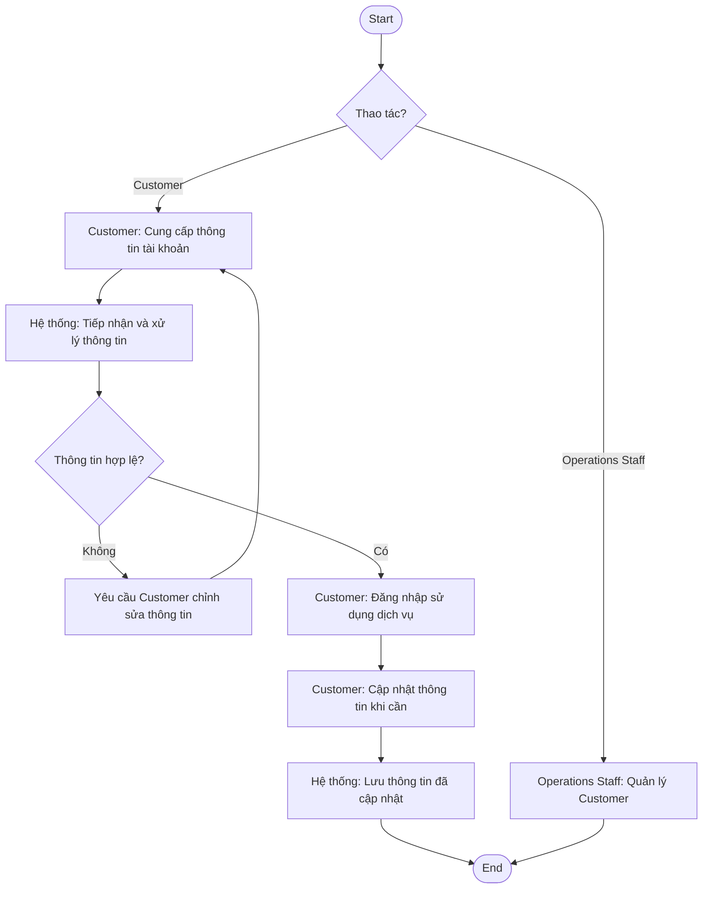

---

## 7.2. BP-02 — Quản lý tài khoản tài xế và phương tiện

**BR liên quan:** BR-02

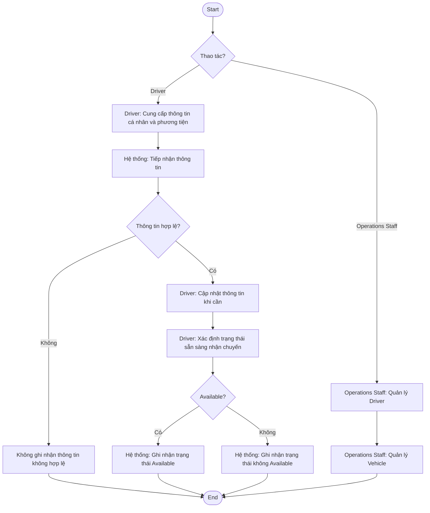

---

## 7.3. BP-03 — Đặt chuyến xe

**BR liên quan:** BR-03, BR-16

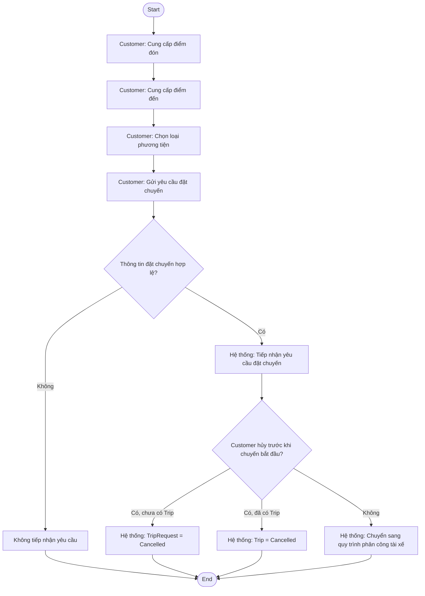

---

## 7.4. BP-04 — Phân công tài xế

**BR liên quan:** BR-04, BR-17

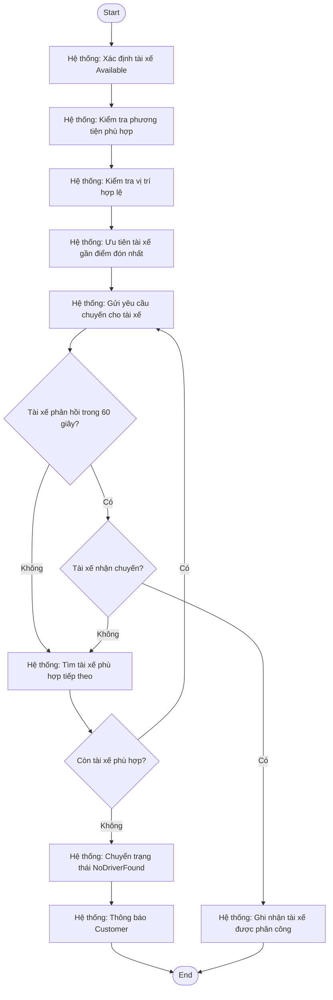

---

## 7.5. BP-05 — Thực hiện chuyến xe

**BR liên quan:** BR-05, BR-06

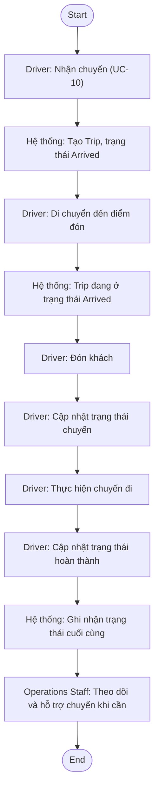

---

## 7.6. BP-06 — Theo dõi chuyến xe và vị trí tài xế

**BR liên quan:** BR-07, BR-15

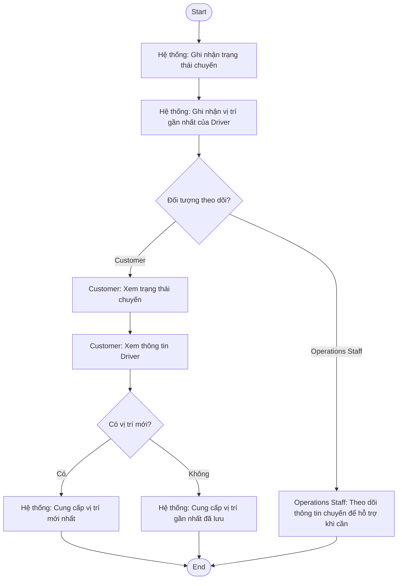

---

## 7.7. BP-07 — Tính cước và thanh toán

**BR liên quan:** BR-08, BR-09

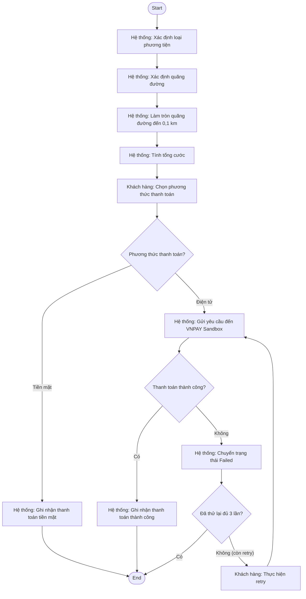

---

## 7.8. BP-08 — Thông báo chuyến xe và thanh toán

**BR liên quan:** BR-10

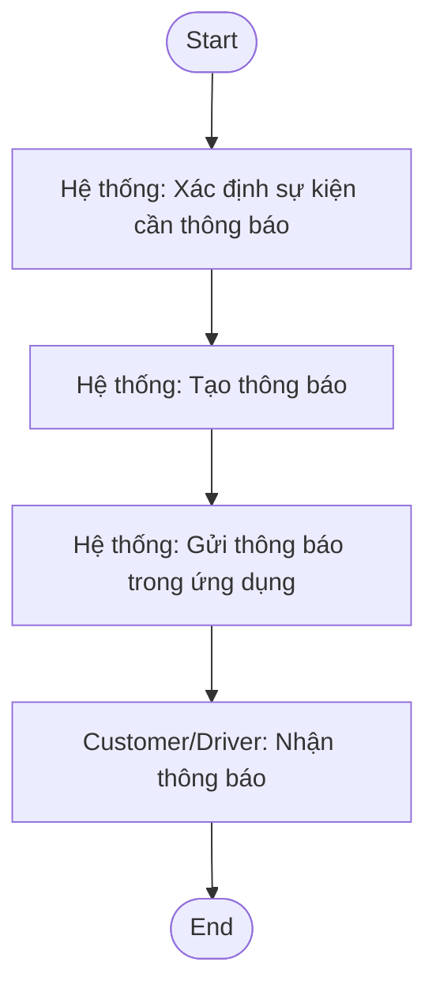

**Các sự kiện thông báo:**

- Yêu cầu đặt chuyến được tiếp nhận.
- Tài xế nhận chuyến.
- Tài xế đến điểm đón.
- Chuyến hoàn thành.
- Kết quả thanh toán.

---

## 7.9. BP-09 — Đánh giá chuyến xe

**BR liên quan:** BR-11

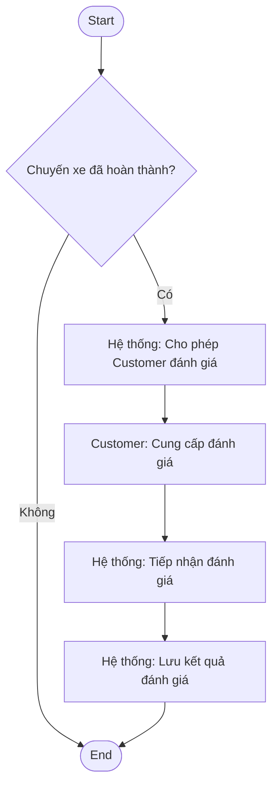

---

## 7.10. BP-10 — Vận hành và hỗ trợ hoạt động hệ thống

**BR liên quan:** BR-12, BR-13, BR-14

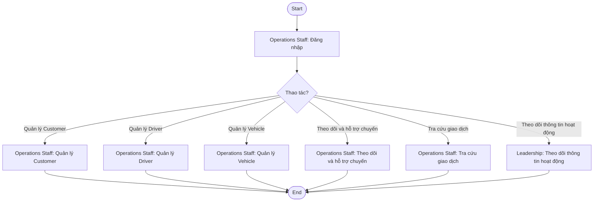

**Phạm vi quản lý của Operations Staff:**

- Customer: CRUD.
- Driver: CRUD.
- Vehicle: CRUD.
- Trip: chỉ theo dõi và hỗ trợ, không CRUD.
- Transaction: tra cứu.

---

## 7.11. BP-11 — Mở rộng dịch vụ và phương thức hỗ trợ

**BR liên quan:** BR-18

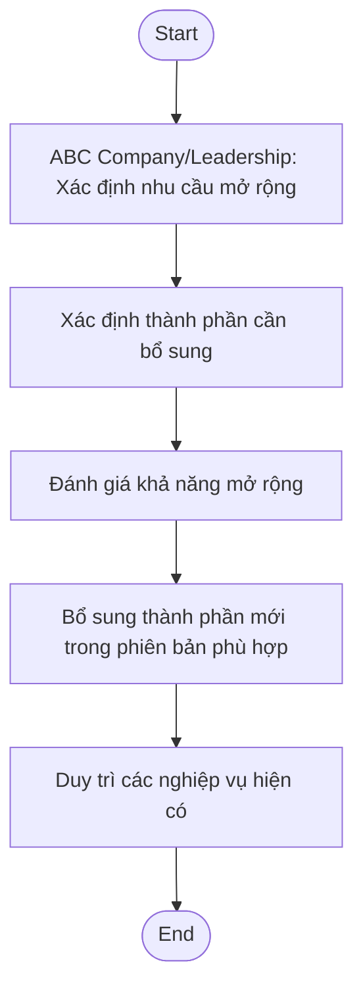

**Các thành phần có thể mở rộng:**

- Loại dịch vụ.
- Phương thức thanh toán.
- Nhà cung cấp thanh toán.
- Kênh thông báo.

---

## 7.12. Ma trận BP → Sơ đồ

| BP ID | Tên Business Process                    | Sơ đồ | Start | End |
| ----- | --------------------------------------- | ----- | ----- | --- |
| BP-01 | Quản lý tài khoản khách hàng            | Có    | Có    | Có  |
| BP-02 | Quản lý tài khoản tài xế và phương tiện | Có    | Có    | Có  |
| BP-03 | Đặt chuyến xe                           | Có    | Có    | Có  |
| BP-04 | Phân công tài xế                        | Có    | Có    | Có  |
| BP-05 | Thực hiện chuyến xe                     | Có    | Có    | Có  |
| BP-06 | Theo dõi chuyến xe và vị trí tài xế     | Có    | Có    | Có  |
| BP-07 | Tính cước và thanh toán                 | Có    | Có    | Có  |
| BP-08 | Thông báo chuyến xe và thanh toán       | Có    | Có    | Có  |
| BP-09 | Đánh giá chuyến xe                      | Có    | Có    | Có  |
| BP-10 | Vận hành và hỗ trợ hoạt động hệ thống   | Có    | Có    | Có  |
| BP-11 | Mở rộng dịch vụ và phương thức hỗ trợ   | Có    | Có    | Có  |

# 8. FUNCTIONAL REQUIREMENTS

## 8.1. Danh sách Functional Requirements

| FR ID | Functional Requirement               | Mô tả                                                                                               | BR           | BP    | Stakeholder    |
| ----- | ------------------------------------ | --------------------------------------------------------------------------------------------------- | ------------ | ----- | -------------- |
| FR-01 | Tạo tài khoản khách hàng             | Cho phép khách hàng tạo tài khoản cá nhân.                                                          | BR-01        | BP-01 | STK-01         |
| FR-02 | Đăng nhập và cập nhật thông tin      | Cho phép khách hàng đăng nhập và cập nhật thông tin cá nhân.                                        | BR-01        | BP-01 | STK-01         |
| FR-03 | Quản lý thông tin tài xế             | Cho phép tài xế cung cấp và cập nhật thông tin cá nhân; Operations Staff quản lý thông tin Driver.  | BR-02        | BP-02 | STK-02, STK-03 |
| FR-04 | Quản lý thông tin phương tiện        | Cho phép tài xế cung cấp thông tin phương tiện; Operations Staff quản lý thông tin Vehicle.         | BR-02        | BP-02 | STK-02, STK-03 |
| FR-05 | Cập nhật trạng thái sẵn sàng         | Cho phép tài xế cập nhật trạng thái sẵn sàng nhận chuyến.                                           | BR-02        | BP-02 | STK-02         |
| FR-06 | Nhập thông tin đặt chuyến            | Cho phép khách hàng nhập điểm đón, điểm đến và lựa chọn loại phương tiện.                           | BR-03        | BP-03 | STK-01         |
| FR-07 | Gửi yêu cầu đặt chuyến               | Cho phép khách hàng gửi yêu cầu đặt chuyến đến hệ thống.                                            | BR-03        | BP-03 | STK-01         |
| FR-08 | Hủy chuyến                           | Cho phép khách hàng hủy chuyến trước khi chuyến bắt đầu.                                            | BR-16        | BP-03 | STK-01         |
| FR-09 | Xác định tài xế phù hợp              | Xác định tài xế Available, có phương tiện phù hợp và vị trí hợp lệ.                                 | BR-04        | BP-04 | STK-02         |
| FR-10 | Ưu tiên tài xế gần nhất              | Ưu tiên tài xế phù hợp có vị trí gần điểm đón nhất.                                                 | BR-04        | BP-04 | STK-02         |
| FR-11 | Gửi yêu cầu đến tài xế               | Gửi request đến tài xế, chờ phản hồi tối đa 60 giây và ghi nhận kết quả phản hồi.                   | BR-04, BR-17 | BP-04 | STK-02         |
| FR-12 | Tìm tài xế tiếp theo                 | Tiếp tục tìm tài xế khác khi request trước bị từ chối hoặc không có phản hồi.                       | BR-17        | BP-04 | STK-02         |
| FR-13 | Thông báo không tìm thấy tài xế      | Thông báo cho khách hàng khi không còn tài xế phù hợp và yêu cầu chuyển sang NoDriverFound.         | BR-17        | BP-04 | STK-01         |
| FR-14 | Ghi nhận nhận chuyến                 | UC-10 ghi nhận Driver chọn nhận và cập nhật TripRequest thành `Assigned`.                           | BR-05        | BP-05 | STK-02         |
| FR-15 | Cập nhật trạng thái chuyến           | Cho phép tài xế cập nhật trạng thái trong quá trình thực hiện chuyến.                               | BR-06        | BP-05 | STK-02         |
| FR-16 | Ghi nhận trạng thái cuối chuyến      | Ghi nhận trạng thái cuối cùng của chuyến.                                                           | BR-06        | BP-05 | STK-01, STK-02 |
| FR-17 | Theo dõi trạng thái chuyến           | Cho phép khách hàng xem trạng thái chuyến và thông tin tài xế được phân công.                       | BR-07        | BP-06 | STK-01         |
| FR-18 | Ghi nhận và cung cấp vị trí gần nhất | Ghi nhận và cung cấp vị trí gần nhất được lưu của tài xế.                                           | BR-15        | BP-06 | STK-01, STK-02 |
| FR-19 | Tính cước chuyến xe                  | Tính tổng cước dựa trên loại phương tiện và quãng đường theo quy định.                              | BR-08        | BP-07 | STK-01         |
| FR-20 | Lựa chọn phương thức thanh toán      | Cho phép khách hàng lựa chọn thanh toán bằng tiền mặt hoặc điện tử.                                 | BR-09        | BP-07 | STK-01         |
| FR-21 | Thanh toán điện tử                   | Xử lý thanh toán điện tử thông qua VNPAY Sandbox và ghi nhận kết quả.                               | BR-09        | BP-07 | STK-01, STK-06 |
| FR-22 | Xử lý thanh toán thất bại            | Cho phép khách hàng thực hiện lại thanh toán điện tử khi thanh toán thất bại theo quy định.         | BR-09        | BP-07 | STK-01         |
| FR-23 | Gửi thông báo                        | Gửi thông báo trong ứng dụng về các sự kiện quan trọng của chuyến xe và thanh toán.                 | BR-10        | BP-08 | STK-01, STK-02 |
| FR-24 | Đánh giá tài xế                      | Cho phép khách hàng đánh giá tài xế sau khi chuyến hoàn thành.                                      | BR-11        | BP-09 | STK-01         |
| FR-25 | Quản lý khách hàng                   | Cho phép Operations Staff quản lý thông tin Customer.                                               | BR-12        | BP-10 | STK-03         |
| FR-26 | Quản lý tài xế                       | Cho phép Operations Staff quản lý thông tin Driver.                                                 | BR-12        | BP-10 | STK-03         |
| FR-27 | Quản lý phương tiện                  | Cho phép Operations Staff quản lý thông tin Vehicle.                                                | BR-12        | BP-10 | STK-03         |
| FR-28 | Theo dõi và hỗ trợ chuyến xe         | Cho phép Operations Staff theo dõi và hỗ trợ xử lý chuyến xe.                                       | BR-12        | BP-10 | STK-03         |
| FR-29 | Tra cứu giao dịch                    | Cho phép Operations Staff tra cứu thông tin giao dịch.                                              | BR-13        | BP-10 | STK-03         |
| FR-30 | Theo dõi thông tin hoạt động         | Cung cấp thông tin hoạt động hệ thống cho Leadership theo phạm vi được quy định.                    | BR-14        | BP-10 | STK-05         |
| FR-31 | Mở rộng loại dịch vụ                 | Hỗ trợ khả năng bổ sung các loại dịch vụ mới trong các phiên bản tương lai.                         | BR-18        | BP-11 | STK-04, STK-05 |
| FR-32 | Mở rộng phương thức thanh toán       | Hỗ trợ khả năng bổ sung phương thức hoặc nhà cung cấp thanh toán mới trong các phiên bản tương lai. | BR-18        | BP-11 | STK-04, STK-05 |
| FR-33 | Mở rộng kênh thông báo               | Hỗ trợ khả năng bổ sung các kênh thông báo mới trong các phiên bản tương lai.                       | BR-18        | BP-11 | STK-04, STK-05 |

---

## 8.2. Quy tắc chức năng chính

Các Functional Requirements được thực hiện theo các quy tắc nghiệp vụ đã xác định:

1. Tài xế được phân công phải ở trạng thái **Available**, có phương tiện phù hợp và vị trí hợp lệ.
2. Hệ thống ưu tiên tài xế gần điểm đón nhất.
3. Tài xế có **60 giây** để phản hồi yêu cầu chuyến.
4. Tài xế từ chối hoặc không phản hồi thì hệ thống tiếp tục tìm tài xế khác.
5. Không tìm được tài xế phù hợp thì hệ thống thông báo **NoDriverFound** và kết thúc yêu cầu.
6. Khách hàng được hủy chuyến trước khi chuyến bắt đầu và không bị tính phí hủy.
7. Cước chuyến được tính theo loại phương tiện và quãng đường; quãng đường được làm tròn đến **0,1 km**.
8. Không áp dụng phụ phí theo giờ cao điểm, thời tiết, khu vực hoặc điều kiện đặc biệt.
9. Thanh toán điện tử sử dụng **VNPAY Sandbox**.
10. Khi thanh toán điện tử thất bại, khách hàng được phép thử lại tối đa **3 lần**.
11. Thông báo được gửi thông qua **ứng dụng**; không sử dụng SMS hoặc email trong phiên bản hiện tại.
12. Fleet lưu vị trí mới nhất; hệ thống phát vị trí và ETA real-time theo mục 18.1, không lưu lịch sử tuyến đường.
13. Dữ liệu được lưu trữ **tối thiểu 12 tháng**; phiên bản hiện tại không thực hiện tự động xóa dữ liệu.
14. Phân quyền vận hành gồm OperationsStaff và OperationsSupervisor theo mục 18.2.
15. Kiến trúc chức năng được định hướng để có thể mở rộng loại dịch vụ, phương thức hoặc nhà cung cấp thanh toán và kênh thông báo trong các phiên bản tương lai.

---

## 8.3. Ma trận truy xuất BR – BP – FR

| BR    | BP    | Functional Requirements    |
| ----- | ----- | -------------------------- |
| BR-01 | BP-01 | FR-01, FR-02               |
| BR-02 | BP-02 | FR-03, FR-04, FR-05        |
| BR-03 | BP-03 | FR-06, FR-07               |
| BR-04 | BP-04 | FR-09, FR-10, FR-11        |
| BR-05 | BP-05 | FR-14                      |
| BR-06 | BP-05 | FR-15, FR-16               |
| BR-07 | BP-06 | FR-17                      |
| BR-08 | BP-07 | FR-19                      |
| BR-09 | BP-07 | FR-20, FR-21, FR-22        |
| BR-10 | BP-08 | FR-23                      |
| BR-11 | BP-09 | FR-24                      |
| BR-12 | BP-10 | FR-25, FR-26, FR-27, FR-28 |
| BR-13 | BP-10 | FR-29                      |
| BR-14 | BP-10 | FR-30                      |
| BR-15 | BP-06 | FR-18                      |
| BR-16 | BP-03 | FR-08                      |
| BR-17 | BP-04 | FR-11, FR-12, FR-13        |
| BR-18 | BP-11 | FR-31, FR-32, FR-33        |

# 9. PHÂN RÃ FUNCTIONAL REQUIREMENTS

## 9.1. Danh sách Functional Requirements

| FR cha | FR con  | Yêu cầu chức năng                                                                                | BR           | BP    | Stakeholder    | Trạng thái  |
| ------ | ------- | ------------------------------------------------------------------------------------------------ | ------------ | ----- | -------------- | ----------- |
| FR-01  | FR-01.1 | Cho phép khách hàng đăng ký tài khoản.                                                           | BR-01        | BP-01 | STK-01         | Đã xác nhận |
| FR-01  | FR-01.2 | Cho phép khách hàng cung cấp thông tin tài khoản.                                                | BR-01        | BP-01 | STK-01         | Đã xác nhận |
| FR-02  | FR-02.1 | Cho phép khách hàng đăng nhập hệ thống.                                                          | BR-01        | BP-01 | STK-01         | Đã xác nhận |
| FR-02  | FR-02.2 | Cho phép khách hàng cập nhật thông tin cá nhân.                                                  | BR-01        | BP-01 | STK-01         | Đã xác nhận |
| FR-03  | FR-03.1 | Cho phép tài xế cung cấp và cập nhật thông tin cá nhân.                                          | BR-02        | BP-02 | STK-02         | Đã xác nhận |
| FR-03  | FR-03.2 | Cho phép Operations Staff quản lý thông tin Driver.                                              | BR-02        | BP-02 | STK-03         | Đã xác nhận |
| FR-04  | FR-04.1 | Cho phép tài xế cung cấp thông tin phương tiện.                                                  | BR-02        | BP-02 | STK-02         | Đã xác nhận |
| FR-04  | FR-04.2 | Cho phép Operations Staff quản lý thông tin Vehicle.                                             | BR-02        | BP-02 | STK-03         | Đã xác nhận |
| FR-05  | FR-05.1 | Cho phép tài xế cập nhật trạng thái sẵn sàng nhận chuyến.                                        | BR-02        | BP-02 | STK-02         | Đã xác nhận |
| FR-06  | FR-06.1 | Cho phép khách hàng nhập điểm đón.                                                               | BR-03        | BP-03 | STK-01         | Đã xác nhận |
| FR-06  | FR-06.2 | Cho phép khách hàng nhập điểm đến.                                                               | BR-03        | BP-03 | STK-01         | Đã xác nhận |
| FR-06  | FR-06.3 | Cho phép khách hàng lựa chọn loại phương tiện.                                                   | BR-03        | BP-03 | STK-01         | Đã xác nhận |
| FR-07  | FR-07.1 | Cho phép khách hàng gửi yêu cầu đặt chuyến.                                                      | BR-03        | BP-03 | STK-01         | Đã xác nhận |
| FR-08  | FR-08.1 | Cho phép khách hàng hủy chuyến trước khi chuyến bắt đầu.                                         | BR-16        | BP-03 | STK-01         | Đã xác nhận |
| FR-09  | FR-09.1 | Xác định tài xế đang ở trạng thái Available.                                                     | BR-04        | BP-04 | STK-02         | Đã xác nhận |
| FR-09  | FR-09.2 | Xác định tài xế có phương tiện phù hợp với yêu cầu chuyến.                                       | BR-04        | BP-04 | STK-02         | Đã xác nhận |
| FR-09  | FR-09.3 | Kiểm tra vị trí hợp lệ của tài xế.                                                               | BR-04        | BP-04 | STK-02         | Đã xác nhận |
| FR-10  | FR-10.1 | Xác định tài xế phù hợp gần điểm đón nhất.                                                       | BR-04        | BP-04 | STK-02         | Đã xác nhận |
| FR-11  | FR-11.1 | Gửi yêu cầu chuyến đến tài xế phù hợp.                                                           | BR-04        | BP-04 | STK-02         | Đã xác nhận |
| FR-11  | FR-11.2 | Ghi nhận phản hồi của tài xế trong thời gian 60 giây.                                            | BR-04, BR-17 | BP-04 | STK-02         | Đã xác nhận |
| FR-12  | FR-12.1 | Tiếp tục tìm tài xế khác khi tài xế từ chối yêu cầu.                                             | BR-17        | BP-04 | STK-02         | Đã xác nhận |
| FR-12  | FR-12.2 | Tiếp tục tìm tài xế khác khi tài xế không phản hồi.                                              | BR-17        | BP-04 | STK-02         | Đã xác nhận |
| FR-13  | FR-13.1 | Xác định trạng thái NoDriverFound khi không còn tài xế phù hợp.                                  | BR-17        | BP-04 | STK-01         | Đã xác nhận |
| FR-13  | FR-13.2 | Thông báo cho khách hàng khi không tìm thấy tài xế.                                              | BR-17        | BP-04 | STK-01         | Đã xác nhận |
| FR-14  | FR-14.1 | Ghi nhận tài xế chấp nhận yêu cầu chuyến.                                                        | BR-05        | BP-05 | STK-02         | Đã xác nhận |
| FR-15  | FR-15.1 | Cho phép tài xế cập nhật trạng thái chuyến.                                                      | BR-06        | BP-05 | STK-02         | Đã xác nhận |
| FR-16  | FR-16.1 | Ghi nhận chuyến hoàn thành.                                                                      | BR-06        | BP-05 | STK-01, STK-02 | Đã xác nhận |
| FR-16  | FR-16.2 | Ghi nhận chuyến bị hủy.                                                                          | BR-06        | BP-05 | STK-01, STK-02 | Đã xác nhận |
| FR-17  | FR-17.1 | Cho phép khách hàng xem trạng thái hiện tại của chuyến.                                          | BR-07        | BP-06 | STK-01         | Đã xác nhận |
| FR-17  | FR-17.2 | Cho phép khách hàng xem thông tin tài xế được phân công.                                         | BR-07        | BP-06 | STK-01         | Đã xác nhận |
| FR-18  | FR-18.1 | Ghi nhận vị trí gần nhất được lưu của tài xế.                                                    | BR-15        | BP-06 | STK-02         | Đã xác nhận |
| FR-18  | FR-18.2 | Cung cấp vị trí gần nhất được lưu của tài xế cho khách hàng.                                     | BR-15        | BP-06 | STK-01         | Đã xác nhận |
| FR-19  | FR-19.1 | Xác định mức cước theo loại phương tiện.                                                         | BR-08        | BP-07 | STK-01         | Đã xác nhận |
| FR-19  | FR-19.2 | Xác định quãng đường của chuyến.                                                                 | BR-08        | BP-07 | STK-01         | Đã xác nhận |
| FR-19  | FR-19.3 | Làm tròn quãng đường đến 0,1 km.                                                                 | BR-08        | BP-07 | STK-01         | Đã xác nhận |
| FR-19  | FR-19.4 | Tính tổng cước dựa trên loại phương tiện và quãng đường đã làm tròn.                             | BR-08        | BP-07 | STK-01         | Đã xác nhận |
| FR-20  | FR-20.1 | Cho phép khách hàng lựa chọn thanh toán bằng tiền mặt.                                           | BR-09        | BP-07 | STK-01         | Đã xác nhận |
| FR-20  | FR-20.2 | Cho phép khách hàng lựa chọn thanh toán điện tử.                                                 | BR-09        | BP-07 | STK-01         | Đã xác nhận |
| FR-21  | FR-21.1 | Gửi yêu cầu thanh toán điện tử qua VNPAY Sandbox.                                                | BR-09        | BP-07 | STK-01, STK-06 | Đã xác nhận |
| FR-21  | FR-21.2 | Ghi nhận kết quả thanh toán điện tử.                                                             | BR-09        | BP-07 | STK-01, STK-06 | Đã xác nhận |
| FR-22  | FR-22.1 | Cho phép thực hiện lại thanh toán khi thanh toán điện tử thất bại.                               | BR-09        | BP-07 | STK-01         | Đã xác nhận |
| FR-22  | FR-22.2 | Kết thúc xử lý thanh toán khi đã retry 3 lần sau lần đầu (tối đa 4 attempts) nhưng vẫn thất bại. | BR-09        | BP-07 | STK-01         | Đã xác nhận |
| FR-23  | FR-23.1 | Gửi thông báo khi yêu cầu chuyến được tiếp nhận.                                                 | BR-10        | BP-08 | STK-01         | Đã xác nhận |
| FR-23  | FR-23.2 | Gửi thông báo khi tài xế nhận chuyến.                                                            | BR-10        | BP-08 | STK-01, STK-02 | Đã xác nhận |
| FR-23  | FR-23.3 | Gửi thông báo khi tài xế đến điểm đón.                                                           | BR-10        | BP-08 | STK-01         | Đã xác nhận |
| FR-23  | FR-23.4 | Gửi thông báo khi chuyến hoàn thành.                                                             | BR-10        | BP-08 | STK-01, STK-02 | Đã xác nhận |
| FR-23  | FR-23.5 | Gửi thông báo về kết quả thanh toán.                                                             | BR-10        | BP-08 | STK-01         | Đã xác nhận |
| FR-24  | FR-24.1 | Cho phép khách hàng đánh giá tài xế sau khi chuyến hoàn thành.                                   | BR-11        | BP-09 | STK-01         | Đã xác nhận |
| FR-25  | FR-25.1 | Cho phép Operations Staff quản lý thông tin Customer.                                            | BR-12        | BP-10 | STK-03         | Đã xác nhận |
| FR-26  | FR-26.1 | Cho phép Operations Staff quản lý thông tin Driver.                                              | BR-12        | BP-10 | STK-03         | Đã xác nhận |
| FR-27  | FR-27.1 | Cho phép Operations Staff quản lý thông tin Vehicle.                                             | BR-12        | BP-10 | STK-03         | Đã xác nhận |
| FR-28  | FR-28.1 | Cho phép Operations Staff theo dõi chuyến xe.                                                    | BR-12        | BP-10 | STK-03         | Đã xác nhận |
| FR-28  | FR-28.2 | Cho phép Operations Staff hỗ trợ xử lý chuyến xe.                                                | BR-12        | BP-10 | STK-03         | Đã xác nhận |
| FR-29  | FR-29.1 | Cho phép Operations Staff tra cứu thông tin giao dịch.                                           | BR-13        | BP-10 | STK-03         | Đã xác nhận |
| FR-30  | FR-30.1 | Cung cấp thông tin hoạt động hệ thống cho Leadership theo phạm vi được quy định.                 | BR-14        | BP-10 | STK-05         | Đã xác nhận |
| FR-31  | FR-31.1 | Hỗ trợ khả năng bổ sung loại dịch vụ mới trong các phiên bản tương lai.                          | BR-18        | BP-11 | STK-04, STK-05 | Đã xác nhận |
| FR-32  | FR-32.1 | Hỗ trợ khả năng bổ sung phương thức thanh toán mới trong các phiên bản tương lai.                | BR-18        | BP-11 | STK-04, STK-05 | Đã xác nhận |
| FR-32  | FR-32.2 | Hỗ trợ khả năng bổ sung nhà cung cấp thanh toán mới trong các phiên bản tương lai.               | BR-18        | BP-11 | STK-04, STK-05 | Đã xác nhận |
| FR-33  | FR-33.1 | Hỗ trợ khả năng bổ sung kênh thông báo mới trong các phiên bản tương lai.                        | BR-18        | BP-11 | STK-04, STK-05 | Đã xác nhận |

---

## 9.2. FR không phân rã

| FR    | Yêu cầu chức năng            |
| ----- | ---------------------------- |
| FR-05 | Cập nhật trạng thái sẵn sàng |
| FR-07 | Gửi yêu cầu đặt chuyến       |
| FR-08 | Hủy chuyến                   |
| FR-10 | Ưu tiên tài xế gần nhất      |
| FR-14 | Ghi nhận nhận chuyến         |
| FR-15 | Cập nhật trạng thái chuyến   |
| FR-24 | Đánh giá tài xế              |
| FR-25 | Quản lý khách hàng           |
| FR-26 | Quản lý tài xế               |
| FR-27 | Quản lý phương tiện          |
| FR-29 | Tra cứu giao dịch            |
| FR-31 | Mở rộng loại dịch vụ         |
| FR-33 | Mở rộng kênh thông báo       |

---

## 9.3. Ma trận FR cha – FR con

| FR cha | FR con                                      |
| ------ | ------------------------------------------- |
| FR-01  | FR-01.1, FR-01.2                            |
| FR-02  | FR-02.1, FR-02.2                            |
| FR-03  | FR-03.1, FR-03.2                            |
| FR-04  | FR-04.1, FR-04.2                            |
| FR-05  | Không phân rã                               |
| FR-06  | FR-06.1, FR-06.2, FR-06.3                   |
| FR-07  | Không phân rã                               |
| FR-08  | Không phân rã                               |
| FR-09  | FR-09.1, FR-09.2, FR-09.3                   |
| FR-10  | Không phân rã                               |
| FR-11  | FR-11.1, FR-11.2                            |
| FR-12  | FR-12.1, FR-12.2                            |
| FR-13  | FR-13.1, FR-13.2                            |
| FR-14  | Không phân rã                               |
| FR-15  | Không phân rã                               |
| FR-16  | FR-16.1, FR-16.2                            |
| FR-17  | FR-17.1, FR-17.2                            |
| FR-18  | FR-18.1, FR-18.2                            |
| FR-19  | FR-19.1, FR-19.2, FR-19.3, FR-19.4          |
| FR-20  | FR-20.1, FR-20.2                            |
| FR-21  | FR-21.1, FR-21.2                            |
| FR-22  | FR-22.1, FR-22.2                            |
| FR-23  | FR-23.1, FR-23.2, FR-23.3, FR-23.4, FR-23.5 |
| FR-24  | Không phân rã                               |
| FR-25  | Không phân rã                               |
| FR-26  | Không phân rã                               |
| FR-27  | Không phân rã                               |
| FR-28  | FR-28.1, FR-28.2                            |
| FR-29  | Không phân rã                               |
| FR-30  | FR-30.1                                     |
| FR-31  | Không phân rã                               |
| FR-32  | FR-32.1, FR-32.2                            |
| FR-33  | Không phân rã                               |

# 10. BUSINESS RULES VÀ BUSINESS EXCEPTIONS

## 10.1. Business Rules

| Rule ID  | Tên quy tắc              | Nội dung quy tắc                                                                                                                                               | Điều kiện áp dụng                   | FR/BP             | Stakeholder            |
| -------- | ------------------------ | -------------------------------------------------------------------------------------------------------------------------------------------------------------- | ----------------------------------- | ----------------- | ---------------------- |
| BRULE-01 | Điều kiện tài xế phù hợp | Tài xế được phân công phải ở trạng thái Available, có phương tiện phù hợp với loại phương tiện khách hàng yêu cầu và có vị trí hợp lệ được lưu trong hệ thống. | Khi tìm tài xế                      | FR-09/BP-04       | STK-02                 |
| BRULE-02 | Ưu tiên tài xế gần nhất  | Hệ thống ưu tiên tài xế phù hợp có vị trí gần điểm đón nhất.                                                                                                   | Khi có nhiều tài xế phù hợp         | FR-10/BP-04       | STK-01, STK-02         |
| BRULE-03 | Thời gian phản hồi       | Tài xế có tối đa 60 giây để phản hồi yêu cầu chuyến.                                                                                                           | Khi yêu cầu chuyến được gửi         | FR-11/BP-04       | STK-02                 |
| BRULE-04 | Tìm tài xế tiếp theo     | Khi tài xế từ chối hoặc không phản hồi trong 60 giây, hệ thống tiếp tục tìm tài xế phù hợp khác.                                                               | Tài xế từ chối hoặc không phản hồi  | FR-12/BP-04       | STK-02                 |
| BRULE-05 | Không tìm thấy tài xế    | Khi không còn tài xế phù hợp, yêu cầu được chuyển sang trạng thái NoDriverFound và khách hàng được thông báo.                                                  | Không có tài xế phù hợp             | FR-13/BP-04       | STK-01                 |
| BRULE-06 | Hủy chuyến               | Khách hàng được hủy chuyến trước khi chuyến bắt đầu và không bị tính phí hủy.                                                                                  | Chuyến chưa bắt đầu                 | FR-08/BP-03       | STK-01                 |
| BRULE-07 | Tính cước                | Tổng cước bằng cước cơ bản cộng với quãng đường nhân đơn giá theo km tương ứng với loại phương tiện.                                                           | Khi tính cước                       | FR-19/BP-07       | STK-01                 |
| BRULE-08 | Làm tròn quãng đường     | Quãng đường tính cước được làm tròn đến 0,1 km.                                                                                                                | Khi tính cước                       | FR-19/BP-07       | STK-01                 |
| BRULE-09 | Không áp dụng phụ phí    | Không áp dụng phụ phí theo giờ cao điểm, thời tiết, khu vực hoặc điều kiện đặc biệt.                                                                           | Khi tính cước                       | FR-19/BP-07       | STK-01                 |
| BRULE-10 | Phương thức thanh toán   | Khách hàng được thanh toán bằng tiền mặt hoặc thanh toán điện tử.                                                                                              | Khi thanh toán                      | FR-20/BP-07       | STK-01                 |
| BRULE-11 | Thanh toán điện tử       | Thanh toán điện tử trong phiên bản hiện tại sử dụng VNPAY Sandbox.                                                                                             | Khi chọn thanh toán điện tử         | FR-21/BP-07       | STK-01, STK-06         |
| BRULE-12 | Thử lại thanh toán       | Khi thanh toán điện tử thất bại, khách hàng được retry 3 lần sau lần đầu, tối đa 4 attempts.                                                                   | Thanh toán điện tử thất bại         | FR-22/BP-07       | STK-01                 |
| BRULE-13 | Kênh thông báo           | Thông báo nghiệp vụ được gửi trong ứng dụng; phiên bản hiện tại không sử dụng SMS hoặc email.                                                                  | Khi phát sinh sự kiện cần thông báo | FR-23/BP-08       | STK-01, STK-02         |
| BRULE-14 | Vị trí tài xế            | Fleet chỉ lưu vị trí gần nhất; hệ thống phát vị trí/ETA real-time theo mục 18.1, không lưu lịch sử tuyến đường.                                                            | Khi cập nhật hoặc xem vị trí        | FR-18/BP-06       | STK-01, STK-02         |
| BRULE-15 | Lưu trữ dữ liệu          | Dữ liệu hệ thống được lưu trữ tối thiểu 12 tháng và phiên bản hiện tại không tự động xóa dữ liệu.                                                              | Khi lưu trữ dữ liệu                 | Toàn hệ thống     | STK-01, STK-02, STK-03 |
| BRULE-16 | Vai trò vận hành         | OperationsStaff quản lý/xem/hỗ trợ; OperationsSupervisor có thêm can thiệp giới hạn theo mục 18.2.                                                            | Khi thực hiện chức năng vận hành    | FR-25–FR-29/BP-10 | STK-03                 |
| BRULE-17 | Khả năng mở rộng         | Hệ thống hỗ trợ định hướng bổ sung loại dịch vụ, phương thức hoặc nhà cung cấp thanh toán và kênh thông báo trong các phiên bản tương lai.                     | Khi mở rộng hệ thống                | FR-31–FR-33/BP-11 | STK-04, STK-05         |

### 10.1.1. Mức cước

| Loại phương tiện | Cước cơ bản | Đơn giá/km |
| ---------------- | ----------: | ---------: |
| Xe máy           |  10.000 VND |  8.000 VND |
| Ô tô 4 chỗ       |  15.000 VND | 12.000 VND |
| Ô tô 7 chỗ       |  20.000 VND | 14.000 VND |

**Công thức:**

> Tổng cước = Cước cơ bản + (Quãng đường × Đơn giá/km)

---

## 10.2. Business Exceptions

| Exception ID | Tên ngoại lệ                      | Điều kiện xảy ra                                                   | Cách xử lý                                          | Kết quả                                                  | FR/BP              |
| ------------ | --------------------------------- | ------------------------------------------------------------------ | --------------------------------------------------- | -------------------------------------------------------- | ------------------ |
| EX-01        | Thông tin tài khoản không hợp lệ  | Thông tin tài khoản không đáp ứng điều kiện yêu cầu.               | Yêu cầu bổ sung hoặc chỉnh sửa thông tin.           | Chưa hoàn tất xử lý tài khoản.                           | FR-01, FR-02/BP-01 |
| EX-02        | Thông tin đặt chuyến không hợp lệ | Thông tin điểm đón, điểm đến hoặc loại phương tiện không hợp lệ.   | Yêu cầu chỉnh sửa thông tin trước khi tiếp tục.     | Yêu cầu chưa được tiếp nhận.                             | FR-06, FR-07/BP-03 |
| EX-03        | Tài xế từ chối chuyến             | Tài xế nhận được yêu cầu nhưng từ chối.                            | Tiếp tục tìm tài xế phù hợp khác.                   | Quá trình phân công tiếp tục.                            | FR-11, FR-12/BP-04 |
| EX-04        | Tài xế không phản hồi             | Tài xế không phản hồi trong 60 giây.                               | Tiếp tục tìm tài xế phù hợp khác.                   | Quá trình phân công tiếp tục.                            | FR-11, FR-12/BP-04 |
| EX-05        | Không tìm thấy tài xế             | Không còn tài xế phù hợp để phân công.                             | Chuyển sang NoDriverFound và thông báo khách hàng.  | Yêu cầu chuyến kết thúc; khách hàng cần tạo yêu cầu mới. | FR-13/BP-04        |
| EX-06        | Hủy chuyến                        | Khách hàng hủy chuyến trước khi chuyến bắt đầu.                    | Hủy chuyến và cập nhật trạng thái.                  | Chuyến được hủy, không tính phí hủy.                     | FR-08/BP-03        |
| EX-07        | Thanh toán điện tử thất bại       | VNPAY Sandbox trả về kết quả thanh toán thất bại.                  | Thông báo Failed và cho phép thử lại theo quy định. | Thanh toán chưa thành công.                              | FR-21, FR-22/BP-07 |
| EX-08        | Vượt số lần thử lại thanh toán    | Thanh toán tiếp tục thất bại sau khi đã đạt số lần thử lại tối đa. | Dừng các lần thử lại tiếp theo.                     | Thanh toán ở trạng thái thất bại.                        | FR-22/BP-07        |

---

## 10.3. Ma trận FR – Business Rule/Requirement

| FR                                | Business Rule/Requirement trực tiếp |
| --------------------------------- | ----------------------------------- |
| FR-01, FR-02                      | BR-01                               |
| FR-03, FR-04, FR-05               | BR-02                               |
| FR-06, FR-07                      | BR-03                               |
| FR-08                             | BRULE-06                            |
| FR-09                             | BRULE-01                            |
| FR-10                             | BRULE-02                            |
| FR-11                             | BRULE-03                            |
| FR-12                             | BRULE-04                            |
| FR-13                             | BRULE-05                            |
| FR-14                             | BR-05                               |
| FR-15, FR-16                      | BR-06                               |
| FR-17                             | BR-07                               |
| FR-18                             | BRULE-14                            |
| FR-19                             | BRULE-07, BRULE-08, BRULE-09        |
| FR-20                             | BRULE-10                            |
| FR-21                             | BRULE-11                            |
| FR-22                             | BRULE-12                            |
| FR-23                             | BRULE-13                            |
| FR-24                             | BR-11                               |
| FR-25, FR-26, FR-27, FR-28, FR-29 | BRULE-16                            |
| FR-30                             | BR-14                               |
| FR-31, FR-32, FR-33               | BRULE-17                            |

---

## 10.4. Ma trận FR – Business Exception

| FR           | Business Exception |
| ------------ | ------------------ |
| FR-01, FR-02 | EX-01              |
| FR-06, FR-07 | EX-02              |
| FR-11, FR-12 | EX-03, EX-04       |
| FR-13        | EX-05              |
| FR-08        | EX-06              |
| FR-21, FR-22 | EX-07, EX-08       |

# 11. NON-FUNCTIONAL REQUIREMENTS (NFR)

## 11.1. Danh sách NFR

| NFR ID | Nhóm            | Non-Functional Requirement                                                                                                            | FR liên quan | Rule/Exception liên quan | Tiêu chí kiểm thử                                                                                                           | Mức độ | Trạng thái |
| ------ | --------------- | ------------------------------------------------------------------------------------------------------------------------------------- | ------------ | ------------------------ | --------------------------------------------------------------------------------------------------------------------------- | ------ | ---------- |
| NFR-01 | Performance     | Hệ thống phải duy trì khả năng xử lý các chức năng cốt lõi khi nhu cầu sử dụng tăng trong phạm vi của dự án.                          | FR-05–FR-23  | —                        | Kiểm thử các chức năng cốt lõi khi tải tăng và xác nhận hệ thống vẫn xử lý được yêu cầu.                                    | High   | Confirmed  |
| NFR-02 | Security        | Hệ thống phải yêu cầu người dùng xác thực trước khi sử dụng các chức năng yêu cầu đăng nhập.                                          | FR-01–FR-04  | —                        | Thử truy cập chức năng yêu cầu đăng nhập khi chưa xác thực và xác nhận hệ thống không cho phép truy cập.                    | High   | Confirmed  |
| NFR-03 | Security        | Hệ thống phải kiểm soát quyền truy cập đối với các chức năng dành cho Operations Staff.                                               | FR-25–FR-29  | BRULE-16                 | Kiểm thử truy cập các chức năng Operations Staff bằng tài khoản không có quyền và xác nhận hệ thống từ chối truy cập.       | High   | Confirmed  |
| NFR-04 | Security        | Hệ thống phải bảo vệ thông tin cá nhân, thông tin phương tiện, vị trí tài xế và thông tin giao dịch.                                  | FR-01–FR-30  | —                        | Kiểm tra quyền truy cập và khả năng bảo vệ các nhóm dữ liệu được quy định.                                                  | High   | Confirmed  |
| NFR-05 | Security        | Hệ thống không được lưu trữ thông tin nhạy cảm của tài khoản thanh toán điện tử.                                                      | FR-21–FR-22  | BRULE-11                 | Kiểm tra dữ liệu được lưu sau giao dịch và xác nhận không có thông tin tài khoản thanh toán nhạy cảm được lưu trữ.          | High   | Confirmed  |
| NFR-06 | Security        | Hệ thống phải ghi nhận các thao tác quan trọng của Operations Staff.                                                                  | FR-25–FR-29  | —                        | Thực hiện các thao tác quan trọng bằng Operations Staff và kiểm tra việc ghi nhận thao tác.                                 | High   | Confirmed  |
| NFR-07 | Reliability     | Lỗi thanh toán hoặc thông báo không được làm dừng toàn bộ quá trình xử lý chuyến xe.                                                  | FR-21–FR-23  | EX-07                    | Mô phỏng lỗi thanh toán hoặc thông báo và xác nhận các chức năng khác của quá trình chuyến xe vẫn được xử lý theo quy định. | High   | Confirmed  |
| NFR-08 | Reliability     | Hệ thống phải duy trì trạng thái dữ liệu nhất quán khi cập nhật thông tin chuyến xe và thanh toán.                                    | FR-15–FR-22  | —                        | Kiểm thử các trạng thái cập nhật chuyến xe và thanh toán, xác nhận dữ liệu không chuyển sang trạng thái không nhất quán.    | High   | Confirmed  |
| NFR-09 | Maintainability | Hệ thống phải có cấu trúc hỗ trợ việc sửa lỗi và cập nhật các chức năng trong phạm vi dự án.                                          | FR-01–FR-33  | —                        | Thực hiện thay đổi hoặc sửa lỗi đối với chức năng và xác nhận không ảnh hưởng ngoài phạm vi liên quan.                      | Medium | Confirmed  |
| NFR-10 | Scalability     | Hệ thống phải hỗ trợ mở rộng trong tương lai đối với loại dịch vụ, phương thức thanh toán, nhà cung cấp thanh toán và kênh thông báo. | FR-31–FR-33  | BRULE-17                 | Kiểm tra khả năng bổ sung các thành phần mở rộng theo phạm vi đã xác định.                                                  | Medium | Confirmed  |
| NFR-11 | Deployability   | Hệ thống phải hỗ trợ triển khai và cập nhật từng phần trong phạm vi của dự án.                                                        | FR-01–FR-33  | —                        | Kiểm tra khả năng triển khai hoặc cập nhật chức năng mà không yêu cầu thay đổi toàn bộ hệ thống.                            | Medium | Confirmed  |

---

## 11.2. Chi tiết Non-Functional Requirements

### NFR-01 – Performance

**Yêu cầu:**

Hệ thống phải duy trì khả năng xử lý các chức năng cốt lõi khi nhu cầu sử dụng tăng trong phạm vi của dự án.

**Tiêu chí kiểm thử:**

Các chức năng cốt lõi vẫn phải xử lý được yêu cầu khi tải sử dụng tăng trong phạm vi kiểm thử.

**Mức độ:** High

**Trạng thái:** Confirmed

---

### NFR-02 – Authentication

**Yêu cầu:**

Hệ thống phải yêu cầu người dùng xác thực trước khi sử dụng các chức năng yêu cầu đăng nhập.

**Tiêu chí kiểm thử:**

Người dùng chưa xác thực không được phép truy cập các chức năng yêu cầu đăng nhập.

**Mức độ:** High

**Trạng thái:** Confirmed

---

### NFR-03 – Access Control

**Yêu cầu:**

Hệ thống phải kiểm soát quyền truy cập đối với các chức năng dành cho Operations Staff.

**Tiêu chí kiểm thử:**

Tài khoản không có quyền Operations Staff không được phép truy cập các chức năng dành cho Operations Staff.

**Mức độ:** High

**Trạng thái:** Confirmed

---

### NFR-04 – Data Protection

**Yêu cầu:**

Hệ thống phải bảo vệ thông tin cá nhân, thông tin phương tiện, vị trí tài xế và thông tin giao dịch.

**Tiêu chí kiểm thử:**

Chỉ các đối tượng có quyền phù hợp mới được phép truy cập các nhóm thông tin được bảo vệ.

**Mức độ:** High

**Trạng thái:** Confirmed

---

### NFR-05 – Payment Data Protection

**Yêu cầu:**

Hệ thống không được lưu trữ thông tin nhạy cảm của tài khoản thanh toán điện tử.

**Tiêu chí kiểm thử:**

Kiểm tra dữ liệu được lưu sau giao dịch điện tử và xác nhận không lưu thông tin tài khoản thanh toán nhạy cảm.

**Mức độ:** High

**Trạng thái:** Confirmed

---

### NFR-06 – Audit

**Yêu cầu:**

Hệ thống phải ghi nhận các thao tác quan trọng của Operations Staff.

**Tiêu chí kiểm thử:**

Sau khi Operations Staff thực hiện thao tác quan trọng, hệ thống phải có thông tin ghi nhận tương ứng.

**Mức độ:** High

**Trạng thái:** Confirmed

---

### NFR-07 – Failure Isolation

**Yêu cầu:**

Lỗi thanh toán hoặc thông báo không được làm dừng toàn bộ quá trình xử lý chuyến xe.

**Tiêu chí kiểm thử:**

Khi xảy ra lỗi thanh toán hoặc thông báo, hệ thống vẫn phải tiếp tục xử lý các chức năng khác theo quy định nghiệp vụ.

**Mức độ:** High

**Trạng thái:** Confirmed

---

### NFR-08 – Data Consistency

**Yêu cầu:**

Hệ thống phải duy trì trạng thái dữ liệu nhất quán khi cập nhật thông tin chuyến xe và thanh toán.

**Tiêu chí kiểm thử:**

Sau các thao tác cập nhật chuyến xe và thanh toán, dữ liệu phải phản ánh đúng trạng thái nghiệp vụ tương ứng.

**Mức độ:** High

**Trạng thái:** Confirmed

---

### NFR-09 – Maintainability

**Yêu cầu:**

Hệ thống phải có cấu trúc hỗ trợ việc sửa lỗi và cập nhật các chức năng trong phạm vi dự án.

**Tiêu chí kiểm thử:**

Việc sửa lỗi hoặc cập nhật một chức năng không được gây ảnh hưởng ngoài phạm vi chức năng liên quan.

**Mức độ:** Medium

**Trạng thái:** Confirmed

---

### NFR-10 – Scalability

**Yêu cầu:**

Hệ thống phải hỗ trợ mở rộng trong tương lai đối với loại dịch vụ, phương thức thanh toán, nhà cung cấp thanh toán và kênh thông báo.

**Tiêu chí kiểm thử:**

Kiểm tra khả năng bổ sung các thành phần mở rộng thuộc phạm vi đã xác định mà không làm thay đổi mục tiêu nghiệp vụ hiện tại.

**Mức độ:** Medium

**Trạng thái:** Confirmed

---

### NFR-11 – Deployability

**Yêu cầu:**

Hệ thống phải hỗ trợ triển khai và cập nhật từng phần trong phạm vi của dự án.

**Tiêu chí kiểm thử:**

Kiểm tra khả năng triển khai hoặc cập nhật chức năng mà không yêu cầu thay đổi toàn bộ hệ thống.

**Mức độ:** Medium

**Trạng thái:** Confirmed

---

## 11.3. Ma trận FR → NFR

| FR          | NFR liên quan                  |
| ----------- | ------------------------------ |
| FR-01–FR-04 | NFR-02, NFR-04                 |
| FR-05–FR-14 | NFR-01                         |
| FR-15–FR-20 | NFR-01, NFR-07, NFR-08         |
| FR-21–FR-22 | NFR-01, NFR-05, NFR-07, NFR-08 |
| FR-23       | NFR-01, NFR-07                 |
| FR-24       | NFR-01                         |
| FR-25–FR-29 | NFR-03, NFR-04, NFR-06         |
| FR-30       | NFR-04                         |
| FR-31–FR-33 | NFR-10                         |
| FR-01–FR-33 | NFR-09, NFR-11                 |

---

## 11.4. Ma trận Rule/Exception → NFR

| Rule/Exception | NFR liên quan |
| -------------- | ------------- |
| BRULE-11       | NFR-05        |
| BRULE-17       | NFR-10        |
| BRULE-16       | NFR-03        |
| EX-07          | NFR-07        |

# 12. DATA MODELING

## 12.1. Mục tiêu

Data Model của CAB System được thiết kế nhằm đáp ứng các yêu cầu chức năng, quy tắc nghiệp vụ và yêu cầu phi chức năng của hệ thống. Mô hình dữ liệu tập trung vào các nghiệp vụ quản lý tài khoản, khách hàng, tài xế, phương tiện, đặt chuyến, phân công tài xế, quản lý chuyến xe, vị trí tài xế, tính cước, thanh toán, thông báo, đánh giá và vận hành hệ thống.

---

## 12.2. Danh sách thực thể

| STT | Thực thể         | Mô tả                                                 |
| --: | ---------------- | ----------------------------------------------------- |
|   1 | Account          | Quản lý tài khoản đăng nhập và vai trò người dùng     |
|   2 | Customer         | Quản lý thông tin khách hàng                          |
|   3 | Driver           | Quản lý thông tin tài xế và trạng thái sẵn sàng       |
|   4 | Vehicle          | Quản lý phương tiện của tài xế                        |
|   5 | VehicleType      | Quản lý loại phương tiện và mức cước                  |
|   6 | TripRequest      | Quản lý yêu cầu đặt chuyến                            |
|   7 | DriverAssignment | Quản lý quá trình phân công tài xế                    |
|   8 | Trip             | Quản lý chuyến xe                                     |
|   9 | DriverLocation   | Lưu vị trí gần nhất của tài xế                        |
|  10 | Fare             | Lưu thông tin tính cước                               |
|  11 | Payment          | Quản lý giao dịch thanh toán                          |
|  12 | Notification     | Quản lý thông báo trong ứng dụng                      |
|  13 | Rating           | Quản lý đánh giá chuyến xe                            |
|  14 | AuditLog         | Ghi nhận các thao tác quan trọng của Operations Staff |

---

## 12.3. Chi tiết thực thể

### 12.3.1. Account

| Thuộc tính  | Mô tả                                                          |
| ----------- | -------------------------------------------------------------- |
| AccountID   | Khóa chính                                                     |
| PhoneNumber | Số điện thoại duy nhất, là nguồn đăng nhập chính của tài khoản |
| Password    | Mật khẩu                                                       |
| Role        | Vai trò tài khoản                                              |

Các giá trị của `Role`:

- Customer
- Driver
- OperationsStaff
- Leadership

---

### 12.3.2. Customer

| Thuộc tính  | Mô tả                                                                   |
| ----------- | ----------------------------------------------------------------------- |
| CustomerID  | Khóa chính                                                              |
| AccountID   | Khóa ngoại đến Account                                                  |
| FullName    | Họ và tên                                                               |
| PhoneNumber | Số điện thoại hồ sơ; phải đồng bộ với `Account.PhoneNumber` và duy nhất |
| Email       | Địa chỉ email                                                           |
| Address     | Địa chỉ                                                                 |
| IsDeleted   | Cờ logical delete                                                       |

---

### 12.3.3. Driver

| Thuộc tính         | Mô tả                                                                   |
| ------------------ | ----------------------------------------------------------------------- |
| DriverID           | Khóa chính                                                              |
| AccountID          | Khóa ngoại đến Account                                                  |
| FullName           | Họ và tên                                                               |
| PhoneNumber        | Số điện thoại hồ sơ; phải đồng bộ với `Account.PhoneNumber` và duy nhất |
| Email              | Địa chỉ email                                                           |
| Address            | Địa chỉ                                                                 |
| AvailabilityStatus | Trạng thái sẵn sàng nhận chuyến                                         |
| IsDeleted          | Cờ logical delete                                                       |

Các trạng thái của `AvailabilityStatus`:

- Available
- Unavailable

---

### 12.3.4. Vehicle

| Thuộc tính    | Mô tả                      |
| ------------- | -------------------------- |
| VehicleID     | Khóa chính                 |
| DriverID      | Khóa ngoại đến Driver      |
| VehicleTypeID | Khóa ngoại đến VehicleType |
| LicensePlate  | Biển số xe                 |
| IsDeleted     | Cờ logical delete          |

Mỗi tài xế quản lý một phương tiện.

---

### 12.3.5. VehicleType

| Thuộc tính    | Mô tả                |
| ------------- | -------------------- |
| VehicleTypeID | Khóa chính           |
| TypeName      | Tên loại phương tiện |
| BaseFare      | Cước cơ bản          |
| PricePerKm    | Đơn giá/km           |

Các loại phương tiện và mức cước:

| Loại phương tiện | Cước cơ bản | Đơn giá/km |
| ---------------- | ----------: | ---------: |
| Xe máy           |  10.000 VND |  8.000 VND |
| Ô tô 4 chỗ       |  15.000 VND | 12.000 VND |
| Ô tô 7 chỗ       |  20.000 VND | 14.000 VND |

---

### 12.3.6. TripRequest

| Thuộc tính             | Mô tả                      |
| ---------------------- | -------------------------- |
| TripRequestID          | Khóa chính                 |
| CustomerID             | Khóa ngoại đến Customer    |
| RequestedVehicleTypeID | Khóa ngoại đến VehicleType |
| PickupLatitude         | Vĩ độ điểm đón             |
| PickupLongitude        | Kinh độ điểm đón           |
| DestinationLatitude    | Vĩ độ điểm đến             |
| DestinationLongitude   | Kinh độ điểm đến           |
| Status                 | Trạng thái yêu cầu         |
| CreatedAt              | Thời điểm tạo yêu cầu      |

Các trạng thái của `TripRequest.Status`:

- Searching
- Assigned
- Cancelled
- NoDriverFound

---

### 12.3.7. DriverAssignment

| Thuộc tính       | Mô tả                      |
| ---------------- | -------------------------- |
| AssignmentID     | Khóa chính                 |
| TripRequestID    | Khóa ngoại đến TripRequest |
| DriverID         | Khóa ngoại đến Driver      |
| AssignmentStatus | Trạng thái phân công       |
| AssignedAt       | Thời điểm gửi yêu cầu      |
| RespondedAt      | Thời điểm tài xế phản hồi  |

Các giá trị của `AssignmentStatus`:

- `Pending`: Đã gửi yêu cầu và đang chờ tài xế phản hồi.
- `Accepted`: Tài xế đã nhận chuyến.
- `Rejected`: Tài xế đã từ chối.
- `Timeout`: Tài xế không phản hồi trong 60 giây.

Tài xế có 60 giây để phản hồi yêu cầu chuyến. Nếu tài xế từ chối hoặc không phản hồi, hệ thống tiếp tục phân công cho tài xế phù hợp tiếp theo.

---

### 12.3.8. Trip

| Thuộc tính    | Mô tả                       |
| ------------- | --------------------------- |
| TripID        | Khóa chính                  |
| TripRequestID | Khóa ngoại đến TripRequest  |
| CustomerID    | Khóa ngoại đến Customer     |
| DriverID      | Khóa ngoại đến Driver       |
| VehicleID     | Khóa ngoại đến Vehicle      |
| Status        | Trạng thái chuyến           |
| StartedAt     | Thời điểm bắt đầu chuyến    |
| CompletedAt   | Thời điểm hoàn thành chuyến |

Các trạng thái của `Trip.Status`:

- Arrived
- PickedUp
- InProgress
- Completed
- Cancelled

`Trip` chỉ được tạo khi Driver chọn nhận chuyến thành công trong UC-10 và `TripRequest` đã chuyển sang `Assigned`; trạng thái ban đầu của Trip là `Arrived`.

---

### 12.3.9. DriverLocation

| Thuộc tính       | Mô tả                 |
| ---------------- | --------------------- |
| DriverLocationID | Khóa chính            |
| DriverID         | Khóa ngoại đến Driver |
| Latitude         | Vĩ độ                 |
| Longitude        | Kinh độ               |
| UpdatedAt        | Thời điểm cập nhật    |

Hệ thống chỉ lưu vị trí gần nhất của tài xế. Quan hệ `Driver–DriverLocation` là `1–0..1`: Driver có thể chưa có hoặc có đúng một bản ghi vị trí gần nhất.

`Account.PhoneNumber` là nguồn xác thực/đăng nhập chính. `Customer.PhoneNumber` và `Driver.PhoneNumber` chỉ là thuộc tính hồ sơ nhưng phải luôn đồng bộ với tài khoản liên kết. Mọi cập nhật số điện thoại hồ sơ (qua UC-03, UC-04, UC-25 hoặc UC-29) phải cập nhật đồng thời `Account.PhoneNumber` và kiểm tra duy nhất trên toàn bộ Account; không được lưu hai giá trị khác nhau.

---

### 12.3.10. Fare

| Thuộc tính | Mô tả               |
| ---------- | ------------------- |
| FareID     | Khóa chính          |
| TripID     | Khóa ngoại đến Trip |
| BaseFare   | Cước cơ bản         |
| DistanceKm | Quãng đường         |
| PricePerKm | Đơn giá/km          |
| TotalFare  | Tổng cước           |

Công thức tính:

```text
TotalFare = BaseFare + (DistanceKm × PricePerKm)
```

Quãng đường được làm tròn đến 0,1 km.

Hệ thống không áp dụng phụ phí theo giờ cao điểm, thời tiết, khu vực hoặc các điều kiện đặc biệt.

---

### 12.3.11. Payment

| Thuộc tính        | Mô tả                   |
| ----------------- | ----------------------- |
| PaymentID         | Khóa chính              |
| TripID            | Khóa ngoại đến Trip     |
| Amount            | Số tiền thanh toán      |
| PaymentMethod     | Phương thức thanh toán  |
| PaymentStatus     | Trạng thái thanh toán   |
| RetryCount        | Số lần thử lại          |
| ProviderReference | Mã tham chiếu giao dịch |
| CreatedAt         | Thời điểm tạo giao dịch |

Các phương thức thanh toán:

- Cash
- Electronic

Phương thức thanh toán điện tử sử dụng VNPAY Sandbox.

Các trạng thái của `PaymentStatus`:

- Pending
- Paid
- Failed

`RetryCount` là số lần retry sau lần thanh toán đầu tiên:

- Lần đầu: `RetryCount = 0`
- Mỗi lần thử lại tăng `RetryCount` lên 1
- Tối đa 3 lần retry (`RetryCount` tối đa 3), tương đương tối đa 4 attempts kể cả lần đầu

Một chuyến xe có thể có nhiều giao dịch thanh toán.

Hệ thống không lưu thông tin thẻ hoặc dữ liệu tài khoản thanh toán nhạy cảm.

---

### 12.3.12. Notification

| Thuộc tính     | Mô tả                  |
| -------------- | ---------------------- |
| NotificationID | Khóa chính             |
| AccountID      | Khóa ngoại đến Account |
| TripID         | Khóa ngoại đến Trip    |
| Title          | Tiêu đề thông báo      |
| Content        | Nội dung thông báo     |
| IsRead         | Trạng thái đã đọc      |
| CreatedAt      | Thời điểm tạo          |

Hệ thống sử dụng thông báo trong ứng dụng và không sử dụng SMS hoặc email.

---

### 12.3.13. Rating

| Thuộc tính  | Mô tả                   |
| ----------- | ----------------------- |
| RatingID    | Khóa chính              |
| TripID      | Khóa ngoại đến Trip     |
| CustomerID  | Khóa ngoại đến Customer |
| DriverID    | Khóa ngoại đến Driver   |
| RatingValue | Điểm đánh giá           |
| Comment     | Nội dung nhận xét       |
| CreatedAt   | Thời điểm tạo           |

`RatingValue` có giá trị từ 1 đến 5.

`Comment` là trường không bắt buộc.

---

### 12.3.14. AuditLog

| Thuộc tính | Mô tả                        |
| ---------- | ---------------------------- |
| AuditLogID | Khóa chính                   |
| AccountID  | Khóa ngoại đến Account       |
| Action     | Hành động được thực hiện     |
| EntityType | Loại đối tượng bị tác động   |
| EntityID   | ID của đối tượng bị tác động |
| CreatedAt  | Thời điểm thực hiện          |

Các hoạt động chính được ghi nhận:

- Create
- Update
- Delete
- Support/Handle Trip

Operations Staff sử dụng tài khoản có `Role = OperationsStaff`.

---

## 12.4. Quan hệ giữa các thực thể

| Quan hệ                        | Cardinality |
| ------------------------------ | ----------- |
| Account – Customer             | 1 – 0..1    |
| Account – Driver               | 1 – 0..1    |
| Customer – TripRequest         | 1 – N       |
| VehicleType – TripRequest      | 1 – N       |
| Driver – Vehicle               | 1 – 1       |
| VehicleType – Vehicle          | 1 – N       |
| TripRequest – DriverAssignment | 1 – N       |
| Driver – DriverAssignment      | 1 – N       |
| TripRequest – Trip             | 1 – 0..1    |
| Customer – Trip                | 1 – N       |
| Driver – Trip                  | 1 – N       |
| Vehicle – Trip                 | 1 – N       |
| Driver – DriverLocation        | 1 – 0..1    |
| Trip – Fare                    | 1 – 1       |
| Trip – Payment                 | 1 – N       |
| Account – Notification         | 1 – N       |
| Trip – Notification            | 1 – N       |
| Trip – Rating                  | 1 – 0..1    |
| Customer – Rating              | 1 – N       |
| Driver – Rating                | 1 – N       |
| Account – AuditLog             | 1 – N       |

---

## 12.5. Quy tắc dữ liệu

1. `Account.PhoneNumber` là nguồn đăng nhập chính và phải duy nhất; Customer/Driver chỉ dùng số điện thoại hồ sơ đồng bộ với Account.
2. Mỗi tài khoản có một vai trò: Customer, Driver, OperationsStaff, OperationsSupervisor hoặc Leadership.
3. Mỗi tài xế quản lý một phương tiện. Driver có approvalStatus; chỉ Approved mới được Available hoặc matching.
4. Mỗi phương tiện thuộc một loại phương tiện được hệ thống hỗ trợ.
5. Chỉ tài xế có trạng thái `Available`, phương tiện phù hợp và vị trí hợp lệ mới được xem xét phân công.
6. Một yêu cầu chuyến có thể được gửi đến nhiều tài xế thông qua `DriverAssignment`.
7. Một yêu cầu chuyến chỉ tạo tối đa một chuyến xe.
8. Mỗi Driver có 0 hoặc 1 `DriverLocation`; Fleet lưu vị trí gần nhất và hệ thống phát real-time theo mục 18.1; ETA do Ride sở hữu.
9. Quãng đường tính cước được làm tròn đến 0,1 km.
10. Tổng cước được tính theo cước cơ bản và quãng đường.
11. Một chuyến xe có thể có nhiều giao dịch thanh toán.
12. Thanh toán điện tử sử dụng VNPAY Sandbox.
13. Thanh toán điện tử có `RetryCount = 0` ở lần đầu, retry tối đa 3 lần sau đó (tối đa 4 attempts).
14. Đánh giá sử dụng thang điểm từ 1 đến 5.
15. Nội dung nhận xét của đánh giá không bắt buộc.
16. Thông báo được gửi trong ứng dụng.
17. Hệ thống không lưu thông tin thanh toán nhạy cảm.
18. Dữ liệu được lưu trữ tối thiểu 12 tháng và phiên bản hiện tại không tự động xóa dữ liệu; thao tác Delete trong CRUD chỉ loại khỏi dữ liệu đang vận hành, không xóa vật lý dữ liệu lưu trữ.
19. Các thao tác quan trọng của Operations Staff được ghi nhận trong `AuditLog`.

---

## 12.6. Entity Relationship Diagram

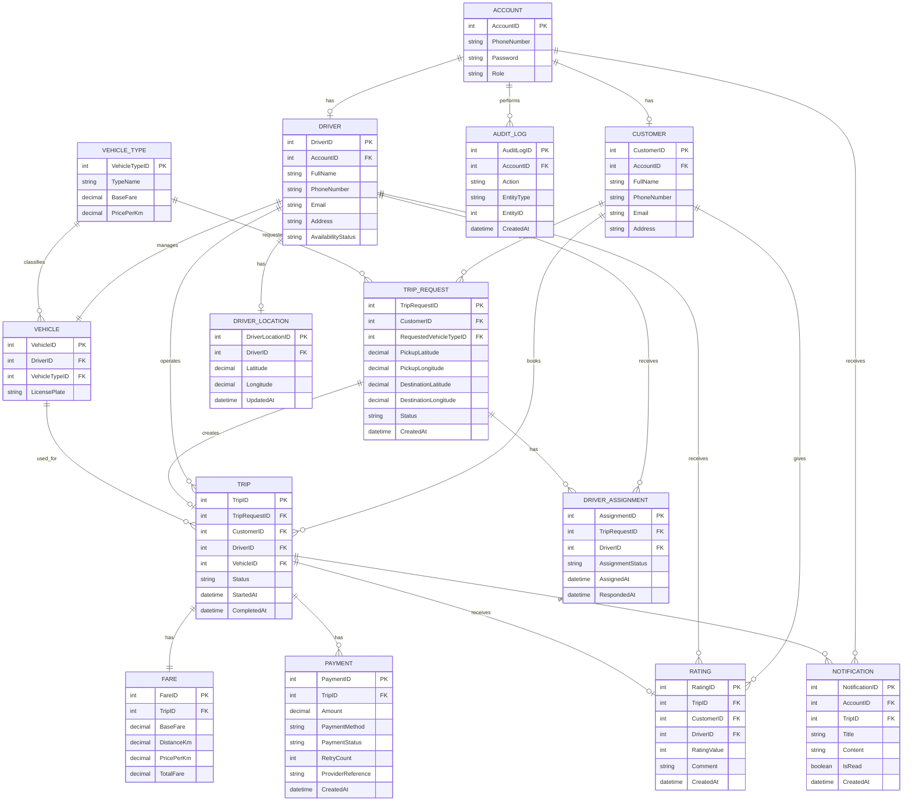

# 13. XÁC ĐỊNH ACTOR VÀ USE CASE

## 13.1. Actor

| Actor ID | Tên Actor        | Loại                 | Vai trò / Mục tiêu                                                         |
| -------- | ---------------- | -------------------- | -------------------------------------------------------------------------- |
| ACT-01   | Customer         | Người dùng trực tiếp | Đăng ký, đăng nhập, quản lý thông tin, đặt và quản lý chuyến xe            |
| ACT-02   | Driver           | Người dùng trực tiếp | Quản lý thông tin, phương tiện, trạng thái sẵn sàng và thực hiện chuyến xe |
| ACT-03   | Operations Staff | Nhân viên vận hành   | Quản lý dữ liệu vận hành, hỗ trợ chuyến và tra cứu giao dịch               |
| ACT-04   | Leadership       | Quản lý              | Theo dõi thông tin hoạt động của hệ thống                                  |
| ACT-05   | Payment Provider | Hệ thống bên ngoài   | Xử lý thanh toán điện tử và trả kết quả giao dịch                          |

**STK-04 — ABC Company** không phải Actor trong phiên bản hiện tại vì không tương tác trực tiếp với hệ thống.

## 13.2. Use Case

Danh sách dưới đây được đồng bộ trực tiếp với các Use Case đặc tả tại Chương 15 (UC-01 đến UC-37).

| UC ID | Tên Use Case                   | Actor liên quan          | FR liên quan | BP liên quan |
| ----- | ------------------------------ | ------------------------ | ------------ | ------------ |
| UC-01 | Đăng ký tài khoản khách hàng   | ACT-01                   | FR-01        | BP-01        |
| UC-02 | Đăng nhập tài khoản khách hàng | ACT-01                   | FR-02        | BP-01        |
| UC-03 | Cập nhật thông tin khách hàng  | ACT-01                   | FR-02        | BP-01        |
| UC-04 | Cập nhật thông tin tài xế      | ACT-02                   | FR-03        | BP-02        |
| UC-05 | Cập nhật thông tin phương tiện | ACT-02                   | FR-04        | BP-02        |
| UC-06 | Cập nhật trạng thái sẵn sàng   | ACT-02                   | FR-05        | BP-02        |
| UC-07 | Tạo yêu cầu đặt chuyến         | ACT-01                   | FR-06, FR-07 | BP-03        |
| UC-08 | Xác định tài xế phù hợp        | Hệ thống                 | FR-09, FR-10 | BP-04        |
| UC-09 | Gửi yêu cầu nhận chuyến        | ACT-02, Hệ thống         | FR-11        | BP-04        |
| UC-10 | Nhận chuyến                    | ACT-02                   | FR-14        | BP-05        |
| UC-11 | Xử lý không tìm thấy tài xế    | ACT-01, Hệ thống         | FR-13        | BP-04        |
| UC-12 | Hủy chuyến                     | ACT-01                   | FR-08        | BP-03        |
| UC-13 | Cập nhật trạng thái chuyến     | ACT-02                   | FR-15, FR-16 | BP-05        |
| UC-14 | Theo dõi trạng thái chuyến     | ACT-01                   | FR-17        | BP-06        |
| UC-15 | Cập nhật vị trí tài xế         | ACT-02                   | FR-18        | BP-06        |
| UC-16 | Xem vị trí tài xế              | ACT-01                   | FR-18        | BP-06        |
| UC-17 | Tính cước chuyến xe            | Hệ thống                 | FR-19        | BP-07        |
| UC-18 | Thanh toán tiền mặt            | ACT-01                   | FR-20        | BP-07        |
| UC-19 | Thanh toán điện tử             | ACT-01, ACT-05           | FR-20, FR-21 | BP-07        |
| UC-20 | Xử lý thanh toán thất bại      | ACT-01, ACT-05           | FR-22        | BP-07        |
| UC-21 | Gửi thông báo trong ứng dụng   | Hệ thống, ACT-01, ACT-02 | FR-23        | BP-08        |
| UC-22 | Đánh giá tài xế                | ACT-01                   | FR-24        | BP-09        |
| UC-23 | Tạo khách hàng                 | ACT-03                   | FR-25        | BP-10        |
| UC-24 | Tra cứu khách hàng             | ACT-03                   | FR-25        | BP-10        |
| UC-25 | Cập nhật khách hàng            | ACT-03                   | FR-25        | BP-10        |
| UC-26 | Xóa khách hàng                 | ACT-03                   | FR-25        | BP-10        |
| UC-27 | Tạo tài xế                     | ACT-03                   | FR-26        | BP-10        |
| UC-28 | Tra cứu tài xế                 | ACT-03                   | FR-26        | BP-10        |
| UC-29 | Cập nhật tài xế                | ACT-03                   | FR-26        | BP-10        |
| UC-30 | Xóa tài xế                     | ACT-03                   | FR-26        | BP-10        |
| UC-31 | Tạo phương tiện                | ACT-03                   | FR-27        | BP-10        |
| UC-32 | Tra cứu phương tiện            | ACT-03                   | FR-27        | BP-10        |
| UC-33 | Cập nhật phương tiện           | ACT-03                   | FR-27        | BP-10        |
| UC-34 | Xóa phương tiện                | ACT-03                   | FR-27        | BP-10        |
| UC-35 | Theo dõi chuyến xe             | ACT-03                   | FR-28        | BP-10        |
| UC-36 | Tra cứu giao dịch              | ACT-03                   | FR-29        | BP-10        |
| UC-37 | Theo dõi thông tin hoạt động   | ACT-04                   | FR-30        | BP-10        |

## 13.3. Quan hệ Actor – Use Case

| Association ID | Actor ID | Use Case ID | Vai trò  |
| -------------- | -------- | ----------- | -------- |
| ASSOC-01       | ACT-01   | UC-01       | Khởi tạo |
| ASSOC-02       | ACT-01   | UC-02       | Khởi tạo |
| ASSOC-03       | ACT-01   | UC-03       | Khởi tạo |
| ASSOC-04       | ACT-02   | UC-04       | Khởi tạo |
| ASSOC-05       | ACT-02   | UC-05       | Khởi tạo |
| ASSOC-06       | ACT-02   | UC-06       | Khởi tạo |
| ASSOC-07       | ACT-01   | UC-07       | Khởi tạo |
| ASSOC-08       | ACT-02   | UC-09       | Tham gia |
| ASSOC-09       | ACT-02   | UC-10       | Khởi tạo |
| ASSOC-10       | ACT-01   | UC-11       | Tham gia |
| ASSOC-11       | ACT-01   | UC-12       | Khởi tạo |
| ASSOC-12       | ACT-02   | UC-13       | Khởi tạo |
| ASSOC-13       | ACT-01   | UC-14       | Khởi tạo |
| ASSOC-14       | ACT-02   | UC-15       | Khởi tạo |
| ASSOC-15       | ACT-01   | UC-16       | Khởi tạo |
| ASSOC-16       | ACT-01   | UC-18       | Khởi tạo |
| ASSOC-17       | ACT-01   | UC-19       | Khởi tạo |
| ASSOC-18       | ACT-05   | UC-19       | Tham gia |
| ASSOC-19       | ACT-01   | UC-20       | Khởi tạo |
| ASSOC-20       | ACT-05   | UC-20       | Tham gia |
| ASSOC-21       | ACT-01   | UC-21       | Tham gia |
| ASSOC-22       | ACT-02   | UC-21       | Tham gia |
| ASSOC-23       | ACT-01   | UC-22       | Khởi tạo |
| ASSOC-24       | ACT-03   | UC-23       | Khởi tạo |
| ASSOC-25       | ACT-03   | UC-24       | Khởi tạo |
| ASSOC-26       | ACT-03   | UC-25       | Khởi tạo |
| ASSOC-27       | ACT-03   | UC-26       | Khởi tạo |
| ASSOC-28       | ACT-03   | UC-27       | Khởi tạo |
| ASSOC-29       | ACT-03   | UC-28       | Khởi tạo |
| ASSOC-30       | ACT-03   | UC-29       | Khởi tạo |
| ASSOC-31       | ACT-03   | UC-30       | Khởi tạo |
| ASSOC-32       | ACT-03   | UC-31       | Khởi tạo |
| ASSOC-33       | ACT-03   | UC-32       | Khởi tạo |
| ASSOC-34       | ACT-03   | UC-33       | Khởi tạo |
| ASSOC-35       | ACT-03   | UC-34       | Khởi tạo |
| ASSOC-36       | ACT-03   | UC-35       | Khởi tạo |
| ASSOC-37       | ACT-03   | UC-36       | Khởi tạo |
| ASSOC-38       | ACT-04   | UC-37       | Khởi tạo |
| ASSOC-39       | ACT-04   | UC-37       | Khởi tạo |

## 13.4. Quan hệ Include / Extend

| Relationship ID | Use Case nguồn | Quan hệ       | Use Case đích | Cơ sở                                           |
| --------------- | -------------- | ------------- | ------------- | ----------------------------------------------- |
| REL-UC-01       | UC-07          | `<<include>>` | UC-08         | Tạo yêu cầu cần xác định tài xế phù hợp         |
| REL-UC-02       | UC-08          | `<<include>>` | UC-09         | Xác định tài xế cần gửi yêu cầu nhận chuyến     |
| REL-UC-03       | UC-10          | `<<extend>>`  | UC-09         | Chỉ mở rộng khi Driver chọn nhận request        |
| REL-UC-04       | UC-08          | `<<extend>>`  | UC-11         | Không còn tài xế phù hợp sau khi lọc và ưu tiên |
| REL-UC-05       | UC-19          | `<<extend>>`  | UC-20         | Thanh toán điện tử thất bại                     |

Không sử dụng Generalization trong phiên bản hiện tại.

## 13.5. Ma trận Functional Requirement – Use Case

| FR                  | Use Case           | Actor                    | Trạng thái                               |
| ------------------- | ------------------ | ------------------------ | ---------------------------------------- |
| FR-01               | UC-01              | ACT-01                   | Đã bao phủ                               |
| FR-02               | UC-02, UC-03       | ACT-01                   | Đã bao phủ                               |
| FR-03               | UC-04, UC-27–UC-30 | ACT-02, ACT-03           | Đã bao phủ                               |
| FR-04               | UC-05, UC-31–UC-34 | ACT-02, ACT-03           | Đã bao phủ                               |
| FR-05               | UC-06              | ACT-02                   | Đã bao phủ                               |
| FR-06, FR-07        | UC-07              | ACT-01                   | Đã bao phủ                               |
| FR-08               | UC-12              | ACT-01                   | Đã bao phủ                               |
| FR-09, FR-10        | UC-08              | Hệ thống                 | Đã bao phủ                               |
| FR-11               | UC-09              | ACT-02, Hệ thống         | Đã bao phủ                               |
| FR-12               | UC-09              | Hệ thống                 | Đã bao phủ                               |
| FR-13               | UC-11              | ACT-01, Hệ thống         | Đã bao phủ                               |
| FR-14               | UC-10              | ACT-02                   | Đã bao phủ                               |
| FR-15, FR-16        | UC-13              | ACT-02                   | Đã bao phủ                               |
| FR-17               | UC-14              | ACT-01                   | Đã bao phủ                               |
| FR-18               | UC-15, UC-16       | ACT-01, ACT-02           | Đã bao phủ                               |
| FR-19               | UC-17              | Hệ thống                 | Đã bao phủ                               |
| FR-20               | UC-18, UC-19       | ACT-01                   | Đã bao phủ                               |
| FR-21               | UC-19              | ACT-01, ACT-05           | Đã bao phủ                               |
| FR-22               | UC-20              | ACT-01, ACT-05           | Đã bao phủ                               |
| FR-23               | UC-21              | Hệ thống, ACT-01, ACT-02 | Đã bao phủ                               |
| FR-24               | UC-22              | ACT-01                   | Đã bao phủ                               |
| FR-25               | UC-23–UC-26        | ACT-03                   | Đã bao phủ                               |
| FR-26               | UC-27–UC-30        | ACT-03                   | Đã bao phủ                               |
| FR-27               | UC-31–UC-34        | ACT-03                   | Đã bao phủ                               |
| FR-28               | UC-35              | ACT-03                   | Đã bao phủ                               |
| FR-29               | UC-36              | ACT-03                   | Đã bao phủ                               |
| FR-30               | UC-37              | ACT-04                   | Đã bao phủ                               |
| FR-31, FR-32, FR-33 | —                  | —                        | Mở rộng tương lai, không thuộc Chương 15 |

## 13.6. Ma trận Business Process – Use Case

| BP ID | Business Process                        | Use Case                          |
| ----- | --------------------------------------- | --------------------------------- |
| BP-01 | Quản lý tài khoản khách hàng            | UC-01, UC-02, UC-03               |
| BP-02 | Quản lý tài khoản tài xế và phương tiện | UC-04, UC-05, UC-06               |
| BP-03 | Đặt chuyến xe                           | UC-07, UC-12                      |
| BP-04 | Phân công tài xế                        | UC-08, UC-09, UC-11               |
| BP-05 | Thực hiện chuyến xe                     | UC-10, UC-13                      |
| BP-06 | Theo dõi chuyến xe và vị trí tài xế     | UC-14, UC-15, UC-16               |
| BP-07 | Tính cước và thanh toán                 | UC-17, UC-18, UC-19, UC-20        |
| BP-08 | Thông báo chuyến xe và thanh toán       | UC-21                             |
| BP-09 | Đánh giá chuyến xe                      | UC-22                             |
| BP-10 | Vận hành và theo dõi hoạt động hệ thống | UC-23–UC-37                       |
| BP-11 | Mở rộng dịch vụ và phương thức hỗ trợ   | Không có Use Case trong Chương 15 |

# 14. XÁC ĐỊNH VÀ VẼ USE CASE DIAGRAM

## 14.1. Thông tin tổng quan

| Thành phần                | Giá trị             |
| ------------------------- | ------------------- |
| Tên hệ thống              | CAB System          |
| Tổng số Actor             | 5                   |
| Tổng số Use Case hiện tại | 37                  |
| Tổng số Association       | 39                  |
| Quan hệ `<<include>>`     | 2                   |
| Quan hệ `<<extend>>`      | 3                   |
| Generalization            | 0                   |
| FR hiện tại được bao phủ  | FR-01 đến FR-30     |
| FR mở rộng tương lai      | FR-31, FR-32, FR-33 |

## 14.2. Actor và Use Case

Actor, Association, Include/Extend và ma trận trong phần này sử dụng nguyên trạng các bảng tương ứng tại Mục 13; không có Actor hoặc Use Case ngoài UC-01 đến UC-37.

## 14.3. Use Case Diagram

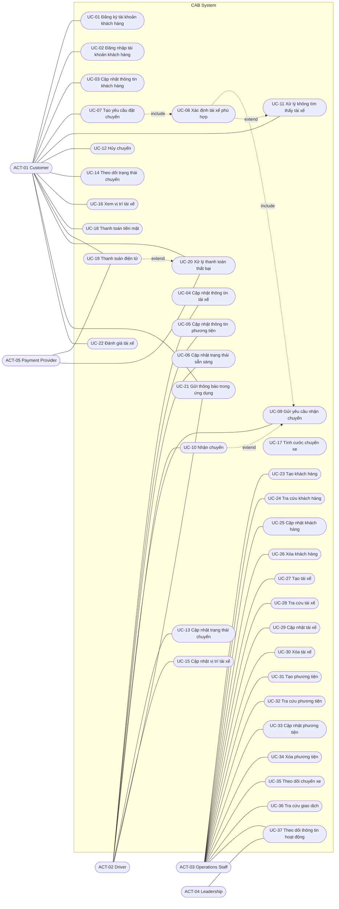

**Ghi chú:** UC-31 đến UC-37 là các Use Case thực tế của Chương 15; không sử dụng các mã UC-26 đến UC-28 cho chức năng mở rộng tương lai.

# 15. ĐẶC TẢ USE CASE

## 15.1. UC-01 — Đăng ký tài khoản khách hàng

### Mục tiêu

Cho phép khách hàng tạo tài khoản mới để sử dụng hệ thống.

### Actor chính

- ACT-01 — Customer

### Actor phụ

- Không có.

### Tiền điều kiện

- Khách hàng chưa có tài khoản sử dụng số điện thoại đăng ký.

### Hậu điều kiện

- Tài khoản khách hàng được tạo thành công và được ghi nhận trong hệ thống.

### Luồng chính

1. Khách hàng truy cập chức năng đăng ký tài khoản.
2. Hệ thống hiển thị biểu mẫu đăng ký.
3. Khách hàng nhập thông tin đăng ký.
4. Khách hàng gửi thông tin đăng ký.
5. Hệ thống kiểm tra tính hợp lệ của thông tin.
6. Hệ thống kiểm tra số điện thoại chưa được sử dụng.
7. Hệ thống tạo tài khoản khách hàng.
8. Hệ thống ghi nhận thông tin khách hàng.
9. Hệ thống thông báo đăng ký thành công.

### Luồng thay thế

**ALT-01 — Khách hàng hủy đăng ký tại bước 3**

1. Khách hàng hủy thao tác đăng ký.
2. Hệ thống không tạo tài khoản.
3. Use Case kết thúc.

### Luồng ngoại lệ

**EX-01 — Thông tin đăng ký không hợp lệ tại bước 5**

1. Hệ thống xác định thông tin đăng ký không hợp lệ.
2. Hệ thống từ chối đăng ký.
3. Hệ thống thông báo lỗi.
4. Use Case kết thúc.

**EX-02 — Số điện thoại đã tồn tại tại bước 6**

1. Hệ thống xác định số điện thoại đã được sử dụng.
2. Hệ thống từ chối tạo tài khoản.
3. Hệ thống thông báo số điện thoại đã tồn tại.
4. Use Case kết thúc.

---

## 15.2. UC-02 — Đăng nhập tài khoản khách hàng

### Mục tiêu

Cho phép khách hàng xác thực tài khoản để sử dụng hệ thống.

### Actor chính

- ACT-01 — Customer

### Actor phụ

- Không có.

### Tiền điều kiện

- Khách hàng đã có tài khoản.

### Hậu điều kiện

- Khách hàng đăng nhập thành công và được phép sử dụng các chức năng yêu cầu đăng nhập.

### Luồng chính

1. Khách hàng truy cập chức năng đăng nhập.
2. Hệ thống hiển thị biểu mẫu đăng nhập.
3. Khách hàng cung cấp `Account.PhoneNumber` và mật khẩu.
4. Khách hàng gửi thông tin đăng nhập.
5. Hệ thống xác thực `Account.PhoneNumber` và mật khẩu.
6. Hệ thống xác nhận đăng nhập thành công.
7. Hệ thống cho phép khách hàng sử dụng các chức năng yêu cầu đăng nhập.

### Luồng thay thế

- Không có.

### Luồng ngoại lệ

**EX-01 — Thông tin đăng nhập không hợp lệ tại bước 5**

1. Hệ thống xác định thông tin đăng nhập không hợp lệ.
2. Hệ thống từ chối đăng nhập.
3. Hệ thống thông báo đăng nhập thất bại.
4. Use Case kết thúc.

---

## 15.3. UC-03 — Cập nhật thông tin khách hàng

### Mục tiêu

Cho phép khách hàng cập nhật thông tin cá nhân.

### Actor chính

- ACT-01 — Customer

### Actor phụ

- Không có.

### Tiền điều kiện

- Khách hàng đã đăng nhập.

### Hậu điều kiện

- Thông tin cá nhân hợp lệ được cập nhật thành công.

### Luồng chính

1. Khách hàng truy cập chức năng cập nhật thông tin.
2. Hệ thống hiển thị thông tin hiện tại.
3. Khách hàng thay đổi thông tin cần cập nhật.
4. Khách hàng gửi thông tin cập nhật.
5. Hệ thống kiểm tra tính hợp lệ.
6. Nếu có thay đổi `PhoneNumber`, hệ thống kiểm tra duy nhất và đồng bộ đồng thời `Account.PhoneNumber`; sau đó lưu hồ sơ.
7. Hệ thống thông báo cập nhật thành công.

### Luồng thay thế

**ALT-01 — Chỉ cập nhật một phần thông tin tại bước 3**

1. Khách hàng chỉ thay đổi các thông tin cần thiết.
2. Các thông tin không thay đổi được giữ nguyên.
3. Luồng tiếp tục tại bước 4.

**ALT-02 — Hủy cập nhật tại bước 3**

1. Khách hàng hủy thao tác.
2. Hệ thống giữ nguyên thông tin hiện tại.
3. Use Case kết thúc.

### Luồng ngoại lệ

**EX-01 — Thông tin cập nhật không hợp lệ tại bước 5**

1. Hệ thống xác định thông tin không hợp lệ.
2. Hệ thống từ chối cập nhật.
3. Hệ thống thông báo lỗi.
4. Use Case kết thúc.

---

## 15.4. UC-04 — Cập nhật thông tin tài xế

### Mục tiêu

Cho phép tài xế cập nhật thông tin cá nhân.

### Actor chính

- ACT-02 — Driver

### Actor phụ

- Không có.

### Tiền điều kiện

- Tài xế đã đăng nhập.

### Hậu điều kiện

- Thông tin cá nhân hợp lệ của tài xế được cập nhật thành công.

### Luồng chính

1. Tài xế truy cập chức năng cập nhật thông tin.
2. Hệ thống hiển thị thông tin hiện tại.
3. Tài xế thay đổi thông tin cần cập nhật.
4. Tài xế gửi thông tin cập nhật.
5. Hệ thống kiểm tra tính hợp lệ.
6. Nếu có thay đổi `PhoneNumber`, hệ thống kiểm tra duy nhất và đồng bộ đồng thời `Account.PhoneNumber`; sau đó lưu hồ sơ.
7. Hệ thống thông báo cập nhật thành công.

### Luồng thay thế

**ALT-01 — Không thay đổi thông tin tại bước 3**

1. Tài xế không thay đổi thông tin.
2. Use Case kết thúc.

### Luồng ngoại lệ

**EX-01 — Thông tin cập nhật không hợp lệ tại bước 5**

1. Hệ thống xác định thông tin không hợp lệ.
2. Hệ thống từ chối cập nhật.
3. Hệ thống thông báo lỗi.
4. Use Case kết thúc.

---

## 15.5. UC-05 — Cập nhật thông tin phương tiện

### Mục tiêu

Cho phép tài xế cập nhật thông tin phương tiện.

### Actor chính

- ACT-02 — Driver

### Actor phụ

- Không có.

### Tiền điều kiện

- Tài xế đã đăng nhập.

### Hậu điều kiện

- Thông tin phương tiện hợp lệ được cập nhật thành công.

### Luồng chính

1. Tài xế truy cập chức năng quản lý phương tiện.
2. Hệ thống hiển thị thông tin phương tiện hiện tại.
3. Tài xế thay đổi thông tin phương tiện.
4. Tài xế gửi thông tin cập nhật.
5. Hệ thống kiểm tra tính hợp lệ.
6. Hệ thống lưu thông tin hợp lệ.
7. Hệ thống thông báo cập nhật thành công.

### Luồng thay thế

**ALT-01 — Không thay đổi thông tin tại bước 3**

1. Tài xế không thay đổi thông tin.
2. Use Case kết thúc.

### Luồng ngoại lệ

**EX-01 — Thông tin phương tiện không hợp lệ tại bước 5**

1. Hệ thống xác định thông tin không hợp lệ.
2. Hệ thống từ chối cập nhật.
3. Hệ thống thông báo lỗi.
4. Use Case kết thúc.

---

## 15.6. UC-06 — Cập nhật trạng thái sẵn sàng

### Mục tiêu

Cho phép tài xế cập nhật trạng thái sẵn sàng nhận chuyến.

### Actor chính

- ACT-02 — Driver

### Actor phụ

- Không có.

### Tiền điều kiện

- Tài xế đã đăng nhập.

### Hậu điều kiện

- Trạng thái tài xế được cập nhật thành `Available` hoặc `Unavailable`.

### Luồng chính

1. Tài xế truy cập chức năng cập nhật trạng thái.
2. Hệ thống hiển thị trạng thái hiện tại.
3. Tài xế lựa chọn trạng thái.
4. Tài xế gửi yêu cầu cập nhật.
5. Hệ thống kiểm tra giá trị trạng thái.
6. Hệ thống cập nhật trạng thái.
7. Hệ thống thông báo cập nhật thành công.

### Luồng thay thế

**ALT-01 — Giữ nguyên trạng thái tại bước 3**

1. Tài xế giữ nguyên trạng thái hiện tại.
2. Use Case kết thúc.

### Luồng ngoại lệ

**EX-01 — Trạng thái không hợp lệ tại bước 5**

1. Hệ thống xác định trạng thái không thuộc `Available` hoặc `Unavailable`.
2. Hệ thống từ chối cập nhật.
3. Hệ thống thông báo lỗi.
4. Use Case kết thúc.

---

# 15.7. UC-07 — Tạo yêu cầu đặt chuyến

### Mục tiêu

Cho phép khách hàng tạo yêu cầu đặt chuyến.

### Actor chính

- ACT-01 — Customer

### Actor phụ

- Không có.

### Tiền điều kiện

- Khách hàng đã đăng nhập.

### Hậu điều kiện

- TripRequest được tạo với trạng thái `Searching`.

### Luồng chính

1. Khách hàng truy cập chức năng đặt chuyến.
2. Hệ thống hiển thị biểu mẫu đặt chuyến.
3. Khách hàng nhập điểm đón.
4. Khách hàng nhập điểm đến.
5. Khách hàng lựa chọn loại phương tiện.
6. Khách hàng gửi yêu cầu.
7. Hệ thống kiểm tra thông tin đặt chuyến.
8. Hệ thống tạo TripRequest.
9. Hệ thống đặt trạng thái TripRequest là `Searching`.
10. Hệ thống chuyển sang UC-08 — Xác định tài xế phù hợp.

### Luồng thay thế

**ALT-01 — Thay đổi thông tin tại bước 6**

1. Khách hàng thay đổi điểm đón, điểm đến hoặc loại phương tiện.
2. Luồng tiếp tục tại bước 7.

**ALT-02 — Hủy thao tác tại bước 6**

1. Khách hàng hủy thao tác.
2. Hệ thống không tạo TripRequest.
3. Use Case kết thúc.

### Luồng ngoại lệ

**EX-01 — Thông tin đặt chuyến không hợp lệ tại bước 7**

1. Hệ thống xác định thông tin không hợp lệ.
2. Hệ thống từ chối tạo TripRequest.
3. Hệ thống thông báo lỗi.
4. Use Case kết thúc.

---

# 15.8. UC-08 — Xác định tài xế phù hợp

### Mục tiêu

Xác định tài xế đáp ứng điều kiện phục vụ yêu cầu chuyến.

### Actor chính

- System

### Actor phụ

- Không có.

### Tiền điều kiện

- Có TripRequest ở trạng thái `Searching`.
- TripRequest đã xác định loại phương tiện.

### Hậu điều kiện

- Một tài xế phù hợp được xác định; hoặc
- Không có tài xế phù hợp.

### Luồng chính

1. Hệ thống tiếp nhận TripRequest cần tìm tài xế.
2. Hệ thống lấy danh sách tài xế có trạng thái `Available`.
3. Hệ thống kiểm tra loại phương tiện của từng tài xế.
4. Hệ thống gửi tọa độ điểm đón và tọa độ vị trí gần nhất của từng tài xế đến **Dịch vụ định vị**, nhận khoảng cách/vị trí hợp lệ, rồi kiểm tra vị trí của từng tài xế; không lựa chọn nhà cung cấp cụ thể.
5. Hệ thống loại các tài xế không đáp ứng điều kiện.
6. Hệ thống xác định tài xế phù hợp gần điểm đón nhất.
7. Hệ thống chuyển tài xế được chọn sang UC-09 — Gửi yêu cầu nhận chuyến.

### Luồng thay thế

**ALT-01 — Chỉ có một tài xế phù hợp tại bước 6**

1. Hệ thống chọn tài xế đó.
2. Luồng tiếp tục tại bước 7.

**ALT-02 — Có nhiều tài xế phù hợp tại bước 6**

1. Hệ thống ưu tiên tài xế gần điểm đón nhất.
2. Luồng tiếp tục tại bước 7.

### Luồng ngoại lệ

**EX-01 — Không có tài xế phù hợp tại bước 6**

1. Hệ thống xác định không có tài xế đáp ứng điều kiện.
2. Hệ thống chuyển sang UC-11 — Xử lý không tìm thấy tài xế.
3. Use Case kết thúc.

---

# 15.9. UC-09 — Gửi yêu cầu nhận chuyến

### Mục tiêu

Gửi yêu cầu chuyến đến tài xế phù hợp và chờ phản hồi.

### Actor chính

- System

### Actor phụ

- ACT-02 — Driver

### Tiền điều kiện

- UC-08 đã xác định được tài xế phù hợp.
- TripRequest đang ở trạng thái `Searching`.

### Hậu điều kiện

- Request đã được gửi và kết quả phản hồi được ghi nhận.
- Nếu bị từ chối hoặc không phản hồi, hệ thống chuyển tiếp sang UC-08 để tìm tài xế tiếp theo.
- UC-09 không tự cập nhật `TripRequest` thành `Assigned`; việc đó chỉ thuộc UC-10.

### Luồng chính

1. Hệ thống nhận tài xế phù hợp từ UC-08.
2. Hệ thống gửi yêu cầu chuyến cho tài xế.
3. Tài xế xem yêu cầu chuyến.
4. Tài xế phản hồi trong tối đa 60 giây.
5. Hệ thống nhận phản hồi.
6. Hệ thống ghi nhận kết quả phản hồi.
7. Nếu phản hồi là chấp nhận, hệ thống chuyển sang UC-10.
8. Nếu phản hồi là từ chối hoặc hết thời gian, hệ thống chuyển tiếp sang UC-08.

### Luồng thay thế

**ALT-01 — Tài xế từ chối tại bước 5**

1. Hệ thống ghi nhận tài xế từ chối.
2. Hệ thống loại tài xế khỏi lần phân công hiện tại.
3. Hệ thống quay lại UC-08 để xác định tài xế tiếp theo.

**ALT-02 — Tài xế không phản hồi sau 60 giây tại bước 5**

1. Hệ thống xác định yêu cầu đã hết thời gian chờ.
2. Hệ thống ghi nhận tài xế không phản hồi.
3. Hệ thống loại tài xế khỏi lần phân công hiện tại.
4. Hệ thống quay lại UC-08 để xác định tài xế tiếp theo.

### Luồng ngoại lệ

**EX-01 — Không còn tài xế sau khi quay lại UC-08**

1. Hệ thống quay lại UC-08 để xác định tài xế tiếp theo.
2. UC-08 xử lý trường hợp không có tài xế phù hợp và chuyển sang UC-11.
3. UC-09 kết thúc.

---

# 15.10. UC-10 — Nhận chuyến

### Mục tiêu

Ghi nhận việc tài xế chấp nhận yêu cầu chuyến.

### Actor chính

- ACT-02 — Driver

### Actor phụ

- Không có.

### Tiền điều kiện

- Tài xế đã nhận yêu cầu chuyến.
- Yêu cầu vẫn còn hiệu lực.
- Thời gian phản hồi chưa vượt quá 60 giây.

### Hậu điều kiện

- Tài xế được ghi nhận là tài xế nhận chuyến.
- TripRequest chuyển sang `Assigned`.
- Một `Trip` được tạo tại thời điểm Driver nhận chuyến, với trạng thái ban đầu `Arrived` (trạng thái đầu tiên phù hợp với baseline).

### Luồng chính

1. Tài xế xem request do UC-09 gửi.
2. Tài xế lựa chọn nhận chuyến.
3. Hệ thống kiểm tra request còn hiệu lực và đúng thời hạn.
4. Hệ thống ghi nhận việc Driver nhận chuyến.
5. Hệ thống cập nhật TripRequest thành `Assigned`.
6. Hệ thống tạo Trip liên kết với TripRequest, trạng thái ban đầu `Arrived`.
7. Hệ thống xác nhận tài xế đã nhận chuyến.

### Luồng ngoại lệ

**EX-01 — Yêu cầu không còn hiệu lực tại bước 3**

1. Hệ thống xác định yêu cầu không còn hiệu lực.
2. Hệ thống không ghi nhận việc nhận chuyến.
3. Hệ thống thông báo yêu cầu không còn khả dụng.
4. Use Case kết thúc.

---

# 15.11. UC-11 — Xử lý không tìm thấy tài xế

### Mục tiêu

Kết thúc yêu cầu chuyến khi không còn tài xế phù hợp.

### Actor chính

- System

### Actor phụ

- ACT-01 — Customer

### Tiền điều kiện

- Quá trình xác định và phân công không còn tài xế phù hợp.

### Hậu điều kiện

- TripRequest chuyển sang `NoDriverFound`.
- Khách hàng được thông báo.
- Yêu cầu chuyến kết thúc.

### Luồng chính

1. Hệ thống xác định không còn tài xế phù hợp.
2. Hệ thống cập nhật TripRequest thành `NoDriverFound`.
3. Hệ thống tạo thông báo cho khách hàng.
4. Hệ thống gửi thông báo cho khách hàng.
5. Hệ thống kết thúc yêu cầu chuyến.

### Luồng thay thế

- Không có.

### Luồng ngoại lệ

- Không có.

---

# 15.12. UC-12 — Hủy chuyến

### Mục tiêu

Cho phép khách hàng hủy chuyến trước khi chuyến bắt đầu.

### Actor chính

- ACT-01 — Customer

### Actor phụ

- Không có.

### Tiền điều kiện

- Khách hàng đã đăng nhập.
- Khách hàng có chuyến cần hủy.
- Chuyến chưa bắt đầu.

### Hậu điều kiện

- Nếu chưa có Trip, `TripRequest` được cập nhật thành `Cancelled`.
- Nếu đã có Trip và chuyến chưa bắt đầu, `Trip` được cập nhật thành `Cancelled`.
- Khách hàng không bị tính phí hủy.

### Luồng chính

1. Khách hàng truy cập chuyến cần hủy.
2. Khách hàng yêu cầu hủy chuyến.
3. Hệ thống kiểm tra trạng thái chuyến.
4. Hệ thống xác nhận chuyến chưa bắt đầu.
5. Nếu chưa có Trip, hệ thống cập nhật `TripRequest` thành `Cancelled`; nếu đã có Trip, hệ thống cập nhật `Trip` thành `Cancelled`.
6. Hệ thống ghi nhận việc hủy.
7. Hệ thống xác nhận hủy thành công.

### Luồng thay thế

**ALT-01 — Khách hàng không xác nhận hủy tại bước 2**

1. Khách hàng hủy thao tác.
2. Hệ thống giữ nguyên trạng thái chuyến.
3. Use Case kết thúc.

### Luồng ngoại lệ

**EX-01 — Chuyến đã bắt đầu tại bước 3**

1. Hệ thống xác định chuyến đã bắt đầu.
2. Hệ thống từ chối yêu cầu hủy.
3. Hệ thống thông báo không thể hủy chuyến.
4. Use Case kết thúc.

---

# 15.13. UC-13 — Cập nhật trạng thái chuyến

### Mục tiêu

Cho phép tài xế cập nhật trạng thái chuyến theo quá trình thực hiện.

### Actor chính

- ACT-02 — Driver

### Actor phụ

- Không có.

### Tiền điều kiện

- Tài xế đã nhận chuyến.

### Hậu điều kiện

- Trạng thái chuyến được cập nhật thành trạng thái hợp lệ tiếp theo.

### Luồng chính

1. Hệ thống xác nhận Trip đang ở trạng thái `Arrived`.
2. Tài xế cập nhật trạng thái `PickedUp`.
3. Hệ thống kiểm tra trạng thái chuyển đổi hợp lệ.
4. Hệ thống ghi nhận `PickedUp`.
5. Tài xế cập nhật trạng thái `InProgress`.
6. Hệ thống kiểm tra trạng thái chuyển đổi hợp lệ.
7. Hệ thống ghi nhận `InProgress`.
8. Tài xế cập nhật trạng thái `Completed`.
9. Hệ thống kiểm tra trạng thái chuyển đổi hợp lệ.
10. Hệ thống ghi nhận `Completed`.

### Luồng thay thế

**ALT-01 — Khách hàng hủy trước khi chuyến bắt đầu**

1. Khách hàng thực hiện UC-12.
2. Hệ thống cập nhật chuyến thành `Cancelled`.
3. Use Case kết thúc.

### Luồng ngoại lệ

**EX-01 — Chuyển trạng thái không hợp lệ**

1. Hệ thống xác định trạng thái mới không hợp lệ.
2. Hệ thống từ chối cập nhật.
3. Hệ thống thông báo trạng thái không hợp lệ.
4. Use Case kết thúc.

**EX-02 — Không ghi nhận được trạng thái**

1. Hệ thống không lưu được trạng thái mới.
2. Hệ thống giữ trạng thái cuối cùng đã lưu thành công.
3. Hệ thống thông báo cập nhật thất bại.
4. Use Case kết thúc.

---

# 15.14. UC-14 — Theo dõi trạng thái chuyến

### Mục tiêu

Cho phép khách hàng xem trạng thái chuyến và thông tin tài xế được phân công.

### Actor chính

- ACT-01 — Customer

### Actor phụ

- Không có.

### Tiền điều kiện

- Khách hàng đã đăng nhập.
- Khách hàng có chuyến cần xem.

### Hậu điều kiện

- Khách hàng nhận được trạng thái hiện tại của chuyến.

### Luồng chính

1. Khách hàng truy cập thông tin chuyến.
2. Hệ thống xác định chuyến cần xem.
3. Hệ thống cung cấp trạng thái hiện tại.
4. Hệ thống cung cấp thông tin tài xế nếu đã được phân công.
5. Khách hàng xem thông tin chuyến.

### Luồng thay thế

**ALT-01 — Chưa có tài xế tại bước 4**

1. Hệ thống chỉ cung cấp trạng thái chuyến.
2. Use Case kết thúc.

**ALT-02 — Yêu cầu chuyến ở trạng thái `NoDriverFound` tại bước 3**

1. Hệ thống hiển thị trạng thái yêu cầu `NoDriverFound`.
2. Use Case kết thúc.

### Luồng ngoại lệ

**EX-01 — Không tìm thấy chuyến tại bước 2**

1. Hệ thống không xác định được chuyến.
2. Hệ thống thông báo không tìm thấy chuyến.
3. Use Case kết thúc.

---

# 15.15. UC-15 — Cập nhật vị trí tài xế

### Mục tiêu

Ghi nhận vị trí mới nhất của tài xế.

### Actor chính

- ACT-02 — Driver

### Actor phụ

- Không có.

### Tiền điều kiện

- Tài xế đã đăng nhập.
- Tài xế có thông tin vị trí cần cập nhật.

### Hậu điều kiện

- Vị trí hợp lệ mới nhất của tài xế được ghi nhận.

### Luồng chính

1. Tài xế gửi thông tin vị trí.
2. Hệ thống kiểm tra thông tin vị trí.
3. Hệ thống lưu vị trí mới nhất.
4. Hệ thống thay thế vị trí trước đó bằng vị trí mới.
5. Hệ thống xác nhận cập nhật thành công.

### Luồng thay thế

- Không có.

### Luồng ngoại lệ

**EX-01 — Vị trí không hợp lệ tại bước 2**

1. Hệ thống xác định thông tin vị trí không hợp lệ.
2. Hệ thống không cập nhật vị trí.
3. Hệ thống thông báo lỗi.
4. Use Case kết thúc.

**EX-02 — Không lưu được vị trí tại bước 3**

1. Hệ thống không ghi nhận được vị trí.
2. Hệ thống giữ vị trí gần nhất đã lưu thành công.
3. Hệ thống thông báo cập nhật thất bại.
4. Use Case kết thúc.

### Giới hạn

- Chỉ lưu vị trí mới nhất.
- Không lưu lịch sử vị trí.
- Cung cấp theo dõi vị trí và ETA real-time theo mục 18.1; không lưu lịch sử tuyến đường.

---

# 15.16. UC-16 — Xem vị trí tài xế

### Mục tiêu

Cho phép khách hàng xem vị trí mới nhất đã lưu của tài xế.

### Actor chính

- ACT-01 — Customer

### Actor phụ

- Không có.

### Tiền điều kiện

- Khách hàng đã đăng nhập.
- Chuyến đã có tài xế được phân công.

### Hậu điều kiện

- Khách hàng nhận được vị trí mới nhất đã lưu của tài xế.

### Luồng chính

1. Khách hàng truy cập chức năng xem vị trí tài xế.
2. Hệ thống xác định tài xế của chuyến.
3. Hệ thống lấy vị trí mới nhất đã lưu.
4. Hệ thống cung cấp vị trí cho khách hàng.
5. Khách hàng xem vị trí.

### Luồng thay thế

**ALT-01 — Có vị trí đã lưu tại bước 3**

1. Hệ thống cung cấp vị trí gần nhất đã lưu.
2. Use Case kết thúc.

### Luồng ngoại lệ

**EX-01 — Chưa có vị trí tại bước 3**

1. Hệ thống xác định chưa có vị trí được lưu.
2. Hệ thống thông báo chưa có thông tin vị trí.
3. Use Case kết thúc.

---

# 15.17. UC-17 — Tính cước chuyến xe

### Mục tiêu

Tính và ghi nhận tổng cước chuyến dựa trên loại phương tiện và quãng đường.

### Actor chính

- System

### Actor phụ

- Không có.

### Tiền điều kiện

- Chuyến đã hoàn thành.
- Có loại phương tiện.
- Có quãng đường chuyến.

### Hậu điều kiện

- Tổng cước chuyến được tính và ghi nhận.

### Luồng chính

1. Hệ thống xác định loại phương tiện.
2. Hệ thống xác định quãng đường.
3. Hệ thống làm tròn quãng đường đến 0,1 km.
4. Hệ thống xác định cước cơ bản.
5. Hệ thống xác định đơn giá theo km.
6. Hệ thống tính tổng cước.
7. Hệ thống ghi nhận tổng cước.

### Luồng thay thế

**ALT-01 — Xe máy tại bước 4**

1. Hệ thống áp dụng cước cơ bản 10.000 VNĐ.
2. Hệ thống áp dụng đơn giá 8.000 VNĐ/km.
3. Luồng tiếp tục tại bước 6.

**ALT-02 — Ô tô 4 chỗ tại bước 4**

1. Hệ thống áp dụng cước cơ bản 15.000 VNĐ.
2. Hệ thống áp dụng đơn giá 12.000 VNĐ/km.
3. Luồng tiếp tục tại bước 6.

**ALT-03 — Ô tô 7 chỗ tại bước 4**

1. Hệ thống áp dụng cước cơ bản 20.000 VNĐ.
2. Hệ thống áp dụng đơn giá 14.000 VNĐ/km.
3. Luồng tiếp tục tại bước 6.

### Luồng ngoại lệ

**EX-01 — Thiếu thông tin tính cước**

1. Hệ thống xác định thiếu loại phương tiện hoặc quãng đường.
2. Hệ thống không hoàn tất tính cước.
3. Hệ thống thông báo không đủ dữ liệu.
4. Use Case kết thúc.

### Quy tắc

`Tổng cước = Cước cơ bản + (Quãng đường × Đơn giá/km)`

Không áp dụng phụ phí theo giờ cao điểm, thời tiết, khu vực hoặc điều kiện đặc biệt khác.

---

# 15.18. UC-18 — Thanh toán tiền mặt

### Mục tiêu

Ghi nhận phương thức thanh toán tiền mặt cho chuyến xe.

### Actor chính

- ACT-01 — Customer

### Actor phụ

- Không có.

### Tiền điều kiện

- Chuyến đã có cước.

### Hậu điều kiện

- Giao dịch được ghi nhận với phương thức `Cash`.

### Luồng chính

1. Hệ thống cung cấp thông tin cước.
2. Khách hàng lựa chọn `Cash`.
3. Hệ thống ghi nhận phương thức thanh toán.
4. Hệ thống ghi nhận giao dịch.
5. Hệ thống xác nhận kết quả.

### Luồng thay thế

- Không có.

### Luồng ngoại lệ

**EX-01 — Không ghi nhận được giao dịch tại bước 4**

1. Hệ thống không lưu được giao dịch.
2. Hệ thống thông báo thanh toán chưa được ghi nhận.
3. Use Case kết thúc.

---

# 15.19. UC-19 — Thanh toán điện tử

### Mục tiêu

Cho phép khách hàng thanh toán điện tử thông qua VNPAY Sandbox.

### Actor chính

- ACT-01 — Customer

### Actor phụ

- ACT-05 — Payment Provider

### Tiền điều kiện

- Chuyến đã có cước.

### Hậu điều kiện

- Thanh toán thành công: giao dịch có trạng thái `Paid`.
- Thanh toán thất bại: giao dịch có trạng thái `Failed`.

### Luồng chính

1. Hệ thống cung cấp thông tin cước.
2. Khách hàng lựa chọn `Electronic`.
3. Hệ thống tạo yêu cầu thanh toán.
4. Hệ thống gửi yêu cầu đến VNPAY Sandbox.
5. VNPAY Sandbox trả kết quả.
6. Hệ thống ghi nhận kết quả giao dịch.
7. Hệ thống cập nhật trạng thái giao dịch.
8. Hệ thống thông báo kết quả cho khách hàng.

### Luồng thay thế

- Không có.

### Luồng ngoại lệ

**EX-01 — Thanh toán thất bại tại bước 5**

1. Hệ thống nhận kết quả thanh toán thất bại.
2. Hệ thống cập nhật giao dịch thành `Failed`.
3. Hệ thống thông báo thanh toán thất bại.
4. Hệ thống chuyển sang UC-20 — Xử lý thanh toán thất bại.
5. Use Case kết thúc.

---

# 15.20. UC-20 — Xử lý thanh toán thất bại

### Mục tiêu

Cho phép khách hàng thử lại thanh toán điện tử trong giới hạn cho phép.

### Actor chính

- ACT-01 — Customer

### Actor phụ

- ACT-05 — Payment Provider

### Tiền điều kiện

- Giao dịch điện tử có trạng thái `Failed`.
- Lần thanh toán đầu tiên có `RetryCount = 0`; chỉ cho phép tối đa 3 retry sau lần đầu (tổng cộng tối đa 4 attempts).

### Hậu điều kiện

- Giao dịch chuyển thành `Paid` nếu thử lại thành công.
- Giao dịch giữ `Failed` nếu hết số lần thử lại.

### Luồng chính

1. Hệ thống xác định giao dịch `Failed`.
2. Hệ thống kiểm tra `RetryCount`.
3. Hệ thống xác định giao dịch còn lượt thử lại.
4. Khách hàng thực hiện thanh toán lại.
5. Hệ thống gửi yêu cầu đến VNPAY Sandbox.
6. Hệ thống nhận kết quả.
7. Hệ thống xử lý kết quả thanh toán.
8. Nếu thành công, hệ thống cập nhật `Paid`.
9. Nếu thất bại, hệ thống tăng `RetryCount`.

### Luồng thay thế

**ALT-01 — Khách hàng không thử lại tại bước 4**

1. Khách hàng không thực hiện thanh toán lại.
2. Giao dịch giữ trạng thái `Failed`.
3. Use Case kết thúc.

**ALT-02 — Thanh toán lại thành công tại bước 6**

1. Hệ thống cập nhật giao dịch thành `Paid`.
2. Hệ thống thông báo thanh toán thành công.
3. Use Case kết thúc.

### Luồng ngoại lệ

**EX-01 — Hết số lần thử lại tại bước 3**

1. Hệ thống xác định giao dịch đã đạt giới hạn thử lại.
2. Hệ thống không cho phép thử lại.
3. Giao dịch giữ trạng thái `Failed`.
4. Hệ thống thông báo kết quả.
5. Use Case kết thúc.

### Quy tắc

- `RetryCount = 0` đối với lần thanh toán đầu tiên.
- Mỗi lần thử lại tăng `RetryCount` lên 1.
- Tối đa 3 lần thử lại sau lần thanh toán đầu tiên.

---

# 15.21. UC-21 — Gửi thông báo trong ứng dụng

### Mục tiêu

Tạo và gửi thông báo trong ứng dụng khi xảy ra sự kiện thuộc phạm vi thông báo.

### Actor chính

- System

### Actor phụ

- ACT-01 — Customer
- ACT-02 — Driver

### Tiền điều kiện

- Một sự kiện thuộc phạm vi thông báo xảy ra.

### Hậu điều kiện

- Thông báo được tạo và gửi đến đối tượng liên quan.

### Luồng chính

1. Hệ thống xác định sự kiện cần thông báo.
2. Hệ thống xác định đối tượng nhận thông báo.
3. Hệ thống tạo nội dung thông báo.
4. Hệ thống gửi thông báo trong ứng dụng.
5. Đối tượng nhận thông báo.

### Luồng thay thế

**ALT-01 — Sự kiện không thuộc phạm vi thông báo tại bước 1**

1. Hệ thống không tạo thông báo.
2. Use Case kết thúc.

### Luồng ngoại lệ

**EX-01 — Gửi thông báo thất bại tại bước 4**

1. Hệ thống không gửi được thông báo.
2. Hệ thống ghi nhận việc gửi thất bại.
3. Use Case kết thúc.

### Sự kiện thông báo

- Yêu cầu chuyến được tiếp nhận.
- Tài xế nhận chuyến.
- Tài xế đến điểm đón.
- Chuyến hoàn thành.
- Kết quả thanh toán.
- Thay đổi liên quan đến chuyến xe.
- Tài xế được thông báo khi có yêu cầu chuyến mới phù hợp được phân công.

### Giới hạn

- Chỉ sử dụng thông báo trong ứng dụng.
- Không gửi SMS.
- Không gửi email.

---

# 15.22. UC-22 — Đánh giá tài xế

### Mục tiêu

Cho phép khách hàng đánh giá tài xế sau khi chuyến hoàn thành.

### Actor chính

- ACT-01 — Customer

### Actor phụ

- Không có.

### Tiền điều kiện

- Chuyến đã hoàn thành.
- Khách hàng là người thực hiện chuyến.

### Hậu điều kiện

- Đánh giá hợp lệ được ghi nhận cho chuyến và tài xế.

### Luồng chính

1. Khách hàng truy cập chức năng đánh giá.
2. Hệ thống kiểm tra chuyến đã hoàn thành.
3. Khách hàng nhập mức đánh giá.
4. Khách hàng có thể nhập nhận xét.
5. Khách hàng gửi đánh giá.
6. Hệ thống kiểm tra giá trị đánh giá.
7. Hệ thống ghi nhận đánh giá.
8. Hệ thống thông báo đánh giá thành công.

### Luồng thay thế

**ALT-01 — Không nhập nhận xét tại bước 4**

1. Khách hàng chỉ cung cấp mức đánh giá.
2. Luồng tiếp tục tại bước 5.

**ALT-02 — Khách hàng hủy tại bước 5**

1. Khách hàng hủy thao tác.
2. Hệ thống không ghi nhận đánh giá.
3. Use Case kết thúc.

### Luồng ngoại lệ

**EX-01 — Giá trị đánh giá không hợp lệ tại bước 6**

1. Hệ thống xác định giá trị đánh giá ngoài khoảng 1–5.
2. Hệ thống từ chối ghi nhận đánh giá.
3. Hệ thống thông báo lỗi.
4. Use Case kết thúc.

### Quy tắc

- `RatingValue` từ 1 đến 5.
- `Comment` là tùy chọn.

---

# 15.23. UC-23 — Tạo khách hàng

### Mục tiêu

Cho phép Operations Staff tạo thông tin khách hàng.

### Actor chính

- ACT-03 — Operations Staff

### Actor phụ

- Không có.

### Tiền điều kiện

- Operations Staff đã đăng nhập.
- Tài khoản có quyền Operations Staff.

### Hậu điều kiện

- Thông tin khách hàng hợp lệ được tạo thành công.

### Luồng chính

1. Operations Staff truy cập chức năng quản lý khách hàng.
2. Hệ thống kiểm tra quyền.
3. Operations Staff chọn chức năng tạo khách hàng.
4. Hệ thống hiển thị biểu mẫu.
5. Operations Staff cung cấp `AccountID` của tài khoản có `Role = Customer`.
6. Operations Staff nhập thông tin khách hàng.
7. Operations Staff gửi thông tin.
8. Hệ thống kiểm tra `AccountID` hợp lệ, đúng Role và chưa liên kết Customer.
9. Hệ thống tạo Customer và liên kết với Account.
10. Hệ thống thông báo tạo thành công.

### Luồng thay thế

**ALT-01 — Hủy tạo khách hàng tại bước 5**

1. Operations Staff hủy thao tác.
2. Hệ thống không tạo khách hàng.
3. Use Case kết thúc.

### Luồng ngoại lệ

**EX-01 — Thông tin không hợp lệ tại bước 7**

1. Hệ thống từ chối tạo khách hàng.
2. Hệ thống thông báo lỗi.
3. Use Case kết thúc.

---

# 15.24. UC-24 — Tra cứu khách hàng

### Mục tiêu

Cho phép Operations Staff tra cứu thông tin khách hàng.

### Actor chính

- ACT-03 — Operations Staff

### Actor phụ

- Không có.

### Tiền điều kiện

- Operations Staff đã đăng nhập.
- Tài khoản có quyền Operations Staff.

### Hậu điều kiện

- Thông tin khách hàng phù hợp được hiển thị.

### Luồng chính

1. Operations Staff truy cập chức năng quản lý khách hàng.
2. Hệ thống kiểm tra quyền.
3. Operations Staff cung cấp điều kiện tra cứu.
4. Hệ thống tìm kiếm khách hàng.
5. Hệ thống hiển thị kết quả.
6. Operations Staff xem thông tin khách hàng.

### Luồng thay thế

**ALT-01 — Không có khách hàng phù hợp tại bước 4**

1. Hệ thống thông báo không tìm thấy khách hàng.
2. Use Case kết thúc.

### Luồng ngoại lệ

**EX-01 — Không có quyền tại bước 2**

1. Hệ thống từ chối truy cập.
2. Hệ thống thông báo không có quyền.
3. Use Case kết thúc.

---

# 15.25. UC-25 — Cập nhật khách hàng

### Mục tiêu

Cho phép Operations Staff cập nhật thông tin khách hàng.

### Actor chính

- ACT-03 — Operations Staff

### Actor phụ

- Không có.

### Tiền điều kiện

- Operations Staff đã đăng nhập.
- Tài khoản có quyền Operations Staff.
- Khách hàng tồn tại.

### Hậu điều kiện

- Thông tin khách hàng hợp lệ được cập nhật.

### Luồng chính

1. Operations Staff chọn khách hàng cần cập nhật.
2. Hệ thống hiển thị thông tin khách hàng.
3. Operations Staff cập nhật thông tin được phép.
4. Operations Staff gửi thông tin cập nhật.
5. Hệ thống kiểm tra tính hợp lệ.
6. Hệ thống lưu thông tin.
7. Hệ thống thông báo cập nhật thành công.

### Luồng thay thế

**ALT-01 — Hủy cập nhật tại bước 3**

1. Operations Staff hủy thao tác.
2. Hệ thống giữ nguyên dữ liệu.
3. Use Case kết thúc.

### Luồng ngoại lệ

**EX-01 — Thông tin không hợp lệ tại bước 5**

1. Hệ thống từ chối cập nhật.
2. Hệ thống thông báo lỗi.
3. Use Case kết thúc.

### Trường được phép cập nhật

- `FullName`
- `PhoneNumber`
- `Email`
- `Address`

Nếu cập nhật `PhoneNumber`, hệ thống kiểm tra duy nhất và đồng bộ với `Account.PhoneNumber` trước khi lưu.

---

# 15.26. UC-26 — Xóa khách hàng

### Mục tiêu

Cho phép Operations Staff xóa thông tin khách hàng.

### Actor chính

- ACT-03 — Operations Staff

### Actor phụ

- Không có.

### Tiền điều kiện

- Operations Staff đã đăng nhập.
- Tài khoản có quyền Operations Staff.
- Khách hàng tồn tại.

### Hậu điều kiện

- Thông tin khách hàng được loại khỏi dữ liệu đang vận hành; dữ liệu lưu trữ không bị xóa tự động.

### Luồng chính

1. Operations Staff chọn khách hàng cần xóa.
2. Hệ thống hiển thị thông tin khách hàng.
3. Operations Staff yêu cầu xóa khách hàng.
4. Hệ thống yêu cầu xác nhận.
5. Operations Staff xác nhận xóa.
6. Hệ thống thực hiện logical delete khách hàng.
7. Hệ thống thông báo xóa thành công.

### Luồng thay thế

**ALT-01 — Không xác nhận xóa tại bước 5**

1. Operations Staff hủy xác nhận.
2. Hệ thống không xóa khách hàng.
3. Use Case kết thúc.

### Luồng ngoại lệ

**EX-01 — Không thể xóa khách hàng tại bước 6**

1. Hệ thống không thực hiện được thao tác xóa.
2. Hệ thống thông báo xóa thất bại.
3. Use Case kết thúc.

---

# 15.27. UC-27 — Tạo tài xế

### Mục tiêu

Cho phép Operations Staff tạo thông tin tài xế.

### Actor chính

- ACT-03 — Operations Staff

### Actor phụ

- Không có.

### Tiền điều kiện

- Operations Staff đã đăng nhập.
- Tài khoản có quyền Operations Staff.

### Hậu điều kiện

- Thông tin tài xế hợp lệ được tạo thành công.

### Luồng chính

1. Operations Staff truy cập chức năng quản lý tài xế.
2. Hệ thống kiểm tra quyền.
3. Operations Staff chọn chức năng tạo tài xế.
4. Hệ thống hiển thị biểu mẫu.
5. Operations Staff cung cấp `AccountID` của tài khoản có `Role = Driver`.
6. Operations Staff nhập thông tin tài xế.
7. Operations Staff gửi thông tin.
8. Hệ thống kiểm tra `AccountID` hợp lệ, đúng Role và chưa liên kết Driver.
9. Hệ thống tạo Driver và liên kết với Account.
10. Hệ thống thông báo tạo thành công.

### Luồng thay thế

**ALT-01 — Hủy tạo tại bước 5**

1. Operations Staff hủy thao tác.
2. Hệ thống không tạo tài xế.
3. Use Case kết thúc.

### Luồng ngoại lệ

**EX-01 — Thông tin không hợp lệ tại bước 7**

1. Hệ thống từ chối tạo tài xế.
2. Hệ thống thông báo lỗi.
3. Use Case kết thúc.

---

# 15.28. UC-28 — Tra cứu tài xế

### Mục tiêu

Cho phép Operations Staff tra cứu thông tin tài xế.

### Actor chính

- ACT-03 — Operations Staff

### Actor phụ

- Không có.

### Tiền điều kiện

- Operations Staff đã đăng nhập.
- Tài khoản có quyền Operations Staff.

### Hậu điều kiện

- Thông tin tài xế phù hợp được hiển thị.

### Luồng chính

1. Operations Staff truy cập chức năng quản lý tài xế.
2. Hệ thống kiểm tra quyền.
3. Operations Staff cung cấp điều kiện tra cứu.
4. Hệ thống tìm kiếm tài xế.
5. Hệ thống hiển thị kết quả.
6. Operations Staff xem thông tin tài xế.

### Luồng thay thế

**ALT-01 — Không có tài xế phù hợp tại bước 4**

1. Hệ thống thông báo không tìm thấy tài xế.
2. Use Case kết thúc.

### Luồng ngoại lệ

**EX-01 — Không có quyền tại bước 2**

1. Hệ thống từ chối truy cập.
2. Hệ thống thông báo không có quyền.
3. Use Case kết thúc.

---

# 15.29. UC-29 — Cập nhật tài xế

### Mục tiêu

Cho phép Operations Staff cập nhật thông tin tài xế.

### Actor chính

- ACT-03 — Operations Staff

### Actor phụ

- Không có.

### Tiền điều kiện

- Operations Staff đã đăng nhập.
- Tài khoản có quyền Operations Staff.
- Tài xế tồn tại.

### Hậu điều kiện

- Thông tin tài xế hợp lệ được cập nhật.

### Luồng chính

1. Operations Staff chọn tài xế cần cập nhật.
2. Hệ thống hiển thị thông tin tài xế.
3. Operations Staff cập nhật thông tin được phép.
4. Operations Staff gửi thông tin cập nhật.
5. Hệ thống kiểm tra tính hợp lệ.
6. Hệ thống lưu thông tin.
7. Hệ thống thông báo cập nhật thành công.

### Luồng thay thế

**ALT-01 — Hủy cập nhật tại bước 3**

1. Operations Staff hủy thao tác.
2. Hệ thống giữ nguyên dữ liệu.
3. Use Case kết thúc.

### Luồng ngoại lệ

**EX-01 — Thông tin không hợp lệ tại bước 5**

1. Hệ thống từ chối cập nhật.
2. Hệ thống thông báo lỗi.
3. Use Case kết thúc.

### Trường được phép cập nhật

- `FullName`
- `PhoneNumber`
- `Email`
- `Address`
- `AvailabilityStatus`

Nếu cập nhật `PhoneNumber`, hệ thống kiểm tra duy nhất và đồng bộ với `Account.PhoneNumber` trước khi lưu.

---

# 15.30. UC-30 — Xóa tài xế

### Mục tiêu

Cho phép Operations Staff xóa thông tin tài xế.

### Actor chính

- ACT-03 — Operations Staff

### Actor phụ

- Không có.

### Tiền điều kiện

- Operations Staff đã đăng nhập.
- Tài khoản có quyền Operations Staff.
- Tài xế tồn tại.

### Hậu điều kiện

- Thông tin tài xế được loại khỏi dữ liệu đang vận hành; dữ liệu lưu trữ không bị xóa tự động.

### Luồng chính

1. Operations Staff chọn tài xế cần xóa.
2. Hệ thống hiển thị thông tin tài xế.
3. Operations Staff yêu cầu xóa tài xế.
4. Hệ thống yêu cầu xác nhận.
5. Operations Staff xác nhận xóa.
6. Hệ thống thực hiện logical delete tài xế.
7. Hệ thống thông báo xóa thành công.

### Luồng thay thế

**ALT-01 — Không xác nhận xóa tại bước 5**

1. Operations Staff hủy xác nhận.
2. Hệ thống không xóa tài xế.
3. Use Case kết thúc.

### Luồng ngoại lệ

**EX-01 — Không thể xóa tài xế tại bước 6**

1. Hệ thống không thực hiện được thao tác xóa.
2. Hệ thống thông báo xóa thất bại.
3. Use Case kết thúc.

---

# 15.31. UC-31 — Tạo phương tiện

### Mục tiêu

Cho phép Operations Staff tạo thông tin phương tiện.

### Actor chính

- ACT-03 — Operations Staff

### Actor phụ

- Không có.

### Tiền điều kiện

- Operations Staff đã đăng nhập.
- Tài khoản có quyền Operations Staff.

### Hậu điều kiện

- Thông tin phương tiện hợp lệ được tạo thành công.

### Luồng chính

1. Operations Staff truy cập chức năng quản lý phương tiện.
2. Hệ thống kiểm tra quyền.
3. Operations Staff chọn chức năng tạo phương tiện.
4. Hệ thống hiển thị biểu mẫu.
5. Operations Staff nhập thông tin phương tiện.
6. Operations Staff gửi thông tin.
7. Hệ thống kiểm tra tính hợp lệ.
8. Hệ thống tạo phương tiện.
9. Hệ thống thông báo tạo thành công.

### Luồng thay thế

**ALT-01 — Hủy tạo tại bước 5**

1. Operations Staff hủy thao tác.
2. Hệ thống không tạo phương tiện.
3. Use Case kết thúc.

### Luồng ngoại lệ

**EX-01 — Thông tin không hợp lệ tại bước 7**

1. Hệ thống từ chối tạo phương tiện.
2. Hệ thống thông báo lỗi.
3. Use Case kết thúc.

---

# 15.32. UC-32 — Tra cứu phương tiện

### Mục tiêu

Cho phép Operations Staff tra cứu thông tin phương tiện.

### Actor chính

- ACT-03 — Operations Staff

### Actor phụ

- Không có.

### Tiền điều kiện

- Operations Staff đã đăng nhập.
- Tài khoản có quyền Operations Staff.

### Hậu điều kiện

- Thông tin phương tiện phù hợp được hiển thị.

### Luồng chính

1. Operations Staff truy cập chức năng quản lý phương tiện.
2. Hệ thống kiểm tra quyền.
3. Operations Staff cung cấp điều kiện tra cứu.
4. Hệ thống tìm kiếm phương tiện.
5. Hệ thống hiển thị kết quả.
6. Operations Staff xem thông tin phương tiện.

### Luồng thay thế

**ALT-01 — Không có phương tiện phù hợp tại bước 4**

1. Hệ thống thông báo không tìm thấy phương tiện.
2. Use Case kết thúc.

### Luồng ngoại lệ

**EX-01 — Không có quyền tại bước 2**

1. Hệ thống từ chối truy cập.
2. Hệ thống thông báo không có quyền.
3. Use Case kết thúc.

---

# 15.33. UC-33 — Cập nhật phương tiện

### Mục tiêu

Cho phép Operations Staff cập nhật thông tin phương tiện.

### Actor chính

- ACT-03 — Operations Staff

### Actor phụ

- Không có.

### Tiền điều kiện

- Operations Staff đã đăng nhập.
- Tài khoản có quyền Operations Staff.
- Phương tiện tồn tại.

### Hậu điều kiện

- Thông tin phương tiện hợp lệ được cập nhật.

### Luồng chính

1. Operations Staff chọn phương tiện cần cập nhật.
2. Hệ thống hiển thị thông tin phương tiện.
3. Operations Staff cập nhật thông tin được phép.
4. Operations Staff gửi thông tin cập nhật.
5. Hệ thống kiểm tra tính hợp lệ.
6. Hệ thống lưu thông tin.
7. Hệ thống thông báo cập nhật thành công.

### Luồng thay thế

**ALT-01 — Hủy cập nhật tại bước 3**

1. Operations Staff hủy thao tác.
2. Hệ thống giữ nguyên dữ liệu.
3. Use Case kết thúc.

### Luồng ngoại lệ

**EX-01 — Thông tin không hợp lệ tại bước 5**

1. Hệ thống từ chối cập nhật.
2. Hệ thống thông báo lỗi.
3. Use Case kết thúc.

### Trường được phép cập nhật

- `LicensePlate`
- `VehicleType`

---

# 15.34. UC-34 — Xóa phương tiện

### Mục tiêu

Cho phép Operations Staff xóa thông tin phương tiện.

### Actor chính

- ACT-03 — Operations Staff

### Actor phụ

- Không có.

### Tiền điều kiện

- Operations Staff đã đăng nhập.
- Tài khoản có quyền Operations Staff.
- Phương tiện tồn tại.

### Hậu điều kiện

- Thông tin phương tiện được loại khỏi dữ liệu đang vận hành; dữ liệu lưu trữ không bị xóa tự động.

### Luồng chính

1. Operations Staff chọn phương tiện cần xóa.
2. Hệ thống hiển thị thông tin phương tiện.
3. Operations Staff yêu cầu xóa phương tiện.
4. Hệ thống yêu cầu xác nhận.
5. Operations Staff xác nhận xóa.
6. Hệ thống thực hiện logical delete phương tiện.
7. Hệ thống thông báo xóa thành công.

### Luồng thay thế

**ALT-01 — Không xác nhận xóa tại bước 5**

1. Operations Staff hủy xác nhận.
2. Hệ thống không xóa phương tiện.
3. Use Case kết thúc.

### Luồng ngoại lệ

**EX-01 — Không thể xóa phương tiện tại bước 6**

1. Hệ thống không thực hiện được thao tác xóa.
2. Hệ thống thông báo xóa thất bại.
3. Use Case kết thúc.

---

# 15.35. UC-35 — Theo dõi chuyến xe

### Mục tiêu

Cho phép Operations Staff theo dõi thông tin và trạng thái chuyến xe.

### Actor chính

- ACT-03 — Operations Staff

### Actor phụ

- Không có.

### Tiền điều kiện

- Operations Staff đã đăng nhập.
- Tài khoản có quyền Operations Staff.

### Hậu điều kiện

- Operations Staff xem được thông tin và trạng thái chuyến.

### Luồng chính

1. Operations Staff truy cập chức năng theo dõi chuyến.
2. Hệ thống kiểm tra quyền.
3. Operations Staff chọn chuyến cần theo dõi.
4. Hệ thống lấy thông tin chuyến.
5. Hệ thống cung cấp trạng thái chuyến.
6. Operations Staff xem thông tin chuyến.

### Luồng thay thế

**ALT-01 — Không tìm thấy chuyến tại bước 3**

1. Hệ thống thông báo không tìm thấy chuyến.
2. Use Case kết thúc.

### Luồng ngoại lệ

**EX-01 — Không có quyền tại bước 2**

1. Hệ thống từ chối truy cập.
2. Hệ thống thông báo không có quyền.
3. Use Case kết thúc.

---

# 15.36. UC-36 — Tra cứu giao dịch

### Mục tiêu

Cho phép Operations Staff tra cứu thông tin giao dịch thanh toán.

### Actor chính

- ACT-03 — Operations Staff

### Actor phụ

- Không có.

### Tiền điều kiện

- Operations Staff đã đăng nhập.
- Tài khoản có quyền Operations Staff.

### Hậu điều kiện

- Kết quả giao dịch phù hợp với điều kiện tra cứu được hiển thị.

### Luồng chính

1. Operations Staff truy cập chức năng tra cứu giao dịch.
2. Hệ thống kiểm tra quyền.
3. Operations Staff cung cấp điều kiện tra cứu.
4. Hệ thống tìm kiếm giao dịch.
5. Hệ thống hiển thị kết quả.
6. Operations Staff xem thông tin giao dịch.

### Luồng thay thế

**ALT-01 — Thay đổi điều kiện tra cứu tại bước 3**

1. Operations Staff thay đổi điều kiện tra cứu.
2. Luồng tiếp tục tại bước 4.

**ALT-02 — Không có giao dịch phù hợp tại bước 4**

1. Hệ thống thông báo không tìm thấy giao dịch.
2. Use Case kết thúc.

### Luồng ngoại lệ

**EX-01 — Không có quyền tại bước 2**

1. Hệ thống từ chối truy cập.
2. Hệ thống thông báo không có quyền.
3. Use Case kết thúc.

### Điều kiện tra cứu

- `PaymentID`
- `TripID`
- `CustomerID`
- `PaymentMethod`
- `PaymentStatus`
- Khoảng thời gian `CreatedAt` từ ngày đến ngày.

### Thông tin kết quả

- `PaymentID`
- `TripID`
- `CustomerID`
- `PaymentMethod`
- `Amount`
- `PaymentStatus`
- `CreatedAt`

---

# 15.37. UC-37 — Theo dõi thông tin hoạt động

### Mục tiêu

Cung cấp thông tin hoạt động của hệ thống cho Leadership.

### Actor chính

- ACT-04 — Leadership

### Actor phụ

- Không có.

### Tiền điều kiện

- Leadership đã đăng nhập.
- `Account.Role = Leadership`.

### Hậu điều kiện

- Người sử dụng xem được thông tin hoạt động theo quyền.
- Leadership chỉ có quyền xem/đọc thông tin hoạt động; không được thực hiện thao tác quản lý dữ liệu vận hành.

### Luồng chính

1. Leadership truy cập chức năng theo dõi thông tin hoạt động.
2. Hệ thống kiểm tra `Account.Role = Leadership`.
3. Hệ thống tổng hợp thông tin hoạt động.
4. Hệ thống cung cấp số lượng chuyến.
5. Hệ thống cung cấp doanh thu.
6. Hệ thống cung cấp tỷ lệ hoàn thành.
7. Hệ thống cung cấp tỷ lệ hủy.
8. Hệ thống cung cấp thông tin hiệu quả hoạt động của tài xế.
9. Người sử dụng xem thông tin hoạt động.

### Luồng thay thế

**ALT-01 — Không có dữ liệu hoạt động**

1. Hệ thống thông báo chưa có dữ liệu phù hợp.
2. Use Case kết thúc.

### Luồng ngoại lệ

**EX-01 — Role không được phép tại bước 2**

1. Hệ thống từ chối truy cập.
2. Hệ thống thông báo không có quyền.
3. Use Case kết thúc.

---

# 15.38. Quy tắc trạng thái

## 15.38.1. TripRequest

| Trạng thái      | Ý nghĩa                       |
| --------------- | ----------------------------- |
| `Searching`     | Yêu cầu đang tìm tài xế       |
| `Assigned`      | Đã có tài xế được phân công   |
| `Cancelled`     | Yêu cầu đã bị khách hàng hủy  |
| `NoDriverFound` | Không tìm được tài xế phù hợp |

## 15.38.2. Trip

Trip được tạo tại UC-10 với trạng thái ban đầu `Arrived` theo baseline; các trạng thái tiếp theo phản ánh quá trình thực hiện chuyến. `Failed` là trạng thái terminal chỉ OperationsSupervisor được gán qua intervention có reason, xác nhận lần hai và audit.

| Trạng thái   | Ý nghĩa                    |
| ------------ | -------------------------- |
| `Arrived`    | Tài xế đã đến điểm đón     |
| `PickedUp`   | Tài xế đã đón khách        |
| `InProgress` | Chuyến đang được thực hiện |
| `Completed`  | Chuyến đã hoàn thành       |
| `Cancelled`  | Chuyến đã bị hủy           |
| `Failed`     | Supervisor đóng chuyến do lỗi vận hành |

## 15.38.3. Payment

| Trạng thái | Ý nghĩa                    |
| ---------- | -------------------------- |
| `Pending`  | Giao dịch đang chờ kết quả |
| `Paid`     | Thanh toán thành công      |
| `Failed`   | Thanh toán thất bại        |

## 15.38.4. Driver Availability

| Trạng thái    | Ý nghĩa                           |
| ------------- | --------------------------------- |
| `Available`   | Tài xế sẵn sàng nhận chuyến       |
| `Unavailable` | Tài xế không sẵn sàng nhận chuyến |

## 15.38.5. Vehicle Status

| Trạng thái | Ý nghĩa                        |
| ---------- | ------------------------------ |
| `Active`   | Phương tiện đang được sử dụng  |
| `Inactive` | Phương tiện không được sử dụng |

## 15.38.6. Phương thức thanh toán

| Giá trị      | Ý nghĩa                                    |
| ------------ | ------------------------------------------ |
| `Cash`       | Thanh toán tiền mặt                        |
| `Electronic` | Thanh toán điện tử thông qua VNPAY Sandbox |

## 15.38.7. Giá trị đánh giá

- `RatingValue`: từ 1 đến 5.
- `Comment`: tùy chọn.

---

# 15.39. Quy tắc tính cước

| Loại phương tiện | Cước cơ bản | Đơn giá/km |
| ---------------- | ----------: | ---------: |
| Xe máy           |  10.000 VNĐ |  8.000 VNĐ |
| Ô tô 4 chỗ       |  15.000 VNĐ | 12.000 VNĐ |
| Ô tô 7 chỗ       |  20.000 VNĐ | 14.000 VNĐ |

Công thức:

`Tổng cước = Cước cơ bản + (Quãng đường × Đơn giá/km)`

Quãng đường được làm tròn đến 0,1 km.

Không áp dụng phụ phí theo giờ cao điểm, thời tiết, khu vực hoặc điều kiện đặc biệt khác.

---

# 15.40. Quan hệ giữa các Use Case

## 15.40.1. Include

- UC-07 `<<include>>` UC-08 — Tạo yêu cầu đặt chuyến bao gồm xác định tài xế phù hợp.
- UC-08 `<<include>>` UC-09 — Xác định tài xế phù hợp bao gồm gửi yêu cầu nhận chuyến.
- UC-10 `<<extend>>` UC-09 — Chỉ mở rộng khi Driver chọn nhận request; UC-09 không thực hiện thay UC-10.

## 15.40.2. Extend

- UC-08 `<<extend>>` UC-11 — Xử lý không tìm thấy tài xế sau khi lọc và ưu tiên tài xế.
- UC-19 `<<extend>>` UC-20 — Xử lý thanh toán thất bại khi thanh toán điện tử thất bại.

## 15.40.3. Generalization

Không sử dụng quan hệ Generalization trong phiên bản hiện tại.

## 15.40.4. Định hướng mở rộng

FR-31, FR-32 và FR-33 là các yêu cầu mở rộng tương lai và không được đặc tả thành Use Case trong Chương 15.

# 16. ACCEPTANCE CRITERIA

## 16.1. UC-01 — Đăng ký tài khoản khách hàng

**FR liên quan:** FR-01, FR-01.1, FR-01.2
**Actor:** Customer

| AC ID | Given                          | When                                        | Then                                                   |
| ----- | ------------------------------ | ------------------------------------------- | ------------------------------------------------------ |
| AC-01 | Customer chưa có tài khoản     | Nhập đầy đủ thông tin hợp lệ và gửi đăng ký | Hệ thống tạo tài khoản và thông báo đăng ký thành công |
| AC-02 | Thông tin đăng ký không hợp lệ | Customer gửi thông tin                      | Hệ thống từ chối đăng ký và thông báo lỗi              |
| AC-03 | Số điện thoại đã tồn tại       | Customer gửi đăng ký                        | Hệ thống không tạo tài khoản và thông báo lỗi          |
| AC-04 | Customer đang nhập thông tin   | Customer hủy đăng ký                        | Hệ thống không tạo tài khoản                           |

## 16.2. UC-02 — Đăng nhập tài khoản khách hàng

**FR liên quan:** FR-02, FR-02.1
**Actor:** Customer

| AC ID | Given                          | When                                 | Then                                        |
| ----- | ------------------------------ | ------------------------------------ | ------------------------------------------- |
| AC-05 | Customer đã có tài khoản       | Nhập đúng thông tin đăng nhập        | Hệ thống xác thực và cho phép truy cập      |
| AC-06 | Thông tin đăng nhập không đúng | Customer gửi thông tin đăng nhập     | Hệ thống từ chối đăng nhập và thông báo lỗi |
| AC-07 | Người dùng chưa xác thực       | Truy cập chức năng yêu cầu đăng nhập | Hệ thống từ chối truy cập                   |

## 16.3. UC-03 — Cập nhật thông tin khách hàng

**FR liên quan:** FR-02.2
**Actor:** Customer

| AC ID | Given                               | When                      | Then                                                             |
| ----- | ----------------------------------- | ------------------------- | ---------------------------------------------------------------- |
| AC-08 | Customer đã đăng nhập               | Cập nhật thông tin hợp lệ | Hệ thống lưu thông tin mới                                       |
| AC-09 | Customer chỉ thay đổi một số trường | Gửi thông tin cập nhật    | Hệ thống giữ nguyên các trường không thay đổi                    |
| AC-10 | Customer đang cập nhật              | Hủy thao tác              | Hệ thống giữ nguyên thông tin hiện tại                           |
| AC-11 | Thông tin cập nhật không hợp lệ     | Customer gửi thông tin    | Hệ thống từ chối cập nhật và thông báo lỗi                       |
| AC-12 | Customer thay đổi PhoneNumber       | Gửi thông tin hợp lệ      | Hệ thống kiểm tra tính duy nhất và đồng bộ PhoneNumber tài khoản |

## 16.4. UC-04 — Cập nhật thông tin tài xế

**FR liên quan:** FR-03, FR-03.1
**Actor:** Driver

| AC ID | Given                           | When                      | Then                                                             |
| ----- | ------------------------------- | ------------------------- | ---------------------------------------------------------------- |
| AC-13 | Driver đã đăng nhập             | Cập nhật thông tin hợp lệ | Hệ thống lưu thông tin Driver                                    |
| AC-14 | Driver không thay đổi thông tin | Kết thúc thao tác         | Hệ thống không thay đổi dữ liệu                                  |
| AC-15 | Thông tin cập nhật không hợp lệ | Driver gửi thông tin      | Hệ thống từ chối cập nhật và thông báo lỗi                       |
| AC-16 | Driver thay đổi PhoneNumber     | Gửi thông tin hợp lệ      | Hệ thống kiểm tra tính duy nhất và đồng bộ PhoneNumber tài khoản |

## 16.5. UC-05 — Cập nhật thông tin phương tiện

**FR liên quan:** FR-04, FR-04.1
**Actor:** Driver

| AC ID | Given                              | When                                  | Then                                       |
| ----- | ---------------------------------- | ------------------------------------- | ------------------------------------------ |
| AC-17 | Driver đã đăng nhập                | Cập nhật thông tin phương tiện hợp lệ | Hệ thống lưu thông tin phương tiện         |
| AC-18 | Driver không thay đổi thông tin    | Kết thúc thao tác                     | Hệ thống không thay đổi dữ liệu            |
| AC-19 | Thông tin phương tiện không hợp lệ | Driver gửi thông tin                  | Hệ thống từ chối cập nhật và thông báo lỗi |

## 16.6. UC-06 — Cập nhật trạng thái sẵn sàng

**FR liên quan:** FR-05
**Actor:** Driver

| AC ID | Given                            | When                         | Then                                     |
| ----- | -------------------------------- | ---------------------------- | ---------------------------------------- |
| AC-20 | Driver đã đăng nhập              | Chọn Available và cập nhật   | Hệ thống cập nhật trạng thái Available   |
| AC-21 | Driver đã đăng nhập              | Chọn Unavailable và cập nhật | Hệ thống cập nhật trạng thái Unavailable |
| AC-22 | Driver không thay đổi trạng thái | Kết thúc thao tác            | Hệ thống giữ nguyên trạng thái           |
| AC-23 | Trạng thái không hợp lệ          | Driver gửi cập nhật          | Hệ thống từ chối cập nhật                |

## 16.7. UC-07 — Tạo yêu cầu đặt chuyến

**FR liên quan:** FR-06, FR-06.1, FR-06.2, FR-06.3, FR-07
**Actor:** Customer

| AC ID | Given                             | When                                                            | Then                                              |
| ----- | --------------------------------- | --------------------------------------------------------------- | ------------------------------------------------- |
| AC-24 | Customer đã đăng nhập             | Nhập điểm đón, điểm đến, loại phương tiện hợp lệ và gửi yêu cầu | Hệ thống tạo TripRequest với trạng thái Searching |
| AC-25 | Customer đang nhập thông tin      | Thay đổi thông tin đặt chuyến                                   | Hệ thống tiếp tục xử lý với thông tin mới         |
| AC-26 | Customer đang nhập thông tin      | Hủy thao tác                                                    | Hệ thống không tạo TripRequest                    |
| AC-27 | Thông tin đặt chuyến không hợp lệ | Customer gửi yêu cầu                                            | Hệ thống từ chối yêu cầu và thông báo lỗi         |

## 16.8. UC-08 — Xác định tài xế phù hợp

**FR liên quan:** FR-09, FR-09.1, FR-09.2, FR-09.3, FR-10
**Actor:** System

| AC ID | Given                                 | When                       | Then                                                                       |
| ----- | ------------------------------------- | -------------------------- | -------------------------------------------------------------------------- |
| AC-28 | Có TripRequest ở trạng thái Searching | Hệ thống tìm Driver        | Chỉ Driver Available, có phương tiện phù hợp và vị trí hợp lệ được xem xét |
| AC-29 | Có nhiều Driver phù hợp               | Hệ thống lựa chọn Driver   | Driver gần điểm đón nhất được ưu tiên                                      |
| AC-30 | Chỉ có một Driver phù hợp             | Hệ thống xác định Driver   | Driver đó được lựa chọn                                                    |
| AC-31 | Có nhiều Driver phù hợp               | Hệ thống xác định Driver   | Driver gần điểm đón nhất được lựa chọn                                     |
| AC-32 | Không có Driver phù hợp               | Hệ thống hoàn tất tìm kiếm | Yêu cầu được chuyển sang xử lý NoDriverFound                               |

## 16.9. UC-09 — Gửi yêu cầu nhận chuyến

**FR liên quan:** FR-11, FR-11.1, FR-11.2, FR-12
**Actor:** System, Driver

| AC ID | Given                       | When                                | Then                                                  |
| ----- | --------------------------- | ----------------------------------- | ----------------------------------------------------- |
| AC-33 | Hệ thống đã xác định Driver | Gửi request                         | Driver nhận request và có tối đa 60 giây để phản hồi  |
| AC-34 | Driver nhận request         | Driver từ chối                      | Hệ thống ghi nhận từ chối và tiếp tục tìm Driver khác |
| AC-35 | Driver nhận request         | Driver không phản hồi trong 60 giây | Hệ thống tiếp tục tìm Driver khác                     |
| AC-36 | Không còn Driver phù hợp    | Hệ thống tìm kiếm lại               | Hệ thống chuyển sang UC-11                            |

## 16.10. UC-10 — Nhận chuyến

**FR liên quan:** FR-14
**Actor:** Driver

| AC ID | Given                                            | When                    | Then                                                                     |
| ----- | ------------------------------------------------ | ----------------------- | ------------------------------------------------------------------------ |
| AC-37 | Request còn hiệu lực và trong thời gian phản hồi | Driver chọn nhận chuyến | Hệ thống ghi nhận Driver nhận chuyến                                     |
| AC-38 | Driver nhận chuyến hợp lệ                        | Hệ thống hoàn tất xử lý | TripRequest chuyển sang Assigned và Trip được tạo với trạng thái Arrived |
| AC-39 | Request hết hiệu lực                             | Driver chọn nhận        | Hệ thống không ghi nhận nhận chuyến                                      |

## 16.11. UC-11 — Xử lý không tìm thấy tài xế

**FR liên quan:** FR-13, FR-13.1, FR-13.2
**Actor:** System, Customer

| AC ID | Given                                  | When                            | Then                                                   |
| ----- | -------------------------------------- | ------------------------------- | ------------------------------------------------------ |
| AC-40 | Không còn Driver phù hợp               | Hệ thống xử lý kết quả tìm kiếm | TripRequest chuyển sang NoDriverFound                  |
| AC-41 | TripRequest ở trạng thái NoDriverFound | Hệ thống hoàn tất xử lý         | Hệ thống thông báo cho Customer                        |
| AC-42 | TripRequest ở trạng thái NoDriverFound | Quá trình xử lý kết thúc        | Customer phải tạo yêu cầu mới nếu muốn đặt chuyến khác |

## 16.12. UC-12 — Hủy chuyến

**FR liên quan:** FR-08
**Actor:** Customer

| AC ID | Given                      | When                    | Then                                        |
| ----- | -------------------------- | ----------------------- | ------------------------------------------- |
| AC-43 | Chuyến chưa bắt đầu        | Customer hủy chuyến     | TripRequest hoặc Trip chuyển sang Cancelled |
| AC-44 | Chuyến chưa bắt đầu        | Customer hủy chuyến     | Hệ thống không tính phí hủy                 |
| AC-45 | Customer đang xác nhận hủy | Customer không xác nhận | Hệ thống giữ nguyên trạng thái              |
| AC-46 | Chuyến đã bắt đầu          | Customer yêu cầu hủy    | Hệ thống từ chối hủy                        |

## 16.13. UC-13 — Cập nhật trạng thái chuyến

**FR liên quan:** FR-15, FR-16.1, FR-16.2
**Actor:** Driver

| AC ID | Given                        | When                       | Then                                                |
| ----- | ---------------------------- | -------------------------- | --------------------------------------------------- |
| AC-47 | Driver đã nhận chuyến        | Cập nhật Arrived           | Hệ thống ghi nhận Arrived                           |
| AC-48 | Trip ở Arrived               | Driver cập nhật PickedUp   | Hệ thống ghi nhận PickedUp                          |
| AC-49 | Trip ở PickedUp              | Driver cập nhật InProgress | Hệ thống ghi nhận InProgress                        |
| AC-50 | Trip ở InProgress            | Driver cập nhật Completed  | Hệ thống ghi nhận Completed                         |
| AC-51 | Chuyến chưa bắt đầu          | Customer hủy chuyến        | Trip chuyển sang Cancelled                          |
| AC-52 | Trạng thái mới không hợp lệ  | Driver gửi cập nhật        | Hệ thống từ chối cập nhật                           |
| AC-53 | Không thể lưu trạng thái mới | Driver gửi cập nhật hợp lệ | Hệ thống giữ trạng thái cuối cùng đã lưu thành công |

## 16.14. UC-14 — Theo dõi trạng thái chuyến

**FR liên quan:** FR-17, FR-17.1, FR-17.2
**Actor:** Customer

| AC ID | Given                       | When                      | Then                                     |
| ----- | --------------------------- | ------------------------- | ---------------------------------------- |
| AC-54 | Customer có chuyến cần xem  | Truy cập thông tin chuyến | Hệ thống cung cấp trạng thái hiện tại    |
| AC-55 | Chuyến đã có Driver         | Xem thông tin chuyến      | Hệ thống cung cấp thông tin Driver       |
| AC-56 | Chưa có Driver              | Xem chuyến                | Hệ thống cung cấp trạng thái chuyến      |
| AC-57 | TripRequest ở NoDriverFound | Xem chuyến                | Hệ thống hiển thị NoDriverFound          |
| AC-58 | Không tìm thấy chuyến       | Customer truy cập         | Hệ thống thông báo không tìm thấy chuyến |

## 16.15. UC-15 — Cập nhật vị trí tài xế

**FR liên quan:** FR-18, FR-18.1
**Actor:** Driver

| AC ID | Given                                   | When                     | Then                                |
| ----- | --------------------------------------- | ------------------------ | ----------------------------------- |
| AC-59 | Driver đã đăng nhập và có vị trí hợp lệ | Gửi vị trí               | Hệ thống lưu vị trí mới nhất        |
| AC-60 | Đã tồn tại vị trí trước đó              | Driver gửi vị trí mới    | Vị trí mới thay thế vị trí trước đó |
| AC-61 | Vị trí không hợp lệ                     | Driver gửi vị trí        | Hệ thống không cập nhật vị trí      |
| AC-62 | Không lưu được vị trí mới               | Driver gửi vị trí hợp lệ | Hệ thống giữ vị trí gần nhất đã lưu |

## 16.16. UC-16 — Xem vị trí tài xế

**FR liên quan:** FR-18, FR-18.2
**Actor:** Customer

| AC ID | Given                            | When                 | Then                                        |
| ----- | -------------------------------- | -------------------- | ------------------------------------------- |
| AC-63 | Chuyến đã có Driver và có vị trí | Customer xem vị trí  | Hệ thống cung cấp vị trí mới nhất đã lưu    |
| AC-64 | Có vị trí mới nhất được lưu      | Customer yêu cầu xem | Hệ thống cung cấp vị trí gần nhất đã lưu    |
| AC-65 | Chưa có vị trí được lưu          | Customer xem vị trí  | Hệ thống thông báo chưa có thông tin vị trí |

## 16.17. UC-17 — Tính cước chuyến xe

**FR liên quan:** FR-19, FR-19.1, FR-19.2, FR-19.3, FR-19.4
**Actor:** System

| AC ID | Given                                   | When               | Then                                                                                |
| ----- | --------------------------------------- | ------------------ | ----------------------------------------------------------------------------------- |
| AC-66 | Có loại phương tiện và quãng đường      | Hệ thống tính cước | Quãng đường được làm tròn đến 0,1 km và tổng cước được tính theo quy định           |
| AC-67 | Loại phương tiện là Xe máy              | Hệ thống tính cước | Áp dụng cước cơ bản 10.000 VNĐ và 8.000 VNĐ/km                                      |
| AC-68 | Loại phương tiện là Ô tô 4 chỗ          | Hệ thống tính cước | Áp dụng cước cơ bản 15.000 VNĐ và 12.000 VNĐ/km                                     |
| AC-69 | Loại phương tiện là Ô tô 7 chỗ          | Hệ thống tính cước | Áp dụng cước cơ bản 20.000 VNĐ và 14.000 VNĐ/km                                     |
| AC-70 | Hệ thống đang tính cước                 | Tính tổng tiền     | Không áp dụng phụ phí theo giờ cao điểm, thời tiết, khu vực hoặc điều kiện đặc biệt |
| AC-71 | Thiếu loại phương tiện hoặc quãng đường | Hệ thống tính cước | Hệ thống không hoàn tất tính cước                                                   |

**Công thức:**

`Tổng cước = Cước cơ bản + (Quãng đường × Đơn giá/km)`

## 16.18. UC-18 — Thanh toán tiền mặt

**FR liên quan:** FR-20, FR-20.1
**Actor:** Customer

| AC ID | Given                         | When                    | Then                                             |
| ----- | ----------------------------- | ----------------------- | ------------------------------------------------ |
| AC-72 | Chuyến đã có cước             | Customer chọn Cash      | Hệ thống ghi nhận phương thức Cash               |
| AC-73 | Giao dịch Cash được ghi nhận  | Hệ thống hoàn tất xử lý | Hệ thống xác nhận kết quả thanh toán             |
| AC-74 | Không ghi nhận được giao dịch | Hệ thống lưu giao dịch  | Hệ thống thông báo thanh toán chưa được ghi nhận |

## 16.19. UC-19 — Thanh toán điện tử

**FR liên quan:** FR-20.2, FR-21, FR-21.1, FR-21.2
**Actor:** Customer, Payment Provider

| AC ID | Given                                | When                      | Then                                            |
| ----- | ------------------------------------ | ------------------------- | ----------------------------------------------- |
| AC-75 | Chuyến đã có cước                    | Customer chọn Electronic  | Hệ thống tạo yêu cầu thanh toán điện tử         |
| AC-76 | Customer chọn Electronic             | Hệ thống xử lý thanh toán | Yêu cầu được gửi đến VNPAY Sandbox              |
| AC-77 | VNPAY Sandbox trả kết quả thành công | Hệ thống xử lý kết quả    | Payment chuyển sang Paid                        |
| AC-78 | VNPAY Sandbox trả kết quả thất bại   | Hệ thống xử lý kết quả    | Payment chuyển sang Failed và chuyển sang UC-20 |

## 16.20. UC-20 — Xử lý thanh toán thất bại

**FR liên quan:** FR-22, FR-22.1, FR-22.2
**Actor:** Customer, Payment Provider

| AC ID | Given                                         | When                        | Then                                                     |
| ----- | --------------------------------------------- | --------------------------- | -------------------------------------------------------- |
| AC-79 | Payment ở Failed và còn lượt retry            | Customer retry              | Hệ thống gửi lại yêu cầu thanh toán                      |
| AC-80 | Payment ở Failed và còn lượt retry            | Thanh toán lại thành công   | Payment chuyển sang Paid                                 |
| AC-81 | Payment ở Failed và còn lượt retry            | Customer không retry        | Payment giữ Failed                                       |
| AC-82 | Payment thất bại                              | Customer retry              | RetryCount tăng tương ứng                                |
| AC-83 | Đã retry 3 lần sau lần đầu nhưng vẫn thất bại | Customer yêu cầu retry tiếp | Hệ thống không cho phép retry tiếp và Payment giữ Failed |

## 16.21. UC-21 — Gửi thông báo trong ứng dụng

**FR liên quan:** FR-23, FR-23.1, FR-23.2, FR-23.3, FR-23.4, FR-23.5
**Actor:** System, Customer, Driver

| AC ID | Given                                 | When                   | Then                                                        |
| ----- | ------------------------------------- | ---------------------- | ----------------------------------------------------------- |
| AC-84 | Có sự kiện cần thông báo              | Hệ thống xử lý sự kiện | Hệ thống tạo và gửi thông báo trong ứng dụng                |
| AC-85 | Yêu cầu chuyến được tiếp nhận         | Sự kiện xảy ra         | Customer nhận thông báo                                     |
| AC-86 | Driver nhận chuyến                    | Sự kiện xảy ra         | Đối tượng liên quan nhận thông báo                          |
| AC-87 | Driver đến điểm đón                   | Sự kiện xảy ra         | Đối tượng liên quan nhận thông báo                          |
| AC-88 | Chuyến hoàn thành                     | Sự kiện xảy ra         | Đối tượng liên quan nhận thông báo                          |
| AC-89 | Có kết quả thanh toán                 | Sự kiện xảy ra         | Customer nhận thông báo kết quả                             |
| AC-90 | Sự kiện không thuộc phạm vi thông báo | Hệ thống xử lý         | Hệ thống không tạo thông báo                                |
| AC-91 | Gửi thông báo thất bại                | Hệ thống gửi thông báo | Lỗi thông báo không làm dừng toàn bộ quá trình xử lý chuyến |

## 16.22. UC-22 — Đánh giá tài xế

**FR liên quan:** FR-24
**Actor:** Customer

| AC ID | Given                        | When                            | Then                              |
| ----- | ---------------------------- | ------------------------------- | --------------------------------- |
| AC-92 | Chuyến đã hoàn thành         | Customer gửi RatingValue hợp lệ | Hệ thống lưu đánh giá             |
| AC-93 | Customer không nhập Comment  | Gửi đánh giá                    | Hệ thống vẫn ghi nhận RatingValue |
| AC-94 | Customer đang nhập đánh giá  | Hủy thao tác                    | Hệ thống không ghi nhận đánh giá  |
| AC-95 | RatingValue ngoài khoảng 1–5 | Customer gửi đánh giá           | Hệ thống từ chối đánh giá         |

## 16.23. UC-23 — Tạo khách hàng

**FR liên quan:** FR-25
**Actor:** Operations Staff

| AC ID | Given                           | When                  | Then                          |
| ----- | ------------------------------- | --------------------- | ----------------------------- |
| AC-96 | Operations Staff đã đăng nhập   | Truy cập tạo Customer | Hệ thống cho phép truy cập    |
| AC-97 | Thông tin Customer hợp lệ       | Gửi thông tin         | Hệ thống tạo Customer         |
| AC-98 | Đang nhập thông tin Customer    | Hủy thao tác          | Hệ thống không tạo Customer   |
| AC-99 | Thông tin Customer không hợp lệ | Gửi thông tin         | Hệ thống từ chối tạo Customer |

## 16.24. UC-24 — Tra cứu khách hàng

**FR liên quan:** FR-25
**Actor:** Operations Staff

| AC ID  | Given                                      | When                      | Then                                       |
| ------ | ------------------------------------------ | ------------------------- | ------------------------------------------ |
| AC-100 | Operations Staff đã đăng nhập              | Truy cập tra cứu Customer | Hệ thống cho phép truy cập                 |
| AC-101 | Có Customer phù hợp                        | Thực hiện tra cứu         | Hệ thống hiển thị Customer                 |
| AC-102 | Không có Customer phù hợp                  | Thực hiện tra cứu         | Hệ thống thông báo không tìm thấy Customer |
| AC-103 | Người dùng không có quyền Operations Staff | Truy cập chức năng        | Hệ thống từ chối truy cập                  |

## 16.25. UC-25 — Cập nhật khách hàng

**FR liên quan:** FR-25
**Actor:** Operations Staff

| AC ID  | Given                           | When                      | Then                                                           |
| ------ | ------------------------------- | ------------------------- | -------------------------------------------------------------- |
| AC-104 | Customer tồn tại                | Cập nhật thông tin hợp lệ | Hệ thống lưu thông tin mới                                     |
| AC-105 | Thông tin cập nhật không hợp lệ | Gửi cập nhật              | Hệ thống từ chối cập nhật                                      |
| AC-106 | Đang cập nhật Customer          | Hủy thao tác              | Hệ thống giữ nguyên dữ liệu                                    |
| AC-107 | PhoneNumber được thay đổi       | Gửi cập nhật              | Hệ thống kiểm tra tính duy nhất và đồng bộ Account.PhoneNumber |

**Trường được phép cập nhật:** FullName, PhoneNumber, Email, Address.

## 16.26. UC-26 — Xóa khách hàng

**FR liên quan:** FR-25
**Actor:** Operations Staff

| AC ID  | Given                     | When                            | Then                             |
| ------ | ------------------------- | ------------------------------- | -------------------------------- |
| AC-108 | Customer tồn tại          | Operations Staff xác nhận xóa   | Hệ thống logical delete Customer |
| AC-109 | Hệ thống yêu cầu xác nhận | Operations Staff không xác nhận | Customer không bị xóa            |
| AC-110 | Không thể logical delete  | Operations Staff xác nhận xóa   | Hệ thống thông báo xóa thất bại  |

## 16.27. UC-27 — Tạo tài xế

**FR liên quan:** FR-26
**Actor:** Operations Staff

| AC ID  | Given                         | When                | Then                        |
| ------ | ----------------------------- | ------------------- | --------------------------- |
| AC-111 | Operations Staff đã đăng nhập | Truy cập tạo Driver | Hệ thống cho phép truy cập  |
| AC-112 | Thông tin Driver hợp lệ       | Gửi thông tin       | Hệ thống tạo Driver         |
| AC-113 | Đang nhập thông tin Driver    | Hủy thao tác        | Hệ thống không tạo Driver   |
| AC-114 | Thông tin Driver không hợp lệ | Gửi thông tin       | Hệ thống từ chối tạo Driver |

## 16.28. UC-28 — Tra cứu tài xế

**FR liên quan:** FR-26
**Actor:** Operations Staff

| AC ID  | Given                                      | When                    | Then                                     |
| ------ | ------------------------------------------ | ----------------------- | ---------------------------------------- |
| AC-115 | Operations Staff đã đăng nhập              | Truy cập tra cứu Driver | Hệ thống cho phép truy cập               |
| AC-116 | Có Driver phù hợp                          | Thực hiện tra cứu       | Hệ thống hiển thị Driver                 |
| AC-117 | Không có Driver phù hợp                    | Thực hiện tra cứu       | Hệ thống thông báo không tìm thấy Driver |
| AC-118 | Người dùng không có quyền Operations Staff | Truy cập chức năng      | Hệ thống từ chối truy cập                |

## 16.29. UC-29 — Cập nhật tài xế

**FR liên quan:** FR-26
**Actor:** Operations Staff

| AC ID  | Given                     | When                      | Then                                                           |
| ------ | ------------------------- | ------------------------- | -------------------------------------------------------------- |
| AC-119 | Driver tồn tại            | Cập nhật thông tin hợp lệ | Hệ thống lưu thông tin mới                                     |
| AC-120 | Thông tin không hợp lệ    | Gửi cập nhật              | Hệ thống từ chối cập nhật                                      |
| AC-121 | Đang cập nhật Driver      | Hủy thao tác              | Hệ thống giữ nguyên dữ liệu                                    |
| AC-122 | PhoneNumber được thay đổi | Gửi cập nhật              | Hệ thống kiểm tra tính duy nhất và đồng bộ Account.PhoneNumber |

**Trường được phép cập nhật:** FullName, PhoneNumber, Email, Address, AvailabilityStatus.

## 16.30. UC-30 — Xóa tài xế

**FR liên quan:** FR-26
**Actor:** Operations Staff

| AC ID  | Given                     | When                            | Then                            |
| ------ | ------------------------- | ------------------------------- | ------------------------------- |
| AC-123 | Driver tồn tại            | Operations Staff xác nhận xóa   | Hệ thống logical delete Driver  |
| AC-124 | Hệ thống yêu cầu xác nhận | Operations Staff không xác nhận | Driver không bị xóa             |
| AC-125 | Không thể logical delete  | Operations Staff xác nhận xóa   | Hệ thống thông báo xóa thất bại |

## 16.31. UC-31 — Tạo phương tiện

**FR liên quan:** FR-27
**Actor:** Operations Staff

| AC ID  | Given                          | When                 | Then                         |
| ------ | ------------------------------ | -------------------- | ---------------------------- |
| AC-126 | Operations Staff đã đăng nhập  | Truy cập tạo Vehicle | Hệ thống cho phép truy cập   |
| AC-127 | Thông tin Vehicle hợp lệ       | Gửi thông tin        | Hệ thống tạo Vehicle         |
| AC-128 | Đang nhập Vehicle              | Hủy thao tác         | Hệ thống không tạo Vehicle   |
| AC-129 | Thông tin Vehicle không hợp lệ | Gửi thông tin        | Hệ thống từ chối tạo Vehicle |

## 16.32. UC-32 — Tra cứu phương tiện

**FR liên quan:** FR-27
**Actor:** Operations Staff

| AC ID  | Given                                      | When                     | Then                                      |
| ------ | ------------------------------------------ | ------------------------ | ----------------------------------------- |
| AC-130 | Operations Staff đã đăng nhập              | Truy cập tra cứu Vehicle | Hệ thống cho phép truy cập                |
| AC-131 | Có Vehicle phù hợp                         | Thực hiện tra cứu        | Hệ thống hiển thị Vehicle                 |
| AC-132 | Không có Vehicle phù hợp                   | Thực hiện tra cứu        | Hệ thống thông báo không tìm thấy Vehicle |
| AC-133 | Người dùng không có quyền Operations Staff | Truy cập chức năng       | Hệ thống từ chối truy cập                 |

## 16.33. UC-33 — Cập nhật phương tiện

**FR liên quan:** FR-27
**Actor:** Operations Staff

| AC ID  | Given                          | When                      | Then                           |
| ------ | ------------------------------ | ------------------------- | ------------------------------ |
| AC-134 | Vehicle tồn tại                | Cập nhật thông tin hợp lệ | Hệ thống lưu thông tin Vehicle |
| AC-135 | Thông tin Vehicle không hợp lệ | Gửi cập nhật              | Hệ thống từ chối cập nhật      |
| AC-136 | Đang cập nhật Vehicle          | Hủy thao tác              | Hệ thống giữ nguyên dữ liệu    |

**Trường được phép cập nhật:** LicensePlate, VehicleType, VehicleStatus.

## 16.34. UC-34 — Xóa phương tiện

**FR liên quan:** FR-27
**Actor:** Operations Staff

| AC ID  | Given                     | When                            | Then                            |
| ------ | ------------------------- | ------------------------------- | ------------------------------- |
| AC-137 | Vehicle tồn tại           | Operations Staff xác nhận xóa   | Hệ thống logical delete Vehicle |
| AC-138 | Hệ thống yêu cầu xác nhận | Operations Staff không xác nhận | Vehicle không bị xóa            |
| AC-139 | Không thể logical delete  | Operations Staff xác nhận xóa   | Hệ thống thông báo xóa thất bại |

## 16.35. UC-35 — Theo dõi chuyến xe

**FR liên quan:** FR-28, FR-28.1, FR-28.2
**Actor:** Operations Staff

| AC ID  | Given                                      | When                     | Then                                           |
| ------ | ------------------------------------------ | ------------------------ | ---------------------------------------------- |
| AC-140 | Operations Staff đã đăng nhập              | Truy cập theo dõi chuyến | Hệ thống cho phép truy cập                     |
| AC-141 | Trip tồn tại                               | Chọn Trip cần theo dõi   | Hệ thống cung cấp thông tin và trạng thái Trip |
| AC-142 | Không tìm thấy Trip                        | Chọn Trip                | Hệ thống thông báo không tìm thấy Trip         |
| AC-143 | Người dùng không có quyền Operations Staff | Truy cập chức năng       | Hệ thống từ chối truy cập                      |

## 16.36. UC-36 — Tra cứu giao dịch

**FR liên quan:** FR-29, FR-29.1
**Actor:** Operations Staff

| AC ID  | Given                                      | When                       | Then                                        |
| ------ | ------------------------------------------ | -------------------------- | ------------------------------------------- |
| AC-144 | Operations Staff đã đăng nhập              | Truy cập tra cứu giao dịch | Hệ thống cho phép truy cập                  |
| AC-145 | Có giao dịch phù hợp                       | Thực hiện tra cứu          | Hệ thống hiển thị giao dịch phù hợp         |
| AC-146 | Thay đổi điều kiện tra cứu                 | Thực hiện tra cứu lại      | Hệ thống trả về kết quả theo điều kiện mới  |
| AC-147 | Không có giao dịch phù hợp                 | Thực hiện tra cứu          | Hệ thống thông báo không tìm thấy giao dịch |
| AC-148 | Người dùng không có quyền Operations Staff | Truy cập chức năng         | Hệ thống từ chối truy cập                   |

**Điều kiện tra cứu:** TransactionID, TripID, CustomerID, PaymentMethod, PaymentStatus và khoảng thời gian CreatedAt.

## 16.37. UC-37 — Theo dõi thông tin hoạt động

**FR liên quan:** FR-30, FR-30.1
**Actor:** Operations Staff, Leadership

| AC ID  | Given                              | When                        | Then                                                                                                       |
| ------ | ---------------------------------- | --------------------------- | ---------------------------------------------------------------------------------------------------------- |
| AC-149 | Người dùng có Role OperationsStaff | Truy cập chức năng          | Hệ thống cung cấp thông tin hoạt động theo quyền                                                           |
| AC-150 | Người dùng có Role Leadership      | Truy cập chức năng          | Hệ thống cho phép xem thông tin hoạt động                                                                  |
| AC-151 | Người dùng có quyền phù hợp        | Yêu cầu thông tin hoạt động | Hệ thống cung cấp số lượng chuyến, doanh thu, tỷ lệ hoàn thành, tỷ lệ hủy và hiệu quả hoạt động của Driver |
| AC-152 | Leadership truy cập                | Thực hiện chức năng         | Leadership chỉ được xem thông tin hoạt động và không được quản lý dữ liệu vận hành                         |
| AC-153 | Role không được phép               | Truy cập chức năng          | Hệ thống từ chối truy cập                                                                                  |

---

# 16.38. Acceptance Criteria cho Non-Functional Requirements

| AC ID  | NFR    | Given                                                | When                                 | Then                                                                                 |
| ------ | ------ | ---------------------------------------------------- | ------------------------------------ | ------------------------------------------------------------------------------------ |
| AC-154 | NFR-01 | Nhu cầu sử dụng tăng trong phạm vi kiểm thử          | Thực hiện các chức năng cốt lõi      | Hệ thống vẫn xử lý được yêu cầu                                                      |
| AC-155 | NFR-02 | Người dùng chưa xác thực                             | Truy cập chức năng yêu cầu đăng nhập | Hệ thống từ chối truy cập                                                            |
| AC-156 | NFR-03 | Tài khoản không có quyền Operations Staff            | Truy cập chức năng vận hành          | Hệ thống từ chối truy cập                                                            |
| AC-157 | NFR-04 | Có dữ liệu cá nhân, phương tiện, vị trí và giao dịch | Người dùng truy cập dữ liệu          | Chỉ đối tượng có quyền phù hợp được truy cập                                         |
| AC-158 | NFR-05 | Có giao dịch thanh toán điện tử                      | Giao dịch hoàn tất                   | Hệ thống không lưu thông tin thanh toán điện tử nhạy cảm                             |
| AC-159 | NFR-06 | Operations Staff thực hiện thao tác quan trọng       | Thao tác hoàn tất                    | Hệ thống ghi nhận thao tác                                                           |
| AC-160 | NFR-07 | Có lỗi thanh toán hoặc thông báo                     | Lỗi xảy ra                           | Lỗi không làm dừng toàn bộ quá trình xử lý chuyến                                    |
| AC-161 | NFR-08 | Có cập nhật Trip hoặc Payment                        | Thực hiện cập nhật                   | Dữ liệu phản ánh đúng trạng thái nghiệp vụ                                           |
| AC-162 | NFR-09 | Có thay đổi hoặc sửa lỗi trong phạm vi dự án         | Thực hiện thay đổi                   | Thay đổi không ảnh hưởng ngoài phạm vi liên quan                                     |
| AC-163 | NFR-10 | Có yêu cầu mở rộng                                   | Kiểm tra khả năng bổ sung thành phần | Hệ thống hỗ trợ mở rộng theo phạm vi đã xác định                                     |
| AC-164 | NFR-11 | Có yêu cầu triển khai hoặc cập nhật từng phần        | Thực hiện triển khai hoặc cập nhật   | Có thể triển khai hoặc cập nhật từng phần mà không yêu cầu thay đổi toàn bộ hệ thống |

# 17. REQUIREMENTS TRACEABILITY MATRIX (RTM)

## 17.1. Mục tiêu

Requirements Traceability Matrix (RTM) dùng để truy xuất mối quan hệ giữa stakeholder, phạm vi hệ thống, business requirement, business process, functional requirement, functional requirement con, business rule, business exception, non-functional requirement, entity, actor, use case và acceptance criteria.

RTM không sử dụng NEED ID và Step ID.

## 17.2. Ma trận truy xuất yêu cầu

| STK            | Scope                         | BR    | BP    | FR    | FR con           | Rule              | Exception    | NFR                                            | Entity                                                         | Actor                  | UC                 | AC            |
| -------------- | ----------------------------- | ----- | ----- | ----- | ---------------- | ----------------- | ------------ | ---------------------------------------------- | -------------------------------------------------------------- | ---------------------- | ------------------ | ------------- |
| STK-01         | Quản lý tài khoản             | BR-01 | BP-01 | FR-01 | FR-01.1, FR-01.2 | BR-01             | EX-01        | NFR-02, NFR-04, NFR-09, NFR-11                 | Account, Customer                                              | ACT-01                 | UC-01              | AC-01–AC-04   |
| STK-01         | Quản lý tài khoản             | BR-01 | BP-01 | FR-02 | FR-02.1, FR-02.2 | BR-01             | EX-01        | NFR-02, NFR-04, NFR-09, NFR-11                 | Account, Customer                                              | ACT-01                 | UC-02, UC-03       | AC-05–AC-12   |
| STK-02, STK-03 | Quản lý tài xế và phương tiện | BR-02 | BP-02 | FR-03 | FR-03.1, FR-03.2 | BR-02             | —            | NFR-02, NFR-04, NFR-09, NFR-11                 | Account, Driver                                                | ACT-02, ACT-03         | UC-04, UC-27–UC-30 | AC-13–AC-25   |
| STK-02, STK-03 | Quản lý tài xế và phương tiện | BR-02 | BP-02 | FR-04 | FR-04.1, FR-04.2 | BR-02             | —            | NFR-02, NFR-04, NFR-09, NFR-11                 | Driver, Vehicle                                                | ACT-02, ACT-03         | UC-05, UC-31–UC-34 | AC-26–AC-39   |
| STK-02         | Quản lý tài xế và phương tiện | BR-02 | BP-02 | FR-05 | —                | BR-02             | —            | NFR-01, NFR-09, NFR-11                         | Driver                                                         | ACT-02                 | UC-06              | AC-40–AC-42   |
| STK-01         | Đặt chuyến                    | BR-03 | BP-03 | FR-06 | FR-06.1–FR-06.3  | BR-03             | EX-02        | NFR-01, NFR-04, NFR-09, NFR-11                 | TripRequest, Customer, VehicleType                             | ACT-01                 | UC-07              | AC-43–AC-46   |
| STK-01         | Đặt chuyến                    | BR-03 | BP-03 | FR-07 | —                | BR-03             | EX-02        | NFR-01, NFR-04, NFR-09, NFR-11                 | TripRequest                                                    | ACT-01                 | UC-07              | AC-43–AC-46   |
| STK-01         | Đặt chuyến                    | BR-16 | BP-03 | FR-08 | —                | BRULE-06          | EX-06        | NFR-01, NFR-04, NFR-09, NFR-11                 | TripRequest, Trip                                              | ACT-01                 | UC-12              | AC-47–AC-49   |
| STK-02         | Phân công tài xế              | BR-04 | BP-04 | FR-09 | FR-09.1–FR-09.3  | BRULE-01          | —            | NFR-01, NFR-04, NFR-09, NFR-11                 | Driver, Vehicle, DriverLocation, TripRequest, DriverAssignment | System                 | UC-08              | AC-50–AC-52   |
| STK-01, STK-02 | Phân công tài xế              | BR-04 | BP-04 | FR-10 | —                | BRULE-02          | —            | NFR-01, NFR-04, NFR-09, NFR-11                 | DriverLocation, DriverAssignment                               | System                 | UC-08              | AC-50–AC-52   |
| STK-02         | Phân công tài xế              | BR-17 | BP-04 | FR-11 | FR-11.1, FR-11.2 | BRULE-03          | EX-03, EX-04 | NFR-01, NFR-04, NFR-09, NFR-11                 | DriverAssignment, TripRequest                                  | ACT-02, System         | UC-09              | AC-53–AC-55   |
| STK-02         | Phân công tài xế              | BR-17 | BP-04 | FR-12 | FR-12.1, FR-12.2 | BRULE-04          | EX-03, EX-04 | NFR-01, NFR-04, NFR-09, NFR-11                 | DriverAssignment, TripRequest                                  | System                 | UC-09              | AC-53–AC-55   |
| STK-01         | Phân công tài xế              | BR-17 | BP-04 | FR-13 | FR-13.1, FR-13.2 | BRULE-05          | EX-05        | NFR-01, NFR-04, NFR-09, NFR-11                 | TripRequest, Notification                                      | ACT-01, System         | UC-11              | AC-56–AC-58   |
| STK-02         | Thực hiện chuyến              | BR-05 | BP-05 | FR-14 | —                | BR-05             | —            | NFR-01, NFR-04, NFR-09, NFR-11                 | Trip, Driver                                                   | ACT-02                 | UC-10              | AC-59–AC-61   |
| STK-01, STK-02 | Thực hiện chuyến              | BR-06 | BP-05 | FR-15 | —                | BR-06             | —            | NFR-01, NFR-07, NFR-08, NFR-09, NFR-11         | Trip                                                           | ACT-02                 | UC-13              | AC-62–AC-65   |
| STK-01, STK-02 | Thực hiện chuyến              | BR-06 | BP-05 | FR-16 | FR-16.1, FR-16.2 | BR-06             | —            | NFR-01, NFR-07, NFR-08, NFR-09, NFR-11         | Trip                                                           | ACT-02                 | UC-13              | AC-62–AC-65   |
| STK-01         | Theo dõi chuyến               | BR-07 | BP-06 | FR-17 | FR-17.1, FR-17.2 | BR-07             | —            | NFR-01, NFR-04, NFR-09, NFR-11                 | Trip, Driver                                                   | ACT-01                 | UC-14              | AC-66–AC-68   |
| STK-01, STK-02 | Theo dõi vị trí               | BR-15 | BP-06 | FR-18 | FR-18.1, FR-18.2 | BRULE-14          | —            | NFR-01, NFR-04, NFR-09, NFR-11                 | DriverLocation, Driver, Trip                                   | ACT-01, ACT-02         | UC-15, UC-16       | AC-69–AC-71   |
| STK-01         | Tính cước và thanh toán       | BR-08 | BP-07 | FR-19 | FR-19.1–FR-19.4  | BRULE-07–BRULE-09 | —            | NFR-01, NFR-07, NFR-08, NFR-09, NFR-11         | Fare, VehicleType, Trip                                        | System                 | UC-17              | AC-72–AC-74   |
| STK-01         | Tính cước và thanh toán       | BR-09 | BP-07 | FR-20 | FR-20.1, FR-20.2 | BRULE-10          | —            | NFR-01, NFR-07, NFR-08, NFR-09, NFR-11         | Payment, Trip                                                  | ACT-01                 | UC-18, UC-19       | AC-75–AC-78   |
| STK-01, STK-06 | Tính cước và thanh toán       | BR-09 | BP-07 | FR-21 | FR-21.1, FR-21.2 | BRULE-11          | EX-07, EX-08 | NFR-01, NFR-05, NFR-07, NFR-08, NFR-09, NFR-11 | Payment, Trip                                                  | ACT-01, ACT-05         | UC-19              | AC-75–AC-78   |
| STK-01         | Tính cước và thanh toán       | BR-09 | BP-07 | FR-22 | FR-22.1, FR-22.2 | BRULE-12          | EX-07, EX-08 | NFR-01, NFR-05, NFR-07, NFR-08, NFR-09, NFR-11 | Payment                                                        | ACT-01, ACT-05         | UC-20              | AC-79–AC-82   |
| STK-01, STK-02 | Thông báo                     | BR-10 | BP-08 | FR-23 | FR-23.1–FR-23.5  | BRULE-13          | —            | NFR-01, NFR-07, NFR-09, NFR-11                 | Notification, Trip, Payment                                    | ACT-01, ACT-02, System | UC-21              | AC-83–AC-91   |
| STK-01         | Đánh giá                      | BR-11 | BP-09 | FR-24 | FR-24.1          | BR-11             | —            | NFR-01, NFR-09, NFR-11                         | Rating, Trip, Driver                                           | ACT-01                 | UC-22              | AC-92–AC-95   |
| STK-03         | Quản lý vận hành              | BR-12 | BP-10 | FR-25 | FR-25.1          | BRULE-16          | —            | NFR-03, NFR-04, NFR-06, NFR-09, NFR-11         | Customer, Account                                              | ACT-03                 | UC-23–UC-26        | AC-96–AC-110  |
| STK-03         | Quản lý vận hành              | BR-12 | BP-10 | FR-26 | FR-26.1          | BRULE-16          | —            | NFR-03, NFR-04, NFR-06, NFR-09, NFR-11         | Driver, Account                                                | ACT-03                 | UC-27–UC-30        | AC-111–AC-125 |
| STK-03         | Quản lý vận hành              | BR-12 | BP-10 | FR-27 | FR-27.1          | BRULE-16          | —            | NFR-03, NFR-04, NFR-06, NFR-09, NFR-11         | Vehicle, Driver                                                | ACT-03                 | UC-31–UC-34        | AC-126–AC-139 |
| STK-03         | Quản lý vận hành              | BR-12 | BP-10 | FR-28 | FR-28.1, FR-28.2 | BRULE-16          | —            | NFR-03, NFR-04, NFR-06, NFR-09, NFR-11         | Trip, Driver, Customer                                         | ACT-03                 | UC-35              | AC-140–AC-143 |
| STK-03         | Quản lý vận hành              | BR-13 | BP-10 | FR-29 | FR-29.1          | BRULE-16          | —            | NFR-03, NFR-04, NFR-06, NFR-09, NFR-11         | Payment, Trip                                                  | ACT-03                 | UC-36              | AC-144–AC-148 |
| STK-05         | Tra cứu và báo cáo            | BR-14 | BP-10 | FR-30 | FR-30.1          | BR-14             | —            | NFR-04, NFR-09, NFR-11                         | Trip, Payment, Driver                                          | ACT-04                 | UC-37              | AC-149–AC-153 |
| STK-04, STK-05 | Mở rộng hệ thống              | BR-18 | BP-11 | FR-31 | FR-31.1          | BRULE-17          | —            | NFR-09, NFR-10, NFR-11                         | VehicleType, TripRequest, Trip                                 | —                      | —                  | —             |
| STK-04, STK-05 | Mở rộng hệ thống              | BR-18 | BP-11 | FR-32 | FR-32.1          | BRULE-17          | —            | NFR-09, NFR-10, NFR-11                         | Payment                                                        | —                      | —                  | —             |
| STK-04, STK-05 | Mở rộng hệ thống              | BR-18 | BP-11 | FR-33 | FR-33.1          | BRULE-17          | —            | NFR-09, NFR-10, NFR-11                         | Notification                                                   | —                      | —                  | —             |

## 17.3. Quy ước

- `STK`: Stakeholder.
- `BR`: Business Requirement.
- `BP`: Business Process.
- `FR`: Functional Requirement.
- `FR con`: Functional Requirement decomposition.
- `BRULE`: Business Rule.
- `EX`: Business Exception.
- `NFR`: Non-Functional Requirement.
- `Entity`: Thực thể dữ liệu.
- `ACT`: Actor.
- `UC`: Use Case.
- `AC`: Acceptance Criteria.
- `—`: Không có liên kết trực tiếp được xác định trong SRS.


# 18. BASELINE ĐIỀU CHỈNH ĐƯỢC CHỐT

Chương này là phần bổ sung có hiệu lực cho phiên bản đồ án hiện tại. Khi nội dung Chương 18 khác với các phần trước, áp dụng Chương 18. Các quy tắc nghiệp vụ nền không được nêu thay đổi tiếp tục giữ nguyên. Các mục dưới đây là baseline nhóm đã chốt để cập nhật tài liệu; trạng thái xác nhận chính thức từ khách hàng cần được theo dõi riêng trong Decision Log, không mặc định là khách hàng đã phê duyệt.

## 18.1. Theo dõi vị trí và ETA real-time

- Sau khi Driver chấp nhận DriverAssignment, ứng dụng Driver gửi tọa độ hợp lệ cho hệ thống mỗi 5 giây khi đang đến điểm đón và mỗi 10–15 giây khi Trip đang diễn ra; gửi ngay khi trạng thái chuyến thay đổi.
- Fleet service là owner của vị trí tài xế gần nhất; Ride service tiêu thụ cập nhật vị trí qua contract và sở hữu ETA hiện tại của Trip. ETA là thời gian còn lại ước tính đến điểm đón trước khi đón khách và đến điểm đến sau khi Trip bắt đầu. ETA được tính lại khi nhận vị trí mới hoặc khi có thay đổi tuyến/điều kiện định tuyến.
- ETA dùng dịch vụ định tuyến/bản đồ bên ngoài để lấy thời gian tuyến đường; không suy ra ETA chính xác chỉ từ khoảng cách đường chim bay. Tên nhà cung cấp, quota, chi phí và SLA là phụ thuộc triển khai cần xác nhận trước khi tích hợp. Nếu dịch vụ định tuyến không khả dụng, hệ thống giữ ETA cuối cùng, đánh dấu stale và hiển thị thời điểm cập nhật; không giả vờ đây là ETA mới.
- Backend phát sự kiện `trip.location.updated`, `trip.eta.updated` và `trip.status.updated` qua WebSocket. Payload gồm tripId, status, latitude, longitude, etaMinutes (nullable), updatedAt, stale. Client kết nối lại tự động; trong lúc WebSocket gián đoạn, client gọi API theo chu kỳ 10 giây.
- Mục tiêu: 95% cập nhật vị trí/ETA được nhìn thấy trên client trong ≤10 giây tính từ lúc server nhận vị trí; nếu không nhận vị trí mới trong 30 giây thì đánh dấu stale và thông báo thời điểm cập nhật gần nhất. Đây là SLO của môi trường kiểm thử, không phải cam kết độ chính xác giao thông.
- Chỉ Customer sở hữu Trip và Operations Staff/Supervisor có quyền theo dõi vận hành được xem vị trí/ETA. Chỉ Driver được gán vào Trip được gửi vị trí Trip đó. Dừng chia sẻ khi Trip kết thúc hoặc bị hủy. Fleet service lưu vị trí hiện tại và metadata cập nhật trong PostgreSQL; Ride service lưu ETA hiện hành. Không lưu lịch sử tuyến đường ở phiên bản này.

## 18.2. Vai trò vận hành và quyền can thiệp

- `OperationsStaff`: CRUD hồ sơ Customer/Driver/Vehicle; xem và tra cứu Trip, theo dõi chuyến đang diễn ra, thêm ghi chú hỗ trợ; tra cứu giao dịch. Không được tự ý đổi trạng thái Trip, sửa cước đã chốt, sửa Payment hoặc xóa vật lý dữ liệu.
- `OperationsSupervisor`: mọi quyền của OperationsStaff; thêm quyền hủy Trip trước khi hoàn thành hoặc đóng Trip lỗi theo action được phép, với lý do bắt buộc và xác nhận lần hai. Không được sửa trực tiếp lịch sử Payment, số tiền Fare đã chốt hoặc vị trí Driver. Điều chỉnh thanh toán nằm ngoài phạm vi phiên bản này.
- Mọi can thiệp Supervisor và mọi thao tác quản trị quan trọng được audit với actorAccountId, role, action, entityType, entityId, reason, before/after, createdAt, correlationId. Audit không cho sửa/xóa qua API nghiệp vụ thông thường.

## 18.3. Đăng ký và duyệt Driver

- Hỗ trợ cả Driver tự đăng ký và Operations Staff tạo Driver thay mặt. Khi Staff tạo, hệ thống tạo Account và Driver cùng lúc từ thông tin đăng nhập/hồ sơ, không nhận AccountID do client cung cấp.
- Hồ sơ mới có `approvalStatus = PendingApproval`, `availabilityStatus = Unavailable`; không được matching hoặc chuyển Available cho tới khi được OperationsStaff hoặc Supervisor duyệt.
- Supervisor/Staff có thể duyệt hoặc từ chối. Từ chối yêu cầu reason. Trạng thái gồm `PendingApproval`, `Approved`, `Rejected`. Khi được duyệt, Driver có thể chủ động chuyển availability sang Available.

## 18.4. Hỗ trợ chuyến và ghi chú

- Operations Staff có thể xem danh sách/chi tiết Trip, xem vị trí/ETA theo quyền, và thêm ghi chú hỗ trợ bất biến gồm noteId, tripId, authorAccountId, content, createdAt. Ghi chú không làm đổi trạng thái Trip.
- Supervisor có thể hủy Trip trước khi hoàn thành hoặc chuyển Trip lỗi sang `Failed`; mỗi action có lý do, xác nhận lần hai và audit. `Failed` là terminal; Driver không thể đặt trạng thái này qua endpoint trạng thái thông thường. Các chuyển trạng thái thông thường vẫn thuộc luồng nghiệp vụ Customer/Driver/System.

## 18.5. Mục tiêu NFR đo được cho môi trường đồ án

- Tải kiểm thử: 100 virtual users đồng thời, gồm tối thiểu 20 yêu cầu tạo chuyến/phút trong 10 phút; ghi rõ cấu hình máy chạy kiểm thử trong báo cáo kết quả.
- API thông thường: p95 < 2 giây; tạo TripRequest: p95 < 3 giây, không tính thời gian matching/Driver phản hồi.
- Real-time: p95 ≤10 giây từ lúc server nhận vị trí đến khi client nhận cập nhật; stale sau 30 giây không có vị trí mới.
- Lỗi Notification/Payment không làm mất TripRequest đã commit. Kết quả thanh toán xử lý idempotent theo provider reference.
- PostgreSQL backup tối thiểu hằng ngày; trước nghiệm thu thực hiện và ghi nhận một lần restore thành công.
- Các mục tiêu là ngưỡng kiểm thử cho đồ án, không khẳng định năng lực production hoặc tải thương mại.

## 18.6. Decision Log và trạng thái xác nhận

Các quy tắc được làm rõ trong SRS (giá/đơn giá và làm tròn, matching và timeout 60 giây, hủy chuyến, mất kết nối, lưu trữ 12 tháng, VNPAY Sandbox/retry, in-app notification) cùng các quyết định mới tại Chương 18 phải được ghi vào `decision_log.md` với quyết định, lý do, người xác nhận, ngày xác nhận và trạng thái `Proposed`, `Approved` hoặc `Rejected`. Decision Log hiện ghi các quyết định ở trạng thái Proposed nhưng chưa có bằng chứng xác nhận; vì vậy trạng thái phê duyệt của các quyết định chưa thể xác minh và không được mặc định là Approved. Việc chọn nhà cung cấp định tuyến cụ thể, cấu hình tài khoản/quota/chi phí và thực hiện kiểm thử vẫn là công việc triển khai.

## 18.7. Giới hạn cơ sở dữ liệu và triển khai

PostgreSQL là hệ quản trị cơ sở dữ liệu duy nhất của phiên bản. Mỗi bounded context sở hữu dữ liệu của mình; không dùng NoSQL. WebSocket là kênh truyền cập nhật, không phải cơ sở dữ liệu. DriverLocation chỉ lưu vị trí mới nhất và ETA hiện hành.


## 18.8. Requirement ID và truy xuất baseline mới

| ID | Requirement | Acceptance evidence |
|---|---|---|
| BR-19 / FR-34 | Theo dõi vị trí và ETA real-time qua WebSocket theo quyền Trip | AC-165–AC-170, AC-187; TC-RT-001–008 |
| BR-20 / FR-35 | Phân quyền OperationsStaff/Supervisor, ghi chú hỗ trợ và can thiệp có audit | AC-171–AC-175; TC-OPS-001–007; TC-AUD-001 |
| BR-21 / FR-36 | Driver self-registration hoặc Staff-created, approval trước khi Available | AC-176–AC-179; TC-DRV-001–005 |
| BR-22 / FR-37 | Tải nghiệm thu, response/delivery target, PostgreSQL backup/restore | AC-180–AC-183; TC-NFR-001–003 |
| BR-23 / FR-38 | Server-derived payment amount, signed/idempotent callback | AC-184–AC-185; TC-PAY-001–002 |
| NFR-12 | Real-time update p95 ≤10s, stale sau 30s | AC-165–AC-170, AC-187; TC-RT-001–008; TC-NFR-002 |
| NFR-13 | Workload/API p95, backup and restore targets defined in 18.5 | AC-180–AC-183; TC-NFR-001–003 |
| GOV-01 | Customer decisions are recorded with confirmation evidence | AC-186; decision_log.md |

| AC ID | Given | When | Then |
|---|---|---|---|
| AC-165 | Trip active, authorized client connected | Driver sends valid position or trip status changes | Fleet stores latest location and Ride emits the applicable location/ETA/status event |
| AC-166 | Driver approaching pickup | Position update received | Driver app cadence is 5 seconds; ETA is recalculated using configured route provider |
| AC-167 | Trip in progress | Position update received | Driver app cadence is 10–15 seconds; ETA is refreshed |
| AC-168 | No fresh position for 30 seconds | Client/API receives state | Update is marked stale and last updatedAt remains visible |
| AC-169 | Client WebSocket disconnects | Reconnection is pending | Client polls latest location every 10 seconds and reconnects with authorized ticket |
| AC-170 | Trip is terminal or caller lacks ownership | Client requests live stream | Sharing stops for terminal Trip; unauthorized caller receives 403 |
| AC-171 | OperationsStaff logged in | Adds support note | Note is immutable and audited |
| AC-172 | OperationsStaff logged in | Attempts trip intervention | System denies with 403 and leaves Trip unchanged |
| AC-173 | OperationsSupervisor logged in | Cancels eligible Trip with reason/confirmation | Trip changes according to action; audit records before/after |
| AC-174 | OperationsSupervisor logged in | Closes failed Trip | Trip becomes terminal Failed and action is audited |
| AC-175 | Operations role attempts direct fare/payment edit | Sends edit request | System denies and leaves financial record unchanged |
| AC-176 | New Driver submits valid registration | Registration is accepted | Account/Driver created PendingApproval and Unavailable |
| AC-177 | Driver is PendingApproval | Sets Available or matching runs | System rejects eligibility |
| AC-178 | OperationsStaff/Supervisor reviews Driver | Approves | Approval becomes Approved; Driver may later set Available |
| AC-179 | Reviewer rejects without reason | Submits rejection | System returns 400 and does not change approval state |
| AC-180 | Performance environment meets stated profile | 100 VU and 20 trip requests/min for 10 minutes | p95 targets in 18.5 are measured and reported |
| AC-181 | Normal API/load test runs | Requests complete | p95 ordinary API <2s and create TripRequest <3s excluding matching/response |
| AC-182 | WebSocket update/load test runs | Location update reaches client | p95 delivery ≤10s |
| AC-183 | PostgreSQL backup exists | Restore is performed | Restore succeeds and evidence is recorded |
| AC-184 | Client sends payment request | Client supplies forged amount | Server derives amount from finalized fare or rejects client amount |
| AC-185 | Signed provider callback has been processed | Same reference is delivered again | Duplicate callback produces no duplicate financial effect |

| AC-186 | Decision evidence is present in decision_log.md | Baseline is reviewed | Each decision has a recorded status, rationale, confirmer and confirmation date; undocumented approvals are not treated as approved |
| AC-187 | Configured routing provider is unavailable | Ride recalculates ETA | Ride retains the last ETA, marks it stale/unavailable and does not publish a fabricated new ETA |
