# Phân tích yêu cầu khách hàng - CAB System

## Phạm vi tài liệu

Tài liệu này thực hiện bước 02: đọc và phân tích nguồn yêu cầu khách hàng. Nội dung được trích xuất từ `YeuCauKhachHang/Customer-Requirement.docx`, theo các đoạn nguồn `[P1]` đến `[P14]` trong tài liệu gốc.

Tài liệu chỉ ghi nhận thông tin gốc, vấn đề, nhu cầu, đối tượng, hoạt động, ràng buộc và điểm cần làm rõ. Các nội dung chưa được chuẩn hóa thành Business Requirement, Business Process, Functional Requirement, Business Rule, NFR, Data Model, Use Case hoặc giải pháp kỹ thuật.

## 1. Thông tin tổng quan dự án

| Nội dung                         | Thông tin                                                                                                                                                                                   | Nguồn                    |
| -------------------------------- | ------------------------------------------------------------------------------------------------------------------------------------------------------------------------------------------- | ------------------------ |
| Tên dự án                        | CAB System - nền tảng đặt xe                                                                                                                                                                | [P1]                     |
| Tổ chức/khách hàng               | Công ty ABC, doanh nghiệp cung cấp dịch vụ đặt xe trực tuyến                                                                                                                                | [P3]                     |
| Mục tiêu được mô tả              | Xây dựng một nền tảng CAB mới phục vụ số lượng lớn khách hàng và tài xế, có khả năng phát triển thêm tính năng trong tương lai                                                              | [P3]                     |
| Thời gian xây dựng và triển khai | 7 tuần                                                                                                                                                                                      | [P2]                     |
| Đối tượng sử dụng được đề cập    | Khách hàng, tài xế, nhân viên vận hành; ngoài ra tài liệu còn đề cập ban lãnh đạo, Business Analyst, nhóm phát triển và các bên liên quan                                                   | [P4], [P9], [P12], [P14] |
| Hiện trạng                       | Khách hàng liên hệ tổng đài hoặc dùng một ứng dụng đơn giản để yêu cầu xe                                                                                                                   | [P3]                     |
| Vấn đề hiện tại                  | Phân công tài xế chủ yếu thủ công; khó theo dõi trạng thái chuyến; thanh toán chưa được quản lý tập trung; vận hành khó mở rộng hệ thống                                                    | [P3]                     |
| Kỳ vọng chính                    | Hỗ trợ quy trình từ tạo yêu cầu, tìm và phân công tài xế, thực hiện chuyến, tính cước, thanh toán, thông báo đến đánh giá; cung cấp dữ liệu theo dõi hoạt động                              | [P14]                    |
| Ràng buộc được đề cập            | Thời gian 7 tuần; không lưu trực tiếp dữ liệu thanh toán nhạy cảm; cần xác thực và phân quyền; cần bảo vệ dữ liệu; cần lưu vết thao tác quan trọng; các điểm nghiệp vụ quan trọng chưa chốt | [P2], [P7], [P10]-[P12]  |

## 2. Xác định vấn đề nghiệp vụ

| Problem ID | Vấn đề                                                     | Nguyên nhân được nêu                                                                            | Hậu quả được nêu                                                                                                                       | Bằng chứng                                                                                                              |
| ---------- | ---------------------------------------------------------- | ----------------------------------------------------------------------------------------------- | -------------------------------------------------------------------------------------------------------------------------------------- | ----------------------------------------------------------------------------------------------------------------------- |
| P-01       | Phân công tài xế chủ yếu được thực hiện thủ công           | Cách phân công hiện tại được mô tả là chủ yếu thủ công                                          | Khó phục vụ quy mô lớn; bộ phận vận hành gặp khó khăn khi mở rộng                                                                      | "việc phân công tài xế chủ yếu được thực hiện thủ công"; "bộ phận vận hành gặp khó khăn khi muốn mở rộng hệ thống" [P3] |
| P-02       | Khách hàng khó theo dõi trạng thái chuyến đi               | [KHÔNG ĐƯỢC ĐỀ CẬP TRONG YÊU CẦU KHÁCH HÀNG]                                                    | Khách hàng không biết yêu cầu đã được tiếp nhận, đang tìm tài xế, tài xế nào nhận chuyến, thời gian dự kiến đến và trạng thái hiện tại | [P3], [P4]                                                                                                              |
| P-03       | Thông tin thanh toán chưa được quản lý tập trung           | [KHÔNG ĐƯỢC ĐỀ CẬP TRONG YÊU CẦU KHÁCH HÀNG]                                                    | Nhu cầu phải hỗ trợ tính cước, tiền mặt, điện tử, tích hợp nhà cung cấp bên ngoài và xử lý giao dịch thất bại                          | [P3], [P7]                                                                                                              |
| P-04       | Hệ thống hiện tại khó mở rộng                              | Hệ thống hiện tại được mô tả là gây khó khăn cho vận hành khi muốn mở rộng                      | Khó phục vụ số lượng lớn; cần mở rộng độc lập và phát triển thêm chức năng                                                             | [P3], [P10], [P12]                                                                                                      |
| P-05       | Doanh nghiệp thiếu khả năng vận hành và theo dõi tập trung | Hiện trạng được mô tả là bộ phận vận hành gặp khó khăn; tài liệu không nêu chi tiết nguyên nhân | Cần quản lý khách hàng, tài xế, phương tiện, chuyến đi, sự cố và lịch sử giao dịch                                                     | [P3], [P9]                                                                                                              |
| P-06       | Ban lãnh đạo chưa có đủ dữ liệu theo dõi hoạt động         | [KHÔNG ĐƯỢC ĐỀ CẬP TRONG YÊU CẦU KHÁCH HÀNG]                                                    | Cần báo cáo về số chuyến, doanh thu, tỷ lệ hoàn thành, tỷ lệ hủy và hiệu quả tài xế                                                    | [P9]                                                                                                                    |

## 3. Xác định nhu cầu khách hàng

Đây là nhu cầu được trích xuất nguyên bản, chưa phải Business Requirement chính thức.

| Need ID | Nhu cầu                                                                                                                                                   | Đối tượng được đề cập                                                              | Mức độ rõ ràng                                                   | Nguồn        |
| ------- | --------------------------------------------------------------------------------------------------------------------------------------------------------- | ---------------------------------------------------------------------------------- | ---------------------------------------------------------------- | ------------ |
| NEED-01 | Đăng ký, đăng nhập và cập nhật thông tin cá nhân                                                                                                          | Khách hàng                                                                         | Rõ                                                               | [P4]         |
| NEED-02 | Nhập điểm đón, điểm đến, chọn loại xe và gửi yêu cầu đặt xe                                                                                               | Khách hàng                                                                         | Rõ                                                               | [P4]         |
| NEED-03 | Theo dõi quá trình tìm tài xế, tài xế nhận chuyến, thời gian dự kiến đến và trạng thái chuyến                                                             | Khách hàng                                                                         | Rõ về nhu cầu; chi tiết cách xác định thời gian chưa rõ          | [P4], [P5]   |
| NEED-04 | Xem lịch sử chuyến, số tiền phải trả và đánh giá tài xế sau chuyến                                                                                        | Khách hàng                                                                         | Rõ                                                               | [P4]         |
| NEED-05 | Đăng ký hoặc được nhân viên vận hành tạo tài khoản; cập nhật hồ sơ, phương tiện và trạng thái hoạt động                                                   | Tài xế, nhân viên vận hành                                                         | Rõ                                                               | [P5]         |
| NEED-06 | Chuyển sang trạng thái sẵn sàng nhận chuyến; nhận thông báo và chấp nhận hoặc từ chối chuyến phù hợp                                                      | Tài xế                                                                             | Rõ                                                               | [P5]         |
| NEED-07 | Cập nhật các trạng thái trong quá trình thực hiện chuyến                                                                                                  | Tài xế                                                                             | Rõ về các trạng thái được nêu; quy tắc chuyển trạng thái chưa rõ | [P5]         |
| NEED-08 | Lưu vị trí tài xế để hỗ trợ tìm tài xế gần khách hàng và cải thiện dự kiến thời gian đến                                                                  | Doanh nghiệp, tài xế                                                               | Rõ về mục đích; cách thu thập và tần suất chưa rõ                | [P5]         |
| NEED-09 | Tìm tài xế theo vị trí, trạng thái sẵn sàng và một số tiêu chí vận hành khác; tiếp tục tìm khi bị từ chối hoặc không phản hồi                             | Doanh nghiệp, khách hàng, tài xế                                                   | Rõ về nhu cầu; tiêu chí và thời gian phản hồi chưa rõ            | [P6], [P12]  |
| NEED-10 | Thông báo các sự kiện về yêu cầu, chuyến, tài xế và thanh toán                                                                                            | Khách hàng, tài xế                                                                 | Rõ về sự kiện; kênh và chính sách gửi chưa đầy đủ                | [P8]         |
| NEED-11 | Tính cước sau khi chuyến hoàn thành dựa trên loại dịch vụ và thông tin chuyến                                                                             | Khách hàng, doanh nghiệp                                                           | Rõ về thời điểm và dữ liệu đầu vào; công thức chưa chốt          | [P7], [P12]  |
| NEED-12 | Thanh toán bằng tiền mặt hoặc điện tử; tích hợp nhà cung cấp thanh toán bên ngoài; xử lý lại khi thanh toán điện tử thất bại theo chính sách doanh nghiệp | Khách hàng, doanh nghiệp                                                           | Rõ về phương thức; chính sách xử lý lại chưa rõ                  | [P7], [P12]  |
| NEED-13 | Không lưu trực tiếp thông tin nhạy cảm của thẻ hoặc tài khoản thanh toán                                                                                  | Doanh nghiệp, khách hàng                                                           | Rõ                                                               | [P7]         |
| NEED-14 | Giao diện quản trị để quản lý khách hàng, tài xế, phương tiện và chuyến đi                                                                                | Nhân viên vận hành                                                                 | Rõ                                                               | [P9]         |
| NEED-15 | Xem chuyến đang diễn ra, trạng thái tài xế, xử lý chuyến lỗi và tra cứu lịch sử giao dịch                                                                 | Nhân viên vận hành                                                                 | Rõ                                                               | [P9]         |
| NEED-16 | Phân quyền để nhân viên thông thường không thực hiện thao tác nhạy cảm                                                                                    | Nhân viên vận hành, doanh nghiệp                                                   | Rõ về nhu cầu; danh sách thao tác nhạy cảm chưa rõ               | [P9], [P11]  |
| NEED-17 | Báo cáo về số chuyến, doanh thu, tỷ lệ hoàn thành, tỷ lệ hủy và hiệu quả tài xế                                                                           | Ban lãnh đạo                                                                       | Rõ về chỉ số; định nghĩa và kỳ báo cáo chưa rõ                   | [P9]         |
| NEED-18 | Hoạt động ổn định khi nhu cầu tăng cao, mở rộng độc lập các thành phần và triển khai chức năng mới từng phần                                              | Doanh nghiệp, nhóm phát triển, IT/DevOps được nhắc gián tiếp qua nội dung vận hành | Rõ về kỳ vọng; mức tải và tiêu chí ổn định chưa rõ               | [P10], [P12] |
| NEED-19 | Bảo vệ dữ liệu cá nhân, phương tiện, vị trí và giao dịch; lưu vết thao tác quan trọng                                                                     | Doanh nghiệp, khách hàng, tài xế                                                   | Rõ về loại dữ liệu và mục đích; thời gian lưu trữ chưa rõ        | [P11], [P12] |
| NEED-20 | Có thể bổ sung loại dịch vụ, phương thức thanh toán, nhà cung cấp thông báo hoặc thay đổi thành phần kỹ thuật trong tương lai                             | Doanh nghiệp, nhóm phát triển                                                      | Rõ về định hướng; chưa xác định cụ thể các loại mở rộng          | [P12]        |

## 4. Ghi nhận nội dung liên quan đến phạm vi

Phần này chỉ ghi nhận nội dung tài liệu có đề cập, chưa kết luận chính thức trong hoặc ngoài phạm vi.

| Scope Item ID | Nội dung được đề cập                                              | Bằng chứng   | Ghi chú                                                              |
| ------------- | ----------------------------------------------------------------- | ------------ | -------------------------------------------------------------------- |
| SCOPE-01      | Nền tảng đặt xe CAB cho quy trình tạo yêu cầu và thực hiện chuyến | [P1], [P14]  | Nội dung trung tâm của dự án                                         |
| SCOPE-02      | Tài khoản và thông tin khách hàng                                 | [P4]         | Chi tiết dữ liệu chưa được nêu                                       |
| SCOPE-03      | Tài khoản, hồ sơ, phương tiện và trạng thái tài xế                | [P5]         | Có hình thức tài xế tự đăng ký hoặc nhân viên vận hành tạo tài khoản |
| SCOPE-04      | Tìm, ưu tiên và phân công tài xế; xử lý không phản hồi/từ chối    | [P6]         | Tiêu chí vận hành và thời gian phản hồi chưa chốt                    |
| SCOPE-05      | Theo dõi trạng thái, vị trí và thời gian dự kiến tài xế đến       | [P4], [P5]   | Cách tính thời gian dự kiến chưa rõ                                  |
| SCOPE-06      | Tính cước, thanh toán tiền mặt và thanh toán điện tử              | [P7]         | Công thức cước và chính sách thanh toán cần làm rõ                   |
| SCOPE-07      | Tích hợp nhà cung cấp thanh toán bên ngoài                        | [P7]         | Phụ thuộc hệ thống bên ngoài                                         |
| SCOPE-08      | Thông báo cho khách hàng và tài xế; mở rộng kênh thông báo        | [P8]         | Kênh cụ thể chưa chốt                                                |
| SCOPE-09      | Giao diện quản trị và hỗ trợ vận hành                             | [P9]         | Có yêu cầu phân quyền và xử lý sự cố                                 |
| SCOPE-10      | Báo cáo và dữ liệu theo dõi hoạt động                             | [P9], [P14]  | Chưa rõ báo cáo có phải chức năng giai đoạn đầu hay không            |
| SCOPE-11      | Xác thực, phân quyền, bảo vệ dữ liệu và lưu vết thao tác          | [P11]        | Yêu cầu được nêu ở mức định hướng                                    |
| SCOPE-12      | Mở rộng độc lập, triển khai từng phần và bổ sung dịch vụ/provider | [P10], [P12] | Có khả năng vượt phạm vi đồ án nhỏ, cần bước phạm vi xem xét         |

## 5. Ghi nhận các đối tượng được đề cập

| Object ID | Đối tượng                         | Vai trò/ngữ cảnh được mô tả                                                             | Nguồn                    |
| --------- | --------------------------------- | --------------------------------------------------------------------------------------- | ------------------------ |
| OBJ-01    | Công ty ABC/doanh nghiệp          | Cung cấp dịch vụ đặt xe, đưa ra nhu cầu vận hành và định hướng phát triển               | [P3], [P7], [P10], [P12] |
| OBJ-02    | Khách hàng                        | Đăng ký, đặt xe, theo dõi chuyến, thanh toán, xem lịch sử và đánh giá tài xế            | [P4], [P7]               |
| OBJ-03    | Tài xế                            | Cập nhật hồ sơ/phương tiện, nhận hoặc từ chối chuyến, cập nhật trạng thái và vị trí     | [P5], [P6], [P8]         |
| OBJ-04    | Nhân viên vận hành                | Tạo tài khoản tài xế, quản lý đối tượng/chuyến, theo dõi và xử lý sự cố                 | [P5], [P9]               |
| OBJ-05    | Ban lãnh đạo                      | Theo dõi báo cáo và dữ liệu hoạt động, định hướng nền tảng dài hạn                      | [P3], [P9], [P14]        |
| OBJ-06    | Nhà cung cấp thanh toán bên ngoài | Xử lý phương thức thanh toán điện tử                                                    | [P7]                     |
| OBJ-07    | Nhà cung cấp/kênh thông báo       | Gửi thông báo; tài liệu cho phép mở rộng thêm kênh trong tương lai                      | [P8], [P12]              |
| OBJ-08    | Business Analyst                  | Làm rõ các vấn đề với bên liên quan trước khi phát triển; xác định các đầu ra phân tích | [P12], [P14]             |
| OBJ-09    | Nhóm phát triển                   | Xây dựng giải pháp sau giai đoạn phân tích; triển khai chức năng từng phần              | [P10], [P12]             |
| OBJ-10    | Các bên liên quan                 | Được tham gia xác nhận các nội dung chưa chốt                                           | [P12]                    |

Chưa phân loại các đối tượng trên thành Primary Actor, Supporting Actor hoặc External System; chưa xác định Use Case.

## 6. Trích xuất các nội dung nghiệp vụ được mô tả

Các hoạt động dưới đây giữ ở mức tài liệu gốc, không tự phân rã thành Functional Requirement.

| Activity ID | Hoạt động/nghiệp vụ được đề cập                                                                              | Đối tượng liên quan                                  | Mục đích được mô tả                                         | Nguồn |
| ----------- | ------------------------------------------------------------------------------------------------------------ | ---------------------------------------------------- | ----------------------------------------------------------- | ----- |
| ACTV-01     | Khách hàng đăng ký, đăng nhập và cập nhật thông tin cá nhân                                                  | Khách hàng                                           | Sử dụng và quản lý tài khoản                                | [P4]  |
| ACTV-02     | Khách hàng nhập điểm đón, điểm đến, chọn loại xe và gửi yêu cầu đặt xe                                       | Khách hàng                                           | Yêu cầu xe                                                  | [P4]  |
| ACTV-03     | Hệ thống tìm và phân công tài xế                                                                             | Khách hàng, tài xế, doanh nghiệp                     | Phục vụ chuyến xe; ưu tiên tài xế phù hợp và gần khách hàng | [P6]  |
| ACTV-04     | Tài xế nhận thông báo và chấp nhận hoặc từ chối chuyến                                                       | Tài xế                                               | Phản hồi yêu cầu chuyến                                     | [P5]  |
| ACTV-05     | Tài xế cập nhật trạng thái đã đến, đã đón khách, đang di chuyển và hoàn thành                                | Tài xế                                               | Cập nhật tiến trình chuyến                                  | [P5]  |
| ACTV-06     | Lưu thông tin vị trí tài xế                                                                                  | Doanh nghiệp, tài xế                                 | Hỗ trợ tìm tài xế gần và cải thiện thời gian dự kiến đến    | [P5]  |
| ACTV-07     | Khách hàng theo dõi chuyến, xem lịch sử và số tiền phải trả                                                  | Khách hàng                                           | Theo dõi và quản lý kết quả chuyến                          | [P4]  |
| ACTV-08     | Tính cước sau khi chuyến hoàn thành                                                                          | Hệ thống, khách hàng, doanh nghiệp                   | Xác định số tiền phải trả                                   | [P7]  |
| ACTV-09     | Khách hàng thanh toán bằng tiền mặt hoặc điện tử                                                             | Khách hàng, nhà cung cấp thanh toán                  | Hoàn tất thanh toán chuyến                                  | [P7]  |
| ACTV-10     | Xử lý và thông báo kết quả thanh toán điện tử; cho phép xử lý lại khi thất bại theo chính sách               | Khách hàng, doanh nghiệp                             | Hoàn tất hoặc xử lý giao dịch lỗi                           | [P7]  |
| ACTV-11     | Gửi thông báo khi có các sự kiện liên quan đến yêu cầu, chuyến và thanh toán                                 | Khách hàng, tài xế, nhà cung cấp/kênh thông báo      | Cập nhật thông tin cho bên liên quan                        | [P8]  |
| ACTV-12     | Nhân viên vận hành quản lý khách hàng, tài xế, phương tiện và chuyến đi                                      | Nhân viên vận hành                                   | Hỗ trợ quản trị và vận hành                                 | [P9]  |
| ACTV-13     | Nhân viên vận hành xem chuyến đang diễn ra, trạng thái tài xế, xử lý chuyến lỗi và tra cứu lịch sử giao dịch | Nhân viên vận hành                                   | Theo dõi và xử lý hoạt động                                 | [P9]  |
| ACTV-14     | Ban lãnh đạo xem báo cáo số chuyến, doanh thu, tỷ lệ hoàn thành, tỷ lệ hủy và hiệu quả tài xế                | Ban lãnh đạo                                         | Theo dõi hoạt động và hiệu quả                              | [P9]  |
| ACTV-15     | Xác thực người dùng, kiểm soát quyền quản trị, bảo vệ dữ liệu và lưu vết thao tác                            | Khách hàng, tài xế, nhân viên vận hành, doanh nghiệp | Bảo mật và kiểm tra khi có sự cố                            | [P11] |

## 7. Ghi nhận ràng buộc và yêu cầu chất lượng được đề cập

| Constraint ID | Nội dung được đề cập                                                                                                                                        | Nhóm                      | Mức độ rõ                                                   | Nguồn        |
| ------------- | ----------------------------------------------------------------------------------------------------------------------------------------------------------- | ------------------------- | ----------------------------------------------------------- | ------------ |
| CON-01        | Thời gian xây dựng và triển khai sản phẩm là 7 tuần                                                                                                         | Ràng buộc thời gian       | Rõ                                                          | [P2]         |
| CON-02        | Không muốn lỗi thanh toán hoặc thông báo làm toàn bộ hệ thống đặt xe ngừng hoạt động                                                                        | Khả dụng/độ tin cậy       | Rõ về mục tiêu; tiêu chí đo lường chưa rõ                   | [P10]        |
| CON-03        | Các thành phần cần có khả năng mở rộng độc lập khi tải tăng                                                                                                 | Khả năng mở rộng          | Rõ về định hướng; tải và mức mở rộng chưa rõ                | [P10]        |
| CON-04        | Chức năng mới có thể triển khai từng phần và hạn chế ảnh hưởng đến chức năng đang hoạt động                                                                 | Khả năng mở rộng/vận hành | Rõ về định hướng; cách đánh giá ảnh hưởng chưa rõ           | [P10]        |
| CON-05        | Xác thực trước khi dùng chức năng yêu cầu tài khoản                                                                                                         | Bảo mật                   | Rõ                                                          | [P11]        |
| CON-06        | Thao tác quản trị phải được kiểm soát quyền truy cập                                                                                                        | Bảo mật/phân quyền        | Rõ về nguyên tắc; ma trận quyền chưa rõ                     | [P11]        |
| CON-07        | Bảo vệ thông tin cá nhân, thông tin phương tiện, dữ liệu vị trí và dữ liệu giao dịch                                                                        | Bảo mật                   | Rõ về phạm vi dữ liệu; mức bảo vệ chưa rõ                   | [P11]        |
| CON-08        | Lưu vết các thao tác quan trọng để phục vụ kiểm tra khi có sự cố                                                                                            | Logging/Audit             | Rõ về mục đích; danh sách thao tác và thời gian lưu chưa rõ | [P11], [P12] |
| CON-09        | Không lưu trực tiếp thông tin nhạy cảm của thẻ hoặc tài khoản thanh toán trong CAB                                                                          | Bảo mật thanh toán        | Rõ                                                          | [P7]         |
| CON-10        | Có thể mở rộng thêm kênh thông báo mà không phải thay đổi toàn bộ hệ thống                                                                                  | Khả năng mở rộng          | Rõ về mục tiêu; kênh và tiêu chí mở rộng chưa rõ            | [P8]         |
| CON-11        | Có thể bổ sung loại dịch vụ, phương thức thanh toán, nhà cung cấp thông báo hoặc thay đổi một số thành phần kỹ thuật mà không xây dựng lại toàn bộ ứng dụng | Khả năng mở rộng          | Rõ về định hướng; chi tiết chưa xác định                    | [P12]        |
| CON-12        | Hệ thống phải hoạt động ổn định khi nhu cầu tăng cao                                                                                                        | Hiệu năng/khả dụng        | Chưa đủ thông tin                                           | [P10]        |

Các thông số như thời gian phản hồi, số lượng người dùng/chuyến, uptime, cấu hình, công nghệ, cơ chế backup/recovery và tiêu chuẩn bảo mật cụ thể không được đề cập trong tài liệu khách hàng.

## 8. Xác định thông tin chưa rõ

| Question ID | Nội dung chưa rõ                                   | Thông tin hiện tại                                             | Tại sao cần làm rõ                                                     | Thành phần ảnh hưởng                   |
| ----------- | -------------------------------------------------- | -------------------------------------------------------------- | ---------------------------------------------------------------------- | -------------------------------------- |
| Q-01        | Công thức và dữ liệu tính cước                     | Tính theo loại dịch vụ và thông tin chuyến                     | Để xác định số tiền phải trả và báo cáo doanh thu                      | Nghiệp vụ, FR, Business Rule, Data     |
| Q-02        | Tiêu chí ưu tiên và phù hợp của tài xế             | Dựa trên vị trí, trạng thái sẵn sàng và một số tiêu chí khác   | Để xác định cách tìm và phân công tài xế                               | Phạm vi, quy trình, FR, Rule           |
| Q-03        | Thời gian tài xế phải phản hồi                     | Có xử lý trường hợp không phản hồi nhưng chưa có thời gian     | Để xác định khi nào chuyển sang tài xế khác                            | Quy trình, FR, Exception               |
| Q-04        | Chính sách hủy chuyến                              | Chưa chốt                                                      | Ảnh hưởng trạng thái, cước, thanh toán, báo cáo tỷ lệ hủy              | Nghiệp vụ, Rule, FR, AC                |
| Q-05        | Xử lý khi mất kết nối mạng                         | Chưa chốt                                                      | Ảnh hưởng cập nhật trạng thái, vị trí, thanh toán và khả năng phục hồi | FR, Exception, NFR                     |
| Q-06        | Thời gian lưu trữ dữ liệu                          | Chưa chốt                                                      | Ảnh hưởng dữ liệu giao dịch, vị trí, audit và báo cáo lịch sử          | NFR, Data, Security                    |
| Q-07        | Các loại dịch vụ và loại xe cụ thể                 | Có đề cập chọn loại xe và bổ sung loại dịch vụ trong tương lai | Cần biết danh mục ban đầu và quy tắc phù hợp                           | Phạm vi, FR, Data                      |
| Q-08        | Các kênh thông báo ban đầu và thứ tự ưu tiên       | Có nhu cầu thông báo và mở rộng kênh                           | Cần xác định cách gửi cho từng sự kiện                                 | FR, NFR, Integration                   |
| Q-09        | Chính sách thanh toán lại sau thất bại             | Cho phép xử lý lại theo chính sách doanh nghiệp                | Chưa biết số lần, điều kiện, thời điểm và trạng thái                   | FR, Rule, Exception                    |
| Q-10        | Danh sách thao tác nhạy cảm và ma trận quyền       | Có yêu cầu phân quyền                                          | Cần xác định ai được làm gì                                            | Scope, FR, Security, Use Case          |
| Q-11        | Định nghĩa báo cáo và KPI                          | Nêu chỉ số nhưng chưa định nghĩa công thức, kỳ và bộ lọc       | Để báo cáo thống nhất và kiểm chứng được                               | FR, Data, AC                           |
| Q-12        | Cách thu thập vị trí và tính thời gian dự kiến đến | Lưu vị trí để hỗ trợ tìm gần và cải thiện dự kiến              | Chưa rõ độ chính xác, tần suất và phương pháp tính                     | FR, NFR, Data                          |
| Q-13        | Mức tải cao và tiêu chí hoạt động ổn định          | Chỉ nêu kỳ vọng chung                                          | Cần đánh giá khả năng đáp ứng và mở rộng                               | Scope, NFR                             |
| Q-14        | Phạm vi triển khai trong 7 tuần                    | Nêu thời gian nhưng chưa chia giai đoạn hoặc ưu tiên           | Có thể ảnh hưởng trực tiếp đến phạm vi đồ án                           | Scope, kế hoạch, các yêu cầu tiếp theo |
| Q-15        | Cơ chế tích hợp và các provider cụ thể             | Có nhà cung cấp thanh toán và kênh thông báo bên ngoài         | Cần xác định phụ thuộc và trách nhiệm của từng bên                     | Scope, FR, Exception                   |

## 9. Kiểm tra tính nhất quán của tài liệu

Không phát hiện mâu thuẫn trực tiếp giữa các đoạn `[P1]`-[P14]. Tuy nhiên, các điểm sau còn chung chung hoặc có nhiều cách hiểu:

| Issue ID | Nội dung                                | Phát hiện                                                                                                                                  | Cần xử lý                                                                  |
| -------- | --------------------------------------- | ------------------------------------------------------------------------------------------------------------------------------------------ | -------------------------------------------------------------------------- |
| I-01     | Nhóm người dùng                         | Tài liệu nói hỗ trợ ít nhất ba nhóm chính nhưng các phần khác còn đề cập ban lãnh đạo, nhân viên vận hành, nhóm phát triển và bên cung cấp | [CẦN LÀM RÕ VỚI KHÁCH HÀNG] ai là người dùng trực tiếp trong giai đoạn đầu |
| I-02     | Phân công tài xế                        | Có nói ưu tiên tài xế phù hợp và gần khách hàng nhưng chưa định nghĩa tiêu chí, cách xếp hạng và thời gian phản hồi                        | [CẦN LÀM RÕ VỚI KHÁCH HÀNG]                                                |
| I-03     | Vị trí và thời gian dự kiến             | Có nhu cầu lưu vị trí và cải thiện dự kiến đến nhưng chưa nói cách thu thập, độ chính xác hoặc cách tính                                   | [CẦN LÀM RÕ VỚI KHÁCH HÀNG]                                                |
| I-04     | Thanh toán thất bại                     | Có yêu cầu cho phép xử lý lại theo chính sách nhưng chính sách chưa tồn tại trong tài liệu                                                 | [CẦN LÀM RÕ VỚI KHÁCH HÀNG]                                                |
| I-05     | Báo cáo                                 | Có nêu tỷ lệ hủy nhưng tài liệu đồng thời ghi chính sách hủy chưa chốt                                                                     | Cần thống nhất định nghĩa dữ liệu và trạng thái hủy                        |
| I-06     | Mở rộng và thay đổi thành phần kỹ thuật | Kỳ vọng mở rộng độc lập, thay provider và triển khai từng phần ở mức cao, chưa có giới hạn giai đoạn                                       | [CẦN LÀM RÕ VỚI KHÁCH HÀNG] phạm vi ưu tiên và mức kỳ vọng trong 7 tuần    |
| I-07     | Bảo vệ và lưu trữ dữ liệu               | Có yêu cầu bảo vệ và audit nhưng thời gian lưu dữ liệu chưa chốt                                                                           | [CẦN LÀM RÕ VỚI KHÁCH HÀNG]                                                |

## 10. Nội dung có khả năng vượt phạm vi đồ án nhỏ

Các nội dung này vẫn được giữ lại vì khách hàng có đề cập; bảng chỉ đánh dấu để các bước xác định phạm vi sau xem xét.

| Item ID | Nội dung                                                                           | Lý do có khả năng vượt phạm vi                                                          | Mức độ     |
| ------- | ---------------------------------------------------------------------------------- | --------------------------------------------------------------------------------------- | ---------- |
| S-01    | Phục vụ số lượng lớn và mở rộng độc lập các thành phần                             | Liên quan đến quy mô vận hành và nhiều thành phần, nhưng chưa có tải mục tiêu           | Cao        |
| S-02    | Tìm tài xế theo vị trí và cải thiện thời gian dự kiến đến                          | Có dữ liệu vị trí, tiêu chí tìm kiếm và yêu cầu dự kiến thời gian                       | Cao        |
| S-03    | Tích hợp thanh toán điện tử và xử lý lỗi/provider                                  | Phụ thuộc hệ thống bên ngoài, giao dịch và các tình huống không đồng bộ                 | Cao        |
| S-04    | Mở rộng nhiều kênh thông báo/provider                                              | Cần hỗ trợ nhiều provider và xử lý khi provider lỗi                                     | Trung bình |
| S-05    | Giao diện vận hành, xử lý sự cố và tra cứu giao dịch                               | Là một nhóm chức năng quản trị riêng bên cạnh đặt xe                                    | Trung bình |
| S-06    | Báo cáo và đánh giá hiệu quả tài xế                                                | Cần dữ liệu lịch sử, định nghĩa KPI và cách tổng hợp                                    | Trung bình |
| S-07    | Bảo mật dữ liệu và audit thao tác quan trọng                                       | Phạm vi dữ liệu rộng, yêu cầu kiểm soát quyền và lưu vết                                | Trung bình |
| S-08    | Bổ sung loại dịch vụ và thay đổi thành phần kỹ thuật mà không xây dựng lại toàn bộ | Là định hướng phát triển dài hạn, chưa gắn với chức năng tối thiểu của giai đoạn 7 tuần | Cao        |

## 11. Tổng hợp đầu vào cho bước phân tích tiếp theo

| Thành phần                                  |         Số lượng |
| ------------------------------------------- | ---------------: |
| Thông tin tổng quan                         | 9 nhóm thông tin |
| Problem                                     |                6 |
| Need                                        |               20 |
| Scope Item được đề cập                      |               12 |
| Đối tượng được đề cập                       |               10 |
| Hoạt động/nghiệp vụ được đề cập             |               15 |
| Ràng buộc/yêu cầu chất lượng được đề cập    |               12 |
| Vấn đề cần làm rõ                           |               15 |
| Mâu thuẫn/phát hiện                         |                7 |
| Nội dung có khả năng vượt phạm vi đồ án nhỏ |                8 |

## 12. Kết luận

### 12.1. Mục tiêu hệ thống được tài liệu mô tả

Công ty ABC muốn xây dựng CAB System, một nền tảng đặt xe có thể hỗ trợ quy trình từ khách hàng tạo yêu cầu, tìm và phân công tài xế, thực hiện chuyến, tính cước, thanh toán, thông báo và đánh giá; đồng thời cung cấp dữ liệu cho các bộ phận theo dõi hoạt động và có định hướng phát triển lâu dài. [P1], [P3], [P14]

### 12.2. Các vấn đề nghiệp vụ chính

Sáu vấn đề được ghi nhận là phân công tài xế thủ công, khách hàng khó theo dõi chuyến, thanh toán chưa tập trung, khó mở rộng, vận hành khó theo dõi/xử lý và thiếu dữ liệu báo cáo cho ban lãnh đạo. [P3], [P9]

### 12.3. Các nhu cầu chính

Nhu cầu tập trung vào đặt và theo dõi chuyến, quản lý tài xế/phương tiện, tìm tài xế theo vị trí và trạng thái, tính cước và thanh toán hai phương thức, thông báo, vận hành, báo cáo, bảo mật và khả năng mở rộng. Các chi tiết chưa chốt được giữ trong mục 8.

### 12.4. Các nghiệp vụ/hoạt động được đề cập

Tài liệu đề cập các hoạt động tài khoản, đặt xe, tìm/phân công tài xế, cập nhật trạng thái và vị trí, tính cước, thanh toán, thông báo, quản trị vận hành, báo cáo, xác thực, phân quyền và audit. Mục 6 chỉ ghi nhận ở mức nguyên bản, chưa phân rã thành chức năng hệ thống.

### 12.5. Các đối tượng được đề cập

Các đối tượng gồm Công ty ABC/doanh nghiệp, khách hàng, tài xế, nhân viên vận hành, ban lãnh đạo, nhà cung cấp thanh toán, nhà cung cấp/kênh thông báo, Business Analyst, nhóm phát triển và các bên liên quan. Chưa xác định vai trò Actor chính thức.

### 12.6. Các điểm chưa rõ cần xác nhận

Cần xác nhận công thức cước, tiêu chí và thời gian phản hồi khi tìm tài xế, chính sách hủy và thanh toán lại, xử lý mất kết nối, thời gian lưu trữ, loại dịch vụ/kênh thông báo, quyền truy cập, KPI, dữ liệu vị trí, mức tải cao, phạm vi 7 tuần và các provider cụ thể.

### 12.7. Các nội dung có khả năng vượt phạm vi đồ án nhỏ

Các nội dung đáng chú ý là mở rộng quy mô độc lập, định vị và dự kiến thời gian đến, tích hợp thanh toán, mở rộng provider thông báo, vận hành xử lý sự cố, báo cáo KPI, bảo mật/audit và khả năng thay đổi thành phần kỹ thuật. Đây là các điểm cần được xem xét ở bước xác định phạm vi, không phải kết luận loại bỏ yêu cầu.

## Giới hạn của bước 02

- Không phân loại chính thức trong phạm vi/ngoài phạm vi.
- Không chuyển nhu cầu thành Business Requirement hoặc Functional Requirement.
- Không thiết kế Business Process, Business Rule, Exception, NFR, Data Model, Actor/Use Case, Acceptance Criteria hoặc RTM.
- Không thiết kế Database, Architecture hoặc Code.
- Những nội dung chưa có bằng chứng trong DOCX được ghi là `[KHÔNG ĐƯỢC ĐỀ CẬP TRONG YÊU CẦU KHÁCH HÀNG]`; những nội dung có đề cập nhưng thiếu chi tiết được ghi là `[CẦN LÀM RÕ VỚI KHÁCH HÀNG]`.

# Bước 03 - Xác định Stakeholder

## I. Phạm vi và nguồn đầu vào

Phần này thực hiện bước 03 theo `PROMPTS_BA/03_XacDinhStakeholder.md`. Nguồn nghiệp vụ được sử dụng là kết quả bước 02 trong tài liệu này, truy xuất về `YeuCauKhachHang/Customer-Requirement.docx` qua các đoạn `[P1]` đến `[P14]`.

Không có biên bản phỏng vấn riêng được cung cấp trong workspace. `PROMPTS_BA/01_DocVaPhanTichPhongVan.md` chỉ là hướng dẫn phân tích, không được sử dụng như nguồn để tạo Stakeholder.

Các Stakeholder dưới đây được xác định dựa trên lợi ích, ảnh hưởng hoặc mối liên quan được tài liệu nêu. Chưa xác định Actor chính thức, Scope, Business Requirement, Functional Requirement, Business Rule hoặc Use Case.

## II. Danh sách Stakeholder

| Stakeholder ID | Stakeholder                       | Loại                       | Mối liên quan với hệ thống                                                                                                          | Nguồn             | Trạng thái            |
| -------------- | --------------------------------- | -------------------------- | ----------------------------------------------------------------------------------------------------------------------------------- | ----------------- | --------------------- |
| STK-01         | Công ty ABC/doanh nghiệp          | Chủ doanh nghiệp           | Cung cấp dịch vụ đặt xe; mong muốn xây dựng nền tảng mới, phục vụ nhiều khách hàng/tài xế và phát triển lâu dài                     | [P1], [P3], [P14] | Đã xác định trực tiếp |
| STK-02         | Khách hàng                        | Người sử dụng              | Đặt xe, theo dõi chuyến, xem lịch sử, thanh toán và đánh giá tài xế                                                                 | [P4], [P7], [P14] | Đã xác định trực tiếp |
| STK-03         | Tài xế                            | Người sử dụng              | Cập nhật hồ sơ/phương tiện/vị trí; nhận hoặc từ chối chuyến; cập nhật trạng thái thực hiện chuyến                                   | [P5], [P6], [P8]  | Đã xác định trực tiếp |
| STK-04         | Nhân viên vận hành                | Nhân viên/đơn vị vận hành  | Tạo tài khoản tài xế; quản lý khách hàng, tài xế, phương tiện, chuyến; theo dõi và xử lý chuyến lỗi                                 | [P5], [P9]        | Đã xác định trực tiếp |
| STK-05         | Ban lãnh đạo                      | Quản lý/người giám sát     | Mong muốn theo dõi số chuyến, doanh thu, tỷ lệ hoàn thành, tỷ lệ hủy và hiệu quả tài xế; định hướng nền tảng phát triển lâu dài     | [P3], [P9], [P14] | Đã xác định trực tiếp |
| STK-06         | Nhà cung cấp thanh toán bên ngoài | Đối tác/hệ thống bên ngoài | Tham gia xử lý phương thức thanh toán điện tử; dữ liệu nhạy cảm không được lưu trực tiếp trong CAB                                  | [P7]              | Đã xác định trực tiếp |
| STK-07         | Nhà cung cấp/kênh thông báo       | Đối tác/hệ thống bên ngoài | Cung cấp kênh gửi thông báo cho khách hàng và tài xế; doanh nghiệp muốn mở rộng thêm kênh                                           | [P8], [P12]       | Đã xác định trực tiếp |
| STK-08         | Business Analyst                  | Nhóm dự án                 | Làm rõ các vấn đề với bên liên quan trước khi phát triển và xác định các đầu ra phân tích                                           | [P12], [P14]      | Đã xác định trực tiếp |
| STK-09         | Nhóm phát triển                   | Nhóm dự án                 | Xây dựng giải pháp sau phân tích; triển khai chức năng từng phần và hỗ trợ định hướng mở rộng                                       | [P10], [P12]      | Đã xác định trực tiếp |
| STK-10         | Các bên liên quan chưa định danh  | [Cần làm rõ]               | Được nhắc đến là các bên cần tham gia xác nhận công thức cước, ưu tiên tài xế, phản hồi, hủy chuyến, mất kết nối và lưu trữ dữ liệu | [P12]             | [Cần làm rõ]          |

Không tạo Stakeholder riêng cho "doanh nghiệp" và "Công ty ABC" vì nguồn mô tả cùng một tổ chức. Không tạo Stakeholder riêng cho "hệ thống CAB" vì đây là hệ thống đang được xây dựng, không phải bên có lợi ích hoặc bị ảnh hưởng độc lập trong nguồn.

## III. Phân tích Stakeholder

Chỉ ghi nhận mối quan tâm và lợi ích có cơ sở từ nguồn. Mức ảnh hưởng không được khách hàng định lượng; vì vậy không tự gán Cao/Trung bình/Thấp.

| Stakeholder ID | Vai trò/liên quan                     | Mối quan tâm được nêu                                                                                           | Lợi ích/mục tiêu được nêu                                                         | Ảnh hưởng    | Nguồn                           |
| -------------- | ------------------------------------- | --------------------------------------------------------------------------------------------------------------- | --------------------------------------------------------------------------------- | ------------ | ------------------------------- |
| STK-01         | Chủ đầu tư và bên đưa ra nhu cầu      | Phục vụ nhiều khách hàng/tài xế; thanh toán, thông báo, vận hành và mở rộng                                     | Có nền tảng CAB phát triển lâu dài, không phải ứng dụng đặt xe đơn thuần          | [Cần làm rõ] | [P3], [P7], [P10], [P12], [P14] |
| STK-02         | Người đặt và sử dụng chuyến           | Đặt xe nhanh; biết trạng thái, tài xế, thời gian dự kiến; xem tiền, lịch sử, đánh giá; thanh toán               | Hoàn tất và theo dõi chuyến, nhận thông tin kết quả                               | [Cần làm rõ] | [P4], [P7], [P8]                |
| STK-03         | Người nhận và thực hiện chuyến        | Nhận chuyến phù hợp; cập nhật trạng thái, hồ sơ, phương tiện và vị trí; nhận thông báo thay đổi                 | Tham gia thực hiện chuyến và cung cấp trạng thái/vị trí liên quan                 | [Cần làm rõ] | [P5], [P6], [P8]                |
| STK-04         | Bên vận hành dịch vụ                  | Quản lý đối tượng và chuyến; theo dõi tài xế; xử lý chuyến lỗi; tra cứu giao dịch; phân quyền thao tác nhạy cảm | Hỗ trợ phối hợp và theo dõi hoạt động qua hệ thống                                | [Cần làm rõ] | [P9], [P11], [P14]              |
| STK-05         | Bên quản lý/giám sát doanh nghiệp     | Số chuyến, doanh thu, tỷ lệ hoàn thành, tỷ lệ hủy và hiệu quả tài xế                                            | Có đủ dữ liệu theo dõi hoạt động và định hướng phát triển nền tảng                | [Cần làm rõ] | [P9], [P14]                     |
| STK-06         | Bên xử lý thanh toán điện tử          | Xử lý giao dịch điện tử và kết quả giao dịch                                                                    | Hỗ trợ phương thức thanh toán điện tử cho dịch vụ                                 | [Cần làm rõ] | [P7]                            |
| STK-07         | Bên cung cấp kênh thông báo           | Gửi thông báo về yêu cầu, chuyến và thanh toán; mở rộng kênh trong tương lai                                    | Hỗ trợ truyền thông tin đến các bên liên quan                                     | [Cần làm rõ] | [P8], [P12]                     |
| STK-08         | Bên phân tích và làm rõ yêu cầu       | Làm rõ các điểm chưa chốt với các bên liên quan trước phát triển                                                | Có đầu vào rõ cho phạm vi, nghiệp vụ, chức năng, chất lượng và các bước tiếp theo | [Cần làm rõ] | [P12], [P14]                    |
| STK-09         | Bên xây dựng và triển khai giải pháp  | Triển khai chức năng từng phần; hỗ trợ khả năng mở rộng và thay đổi thành phần                                  | Xây dựng nền tảng theo yêu cầu đã được làm rõ                                     | [Cần làm rõ] | [P10], [P12]                    |
| STK-10         | Nhóm chưa định danh tham gia xác nhận | Các chính sách và tiêu chí nghiệp vụ chưa chốt                                                                  | Xác nhận các thông tin còn thiếu trước khi phát triển                             | [Cần làm rõ] | [P12]                           |

## IV. Phân tích mức độ tham gia

Mức độ Cao/Trung bình/Thấp không được định lượng trong nguồn. Bảng dưới đây chỉ ghi nhận hình thức tham gia đã được mô tả hoặc có cơ sở trực tiếp.

| Stakeholder ID | Mức độ tham gia                                | Hình thức liên quan                                                      | Nguồn                     |
| -------------- | ---------------------------------------------- | ------------------------------------------------------------------------ | ------------------------- |
| STK-01         | [Cần làm rõ]                                   | Đưa ra nhu cầu, kỳ vọng, định hướng phục vụ và mở rộng nền tảng          | [P3], [P10], [P12], [P14] |
| STK-02         | Được mô tả là nhóm sử dụng chính               | Đặt xe, theo dõi, thanh toán, xem lịch sử và đánh giá                    | [P4], [P7], [P14]         |
| STK-03         | Được mô tả là nhóm sử dụng chính               | Nhận/thực hiện chuyến, cập nhật trạng thái và vị trí                     | [P5], [P6]                |
| STK-04         | Được mô tả là nhóm sử dụng chính               | Quản lý và theo dõi vận hành, xử lý sự cố, tra cứu giao dịch             | [P4], [P9]                |
| STK-05         | [Cần làm rõ]                                   | Nhận báo cáo và theo dõi dữ liệu hoạt động                               | [P9], [P14]               |
| STK-06         | [Cần làm rõ]                                   | Cung cấp kết quả xử lý thanh toán điện tử                                | [P7]                      |
| STK-07         | [Cần làm rõ]                                   | Cung cấp kênh gửi thông báo và khả năng mở rộng kênh                     | [P8], [P12]               |
| STK-08         | Được mô tả trực tiếp trong giai đoạn phân tích | Làm rõ các vấn đề với các bên liên quan; tạo đầu vào cho nhóm phát triển | [P12], [P14]              |
| STK-09         | Được mô tả trong giai đoạn xây dựng            | Xây dựng và triển khai chức năng từng phần; xem xét khả năng mở rộng     | [P10], [P12]              |
| STK-10         | [Cần làm rõ]                                   | Xác nhận chính sách và tiêu chí còn thiếu                                | [P12]                     |

## V. Ma trận Stakeholder tổng quan

Không gán Scope ở bước này. Các nhu cầu trong bảng là những Need đã có ở bước 02.

| Stakeholder                                 | Mối quan tâm chính                                                          | Ảnh hưởng    | Tham gia            | Nhu cầu liên quan                                                               |
| ------------------------------------------- | --------------------------------------------------------------------------- | ------------ | ------------------- | ------------------------------------------------------------------------------- |
| STK-01 Công ty ABC/doanh nghiệp             | Nền tảng đặt xe, vận hành, thanh toán, dữ liệu và mở rộng                   | [Cần làm rõ] | [Cần làm rõ]        | NEED-08, NEED-09, NEED-11, NEED-12, NEED-13, NEED-18, NEED-19, NEED-20          |
| STK-02 Khách hàng                           | Đặt xe, theo dõi, thanh toán, lịch sử, đánh giá                             | [Cần làm rõ] | Nhóm sử dụng chính  | NEED-01, NEED-02, NEED-03, NEED-04, NEED-09, NEED-10, NEED-11, NEED-12, NEED-13 |
| STK-03 Tài xế                               | Nhận chuyến, thực hiện chuyến, cập nhật hồ sơ/phương tiện/trạng thái/vị trí | [Cần làm rõ] | Nhóm sử dụng chính  | NEED-05, NEED-06, NEED-07, NEED-08, NEED-09, NEED-10, NEED-19                   |
| STK-04 Nhân viên vận hành                   | Quản lý và giám sát chuyến, đối tượng, sự cố, giao dịch, quyền              | [Cần làm rõ] | Nhóm vận hành chính | NEED-05, NEED-14, NEED-15, NEED-16, NEED-19                                     |
| STK-05 Ban lãnh đạo                         | Báo cáo, hiệu quả và định hướng phát triển                                  | [Cần làm rõ] | [Cần làm rõ]        | NEED-17, NEED-18, NEED-20                                                       |
| STK-06 Payment Provider                     | Xử lý thanh toán điện tử                                                    | [Cần làm rõ] | [Cần làm rõ]        | NEED-12, NEED-13                                                                |
| STK-07 Notification Provider/kênh thông báo | Gửi và mở rộng kênh thông báo                                               | [Cần làm rõ] | [Cần làm rõ]        | NEED-10, NEED-20                                                                |
| STK-08 Business Analyst                     | Làm rõ yêu cầu và chuẩn bị đầu vào các bước sau                             | [Cần làm rõ] | Tham gia phân tích  | NEED-09, NEED-11, NEED-12, NEED-16, NEED-17, NEED-18, NEED-19, NEED-20          |
| STK-09 Nhóm phát triển                      | Xây dựng, triển khai từng phần và hỗ trợ mở rộng                            | [Cần làm rõ] | Tham gia xây dựng   | NEED-18, NEED-20                                                                |
| STK-10 Các bên liên quan chưa định danh     | Xác nhận các chính sách/tiêu chí chưa chốt                                  | [Cần làm rõ] | [Cần làm rõ]        | NEED-09, NEED-11, NEED-12, NEED-16, NEED-17, NEED-18, NEED-19                   |

## VI. Ma trận Stakeholder x Need

Quy ước: `✓` = liên quan trực tiếp; `○` = liên quan gián tiếp; `?` = chưa đủ thông tin; `—` = không có cơ sở xác định. Các ô `—` chỉ dùng khi không có bằng chứng trong nguồn.

| Stakeholder                         | NEED-01 | NEED-02 | NEED-03 | NEED-04 | NEED-05 | NEED-06 | NEED-07 | NEED-08 | NEED-09 | NEED-10 |
| ----------------------------------- | ------- | ------- | ------- | ------- | ------- | ------- | ------- | ------- | ------- | ------- |
| STK-01 Công ty ABC                  | —       | ○       | ○       | ○       | ○       | ○       | ○       | ✓       | ✓       | ✓       |
| STK-02 Khách hàng                   | ✓       | ✓       | ✓       | ✓       | —       | —       | —       | —       | ✓       | ✓       |
| STK-03 Tài xế                       | —       | —       | ○       | —       | ✓       | ✓       | ✓       | ✓       | ✓       | ✓       |
| STK-04 Nhân viên vận hành           | ○       | —       | ○       | —       | ✓       | ○       | ○       | ○       | ✓       | ○       |
| STK-05 Ban lãnh đạo                 | —       | —       | —       | —       | —       | —       | —       | ○       | ○       | ○       |
| STK-06 Payment Provider             | —       | —       | —       | —       | —       | —       | —       | —       | —       | —       |
| STK-07 Notification Provider        | —       | —       | —       | —       | —       | —       | —       | —       | —       | ✓       |
| STK-08 Business Analyst             | —       | —       | —       | —       | —       | —       | —       | —       | ✓       | ○       |
| STK-09 Nhóm phát triển              | —       | —       | —       | —       | —       | —       | —       | ○       | ○       | ○       |
| STK-10 Bên liên quan chưa định danh | ?       | ?       | ?       | ?       | ?       | ?       | ?       | ?       | ?       | ?       |

| Stakeholder                         | NEED-11 | NEED-12 | NEED-13 | NEED-14 | NEED-15 | NEED-16 | NEED-17 | NEED-18 | NEED-19 | NEED-20 |
| ----------------------------------- | ------- | ------- | ------- | ------- | ------- | ------- | ------- | ------- | ------- | ------- |
| STK-01 Công ty ABC                  | ✓       | ✓       | ✓       | ✓       | ✓       | ✓       | ✓       | ✓       | ✓       | ✓       |
| STK-02 Khách hàng                   | ✓       | ✓       | ✓       | —       | —       | —       | —       | ○       | ✓       | ○       |
| STK-03 Tài xế                       | —       | —       | —       | ○       | ○       | —       | —       | ○       | ✓       | ○       |
| STK-04 Nhân viên vận hành           | —       | ○       | ○       | ✓       | ✓       | ✓       | ○       | ○       | ✓       | ○       |
| STK-05 Ban lãnh đạo                 | ○       | ○       | ○       | ○       | ○       | ○       | ✓       | ✓       | ○       | ✓       |
| STK-06 Payment Provider             | ○       | ✓       | ✓       | —       | —       | —       | —       | ○       | ○       | ○       |
| STK-07 Notification Provider        | —       | —       | —       | —       | —       | —       | —       | ○       | —       | ✓       |
| STK-08 Business Analyst             | ✓       | ✓       | ✓       | ○       | ○       | ✓       | ✓       | ✓       | ✓       | ✓       |
| STK-09 Nhóm phát triển              | ○       | ○       | ○       | ○       | ○       | ○       | ○       | ✓       | ○       | ✓       |
| STK-10 Bên liên quan chưa định danh | ?       | ?       | ?       | ?       | ?       | ?       | ?       | ?       | ?       | ?       |

## VII. Kiểm tra sơ bộ Stakeholder với Actor

Bảng này chỉ nêu ứng viên có khả năng tương tác trực tiếp; chưa xác định Actor chính thức và chưa tạo Use Case.

| Stakeholder                             | Có khả năng trực tiếp tương tác hệ thống? | Cơ sở                                                                                                    | Trạng thái       |
| --------------------------------------- | ----------------------------------------- | -------------------------------------------------------------------------------------------------------- | ---------------- |
| STK-01 Công ty ABC/doanh nghiệp         | ?                                         | Nêu nhu cầu và kỳ vọng của nền tảng nhưng chưa nói rõ người đại diện trực tiếp sử dụng chức năng nào     | [Cần làm rõ]     |
| STK-02 Khách hàng                       | Có                                        | Đăng ký, đặt xe, theo dõi, thanh toán, xem lịch sử và đánh giá                                           | [Ứng viên Actor] |
| STK-03 Tài xế                           | Có                                        | Nhận/từ chối chuyến, cập nhật trạng thái, hồ sơ, phương tiện và vị trí                                   | [Ứng viên Actor] |
| STK-04 Nhân viên vận hành               | Có                                        | Tạo tài khoản tài xế, quản lý đối tượng/chuyến và xử lý sự cố                                            | [Ứng viên Actor] |
| STK-05 Ban lãnh đạo                     | ?                                         | Nhận và xem báo cáo được đề cập, nhưng chưa rõ có trực tiếp dùng hệ thống hay nhận kết quả qua kênh khác | [Cần làm rõ]     |
| STK-06 Payment Provider                 | ?                                         | Tham gia xử lý thanh toán điện tử, nhưng cách tương tác với CAB chưa được mô tả                          | [Cần làm rõ]     |
| STK-07 Notification Provider            | ?                                         | Tham gia gửi thông báo, nhưng cách tương tác với CAB chưa được mô tả                                     | [Cần làm rõ]     |
| STK-08 Business Analyst                 | ?                                         | Làm rõ yêu cầu và tạo đầu vào phân tích, chưa có bằng chứng trực tiếp sử dụng hệ thống vận hành          | [Cần làm rõ]     |
| STK-09 Nhóm phát triển                  | ?                                         | Xây dựng và triển khai hệ thống, không có bằng chứng về tương tác nghiệp vụ khi vận hành                 | [Cần làm rõ]     |
| STK-10 Các bên liên quan chưa định danh | ?                                         | Chưa biết danh tính, vai trò và hình thức tham gia                                                       | [Cần làm rõ]     |

## VIII. Stakeholder cần làm rõ

| Question ID | Stakeholder            | Nội dung chưa rõ                                                                                              | Tại sao cần làm rõ                                        | Ảnh hưởng            |
| ----------- | ---------------------- | ------------------------------------------------------------------------------------------------------------- | --------------------------------------------------------- | -------------------- |
| Q-STK-01    | STK-01, STK-05         | Ai là người đại diện Công ty ABC và ban lãnh đạo trực tiếp phê duyệt hoặc sử dụng kết quả?                    | Xác định đúng quyền quyết định và bên nhận kết quả        | Scope/BR/Use Case    |
| Q-STK-02    | STK-02, STK-03, STK-04 | Ba nhóm người dùng chính có bao gồm các vai trò khác ngoài khách hàng, tài xế và nhân viên vận hành không?    | Tránh thiếu hoặc gộp sai nhóm người dùng                  | Scope/BR/Actor       |
| Q-STK-03    | STK-04                 | Nhân viên vận hành được phép thực hiện những thao tác nào; thao tác nào là nhạy cảm?                          | Xác định trách nhiệm và phân quyền                        | BR/FR/Rule/Security  |
| Q-STK-04    | STK-05                 | Ban lãnh đạo nhận báo cáo bằng cách nào, định kỳ nào và có trực tiếp tương tác hệ thống không?                | Xác định nhu cầu tham gia và đầu ra báo cáo               | Scope/FR/Actor       |
| Q-STK-05    | STK-06                 | Payment Provider cụ thể là ai và trách nhiệm cung cấp kết quả giao dịch đến đâu?                              | Xác định phụ thuộc và ranh giới tích hợp                  | Scope/BR/FR          |
| Q-STK-06    | STK-07                 | Kênh hoặc Notification Provider ban đầu là gì; ai quản lý việc thêm/thay provider?                            | Xác định các bên cung cấp và nhu cầu mở rộng              | Scope/BR/FR          |
| Q-STK-07    | STK-08, STK-09         | Business Analyst và nhóm phát triển có phải người dùng vận hành hay chỉ tham gia dự án?                       | Phân biệt Stakeholder dự án với người dùng nghiệp vụ      | Scope/Actor/Use Case |
| Q-STK-08    | STK-10                 | Những bên liên quan nào sẽ xác nhận công thức cước, chính sách hủy, phản hồi, mất kết nối và lưu trữ dữ liệu? | Xác định người có quyền cung cấp hoặc phê duyệt thông tin | Scope/BR/BP/Rule/NFR |
| Q-STK-09    | STK-01, STK-04, STK-05 | Ai chịu trách nhiệm khi tài xế không có, thanh toán lỗi, thông báo lỗi hoặc chuyến gặp sự cố?                 | Làm rõ trách nhiệm nghiệp vụ và phối hợp vận hành         | BR/BP/Exception      |

## IX. Kiểm tra tính nhất quán

| Issue ID | Nội dung                                  | Phát hiện                                                                                                                                            | Cần xử lý                                                                          |
| -------- | ----------------------------------------- | ---------------------------------------------------------------------------------------------------------------------------------------------------- | ---------------------------------------------------------------------------------- |
| I-STK-01 | Nhóm người dùng chính                     | Tài liệu nêu ít nhất ba nhóm chính: khách hàng, tài xế và nhân viên vận hành; đồng thời còn đề cập ban lãnh đạo, Business Analyst và nhóm phát triển | [Cần làm rõ] nhóm nào là người dùng trực tiếp và nhóm nào chỉ là Stakeholder dự án |
| I-STK-02 | Công ty ABC và doanh nghiệp               | Hai cách gọi xuất hiện nhưng cùng chỉ tổ chức cung cấp dịch vụ trong ngữ cảnh tài liệu                                                               | Gộp thành STK-01; xác nhận tên pháp nhân nếu cần                                   |
| I-STK-03 | Ban lãnh đạo và doanh nghiệp              | Ban lãnh đạo được mô tả là mong muốn báo cáo/định hướng, nhưng quyền phê duyệt hoặc thao tác trực tiếp chưa được nêu                                 | [Cần làm rõ]                                                                       |
| I-STK-04 | Payment Provider và Notification Provider | Được nhắc đến như bên ngoài nhưng chưa nêu provider cụ thể, hợp đồng hoặc trách nhiệm tích hợp                                                       | [Cần làm rõ]                                                                       |
| I-STK-05 | Các bên liên quan                         | Tài liệu dùng cụm từ chung cho người xác nhận các điểm chưa chốt, chưa định danh cụ thể                                                              | [Cần làm rõ]                                                                       |
| I-STK-06 | Stakeholder và Actor                      | Khách hàng, tài xế và nhân viên vận hành có mô tả hoạt động trực tiếp; các bên còn lại chưa đủ bằng chứng tương tác hệ thống                         | Chỉ đánh dấu ứng viên Actor, chưa xác định chính thức ở bước này                   |
| I-STK-07 | Mức độ ảnh hưởng/tham gia                 | Nguồn không định lượng mức ảnh hưởng hoặc mức tham gia                                                                                               | Không tự gán Cao/Trung bình/Thấp; cần xác nhận ở bước sau                          |

## X. Tổng hợp

| Thành phần                                              |                                                               Số lượng |
| ------------------------------------------------------- | ---------------------------------------------------------------------: |
| Tổng số Stakeholder được liệt kê                        |                                                                     10 |
| Stakeholder xác định trực tiếp                          |                                                                      9 |
| Stakeholder [Suy ra]                                    |                                                                      0 |
| Stakeholder [Cần làm rõ]                                | 1 nhóm chưa định danh; nhiều thuộc tính của các Stakeholder cần làm rõ |
| Stakeholder có khả năng là Actor                        |                         3 chắc chắn theo mô tả trực tiếp; 7 cần làm rõ |
| Stakeholder không đủ cơ sở xác định tương tác trực tiếp |                                                                      7 |
| Vấn đề cần làm rõ                                       |                                                                      9 |
| Mâu thuẫn/phát hiện                                     |                                                                      7 |

## XI. Kết luận bước 03

### 1. Stakeholder chính

Công ty ABC/doanh nghiệp, khách hàng, tài xế và nhân viên vận hành là các bên có mối liên quan trực tiếp đến nền tảng và nghiệp vụ đặt xe. Ban lãnh đạo cũng là Stakeholder quan trọng do quan tâm đến báo cáo, hiệu quả và định hướng phát triển.

### 2. Stakeholder phụ

Payment Provider, Notification Provider, Business Analyst và nhóm phát triển được đề cập trực tiếp nhưng tham gia ở các khía cạnh tích hợp, phân tích hoặc xây dựng. Mức độ ảnh hưởng và trách nhiệm cụ thể chưa được nguồn định lượng.

### 3. Stakeholder có khả năng là Actor

Khách hàng, tài xế và nhân viên vận hành là các ứng viên Actor rõ nhất vì nguồn mô tả trực tiếp các hoạt động họ thực hiện. Doanh nghiệp, ban lãnh đạo, Payment Provider, Notification Provider, Business Analyst và nhóm phát triển chỉ được đánh dấu cần làm rõ về tương tác trực tiếp. Việc xác định Actor chính thức chuyển sang bước tương ứng.

### 4. Stakeholder cần làm rõ

Cần định danh các bên liên quan tham gia xác nhận chính sách và tiêu chí chưa chốt; xác định người đại diện doanh nghiệp, vai trò phê duyệt của ban lãnh đạo, trách nhiệm của các provider, quyền của nhân viên vận hành và việc Business Analyst/nhóm phát triển có phải người dùng vận hành hay không.

### 5. Vấn đề cần lưu ý cho bước Phạm vi

Bước phạm vi tiếp theo cần xem xét ranh giới giữa người dùng nghiệp vụ và Stakeholder dự án, mức tham gia của ban lãnh đạo, các tích hợp Payment/Notification Provider, giao diện vận hành, báo cáo và các nhu cầu mở rộng. Phần này không tự kết luận trong hoặc ngoài phạm vi.

### 6. Vấn đề cần lưu ý cho bước Business Requirement

Các BR sau cần truy xuất đến đúng Stakeholder: nhu cầu đặt và theo dõi chuyến của khách hàng; nhận và thực hiện chuyến của tài xế; quản lý và xử lý sự cố của nhân viên vận hành; báo cáo của ban lãnh đạo; thanh toán điện tử của Payment Provider; thông báo của Notification Provider; cùng các nhu cầu mở rộng và bảo vệ dữ liệu của doanh nghiệp.

## XII. Giới hạn của bước 03

- Chỉ thực hiện chuyển đổi từ nguồn yêu cầu sang Stakeholder.
- Không kết luận chính thức phạm vi hệ thống.
- Không tạo Business Requirement, Business Process, Functional Requirement, Business Rule, Exception hoặc NFR.
- Không xác định Actor chính thức, Use Case, Data Model, Acceptance Criteria hoặc RTM.
- Không thiết kế Database, Architecture, API, giao diện hoặc Code.
- Không tạo Need mới; mọi liên kết trong ma trận chỉ dùng `NEED-01` đến `NEED-20` của bước 02.
- Không mở rộng phạm vi chỉ vì phát hiện thêm Stakeholder.
- Thông tin chưa đủ được đánh dấu `[Cần làm rõ]`; thông tin không có trong nguồn không được tự bổ sung.

# Bước 04 - Xác định Phạm vi Hệ thống

## I. Nguồn và nguyên tắc xác định

Phần này thực hiện bước 04 theo `PROMPTS_BA/04_XacDinhPhamViHeThong.md`. Nguồn sử dụng gồm:

- Kết quả phân tích yêu cầu khách hàng tại các mục 1-12 của tài liệu này, truy xuất về `Customer-Requirement.docx` qua `[P1]` đến `[P14]`.
- Kết quả Stakeholder tại bước 03, với các ID `STK-01` đến `STK-10`.
- Các nhu cầu đã xác định tại bước 02, với các ID `NEED-01` đến `NEED-20`.

Không có biên bản phỏng vấn riêng trong workspace. Không tạo Business Requirement, Functional Requirement, Business Process chi tiết, Rule, Exception, NFR, Data Model, Actor, Use Case hoặc giải pháp kỹ thuật trong phần này.

## II. Mục tiêu và ranh giới hệ thống

CAB System được xây dựng để hỗ trợ nền tảng đặt xe của Công ty ABC, từ khi khách hàng tạo yêu cầu, tìm và phân công tài xế, thực hiện chuyến, tính cước, thanh toán, thông báo đến đánh giá sau chuyến; đồng thời hỗ trợ doanh nghiệp theo dõi hoạt động và phát triển nền tảng trong tương lai. [P1], [P3], [P7], [P8], [P9], [P12], [P14]

### Hệ thống chịu trách nhiệm ở mức phạm vi

- Tiếp nhận và quản lý yêu cầu đặt xe của khách hàng.
- Hỗ trợ tìm và phân công tài xế dựa trên thông tin vị trí, trạng thái sẵn sàng và các tiêu chí vận hành sau khi được xác nhận.
- Hỗ trợ theo dõi trạng thái chuyến, thông tin tài xế và thông tin vị trí được đề cập.
- Hỗ trợ tính cước, thanh toán tiền mặt, thanh toán điện tử và cập nhật kết quả giao dịch.
- Gửi thông báo về các sự kiện quan trọng của yêu cầu, chuyến và thanh toán.
- Cung cấp chức năng vận hành để quản lý các đối tượng, chuyến đang diễn ra, sự cố và lịch sử giao dịch.
- Cung cấp dữ liệu/báo cáo về chuyến, doanh thu, trạng thái, tỷ lệ hủy và hiệu quả tài xế.
- Áp dụng xác thực, kiểm soát quyền, bảo vệ dữ liệu và lưu vết thao tác quan trọng ở mức yêu cầu đã được nêu.

Các nội dung trên là phạm vi nhóm nghiệp vụ, chưa phải danh sách Functional Requirement.

### Con người chịu trách nhiệm

- Khách hàng cung cấp thông tin đặt xe, theo dõi chuyến, lựa chọn phương thức thanh toán và đánh giá tài xế. [P4], [P7]
- Tài xế cập nhật hồ sơ/phương tiện, phản hồi chuyến, cập nhật trạng thái thực hiện và cung cấp thông tin vị trí theo nhu cầu được mô tả. [P5], [P6]
- Nhân viên vận hành quản lý đối tượng, theo dõi chuyến, kiểm tra trạng thái, xử lý chuyến lỗi và tra cứu giao dịch. [P5], [P9]
- Ban lãnh đạo theo dõi báo cáo và định hướng phát triển nền tảng; tài liệu chưa xác định cách thức tương tác cụ thể. [P9], [P14]

### Hệ thống bên ngoài chịu trách nhiệm

- Payment Provider xử lý thanh toán điện tử bên ngoài; tài liệu không yêu cầu CAB lưu trực tiếp dữ liệu nhạy cảm của thẻ hoặc tài khoản. [P7]
- Notification Provider/kênh thông báo thực hiện việc gửi thông báo; tài liệu chưa xác định provider hoặc kênh cụ thể. [P8], [P12]

CAB không được mặc nhiên chịu trách nhiệm cho nội bộ xử lý của các provider, chính sách của doanh nghiệp hoặc các quyết định nghiệp vụ chưa được xác nhận.

## III. Đối tượng trong phạm vi

| ID     | Đối tượng/Stakeholder                | Vai trò trong phạm vi                                                                   | Cơ sở                           | Trạng thái                                |
| ------ | ------------------------------------ | --------------------------------------------------------------------------------------- | ------------------------------- | ----------------------------------------- |
| STK-01 | Công ty ABC/doanh nghiệp             | Chủ đầu tư, bên đưa ra nhu cầu vận hành, thanh toán, báo cáo và mở rộng nền tảng        | [P3], [P7], [P10], [P12], [P14] | Đã xác nhận                               |
| STK-02 | Khách hàng                           | Sử dụng đặt xe, theo dõi chuyến, thanh toán, xem lịch sử và đánh giá                    | [P4], [P7], [P14]               | Đã xác nhận                               |
| STK-03 | Tài xế                               | Cập nhật thông tin, nhận/từ chối chuyến, thực hiện chuyến và cập nhật trạng thái/vị trí | [P5], [P6]                      | Đã xác nhận                               |
| STK-04 | Nhân viên vận hành                   | Quản lý và giám sát hoạt động, đối tượng, sự cố và giao dịch                            | [P5], [P9]                      | Đã xác nhận                               |
| STK-05 | Ban lãnh đạo                         | Nhận và theo dõi báo cáo, hiệu quả hoạt động và định hướng phát triển                   | [P9], [P14]                     | Đã xác nhận; cách tương tác cần xác nhận  |
| STK-06 | Payment Provider                     | Hệ thống/bên ngoài phục vụ thanh toán điện tử                                           | [P7]                            | Đã xác nhận; provider cụ thể cần xác nhận |
| STK-07 | Notification Provider/kênh thông báo | Bên ngoài cung cấp kênh gửi thông báo                                                   | [P8], [P12]                     | Đã xác nhận; kênh cụ thể cần xác nhận     |
| STK-08 | Business Analyst                     | Làm rõ yêu cầu và cung cấp đầu vào phân tích cho nhóm phát triển                        | [P12], [P14]                    | Đã xác nhận ở phạm vi dự án               |
| STK-09 | Nhóm phát triển                      | Xây dựng và triển khai giải pháp theo phạm vi được xác nhận                             | [P10], [P12]                    | Đã xác nhận ở phạm vi dự án               |
| STK-10 | Các bên liên quan chưa định danh     | Cung cấp/xác nhận các chính sách và tiêu chí còn thiếu                                  | [P12]                           | [Cần xác nhận]                            |

Không xác định Primary Actor hoặc Supporting Actor tại bước này.

## IV. Nhóm chức năng/nghiệp vụ trong phạm vi

| Scope-F ID | Nhóm chức năng/nghiệp vụ                  | Mục đích                                                                                                     | Cơ sở                                 | Trạng thái                                          |
| ---------- | ----------------------------------------- | ------------------------------------------------------------------------------------------------------------ | ------------------------------------- | --------------------------------------------------- |
| S-F01      | Quản lý tài khoản và thông tin khách hàng | Cho phép khách hàng đăng ký, đăng nhập và cập nhật thông tin cá nhân                                         | NEED-01; [P4]                         | [Đã xác nhận]                                       |
| S-F02      | Tạo và quản lý yêu cầu đặt xe             | Tiếp nhận điểm đón, điểm đến, loại xe và yêu cầu đặt xe                                                      | NEED-02; [P4]                         | [Đã xác nhận]                                       |
| S-F03      | Tìm và phân công tài xế                   | Tìm tài xế theo vị trí, trạng thái sẵn sàng và tiêu chí vận hành; tiếp tục tìm khi bị từ chối/không phản hồi | NEED-08, NEED-09; [P5], [P6]          | [Đã xác nhận]; tiêu chí cần xác nhận                |
| S-F04      | Theo dõi và cập nhật chuyến               | Hiển thị thông tin chuyến, tài xế, trạng thái và tiến trình chuyến                                           | NEED-03, NEED-06, NEED-07; [P4], [P5] | [Đã xác nhận]                                       |
| S-F05      | Quản lý vị trí tài xế                     | Lưu thông tin vị trí để hỗ trợ tìm tài xế gần và cải thiện thời gian dự kiến đến                             | NEED-08; [P5]                         | [Đã xác nhận]; cách thu thập/tần suất cần xác nhận  |
| S-F06      | Tính cước và quản lý thanh toán           | Xác định tiền phải trả sau chuyến; hỗ trợ tiền mặt, điện tử và kết quả giao dịch                             | NEED-11, NEED-12, NEED-13; [P7]       | [Đã xác nhận]; công thức và chính sách cần xác nhận |
| S-F07      | Thông báo                                 | Thông báo các sự kiện quan trọng về yêu cầu, chuyến và thanh toán cho bên liên quan                          | NEED-10; [P8]                         | [Đã xác nhận]; kênh cần xác nhận                    |
| S-F08      | Vận hành và quản trị đối tượng/chuyến     | Quản lý khách hàng, tài xế, phương tiện, chuyến; theo dõi chuyến và xử lý sự cố                              | NEED-14, NEED-15; [P9]                | [Đã xác nhận]                                       |
| S-F09      | Phân quyền và bảo vệ dữ liệu              | Xác thực, kiểm soát quyền quản trị, bảo vệ dữ liệu và lưu vết thao tác quan trọng                            | NEED-16, NEED-19; [P11]               | [Đã xác nhận]; chi tiết quyền/lưu trữ cần xác nhận  |
| S-F10      | Báo cáo hoạt động                         | Cung cấp số chuyến, doanh thu, tỷ lệ hoàn thành, tỷ lệ hủy và hiệu quả tài xế                                | NEED-17; [P9]                         | [Đã xác nhận]; định nghĩa KPI cần xác nhận          |
| S-F11      | Khả năng mở rộng nền tảng                 | Hỗ trợ mở rộng thành phần, bổ sung dịch vụ/phương thức/provider và triển khai chức năng từng phần            | NEED-18, NEED-20; [P10], [P12]        | [Đã xác nhận]; [Có khả năng vượt phạm vi đồ án]     |

Không đưa AI, Machine Learning, Big Data, phân tích nâng cao, bản đồ thời gian thực hoặc module doanh nghiệp nâng cao vào phạm vi vì không có bằng chứng trực tiếp trong nguồn.

## V. Nhóm dữ liệu chính trong phạm vi

Chỉ xác định nhóm dữ liệu nghiệp vụ ở mức khái quát; không thiết kế bảng, khóa, kiểu dữ liệu hoặc ERD.

| Data ID | Nhóm dữ liệu                      | Mục đích quản lý                                                          | Chức năng liên quan        | Cơ sở                                                        | Trạng thái                                                               |
| ------- | --------------------------------- | ------------------------------------------------------------------------- | -------------------------- | ------------------------------------------------------------ | ------------------------------------------------------------------------ |
| DATA-01 | Tài khoản và thông tin khách hàng | Đăng ký, đăng nhập, cập nhật và quản lý thông tin khách hàng              | S-F01, S-F08, S-F09        | NEED-01, NEED-14, NEED-19; [P4], [P9], [P11]                 | [Suy ra] cần thiết để thực hiện yêu cầu đã xác nhận                      |
| DATA-02 | Hồ sơ và trạng thái tài xế        | Quản lý tài xế, trạng thái sẵn sàng và thông tin thực hiện chuyến         | S-F03, S-F04, S-F08        | NEED-05, NEED-06, NEED-07; [P5], [P6], [P9]                  | [Đã xác nhận]                                                            |
| DATA-03 | Thông tin phương tiện             | Quản lý phương tiện tài xế sử dụng                                        | S-F08                      | NEED-05, NEED-14; [P5], [P9]                                 | [Đã xác nhận]                                                            |
| DATA-04 | Yêu cầu/chuyến xe                 | Quản lý điểm đón, điểm đến, loại xe, tài xế, trạng thái và lịch sử chuyến | S-F02, S-F03, S-F04, S-F08 | NEED-02, NEED-03, NEED-04, NEED-09, NEED-15; [P4]-[P6], [P9] | [Suy ra] nhóm dữ liệu tối thiểu để thực hiện các hoạt động được xác nhận |
| DATA-05 | Vị trí tài xế                     | Hỗ trợ tìm tài xế gần khách hàng và cải thiện thời gian dự kiến đến       | S-F03, S-F05               | NEED-08; [P5]                                                | [Đã xác nhận]                                                            |
| DATA-06 | Cước và giao dịch thanh toán      | Quản lý số tiền phải trả, phương thức và kết quả giao dịch                | S-F06, S-F08               | NEED-11, NEED-12, NEED-13; [P7], [P9]                        | [Đã xác nhận]                                                            |
| DATA-07 | Thông báo và kết quả gửi          | Phục vụ việc gửi thông báo và xử lý kết quả gửi ở mức nghiệp vụ           | S-F07                      | NEED-10; [P8]                                                | [Suy ra] cần thiết để theo dõi nhu cầu thông báo; chi tiết cần xác nhận  |
| DATA-08 | Sự cố vận hành                    | Ghi nhận và hỗ trợ xử lý chuyến bị lỗi/sự cố                              | S-F08                      | NEED-15; [P9]                                                | [Suy ra] cần thiết để thực hiện nhu cầu xử lý sự cố                      |
| DATA-09 | Báo cáo/KPI                       | Cung cấp số chuyến, doanh thu, trạng thái và hiệu quả tài xế              | S-F10                      | NEED-17; [P9]                                                | [Đã xác nhận]                                                            |
| DATA-10 | Nhật ký thao tác quan trọng       | Phục vụ kiểm tra khi có sự cố                                             | S-F09                      | NEED-19; [P11]                                               | [Đã xác nhận]; danh sách và thời gian lưu cần xác nhận                   |

## VI. Quy trình nghiệp vụ trong phạm vi

Chỉ xác định tên và mục tiêu quy trình, chưa mô tả chi tiết bước xử lý.

| BP ID | Quy trình                               | Mục tiêu                                                                                  | Chức năng liên quan | Cơ sở                                           | Trạng thái                                       |
| ----- | --------------------------------------- | ----------------------------------------------------------------------------------------- | ------------------- | ----------------------------------------------- | ------------------------------------------------ |
| BP-01 | Đặt và quản lý chuyến xe                | Tạo, tiếp nhận và theo dõi yêu cầu chuyến của khách hàng                                  | S-F01, S-F02, S-F04 | NEED-01, NEED-02, NEED-03; [P4]                 | [Đã xác nhận]                                    |
| BP-02 | Tìm và phân công tài xế                 | Tìm tài xế phù hợp và tiếp tục xử lý khi tài xế không nhận chuyến                         | S-F03, S-F05        | NEED-08, NEED-09; [P5], [P6]                    | [Đã xác nhận]; tiêu chí cần xác nhận             |
| BP-03 | Thực hiện và cập nhật trạng thái chuyến | Theo dõi các trạng thái từ tài xế nhận chuyến đến hoàn thành                              | S-F04               | NEED-03, NEED-06, NEED-07; [P4], [P5]           | [Đã xác nhận]                                    |
| BP-04 | Tính cước và thanh toán chuyến xe       | Xác định tiền phải trả và xử lý tiền mặt hoặc điện tử                                     | S-F06               | NEED-11, NEED-12, NEED-13; [P7]                 | [Đã xác nhận]; công thức/chính sách cần xác nhận |
| BP-05 | Gửi thông báo                           | Thông báo các thay đổi quan trọng cho khách hàng, tài xế và bên liên quan                 | S-F07               | NEED-10; [P8]                                   | [Đã xác nhận]; kênh cần xác nhận                 |
| BP-06 | Vận hành và xử lý sự cố                 | Theo dõi chuyến, tài xế, đối tượng vận hành, sự cố và giao dịch                           | S-F08, S-F09        | NEED-14, NEED-15, NEED-16, NEED-19; [P9], [P11] | [Đã xác nhận]                                    |
| BP-07 | Báo cáo hoạt động                       | Tổng hợp và cung cấp dữ liệu hoạt động cho ban lãnh đạo                                   | S-F10               | NEED-17; [P9]                                   | [Đã xác nhận]; KPI cần xác nhận                  |
| BP-08 | Mở rộng nền tảng                        | Hỗ trợ định hướng bổ sung dịch vụ, phương thức/provider và triển khai chức năng từng phần | S-F11               | NEED-18, NEED-20; [P10], [P12]                  | [Đã xác nhận]; [Có khả năng vượt phạm vi đồ án]  |

## VII. Ngoài phạm vi phiên bản hiện tại

Bảng này chỉ đưa ra các nội dung có cơ sở không được xác định là trách nhiệm của CAB trong nguồn hoặc không được đề cập để tránh tự mở rộng phạm vi. Đây không phải là loại bỏ các yêu cầu khách hàng đã xác nhận.

| Out ID | Nội dung ngoài phạm vi phiên bản hiện tại             | Lý do                                                                                                        | Cơ sở                                  | Trạng thái                                                 |
| ------ | ----------------------------------------------------- | ------------------------------------------------------------------------------------------------------------ | -------------------------------------- | ---------------------------------------------------------- |
| OUT-01 | Xử lý nội bộ của Payment Provider                     | Tài liệu chỉ yêu cầu CAB tích hợp và nhận kết quả; provider bên ngoài xử lý thanh toán điện tử               | [P7]                                   | [Đã xác định]                                              |
| OUT-02 | Xử lý nội bộ của Notification Provider/kênh thông báo | Tài liệu chỉ mô tả nhu cầu gửi thông báo và mở rộng kênh, không mô tả hệ thống CAB vận hành hạ tầng provider | [P8], [P12]                            | [Đã xác định]                                              |
| OUT-03 | AI, Machine Learning, Big Data và phân tích nâng cao  | Không được đề cập trong các nguồn đầu vào                                                                    | [P1]-[P14] không có nội dung tương ứng | [Không được đề cập] - không đưa vào phạm vi                |
| OUT-04 | Bản đồ thời gian thực hoặc chỉ đường nâng cao         | Nguồn có đề cập vị trí tài xế nhưng không xác nhận bản đồ/chỉ đường thời gian thực                           | [P5], [P6]                             | [Cần xác nhận] nếu được hiểu rộng hơn lưu và hỗ trợ vị trí |
| OUT-05 | Các module doanh nghiệp nâng cao khác                 | Không được đề cập cụ thể trong nguồn                                                                         | [P1]-[P14]                             | [Không được đề cập] - không đưa vào phạm vi                |

Chính sách hủy chuyến, xử lý mất kết nối, công thức cước, tiêu chí ưu tiên tài xế, thời gian phản hồi, thời gian lưu dữ liệu, provider cụ thể và mức tải không được ghi là ngoài phạm vi; các nội dung này thuộc nhóm cần xác nhận.

## VIII. Nội dung có khả năng vượt phạm vi đồ án

| Item ID  | Yêu cầu gốc                                                                                      | Lý do                                                            | Phương án thu gọn đề xuất                                                                   | Tác động                                                 | Cần xác nhận |
| -------- | ------------------------------------------------------------------------------------------------ | ---------------------------------------------------------------- | ------------------------------------------------------------------------------------------- | -------------------------------------------------------- | ------------ |
| LIMIT-01 | Phục vụ số lượng lớn và mở rộng độc lập các thành phần                                           | Chưa có tải mục tiêu, liên quan đến nhiều thành phần và vận hành | Chỉ xác nhận phạm vi tải mục tiêu và mô tả khả năng mở rộng ở mức khái quát trong đồ án     | Không chứng minh được quy mô lớn thực tế nếu thu gọn     | Có           |
| LIMIT-02 | Tìm tài xế theo vị trí và cải thiện thời gian dự kiến đến                                        | Có dữ liệu vị trí, tiêu chí ghép và yêu cầu thời gian dự kiến    | Chỉ lưu/hiển thị vị trí gần nhất và hỗ trợ tìm theo thông tin vị trí ở mức cơ bản           | Không còn đầy đủ khả năng theo dõi hoặc dự kiến nâng cao | Có           |
| LIMIT-03 | Tích hợp thanh toán điện tử và xử lý lỗi provider                                                | Phụ thuộc hệ thống bên ngoài và nhiều trạng thái giao dịch       | Chỉ tích hợp một provider thử nghiệm hoặc mô phỏng kết quả trong môi trường đồ án           | Không đại diện cho đầy đủ tích hợp thanh toán thực tế    | Có           |
| LIMIT-04 | Mở rộng nhiều Notification Provider/kênh                                                         | Cần cơ chế thay thế/mở rộng provider                             | Chỉ xác nhận một kênh/provider ban đầu và giữ nhu cầu mở rộng như định hướng                | Không chứng minh đầy đủ khả năng đa provider             | Có           |
| LIMIT-05 | Giao diện vận hành, xử lý sự cố, giao dịch và báo cáo                                            | Là nhiều nhóm nghiệp vụ ngoài luồng đặt xe chính                 | Chọn bộ chức năng vận hành và báo cáo tối thiểu được ưu tiên                                | Có thể giảm khả năng quản trị đầy đủ                     | Có           |
| LIMIT-06 | Bảo mật, phân quyền và audit dữ liệu                                                             | Phạm vi dữ liệu rộng, nhiều nhóm người dùng và thao tác nhạy cảm | Chỉ xác nhận các vai trò, quyền và thao tác quan trọng tối thiểu                            | Không bao quát toàn bộ yêu cầu bảo mật doanh nghiệp      | Có           |
| LIMIT-07 | Bổ sung loại dịch vụ/phương thức/provider hoặc thay đổi thành phần mà không xây dựng lại toàn bộ | Là định hướng dài hạn, chưa có danh sách mở rộng cụ thể          | Chỉ ghi nhận một cơ chế cấu hình/mở rộng ở mức khái quát, không triển khai toàn bộ biến thể | Có thể thay đổi bản chất yêu cầu mở rộng                 | Có           |

Các phương án thu gọn trên chỉ là đề xuất để thảo luận, không phải yêu cầu chính thức và không tự thay thế yêu cầu gốc.

## IX. Ranh giới hệ thống

### Hệ thống chịu trách nhiệm

- Tiếp nhận và quản lý yêu cầu/chuyến xe.
- Quản lý thông tin liên quan đến khách hàng, tài xế, phương tiện, vị trí, cước, giao dịch, thông báo, sự cố, báo cáo và audit ở mức nhóm dữ liệu đã xác định.
- Hỗ trợ tìm/phân công tài xế, theo dõi/cập nhật chuyến, thanh toán, thông báo và vận hành.
- Kiểm soát xác thực, quyền truy cập và bảo vệ dữ liệu theo yêu cầu nguồn.

### Hệ thống không chịu trách nhiệm

- CAB không xử lý nội bộ thanh toán của Payment Provider.
- CAB không trực tiếp vận hành nội bộ kênh gửi của Notification Provider.
- CAB không tự quyết định chính sách cước, hủy, phản hồi, mất kết nối hoặc lưu trữ khi doanh nghiệp chưa xác nhận.
- CAB không bao gồm AI, Machine Learning, Big Data, phân tích nâng cao hoặc module doanh nghiệp nâng cao không được đề cập.
- CAB không mặc nhiên bao gồm bản đồ/chỉ đường thời gian thực vì nguồn chỉ nêu lưu vị trí và hỗ trợ tìm gần.

### Hệ thống phụ thuộc bên ngoài

- Payment Provider cho thanh toán điện tử. [P7]
- Notification Provider/kênh thông báo. [P8], [P12]
- Các bên liên quan cung cấp xác nhận về chính sách và tiêu chí chưa chốt. [P12]

## X. Kiểm tra phạm vi

### 10.1. Yêu cầu bị bỏ sót

Không phát hiện nhu cầu từ bước 02 bị bỏ hoàn toàn. `NEED-01` đến `NEED-20` đều được liên kết với ít nhất một nhóm chức năng/nghiệp vụ, nhóm dữ liệu, giới hạn hoặc câu hỏi cần xác nhận trong phần phạm vi này.

### 10.2. Chức năng tự phát sinh

Không đưa chức năng mới không có nguồn vào phạm vi. AI, Big Data, Machine Learning, phân tích nâng cao, bản đồ thời gian thực và module doanh nghiệp nâng cao được ghi nhận là không được đề cập hoặc cần xác nhận, không phải chức năng chính thức.

### 10.3. Chức năng suy ra

`DATA-01`, `DATA-04`, `DATA-07`, `DATA-08` và các nhóm dữ liệu tương ứng được đánh dấu `[Suy ra]` vì cần thiết tối thiểu để thực hiện các nhu cầu đã xác nhận; đây chỉ là nhóm dữ liệu khái quát, chưa phải thiết kế Data Model.

### 10.4. Chức năng quá lớn

Các nội dung `LIMIT-01` đến `LIMIT-07` đã được giữ lại và đánh dấu [Có khả năng vượt phạm vi đồ án]. Không nội dung nào bị tự loại bỏ.

### 10.5. Ranh giới chưa rõ

Công thức cước, tiêu chí ghép tài xế, thời gian phản hồi, chính sách hủy, xử lý mất kết nối, thời gian lưu dữ liệu, KPI, provider/kênh cụ thể, mức tải và phạm vi triển khai trong 7 tuần chưa đủ cơ sở để quyết định chi tiết.

### 10.6. Stakeholder bị bỏ sót

Không phát hiện Stakeholder từ bước 03 bị bỏ sót. `STK-01` đến `STK-09` đã được xem xét trong đối tượng và ranh giới; `STK-10` được giữ ở trạng thái `[Cần xác nhận]` vì chưa định danh.

| Issue ID  | Vấn đề                                                         | Phân tích                                                                                                                     | Cơ sở                    | Xử lý                                                            |
| --------- | -------------------------------------------------------------- | ----------------------------------------------------------------------------------------------------------------------------- | ------------------------ | ---------------------------------------------------------------- |
| SCOPE-I01 | Nhóm người dùng chính và Stakeholder dự án chưa tách hoàn toàn | Khách hàng, tài xế, nhân viên vận hành được mô tả là nhóm sử dụng chính; các bên khác có thể chỉ tham gia dự án hoặc tích hợp | [P4], [P9], [P12], [P14] | Giữ trong phạm vi liên quan, chờ bước Actor/Use Case và xác nhận |
| SCOPE-I02 | Các yêu cầu mở rộng có thể vượt đồ án 7 tuần                   | Nền tảng cần phục vụ quy mô lớn, mở rộng độc lập và thay provider                                                             | [P2], [P3], [P10], [P12] | Giữ yêu cầu gốc, lập LIMIT-01 đến LIMIT-07; không tự loại bỏ     |
| SCOPE-I03 | Nội dung cần xác nhận ảnh hưởng trực tiếp đến phạm vi          | Cước, hủy, phản hồi, mất kết nối, lưu trữ, KPI, tải và provider chưa chốt                                                     | [P9], [P10], [P12]       | Chưa quyết định chi tiết; chuyển xác nhận                        |

## XI. Tổng hợp phạm vi

| Thành phần                                              |                                                                          Số lượng |
| ------------------------------------------------------- | --------------------------------------------------------------------------------: |
| Đối tượng trong phạm vi                                 |                                                                                10 |
| Nhóm chức năng trong phạm vi                            |                                                                                11 |
| Nhóm dữ liệu chính                                      |                                                                                10 |
| Quy trình nghiệp vụ                                     |                                                                                 8 |
| Nội dung ngoài phạm vi/không đưa vào phiên bản hiện tại |                                                                                 5 |
| Nội dung có khả năng vượt phạm vi                       |                                                                                 7 |
| Nội dung cần xác nhận                                   | 15 câu hỏi bước 02 và 9 câu hỏi Stakeholder; được phản ánh trong các nhóm phạm vi |
| Vấn đề phạm vi phát hiện                                |                                                                                 3 |

## XII. Kết luận phạm vi

### Trong phạm vi

Phiên bản hiện tại của CAB System được xác định ở mức nhóm nghiệp vụ gồm quản lý tài khoản và khách hàng, đặt xe, tìm/phân công tài xế, theo dõi và cập nhật chuyến, quản lý vị trí tài xế, tính cước/thanh toán, thông báo, vận hành/quản trị, phân quyền/bảo vệ dữ liệu, báo cáo và định hướng mở rộng. Phạm vi phục vụ trực tiếp khách hàng, tài xế và nhân viên vận hành; doanh nghiệp, ban lãnh đạo và các bên tích hợp có liên quan theo ranh giới đã nêu.

### Ngoài phạm vi

CAB không chịu trách nhiệm cho xử lý nội bộ của Payment Provider hoặc Notification Provider. AI, Machine Learning, Big Data, phân tích nâng cao và các module doanh nghiệp nâng cao không được đưa vào phạm vi vì không có nguồn. Bản đồ/chỉ đường thời gian thực chưa được xác nhận nên không coi là phạm vi chính thức.

### Cần xác nhận

Cần xác nhận công thức cước, tiêu chí và thời gian phản hồi tài xế, chính sách hủy, xử lý mất kết nối, thời gian lưu dữ liệu, loại dịch vụ/kênh/provider ban đầu, chính sách thanh toán lại, quyền vận hành, KPI, cách thu thập vị trí, mức tải cao, người đại diện Stakeholder và ưu tiên triển khai trong 7 tuần.

### Có khả năng vượt phạm vi đồ án

Phục vụ số lượng lớn và mở rộng độc lập, vị trí và thời gian dự kiến đến, thanh toán điện tử thực tế, đa provider thông báo, giao diện vận hành/báo cáo đầy đủ, bảo mật/audit toàn diện và khả năng mở rộng dài hạn đều là yêu cầu khách hàng đã đề cập nhưng có nguy cơ vượt đồ án nhỏ. Các yêu cầu này được giữ lại, kèm phương án thu gọn để khách hàng xác nhận.

## XIII. Giới hạn của bước 04

- Chỉ xác định phạm vi hệ thống ở mức nhóm đối tượng, nghiệp vụ, dữ liệu, quy trình và ranh giới trách nhiệm.
- Không tạo Business Requirement chính thức.
- Không mô tả Business Process chi tiết hoặc vẽ sơ đồ quy trình.
- Không phân rã Functional Requirement, Business Rule, Exception, NFR, Data Model, Actor, Use Case, Acceptance Criteria hoặc RTM.
- Không thiết kế Database, Architecture, API, giao diện hoặc Code.
- Không tự loại bỏ yêu cầu khách hàng; các yêu cầu có nguy cơ quá lớn được giữ trong `LIMIT-01` đến `LIMIT-07` và đánh dấu cần xác nhận.
- Không tự biến phương án thu gọn thành yêu cầu chính thức.

## XIV. Đầu ra chuyển tiếp

Kết quả bước 04 cung cấp đầu vào cho bước xác định Business Requirement. Quan hệ truy xuất được giữ theo hướng:

`NEED / STK -> SCOPE-F / DATA / BP -> BR -> FR -> RULE / EXCEPTION -> NFR -> ACTOR / UC -> AC -> RTM`

# Bước 05 - Xác định Business Requirement

## I. Phạm vi và nguyên tắc

Phần này thực hiện bước 05 theo `PROMPTS_BA/05_XacDinhBusinessRequirement_BR.md`. Các BR được chuyển hóa từ `NEED-01` đến `NEED-20`, Stakeholder `STK-01` đến `STK-10` và nhóm phạm vi `S-F01` đến `S-F11` đã xác định ở các bước trước.

BR chỉ mô tả điều doanh nghiệp cần hệ thống đạt được. Các bước xử lý chi tiết, màn hình, API, Database, kiến trúc, Functional Requirement, Business Rule, Exception, NFR, Use Case và Acceptance Criteria chưa được thực hiện ở đây.

## II. Danh sách Business Requirement

| BR ID | Business Requirement                                                                                                                                                                                     | Nguồn NEED             | Stakeholder liên quan          | Scope liên quan | Trạng thái                                                      |
| ----- | -------------------------------------------------------------------------------------------------------------------------------------------------------------------------------------------------------- | ---------------------- | ------------------------------ | --------------- | --------------------------------------------------------------- |
| BR-01 | Hệ thống cần hỗ trợ khách hàng quản lý tài khoản cá nhân để sử dụng dịch vụ đặt xe.                                                                                                                      | NEED-01; [P4]          | STK-02                         | S-F01           | Đã xác nhận                                                     |
| BR-02 | Hệ thống cần hỗ trợ khách hàng tạo yêu cầu đặt xe với thông tin điểm đón, điểm đến và loại xe.                                                                                                           | NEED-02; [P4]          | STK-02                         | S-F02           | Đã xác nhận                                                     |
| BR-03 | Hệ thống cần hỗ trợ khách hàng theo dõi quá trình xử lý và trạng thái chuyến xe.                                                                                                                         | NEED-03; [P4]          | STK-02                         | S-F04           | Đã xác nhận; cách xác định thời gian dự kiến cần làm rõ         |
| BR-04 | Hệ thống cần hỗ trợ khách hàng xem lịch sử chuyến, số tiền phải trả và đánh giá tài xế sau khi chuyến hoàn thành.                                                                                        | NEED-04; [P4]          | STK-02                         | S-F04, S-F06    | Đã xác nhận; điều kiện và nội dung đánh giá cần làm rõ          |
| BR-05 | Hệ thống cần hỗ trợ doanh nghiệp quản lý hồ sơ, phương tiện và trạng thái hoạt động của tài xế.                                                                                                          | NEED-05; [P5], [P9]    | STK-03, STK-04                 | S-F08           | Đã xác nhận                                                     |
| BR-06 | Hệ thống cần hỗ trợ tài xế sẵn sàng nhận chuyến, nhận thông tin chuyến và phản hồi chấp nhận hoặc từ chối chuyến.                                                                                        | NEED-06; [P5]          | STK-03                         | S-F03, S-F07    | Đã xác nhận                                                     |
| BR-07 | Hệ thống cần hỗ trợ tài xế cập nhật tiến trình thực hiện chuyến từ khi đến điểm đón đến khi hoàn thành.                                                                                                  | NEED-07; [P5]          | STK-03, STK-02                 | S-F04           | Đã xác nhận; quy tắc chuyển trạng thái cần làm rõ               |
| BR-08 | Hệ thống cần quản lý thông tin vị trí tài xế để hỗ trợ tìm tài xế gần khách hàng và cải thiện thời gian dự kiến đến.                                                                                     | NEED-08; [P5]          | STK-01, STK-03                 | S-F03, S-F05    | Đã xác nhận; cách thu thập, độ chính xác và tần suất cần làm rõ |
| BR-09 | Hệ thống cần hỗ trợ tìm và ưu tiên tài xế phù hợp dựa trên vị trí, trạng thái sẵn sàng và các tiêu chí vận hành được doanh nghiệp xác nhận.                                                              | NEED-09; [P6]          | STK-01, STK-02, STK-03, STK-04 | S-F03           | Đã xác nhận; tiêu chí và thời gian phản hồi cần làm rõ          |
| BR-10 | Hệ thống cần hỗ trợ tiếp tục tìm tài xế khác khi tài xế được đề xuất không phản hồi hoặc từ chối, đồng thời thông báo khi không tìm được tài xế.                                                         | NEED-09; [P6]          | STK-02, STK-03, STK-04         | S-F03, S-F07    | Đã xác nhận; chính sách chuyển tiếp cần làm rõ                  |
| BR-11 | Hệ thống cần hỗ trợ gửi thông báo về các sự kiện quan trọng của yêu cầu đặt xe, chuyến xe, tài xế và thanh toán đến các bên liên quan.                                                                   | NEED-10; [P8]          | STK-02, STK-03, STK-04, STK-07 | S-F07           | Đã xác nhận; kênh và chính sách gửi cần làm rõ                  |
| BR-12 | Hệ thống cần xác định số tiền khách hàng phải trả sau khi chuyến xe hoàn thành dựa trên loại dịch vụ và thông tin chuyến.                                                                                | NEED-11; [P7]          | STK-01, STK-02, STK-05         | S-F06           | Đã xác nhận; công thức cước cần làm rõ                          |
| BR-13 | Hệ thống cần hỗ trợ khách hàng thanh toán chuyến xe bằng tiền mặt hoặc phương thức điện tử.                                                                                                              | NEED-12; [P7]          | STK-01, STK-02, STK-06         | S-F06           | Đã xác nhận                                                     |
| BR-14 | Hệ thống cần phối hợp với Payment Provider để tiếp nhận và quản lý kết quả thanh toán điện tử, bao gồm trường hợp giao dịch thất bại.                                                                    | NEED-12; [P7]          | STK-01, STK-02, STK-06         | S-F06           | Đã xác nhận; provider và chính sách xử lý lại cần làm rõ        |
| BR-15 | Hệ thống không được lưu trực tiếp thông tin nhạy cảm của thẻ hoặc tài khoản thanh toán trong CAB.                                                                                                        | NEED-13; [P7]          | STK-01, STK-02, STK-06         | S-F06, S-F09    | Đã xác nhận                                                     |
| BR-16 | Hệ thống cần cung cấp chức năng vận hành để quản lý khách hàng, tài xế, phương tiện, chuyến xe, sự cố và lịch sử giao dịch.                                                                              | NEED-14, NEED-15; [P9] | STK-04                         | S-F08           | Đã xác nhận                                                     |
| BR-17 | Hệ thống cần hỗ trợ phân quyền để kiểm soát các thao tác quản trị và ngăn nhân viên không phù hợp thực hiện thao tác nhạy cảm.                                                                           | NEED-16; [P9], [P11]   | STK-01, STK-04                 | S-F09           | Đã xác nhận; ma trận quyền cần làm rõ                           |
| BR-18 | Hệ thống cần cung cấp báo cáo về số chuyến, doanh thu, tỷ lệ hoàn thành, tỷ lệ hủy và hiệu quả hoạt động của tài xế.                                                                                     | NEED-17; [P9]          | STK-01, STK-05                 | S-F10           | Đã xác nhận; định nghĩa KPI và kỳ báo cáo cần làm rõ            |
| BR-19 | Hệ thống cần hoạt động ổn định khi nhu cầu tăng cao, cho phép các thành phần được mở rộng độc lập và chức năng mới được triển khai từng phần.                                                            | NEED-18; [P10]         | STK-01, STK-05, STK-09         | S-F11           | [Có khả năng vượt phạm vi đồ án - cần xác nhận]                 |
| BR-20 | Hệ thống cần cho phép doanh nghiệp định hướng bổ sung loại dịch vụ, phương thức thanh toán, nhà cung cấp thông báo hoặc thay đổi thành phần trong tương lai mà không phải xây dựng lại toàn bộ ứng dụng. | NEED-20; [P12]         | STK-01, STK-05, STK-07, STK-09 | S-F11           | [Có khả năng vượt phạm vi đồ án - cần xác nhận]                 |

BR-09 và BR-10 cùng xuất phát từ NEED-09 nhưng có hai mục tiêu nghiệp vụ khác nhau: tìm/ưu tiên tài xế và xử lý khi tài xế không nhận chuyến. BR-14 tách phần phối hợp Payment Provider và xử lý kết quả khỏi BR-13 vì đây là hai mục tiêu nghiệp vụ có thể truy xuất riêng.

## III. Liên kết BR với Stakeholder

| BR ID                      | Stakeholder ID                 | Mối liên quan                                                                       |
| -------------------------- | ------------------------------ | ----------------------------------------------------------------------------------- |
| BR-01                      | STK-02                         | Khách hàng quản lý tài khoản để sử dụng dịch vụ                                     |
| BR-02, BR-03, BR-04        | STK-02                         | Khách hàng tạo, theo dõi và xem kết quả chuyến                                      |
| BR-05                      | STK-03, STK-04                 | Tài xế cung cấp thông tin; nhân viên vận hành quản lý                               |
| BR-06, BR-07, BR-08        | STK-03                         | Tài xế nhận, thực hiện chuyến và cung cấp trạng thái/vị trí                         |
| BR-08, BR-09, BR-10        | STK-01, STK-02, STK-03, STK-04 | Doanh nghiệp điều phối; khách hàng chờ chuyến; tài xế phản hồi; vận hành hỗ trợ     |
| BR-11                      | STK-02, STK-03, STK-04, STK-07 | Các bên nhận hoặc cung cấp thông báo                                                |
| BR-12, BR-13, BR-14, BR-15 | STK-01, STK-02, STK-06         | Doanh nghiệp và khách hàng cần thanh toán; Payment Provider xử lý điện tử           |
| BR-16, BR-17               | STK-01, STK-04                 | Doanh nghiệp và vận hành quản trị, phân quyền và xử lý sự cố                        |
| BR-18                      | STK-01, STK-05                 | Doanh nghiệp và ban lãnh đạo sử dụng dữ liệu báo cáo                                |
| BR-19, BR-20               | STK-01, STK-05, STK-07, STK-09 | Doanh nghiệp định hướng; nhóm phát triển triển khai; provider liên quan khi mở rộng |

Không xác định Actor chính thức trong bảng này.

## IV. Kiểm tra BR với phạm vi

| BR ID                      | Scope liên quan     | Trong phạm vi?              | Trạng thái                                          |
| -------------------------- | ------------------- | --------------------------- | --------------------------------------------------- |
| BR-01                      | S-F01               | Có                          | Đã xác nhận                                         |
| BR-02                      | S-F02               | Có                          | Đã xác nhận                                         |
| BR-03, BR-04               | S-F04, S-F06        | Có                          | Đã xác nhận; chi tiết cần làm rõ                    |
| BR-05                      | S-F08               | Có                          | Đã xác nhận                                         |
| BR-06, BR-07               | S-F03, S-F04, S-F07 | Có                          | Đã xác nhận                                         |
| BR-08, BR-09, BR-10        | S-F03, S-F05, S-F07 | Có                          | Đã xác nhận; tiêu chí/chính sách cần làm rõ         |
| BR-11                      | S-F07               | Có                          | Đã xác nhận; kênh cần làm rõ                        |
| BR-12, BR-13, BR-14, BR-15 | S-F06               | Có                          | Đã xác nhận; Payment Provider/chính sách cần làm rõ |
| BR-16, BR-17               | S-F08, S-F09        | Có                          | Đã xác nhận; quyền chi tiết cần làm rõ              |
| BR-18                      | S-F10               | Có                          | Đã xác nhận; KPI cần làm rõ                         |
| BR-19, BR-20               | S-F11               | Có nhưng có nguy cơ quá lớn | [Có khả năng vượt phạm vi đồ án - cần xác nhận]     |

Không có BR nào được đánh dấu `[Ngoài phạm vi]` vì các yêu cầu tương ứng đều được khách hàng đề cập và đã được giữ trong phạm vi hoặc nhóm cần xác nhận ở bước 04.

## V. BR cần làm rõ

| BR ID | Nội dung chưa rõ                                         | Vấn đề                                                                | Ảnh hưởng                | Cần xác nhận |
| ----- | -------------------------------------------------------- | --------------------------------------------------------------------- | ------------------------ | ------------ |
| BR-03 | Thời gian dự kiến tài xế đến và cách xác định trạng thái | Nguồn nêu nhu cầu theo dõi nhưng chưa quy định phương pháp/tần suất   | FR/BP/NFR/Data           | Có           |
| BR-04 | Điều kiện và nội dung đánh giá tài xế                    | Nguồn chỉ nói đánh giá sau chuyến hoàn thành                          | FR/Rule/AC               | Có           |
| BR-07 | Trình tự trạng thái chuyến                               | Các trạng thái được nêu nhưng chưa đủ quy tắc chuyển trạng thái       | BP/FR/Rule               | Có           |
| BR-08 | Cách thu thập, độ chính xác và tần suất vị trí           | Nguồn chỉ nêu mục đích lưu vị trí                                     | FR/NFR/Data              | Có           |
| BR-09 | Tiêu chí phù hợp/ưu tiên tài xế                          | Có vị trí, trạng thái sẵn sàng và tiêu chí khác nhưng chưa định nghĩa | BR/BP/FR/Rule            | Có           |
| BR-10 | Thời gian không phản hồi và chính sách tìm tiếp          | Có yêu cầu xử lý nhưng chưa có ngưỡng hoặc chính sách                 | BP/FR/Exception          | Có           |
| BR-11 | Kênh, provider, thứ tự ưu tiên và xử lý gửi lỗi          | Chưa xác định thông báo ban đầu                                       | Scope/FR/NFR/Integration | Có           |
| BR-12 | Công thức tính cước                                      | Chưa có cách tính theo loại dịch vụ/thông tin chuyến                  | BR/FR/Rule/Data          | Có           |
| BR-14 | Provider cụ thể và chính sách thanh toán lại             | Chưa chốt provider, retry và đối soát                                 | Scope/FR/Exception       | Có           |
| BR-17 | Danh sách thao tác nhạy cảm và ma trận quyền             | Chưa biết ai được phép làm gì                                         | BR/FR/Rule/Security      | Có           |
| BR-18 | Định nghĩa KPI, kỳ báo cáo và cách tính tỷ lệ hủy        | Chưa có quy ước thống nhất                                            | BR/FR/Data/AC            | Có           |
| BR-19 | Mức tải cao và tiêu chí ổn định                          | Chưa có số lượng hoặc chỉ tiêu đo lường                               | Scope/NFR/AC             | Có           |
| BR-20 | Danh mục mở rộng và mức độ thay đổi không xây dựng lại   | Chỉ có định hướng dài hạn                                             | Scope/Architecture/NFR   | Có           |

## VI. BR có khả năng vượt phạm vi đồ án

| BR ID | Yêu cầu                                                                      | Lý do                                                             | Phương án thu gọn đề xuất                                       | Trạng thái                                                   |
| ----- | ---------------------------------------------------------------------------- | ----------------------------------------------------------------- | --------------------------------------------------------------- | ------------------------------------------------------------ |
| BR-08 | Quản lý vị trí để hỗ trợ tìm gần và cải thiện thời gian dự kiến đến          | Có thể cần xử lý vị trí và tính thời gian phức tạp                | Chỉ quản lý/hiển thị vị trí gần nhất và hỗ trợ tìm ở mức cơ bản | [Cần xác nhận]; phương án thu gọn không thay thế yêu cầu gốc |
| BR-14 | Phối hợp Payment Provider và xử lý giao dịch thất bại                        | Phụ thuộc hệ thống ngoài và nhiều trạng thái giao dịch            | Dùng một provider thử nghiệm hoặc mô phỏng kết quả trong đồ án  | [Cần xác nhận]; không loại bỏ yêu cầu tích hợp               |
| BR-16 | Vận hành, xử lý sự cố và tra cứu giao dịch                                   | Nhóm nghiệp vụ quản trị lớn bên cạnh luồng đặt xe                 | Chọn bộ thao tác vận hành tối thiểu                             | [Cần xác nhận]                                               |
| BR-18 | Báo cáo nhiều chỉ số và hiệu quả tài xế                                      | Cần dữ liệu lịch sử và định nghĩa KPI                             | Chọn báo cáo cơ bản về số chuyến và doanh thu trước             | [Cần xác nhận]; không tự bỏ các chỉ số còn lại               |
| BR-19 | Phục vụ quy mô lớn, mở rộng độc lập và triển khai từng phần                  | Vượt khả năng chứng minh đầy đủ trong đồ án 7 tuần                | Chỉ mô tả mục tiêu mở rộng và giới hạn tải được xác nhận        | [Có khả năng vượt phạm vi đồ án - cần xác nhận]              |
| BR-20 | Bổ sung dịch vụ, phương thức/provider và thay đổi thành phần trong tương lai | Là định hướng nền tảng dài hạn, chưa có phạm vi triển khai cụ thể | Chỉ giữ một cơ chế mở rộng ở mức khái quát                      | [Có khả năng vượt phạm vi đồ án - cần xác nhận]              |

## VII. Ma trận NEED -> BR

| NEED ID | BR ID        | Mức độ liên quan | Ghi chú                                                      |
| ------- | ------------ | ---------------- | ------------------------------------------------------------ |
| NEED-01 | BR-01        | Trực tiếp        | Quản lý tài khoản khách hàng                                 |
| NEED-02 | BR-02        | Trực tiếp        | Tạo yêu cầu đặt xe                                           |
| NEED-03 | BR-03        | Trực tiếp        | Theo dõi chuyến                                              |
| NEED-04 | BR-04        | Trực tiếp        | Lịch sử, số tiền và đánh giá                                 |
| NEED-05 | BR-05        | Trực tiếp        | Hồ sơ, phương tiện và trạng thái tài xế                      |
| NEED-06 | BR-06        | Trực tiếp        | Sẵn sàng, nhận và phản hồi chuyến                            |
| NEED-07 | BR-07        | Trực tiếp        | Cập nhật tiến trình chuyến                                   |
| NEED-08 | BR-08        | Trực tiếp        | Vị trí tài xế                                                |
| NEED-09 | BR-09, BR-10 | Trực tiếp        | Tìm/ưu tiên và xử lý từ chối/không phản hồi                  |
| NEED-10 | BR-11        | Trực tiếp        | Thông báo sự kiện                                            |
| NEED-11 | BR-12        | Trực tiếp        | Tính cước                                                    |
| NEED-12 | BR-13, BR-14 | Trực tiếp        | Tiền mặt, điện tử và provider                                |
| NEED-13 | BR-15        | Trực tiếp        | Không lưu dữ liệu nhạy cảm                                   |
| NEED-14 | BR-16        | Trực tiếp        | Giao diện/chức năng vận hành                                 |
| NEED-15 | BR-16        | Trực tiếp        | Theo dõi, xử lý sự cố, giao dịch                             |
| NEED-16 | BR-17        | Trực tiếp        | Phân quyền                                                   |
| NEED-17 | BR-18        | Trực tiếp        | Báo cáo/KPI                                                  |
| NEED-18 | BR-19        | Trực tiếp        | Ổn định, mở rộng và triển khai từng phần                     |
| NEED-19 | BR-17        | Trực tiếp        | Bảo vệ dữ liệu và audit được phản ánh cùng phạm vi kiểm soát |
| NEED-20 | BR-20        | Trực tiếp        | Mở rộng dịch vụ/phương thức/provider                         |

Mọi NEED đều đã có BR tương ứng; không có NEED bị bỏ sót.

## VIII. Ma trận Stakeholder -> BR

| Stakeholder ID | BR ID                                                                                     | Mối quan tâm/yêu cầu                                          |
| -------------- | ----------------------------------------------------------------------------------------- | ------------------------------------------------------------- |
| STK-01         | BR-05, BR-08, BR-09, BR-10, BR-12, BR-13, BR-14, BR-15, BR-16, BR-17, BR-18, BR-19, BR-20 | Vận hành, thanh toán, dữ liệu, báo cáo và phát triển nền tảng |
| STK-02         | BR-01, BR-02, BR-03, BR-04, BR-06, BR-07, BR-09, BR-10, BR-11, BR-12, BR-13, BR-14, BR-15 | Đặt, theo dõi, thanh toán và nhận kết quả chuyến              |
| STK-03         | BR-05, BR-06, BR-07, BR-08, BR-09, BR-10, BR-11                                           | Nhận và thực hiện chuyến, cập nhật thông tin                  |
| STK-04         | BR-05, BR-09, BR-10, BR-11, BR-16, BR-17                                                  | Quản lý và hỗ trợ vận hành                                    |
| STK-05         | BR-12, BR-18, BR-19, BR-20                                                                | Doanh thu, báo cáo, hiệu quả và định hướng phát triển         |
| STK-06         | BR-13, BR-14, BR-15                                                                       | Thanh toán điện tử và dữ liệu nhạy cảm                        |
| STK-07         | BR-11, BR-20                                                                              | Cung cấp và mở rộng kênh thông báo                            |
| STK-08         | BR-03, BR-08, BR-09, BR-10, BR-11, BR-12, BR-14, BR-17, BR-18, BR-19, BR-20               | Làm rõ các BR còn thiếu thông tin                             |
| STK-09         | BR-19, BR-20                                                                              | Xây dựng, triển khai từng phần và mở rộng                     |
| STK-10         | BR-03, BR-04, BR-07, BR-08, BR-09, BR-10, BR-11, BR-12, BR-14, BR-17, BR-18, BR-19, BR-20 | Xác nhận chính sách, tiêu chí và mức kỳ vọng                  |

## IX. Ma trận Scope -> BR

| Scope ID | BR ID                             | Mối liên hệ                                    | Trạng thái                                                |
| -------- | --------------------------------- | ---------------------------------------------- | --------------------------------------------------------- |
| S-F01    | BR-01                             | Đáp ứng quản lý tài khoản khách hàng           | Trong phạm vi                                             |
| S-F02    | BR-02                             | Đáp ứng tạo yêu cầu đặt xe                     | Trong phạm vi                                             |
| S-F03    | BR-06, BR-09, BR-10               | Đáp ứng nhận, tìm, ưu tiên và phân công tài xế | Trong phạm vi; chi tiết cần xác nhận                      |
| S-F04    | BR-03, BR-04, BR-07               | Đáp ứng theo dõi và cập nhật chuyến            | Trong phạm vi                                             |
| S-F05    | BR-08                             | Đáp ứng quản lý vị trí tài xế                  | Trong phạm vi; chi tiết cần xác nhận                      |
| S-F06    | BR-04, BR-12, BR-13, BR-14, BR-15 | Đáp ứng cước và thanh toán                     | Trong phạm vi; chi tiết/provider cần xác nhận             |
| S-F07    | BR-06, BR-10, BR-11               | Đáp ứng thông báo và phản hồi chuyến           | Trong phạm vi; kênh cần xác nhận                          |
| S-F08    | BR-05, BR-16                      | Đáp ứng quản trị và vận hành                   | Trong phạm vi                                             |
| S-F09    | BR-15, BR-17                      | Đáp ứng bảo vệ dữ liệu, phân quyền và audit    | Trong phạm vi; chi tiết cần xác nhận                      |
| S-F10    | BR-18                             | Đáp ứng báo cáo hoạt động                      | Trong phạm vi; KPI cần xác nhận                           |
| S-F11    | BR-19, BR-20                      | Đáp ứng định hướng mở rộng                     | Trong phạm vi yêu cầu gốc; có khả năng vượt phạm vi đồ án |

## X. Kiểm tra tính đầy đủ và nhất quán

| Issue ID | Nội dung                         | Phân tích                                                                                            | Xử lý                                                                          |
| -------- | -------------------------------- | ---------------------------------------------------------------------------------------------------- | ------------------------------------------------------------------------------ |
| BR-I01   | NEED chưa chuyển thành BR        | Tất cả NEED-01 đến NEED-20 đều có ít nhất một BR                                                     | Không cần bổ sung                                                              |
| BR-I02   | Stakeholder có yêu cầu bị bỏ sót | Các Stakeholder chính và bên tích hợp đã được liên kết với BR; STK-10 được giữ ở các BR cần xác nhận | Không bỏ sót; tiếp tục xác nhận                                                |
| BR-I03   | Scope chưa có BR                 | S-F01 đến S-F11 đều có ít nhất một BR                                                                | Không cần bổ sung                                                              |
| BR-I04   | BR không có nguồn                | Mỗi BR có NEED và nguồn đoạn P; các BR suy ra được đánh dấu rõ                                       | Không phát hiện                                                                |
| BR-I05   | BR ngoài phạm vi                 | Không có BR ngoài phạm vi; BR-19 và BR-20 nằm trong phạm vi yêu cầu nhưng có nguy cơ vượt đồ án      | Giữ lại và đánh dấu cần xác nhận                                               |
| BR-I06   | BR trùng nhau                    | BR-09/BR-10 và BR-13/BR-14 được tách vì có mục tiêu nghiệp vụ khác nhau                              | Giữ tách để truy xuất riêng                                                    |
| BR-I07   | BR chứa chi tiết kỹ thuật        | Không đưa API, Database, kiến trúc hoặc công nghệ vào BR                                             | Không phát hiện                                                                |
| BR-I08   | Mức độ xác nhận chưa hoàn chỉnh  | Cước, tiêu chí ghép, quyền, KPI, provider và mở rộng chưa đủ chi tiết                                | Đánh dấu `[Cần làm rõ]` hoặc `[Có khả năng vượt phạm vi đồ án - cần xác nhận]` |

## XI. Tổng hợp Business Requirement

| Thành phần                  |                                                                                         Số lượng |
| --------------------------- | -----------------------------------------------------------------------------------------------: |
| Tổng số BR                  |                                                                                               20 |
| BR đã xác nhận              |                                                                                               13 |
| BR suy ra                   |                                 0 BR độc lập; các nhóm dữ liệu suy ra đã được đánh dấu ở bước 04 |
| BR cần làm rõ               |                                                                                               14 |
| BR ngoài phạm vi            |                                                                                                0 |
| BR có khả năng vượt phạm vi | 6 BR được xem xét trực tiếp trong bảng giới hạn; BR-19 và BR-20 được đánh dấu rõ trong danh sách |
| NEED chưa có BR             |                                                                                                0 |
| BR không có nguồn           |                                                                                                0 |
| BR trùng lặp                |                                                                                                0 |

Lưu ý: một BR có thể đồng thời đã được khách hàng xác nhận ở mức mục tiêu nhưng vẫn cần làm rõ chi tiết hoặc có khả năng vượt giới hạn đồ án. Các trạng thái này không phủ định nguồn yêu cầu gốc.

## XII. Kết luận bước 05

### Business Requirement chính

CAB System cần hỗ trợ tài khoản khách hàng, đặt và theo dõi chuyến, quản lý tài xế/phương tiện/vị trí, tìm và phân công tài xế, tính cước, thanh toán tiền mặt/điện tử, thông báo, vận hành, phân quyền/bảo vệ dữ liệu và báo cáo hoạt động. Các BR này được truy xuất từ nhu cầu và phạm vi đã xác định, không chứa thiết kế kỹ thuật.

### Business Requirement cần làm rõ

Các BR liên quan đến thời gian dự kiến, đánh giá, trạng thái chuyến, vị trí, tiêu chí ghép tài xế, xử lý không phản hồi, thông báo, công thức cước, Payment Provider, quyền, KPI và mức tải cần được xác nhận thêm trước khi chuyển sang quy trình hoặc chức năng chi tiết.

### Business Requirement có khả năng vượt phạm vi

BR-08, BR-14, BR-16, BR-18, BR-19 và BR-20 có mức độ phức tạp hoặc phụ thuộc lớn; vẫn giữ nguyên yêu cầu gốc và chỉ đề xuất thu gọn để khách hàng xác nhận.

### Các vấn đề phát hiện

Không phát hiện NEED, Stakeholder hoặc nhóm Scope quan trọng bị bỏ sót. Các điểm chưa rõ tập trung ở chính sách nghiệp vụ, tích hợp bên ngoài, chỉ tiêu vận hành và mức độ mở rộng trong thời gian 7 tuần.

## XIII. Giới hạn của bước 05

- Chỉ chuyển nguồn yêu cầu, Stakeholder và Scope thành Business Requirement.
- Không tạo Functional Requirement hoặc phân rã FR.
- Không xây dựng Business Process chi tiết, Business Rule, Exception, NFR, Data Model, Actor, Use Case, Acceptance Criteria hoặc RTM hoàn chỉnh.
- Không thiết kế Database, Architecture, API hoặc Code.
- Không tự tạo BR mới ngoài các nhu cầu đã có.
- Không loại bỏ BR khách hàng đã xác nhận; yêu cầu có nguy cơ vượt đồ án được giữ lại và đánh dấu cần xác nhận.

## XIV. Đầu ra chuyển tiếp

Kết quả bước 05 là đầu vào cho bước Business Process và Functional Requirement. Chuỗi truy xuất được giữ như sau:

`Nguồn -> NEED -> STK -> SCOPE -> BR -> BP / FR -> RULE / EXCEPTION -> NFR -> DATA -> ACTOR / UC -> AC -> RTM`

# Bước 06 - Xác định Business Process

## I. Phạm vi và nguyên tắc

Phần này thực hiện bước 06 theo `PROMPTS_BA/06_XacDinhBusinessProcess_BP.md`. Các quy trình được xây dựng từ `BR-01` đến `BR-20`, đối chiếu với phạm vi `S-F01` đến `S-F11` và Stakeholder `STK-01` đến `STK-10` đã xác định.

Mô tả dưới đây chỉ ở mức nghiệp vụ: mục tiêu, điều kiện bắt đầu, trình tự chính, rẽ nhánh, ngoại lệ và kết quả. Chưa tạo Functional Requirement, sơ đồ quy trình, Business Rule/Exception chi tiết, Use Case, Database hoặc giải pháp kỹ thuật.

## II. Danh sách Business Process

| BP ID | Tên Business Process                    | Mục tiêu                                                                                        | BR liên quan               | Scope liên quan     | Trạng thái                                      |
| ----- | --------------------------------------- | ----------------------------------------------------------------------------------------------- | -------------------------- | ------------------- | ----------------------------------------------- |
| BP-01 | Quản lý tài khoản và tạo yêu cầu đặt xe | Hỗ trợ khách hàng bắt đầu sử dụng dịch vụ và tạo yêu cầu chuyến                                 | BR-01, BR-02               | S-F01, S-F02        | Đã xác nhận                                     |
| BP-02 | Tìm và phân công tài xế                 | Tìm tài xế phù hợp, ưu tiên theo tiêu chí được xác nhận và tiếp tục xử lý khi không nhận chuyến | BR-08, BR-09, BR-10        | S-F03, S-F05, S-F07 | Đã xác nhận; một số điều kiện cần làm rõ        |
| BP-03 | Thực hiện và theo dõi chuyến xe         | Hỗ trợ tài xế thực hiện chuyến và khách hàng theo dõi tiến trình                                | BR-03, BR-04, BR-06, BR-07 | S-F04, S-F07        | Đã xác nhận                                     |
| BP-04 | Tính cước và thanh toán chuyến xe       | Xác định tiền phải trả và xử lý thanh toán tiền mặt hoặc điện tử                                | BR-12, BR-13, BR-14, BR-15 | S-F06, S-F09        | Đã xác nhận; chính sách cần làm rõ              |
| BP-05 | Gửi và quản lý thông báo                | Cập nhật các sự kiện quan trọng đến các bên liên quan                                           | BR-11                      | S-F07               | Đã xác nhận; provider/kênh cần làm rõ           |
| BP-06 | Vận hành và xử lý sự cố                 | Quản lý đối tượng, theo dõi chuyến, xử lý chuyến lỗi và kiểm soát quyền                         | BR-05, BR-16, BR-17        | S-F08, S-F09        | Đã xác nhận                                     |
| BP-07 | Báo cáo hoạt động                       | Cung cấp dữ liệu về chuyến, doanh thu, tỷ lệ và hiệu quả tài xế                                 | BR-18                      | S-F10               | Đã xác nhận; KPI cần làm rõ                     |
| BP-08 | Quản lý khả năng mở rộng nền tảng       | Hỗ trợ định hướng mở rộng thành phần, dịch vụ, provider và triển khai từng phần                 | BR-19, BR-20               | S-F11               | [Có khả năng vượt phạm vi đồ án - cần xác nhận] |

## III. Mô tả chi tiết các Business Process

## BP-01 - Quản lý tài khoản và tạo yêu cầu đặt xe

### 1. Mục tiêu

Hỗ trợ khách hàng quản lý tài khoản và bắt đầu một yêu cầu đặt xe với các thông tin được tài liệu đề cập.

### 2. BR liên quan

`BR-01`, `BR-02`.

### 3. Stakeholder/đối tượng tham gia

| ID     | Đối tượng                | Vai trò trong quy trình                                  | Trạng thái  |
| ------ | ------------------------ | -------------------------------------------------------- | ----------- |
| STK-02 | Khách hàng               | Cung cấp thông tin tài khoản và thông tin yêu cầu chuyến | Đã xác định |
| STK-01 | Công ty ABC/doanh nghiệp | Nhận yêu cầu để cung cấp dịch vụ                         | Đã xác định |

### 4. Điều kiện bắt đầu

- Khách hàng có nhu cầu sử dụng dịch vụ đặt xe.
- Khách hàng cung cấp hoặc cập nhật thông tin tài khoản khi cần. [P4]
- Khách hàng có thông tin điểm đón, điểm đến và loại xe để gửi yêu cầu. [P4]

### 5. Quy trình chính

1.  Khách hàng đăng ký hoặc đăng nhập và cập nhật thông tin cá nhân khi cần.
2.  Khách hàng cung cấp điểm đón, điểm đến và lựa chọn loại xe.
3.  Khách hàng gửi yêu cầu đặt xe.
4.  Hệ thống tiếp nhận yêu cầu và ghi nhận yêu cầu chuyến.
5.  Quy trình chuyển sang BP-02 để tìm và phân công tài xế.

Bước ghi nhận yêu cầu sau khi khách hàng gửi được đánh dấu `[Suy ra]` vì cần thiết để hệ thống hỗ trợ việc tìm tài xế đã được xác nhận tại [P6].

### 6. Điều kiện/rẽ nhánh

- Nếu thông tin tài khoản hoặc thông tin đặt xe chưa đủ/hợp lệ: yêu cầu khách hàng bổ sung hoặc chỉnh sửa. Chi tiết điều kiện hợp lệ `[Cần làm rõ]`.
- Nếu thông tin đủ để tiếp nhận: chuyển yêu cầu sang bước tìm tài xế.

### 7. Ngoại lệ nghiệp vụ

| Exception ID | Điều kiện xảy ra                             | Xử lý nghiệp vụ                                    | Kết quả                     | Trạng thái                                    |
| ------------ | -------------------------------------------- | -------------------------------------------------- | --------------------------- | --------------------------------------------- |
| EXC-01       | Thông tin tài khoản hoặc đặt xe chưa đủ      | Yêu cầu khách hàng bổ sung/chỉnh sửa               | Chưa tạo yêu cầu hoàn chỉnh | [Suy ra] từ BR-01, BR-02; chi tiết cần làm rõ |
| EXC-02       | Khách hàng không thể tiếp tục do mất kết nối | Cách giữ hoặc gửi lại thông tin chưa được xác định | [Cần làm rõ]                | [Cần làm rõ]                                  |

### 8. Kết quả của quy trình

- Kết quả chính: yêu cầu đặt xe được tiếp nhận để tìm tài xế.
- Dữ liệu/kết quả cập nhật: thông tin tài khoản và yêu cầu chuyến ở mức nghiệp vụ.
- Đối tượng nhận kết quả: khách hàng và các bên tham gia bước tìm tài xế.

## BP-02 - Tìm và phân công tài xế

### 1. Mục tiêu

Tìm tài xế phù hợp với yêu cầu chuyến, ưu tiên theo thông tin được doanh nghiệp xác nhận và xử lý khi tài xế không nhận chuyến.

### 2. BR liên quan

`BR-08`, `BR-09`, `BR-10`.

### 3. Stakeholder/đối tượng tham gia

| ID     | Đối tượng                            | Vai trò trong quy trình                               | Trạng thái                       |
| ------ | ------------------------------------ | ----------------------------------------------------- | -------------------------------- |
| STK-01 | Công ty ABC/doanh nghiệp             | Xác định tiêu chí vận hành và nhu cầu phân công       | Đã xác định; chi tiết cần làm rõ |
| STK-02 | Khách hàng                           | Chờ kết quả phân công và nhận thông báo               | Đã xác định                      |
| STK-03 | Tài xế                               | Cung cấp trạng thái/vị trí và phản hồi yêu cầu chuyến | Đã xác định                      |
| STK-04 | Nhân viên vận hành                   | Theo dõi/hỗ trợ khi có vấn đề phân công               | Đã xác định                      |
| STK-07 | Notification Provider/kênh thông báo | Hỗ trợ gửi kết quả hoặc thay đổi liên quan            | Đã xác định; provider cần làm rõ |

### 4. Điều kiện bắt đầu

- Có yêu cầu đặt xe đã được tiếp nhận từ BP-01.
- Có thông tin vị trí và trạng thái sẵn sàng của tài xế nếu dữ liệu này khả dụng. [P5], [P6]

### 5. Quy trình chính

1.  Hệ thống xác định nhóm tài xế có khả năng phù hợp.
2.  Hệ thống xem xét vị trí, trạng thái sẵn sàng và các tiêu chí vận hành đã được xác nhận.
3.  Hệ thống ưu tiên hoặc đề xuất tài xế phù hợp.
4.  Tài xế nhận thông tin yêu cầu và chấp nhận hoặc từ chối chuyến.
5.  Nếu tài xế chấp nhận, hệ thống ghi nhận kết quả phân công và thông báo cho các bên liên quan.
6.  Nếu tài xế từ chối hoặc không phản hồi, hệ thống tiếp tục tìm tài xế khác mà không yêu cầu khách hàng tạo lại yêu cầu.
7.  Nếu không còn tài xế phù hợp, hệ thống thông báo rõ cho khách hàng.
8.  Khi phân công thành công, quy trình chuyển sang BP-03.

### 6. Điều kiện/rẽ nhánh

- Nếu có tài xế phù hợp và tài xế chấp nhận: chuyến được phân công.
- Nếu tài xế từ chối: chuyển sang tài xế khác theo chính sách chưa chốt.
- Nếu tài xế không phản hồi: thời gian chờ và cách chuyển tiếp `[Cần làm rõ]`.
- Nếu không có tài xế phù hợp: thông báo cho khách hàng và kết thúc phân công.
- Nếu dữ liệu vị trí không khả dụng: cách tiếp tục tìm tài xế `[Cần làm rõ]`.

### 7. Ngoại lệ nghiệp vụ

| Exception ID | Điều kiện xảy ra                     | Xử lý nghiệp vụ                                  | Kết quả                     | Trạng thái       |
| ------------ | ------------------------------------ | ------------------------------------------------ | --------------------------- | ---------------- |
| EXC-03       | Không tìm thấy tài xế phù hợp        | Thông báo cho khách hàng                         | Không phân công được chuyến | Đã xác nhận [P6] |
| EXC-04       | Tài xế từ chối chuyến                | Tiếp tục tìm tài xế khác                         | Yêu cầu vẫn được xử lý      | Đã xác nhận [P6] |
| EXC-05       | Tài xế không phản hồi                | Chuyển tiếp theo chính sách                      | [Cần làm rõ]                | [Cần làm rõ]     |
| EXC-06       | Dữ liệu vị trí tài xế không khả dụng | Cách tìm và xác định thời gian dự kiến chưa chốt | [Cần làm rõ]                | [Cần làm rõ]     |

### 8. Kết quả của quy trình

- Kết quả chính: chuyến được phân công cho tài xế hoặc khách hàng được thông báo không thể phân công.
- Dữ liệu/kết quả cập nhật: tài xế được phân công, trạng thái phân công và thông tin liên quan.
- Đối tượng nhận kết quả: khách hàng, tài xế và nhân viên vận hành khi cần.

## BP-03 - Thực hiện và theo dõi chuyến xe

### 1. Mục tiêu

Hỗ trợ tài xế thực hiện chuyến, cập nhật tiến trình và giúp khách hàng biết trạng thái chuyến.

### 2. BR liên quan

`BR-03`, `BR-04`, `BR-06`, `BR-07`.

### 3. Stakeholder/đối tượng tham gia

| ID     | Đối tượng                            | Vai trò trong quy trình                       | Trạng thái                       |
| ------ | ------------------------------------ | --------------------------------------------- | -------------------------------- |
| STK-02 | Khách hàng                           | Theo dõi trạng thái và kết quả chuyến         | Đã xác định                      |
| STK-03 | Tài xế                               | Nhận chuyến, thực hiện và cập nhật trạng thái | Đã xác định                      |
| STK-04 | Nhân viên vận hành                   | Theo dõi/hỗ trợ khi chuyến có vấn đề          | Đã xác định                      |
| STK-07 | Notification Provider/kênh thông báo | Gửi thay đổi trạng thái nếu được cấu hình     | Đã xác định; chi tiết cần làm rõ |

### 4. Điều kiện bắt đầu

- Chuyến đã được phân công cho tài xế từ BP-02.
- Tài xế có thể cập nhật trạng thái theo điều kiện hoạt động thực tế.

### 5. Quy trình chính

1.  Tài xế nhận thông tin chuyến đã được phân công.
2.  Tài xế di chuyển đến điểm đón và cập nhật đã đến điểm đón.
3.  Tài xế cập nhật đã đón khách.
4.  Tài xế cập nhật đang di chuyển.
5.  Tài xế cập nhật hoàn thành chuyến.
6.  Hệ thống cập nhật trạng thái để khách hàng theo dõi.
7.  Sau khi hoàn thành, quy trình chuyển sang BP-04 để tính cước và thanh toán.

### 6. Điều kiện/rẽ nhánh

- Nếu trạng thái mới phù hợp với tiến trình nghiệp vụ: cập nhật và thông báo kết quả theo chính sách.
- Nếu trạng thái mới không phù hợp hoặc không đúng trình tự: từ chối cập nhật; lý do và cách xử lý cần làm rõ.
- Nếu chuyến phát sinh lỗi: chuyển thông tin cho BP-06 xử lý vận hành.
- Nếu mất kết nối: cách lưu, gửi lại hoặc đồng bộ trạng thái `[Cần làm rõ]`.

### 7. Ngoại lệ nghiệp vụ

| Exception ID | Điều kiện xảy ra                            | Xử lý nghiệp vụ                   | Kết quả                        | Trạng thái                             |
| ------------ | ------------------------------------------- | --------------------------------- | ------------------------------ | -------------------------------------- |
| EXC-07       | Không thể cập nhật trạng thái đúng trình tự | Từ chối cập nhật và thông báo lỗi | Trạng thái cũ được giữ         | [Suy ra] từ BR-07; chi tiết cần làm rõ |
| EXC-08       | Chuyến xảy ra lỗi/sự cố                     | Chuyển cho vận hành theo BP-06    | Chuyến được ghi nhận để hỗ trợ | Đã xác nhận [P9]                       |
| EXC-09       | Mất kết nối trong khi thực hiện chuyến      | Chính sách xử lý chưa chốt        | [Cần làm rõ]                   | [Cần làm rõ]                           |

### 8. Kết quả của quy trình

- Kết quả chính: chuyến được cập nhật tiến trình và kết thúc ở trạng thái hoàn thành hoặc trạng thái sự cố cần xử lý.
- Dữ liệu/kết quả cập nhật: trạng thái chuyến, thông tin thời điểm và thông tin vị trí nếu có.
- Đối tượng nhận kết quả: khách hàng, tài xế, nhân viên vận hành và bộ phận liên quan.

## BP-04 - Tính cước và thanh toán chuyến xe

### 1. Mục tiêu

Xác định số tiền khách hàng phải trả sau chuyến và hỗ trợ thanh toán tiền mặt hoặc điện tử mà không lưu trực tiếp dữ liệu thanh toán nhạy cảm trong CAB.

### 2. BR liên quan

`BR-12`, `BR-13`, `BR-14`, `BR-15`.

### 3. Stakeholder/đối tượng tham gia

| ID     | Đối tượng                | Vai trò trong quy trình                         | Trạng thái                         |
| ------ | ------------------------ | ----------------------------------------------- | ---------------------------------- |
| STK-01 | Công ty ABC/doanh nghiệp | Xác định chính sách cước và thanh toán          | Đã xác định; chính sách cần làm rõ |
| STK-02 | Khách hàng               | Nhận số tiền và lựa chọn phương thức thanh toán | Đã xác định                        |
| STK-05 | Ban lãnh đạo             | Quan tâm doanh thu và dữ liệu giao dịch         | Đã xác định                        |
| STK-06 | Payment Provider         | Xử lý thanh toán điện tử và trả kết quả         | Đã xác định; provider cần làm rõ   |

### 4. Điều kiện bắt đầu

- Chuyến đã hoàn thành hoặc đạt điều kiện tính cước theo chính sách được xác nhận.
- Có thông tin loại dịch vụ và thông tin chuyến cần cho việc tính cước. [P7]

### 5. Quy trình chính

1.  Hệ thống tiếp nhận thông tin chuyến hoàn thành.
2.  Hệ thống xác định số tiền phải trả theo loại dịch vụ và thông tin chuyến.
3.  Khách hàng nhận số tiền cần thanh toán và lựa chọn tiền mặt hoặc điện tử.
4.  Với tiền mặt, các bên thực hiện thanh toán theo chính sách doanh nghiệp.
5.  Với điện tử, yêu cầu được chuyển đến Payment Provider.
6.  Hệ thống tiếp nhận và ghi nhận kết quả giao dịch, không lưu trực tiếp thông tin nhạy cảm của thẻ/tài khoản.
7.  Hệ thống thông báo kết quả thanh toán cho khách hàng và các bên liên quan theo chính sách.

### 6. Điều kiện/rẽ nhánh

- Nếu tính cước thành công: cho phép khách hàng thanh toán.
- Nếu khách hàng chọn tiền mặt: ghi nhận kết quả tiền mặt theo chính sách chưa chốt.
- Nếu khách hàng chọn điện tử và provider trả thành công: ghi nhận giao dịch thành công.
- Nếu thanh toán điện tử thất bại: thông báo khách hàng và cho phép xử lý lại theo chính sách doanh nghiệp.
- Nếu provider không phản hồi: trạng thái và đối soát `[Cần làm rõ]`.

### 7. Ngoại lệ nghiệp vụ

| Exception ID | Điều kiện xảy ra                    | Xử lý nghiệp vụ                                             | Kết quả                                       | Trạng thái                             |
| ------------ | ----------------------------------- | ----------------------------------------------------------- | --------------------------------------------- | -------------------------------------- |
| EXC-10       | Công thức hoặc dữ liệu cước chưa đủ | Chưa xác định cách xử lý                                    | [Cần làm rõ]                                  | [Cần làm rõ]                           |
| EXC-11       | Thanh toán điện tử thất bại         | Thông báo khách hàng và xử lý lại theo chính sách           | Giao dịch ở trạng thái thất bại/chưa hoàn tất | Đã xác nhận [P7]                       |
| EXC-12       | Payment Provider không phản hồi     | Ghi nhận trạng thái và xử lý đối soát/retry theo chính sách | [Cần làm rõ]                                  | [Cần làm rõ]                           |
| EXC-13       | Dữ liệu thanh toán không hợp lệ     | Không xác nhận thanh toán thành công và thông báo lỗi       | Giao dịch không thành công                    | [Suy ra] từ BR-14; chi tiết cần làm rõ |

### 8. Kết quả của quy trình

- Kết quả chính: số tiền được xác định và giao dịch được ghi nhận thành công, thất bại hoặc ở trạng thái cần xử lý.
- Dữ liệu/kết quả cập nhật: cước, phương thức, kết quả giao dịch và tham chiếu giao dịch nếu có.
- Đối tượng nhận kết quả: khách hàng, doanh nghiệp, bộ phận tài chính/vận hành và Payment Provider theo ranh giới liên quan.

## BP-05 - Gửi và quản lý thông báo

### 1. Mục tiêu

Thông báo cho khách hàng, tài xế và các bên liên quan khi có thay đổi quan trọng trong yêu cầu, chuyến hoặc giao dịch.

### 2. BR liên quan

`BR-11`.

### 3. Stakeholder/đối tượng tham gia

| ID     | Đối tượng                            | Vai trò trong quy trình                         | Trạng thái                       |
| ------ | ------------------------------------ | ----------------------------------------------- | -------------------------------- |
| STK-02 | Khách hàng                           | Nhận thông báo về yêu cầu, chuyến và thanh toán | Đã xác định                      |
| STK-03 | Tài xế                               | Nhận thông báo về chuyến mới/thay đổi chuyến    | Đã xác định                      |
| STK-04 | Nhân viên vận hành                   | Nhận thông tin cần theo dõi/xử lý               | Đã xác định                      |
| STK-07 | Notification Provider/kênh thông báo | Gửi thông báo và trả kết quả gửi                | Đã xác định; provider cần làm rõ |

### 4. Điều kiện bắt đầu

- Một sự kiện quan trọng về yêu cầu, chuyến hoặc thanh toán phát sinh.
- Người nhận và kênh thông báo phù hợp cần được xác định theo chính sách.

### 5. Quy trình chính

1.  Hệ thống ghi nhận sự kiện cần thông báo.
2.  Hệ thống xác định bên liên quan cần nhận thông tin.
3.  Hệ thống gửi thông báo qua kênh/provider được xác định.
4.  Hệ thống ghi nhận kết quả gửi ở mức nghiệp vụ.
5.  Nếu gửi không thành công, chuyển thông tin cho xử lý theo chính sách chưa chốt.

### 6. Điều kiện/rẽ nhánh

- Nếu gửi thành công: bên nhận được cập nhật.
- Nếu provider/kênh lỗi: ghi nhận lỗi và xử lý dự phòng/retry nếu có chính sách.
- Nếu chưa xác định người nhận hoặc kênh: `[Cần làm rõ]`.

### 7. Ngoại lệ nghiệp vụ

| Exception ID | Điều kiện xảy ra                     | Xử lý nghiệp vụ                                 | Kết quả      | Trạng thái   |
| ------------ | ------------------------------------ | ----------------------------------------------- | ------------ | ------------ |
| EXC-14       | Notification Provider không gửi được | Ghi nhận lỗi và xử lý theo cơ chế được xác nhận | [Cần làm rõ] | [Cần làm rõ] |
| EXC-15       | Không xác định được người nhận/kênh  | Chưa gửi và yêu cầu xác nhận chính sách         | [Cần làm rõ] | [Cần làm rõ] |

### 8. Kết quả của quy trình

- Kết quả chính: thông báo được gửi hoặc lỗi gửi được ghi nhận.
- Dữ liệu/kết quả cập nhật: sự kiện, người nhận và kết quả gửi ở mức nghiệp vụ.
- Đối tượng nhận kết quả: khách hàng, tài xế, nhân viên vận hành hoặc bên liên quan.

## BP-06 - Vận hành và xử lý sự cố

### 1. Mục tiêu

Hỗ trợ nhân viên vận hành quản lý các đối tượng/chuyến, theo dõi hoạt động và xử lý các chuyến bị lỗi hoặc sự cố.

### 2. BR liên quan

`BR-05`, `BR-16`, `BR-17`.

### 3. Stakeholder/đối tượng tham gia

| ID     | Đối tượng                | Vai trò trong quy trình                       | Trạng thái  |
| ------ | ------------------------ | --------------------------------------------- | ----------- |
| STK-04 | Nhân viên vận hành       | Theo dõi, quản lý và xử lý hoạt động          | Đã xác định |
| STK-01 | Công ty ABC/doanh nghiệp | Đặt yêu cầu vận hành và kiểm soát hoạt động   | Đã xác định |
| STK-03 | Tài xế                   | Cung cấp thông tin liên quan đến chuyến/sự cố | Đã xác định |
| STK-02 | Khách hàng               | Bị ảnh hưởng và nhận thông tin xử lý khi cần  | Đã xác định |

### 4. Điều kiện bắt đầu

- Nhân viên vận hành cần quản lý khách hàng, tài xế, phương tiện hoặc chuyến.
- Một chuyến có dấu hiệu lỗi/sự cố hoặc cần được theo dõi.
- Người dùng thực hiện thao tác quản trị phải chịu kiểm soát quyền. [P9], [P11]

### 5. Quy trình chính

1.  Nhân viên vận hành truy cập thông tin đối tượng hoặc danh sách chuyến cần theo dõi.
2.  Hệ thống kiểm tra quyền đối với thao tác được yêu cầu.
3.  Nhân viên xem và cập nhật thông tin khách hàng, tài xế, phương tiện hoặc chuyến theo quyền.
4.  Khi phát hiện chuyến lỗi/sự cố, nhân viên tiếp nhận và ghi nhận nội dung cần xử lý.
5.  Nhân viên phối hợp với bên liên quan để xử lý và cập nhật kết quả.
6.  Hệ thống lưu thông tin thao tác quan trọng để phục vụ kiểm tra khi có sự cố.

### 6. Điều kiện/rẽ nhánh

- Nếu người dùng có quyền: cho phép thao tác trong phạm vi được cấp.
- Nếu không có quyền: từ chối thao tác.
- Nếu chuyến bình thường: tiếp tục theo dõi.
- Nếu chuyến có sự cố: ghi nhận, xử lý và thông báo kết quả theo chính sách chưa chốt.
- Danh sách thao tác nhạy cảm và quyền cụ thể `[Cần làm rõ]`.

### 7. Ngoại lệ nghiệp vụ

| Exception ID | Điều kiện xảy ra               | Xử lý nghiệp vụ                               | Kết quả                                   | Trạng thái                             |
| ------------ | ------------------------------ | --------------------------------------------- | ----------------------------------------- | -------------------------------------- |
| EXC-16       | Người dùng không có quyền      | Từ chối thao tác                              | Dữ liệu không bị thay đổi bởi thao tác đó | Đã xác nhận [P11]                      |
| EXC-17       | Tài khoản không hợp lệ/bị khóa | Không cho sử dụng chức năng yêu cầu tài khoản | Không thực hiện được thao tác             | [Suy ra] từ BR-17; chi tiết cần làm rõ |
| EXC-18       | Chuyến xảy ra sự cố            | Ghi nhận và chuyển xử lý vận hành             | Có thông tin sự cố để theo dõi            | Đã xác nhận [P9]                       |

### 8. Kết quả của quy trình

- Kết quả chính: đối tượng/chuyến được quản lý hoặc sự cố được ghi nhận và xử lý theo khả năng.
- Dữ liệu/kết quả cập nhật: thông tin vận hành, trạng thái xử lý sự cố và nhật ký thao tác quan trọng.
- Đối tượng nhận kết quả: nhân viên vận hành, khách hàng, tài xế và doanh nghiệp khi liên quan.

## BP-07 - Báo cáo hoạt động

### 1. Mục tiêu

Cung cấp dữ liệu giúp ban lãnh đạo theo dõi số chuyến, doanh thu, trạng thái, tỷ lệ hoàn thành, tỷ lệ hủy và hiệu quả tài xế.

### 2. BR liên quan

`BR-18`.

### 3. Stakeholder/đối tượng tham gia

| ID     | Đối tượng                | Vai trò trong quy trình                     | Trạng thái                                 |
| ------ | ------------------------ | ------------------------------------------- | ------------------------------------------ |
| STK-05 | Ban lãnh đạo             | Nhận và sử dụng báo cáo hoạt động           | Đã xác định; cách sử dụng cần làm rõ       |
| STK-01 | Công ty ABC/doanh nghiệp | Xác định nhu cầu theo dõi và chỉ số         | Đã xác định                                |
| STK-04 | Nhân viên vận hành       | Cung cấp/đối chiếu dữ liệu vận hành khi cần | Đã xác định; trách nhiệm cụ thể cần làm rõ |

### 4. Điều kiện bắt đầu

- Có dữ liệu chuyến, giao dịch hoặc hoạt động để tổng hợp.
- Các chỉ số và kỳ báo cáo cần được doanh nghiệp xác nhận.

### 5. Quy trình chính

1.  Hệ thống tập hợp dữ liệu hoạt động liên quan.
2.  Hệ thống tổng hợp số chuyến, doanh thu, trạng thái và các chỉ số được xác nhận.
3.  Hệ thống cung cấp báo cáo cho ban lãnh đạo hoặc bên được chỉ định.
4.  Ban lãnh đạo sử dụng báo cáo để theo dõi hoạt động và hiệu quả tài xế.

### 6. Điều kiện/rẽ nhánh

- Nếu dữ liệu đầy đủ: tổng hợp và cung cấp báo cáo.
- Nếu dữ liệu thiếu hoặc KPI chưa được định nghĩa: báo cáo ở trạng thái cần xác nhận, không tự suy đoán công thức.
- Kỳ báo cáo, bộ lọc và quyền xem `[Cần làm rõ]`.

### 7. Ngoại lệ nghiệp vụ

| Exception ID | Điều kiện xảy ra                      | Xử lý nghiệp vụ                            | Kết quả                 | Trạng thái                         |
| ------------ | ------------------------------------- | ------------------------------------------ | ----------------------- | ---------------------------------- |
| EXC-19       | Dữ liệu báo cáo không đầy đủ          | Ghi nhận thiếu dữ liệu và yêu cầu xác minh | Báo cáo chưa hoàn chỉnh | [Cần làm rõ]                       |
| EXC-20       | KPI hoặc tỷ lệ hủy chưa có định nghĩa | Không tự tính theo giả định                | Chờ xác nhận định nghĩa | Đã xác định cần làm rõ [P9], [P12] |

### 8. Kết quả của quy trình

- Kết quả chính: báo cáo hoạt động được cung cấp với các chỉ số đã xác nhận.
- Dữ liệu/kết quả cập nhật: số chuyến, doanh thu, trạng thái, tỷ lệ và hiệu quả tài xế ở mức tổng hợp.
- Đối tượng nhận kết quả: ban lãnh đạo và các bên được doanh nghiệp xác định.

## BP-08 - Quản lý khả năng mở rộng nền tảng

### 1. Mục tiêu

Hỗ trợ định hướng của doanh nghiệp về khả năng phục vụ khi nhu cầu tăng, mở rộng thành phần, bổ sung dịch vụ/phương thức/provider và triển khai chức năng từng phần.

### 2. BR liên quan

`BR-19`, `BR-20`.

### 3. Stakeholder/đối tượng tham gia

| ID     | Đối tượng                            | Vai trò trong quy trình                    | Trạng thái                     |
| ------ | ------------------------------------ | ------------------------------------------ | ------------------------------ |
| STK-01 | Công ty ABC/doanh nghiệp             | Đưa ra nhu cầu mở rộng và ưu tiên thay đổi | Đã xác định                    |
| STK-05 | Ban lãnh đạo                         | Định hướng phát triển lâu dài              | Đã xác định                    |
| STK-09 | Nhóm phát triển                      | Đánh giá và triển khai thay đổi            | Đã xác định                    |
| STK-07 | Notification Provider/kênh thông báo | Liên quan khi bổ sung/thay đổi kênh        | Đã xác định; cụ thể cần làm rõ |

### 4. Điều kiện bắt đầu

- Nhu cầu sử dụng, số lượng người dùng/chuyến hoặc chức năng tăng lên.
- Doanh nghiệp yêu cầu bổ sung loại dịch vụ, phương thức thanh toán, provider hoặc thay đổi thành phần.
- Mức tải và tiêu chí mở rộng cụ thể `[Cần làm rõ]`.

### 5. Quy trình chính

1.  Doanh nghiệp xác định nhu cầu mở rộng hoặc thay đổi.
2.  Nhóm phát triển đánh giá thành phần, chức năng hoặc provider bị ảnh hưởng.
3.  Các bên xác định phạm vi và ưu tiên thay đổi.
4.  Nhóm phát triển triển khai thay đổi từng phần theo kế hoạch được xác nhận.
5.  Các bên kiểm tra hoạt động sau thay đổi.
6.  Nếu kết quả chưa ổn định, xử lý theo quy trình vận hành được xác nhận.

Các bước đánh giá, triển khai và kiểm tra được đánh dấu `[Suy ra]` vì cần thiết để thực hiện mục tiêu mở rộng đã nêu tại [P10] và [P12]; không phải Functional Requirement hay thiết kế kỹ thuật.

### 6. Điều kiện/rẽ nhánh

- Nếu thay đổi được chấp thuận và không ảnh hưởng chức năng đang hoạt động: tiếp tục triển khai từng phần.
- Nếu thay đổi có nguy cơ ảnh hưởng chức năng hiện tại: cần đánh giá và xác nhận lại phạm vi/ưu tiên.
- Nếu sau thay đổi hệ thống không ổn định: cách khôi phục hoặc xử lý `[Cần làm rõ]`.

### 7. Ngoại lệ nghiệp vụ

| Exception ID | Điều kiện xảy ra                                      | Xử lý nghiệp vụ                                     | Kết quả      | Trạng thái                   |
| ------------ | ----------------------------------------------------- | --------------------------------------------------- | ------------ | ---------------------------- |
| EXC-21       | Không xác định được thành phần/chức năng bị ảnh hưởng | Dừng quyết định triển khai và yêu cầu đánh giá thêm | Chờ xác nhận | [Cần làm rõ]                 |
| EXC-22       | Thay đổi làm ảnh hưởng chức năng đang hoạt động       | Xem xét lại phạm vi và ưu tiên triển khai           | [Cần làm rõ] | Đã xác định cần làm rõ [P10] |
| EXC-23       | Sau mở rộng hệ thống hoạt động không ổn định          | Cách xử lý/khôi phục chưa chốt                      | [Cần làm rõ] | [Cần làm rõ]                 |

### 8. Kết quả của quy trình

- Kết quả chính: thay đổi/mở rộng được triển khai theo phạm vi và mức ưu tiên đã xác nhận, hoặc được giữ lại để quyết định.
- Dữ liệu/kết quả cập nhật: nhu cầu mở rộng, phạm vi ảnh hưởng, trạng thái triển khai và kết quả kiểm tra ở mức nghiệp vụ.
- Đối tượng nhận kết quả: doanh nghiệp, ban lãnh đạo và nhóm phát triển.

## IV. Điều kiện và quy tắc liên quan

Bảng này chỉ tổng hợp điều kiện nghiệp vụ đã có nguồn hoặc suy ra trực tiếp từ BR; việc chuẩn hóa Business Rule/Exception thực hiện ở bước sau.

| BP ID | Điều kiện/quy tắc                                                                    | Ảnh hưởng đến bước nào        | Nguồn                    | Trạng thái                                    |
| ----- | ------------------------------------------------------------------------------------ | ----------------------------- | ------------------------ | --------------------------------------------- |
| BP-01 | Yêu cầu cần có thông tin điểm đón, điểm đến và loại xe                               | Tiếp nhận yêu cầu             | BR-02; [P4]              | Đã xác nhận                                   |
| BP-02 | Tìm tài xế dựa trên vị trí, trạng thái sẵn sàng và tiêu chí vận hành                 | Xác định/ưu tiên tài xế       | BR-08, BR-09; [P5], [P6] | Đã xác nhận; tiêu chí cần làm rõ              |
| BP-02 | Khi tài xế từ chối hoặc không phản hồi, tiếp tục tìm tài xế khác                     | Rẽ nhánh phân công            | BR-10; [P6]              | Đã xác nhận; thời gian phản hồi cần làm rõ    |
| BP-03 | Tài xế cập nhật các trạng thái đã đến, đã đón khách, đang di chuyển, hoàn thành      | Thực hiện chuyến              | BR-07; [P5]              | Đã xác nhận                                   |
| BP-03 | Khách hàng cần biết trạng thái chuyến, tài xế và thời gian dự kiến                   | Theo dõi chuyến               | BR-03; [P4]              | Đã xác nhận; cách tính thời gian cần làm rõ   |
| BP-04 | Tính cước sau khi chuyến hoàn thành theo loại dịch vụ và thông tin chuyến            | Tính tiền                     | BR-12; [P7]              | Đã xác nhận; công thức cần làm rõ             |
| BP-04 | Thanh toán điện tử xử lý qua Payment Provider; không lưu dữ liệu nhạy cảm trực tiếp  | Thanh toán điện tử            | BR-14, BR-15; [P7]       | Đã xác nhận                                   |
| BP-05 | Sự kiện quan trọng về yêu cầu, chuyến và thanh toán cần thông báo                    | Phát sinh/gửi thông báo       | BR-11; [P8]              | Đã xác nhận; kênh cần làm rõ                  |
| BP-06 | Thao tác quản trị cần được kiểm soát quyền                                           | Kiểm tra thao tác             | BR-17; [P11]             | Đã xác nhận; ma trận quyền cần làm rõ         |
| BP-06 | Thao tác quan trọng cần được lưu vết để kiểm tra khi có sự cố                        | Kết thúc thao tác/xử lý sự cố | BR-17; [P11]             | Đã xác nhận; danh sách thao tác cần làm rõ    |
| BP-07 | Báo cáo cần phản ánh số chuyến, doanh thu, hoàn thành, hủy và hiệu quả tài xế        | Tổng hợp báo cáo              | BR-18; [P9]              | Đã xác nhận; KPI cần làm rõ                   |
| BP-08 | Chức năng mới cần triển khai từng phần và hạn chế ảnh hưởng chức năng đang hoạt động | Đánh giá/triển khai thay đổi  | BR-19, BR-20; [P10]      | Đã xác nhận; [Có khả năng vượt phạm vi đồ án] |

## V. Kiểm tra BR -> BP

| BR ID                      | BP ID | Mối liên hệ                             | Được bao phủ? | Trạng thái                                      |
| -------------------------- | ----- | --------------------------------------- | ------------- | ----------------------------------------------- |
| BR-01, BR-02               | BP-01 | Quản lý tài khoản và tạo yêu cầu đặt xe | Có            | Đã xác nhận                                     |
| BR-03, BR-04, BR-06, BR-07 | BP-03 | Theo dõi và thực hiện chuyến            | Có            | Đã xác nhận; một số chi tiết cần làm rõ         |
| BR-05, BR-16, BR-17        | BP-06 | Quản trị, vận hành, sự cố và phân quyền | Có            | Đã xác nhận                                     |
| BR-08, BR-09, BR-10        | BP-02 | Tìm, ưu tiên và xử lý phân công tài xế  | Có            | Đã xác nhận; điều kiện cần làm rõ               |
| BR-11                      | BP-05 | Gửi thông báo sự kiện                   | Có            | Đã xác nhận; provider cần làm rõ                |
| BR-12, BR-13, BR-14, BR-15 | BP-04 | Tính cước và thanh toán                 | Có            | Đã xác nhận; chính sách cần làm rõ              |
| BR-18                      | BP-07 | Báo cáo hoạt động                       | Có            | Đã xác nhận; KPI cần làm rõ                     |
| BR-19, BR-20               | BP-08 | Mở rộng nền tảng                        | Có            | [Có khả năng vượt phạm vi đồ án - cần xác nhận] |

Mỗi BR từ `BR-01` đến `BR-20` đã được phản ánh trong ít nhất một BP. Không có BP nào được tạo mà không truy xuất về BR.

## VI. Kiểm tra BP với phạm vi

| BP ID | Scope ID            | Trong phạm vi?              | Lý do                                                                      | Trạng thái                                      |
| ----- | ------------------- | --------------------------- | -------------------------------------------------------------------------- | ----------------------------------------------- |
| BP-01 | S-F01, S-F02        | Có                          | Quản lý tài khoản và tạo yêu cầu đặt xe đã được khách hàng nêu             | Đã xác nhận                                     |
| BP-02 | S-F03, S-F05, S-F07 | Có                          | Tìm/phân công tài xế, vị trí và thông báo được nêu                         | Đã xác nhận; chi tiết cần làm rõ                |
| BP-03 | S-F04, S-F07        | Có                          | Theo dõi, cập nhật chuyến và thông báo được nêu                            | Đã xác nhận                                     |
| BP-04 | S-F06, S-F09        | Có                          | Tính cước, hai phương thức thanh toán và bảo vệ dữ liệu được nêu           | Đã xác nhận; chính sách cần làm rõ              |
| BP-05 | S-F07               | Có                          | Thông báo cho khách hàng, tài xế và mở rộng kênh được nêu                  | Đã xác nhận; provider/kênh cần làm rõ           |
| BP-06 | S-F08, S-F09        | Có                          | Quản trị vận hành, sự cố và phân quyền được nêu                            | Đã xác nhận                                     |
| BP-07 | S-F10               | Có                          | Báo cáo hoạt động được nêu                                                 | Đã xác nhận; KPI cần làm rõ                     |
| BP-08 | S-F11               | Có nhưng có nguy cơ quá lớn | Mở rộng độc lập, bổ sung provider/dịch vụ và triển khai từng phần được nêu | [Có khả năng vượt phạm vi đồ án - cần xác nhận] |

## VII. Ma trận Stakeholder/đối tượng -> BP

| Stakeholder ID | BP ID                                    | Vai trò trong quy trình                                                  | Mức độ tham gia     | Trạng thái            |
| -------------- | ---------------------------------------- | ------------------------------------------------------------------------ | ------------------- | --------------------- |
| STK-01         | BP-02, BP-04, BP-06, BP-07, BP-08        | Đưa ra chính sách/nhu cầu, theo dõi và định hướng                        | [Cần làm rõ]        | Đã xác định liên quan |
| STK-02         | BP-01, BP-02, BP-03, BP-04, BP-05, BP-06 | Đặt, theo dõi, thanh toán, nhận thông báo và chịu ảnh hưởng khi có sự cố | Nhóm sử dụng chính  | Đã xác định           |
| STK-03         | BP-02, BP-03, BP-05, BP-06               | Phản hồi chuyến, thực hiện chuyến và cung cấp trạng thái/vị trí          | Nhóm sử dụng chính  | Đã xác định           |
| STK-04         | BP-02, BP-03, BP-05, BP-06, BP-07        | Theo dõi, quản lý, xử lý sự cố và hỗ trợ dữ liệu                         | Nhóm vận hành chính | Đã xác định           |
| STK-05         | BP-04, BP-07, BP-08                      | Nhận báo cáo và định hướng phát triển                                    | [Cần làm rõ]        | Đã xác định liên quan |
| STK-06         | BP-04                                    | Xử lý thanh toán điện tử                                                 | [Cần làm rõ]        | Đã xác định liên quan |
| STK-07         | BP-02, BP-03, BP-05, BP-08               | Gửi thông báo và liên quan khi mở rộng kênh                              | [Cần làm rõ]        | Đã xác định liên quan |
| STK-08         | Tất cả BP cần làm rõ                     | Làm rõ điều kiện, chính sách và đầu vào phân tích                        | Tham gia phân tích  | Đã xác định liên quan |
| STK-09         | BP-08                                    | Đánh giá và triển khai thay đổi/mở rộng                                  | Tham gia xây dựng   | Đã xác định liên quan |
| STK-10         | BP-02, BP-04, BP-05, BP-07, BP-08        | Xác nhận tiêu chí, chính sách và mức kỳ vọng chưa rõ                     | [Cần làm rõ]        | Chưa định danh        |

Không xác định Primary Actor hoặc Supporting Actor trong ma trận này.

## VIII. Ma trận BP -> bước xử lý nghiệp vụ

| BP ID | Step ID | Bước nghiệp vụ                                          | Đối tượng thực hiện    | Điều kiện/kết quả liên quan                    |
| ----- | ------- | ------------------------------------------------------- | ---------------------- | ---------------------------------------------- |
| BP-01 | STEP-01 | Khách hàng quản lý tài khoản                            | STK-02                 | Có thông tin tài khoản cần sử dụng             |
| BP-01 | STEP-02 | Khách hàng cung cấp thông tin chuyến và gửi yêu cầu     | STK-02                 | Điểm đón, điểm đến, loại xe                    |
| BP-01 | STEP-03 | Tiếp nhận yêu cầu và chuyển tìm tài xế                  | STK-01, STK-02         | Yêu cầu được ghi nhận; [Suy ra]                |
| BP-02 | STEP-04 | Xác định tài xế phù hợp                                 | STK-01, STK-03         | Vị trí/trạng thái/tiêu chí                     |
| BP-02 | STEP-05 | Gửi yêu cầu và nhận phản hồi tài xế                     | STK-03                 | Chấp nhận, từ chối hoặc không phản hồi         |
| BP-02 | STEP-06 | Phân công hoặc tìm tiếp tài xế                          | STK-02, STK-03, STK-04 | Phân công thành công hoặc không tìm được       |
| BP-03 | STEP-07 | Tài xế cập nhật tiến trình chuyến                       | STK-03                 | Các trạng thái đã được nêu                     |
| BP-03 | STEP-08 | Khách hàng theo dõi trạng thái chuyến                   | STK-02                 | Trạng thái được cập nhật                       |
| BP-03 | STEP-09 | Kết thúc chuyến hoặc chuyển xử lý sự cố                 | STK-02, STK-03, STK-04 | Hoàn thành hoặc có lỗi                         |
| BP-04 | STEP-10 | Xác định số tiền phải trả                               | STK-01, STK-02         | Chuyến hoàn thành; công thức cần xác nhận      |
| BP-04 | STEP-11 | Khách hàng chọn và thực hiện phương thức thanh toán     | STK-02, STK-06         | Tiền mặt hoặc điện tử                          |
| BP-04 | STEP-12 | Ghi nhận kết quả thanh toán                             | STK-01, STK-02, STK-06 | Thành công, thất bại hoặc cần đối soát         |
| BP-05 | STEP-13 | Xác định sự kiện và người nhận thông báo                | STK-02, STK-03, STK-04 | Kênh/người nhận cần xác nhận                   |
| BP-05 | STEP-14 | Gửi và ghi nhận kết quả thông báo                       | STK-07                 | Thành công hoặc lỗi gửi                        |
| BP-06 | STEP-15 | Nhân viên vận hành theo dõi/quản lý đối tượng và chuyến | STK-04                 | Phải kiểm tra quyền                            |
| BP-06 | STEP-16 | Tiếp nhận và xử lý chuyến lỗi/sự cố                     | STK-04, STK-02, STK-03 | Ghi nhận và cập nhật kết quả                   |
| BP-06 | STEP-17 | Lưu vết thao tác quan trọng                             | STK-04, STK-01         | Phục vụ kiểm tra khi có sự cố                  |
| BP-07 | STEP-18 | Tập hợp dữ liệu hoạt động                               | STK-04                 | Dữ liệu chuyến/giao dịch/hiệu quả              |
| BP-07 | STEP-19 | Tổng hợp và cung cấp báo cáo                            | STK-05, STK-01         | KPI/kỳ báo cáo cần xác nhận                    |
| BP-08 | STEP-20 | Xác định nhu cầu và phạm vi thay đổi                    | STK-01, STK-05         | Nhu cầu tăng tải hoặc bổ sung dịch vụ/provider |
| BP-08 | STEP-21 | Đánh giá, triển khai từng phần và kiểm tra kết quả      | STK-09                 | [Suy ra]; mức triển khai cần xác nhận          |

## IX. Kiểm tra tính đầy đủ và nhất quán

| Issue ID | Nội dung                                    | Phân tích                                                                                                                 | Ảnh hưởng             | Xử lý/đề xuất                                         |
| -------- | ------------------------------------------- | ------------------------------------------------------------------------------------------------------------------------- | --------------------- | ----------------------------------------------------- |
| BP-I01   | BR chưa có BP                               | BR-01 đến BR-20 đều được bao phủ bởi BP-01 đến BP-08                                                                      | Không bỏ sót BR       | Không cần bổ sung                                     |
| BP-I02   | BP không có BR                              | Mỗi BP đều có BR liên quan trực tiếp                                                                                      | Truy xuất nguồn       | Không phát hiện                                       |
| BP-I03   | Điều kiện bắt đầu/kết thúc chưa đủ chi tiết | Chính sách cước, phản hồi, hủy, mất kết nối và provider chưa chốt                                                         | BP/FR/Rule/Exception  | Giữ `[Cần làm rõ]`, không tự suy đoán                 |
| BP-I04   | Ngoại lệ cần chính sách cụ thể              | Không phản hồi, provider không phản hồi, mất kết nối, dữ liệu thiếu và mở rộng không ổn định chưa có cách xử lý cuối cùng | BP/Rule/Exception/NFR | Chuyển xác nhận ở bước tiếp theo                      |
| BP-I05   | BP-08 có phạm vi lớn                        | Mở rộng độc lập, thay provider và triển khai từng phần có khả năng vượt đồ án 7 tuần                                      | Scope/BR/NFR          | Giữ BP và đánh dấu cần xác nhận                       |
| BP-I06   | Ranh giới giữa BP-02 và BP-03               | BP-02 kết thúc khi phân công; BP-03 bắt đầu khi tài xế được phân công                                                     | Tránh trùng luồng     | Giữ ranh giới theo trạng thái phân công               |
| BP-I07   | Ranh giới giữa BP-04 và BP-05               | BP-04 xử lý kết quả thanh toán; BP-05 xử lý việc truyền thông báo                                                         | Tránh trùng mục tiêu  | Tách theo mục tiêu nghiệp vụ                          |
| BP-I08   | Một số bước được suy ra                     | Tiếp nhận, đánh giá, triển khai và kiểm tra là điều kiện cần để hoàn thành BR nhưng không được mô tả hết trong nguồn      | Có thể ảnh hưởng FR   | Đánh dấu `[Suy ra]`, cần xác nhận khi chuyển bước sau |

## X. Tổng hợp Business Process

| Thành phần                  |                                                    Số lượng |
| --------------------------- | ----------------------------------------------------------: |
| Tổng số BP                  |                                                           8 |
| BP đã xác nhận              |                                                           7 |
| BP suy ra                   | 0 BP độc lập; một số bước trong BP được đánh dấu `[Suy ra]` |
| BP cần làm rõ               |                8 BP có một hoặc nhiều chi tiết cần xác nhận |
| BP ngoài phạm vi            |                                                           0 |
| BP có khả năng vượt phạm vi |                                                   1 (BP-08) |
| Tổng số bước nghiệp vụ      |                                                          21 |
| Tổng số nhánh quan trọng    |                  20 nhánh được ghi nhận trong phần mô tả BP |
| Tổng số ngoại lệ            |                                      23 (EXC-01 đến EXC-23) |
| BR chưa có BP               |                                                           0 |
| BP không có BR              |                                                           0 |

## XI. Kết luận bước 06

### Business Process chính

Tám quy trình cốt lõi gồm quản lý tài khoản/tạo yêu cầu, tìm và phân công tài xế, thực hiện/theo dõi chuyến, tính cước/thanh toán, gửi thông báo, vận hành/xử lý sự cố, báo cáo hoạt động và quản lý khả năng mở rộng nền tảng.

### Business Process cần làm rõ

Cần xác nhận các điều kiện về thông tin hợp lệ, tiêu chí và thời gian phản hồi tài xế, dữ liệu vị trí, trình tự trạng thái, công thức cước, chính sách thanh toán lại, provider/kênh thông báo, quyền vận hành, KPI, mất kết nối và xử lý khi mở rộng không ổn định.

### Business Process có khả năng vượt phạm vi

BP-08 có khả năng vượt phạm vi đồ án do bao gồm mở rộng độc lập, bổ sung loại dịch vụ/phương thức/provider và triển khai chức năng từng phần. Quy trình vẫn được giữ lại vì BR-19 và BR-20 đã được khách hàng đề cập.

### Các vấn đề phát hiện

Không có BR bị bỏ sót hoặc BP không có nguồn. Các điểm chưa hoàn chỉnh đều đã được đánh dấu `[Cần làm rõ]` hoặc `[Suy ra]`; không tự quyết định chính sách nghiệp vụ thay khách hàng.

## XII. Giới hạn của bước 06

- Chỉ chuyển Business Requirement thành Business Process ở mức nghiệp vụ.
- Không vẽ sơ đồ quy trình nghiệp vụ.
- Không tạo hoặc phân rã Functional Requirement.
- Không chuẩn hóa Business Rule và Exception chi tiết.
- Không xác định Actor/Use Case chính thức, Use Case Specification, Acceptance Criteria hoặc RTM.
- Không thiết kế Data Model, Database, Architecture, API, giao diện hoặc Code.

## XIII. Đầu ra chuyển tiếp

Kết quả bước 06 cung cấp đầu vào cho bước vẽ sơ đồ quy trình nghiệp vụ, xác định Functional Requirement và kiểm tra Actor/Use Case. Chuỗi truy xuất được giữ như sau:

`Nguồn -> NEED -> STK -> SCOPE -> BR -> BP -> FR / Actor-UC -> Rule / Exception -> NFR -> DATA -> AC -> RTM`

# Bước 07 - Vẽ Sơ đồ Quy trình Nghiệp vụ

## I. Phạm vi và nguyên tắc

Phần này thực hiện bước 07 theo `PROMPTS_BA/07_VeSoDoQuyTrinhNghiepVu.md`, dựa trên các BP-01 đến BP-08 ở bước 06. Mỗi BP có đúng một sơ đồ Mermaid `flowchart TD`, giữ nguyên BP ID, BR ID, Stakeholder ID và Step ID.

Sơ đồ chỉ thể hiện nghiệp vụ, đối tượng thực hiện, điều kiện, nhánh và kết quả. Các nhãn `[Cần làm rõ]` và `[Suy ra]` được giữ nguyên; không tạo Functional Requirement, Actor chính thức, Use Case, Business Rule mới hoặc giải pháp kỹ thuật.

## II. BP-01 - Quản lý tài khoản và tạo yêu cầu đặt xe

### Thông tin truy xuất

| Thành phần   | Giá trị                                            |
| ------------ | -------------------------------------------------- |
| BP ID        | BP-01                                              |
| BR liên quan | BR-01, BR-02                                       |
| Mục tiêu     | Khách hàng quản lý tài khoản và tạo yêu cầu đặt xe |
| Trạng thái   | Đã xác nhận                                        |

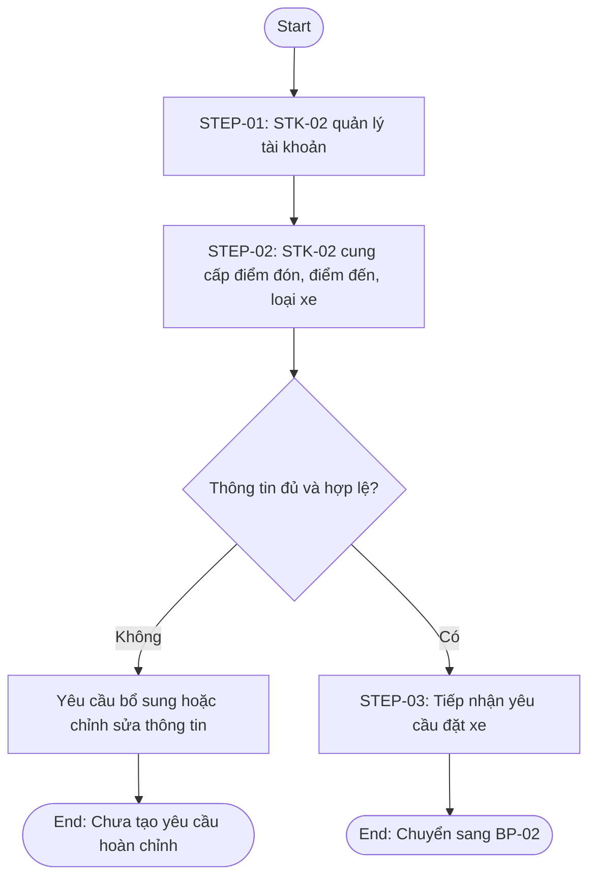

### Kiểm tra đối chiếu

| Thành phần     | Đã thể hiện? | Ghi chú                                                    |
| -------------- | ------------ | ---------------------------------------------------------- |
| STEP-01        | Có           | Quản lý tài khoản                                          |
| STEP-02        | Có           | Thông tin chuyến                                           |
| STEP-03        | Có           | Tiếp nhận và chuyển tìm tài xế; `[Suy ra]`                 |
| EXC-01, EXC-02 | Có           | Thông tin thiếu và mất kết nối; mất kết nối `[Cần làm rõ]` |

## III. BP-02 - Tìm và phân công tài xế

### Thông tin truy xuất

| Thành phần   | Giá trị                                                |
| ------------ | ------------------------------------------------------ |
| BP ID        | BP-02                                                  |
| BR liên quan | BR-08, BR-09, BR-10                                    |
| Mục tiêu     | Tìm tài xế phù hợp và xử lý từ chối/không phản hồi     |
| Trạng thái   | Đã xác nhận; tiêu chí và thời gian phản hồi cần làm rõ |

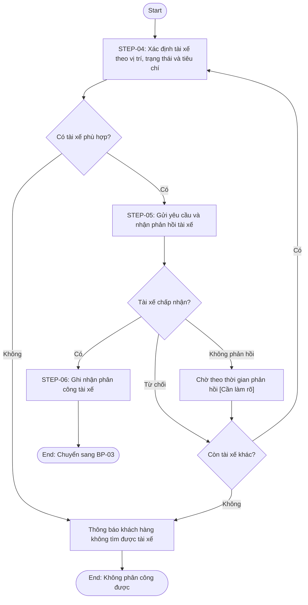

### Kiểm tra đối chiếu

| Thành phần     | Đã thể hiện? | Ghi chú                                               |
| -------------- | ------------ | ----------------------------------------------------- |
| STEP-04        | Có           | Xác định tài xế                                       |
| STEP-05        | Có           | Gửi và nhận phản hồi                                  |
| STEP-06        | Có           | Phân công                                             |
| EXC-03, EXC-04 | Có           | Không tìm thấy, từ chối                               |
| EXC-05, EXC-06 | Có           | Không phản hồi và thiếu vị trí; chính sách cần làm rõ |

## IV. BP-03 - Thực hiện và theo dõi chuyến xe

### Thông tin truy xuất

| Thành phần   | Giá trị                                                    |
| ------------ | ---------------------------------------------------------- |
| BP ID        | BP-03                                                      |
| BR liên quan | BR-03, BR-04, BR-06, BR-07                                 |
| Mục tiêu     | Tài xế thực hiện chuyến, khách hàng theo dõi tiến trình    |
| Trạng thái   | Đã xác nhận; mất kết nối và trình tự trạng thái cần làm rõ |

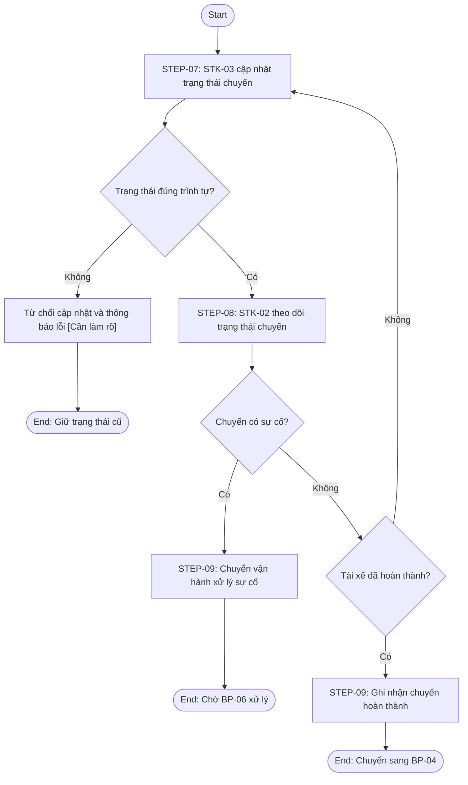

### Kiểm tra đối chiếu

| Thành phần     | Đã thể hiện? | Ghi chú                               |
| -------------- | ------------ | ------------------------------------- |
| STEP-07        | Có           | Tài xế cập nhật                       |
| STEP-08        | Có           | Khách hàng theo dõi                   |
| STEP-09        | Có           | Hoàn thành hoặc chuyển sự cố          |
| EXC-07, EXC-08 | Có           | Trạng thái sai và sự cố               |
| EXC-09         | Có một phần  | Mất kết nối được giữ ở `[Cần làm rõ]` |

## V. BP-04 - Tính cước và thanh toán chuyến xe

### Thông tin truy xuất

| Thành phần   | Giá trị                                                                |
| ------------ | ---------------------------------------------------------------------- |
| BP ID        | BP-04                                                                  |
| BR liên quan | BR-12, BR-13, BR-14, BR-15                                             |
| Mục tiêu     | Xác định số tiền và xử lý tiền mặt/điện tử, không lưu dữ liệu nhạy cảm |
| Trạng thái   | Đã xác nhận; công thức và chính sách cần làm rõ                        |

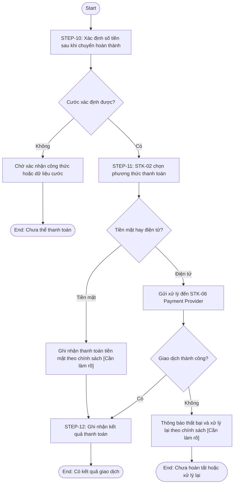

### Kiểm tra đối chiếu

| Thành phần             | Đã thể hiện? | Ghi chú                                                 |
| ---------------------- | ------------ | ------------------------------------------------------- |
| STEP-10                | Có           | Xác định số tiền                                        |
| STEP-11                | Có           | Chọn phương thức                                        |
| STEP-12                | Có           | Ghi nhận kết quả                                        |
| EXC-10                 | Có           | Cước chưa đủ                                            |
| EXC-11, EXC-12, EXC-13 | Có           | Thất bại, provider không phản hồi, dữ liệu không hợp lệ |

## VI. BP-05 - Gửi và quản lý thông báo

### Thông tin truy xuất

| Thành phần   | Giá trị                                                       |
| ------------ | ------------------------------------------------------------- |
| BP ID        | BP-05                                                         |
| BR liên quan | BR-11                                                         |
| Mục tiêu     | Gửi thông tin sự kiện đến khách hàng, tài xế và bên liên quan |
| Trạng thái   | Đã xác nhận; kênh/provider cần làm rõ                         |

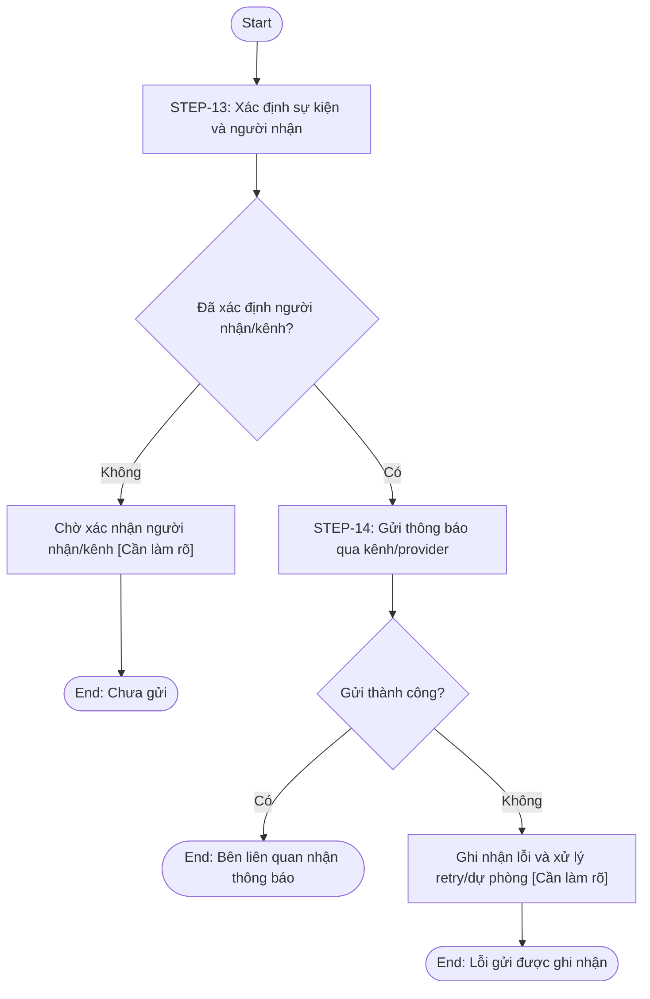

### Kiểm tra đối chiếu

| Thành phần     | Đã thể hiện? | Ghi chú                               |
| -------------- | ------------ | ------------------------------------- |
| STEP-13        | Có           | Sự kiện/người nhận                    |
| STEP-14        | Có           | Gửi và ghi nhận                       |
| EXC-14, EXC-15 | Có           | Provider lỗi và thiếu người nhận/kênh |

## VII. BP-06 - Vận hành và xử lý sự cố

### Thông tin truy xuất

| Thành phần   | Giá trị                                                  |
| ------------ | -------------------------------------------------------- |
| BP ID        | BP-06                                                    |
| BR liên quan | BR-05, BR-16, BR-17                                      |
| Mục tiêu     | Quản lý đối tượng/chuyến, kiểm soát quyền và xử lý sự cố |
| Trạng thái   | Đã xác nhận; thao tác nhạy cảm cần làm rõ                |

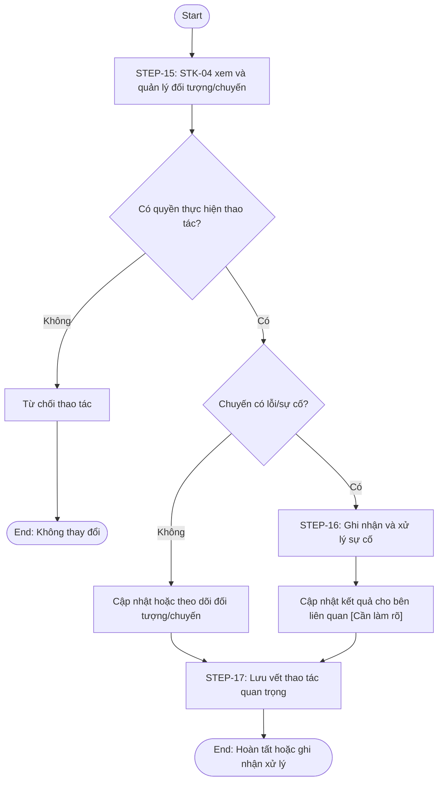

### Kiểm tra đối chiếu

| Thành phần             | Đã thể hiện? | Ghi chú                                  |
| ---------------------- | ------------ | ---------------------------------------- |
| STEP-15                | Có           | Theo dõi/quản lý                         |
| STEP-16                | Có           | Xử lý sự cố                              |
| STEP-17                | Có           | Lưu vết                                  |
| EXC-16, EXC-17, EXC-18 | Có           | Không quyền, tài khoản lỗi, chuyến sự cố |

## VIII. BP-07 - Báo cáo hoạt động

### Thông tin truy xuất

| Thành phần   | Giá trị                                       |
| ------------ | --------------------------------------------- |
| BP ID        | BP-07                                         |
| BR liên quan | BR-18                                         |
| Mục tiêu     | Cung cấp báo cáo hoạt động và hiệu quả tài xế |
| Trạng thái   | Đã xác nhận; KPI/kỳ báo cáo cần làm rõ        |

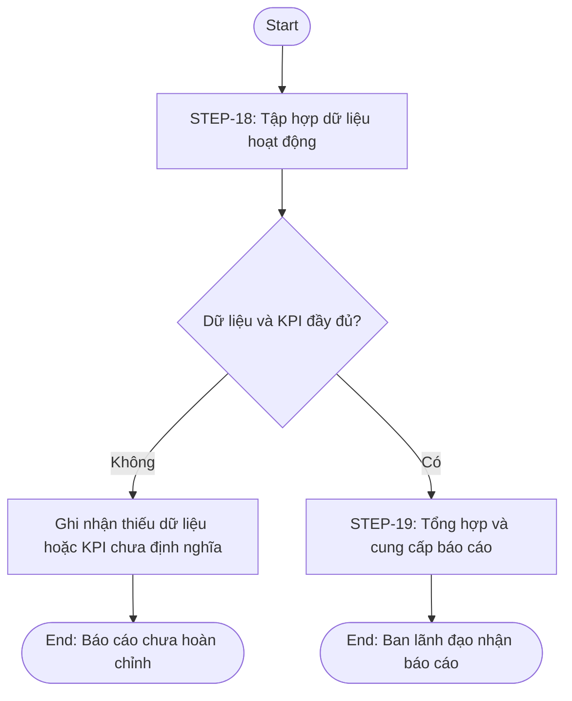

### Kiểm tra đối chiếu

| Thành phần     | Đã thể hiện? | Ghi chú                              |
| -------------- | ------------ | ------------------------------------ |
| STEP-18        | Có           | Tập hợp dữ liệu                      |
| STEP-19        | Có           | Tổng hợp/cung cấp                    |
| EXC-19, EXC-20 | Có           | Dữ liệu thiếu và KPI chưa định nghĩa |

## IX. BP-08 - Quản lý khả năng mở rộng nền tảng

### Thông tin truy xuất

| Thành phần   | Giá trị                                                           |
| ------------ | ----------------------------------------------------------------- |
| BP ID        | BP-08                                                             |
| BR liên quan | BR-19, BR-20                                                      |
| Mục tiêu     | Đánh giá và triển khai thay đổi/mở rộng theo nhu cầu doanh nghiệp |
| Trạng thái   | [Có khả năng vượt phạm vi đồ án - cần xác nhận]                   |

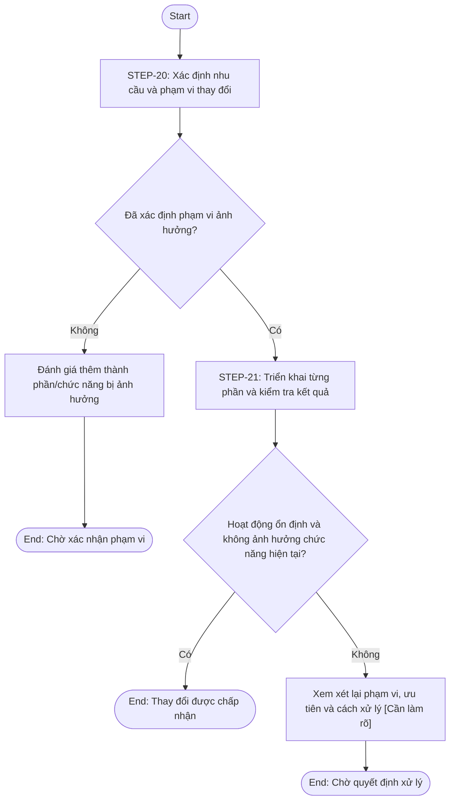

### Kiểm tra đối chiếu

| Thành phần             | Đã thể hiện? | Ghi chú                                                |
| ---------------------- | ------------ | ------------------------------------------------------ |
| STEP-20                | Có           | Xác định nhu cầu/phạm vi                               |
| STEP-21                | Có           | Triển khai/kiểm tra; `[Suy ra]`                        |
| EXC-21, EXC-22, EXC-23 | Có           | Không rõ ảnh hưởng, ảnh hưởng chức năng, không ổn định |

## X. Ma trận BP -> Sơ đồ

| BP ID | Tên BP                                  | Sơ đồ đã tạo? | Có Start? | Có End? | Trạng thái                             |
| ----- | --------------------------------------- | ------------- | --------- | ------- | -------------------------------------- |
| BP-01 | Quản lý tài khoản và tạo yêu cầu đặt xe | Có            | Có        | Có      | Đã xác nhận                            |
| BP-02 | Tìm và phân công tài xế                 | Có            | Có        | Có      | Cần làm rõ thời gian phản hồi/tiêu chí |
| BP-03 | Thực hiện và theo dõi chuyến xe         | Có            | Có        | Có      | Cần làm rõ mất kết nối/trình tự        |
| BP-04 | Tính cước và thanh toán chuyến xe       | Có            | Có        | Có      | Cần làm rõ công thức/chính sách        |
| BP-05 | Gửi và quản lý thông báo                | Có            | Có        | Có      | Cần làm rõ provider/kênh               |
| BP-06 | Vận hành và xử lý sự cố                 | Có            | Có        | Có      | Cần làm rõ quyền/thông báo             |
| BP-07 | Báo cáo hoạt động                       | Có            | Có        | Có      | Cần làm rõ KPI/dữ liệu                 |
| BP-08 | Quản lý khả năng mở rộng nền tảng       | Có            | Có        | Có      | Có khả năng vượt phạm vi đồ án         |

Mỗi BP có đúng một sơ đồ Mermaid; không có sơ đồ ngoài phạm vi BP-01 đến BP-08.

## XI. Các vấn đề cần làm rõ khi vẽ sơ đồ

| Issue ID | BP ID        | Nội dung chưa rõ                                                      | Ảnh hưởng đến sơ đồ                   | Cần xác nhận |
| -------- | ------------ | --------------------------------------------------------------------- | ------------------------------------- | ------------ |
| BPD-I01  | BP-01        | Điều kiện thông tin tài khoản/đặt xe hợp lệ và chính sách mất kết nối | Nhánh xác thực và điểm kết thúc       | Có           |
| BPD-I02  | BP-02        | Tiêu chí ưu tiên, thời gian phản hồi và chính sách khi không phản hồi | Nhánh quay lại tìm tài xế             | Có           |
| BPD-I03  | BP-02, BP-03 | Cách xử lý khi dữ liệu vị trí không khả dụng                          | Nhánh tìm tài xế và thời gian dự kiến | Có           |
| BPD-I04  | BP-03        | Trình tự đầy đủ của trạng thái chuyến                                 | Điều kiện cập nhật và kết thúc chuyến | Có           |
| BPD-I05  | BP-03        | Chính sách mất kết nối trong khi thực hiện chuyến                     | Nhánh ngoại lệ và khả năng tiếp tục   | Có           |
| BPD-I06  | BP-04        | Công thức cước, thanh toán lại và provider không phản hồi             | Nhánh tính cước/thanh toán            | Có           |
| BPD-I07  | BP-05        | Người nhận, kênh, retry và cơ chế dự phòng thông báo                  | Nhánh gửi lỗi                         | Có           |
| BPD-I08  | BP-06        | Danh sách thao tác nhạy cảm và cách xử lý kết quả sự cố               | Nhánh quyền và xử lý sự cố            | Có           |
| BPD-I09  | BP-07        | Định nghĩa KPI, kỳ báo cáo và dữ liệu thiếu                           | Nhánh báo cáo chưa hoàn chỉnh         | Có           |
| BPD-I10  | BP-08        | Tiêu chí ổn định, rollback/xử lý sau mở rộng                          | Nhánh thay đổi không ổn định          | Có           |

## XII. Kiểm tra tính đúng đắn

### 12.1. Kiểm tra bao phủ BP

BP-01 đến BP-08 đều có đúng một sơ đồ, giữ nguyên tên BP, BR liên quan và mục tiêu từ bước 06.

### 12.2. Kiểm tra luồng

Mỗi sơ đồ dùng `flowchart TD`, có ít nhất một Start và End, các nhánh đều có nhãn và có điểm kết thúc hoặc quay lại được mô tả trong BP. Các nhánh chưa có chính sách được ghi `[Cần làm rõ]` thay vì tự quyết định.

### 12.3. Kiểm tra nghiệp vụ

Không thêm nghiệp vụ mới ngoài BP. Các bước trong sơ đồ tương ứng với `STEP-01` đến `STEP-21`; các ngoại lệ EXC-01 đến EXC-23 chỉ được thể hiện khi có liên quan đến luồng.

### 12.4. Kiểm tra Mermaid

Các sơ đồ dùng node ID riêng trong từng sơ đồ, mũi tên `-->`, nhãn nhánh rõ và không chứa Code, Database, SQL, API, Framework hoặc giao diện chi tiết.

## XIII. Giới hạn của bước 07

- Chỉ chuyển Business Process thành Business Process Diagram bằng Mermaid.
- Không xác định hoặc phân rã Functional Requirement.
- Không tạo Business Rule hoặc Exception mới.
- Không xác định Actor chính thức, Use Case, Use Case Specification hoặc Acceptance Criteria.
- Không mô hình hóa dữ liệu hoặc thiết kế Database, Architecture, API, giao diện, Code.

## XIV. Đầu ra chuyển tiếp

Các sơ đồ BP là đầu vào tham khảo cho bước xác định Functional Requirement, Actor/Use Case và các bước sau. Chuỗi truy xuất được giữ như sau:

`NEED -> STK -> SCOPE -> BR -> BP -> Sơ đồ BP -> FR -> Rule / Exception -> NFR -> DATA -> ACTOR / UC -> AC -> RTM`

# Bước 08 - Xác định Functional Requirement

## I. Phạm vi và chuỗi truy xuất

Phần này thực hiện bước 08 theo `PROMPTS_BA/08_XacDinhFunctionalRequirement_FR.md`, dựa trên BR-01 đến BR-20, BP-01 đến BP-08, các STEP-01 đến STEP-21 và sơ đồ BP đã xác định.

Chuỗi truy xuất của mỗi FR là:

`Nguồn -> NEED -> STK -> SCOPE -> BR -> BP -> STEP -> FR`

Các FR dưới đây là FR cấp cao. Chưa tạo mã FR con dạng `FR-01.1`, chưa đặc tả Rule/Exception, NFR, Actor/Use Case, Acceptance Criteria, Database, API hoặc Code.

## II. Danh sách Functional Requirement cấp cao

| FR ID | Functional Requirement                                                                                                       | BR liên quan        | BP liên quan | Step liên quan   | Đối tượng sử dụng/kích hoạt    | Scope        | Trạng thái                                                     |
| ----- | ---------------------------------------------------------------------------------------------------------------------------- | ------------------- | ------------ | ---------------- | ------------------------------ | ------------ | -------------------------------------------------------------- |
| FR-01 | Hệ thống cho phép khách hàng đăng ký, đăng nhập và quản lý thông tin tài khoản cá nhân.                                      | BR-01               | BP-01        | STEP-01          | STK-02                         | S-F01        | Đã xác nhận                                                    |
| FR-02 | Hệ thống cho phép khách hàng nhập và gửi thông tin yêu cầu đặt xe gồm điểm đón, điểm đến và loại xe.                         | BR-02               | BP-01        | STEP-02          | STK-02                         | S-F02        | Đã xác nhận                                                    |
| FR-03 | Hệ thống tiếp nhận và chuyển yêu cầu đặt xe sang quá trình tìm tài xế.                                                       | BR-02               | BP-01        | STEP-03          | STK-01, STK-02                 | S-F02, S-F03 | [Suy ra] cần thiết để thực hiện BR-02 và BR-09                 |
| FR-04 | Hệ thống xác định các tài xế có khả năng phù hợp dựa trên vị trí, trạng thái sẵn sàng và tiêu chí vận hành được xác nhận.    | BR-08, BR-09        | BP-02        | STEP-04          | STK-01, STK-03, STK-04         | S-F03, S-F05 | Đã xác nhận; tiêu chí cần làm rõ                               |
| FR-05 | Hệ thống gửi yêu cầu chuyến đến tài xế phù hợp và ghi nhận phản hồi chấp nhận, từ chối hoặc không phản hồi.                  | BR-06, BR-09, BR-10 | BP-02        | STEP-05          | STK-03                         | S-F03, S-F07 | Đã xác nhận; thời gian phản hồi cần làm rõ                     |
| FR-06 | Hệ thống ghi nhận kết quả phân công tài xế cho chuyến khi tài xế chấp nhận.                                                  | BR-09               | BP-02        | STEP-06          | STK-01, STK-02, STK-03         | S-F03        | Đã xác nhận                                                    |
| FR-07 | Hệ thống tiếp tục tìm tài xế khác khi tài xế từ chối hoặc không phản hồi và thông báo khi không còn tài xế phù hợp.          | BR-10               | BP-02        | STEP-05, STEP-06 | STK-02, STK-03, STK-04         | S-F03, S-F07 | Đã xác nhận; chính sách chuyển tiếp cần làm rõ                 |
| FR-08 | Hệ thống hỗ trợ tài xế cập nhật các trạng thái trong quá trình thực hiện chuyến.                                             | BR-07               | BP-03        | STEP-07          | STK-03                         | S-F04        | Đã xác nhận; trình tự trạng thái cần làm rõ                    |
| FR-09 | Hệ thống hiển thị cho khách hàng thông tin và trạng thái tiến trình của chuyến xe.                                           | BR-03, BR-04        | BP-03        | STEP-08          | STK-02                         | S-F04        | Đã xác nhận; thời gian dự kiến cần làm rõ                      |
| FR-10 | Hệ thống tiếp nhận kết quả chuyến hoàn thành và chuyển sang quá trình tính cước/thanh toán.                                  | BR-07, BR-12        | BP-03        | STEP-09          | STK-02, STK-03                 | S-F04, S-F06 | [Suy ra] cần thiết để nối BP-03 với BP-04                      |
| FR-11 | Hệ thống cho phép ghi nhận hoặc chuyển thông tin chuyến có sự cố cho bộ phận vận hành.                                       | BR-16               | BP-03, BP-06 | STEP-09, STEP-16 | STK-02, STK-03, STK-04         | S-F04, S-F08 | Đã xác nhận; cách thông báo cần làm rõ                         |
| FR-12 | Hệ thống quản lý thông tin vị trí tài xế phục vụ việc tìm tài xế gần khách hàng.                                             | BR-08, BR-09        | BP-02        | STEP-04          | STK-03, STK-01                 | S-F05        | Đã xác nhận; cách thu thập/tần suất cần làm rõ                 |
| FR-13 | Hệ thống xác định số tiền khách hàng phải trả sau khi chuyến hoàn thành dựa trên loại dịch vụ và thông tin chuyến.           | BR-12               | BP-04        | STEP-10          | STK-01, STK-02                 | S-F06        | Đã xác nhận; công thức cước cần làm rõ                         |
| FR-14 | Hệ thống cho phép khách hàng lựa chọn phương thức thanh toán tiền mặt hoặc điện tử.                                          | BR-13               | BP-04        | STEP-11          | STK-02                         | S-F06        | Đã xác nhận                                                    |
| FR-15 | Hệ thống ghi nhận kết quả thanh toán tiền mặt theo chính sách doanh nghiệp.                                                  | BR-13               | BP-04        | STEP-11, STEP-12 | STK-01, STK-02                 | S-F06        | Đã xác nhận; chính sách tiền mặt cần làm rõ                    |
| FR-16 | Hệ thống gửi yêu cầu thanh toán điện tử đến Payment Provider và tiếp nhận kết quả giao dịch.                                 | BR-14               | BP-04        | STEP-11, STEP-12 | STK-02, STK-06                 | S-F06        | Đã xác nhận; provider cụ thể cần làm rõ                        |
| FR-17 | Hệ thống ghi nhận thanh toán điện tử thất bại, thông báo khách hàng và hỗ trợ xử lý lại theo chính sách doanh nghiệp.        | BR-14               | BP-04        | STEP-12          | STK-02, STK-06                 | S-F06, S-F07 | Đã xác nhận; chính sách xử lý lại cần làm rõ                   |
| FR-18 | Hệ thống không lưu trực tiếp thông tin nhạy cảm của thẻ hoặc tài khoản thanh toán trong CAB.                                 | BR-15               | BP-04        | STEP-12          | STK-01, STK-02, STK-06         | S-F06, S-F09 | Đã xác nhận                                                    |
| FR-19 | Hệ thống xác định sự kiện, bên nhận và thông tin cần gửi thông báo.                                                          | BR-11               | BP-05        | STEP-13          | STK-02, STK-03, STK-04, STK-07 | S-F07        | Đã xác nhận; kênh và người nhận cần làm rõ                     |
| FR-20 | Hệ thống gửi thông báo qua kênh/provider được xác định và ghi nhận kết quả gửi.                                              | BR-11               | BP-05        | STEP-14          | STK-07                         | S-F07        | Đã xác nhận; provider/retry cần làm rõ                         |
| FR-21 | Hệ thống cho phép nhân viên vận hành xem và quản lý thông tin khách hàng, tài xế, phương tiện và chuyến theo quyền được cấp. | BR-05, BR-16        | BP-06        | STEP-15          | STK-04                         | S-F08, S-F09 | Đã xác nhận; danh sách quyền cần làm rõ                        |
| FR-22 | Hệ thống kiểm tra quyền trước khi cho phép thực hiện thao tác quản trị.                                                      | BR-17               | BP-06        | STEP-15          | STK-04                         | S-F09        | Đã xác nhận; ma trận quyền cần làm rõ                          |
| FR-23 | Hệ thống cho phép nhân viên vận hành ghi nhận và cập nhật quá trình xử lý chuyến bị lỗi hoặc sự cố.                          | BR-16               | BP-06        | STEP-16          | STK-04                         | S-F08        | Đã xác nhận; trạng thái xử lý cần làm rõ                       |
| FR-24 | Hệ thống cung cấp thông tin kết quả xử lý sự cố cho các bên liên quan theo chính sách được xác nhận.                         | BR-16               | BP-06        | STEP-16          | STK-02, STK-03, STK-04         | S-F07, S-F08 | [Suy ra] từ nhu cầu hỗ trợ vận hành; cách thông báo cần làm rõ |
| FR-25 | Hệ thống lưu vết các thao tác quan trọng để phục vụ kiểm tra khi có sự cố.                                                   | BR-17               | BP-06        | STEP-17          | STK-01, STK-04                 | S-F09        | Đã xác nhận; danh sách và thời gian lưu cần làm rõ             |
| FR-26 | Hệ thống tập hợp dữ liệu hoạt động cần thiết cho báo cáo.                                                                    | BR-18               | BP-07        | STEP-18          | STK-01, STK-04, STK-05         | S-F10        | Đã xác nhận; dữ liệu/KPI cần làm rõ                            |
| FR-27 | Hệ thống tổng hợp và cung cấp báo cáo về số chuyến, doanh thu, tỷ lệ hoàn thành, tỷ lệ hủy và hiệu quả tài xế.               | BR-18               | BP-07        | STEP-19          | STK-01, STK-05                 | S-F10        | Đã xác nhận; công thức KPI cần làm rõ                          |
| FR-28 | Hệ thống hỗ trợ ghi nhận nhu cầu, phạm vi ảnh hưởng và ưu tiên của thay đổi/mở rộng nền tảng.                                | BR-19, BR-20        | BP-08        | STEP-20          | STK-01, STK-05, STK-09         | S-F11        | [Có khả năng vượt phạm vi đồ án - cần xác nhận]                |
| FR-29 | Hệ thống hỗ trợ triển khai và kiểm tra thay đổi từng phần theo phạm vi được xác nhận.                                        | BR-19, BR-20        | BP-08        | STEP-21          | STK-09                         | S-F11        | [Có khả năng vượt phạm vi đồ án - cần xác nhận]                |
| FR-30 | Hệ thống hỗ trợ ghi nhận kết quả khi thay đổi ảnh hưởng hoặc làm hệ thống hoạt động không ổn định.                           | BR-19, BR-20        | BP-08        | STEP-21          | STK-01, STK-05, STK-09         | S-F11        | [Có khả năng vượt phạm vi đồ án - cần xác nhận]                |

## III. Danh mục chi tiết và truy xuất từng FR

Bảng dưới đây bổ sung điều kiện đầu vào, kết quả chức năng và tham chiếu điều kiện/ngoại lệ cho từng FR. Các nội dung chưa được xác nhận vẫn được ghi rõ, không tự hoàn thiện.

| FR ID | Điều kiện đầu vào                                      | Kết quả chức năng                                             | Quy tắc/ngoại lệ tham chiếu                 | Nguồn truy xuất                                                        |
| ----- | ------------------------------------------------------ | ------------------------------------------------------------- | ------------------------------------------- | ---------------------------------------------------------------------- |
| FR-01 | Khách hàng có nhu cầu sử dụng dịch vụ                  | Tài khoản/thông tin cá nhân được quản lý                      | EXC-01, EXC-02; BP-01                       | NEED-01 -> STK-02 -> S-F01 -> BR-01 -> BP-01 -> STEP-01                |
| FR-02 | Có điểm đón, điểm đến và loại xe                       | Yêu cầu đặt xe được gửi                                       | EXC-01; BP-01                               | NEED-02 -> STK-02 -> S-F02 -> BR-02 -> BP-01 -> STEP-02                |
| FR-03 | Khách hàng đã gửi yêu cầu                              | Yêu cầu được tiếp nhận để tìm tài xế                          | [Suy ra]; BP-01                             | NEED-02 -> STK-01/02 -> S-F02/03 -> BR-02 -> BP-01 -> STEP-03          |
| FR-04 | Có yêu cầu chuyến và dữ liệu tài xế                    | Danh sách tài xế phù hợp được xác định                        | EXC-03, EXC-06; BP-02                       | NEED-08/09 -> STK-01/03/04 -> S-F03/05 -> BR-08/09 -> BP-02 -> STEP-04 |
| FR-05 | Có tài xế phù hợp để gửi yêu cầu                       | Phản hồi nhận/từ chối/không phản hồi được ghi nhận            | EXC-04, EXC-05; BP-02                       | NEED-06/09 -> STK-03 -> S-F03/07 -> BR-06/09/10 -> BP-02 -> STEP-05    |
| FR-06 | Tài xế chấp nhận chuyến                                | Kết quả phân công được ghi nhận                               | BP-02                                       | NEED-09 -> STK-01/02/03 -> S-F03 -> BR-09 -> BP-02 -> STEP-06          |
| FR-07 | Tài xế từ chối/không phản hồi hoặc không còn tài xế    | Tìm tiếp hoặc thông báo không phân công được                  | EXC-03, EXC-04, EXC-05; BP-02               | NEED-09 -> STK-02/03/04 -> S-F03/07 -> BR-10 -> BP-02 -> STEP-05/06    |
| FR-08 | Chuyến đã phân công                                    | Trạng thái chuyến được cập nhật                               | EXC-07, EXC-09; BP-03                       | NEED-07 -> STK-03 -> S-F04 -> BR-07 -> BP-03 -> STEP-07                |
| FR-09 | Có trạng thái/thông tin chuyến                         | Khách hàng xem được tiến trình chuyến                         | BP-03                                       | NEED-03/04 -> STK-02 -> S-F04 -> BR-03/04 -> BP-03 -> STEP-08          |
| FR-10 | Chuyến hoàn thành                                      | Kết quả hoàn thành được chuyển sang tính cước                 | BP-03/BP-04                                 | NEED-07/11 -> STK-02/03 -> S-F04/06 -> BR-07/12 -> BP-03 -> STEP-09    |
| FR-11 | Chuyến có lỗi/sự cố                                    | Thông tin được chuyển cho vận hành                            | EXC-08; BP-03/BP-06                         | NEED-15 -> STK-02/03/04 -> S-F04/08 -> BR-16 -> STEP-09/16             |
| FR-12 | Có dữ liệu vị trí tài xế                               | Vị trí được quản lý để hỗ trợ tìm gần                         | EXC-06; BP-02                               | NEED-08 -> STK-03/01 -> S-F05 -> BR-08 -> BP-02 -> STEP-04             |
| FR-13 | Chuyến hoàn thành và có thông tin tính cước            | Số tiền phải trả được xác định                                | EXC-10; BP-04                               | NEED-11 -> STK-01/02 -> S-F06 -> BR-12 -> BP-04 -> STEP-10             |
| FR-14 | Có số tiền phải trả                                    | Phương thức tiền mặt/điện tử được lựa chọn                    | BP-04                                       | NEED-12 -> STK-02 -> S-F06 -> BR-13 -> BP-04 -> STEP-11                |
| FR-15 | Khách hàng chọn tiền mặt                               | Kết quả thanh toán tiền mặt được ghi nhận                     | [Cần làm rõ] chính sách tiền mặt; BP-04     | NEED-12 -> STK-01/02 -> S-F06 -> BR-13 -> BP-04 -> STEP-11/12          |
| FR-16 | Khách hàng chọn điện tử và Payment Provider khả dụng   | Kết quả giao dịch điện tử được tiếp nhận                      | EXC-11, EXC-12, EXC-13; BP-04               | NEED-12/13 -> STK-02/06 -> S-F06 -> BR-14/15 -> BP-04 -> STEP-11/12    |
| FR-17 | Giao dịch điện tử thất bại                             | Thất bại được thông báo và xử lý lại theo chính sách          | EXC-11, EXC-12; BP-04                       | NEED-12 -> STK-02/06 -> S-F06/07 -> BR-14 -> BP-04 -> STEP-12          |
| FR-18 | Phát sinh xử lý thanh toán                             | Dữ liệu nhạy cảm không được lưu trực tiếp trong CAB           | BR-15; BP-04                                | NEED-13 -> STK-01/02/06 -> S-F06/09 -> BR-15 -> BP-04 -> STEP-12       |
| FR-19 | Phát sinh sự kiện cần thông báo                        | Sự kiện và người nhận được xác định                           | EXC-15; BP-05                               | NEED-10 -> STK-02/03/04/07 -> S-F07 -> BR-11 -> BP-05 -> STEP-13       |
| FR-20 | Đã xác định sự kiện, người nhận và kênh                | Thông báo được gửi và kết quả được ghi nhận                   | EXC-14, EXC-15; BP-05                       | NEED-10 -> STK-07 -> S-F07 -> BR-11 -> BP-05 -> STEP-14                |
| FR-21 | Nhân viên vận hành có yêu cầu quản lý và quyền phù hợp | Thông tin đối tượng/chuyến được xem hoặc quản lý              | EXC-16, EXC-17; BP-06                       | NEED-05/14/15 -> STK-04 -> S-F08/09 -> BR-05/16/17 -> BP-06 -> STEP-15 |
| FR-22 | Có thao tác quản trị cần thực hiện                     | Chỉ thao tác được cấp quyền mới được tiếp tục                 | EXC-16, EXC-17; BP-06                       | NEED-16 -> STK-04 -> S-F09 -> BR-17 -> BP-06 -> STEP-15                |
| FR-23 | Chuyến được phát hiện lỗi/sự cố                        | Sự cố và quá trình xử lý được ghi nhận                        | EXC-18; BP-06                               | NEED-15 -> STK-04 -> S-F08 -> BR-16 -> BP-06 -> STEP-16                |
| FR-24 | Có kết quả xử lý cần thông tin cho bên liên quan       | Kết quả được cung cấp theo chính sách                         | [Suy ra], [Cần làm rõ]; BP-06               | NEED-15 -> STK-02/03/04 -> S-F07/08 -> BR-16 -> BP-06 -> STEP-16       |
| FR-25 | Có thao tác được xác định là quan trọng                | Dấu vết thao tác được lưu để kiểm tra                         | [Cần làm rõ] danh sách/thời gian lưu; BP-06 | NEED-19 -> STK-01/04 -> S-F09 -> BR-17 -> BP-06 -> STEP-17             |
| FR-26 | Có dữ liệu hoạt động                                   | Dữ liệu được tập hợp cho báo cáo                              | EXC-19; BP-07                               | NEED-17 -> STK-01/04/05 -> S-F10 -> BR-18 -> BP-07 -> STEP-18          |
| FR-27 | Dữ liệu và KPI được xác định                           | Báo cáo hoạt động được tổng hợp/cung cấp                      | EXC-19, EXC-20; BP-07                       | NEED-17 -> STK-01/05 -> S-F10 -> BR-18 -> BP-07 -> STEP-19             |
| FR-28 | Có nhu cầu mở rộng/thay đổi                            | Nhu cầu, phạm vi ảnh hưởng và ưu tiên được ghi nhận           | [Cần làm rõ]; BP-08                         | NEED-18/20 -> STK-01/05/09 -> S-F11 -> BR-19/20 -> BP-08 -> STEP-20    |
| FR-29 | Thay đổi được xác nhận về phạm vi                      | Thay đổi được triển khai và kiểm tra từng phần                | EXC-21, EXC-22; BP-08                       | NEED-18/20 -> STK-09 -> S-F11 -> BR-19/20 -> BP-08 -> STEP-21          |
| FR-30 | Kết quả thay đổi được kiểm tra                         | Trạng thái ổn định/ảnh hưởng được ghi nhận để quyết định tiếp | EXC-22, EXC-23; BP-08                       | NEED-18/20 -> STK-01/05/09 -> S-F11 -> BR-19/20 -> BP-08 -> STEP-21    |

Không xác định Primary Actor hoặc Supporting Actor chính thức trong bảng trên; chỉ sử dụng Stakeholder/đối tượng từ bước 03.

## IV. Kiểm tra BR -> BP -> FR

| BR ID                      | BP ID        | Step ID                   | FR ID                      | Mối liên hệ                          | Được bao phủ? | Ghi chú                                         |
| -------------------------- | ------------ | ------------------------- | -------------------------- | ------------------------------------ | ------------- | ----------------------------------------------- |
| BR-01                      | BP-01        | STEP-01                   | FR-01                      | Quản lý tài khoản                    | Có            | Đã xác nhận                                     |
| BR-02                      | BP-01        | STEP-02, STEP-03          | FR-02, FR-03               | Tạo và tiếp nhận yêu cầu             | Có            | FR-03 `[Suy ra]`                                |
| BR-03, BR-04               | BP-03        | STEP-08                   | FR-09                      | Theo dõi, lịch sử và kết quả chuyến  | Có            | Đánh giá/lịch sử cần làm rõ                     |
| BR-05                      | BP-06        | STEP-15                   | FR-21                      | Quản lý hồ sơ/phương tiện/trạng thái | Có            | Đã xác nhận                                     |
| BR-06, BR-09, BR-10        | BP-02        | STEP-04, STEP-05, STEP-06 | FR-04, FR-05, FR-06, FR-07 | Tìm, phản hồi và phân công           | Có            | Tiêu chí/thời gian cần làm rõ                   |
| BR-07                      | BP-03        | STEP-07, STEP-09          | FR-08, FR-10               | Cập nhật và kết thúc chuyến          | Có            | Trình tự cần làm rõ                             |
| BR-08                      | BP-02        | STEP-04                   | FR-04, FR-12               | Vị trí và tìm gần                    | Có            | Cách thu thập cần làm rõ                        |
| BR-11                      | BP-05        | STEP-13, STEP-14          | FR-19, FR-20               | Thông báo                            | Có            | Provider/kênh cần làm rõ                        |
| BR-12, BR-13, BR-14, BR-15 | BP-04        | STEP-10, STEP-11, STEP-12 | FR-13 đến FR-18            | Cước, thanh toán và bảo vệ dữ liệu   | Có            | Công thức/chính sách cần làm rõ                 |
| BR-16                      | BP-03, BP-06 | STEP-09, STEP-15, STEP-16 | FR-11, FR-21, FR-23, FR-24 | Vận hành và sự cố                    | Có            | Kết quả thông báo cần làm rõ                    |
| BR-17                      | BP-06        | STEP-15, STEP-17          | FR-22, FR-25               | Quyền và audit                       | Có            | Chi tiết quyền/lưu vết cần làm rõ               |
| BR-18                      | BP-07        | STEP-18, STEP-19          | FR-26, FR-27               | Báo cáo                              | Có            | KPI cần làm rõ                                  |
| BR-19, BR-20               | BP-08        | STEP-20, STEP-21          | FR-28, FR-29, FR-30        | Mở rộng và thay đổi                  | Có            | [Có khả năng vượt phạm vi đồ án - cần xác nhận] |

## V. Kiểm tra phạm vi và trạng thái

| FR ID           | Scope ID                   | Trong phạm vi? | Có khả năng vượt phạm vi?        | Trạng thái                                            | Xử lý   |
| --------------- | -------------------------- | -------------- | -------------------------------- | ----------------------------------------------------- | ------- |
| FR-01 đến FR-03 | S-F01, S-F02               | Có             | Không                            | Đã xác nhận                                           | Giữ lại |
| FR-04 đến FR-12 | S-F03, S-F04, S-F05, S-F07 | Có             | FR-04/FR-07/FR-12 có thể lớn     | Cần xác nhận chi tiết vị trí/ghép tài xế              |
| FR-13 đến FR-18 | S-F06, S-F09               | Có             | FR-16/FR-17 có thể lớn           | Cần xác nhận provider/chính sách                      |
| FR-19, FR-20    | S-F07                      | Có             | FR-20 có thể lớn nếu đa provider | Cần xác nhận kênh ban đầu                             |
| FR-21 đến FR-25 | S-F08, S-F09               | Có             | FR-21/FR-25 có thể lớn           | Ưu tiên bộ vận hành/audit tối thiểu nếu được xác nhận |
| FR-26, FR-27    | S-F10                      | Có             | FR-27 có thể lớn                 | Cần xác nhận KPI và phạm vi báo cáo                   |
| FR-28 đến FR-30 | S-F11                      | Có             | Có                               | [Có khả năng vượt phạm vi đồ án - cần xác nhận]       |

Không có FR nào được đánh dấu `[Ngoài phạm vi]` vì tất cả đều truy xuất được về BR và Scope đã được giữ lại ở bước 04. Các FR không được đề cập như AI, Machine Learning, Big Data, bản đồ thời gian thực hoặc báo cáo nâng cao không được tạo.

## VI. FR cần làm rõ

| FR ID               | Nội dung chưa rõ                                         | Nguyên nhân                          | Ảnh hưởng           | Cần xác nhận |
| ------------------- | -------------------------------------------------------- | ------------------------------------ | ------------------- | ------------ |
| FR-04, FR-12        | Tiêu chí phù hợp, ưu tiên và dữ liệu vị trí              | Chưa có định nghĩa chi tiết          | BP/Rule/NFR/Data    | Có           |
| FR-05, FR-07        | Thời gian phản hồi và cơ chế tìm tiếp                    | Chính sách chưa chốt                 | BP/Rule/Exception   | Có           |
| FR-08, FR-09        | Trình tự trạng thái và thời gian dự kiến                 | Chưa đủ quy tắc nghiệp vụ            | Rule/NFR/AC         | Có           |
| FR-13               | Công thức tính cước                                      | Chưa được xác định                   | Rule/Data/AC        | Có           |
| FR-15 đến FR-17     | Thanh toán tiền mặt, provider, retry và đối soát         | Chưa có chính sách cụ thể            | Rule/Exception/NFR  | Có           |
| FR-19, FR-20        | Kênh, người nhận, retry thông báo                        | Chưa xác định provider/kênh          | Scope/Exception/NFR | Có           |
| FR-21, FR-22, FR-25 | Quyền thao tác, thao tác nhạy cảm và thời gian lưu audit | Chưa có ma trận quyền/chính sách lưu | Rule/Security/NFR   | Có           |
| FR-26, FR-27        | Bộ dữ liệu, KPI, kỳ báo cáo và tỷ lệ hủy                 | Chưa định nghĩa                      | Data/AC             | Có           |
| FR-28 đến FR-30     | Mức tải, tiêu chí ổn định và cách xử lý thay đổi lỗi     | Định hướng mở rộng chưa có chi tiết  | Scope/NFR/AC        | Có           |

## VII. Kiểm tra tính đầy đủ và chất lượng

| Issue ID | Nội dung                     | Phân tích                                                                       | Ảnh hưởng      | Xử lý/đề xuất                         |
| -------- | ---------------------------- | ------------------------------------------------------------------------------- | -------------- | ------------------------------------- |
| FR-I01   | FR bị bỏ sót                 | Các BR-01 đến BR-20, BP-01 đến BP-08 và STEP-01 đến STEP-21 đều có FR liên quan | Truy xuất/FR   | Không phát hiện bỏ sót                |
| FR-I02   | FR không có nguồn            | Mỗi FR có BR, BP, Step và chuỗi NEED/STK/Scope trong danh mục                   | Truy xuất      | Không phát hiện                       |
| FR-I03   | FR trùng lặp                 | FR-04/FR-12, FR-05/FR-07 và FR-19/FR-20 có liên quan nhưng mục tiêu khác nhau   | Tách chức năng | Giữ riêng để kiểm tra và phân rã      |
| FR-I04   | FR quá rộng                  | FR-21, FR-27, FR-28 đến FR-30 chứa nhiều mục tiêu có thể cần phân rã            | Prompt 09      | Đánh dấu cần xem xét phân rã          |
| FR-I05   | FR quá chi tiết              | Không đưa Database, API, Code, framework hoặc giao diện chi tiết vào FR         | Phạm vi FR     | Không phát hiện                       |
| FR-I06   | FR chưa kiểm tra được đầy đủ | Các tiêu chí cước, KPI, quyền, phản hồi và provider chưa chốt                   | FR/AC          | Ghi `[Cần làm rõ]`, không tự suy đoán |
| FR-I07   | FR có khả năng vượt phạm vi  | FR-28 đến FR-30 và một số FR tích hợp/vận hành có nguy cơ lớn                   | Scope/kế hoạch | Giữ lại và yêu cầu xác nhận/thu gọn   |

## VIII. FR cần phân rã ở bước 09

Các FR sau có nhiều mục tiêu hoặc nhiều nhánh chức năng, cần xem xét phân rã ở prompt 09 nhưng hiện tại vẫn giữ ở cấp cao:

- FR-04: xác định tài xế theo nhiều tiêu chí.
- FR-07: tìm tiếp và thông báo không phân công được.
- FR-09: hiển thị nhiều loại thông tin theo dõi chuyến.
- FR-16, FR-17: tích hợp kết quả thanh toán và xử lý thất bại.
- FR-21, FR-23: quản lý nhiều loại đối tượng và xử lý sự cố.
- FR-27: tổng hợp nhiều chỉ số báo cáo.
- FR-28, FR-29, FR-30: ghi nhận, triển khai và kiểm tra thay đổi/mở rộng.

## IX. Tổng hợp Functional Requirement

| Thành phần                  |                Số lượng |
| --------------------------- | ----------------------: |
| Tổng số FR cấp cao          |                      30 |
| FR đã xác nhận              |                      12 |
| FR suy ra                   | 3 (FR-03, FR-10, FR-24) |
| FR cần làm rõ               |                      15 |
| FR ngoài phạm vi            |                       0 |
| FR có khả năng vượt phạm vi |                      10 |
| BR chưa có FR               |                       0 |
| BP chưa có FR               |                       0 |
| Step chưa có FR             |                       0 |
| FR trùng lặp                |                       0 |
| FR cần phân rã ở bước 09    |               9 nhóm FR |

Một FR có thể vừa được xác nhận ở mục tiêu nghiệp vụ vừa cần làm rõ về điều kiện/chi tiết hoặc có khả năng vượt giới hạn đồ án. Các trạng thái này không phủ định nguồn yêu cầu.

## X. Kết luận bước 08

### Functional Requirement chính

Hệ thống cần cung cấp các chức năng cấp cao cho tài khoản và đặt xe, tìm/phân công tài xế, theo dõi chuyến, vị trí, cước/thanh toán, thông báo, vận hành, phân quyền/audit và báo cáo. Mỗi FR đã được liên kết với BR, BP, Step, Stakeholder và Scope.

### Functional Requirement cần làm rõ

Các FR cần làm rõ tập trung vào tiêu chí ghép tài xế, thời gian phản hồi, trạng thái/vị trí, công thức cước, provider và retry thanh toán/thông báo, quyền vận hành, audit, KPI và mức tải.

### Functional Requirement có khả năng vượt phạm vi

Các FR liên quan đến tích hợp thanh toán, đa provider thông báo, vận hành/audit mở rộng, báo cáo nhiều KPI và toàn bộ BP-08 có khả năng vượt phạm vi đồ án. Các FR này được giữ lại và chuyển sang xác nhận/thu gọn.

### FR cần phân rã

FR-04, FR-07, FR-09, FR-16, FR-17, FR-21, FR-23, FR-27, FR-28, FR-29 và FR-30 cần xem xét phân rã ở bước 09 vì có nhiều mục tiêu, nhánh hoặc kết quả chức năng.

### Các vấn đề phát hiện

Không phát hiện BR, BP hoặc Step quan trọng bị bỏ sót và không có FR không có nguồn. Các điểm còn thiếu đều được đánh dấu `[Cần làm rõ]`; không tự tạo thêm chức năng ngoài phạm vi.

## XI. Giới hạn của bước 08

- Chỉ xác định Functional Requirement cấp cao từ BR/BP/Step.
- Không phân rã FR thành FR con; việc này thực hiện ở prompt 09.
- Không xác định Business Rule/Exception chi tiết, NFR, Data Model, Actor/Use Case, Acceptance Criteria hoặc RTM hoàn chỉnh.
- Không thiết kế Database, Architecture, API, giao diện, framework hoặc Code.
- Không tạo FR cho AI, Machine Learning, Big Data, bản đồ thời gian thực, báo cáo nâng cao hoặc chức năng không có nguồn.

## XII. Đầu ra chuyển tiếp

Kết quả bước 08 là đầu vào cho phân rã FR, Business Rule/Exception, NFR và Actor/Use Case. Chuỗi truy xuất được giữ như sau:

`NEED -> STK -> SCOPE -> BR -> BP -> STEP -> FR -> FR con -> Rule / Exception -> NFR -> DATA -> ACTOR / UC -> AC -> RTM`

# Bước 09 - Phân rã Functional Requirement

## I. Phạm vi và nguyên tắc

Phần này thực hiện bước 09 theo `PROMPTS_BA/09_PhanRaFunctionalRequirement_FR.md`, sử dụng 30 FR cấp cao từ bước 08. Chỉ phân rã các FR có nhiều mục tiêu, nhiều kết quả hoặc nhiều bước nghiệp vụ độc lập. FR đơn nhất được giữ nguyên và ghi rõ không cần phân rã.

Chuỗi truy xuất được giữ nguyên:

`NEED -> STK -> SCOPE -> BR -> BP -> STEP -> FR cấp cao -> FR con`

Không tạo BR, BP, Business Rule, Exception chi tiết, NFR, Actor/Use Case, Acceptance Criteria, Database, API hoặc Code mới.

## II. Danh sách phân rã

| FR cha | FR con        | Nội dung FR con                                                           | BR/BP/Step                 | Đối tượng                      | Trạng thái                       |
| ------ | ------------- | ------------------------------------------------------------------------- | -------------------------- | ------------------------------ | -------------------------------- |
| FR-01  | FR-01.1       | Đăng ký tài khoản khách hàng                                              | BR-01/BP-01/STEP-01        | STK-02                         | Đã xác nhận                      |
| FR-01  | FR-01.2       | Đăng nhập để sử dụng chức năng yêu cầu tài khoản                          | BR-01/BP-01/STEP-01        | STK-02                         | [Suy ra]                         |
| FR-01  | FR-01.3       | Cập nhật thông tin cá nhân                                                | BR-01/BP-01/STEP-01        | STK-02                         | Đã xác nhận                      |
| FR-02  | FR-02.1       | Cung cấp điểm đón, điểm đến và loại xe                                    | BR-02/BP-01/STEP-02        | STK-02                         | Đã xác nhận                      |
| FR-02  | FR-02.2       | Gửi yêu cầu đặt xe sau khi cung cấp thông tin chuyến                      | BR-02/BP-01/STEP-02        | STK-02                         | Đã xác nhận                      |
| FR-03  | Không áp dụng | Tiếp nhận và chuyển yêu cầu là một chức năng đơn nhất                     | BR-02/BP-01/STEP-03        | STK-01, STK-02                 | Không cần phân rã                |
| FR-04  | FR-04.1       | Xác định tài xế có khả năng phù hợp                                       | BR-09/BP-02/STEP-04        | STK-01, STK-03                 | Đã xác nhận                      |
| FR-04  | FR-04.2       | Xem xét vị trí và trạng thái sẵn sàng của tài xế                          | BR-08, BR-09/BP-02/STEP-04 | STK-01, STK-03                 | [Cần làm rõ]                     |
| FR-04  | FR-04.3       | Ưu tiên tài xế theo tiêu chí vận hành đã xác nhận                         | BR-09/BP-02/STEP-04        | STK-01, STK-04                 | [Cần làm rõ]                     |
| FR-05  | FR-05.1       | Gửi yêu cầu chuyến đến tài xế phù hợp                                     | BR-06, BR-09/BP-02/STEP-05 | STK-03                         | Đã xác nhận                      |
| FR-05  | FR-05.2       | Ghi nhận chấp nhận, từ chối hoặc không phản hồi                           | BR-06, BR-10/BP-02/STEP-05 | STK-03                         | [Cần làm rõ] thời gian           |
| FR-06  | Không áp dụng | Ghi nhận kết quả phân công là một chức năng đơn nhất                      | BR-09/BP-02/STEP-06        | STK-01, STK-02, STK-03         | Không cần phân rã                |
| FR-07  | FR-07.1       | Tiếp tục tìm tài xế khác khi bị từ chối/không phản hồi                    | BR-10/BP-02/STEP-05,06     | STK-02, STK-03, STK-04         | Đã xác nhận                      |
| FR-07  | FR-07.2       | Thông báo khi không còn tài xế phù hợp                                    | BR-10/BP-02/STEP-06        | STK-02                         | Đã xác nhận                      |
| FR-08  | FR-08.1       | Cho phép tài xế cập nhật trạng thái chuyến                                | BR-07/BP-03/STEP-07        | STK-03                         | Đã xác nhận                      |
| FR-08  | FR-08.2       | Kiểm tra trạng thái theo trình tự nghiệp vụ                               | BR-07/BP-03/STEP-07        | STK-03                         | [Suy ra], cần làm rõ             |
| FR-09  | FR-09.1       | Hiển thị trạng thái hiện tại của chuyến                                   | BR-03/BP-03/STEP-08        | STK-02                         | Đã xác nhận                      |
| FR-09  | FR-09.2       | Hiển thị thông tin tài xế đã nhận chuyến                                  | BR-03/BP-03/STEP-08        | STK-02                         | Đã xác nhận                      |
| FR-09  | FR-09.3       | Hiển thị tiến trình và thời gian dự kiến ở mức được xác nhận              | BR-03, BR-04/BP-03/STEP-08 | STK-02                         | [Cần làm rõ]                     |
| FR-10  | Không áp dụng | Chuyển kết quả hoàn thành sang tính cước là một chức năng đơn nhất        | BR-07, BR-12/BP-03/STEP-09 | STK-02, STK-03                 | Không cần phân rã                |
| FR-11  | Không áp dụng | Ghi nhận/chuyển thông tin sự cố là một chức năng đơn nhất                 | BR-16/BP-03,06/STEP-09,16  | STK-02, STK-03, STK-04         | Không cần phân rã                |
| FR-12  | Không áp dụng | Quản lý vị trí tài xế là một chức năng đơn nhất                           | BR-08, BR-09/BP-02/STEP-04 | STK-03, STK-01                 | Không cần phân rã                |
| FR-13  | FR-13.1       | Tiếp nhận dữ liệu cần thiết để tính cước                                  | BR-12/BP-04/STEP-10        | STK-01, STK-02                 | [Suy ra]                         |
| FR-13  | FR-13.2       | Xác định số tiền theo loại dịch vụ và thông tin chuyến                    | BR-12/BP-04/STEP-10        | STK-01, STK-02                 | [Cần làm rõ] công thức           |
| FR-13  | FR-13.3       | Cung cấp số tiền phải trả cho khách hàng                                  | BR-12/BP-04/STEP-10        | STK-02                         | Đã xác nhận                      |
| FR-14  | Không áp dụng | Lựa chọn phương thức thanh toán là một chức năng đơn nhất                 | BR-13/BP-04/STEP-11        | STK-02                         | Không cần phân rã                |
| FR-15  | Không áp dụng | Ghi nhận thanh toán tiền mặt là một chức năng đơn nhất                    | BR-13/BP-04/STEP-11,12     | STK-01, STK-02                 | Không cần phân rã; cần làm rõ    |
| FR-16  | FR-16.1       | Gửi yêu cầu thanh toán điện tử đến Payment Provider                       | BR-14/BP-04/STEP-11        | STK-02, STK-06                 | Đã xác nhận                      |
| FR-16  | FR-16.2       | Tiếp nhận kết quả từ Payment Provider                                     | BR-14/BP-04/STEP-12        | STK-06                         | Đã xác nhận                      |
| FR-16  | FR-16.3       | Cập nhật kết quả giao dịch điện tử                                        | BR-14/BP-04/STEP-12        | STK-01, STK-02                 | [Cần làm rõ] trạng thái          |
| FR-17  | FR-17.1       | Phát hiện và ghi nhận thanh toán thất bại                                 | BR-14/BP-04/STEP-12        | STK-02, STK-06                 | Đã xác nhận                      |
| FR-17  | FR-17.2       | Thông báo thanh toán thất bại cho khách hàng                              | BR-14/BP-04/STEP-12        | STK-02                         | Đã xác nhận                      |
| FR-17  | FR-17.3       | Hỗ trợ xử lý lại theo chính sách doanh nghiệp                             | BR-14/BP-04/STEP-12        | STK-02, STK-06                 | [Cần làm rõ]                     |
| FR-18  | Không áp dụng | Không lưu thông tin thanh toán nhạy cảm là một yêu cầu chức năng đơn nhất | BR-15/BP-04/STEP-12        | STK-01, STK-02, STK-06         | Không cần phân rã                |
| FR-19  | FR-19.1       | Xác định sự kiện cần thông báo                                            | BR-11/BP-05/STEP-13        | STK-02, STK-03, STK-04         | Đã xác nhận                      |
| FR-19  | FR-19.2       | Xác định bên nhận thông báo                                               | BR-11/BP-05/STEP-13        | STK-02, STK-03, STK-04, STK-07 | [Cần làm rõ]                     |
| FR-19  | FR-19.3       | Xác định kênh/provider gửi thông báo                                      | BR-11/BP-05/STEP-13        | STK-07                         | [Cần làm rõ]                     |
| FR-20  | FR-20.1       | Gửi thông báo qua kênh/provider đã xác định                               | BR-11/BP-05/STEP-14        | STK-07                         | Đã xác nhận                      |
| FR-20  | FR-20.2       | Ghi nhận kết quả gửi thông báo                                            | BR-11/BP-05/STEP-14        | STK-07, STK-04                 | Đã xác nhận                      |
| FR-21  | FR-21.1       | Cho phép xem thông tin khách hàng, tài xế, phương tiện và chuyến          | BR-05, BR-16/BP-06/STEP-15 | STK-04                         | Đã xác nhận                      |
| FR-21  | FR-21.2       | Cho phép cập nhật đối tượng/chuyến trong phạm vi quyền                    | BR-05, BR-16/BP-06/STEP-15 | STK-04                         | [Cần làm rõ] quyền               |
| FR-22  | Không áp dụng | Kiểm tra quyền trước thao tác quản trị là một chức năng đơn nhất          | BR-17/BP-06/STEP-15        | STK-04                         | Không cần phân rã                |
| FR-23  | FR-23.1       | Ghi nhận chuyến có lỗi hoặc sự cố                                         | BR-16/BP-06/STEP-16        | STK-04                         | Đã xác nhận                      |
| FR-23  | FR-23.2       | Cập nhật quá trình và kết quả xử lý sự cố                                 | BR-16/BP-06/STEP-16        | STK-04                         | [Cần làm rõ]                     |
| FR-24  | Không áp dụng | Cung cấp kết quả xử lý sự cố là một chức năng đơn nhất                    | BR-16/BP-06/STEP-16        | STK-02, STK-03, STK-04         | Không cần phân rã; [Suy ra]      |
| FR-25  | Không áp dụng | Lưu vết thao tác quan trọng là một chức năng đơn nhất                     | BR-17/BP-06/STEP-17        | STK-01, STK-04                 | Không cần phân rã; cần làm rõ    |
| FR-26  | Không áp dụng | Tập hợp dữ liệu báo cáo là một chức năng đơn nhất                         | BR-18/BP-07/STEP-18        | STK-01, STK-04, STK-05         | Không cần phân rã                |
| FR-27  | FR-27.1       | Tổng hợp số lượng và trạng thái chuyến                                    | BR-18/BP-07/STEP-19        | STK-01, STK-05                 | Đã xác nhận                      |
| FR-27  | FR-27.2       | Tổng hợp doanh thu theo dữ liệu được xác nhận                             | BR-18/BP-07/STEP-19        | STK-01, STK-05                 | [Cần làm rõ]                     |
| FR-27  | FR-27.3       | Tổng hợp tỷ lệ hoàn thành, tỷ lệ hủy và hiệu quả tài xế theo KPI          | BR-18/BP-07/STEP-19        | STK-01, STK-05                 | [Cần làm rõ]                     |
| FR-28  | FR-28.1       | Ghi nhận nhu cầu mở rộng hoặc thay đổi nền tảng                           | BR-19, BR-20/BP-08/STEP-20 | STK-01, STK-05, STK-09         | [Có khả năng vượt phạm vi đồ án] |
| FR-28  | FR-28.2       | Ghi nhận phạm vi ảnh hưởng và ưu tiên thay đổi                            | BR-19, BR-20/BP-08/STEP-20 | STK-01, STK-05, STK-09         | [Có khả năng vượt phạm vi đồ án] |
| FR-29  | FR-29.1       | Ghi nhận thay đổi được triển khai từng phần                               | BR-19, BR-20/BP-08/STEP-21 | STK-09                         | [Có khả năng vượt phạm vi đồ án] |
| FR-29  | FR-29.2       | Ghi nhận kết quả kiểm tra sau thay đổi                                    | BR-19, BR-20/BP-08/STEP-21 | STK-09                         | [Có khả năng vượt phạm vi đồ án] |
| FR-30  | FR-30.1       | Ghi nhận thay đổi ảnh hưởng chức năng đang hoạt động                      | BR-19, BR-20/BP-08/STEP-21 | STK-01, STK-05, STK-09         | [Có khả năng vượt phạm vi đồ án] |
| FR-30  | FR-30.2       | Ghi nhận trạng thái cần xem xét lại khi thay đổi không ổn định            | BR-19, BR-20/BP-08/STEP-21 | STK-01, STK-05, STK-09         | [Có khả năng vượt phạm vi đồ án] |

## III. Quyết định phân rã từng FR cha

| FR cha                                                                                                                       | Có cần phân rã? | Cơ sở                                                                      | Kết luận                |
| ---------------------------------------------------------------------------------------------------------------------------- | --------------- | -------------------------------------------------------------------------- | ----------------------- |
| FR-01, FR-02, FR-04, FR-05, FR-07, FR-08, FR-09, FR-13, FR-16, FR-17, FR-19, FR-20, FR-21, FR-23, FR-27, FR-28, FR-29, FR-30 | Có              | Có nhiều mục tiêu, kết quả hoặc bước nghiệp vụ độc lập                     | Đã tạo FR con tương ứng |
| FR-03, FR-06, FR-10, FR-11, FR-12, FR-14, FR-15, FR-18, FR-22, FR-24, FR-25, FR-26                                           | Không           | Mỗi FR mô tả một chức năng đơn nhất; tách thêm sẽ quá nhỏ hoặc thiếu nguồn | Giữ nguyên FR cha       |

Các FR-28 đến FR-30 vẫn giữ trạng thái có khả năng vượt phạm vi; việc phân rã không thay thế hoặc thu gọn yêu cầu gốc.

## IV. Kiểm tra giữ nguyên ý nghĩa FR cha

| Nhóm FR         | Bao phủ mục tiêu cha? | Có thêm nghiệp vụ mới? | Có trùng lặp? | Kết luận                                |
| --------------- | --------------------- | ---------------------- | ------------- | --------------------------------------- |
| FR-01 đến FR-09 | Có                    | Không                  | Không         | Chỉ tách mục tiêu đã có trong BR/BP/FR  |
| FR-10 đến FR-18 | Có                    | Không                  | Không         | Không thêm chính sách cước/thanh toán   |
| FR-19 đến FR-27 | Có                    | Không                  | Không         | Giữ nguyên thông báo, vận hành, báo cáo |
| FR-28 đến FR-30 | Có                    | Không                  | Không         | Giữ nguyên trạng thái cần xác nhận      |

## V. Ma trận FR cha -> FR con

| FR cha                     | FR con          | BR                  | BP           | Step             | Mục tiêu được bao phủ              | Trạng thái                |
| -------------------------- | --------------- | ------------------- | ------------ | ---------------- | ---------------------------------- | ------------------------- |
| FR-01                      | FR-01.1, .2, .3 | BR-01               | BP-01        | STEP-01          | Tài khoản khách hàng               | Đã xác nhận/[Suy ra]      |
| FR-02                      | FR-02.1, .2     | BR-02               | BP-01        | STEP-02          | Nhập và gửi yêu cầu                | Đã xác nhận               |
| FR-03, FR-06               | Không áp dụng   | BR-02, BR-09        | BP-01, BP-02 | STEP-03, STEP-06 | Tiếp nhận/phân công                | Không cần phân rã         |
| FR-04                      | FR-04.1, .2, .3 | BR-08, BR-09        | BP-02        | STEP-04          | Xác định và ưu tiên tài xế         | Cần làm rõ                |
| FR-05                      | FR-05.1, .2     | BR-06, BR-09, BR-10 | BP-02        | STEP-05          | Gửi và ghi nhận phản hồi           | Cần làm rõ                |
| FR-07                      | FR-07.1, .2     | BR-10               | BP-02        | STEP-05,06       | Tìm tiếp/thông báo                 | Đã xác nhận               |
| FR-08                      | FR-08.1, .2     | BR-07               | BP-03        | STEP-07          | Cập nhật/kiểm tra trạng thái       | Cần làm rõ                |
| FR-09                      | FR-09.1, .2, .3 | BR-03, BR-04        | BP-03        | STEP-08          | Theo dõi chuyến                    | Cần làm rõ                |
| FR-10, FR-11, FR-12        | Không áp dụng   | BR-07, BR-08, BR-16 | BP-02,03,06  | STEP-04,09,16    | Chuyển kết quả, sự cố, vị trí      | Không cần phân rã         |
| FR-13                      | FR-13.1, .2, .3 | BR-12               | BP-04        | STEP-10          | Tiếp nhận/tính/cung cấp cước       | Cần làm rõ                |
| FR-14, FR-15, FR-18        | Không áp dụng   | BR-13, BR-15        | BP-04        | STEP-11,12       | Phương thức/tiền mặt/dữ liệu       | Không cần phân rã         |
| FR-16                      | FR-16.1, .2, .3 | BR-14               | BP-04        | STEP-11,12       | Gửi/nhận/cập nhật giao dịch        | Cần làm rõ                |
| FR-17                      | FR-17.1, .2, .3 | BR-14               | BP-04        | STEP-12          | Xử lý thanh toán thất bại          | Cần làm rõ                |
| FR-19                      | FR-19.1, .2, .3 | BR-11               | BP-05        | STEP-13          | Sự kiện/người nhận/kênh            | Cần làm rõ                |
| FR-20                      | FR-20.1, .2     | BR-11               | BP-05        | STEP-14          | Gửi/kết quả gửi                    | Cần làm rõ                |
| FR-21                      | FR-21.1, .2     | BR-05, BR-16        | BP-06        | STEP-15          | Xem/cập nhật vận hành              | Cần làm rõ                |
| FR-22, FR-24, FR-25, FR-26 | Không áp dụng   | BR-16, BR-17, BR-18 | BP-06,07     | STEP-15-18       | Quyền/sự cố/audit/tập hợp          | Không cần phân rã         |
| FR-23                      | FR-23.1, .2     | BR-16               | BP-06        | STEP-16          | Ghi nhận/cập nhật sự cố            | Cần làm rõ                |
| FR-27                      | FR-27.1, .2, .3 | BR-18               | BP-07        | STEP-19          | Các nhóm báo cáo                   | Cần làm rõ                |
| FR-28                      | FR-28.1, .2     | BR-19, BR-20        | BP-08        | STEP-20          | Nhu cầu/phạm vi ảnh hưởng          | Vượt phạm vi cần xác nhận |
| FR-29                      | FR-29.1, .2     | BR-19, BR-20        | BP-08        | STEP-21          | Triển khai/kiểm tra                | Vượt phạm vi cần xác nhận |
| FR-30                      | FR-30.1, .2     | BR-19, BR-20        | BP-08        | STEP-21          | Ảnh hưởng/trạng thái không ổn định | Vượt phạm vi cần xác nhận |

## VI. FR con cần làm rõ

| Issue ID | FR cha          | FR con           | Nội dung chưa rõ                                | Ảnh hưởng           | Cần xác nhận |
| -------- | --------------- | ---------------- | ----------------------------------------------- | ------------------- | ------------ |
| FRD-I01  | FR-04           | FR-04.2, FR-04.3 | Tiêu chí phù hợp, vị trí và ưu tiên tài xế      | Rule/UC/AC          | Có           |
| FRD-I02  | FR-05, FR-07    | FR-05.2, FR-07.1 | Thời gian và cách xử lý không phản hồi          | BP/Exception        | Có           |
| FRD-I03  | FR-08, FR-09    | FR-08.2, FR-09.3 | Trình tự trạng thái và thời gian dự kiến        | Rule/NFR/Data       | Có           |
| FRD-I04  | FR-13           | FR-13.2          | Công thức cước và dữ liệu đầu vào               | Rule/Data           | Có           |
| FRD-I05  | FR-15, FR-17    | FR-17.3          | Chính sách tiền mặt/thanh toán lại              | Rule/Exception      | Có           |
| FRD-I06  | FR-19, FR-20    | FR-19.2, FR-19.3 | Người nhận, kênh, provider và retry             | Scope/Exception/NFR | Có           |
| FRD-I07  | FR-21, FR-23    | FR-21.2, FR-23.2 | Quyền cập nhật và trạng thái xử lý sự cố        | Rule/UC             | Có           |
| FRD-I08  | FR-27           | FR-27.2, FR-27.3 | Định nghĩa doanh thu, KPI, tỷ lệ hủy            | Data/AC             | Có           |
| FRD-I09  | FR-28 đến FR-30 | Tất cả FR con    | Mức tải, tiêu chí ổn định và xử lý thay đổi lỗi | Scope/NFR           | Có           |

## VII. Kiểm tra phạm vi và chất lượng

| FR con              | Scope               | Trong phạm vi?                   | Có chức năng mới? | Có chi tiết kỹ thuật? | Kết luận                              |
| ------------------- | ------------------- | -------------------------------- | ----------------- | --------------------- | ------------------------------------- |
| FR-01.1 đến FR-13.3 | S-F01 đến S-F06     | Có                               | Không             | Không                 | Đạt; một số điều kiện cần xác nhận    |
| FR-16.1 đến FR-20.2 | S-F06, S-F07, S-F09 | Có                               | Không             | Không                 | Đạt; provider/chính sách cần xác nhận |
| FR-21.1 đến FR-27.3 | S-F08 đến S-F10     | Có                               | Không             | Không                 | Đạt; quyền/KPI cần xác nhận           |
| FR-28.1 đến FR-30.2 | S-F11               | Có nhưng có nguy cơ vượt phạm vi | Không             | Không                 | Giữ lại, cần xác nhận                 |

Không có FR con ngoài Scope, không có FR con dùng chung cho hai FR cha và không có chi tiết Database/API/Code.

## VIII. Kiểm tra tính đầy đủ

| Tiêu chí                     | Kết quả                                 |
| ---------------------------- | --------------------------------------- |
| FR cấp cao bị bỏ sót         | Không; FR-01 đến FR-30 đều được xem xét |
| FR con không có FR cha       | Không                                   |
| FR con thuộc nhiều FR cha    | Không                                   |
| FR con không rõ nội dung     | Không; điểm chưa rõ được đánh dấu       |
| Mục tiêu FR cha được bao phủ | Có                                      |
| FR con trùng lặp             | Không phát hiện                         |
| FR con ngoài Scope           | Không                                   |
| FR con làm thay đổi BR/BP    | Không                                   |

## IX. Tổng hợp phân rã

| Thành phần                          | Số lượng |
| ----------------------------------- | -------: |
| Tổng số FR cấp cao                  |       30 |
| FR cần phân rã                      |       18 |
| FR không cần phân rã                |       12 |
| Tổng số FR con                      |       44 |
| FR con đã xác nhận                  |       22 |
| FR con suy ra                       |        4 |
| FR con cần làm rõ                   |       20 |
| FR con ngoài phạm vi                |        0 |
| FR con trùng lặp                    |        0 |
| FR cấp cao chưa được bao phủ đầy đủ |        0 |

## X. Kết luận bước 09

### FR đã phân rã

FR-01, FR-02, FR-04, FR-05, FR-07, FR-08, FR-09, FR-13, FR-16, FR-17, FR-19, FR-20, FR-21, FR-23, FR-27, FR-28, FR-29 và FR-30 đã được phân rã thành FR con có mã riêng. Các FR con giữ liên kết với BR, BP, Step và Stakeholder của FR cha.

### FR không cần phân rã

FR-03, FR-06, FR-10, FR-11, FR-12, FR-14, FR-15, FR-18, FR-22, FR-24, FR-25 và FR-26 được giữ nguyên vì mỗi FR mô tả một mục tiêu chức năng đơn nhất hoặc nguồn chưa đủ để tách thêm.

### FR cần làm rõ

Cần xác nhận tiêu chí ghép tài xế, thời gian phản hồi, trình tự trạng thái, thời gian dự kiến, công thức cước, chính sách thanh toán lại, provider/kênh thông báo, quyền vận hành, trạng thái sự cố, KPI và khả năng mở rộng.

### Các vấn đề phát hiện

Không phát hiện FR con trùng lặp, không có cha, ngoài phạm vi hoặc chứa chi tiết kỹ thuật. FR-28 đến FR-30 vẫn có khả năng vượt phạm vi đồ án; việc phân rã không loại bỏ hoặc thay thế yêu cầu gốc.

## XI. Giới hạn của bước 09

- Chỉ phân rã Functional Requirement cấp cao thành Functional Requirement con.
- Không tạo BR/BP mới, không xác định Business Rule/Exception chi tiết hoặc NFR.
- Không xác định Actor/Use Case chính thức, đặc tả Use Case, Acceptance Criteria hoặc RTM.
- Không mô hình hóa dữ liệu hoặc thiết kế Database, Architecture, API, giao diện, Framework hoặc Code.
- Không mở rộng phạm vi hệ thống và không tự thu gọn yêu cầu khách hàng.

## XII. Đầu ra chuyển tiếp

Kết quả bước 09 là đầu vào cho Business Rule/Exception, NFR, Actor/Use Case và đặc tả Use Case. Chuỗi truy xuất được giữ như sau:

`NEED -> STK -> SCOPE -> BR -> BP -> STEP -> FR -> FR con -> Rule / Exception -> NFR -> DATA -> ACTOR / UC -> AC -> RTM`

# Bước 10 - Xác định Business Rule và Exception

## I. Phạm vi và chuỗi truy xuất

Phần này thực hiện bước 10 theo `PROMPTS_BA/10_XacDinhBusinessRule_Exception.md`, dựa trên BR, BP, FR cấp cao và FR con đã xác định. Mỗi Rule/Exception được liên kết theo chuỗi:

`NEED -> STK -> SCOPE -> BR -> BP -> STEP -> FR -> FR con -> Rule/Exception`

Chỉ ghi nhận quy tắc và ngoại lệ nghiệp vụ có nguồn. Các chính sách chưa được khách hàng xác nhận được đánh dấu `[Cần làm rõ]`; không tạo Use Case, Acceptance Criteria, NFR, Data Model, Database, API hoặc Code.

## II. Danh sách Business Rule

| Rule ID  | Tên quy tắc                           | Nội dung quy tắc                                                                                                          | Điều kiện áp dụng                           | Đối tượng                      | FR/BP/Step                                     | Nguồn                      | Trạng thái                                      |
| -------- | ------------------------------------- | ------------------------------------------------------------------------------------------------------------------------- | ------------------------------------------- | ------------------------------ | ---------------------------------------------- | -------------------------- | ----------------------------------------------- |
| BRULE-01 | Tài khoản hợp lệ                      | Chỉ người dùng có tài khoản hợp lệ mới sử dụng chức năng yêu cầu tài khoản.                                               | Trước khi thực hiện chức năng cần tài khoản | STK-02, STK-03, STK-04         | FR-01/FR-01.2/BP-01/STEP-01                    | BR-01; [P4], [P11]         | Đã xác nhận                                     |
| BRULE-02 | Thông tin đặt xe cần thiết            | Yêu cầu đặt xe phải có điểm đón, điểm đến và loại xe được cung cấp.                                                       | Khi gửi yêu cầu đặt xe                      | STK-02                         | FR-02/FR-02.1/BP-01/STEP-02                    | BR-02; [P4]                | Đã xác nhận                                     |
| BRULE-03 | Tài xế đủ điều kiện nhận chuyến       | Tài xế được xem xét nhận chuyến khi có thông tin phù hợp và trạng thái sẵn sàng theo tiêu chí doanh nghiệp.               | Khi tìm tài xế                              | STK-01, STK-03, STK-04         | FR-04/FR-04.1, FR-04.2/BP-02/STEP-04           | BR-08, BR-09; [P5], [P6]   | Đã xác nhận; tiêu chí cần làm rõ                |
| BRULE-04 | Ưu tiên tài xế                        | Việc ưu tiên tài xế phải dựa trên các tiêu chí vận hành được doanh nghiệp xác nhận.                                       | Khi có nhiều tài xế phù hợp                 | STK-01, STK-04                 | FR-04/FR-04.3/BP-02/STEP-04                    | BR-09; [P6]                | [Cần làm rõ]                                    |
| BRULE-05 | Một yêu cầu tiếp tục được xử lý       | Khi tài xế từ chối hoặc không phản hồi, yêu cầu đặt xe tiếp tục được tìm tài xế khác mà không yêu cầu khách hàng tạo lại. | Khi phân công chưa thành công               | STK-02, STK-03, STK-04         | FR-05/FR-05.2, FR-07/FR-07.1/BP-02/STEP-05,06  | BR-10; [P6]                | Đã xác nhận; thời gian phản hồi cần làm rõ      |
| BRULE-06 | Phân công thành công                  | Khi tài xế chấp nhận, kết quả phân công phải được ghi nhận trước khi chuyển sang thực hiện chuyến.                        | Tài xế chấp nhận chuyến                     | STK-01, STK-02, STK-03         | FR-06/BP-02/STEP-06                            | BR-09; [P6]                | [Suy ra] từ BP-02                               |
| BRULE-07 | Trạng thái chuyến theo trình tự       | Trạng thái chuyến chỉ được chuyển theo trình tự nghiệp vụ hợp lệ đã xác nhận.                                             | Khi tài xế cập nhật trạng thái              | STK-03                         | FR-08/FR-08.1, FR-08.2/BP-03/STEP-07           | BR-07; [P5]                | Đã xác nhận nguyên tắc; trình tự cần làm rõ     |
| BRULE-08 | Tài xế cập nhật chuyến được phân công | Tài xế chỉ cập nhật trạng thái đối với chuyến mình đang thực hiện hoặc được phân công.                                    | Khi cập nhật trạng thái                     | STK-03                         | FR-08/BP-03/STEP-07                            | BR-07; [P5]                | [Suy ra] từ BP-03; cần xác nhận                 |
| BRULE-09 | Tính cước sau hoàn thành              | Cước được xác định sau khi chuyến hoàn thành và dựa trên loại dịch vụ cùng thông tin chuyến.                              | Khi bắt đầu BP-04                           | STK-01, STK-02                 | FR-10, FR-13/FR-13.1, FR-13.2/BP-04/STEP-09,10 | BR-12; [P7]                | Đã xác nhận; công thức cần làm rõ               |
| BRULE-10 | Xác định tiền trước thanh toán        | Số tiền phải trả phải được xác định trước khi khách hàng thực hiện thanh toán.                                            | Trước STEP-11                               | STK-02                         | FR-13, FR-14/BP-04/STEP-10,11                  | BR-12, BR-13; [P7]         | [Suy ra] từ BP-04                               |
| BRULE-11 | Hai phương thức thanh toán            | Hệ thống phải hỗ trợ thanh toán tiền mặt và thanh toán điện tử.                                                           | Khi khách hàng thanh toán                   | STK-02, STK-06                 | FR-14, FR-15, FR-16/BP-04/STEP-11              | BR-13; [P7]                | Đã xác nhận                                     |
| BRULE-12 | Thanh toán điện tử qua provider       | Thanh toán điện tử phải được xử lý thông qua Payment Provider bên ngoài.                                                  | Khi chọn thanh toán điện tử                 | STK-02, STK-06                 | FR-16/FR-16.1, FR-16.2/BP-04/STEP-11,12        | BR-14; [P7]                | Đã xác nhận                                     |
| BRULE-13 | Không lưu dữ liệu thanh toán nhạy cảm | CAB không được lưu trực tiếp thông tin nhạy cảm của thẻ hoặc tài khoản thanh toán.                                        | Trong toàn bộ BP-04                         | STK-01, STK-02, STK-06         | FR-18/BP-04/STEP-12                            | BR-15; [P7]                | Đã xác nhận                                     |
| BRULE-14 | Liên kết kết quả giao dịch            | Kết quả thanh toán phải được ghi nhận để liên quan đến chuyến tương ứng ở mức nghiệp vụ.                                  | Khi nhận kết quả thanh toán                 | STK-01, STK-02, STK-06         | FR-16/FR-16.3/BP-04/STEP-12                    | BR-14; [P7]                | [Suy ra] từ BP-04; chi tiết cần làm rõ          |
| BRULE-15 | Thông báo sự kiện quan trọng          | Các thay đổi quan trọng về yêu cầu, chuyến và thanh toán phải tạo thông báo cho bên liên quan.                            | Khi phát sinh sự kiện đã xác định           | STK-02, STK-03, STK-04, STK-07 | FR-19, FR-20/FR-19.1, FR-20.1/BP-05/STEP-13,14 | BR-11; [P8]                | Đã xác nhận                                     |
| BRULE-16 | Chọn người nhận và kênh               | Người nhận và kênh thông báo phải được xác định theo chính sách doanh nghiệp trước khi gửi.                               | Khi phát sinh thông báo                     | STK-02, STK-03, STK-04, STK-07 | FR-19/FR-19.2, FR-19.3/BP-05/STEP-13           | BR-11; [P8], [P12]         | [Cần làm rõ]                                    |
| BRULE-17 | Kiểm soát quyền quản trị              | Thao tác quản trị phải được kiểm tra quyền trước khi thực hiện.                                                           | Khi STK-04 thao tác quản trị                | STK-04                         | FR-21, FR-22/FR-21.1, FR-21.2/BP-06/STEP-15    | BR-17; [P9], [P11]         | Đã xác nhận; ma trận quyền cần làm rõ           |
| BRULE-18 | Lưu vết thao tác quan trọng           | Các thao tác quan trọng phải được lưu vết để phục vụ kiểm tra khi có sự cố.                                               | Sau thao tác được xác định là quan trọng    | STK-01, STK-04                 | FR-25/BP-06/STEP-17                            | BR-17; [P11]               | Đã xác nhận; danh sách/thời gian lưu cần làm rõ |
| BRULE-19 | Báo cáo theo dữ liệu xác nhận         | Báo cáo chỉ tổng hợp các chỉ số có dữ liệu và định nghĩa được doanh nghiệp xác nhận.                                      | Khi thực hiện BP-07                         | STK-01, STK-05                 | FR-26, FR-27/FR-27.1-27.3/BP-07/STEP-18,19     | BR-18; [P9]                | Đã xác nhận; KPI cần làm rõ                     |
| BRULE-20 | Triển khai thay đổi từng phần         | Chức năng mới cần được triển khai từng phần và hạn chế ảnh hưởng đến chức năng đang hoạt động.                            | Khi thực hiện BP-08                         | STK-01, STK-05, STK-09         | FR-28, FR-29/FR-28.1-29.2/BP-08/STEP-20,21     | BR-19, BR-20; [P10], [P12] | [Có khả năng vượt phạm vi đồ án - cần xác nhận] |
| BRULE-21 | Bổ sung provider/dịch vụ              | Việc bổ sung loại dịch vụ, phương thức thanh toán hoặc provider phải thuộc nhu cầu và phạm vi được doanh nghiệp xác nhận. | Khi thay đổi nền tảng                       | STK-01, STK-05, STK-07, STK-09 | FR-28, FR-30/BP-08/STEP-20,21                  | BR-20; [P12]               | [Cần làm rõ]                                    |
| BRULE-22 | Bảo vệ dữ liệu nghiệp vụ              | Thông tin cá nhân, phương tiện, vị trí và giao dịch phải được bảo vệ khỏi truy cập không phù hợp ở mức yêu cầu đã nêu.    | Khi truy cập/quản lý dữ liệu                | STK-01, STK-02, STK-03, STK-04 | FR-18, FR-22, FR-25/BP-04,06                   | NEED-19; [P11]             | Đã xác nhận; mức bảo vệ cần làm rõ              |

## III. Danh sách Business Exception

| Exception ID | Tên ngoại lệ                                | Điều kiện xảy ra                                          | Nguyên nhân nghiệp vụ                                | Cách xử lý                                                  | Kết quả                                   | FR/BP/Step                               | Nguồn                      | Trạng thái                                 |
| ------------ | ------------------------------------------- | --------------------------------------------------------- | ---------------------------------------------------- | ----------------------------------------------------------- | ----------------------------------------- | ---------------------------------------- | -------------------------- | ------------------------------------------ |
| EX-01        | Thông tin đặt xe không hợp lệ               | Thiếu hoặc không hợp lệ điểm đón, điểm đến, loại xe       | Không đủ dữ liệu để tạo yêu cầu                      | Yêu cầu bổ sung/chỉnh sửa                                   | Chưa tiếp nhận yêu cầu hoàn chỉnh         | FR-02/FR-02.1/BP-01/STEP-02              | BR-02; [P4]                | Đã xác nhận điều kiện; chi tiết cần làm rõ |
| EX-02        | Mất kết nối khi tạo yêu cầu                 | Khách hàng mất kết nối trong BP-01                        | Chưa có chính sách giữ/gửi lại thông tin             | Cách xử lý chưa được xác định                               | [Cần làm rõ]                              | FR-03/BP-01/STEP-03                      | [P12]                      | [Cần làm rõ]                               |
| EX-03        | Không tìm thấy tài xế                       | Không có tài xế phù hợp/khả dụng                          | Không đáp ứng tiêu chí tìm tài xế                    | Thông báo rõ cho khách hàng                                 | Chuyến không được phân công               | FR-04, FR-07/FR-07.2/BP-02/STEP-04,06    | BR-10; [P6]                | Đã xác nhận                                |
| EX-04        | Tài xế từ chối chuyến                       | Tài xế chọn từ chối                                       | Tài xế không nhận yêu cầu                            | Tiếp tục tìm tài xế khác                                    | Yêu cầu tiếp tục được xử lý               | FR-05, FR-07/FR-05.2,07.1/BP-02/STEP-05  | BR-10; [P6]                | Đã xác nhận                                |
| EX-05        | Tài xế không phản hồi                       | Không nhận phản hồi trong thời gian quy định              | Thời gian phản hồi chưa chốt                         | Chuyển tiếp theo chính sách                                 | [Cần làm rõ]                              | FR-05, FR-07/BP-02/STEP-05               | BR-10; [P6], [P12]         | [Cần làm rõ]                               |
| EX-06        | Vị trí tài xế không khả dụng                | Không có dữ liệu vị trí cần cho tìm gần/thời gian dự kiến | Dữ liệu vị trí không khả dụng                        | Cách tiếp tục tìm và hiển thị chưa chốt                     | [Cần làm rõ]                              | FR-04, FR-12/BP-02/STEP-04               | BR-08; [P5], [P12]         | [Cần làm rõ]                               |
| EX-07        | Cập nhật trạng thái không hợp lệ            | Trạng thái mới không đúng trình tự                        | Không đáp ứng điều kiện trạng thái                   | Từ chối cập nhật và thông báo lỗi                           | Giữ trạng thái trước đó                   | FR-08/FR-08.2/BP-03/STEP-07              | BR-07; [P5]                | [Suy ra]; trình tự cần làm rõ              |
| EX-08        | Chuyến phát sinh sự cố                      | Chuyến có lỗi/bất thường cần hỗ trợ                       | Luồng thực hiện bình thường không tiếp tục           | Ghi nhận và chuyển vận hành xử lý                           | Có hồ sơ xử lý sự cố                      | FR-11, FR-23/FR-23.1/BP-03,06/STEP-09,16 | BR-16; [P9]                | Đã xác nhận                                |
| EX-09        | Mất kết nối khi thực hiện chuyến            | Tài xế/khách hàng mất kết nối trong BP-03                 | Chính sách đồng bộ/trạng thái chưa chốt              | Xử lý theo chính sách được xác nhận                         | [Cần làm rõ]                              | FR-08, FR-09/BP-03/STEP-07,08            | [P12]                      | [Cần làm rõ]                               |
| EX-10        | Không xác định được cước                    | Thiếu dữ liệu hoặc công thức cước chưa được xác nhận      | Không đủ cơ sở xác định tiền phải trả                | Chưa cho phép tiếp tục thanh toán                           | Chờ xác nhận cước                         | FR-13/FR-13.2/BP-04/STEP-10              | BR-12; [P7], [P12]         | [Cần làm rõ]                               |
| EX-11        | Thanh toán điện tử thất bại                 | Payment Provider trả kết quả thất bại                     | Giao dịch không thành công                           | Thông báo và cho phép xử lý lại theo chính sách             | Giao dịch chưa hoàn tất/thất bại          | FR-16, FR-17/FR-17.1,17.2/BP-04/STEP-12  | BR-14; [P7]                | Đã xác nhận                                |
| EX-12        | Payment Provider không phản hồi             | Không nhận được kết quả giao dịch                         | Provider không trả kết quả                           | Ghi nhận trạng thái và xử lý retry/đối soát theo chính sách | [Cần làm rõ]                              | FR-16, FR-17/BP-04/STEP-12               | [P7], [P12]                | [Cần làm rõ]                               |
| EX-13        | Dữ liệu thanh toán không hợp lệ             | Provider từ chối yêu cầu thanh toán                       | Thông tin giao dịch không đáp ứng điều kiện provider | Thông báo lỗi, không xác nhận thành công                    | Giao dịch không thành công                | FR-16/FR-16.2/BP-04/STEP-11,12           | BR-14; [P7]                | [Suy ra]; chi tiết cần làm rõ              |
| EX-14        | Không gửi được thông báo                    | Notification Provider/kênh gửi lỗi                        | Không thể chuyển thông tin đến người nhận            | Ghi nhận lỗi và xử lý retry/dự phòng theo chính sách        | Lỗi gửi được ghi nhận                     | FR-20/FR-20.1,20.2/BP-05/STEP-14         | BR-11; [P8], [P12]         | [Cần làm rõ]                               |
| EX-15        | Không xác định người nhận/kênh              | Chưa có chính sách người nhận hoặc kênh                   | Thiếu thông tin định tuyến thông báo                 | Chưa gửi và yêu cầu xác nhận                                | Thông báo chờ xử lý                       | FR-19/FR-19.2,19.3/BP-05/STEP-13         | BR-11; [P8], [P12]         | [Cần làm rõ]                               |
| EX-16        | Không có quyền thao tác                     | Người dùng không có quyền truy cập chức năng              | Thao tác vượt quyền được cấp                         | Từ chối thao tác                                            | Dữ liệu không bị thay đổi bởi thao tác đó | FR-22/BP-06/STEP-15                      | BR-17; [P11]               | Đã xác nhận                                |
| EX-17        | Tài khoản không hợp lệ/bị khóa              | Người dùng dùng tài khoản không hợp lệ                    | Không đáp ứng điều kiện tài khoản                    | Không cho sử dụng chức năng yêu cầu tài khoản               | Luồng không tiếp tục                      | FR-01/FR-01.2/BP-01/STEP-01              | BR-01; [P4], [P11]         | [Suy ra]; chi tiết cần làm rõ              |
| EX-18        | Chuyến cần xử lý vận hành                   | Vận hành phát hiện chuyến lỗi/bất thường                  | Luồng bình thường không thể tiếp tục                 | Tạo/ghi nhận sự cố để xử lý                                 | Sự cố được theo dõi                       | FR-23/FR-23.1/BP-06/STEP-16              | BR-16; [P9]                | Đã xác nhận                                |
| EX-19        | Dữ liệu báo cáo không đầy đủ                | Thiếu dữ liệu chuyến/giao dịch/KPI                        | Không đủ dữ liệu tổng hợp                            | Ghi nhận thiếu dữ liệu và yêu cầu xác minh                  | Báo cáo chưa hoàn chỉnh                   | FR-26, FR-27/BP-07/STEP-18,19            | BR-18; [P9], [P12]         | [Cần làm rõ]                               |
| EX-20        | KPI chưa được định nghĩa                    | Chưa có công thức/kỳ báo cáo/tỷ lệ thống nhất             | Không thể tính báo cáo đáng tin cậy                  | Không tự suy đoán; chờ xác nhận                             | Báo cáo chờ định nghĩa                    | FR-27/FR-27.2,27.3/BP-07/STEP-19         | BR-18; [P9], [P12]         | [Cần làm rõ]                               |
| EX-21        | Không xác định phạm vi thay đổi             | Chưa biết thành phần/chức năng bị ảnh hưởng               | Thiếu cơ sở quyết định triển khai                    | Dừng quyết định và yêu cầu đánh giá                         | Thay đổi chờ xác nhận                     | FR-28/BP-08/STEP-20                      | BR-19, BR-20; [P10], [P12] | [Cần làm rõ]                               |
| EX-22        | Thay đổi ảnh hưởng chức năng đang hoạt động | Kết quả thay đổi có ảnh hưởng hiện tại                    | Không đáp ứng nguyên tắc hạn chế ảnh hưởng           | Xem xét lại phạm vi/ưu tiên                                 | Chờ quyết định xử lý                      | FR-29, FR-30/BP-08/STEP-21               | BR-19; [P10]               | [Cần làm rõ]                               |
| EX-23        | Sau thay đổi hoạt động không ổn định        | Hệ thống không ổn định sau mở rộng/thay đổi               | Kết quả triển khai không đạt kỳ vọng                 | Cách xử lý/khôi phục chưa chốt                              | [Cần làm rõ]                              | FR-30/FR-30.1,30.2/BP-08/STEP-21         | BR-19, BR-20; [P10], [P12] | [Cần làm rõ]                               |

## IV. Ma trận FR/BP -> Business Rule

| FR/BP/Step                           | Business Rule liên quan      | Có Rule cần thiết? | Bao phủ đầy đủ? | Ghi chú                          |
| ------------------------------------ | ---------------------------- | ------------------ | --------------- | -------------------------------- |
| FR-01/BP-01/STEP-01                  | BRULE-01                     | Có                 | Có              | Tài khoản hợp lệ                 |
| FR-02/BP-01/STEP-02                  | BRULE-02                     | Có                 | Có              | Thông tin đặt xe                 |
| FR-04/BP-02/STEP-04                  | BRULE-03, BRULE-04           | Có                 | Một phần        | Tiêu chí ưu tiên cần làm rõ      |
| FR-05, FR-07/BP-02/STEP-05,06        | BRULE-05, BRULE-06           | Có                 | Một phần        | Không phản hồi cần chính sách    |
| FR-08/BP-03/STEP-07                  | BRULE-07, BRULE-08           | Có                 | Một phần        | Trình tự cần xác nhận            |
| FR-13/BP-04/STEP-10                  | BRULE-09, BRULE-10           | Có                 | Một phần        | Công thức cước chưa chốt         |
| FR-14 đến FR-18/BP-04/STEP-11,12     | BRULE-11 đến BRULE-14        | Có                 | Một phần        | Provider/chính sách cần xác nhận |
| FR-19, FR-20/BP-05/STEP-13,14        | BRULE-15, BRULE-16           | Có                 | Một phần        | Kênh/người nhận cần xác nhận     |
| FR-21, FR-22, FR-25/BP-06/STEP-15,17 | BRULE-17, BRULE-18, BRULE-22 | Có                 | Một phần        | Quyền/lưu vết cần xác nhận       |
| FR-26, FR-27/BP-07/STEP-18,19        | BRULE-19                     | Có                 | Một phần        | KPI cần xác nhận                 |
| FR-28 đến FR-30/BP-08/STEP-20,21     | BRULE-20, BRULE-21           | Có                 | Một phần        | Có khả năng vượt phạm vi         |

## V. Ma trận FR/BP -> Exception

| FR/BP/Step                       | Exception liên quan        | Điều kiện xảy ra                             | Đã có cách xử lý? | Ghi chú                        |
| -------------------------------- | -------------------------- | -------------------------------------------- | ----------------- | ------------------------------ |
| FR-02/BP-01/STEP-02              | EX-01                      | Thông tin đặt xe không hợp lệ                | Có một phần       | Chi tiết hợp lệ cần làm rõ     |
| FR-03/BP-01/STEP-03              | EX-02                      | Mất kết nối khi tạo yêu cầu                  | Chưa              | Chính sách cần xác nhận        |
| FR-04, FR-07/BP-02/STEP-04-06    | EX-03, EX-04, EX-05, EX-06 | Không có/từ chối/không phản hồi/vị trí thiếu | Có một phần       | EX-05, EX-06 cần làm rõ        |
| FR-08, FR-09/BP-03/STEP-07,08    | EX-07, EX-09               | Trạng thái sai/mất kết nối                   | Có một phần       | Mất kết nối cần làm rõ         |
| FR-11, FR-23/BP-03,06/STEP-09,16 | EX-08, EX-18               | Chuyến lỗi/sự cố                             | Có                | Ghi nhận và vận hành xử lý     |
| FR-13/BP-04/STEP-10              | EX-10                      | Không xác định được cước                     | Chưa              | Công thức/dữ liệu cần xác nhận |
| FR-16, FR-17/BP-04/STEP-11,12    | EX-11, EX-12, EX-13        | Thanh toán lỗi/provider                      | Có một phần       | Retry/đối soát cần làm rõ      |
| FR-19, FR-20/BP-05/STEP-13,14    | EX-14, EX-15               | Không gửi/không xác định kênh                | Có một phần       | Retry/dự phòng cần làm rõ      |
| FR-21, FR-22/BP-06/STEP-15       | EX-16, EX-17               | Không quyền/tài khoản lỗi                    | Có một phần       | Chi tiết quyền cần xác nhận    |
| FR-26, FR-27/BP-07/STEP-18,19    | EX-19, EX-20               | Thiếu dữ liệu/KPI                            | Có một phần       | Chờ xác nhận định nghĩa        |
| FR-28 đến FR-30/BP-08/STEP-20,21 | EX-21, EX-22, EX-23        | Không rõ ảnh hưởng/không ổn định             | Chưa              | Quy trình xử lý cần xác nhận   |

## VI. Kiểm tra phạm vi và trạng thái

| ID                    | Loại      | Trong phạm vi?          | Có nguồn? | Trạng thái                                      | Xử lý                              |
| --------------------- | --------- | ----------------------- | --------- | ----------------------------------------------- | ---------------------------------- |
| BRULE-01 đến BRULE-19 | Rule      | Có                      | Có        | Đã xác nhận hoặc [Cần làm rõ]                   | Giữ lại                            |
| BRULE-20, BRULE-21    | Rule      | Có nhưng có nguy cơ lớn | Có        | [Có khả năng vượt phạm vi đồ án - cần xác nhận] | Giữ lại, chuyển xác nhận           |
| BRULE-22              | Rule      | Có                      | Có        | [Cần làm rõ] mức bảo vệ                         | Giữ lại                            |
| EX-01 đến EX-20       | Exception | Có                      | Có        | Đã xác nhận, [Suy ra] hoặc [Cần làm rõ]         | Giữ lại                            |
| EX-21 đến EX-23       | Exception | Có nhưng có nguy cơ lớn | Có        | [Cần làm rõ]                                    | Giữ lại, không tự quyết định xử lý |

Không tạo Rule/Exception cho AI, Big Data, Machine Learning, Database, API, lỗi server hoặc lỗi kỹ thuật thuần túy vì không có nguồn nghiệp vụ tương ứng.

## VII. Kiểm tra tính đầy đủ và nhất quán

| Issue ID | Loại           | Nội dung                                                    | Nguồn liên quan                     | Ảnh hưởng          | Xử lý/Đề xuất                        |
| -------- | -------------- | ----------------------------------------------------------- | ----------------------------------- | ------------------ | ------------------------------------ |
| BRE-I01  | Rule           | Chính sách ưu tiên tài xế chưa cụ thể                       | BRULE-04; BR-09; [P6]               | BP/FR/UC           | Cần xác nhận tiêu chí                |
| BRE-I02  | Rule           | Trình tự trạng thái chuyến chưa đầy đủ                      | BRULE-07; BR-07; [P5]               | FR/Rule/AC         | Cần xác nhận trạng thái hợp lệ       |
| BRE-I03  | Rule           | Công thức cước chưa chốt                                    | BRULE-09; BR-12; [P7], [P12]        | FR/Exception/Data  | Cần xác nhận                         |
| BRE-I04  | Rule           | Ma trận quyền và thao tác nhạy cảm chưa xác định            | BRULE-17; BR-17; [P9], [P11]        | FR/Security/UC     | Cần xác nhận                         |
| BRE-I05  | Rule           | KPI và thời gian lưu audit chưa xác định                    | BRULE-18, BRULE-19, BRULE-22        | [P9], [P11], [P12] | Cần xác nhận                         |
| BRE-I06  | Exception      | Chính sách retry/đối soát thanh toán và thông báo chưa chốt | EX-12, EX-14                        | [P7], [P8], [P12]  | Cần xác nhận                         |
| BRE-I07  | Exception      | Xử lý mất kết nối chưa chốt                                 | EX-02, EX-09                        | [P12]              | Cần xác nhận                         |
| BRE-I08  | Exception      | Xử lý sau thay đổi không ổn định chưa chốt                  | EX-21 đến EX-23                     | [P10], [P12]       | Cần xác nhận; không tự thêm rollback |
| BRE-I09  | Rule/Exception | Các nội dung mở rộng có khả năng vượt đồ án                 | BRULE-20, BRULE-21, EX-21 đến EX-23 | [P2], [P10], [P12] | Giữ lại và đánh dấu giới hạn         |

Không phát hiện Rule trùng/mâu thuẫn hoặc Exception trùng nhau. Các Exception kỹ thuật chỉ được giữ khi chúng tạo ra trạng thái/kết quả nghiệp vụ đã được nguồn đề cập.

## VIII. Tổng hợp Business Rule và Exception

| Thành phần                      |                             Số lượng |
| ------------------------------- | -----------------------------------: |
| Tổng số Business Rule           |                                   22 |
| Rule đã xác nhận                |                                   13 |
| Rule suy ra                     |                                    4 |
| Rule cần làm rõ                 |                                    5 |
| Rule ngoài phạm vi              |                                    0 |
| Tổng số Business Exception      |                                   23 |
| Exception đã xác nhận           |                                    6 |
| Exception suy ra                |                                    3 |
| Exception cần làm rõ            |                                   14 |
| Exception ngoài phạm vi         |                                    0 |
| FR/BP thiếu Rule cần thiết      | 0; một số Rule cần xác nhận chi tiết |
| FR/BP thiếu Exception cần thiết |       0; một số cách xử lý chưa chốt |
| Rule trùng lặp/mâu thuẫn        |                                    0 |
| Exception trùng lặp/mâu thuẫn   |                                    0 |

## IX. Kết luận bước 10

### Business Rule chính

Các Rule cốt lõi bao gồm điều kiện tài khoản và thông tin đặt xe, điều kiện tìm/phân công tài xế, trình tự trạng thái chuyến, tính cước sau hoàn thành, hai phương thức thanh toán, không lưu dữ liệu thanh toán nhạy cảm, thông báo sự kiện, phân quyền, audit, báo cáo theo KPI và kiểm soát thay đổi nền tảng.

### Business Exception chính

Các Exception chính gồm thông tin đặt xe không hợp lệ, không tìm thấy/tài xế từ chối hoặc không phản hồi, trạng thái chuyến không hợp lệ, chuyến có sự cố, thanh toán thất bại, provider không phản hồi, gửi thông báo lỗi, không có quyền, dữ liệu báo cáo thiếu và thay đổi nền tảng không ổn định.

### Rule/Exception cần làm rõ

Cần xác nhận tiêu chí ưu tiên và thời gian phản hồi tài xế, trình tự trạng thái, công thức cước, retry/đối soát thanh toán, kênh và retry thông báo, ma trận quyền, danh sách audit, KPI, mất kết nối và xử lý sau mở rộng.

### Các vấn đề phát hiện

Không phát hiện Rule/Exception không có nguồn, ngoài phạm vi hoặc làm phát sinh chức năng mới. Các nội dung chưa đủ thông tin được giữ nguyên trạng thái `[Cần làm rõ]`; không tự quyết định chính sách thay khách hàng.

## X. Giới hạn của bước 10

- Chỉ xác định Business Rule và Business Exception từ BR/BP/FR/FR con.
- Không tạo BR, BP hoặc FR mới.
- Không tạo Use Case, Acceptance Criteria chi tiết, NFR, Data Model, Database, Architecture, API hoặc Code.
- Không biến đề xuất kỹ thuật thành Rule/Exception.
- Không tự quyết định các chính sách chưa được khách hàng xác nhận.

## XI. Đầu ra chuyển tiếp

Kết quả bước 10 là đầu vào cho NFR, Actor/Use Case, đặc tả Use Case, Acceptance Criteria và RTM. Chuỗi truy xuất được giữ như sau:

`NEED -> STK -> SCOPE -> BR -> BP -> STEP -> FR -> FR con -> Rule / Exception -> NFR -> DATA -> ACTOR / UC -> AC -> RTM`

# Bước 11 - Xác định Non-Functional Requirement

## I. Phạm vi và nguyên tắc

Phần này thực hiện bước 11 theo `PROMPTS_BA/11_XacDinhNonFunctionalRequirement_NFR.md`, dựa trên phạm vi, FR/FR con và Rule/Exception đã xác định. NFR chỉ mô tả chất lượng, ràng buộc hoặc điều kiện vận hành; không tạo chức năng nghiệp vụ mới.

Nguồn khách hàng chưa cung cấp các chỉ tiêu định lượng như thời gian phản hồi, số lượng người dùng/chuyến, uptime, cấu hình, công nghệ, thời gian phục hồi hoặc tiêu chuẩn bảo mật cụ thể. Vì vậy các NFR dưới đây dùng tiêu chí đánh giá định tính và ghi `[Cần làm rõ]` khi cần định lượng.

Chuỗi truy xuất:

`NEED -> STK -> SCOPE -> BR -> BP -> FR -> FR con/Rule/Exception -> NFR`

## II. Danh sách NFR

| NFR ID | Nhóm              | Yêu cầu phi chức năng                                                                                                                                        | FR/Rule/Exception liên quan                            | Tiêu chí kiểm tra                                                                                                                    | Mức độ     | Nguồn                                 | Trạng thái                                      |
| ------ | ----------------- | ------------------------------------------------------------------------------------------------------------------------------------------------------------ | ------------------------------------------------------ | ------------------------------------------------------------------------------------------------------------------------------------ | ---------- | ------------------------------------- | ----------------------------------------------- |
| NFR-01 | Performance       | Hệ thống cần đáp ứng hoạt động ổn định khi nhu cầu sử dụng tăng cao trong phạm vi tải được doanh nghiệp xác nhận.                                            | FR-04, FR-09, FR-26, BRULE-20                          | Đánh giá hoạt động khi tải tăng theo mức được xác nhận; ngưỡng cụ thể `[Cần làm rõ]`.                                                | Cao        | NEED-18; [P10]                        | [Cần làm rõ]                                    |
| NFR-02 | Performance       | Việc tìm tài xế và cập nhật trạng thái chuyến cần có thời gian xử lý phù hợp để khách hàng và tài xế tiếp tục nghiệp vụ.                                     | FR-04, FR-05, FR-08, FR-09                             | Đo thời gian xử lý trong kịch bản nghiệp vụ; giới hạn cụ thể `[Cần làm rõ]`.                                                         | Cao        | NEED-03, NEED-09; [P4], [P6]          | [Cần làm rõ]                                    |
| NFR-03 | Performance       | Hệ thống cần hỗ trợ mở rộng các thành phần độc lập khi tải tăng ở mức doanh nghiệp xác nhận.                                                                 | FR-04, FR-16, FR-20, FR-28, FR-29                      | Kiểm tra khả năng đánh giá/mở rộng từng thành phần; phạm vi và cách đo `[Cần làm rõ]`.                                               | Cao        | NEED-18, NEED-20; [P10], [P12]        | [Có khả năng vượt phạm vi đồ án - cần xác nhận] |
| NFR-04 | Security          | Người dùng phải được xác thực trước khi sử dụng các chức năng yêu cầu tài khoản.                                                                             | FR-01, FR-02, BRULE-01, EX-17                          | Thử truy cập chức năng yêu cầu tài khoản với tài khoản chưa xác thực và tài khoản hợp lệ.                                            | Cao        | NEED-01, NEED-19; [P4], [P11]         | Đã xác nhận                                     |
| NFR-05 | Security          | Thao tác quản trị phải được kiểm soát theo quyền truy cập; người không có quyền không được thực hiện thao tác nhạy cảm.                                      | FR-21, FR-22, BRULE-17, EX-16                          | Kiểm tra thao tác được phép/bị từ chối theo quyền; ma trận quyền cụ thể `[Cần làm rõ]`.                                              | Cao        | NEED-16; [P9], [P11]                  | Đã xác nhận; chi tiết cần làm rõ                |
| NFR-06 | Security          | Thông tin cá nhân, phương tiện, vị trí và giao dịch phải được bảo vệ khỏi truy cập không phù hợp.                                                            | FR-12, FR-18, FR-21, FR-25, BRULE-22                   | Kiểm tra các vai trò không phù hợp không xem được dữ liệu được bảo vệ; mức bảo vệ cụ thể `[Cần làm rõ]`.                             | Cao        | NEED-19; [P11]                        | Đã xác nhận; mức bảo vệ cần làm rõ              |
| NFR-07 | Security          | Hệ thống không được lưu trực tiếp dữ liệu nhạy cảm của thẻ hoặc tài khoản thanh toán trong CAB.                                                              | FR-16, FR-18, BRULE-13                                 | Kiểm tra dữ liệu xử lý/lưu trữ không chứa thông tin nhạy cảm trực tiếp theo phạm vi đã nêu.                                          | Cao        | NEED-13; [P7]                         | Đã xác nhận                                     |
| NFR-08 | Security          | Các thao tác quan trọng cần có khả năng truy xuất để phục vụ kiểm tra khi xảy ra sự cố.                                                                      | FR-25, BRULE-18                                        | Kiểm tra thao tác quan trọng được ghi nhận và có thể đối chiếu; danh sách/thời gian lưu `[Cần làm rõ]`.                              | Cao        | NEED-19; [P11]                        | Đã xác nhận; chi tiết cần làm rõ                |
| NFR-09 | Usability         | Trạng thái chuyến, kết quả phân công, cước và thanh toán cần được trình bày rõ để khách hàng nhận biết.                                                      | FR-07, FR-09, FR-13, FR-17                             | Người dùng có thể nhận biết kết quả và trạng thái trong các luồng nghiệp vụ chính; hình thức hiển thị cụ thể không được tự quy định. | Cao        | NEED-03, NEED-11, NEED-12; [P4], [P7] | Đã xác nhận ở mức mục tiêu                      |
| NFR-10 | Usability         | Thông báo lỗi và kết quả ngoại lệ cần rõ ràng để bên liên quan biết nghiệp vụ có tiếp tục được hay không.                                                    | FR-07, FR-17, FR-20, EX-01, EX-03, EX-11, EX-14        | Kiểm tra mỗi ngoại lệ chính có thông tin kết quả phù hợp; nội dung/kênh cụ thể `[Cần làm rõ]`.                                       | Cao        | NEED-09, NEED-10, NEED-12; [P6]-[P8]  | [Cần làm rõ]                                    |
| NFR-11 | Reliability       | Lỗi ở chức năng thanh toán hoặc thông báo không được làm toàn bộ hệ thống đặt xe ngừng hoạt động.                                                            | FR-16, FR-17, FR-20, EX-11, EX-14                      | Mô phỏng thanh toán/thông báo lỗi và kiểm tra các nghiệp vụ đặt xe khác vẫn có thể được xử lý trong phạm vi chính sách.              | Cao        | NEED-18; [P10]                        | Đã xác nhận; cách ly và mức phục hồi cần làm rõ |
| NFR-12 | Reliability       | Hệ thống cần giữ trạng thái chuyến và kết quả giao dịch nhất quán khi xử lý luồng bình thường hoặc ngoại lệ nghiệp vụ.                                       | FR-08, FR-10, FR-16, FR-17, BRULE-07, EX-07, EX-11     | Kiểm tra trạng thái sau các nhánh thành công/thất bại không mâu thuẫn với kết quả nghiệp vụ; chính sách mất kết nối `[Cần làm rõ]`.  | Cao        | NEED-07, NEED-12; [P5], [P7]          | [Suy ra]; cần làm rõ                            |
| NFR-13 | Reliability       | Hệ thống cần ghi nhận và xử lý các ngoại lệ nghiệp vụ đã xác định thay vì làm luồng kết thúc không có kết quả.                                               | FR-02, FR-07, FR-17, FR-23, EX-01, EX-03, EX-11, EX-18 | Kiểm tra mỗi ngoại lệ chính có trạng thái/kết quả hoặc được đánh dấu chờ chính sách.                                                 | Cao        | BP-01 đến BP-07; [P4]-[P9]            | [Suy ra] từ BP/FR                               |
| NFR-14 | Reliability       | Khi mất kết nối, hệ thống cần xử lý theo chính sách được doanh nghiệp xác nhận để tránh cập nhật sai trạng thái hoặc mất kết quả nghiệp vụ.                  | FR-08, FR-09, EX-02, EX-09                             | Kiểm tra kịch bản mất kết nối theo chính sách; chính sách hiện `[Cần làm rõ]`.                                                       | Cao        | NEED-18; [P12]                        | [Cần làm rõ]                                    |
| NFR-15 | Maintainability   | Hệ thống cần cho phép triển khai chức năng mới từng phần và hạn chế ảnh hưởng đến chức năng đang hoạt động.                                                  | FR-28, FR-29, BRULE-20, EX-22                          | Đánh giá một thay đổi từng phần và kiểm tra các chức năng hiện tại; tiêu chí ảnh hưởng `[Cần làm rõ]`.                               | Cao        | NEED-18, NEED-20; [P10]               | [Có khả năng vượt phạm vi đồ án - cần xác nhận] |
| NFR-16 | Maintainability   | Hệ thống cần có khả năng bổ sung loại dịch vụ, phương thức thanh toán và nhà cung cấp thông báo trong tương lai mà không phải xây dựng lại toàn bộ ứng dụng. | FR-16, FR-20, FR-28, FR-29, BRULE-21                   | Đánh giá khả năng thêm một loại/provider trong phạm vi thử nghiệm; mức mở rộng cụ thể `[Cần làm rõ]`.                                | Cao        | NEED-20; [P8], [P12]                  | [Có khả năng vượt phạm vi đồ án - cần xác nhận] |
| NFR-17 | Maintainability   | Các thành phần và quy trình cần đủ rõ để nhóm phát triển có thể tiếp tục sửa lỗi và bổ sung chức năng trong phạm vi được xác nhận.                           | FR-28, FR-29, BRULE-20                                 | Đánh giá khả năng truy xuất thay đổi từ yêu cầu đến chức năng và kết quả; cách tổ chức cụ thể chưa được nguồn quy định.              | Trung bình | NEED-20; [P12], [P14]                 | [Suy ra]; cần làm rõ                            |
| NFR-18 | Compatibility     | Hệ thống cần phối hợp được với Payment Provider và Notification Provider đã được doanh nghiệp xác nhận.                                                      | FR-16, FR-20, EX-12, EX-14                             | Kiểm tra trao đổi yêu cầu/kết quả với provider trong phạm vi được xác nhận; provider cụ thể `[Cần làm rõ]`.                          | Cao        | NEED-12, NEED-20; [P7], [P8]          | [Cần làm rõ]                                    |
| NFR-19 | Compatibility     | Việc thay đổi hoặc bổ sung provider/dịch vụ cần hạn chế ảnh hưởng đến các chức năng đang hoạt động theo mục tiêu doanh nghiệp.                               | FR-20, FR-28, FR-29, BRULE-21                          | Đánh giá một kịch bản thay đổi provider/dịch vụ; phạm vi kiểm tra `[Cần làm rõ]`.                                                    | Trung bình | NEED-20; [P10], [P12]                 | [Có khả năng vượt phạm vi đồ án - cần xác nhận] |
| NFR-20 | Backup & Recovery | Chính sách lưu trữ và phục hồi dữ liệu giao dịch, vị trí, audit và lịch sử cần được doanh nghiệp xác nhận trước khi đặc tả.                                  | FR-12, FR-25, FR-26, EX-19                             | Kiểm tra tài liệu/chính sách lưu trữ và phục hồi được phê duyệt; tần suất/thời gian phục hồi `[Cần làm rõ]`.                         | Trung bình | NEED-06, NEED-19; [P9], [P11], [P12]  | [Cần làm rõ]                                    |

Không đưa NFR cụ thể cho số người dùng, thời gian phản hồi, uptime, mã hóa, trình duyệt, hệ điều hành, backup tự động hoặc công nghệ vì nguồn chưa cung cấp cơ sở tương ứng.

## III. Chi tiết các NFR quan trọng

### NFR-01 - Hoạt động ổn định khi nhu cầu tăng

- Nhóm: Performance.
- Nội dung: Hệ thống cần đáp ứng hoạt động ổn định khi tải tăng trong mức được doanh nghiệp xác nhận.
- Phạm vi: FR-04, FR-09, FR-26; BP-02, BP-03, BP-07; BRULE-20.
- Tiêu chí kiểm tra: Đánh giá với mức tải được xác nhận; ngưỡng định lượng `[Cần làm rõ]`.
- Mức độ: Cao.
- Nguồn: NEED-18; [P10].
- Trạng thái: `[Cần làm rõ]`.

### NFR-04 - Xác thực người dùng

- Nhóm: Security.
- Nội dung: Người dùng phải được xác thực trước chức năng yêu cầu tài khoản.
- Phạm vi: FR-01, FR-02; BP-01; BRULE-01; EX-17.
- Tiêu chí kiểm tra: Truy cập bằng tài khoản chưa xác thực phải không tiếp tục được; tài khoản hợp lệ được tiếp tục.
- Mức độ: Cao.
- Nguồn: NEED-01, NEED-19; [P4], [P11].
- Trạng thái: Đã xác nhận.

### NFR-05 - Kiểm soát quyền truy cập

- Nhóm: Security.
- Nội dung: Thao tác quản trị chỉ được thực hiện khi người dùng có quyền phù hợp.
- Phạm vi: FR-21, FR-22; BP-06; BRULE-17; EX-16.
- Tiêu chí kiểm tra: Thao tác của người không có quyền bị từ chối; ma trận quyền cụ thể `[Cần làm rõ]`.
- Mức độ: Cao.
- Nguồn: NEED-16; [P9], [P11].
- Trạng thái: Đã xác nhận; chi tiết cần làm rõ.

### NFR-06 - Bảo vệ dữ liệu nghiệp vụ

- Nhóm: Security.
- Nội dung: Dữ liệu cá nhân, phương tiện, vị trí và giao dịch phải được bảo vệ khỏi truy cập không phù hợp.
- Phạm vi: FR-12, FR-18, FR-21, FR-25; BP-02, BP-04, BP-06; BRULE-22.
- Tiêu chí kiểm tra: Vai trò không phù hợp không xem được dữ liệu được bảo vệ; mức bảo vệ cụ thể `[Cần làm rõ]`.
- Mức độ: Cao.
- Nguồn: NEED-19; [P11].
- Trạng thái: Đã xác nhận; mức bảo vệ cần làm rõ.

### NFR-11 - Cô lập lỗi thanh toán/thông báo

- Nhóm: Reliability.
- Nội dung: Lỗi thanh toán hoặc thông báo không được làm toàn bộ hệ thống đặt xe ngừng hoạt động.
- Phạm vi: FR-16, FR-17, FR-20; BP-04, BP-05; EX-11, EX-14.
- Tiêu chí kiểm tra: Mô phỏng lỗi và kiểm tra các nghiệp vụ khác vẫn có thể tiếp tục theo chính sách.
- Mức độ: Cao.
- Nguồn: NEED-18; [P10].
- Trạng thái: Đã xác nhận; cách xử lý chi tiết cần làm rõ.

### NFR-15 - Triển khai thay đổi từng phần

- Nhóm: Maintainability.
- Nội dung: Chức năng mới được triển khai từng phần và hạn chế ảnh hưởng chức năng đang hoạt động.
- Phạm vi: FR-28, FR-29; BP-08; BRULE-20; EX-22.
- Tiêu chí kiểm tra: Đánh giá một thay đổi từng phần và kiểm tra chức năng hiện tại; tiêu chí ảnh hưởng `[Cần làm rõ]`.
- Mức độ: Cao.
- Nguồn: NEED-18, NEED-20; [P10].
- Trạng thái: `[Có khả năng vượt phạm vi đồ án - cần xác nhận]`.

## IV. Ma trận FR/Rule/Exception -> NFR

| FR/Rule/Exception                                      | NFR liên quan                          | Nhóm NFR                                  | Có yêu cầu chất lượng cần thiết? | Bao phủ đầy đủ? | Ghi chú                               |
| ------------------------------------------------------ | -------------------------------------- | ----------------------------------------- | -------------------------------- | --------------- | ------------------------------------- |
| FR-01, FR-02, BRULE-01, EX-17                          | NFR-04, NFR-05                         | Security                                  | Có                               | Có              | Xác thực và quyền                     |
| FR-04, FR-09, FR-26, BRULE-20                          | NFR-01, NFR-02, NFR-03                 | Performance                               | Có                               | Một phần        | Chỉ tiêu tải/thời gian cần xác nhận   |
| FR-08, FR-09, BRULE-07, EX-07                          | NFR-12, NFR-14                         | Reliability                               | Có                               | Một phần        | Mất kết nối/trạng thái cần chính sách |
| FR-12, FR-18, FR-21, FR-25, BRULE-13, BRULE-22         | NFR-06, NFR-07, NFR-08                 | Security                                  | Có                               | Một phần        | Mức bảo vệ/audit cần làm rõ           |
| FR-07, FR-13, FR-17, FR-20, EX-01, EX-03, EX-11, EX-14 | NFR-09, NFR-10, NFR-11, NFR-13         | Usability/Reliability                     | Có                               | Một phần        | Nội dung/kênh xử lý cần xác nhận      |
| FR-16, FR-20, EX-12, EX-14                             | NFR-11, NFR-18                         | Reliability/Compatibility                 | Có                               | Một phần        | Provider cụ thể cần xác nhận          |
| FR-27, EX-19, EX-20                                    | NFR-09, NFR-10                         | Usability                                 | Có                               | Một phần        | KPI và dữ liệu cần xác nhận           |
| FR-28, FR-29, FR-30, BRULE-20, BRULE-21, EX-21-23      | NFR-03, NFR-15, NFR-16, NFR-17, NFR-19 | Performance/Maintainability/Compatibility | Có                               | Một phần        | Có khả năng vượt phạm vi              |
| FR-12, FR-25, FR-26, EX-19                             | NFR-20                                 | Backup & Recovery                         | [Cần làm rõ]                     | Chưa đủ         | Chính sách lưu trữ chưa chốt          |

Không bắt buộc mọi FR phải có NFR riêng; chỉ các chức năng, Rule và Exception có yêu cầu chất lượng hoặc ràng buộc vận hành từ nguồn mới được liên kết.

## V. Kiểm tra phạm vi và tính khả thi

| NFR ID                 | Trong phạm vi? | Có khả năng vượt phạm vi? | Có cơ sở kiểm tra?          | Trạng thái                                      | Xử lý                                |
| ---------------------- | -------------- | ------------------------- | --------------------------- | ----------------------------------------------- | ------------------------------------ |
| NFR-01, NFR-02         | Có             | Có thể                    | Một phần                    | [Cần làm rõ]                                    | Xác nhận tải/thời gian               |
| NFR-03                 | Có             | Có                        | Chưa đủ định lượng          | [Có khả năng vượt phạm vi đồ án - cần xác nhận] | Giữ yêu cầu gốc                      |
| NFR-04 đến NFR-08      | Có             | Không                     | Có ở mức định tính          | Đã xác nhận hoặc cần làm rõ                     | Giữ lại                              |
| NFR-09, NFR-10         | Có             | Không                     | Có ở mức đánh giá nghiệp vụ | Đã xác nhận/cần làm rõ                          | Giữ lại                              |
| NFR-11 đến NFR-14      | Có             | Không                     | Một phần                    | Đã xác nhận/suy ra/cần làm rõ                   | Xác nhận chính sách                  |
| NFR-15, NFR-16, NFR-19 | Có             | Có                        | Một phần                    | [Có khả năng vượt phạm vi đồ án - cần xác nhận] | Giữ lại, không tự loại bỏ            |
| NFR-17, NFR-18         | Có             | Có thể                    | Một phần                    | [Suy ra]/[Cần làm rõ]                           | Xác nhận mức tích hợp/bảo trì        |
| NFR-20                 | Có             | Có thể                    | Chưa đủ                     | [Cần làm rõ]                                    | Xác nhận chính sách lưu trữ/phục hồi |

Không có NFR `[Ngoài phạm vi]`. Các NFR có khả năng vượt phạm vi vẫn giữ lại vì bắt nguồn từ yêu cầu khách hàng.

## VI. Kiểm tra tính đầy đủ và nhất quán

| Issue ID | NFR ID                         | Nội dung                                              | Phân tích                                                                | Ảnh hưởng           | Xử lý/Đề xuất                        |
| -------- | ------------------------------ | ----------------------------------------------------- | ------------------------------------------------------------------------ | ------------------- | ------------------------------------ |
| NFR-I01  | NFR-01, NFR-02                 | Thiếu chỉ tiêu tải và thời gian phản hồi              | Nguồn chỉ nêu hoạt động ổn định và phục vụ nhu cầu tăng                  | Performance/AC      | Cần xác nhận, không tự đặt số        |
| NFR-I02  | NFR-03, NFR-15, NFR-16, NFR-19 | Khả năng mở rộng có thể vượt đồ án                    | Bao gồm mở rộng độc lập, thay provider và triển khai từng phần           | Scope/kế hoạch      | Giữ lại, đánh dấu cần xác nhận       |
| NFR-I03  | NFR-05, NFR-06, NFR-08         | Thiếu mức bảo vệ, ma trận quyền và thời gian audit    | Nguồn chỉ nêu mục tiêu bảo vệ/kiểm tra                                   | Security/AC         | Cần xác nhận                         |
| NFR-I04  | NFR-11, NFR-12, NFR-14         | Chính sách mất kết nối và cô lập lỗi chưa đủ chi tiết | Có yêu cầu không làm dừng hệ thống nhưng chưa có cơ chế nghiệp vụ cụ thể | Reliability         | Cần xác nhận                         |
| NFR-I05  | NFR-18                         | Chưa có provider cụ thể                               | Nguồn chỉ nói Payment/Notification Provider                              | Compatibility/Scope | Cần xác nhận                         |
| NFR-I06  | NFR-20                         | Chính sách lưu trữ/phục hồi chưa chốt                 | Nguồn nêu thời gian lưu dữ liệu chưa xác định                            | Backup/Recovery     | Cần xác nhận                         |
| NFR-I07  | NFR-09, NFR-10                 | Tránh biến khả năng sử dụng thành thiết kế giao diện  | Chỉ yêu cầu trạng thái/kết quả rõ ràng, không quy định bố cục            | Usability           | Giữ mức nghiệp vụ, không thiết kế UI |
| NFR-I08  | Tất cả                         | NFR không có nguồn                                    | Không tạo NFR cho công nghệ, trình duyệt, uptime hoặc mã hóa cụ thể      | Phạm vi/NFR         | Không phát hiện                      |

Không phát hiện NFR trùng FR, NFR không có nguồn hoặc NFR mâu thuẫn. Các NFR cần làm rõ được giữ lại để xác nhận, không tự hoàn thiện bằng thông lệ hệ thống tương tự.

## VII. Tổng hợp NFR theo nhóm

| Nhóm NFR          | Số lượng | NFR quan trọng nhất                    | NFR cần làm rõ         |
| ----------------- | -------: | -------------------------------------- | ---------------------- |
| Performance       |        3 | NFR-01, NFR-03                         | NFR-01, NFR-02, NFR-03 |
| Security          |        5 | NFR-04, NFR-05, NFR-06, NFR-07, NFR-08 | NFR-05, NFR-06, NFR-08 |
| Usability         |        2 | NFR-09, NFR-10                         | NFR-10                 |
| Reliability       |        4 | NFR-11, NFR-12, NFR-13, NFR-14         | NFR-12, NFR-14         |
| Maintainability   |        3 | NFR-15, NFR-16                         | NFR-17                 |
| Compatibility     |        2 | NFR-18                                 | NFR-18, NFR-19         |
| Backup & Recovery |        1 | NFR-20                                 | NFR-20                 |

## VIII. Tổng hợp và kết luận bước 11

| Thành phần                   |                                                     Số lượng |
| ---------------------------- | -----------------------------------------------------------: |
| Tổng số NFR                  |                                                           20 |
| NFR mức Cao                  |                                                           16 |
| NFR mức Trung bình           |                                                            4 |
| NFR mức Thấp                 |                                                            0 |
| NFR đã xác nhận              |                                                            6 |
| NFR suy ra                   |                                                            3 |
| NFR cần làm rõ               |                                                           11 |
| NFR ngoài phạm vi            |                                                            0 |
| NFR có khả năng vượt phạm vi |                                                            5 |
| NFR trùng FR                 |                                                            0 |
| NFR thiếu tiêu chí kiểm tra  | 0; một số tiêu chí thiếu định lượng được đánh dấu cần làm rõ |

### NFR chính

Các NFR cốt lõi là xác thực, phân quyền, bảo vệ dữ liệu, không lưu dữ liệu thanh toán nhạy cảm, lưu vết thao tác quan trọng, xử lý lỗi thanh toán/thông báo không làm dừng toàn bộ đặt xe, duy trì tính nhất quán trạng thái và hoạt động ổn định khi nhu cầu tăng.

### NFR cần làm rõ

Cần xác nhận chỉ tiêu tải/thời gian, mức bảo vệ và quyền, danh sách/thời gian lưu audit, chính sách mất kết nối, provider, retry/đối soát, KPI liên quan báo cáo và lưu trữ/phục hồi dữ liệu.

### Các vấn đề phát hiện

Không có NFR ngoài nguồn hoặc biến thành chức năng. NFR về khả năng mở rộng, triển khai từng phần, thay provider và tích hợp bên ngoài có khả năng vượt phạm vi đồ án; vẫn được giữ lại và đánh dấu cần xác nhận.

## IX. Giới hạn của bước 11

- Chỉ chuyển FR/Rule/Exception thành Non-Functional Requirement.
- Không tạo Functional Requirement, Business Rule hoặc Exception mới.
- Không thiết kế Architecture, Database, API, hạ tầng, công nghệ hoặc framework.
- Không xác định Actor/Use Case, đặc tả Use Case hoặc Acceptance Criteria hoàn chỉnh.
- Không tự đặt số liệu chất lượng khi nguồn chưa cung cấp.

## X. Đầu ra chuyển tiếp

Kết quả bước 11 là đầu vào tham khảo cho mô hình hóa dữ liệu, Actor/Use Case, đặc tả Use Case, Acceptance Criteria và RTM. Chuỗi truy xuất được giữ như sau:

`NEED -> STK -> SCOPE -> BR -> BP -> STEP -> FR -> FR con -> Rule / Exception -> NFR -> DATA -> ACTOR / UC -> AC -> RTM`

# Bước 12 - Mô hình hóa Dữ liệu

## I. Phạm vi và chuỗi truy xuất

Phần này thực hiện bước 12 theo `PROMPTS_BA/12_MoHinhHoaDuLieu.md`, dựa trên FR/FR con, BP/Step, Business Rule/Exception và nhóm dữ liệu ở bước 04.

Mô hình chỉ ở mức phân tích: `Entity -> Attribute -> Relationship -> Cardinality`. Không thiết kế bảng vật lý, kiểu dữ liệu triển khai, Index, Trigger, SQL, API, Architecture hoặc Code.

Chuỗi truy xuất được giữ như sau:

`NEED -> STK -> SCOPE -> BR -> BP -> STEP -> FR/FR con -> Rule/Exception -> DATA`

## II. Danh sách Entity

| Entity ID | Tên Entity         | Ý nghĩa nghiệp vụ                                   | FR/BP/Step liên quan                     | Lý do cần lưu trữ                                                     | Trạng thái                                      |
| --------- | ------------------ | --------------------------------------------------- | ---------------------------------------- | --------------------------------------------------------------------- | ----------------------------------------------- |
| ENT-01    | UserAccount        | Tài khoản dùng để xác thực và quản lý người dùng    | FR-01/BP-01/STEP-01; FR-22/BP-06/STEP-15 | Phục vụ đăng ký, đăng nhập và kiểm soát truy cập                      | Đã xác nhận                                     |
| ENT-02    | CustomerProfile    | Thông tin nghiệp vụ của khách hàng                  | FR-01, FR-02, FR-09/BP-01,03             | Phục vụ đặt xe, theo dõi và lịch sử của khách hàng                    | Đã xác nhận                                     |
| ENT-03    | DriverProfile      | Hồ sơ, trạng thái hoạt động và thông tin tài xế     | FR-04, FR-05, FR-08/BP-02,03             | Phục vụ tìm, phân công và thực hiện chuyến                            | Đã xác nhận                                     |
| ENT-04    | Vehicle            | Phương tiện tài xế sử dụng                          | FR-21/BP-06/STEP-15                      | Phục vụ quản lý phương tiện và xác định thông tin phù hợp             | Đã xác nhận                                     |
| ENT-05    | Trip               | Yêu cầu/chuyến xe trung tâm của hệ thống            | FR-02 đến FR-11/BP-01,02,03              | Theo dõi yêu cầu, phân công, trạng thái, hoàn thành và lịch sử chuyến | Đã xác nhận                                     |
| ENT-06    | DriverLocation     | Thông tin vị trí tài xế tại thời điểm được ghi nhận | FR-04, FR-12/BP-02/STEP-04               | Hỗ trợ tìm tài xế gần và cải thiện thời gian dự kiến đến              | Đã xác nhận                                     |
| ENT-07    | Fare               | Số tiền phải trả và thông tin tính cước của chuyến  | FR-13, FR-14/BP-04/STEP-10,11            | Phục vụ tính cước và hiển thị số tiền                                 | Đã xác nhận; công thức cần làm rõ               |
| ENT-08    | PaymentTransaction | Kết quả và tham chiếu giao dịch thanh toán          | FR-15 đến FR-18/BP-04/STEP-11,12         | Theo dõi thanh toán tiền mặt/điện tử và thất bại                      | Đã xác nhận                                     |
| ENT-09    | NotificationRecord | Sự kiện, người nhận và kết quả gửi thông báo        | FR-19, FR-20/BP-05/STEP-13,14            | Theo dõi thông báo và lỗi gửi                                         | [Suy ra] từ nhu cầu thông báo                   |
| ENT-10    | Incident           | Thông tin chuyến bị lỗi/sự cố và quá trình xử lý    | FR-11, FR-23, FR-24/BP-06/STEP-16        | Hỗ trợ vận hành tiếp nhận và xử lý sự cố                              | Đã xác nhận                                     |
| ENT-11    | ReportDefinition   | Nhóm chỉ số và phạm vi báo cáo được xác định        | FR-26, FR-27/BP-07/STEP-18,19            | Phục vụ báo cáo số chuyến, doanh thu, tỷ lệ và hiệu quả tài xế        | [Suy ra] từ nhu cầu báo cáo; KPI cần làm rõ     |
| ENT-12    | AuditRecord        | Dấu vết thao tác quan trọng                         | FR-25/BP-06/STEP-17                      | Phục vụ kiểm tra khi có sự cố                                         | Đã xác nhận; danh sách/thời gian lưu cần làm rõ |

Không tạo Entity riêng cho Payment Provider hoặc Notification Provider vì đây là hệ thống/bên ngoài; thông tin provider chỉ được ghi nhận ở mức thuộc tính tham chiếu của giao dịch/thông báo khi cần. Không tạo Entity cho AI, bản đồ thời gian thực hoặc module không được đề cập.

## III. Attribute của các Entity

### ENT-01 - UserAccount

| Attribute          | Ý nghĩa                      | Kiểu dữ liệu dự kiến | PK/FK/Unique    | Bắt buộc? | Giá trị/trạng thái                                                 | Nguồn                  | Trạng thái   |
| ------------------ | ---------------------------- | -------------------- | --------------- | --------- | ------------------------------------------------------------------ | ---------------------- | ------------ |
| UserAccountID      | Mã định danh tài khoản       | Chuỗi/số             | PK              | Có        | -                                                                  | BRULE-01; FR-01        | Đã xác nhận  |
| Username           | Tên đăng nhập                | Chuỗi                | Unique [Suy ra] | Có        | -                                                                  | FR-01; [P4]            | [Suy ra]     |
| PasswordCredential | Thông tin xác thực tài khoản | Chuỗi                | -               | Có        | Không mô tả cách bảo vệ                                            | NFR-04; [P11]          | [Cần làm rõ] |
| AccountStatus      | Trạng thái tài khoản         | Chuỗi                | -               | Có        | Hợp lệ/không hợp lệ/bị khóa được đề cập                            | BRULE-01, EX-17        | Đã xác nhận  |
| UserType           | Loại người dùng liên quan    | Chuỗi                | -               | Có        | Khách hàng/tài xế/nhân viên vận hành; danh mục đầy đủ cần xác nhận | STK-02, STK-03, STK-04 | [Cần làm rõ] |

### ENT-02 - CustomerProfile

| Attribute           | Ý nghĩa                                    | Kiểu dữ liệu dự kiến    | PK/FK/Unique | Bắt buộc? | Giá trị/trạng thái        | Nguồn         | Trạng thái   |
| ------------------- | ------------------------------------------ | ----------------------- | ------------ | --------- | ------------------------- | ------------- | ------------ |
| CustomerID          | Mã khách hàng                              | Chuỗi/số                | PK           | Có        | -                         | FR-01, FR-02  | [Suy ra]     |
| UserAccountID       | Tài khoản khách hàng                       | Chuỗi/số                | FK           | Có        | -                         | FR-01; REL-01 | [Suy ra]     |
| PersonalInformation | Thông tin cá nhân được khách hàng cập nhật | Văn bản/nhóm thuộc tính | -            | Có        | Chi tiết trường chưa chốt | NEED-01; [P4] | [Cần làm rõ] |

### ENT-03 - DriverProfile

| Attribute                | Ý nghĩa                         | Kiểu dữ liệu dự kiến    | PK/FK/Unique | Bắt buộc? | Giá trị/trạng thái                  | Nguồn                | Trạng thái   |
| ------------------------ | ------------------------------- | ----------------------- | ------------ | --------- | ----------------------------------- | -------------------- | ------------ |
| DriverID                 | Mã tài xế                       | Chuỗi/số                | PK           | Có        | -                                   | FR-04, FR-05         | [Suy ra]     |
| UserAccountID            | Tài khoản tài xế                | Chuỗi/số                | FK           | Có        | -                                   | FR-01; REL-02        | [Suy ra]     |
| DriverProfileInformation | Hồ sơ tài xế                    | Văn bản/nhóm thuộc tính | -            | Có        | Chi tiết chưa chốt                  | NEED-05; [P5]        | [Cần làm rõ] |
| AvailabilityStatus       | Trạng thái sẵn sàng nhận chuyến | Chuỗi                   | -            | Có        | Sẵn sàng/không sẵn sàng được đề cập | BRULE-03; [P5], [P6] | Đã xác nhận  |
| DriverStatus             | Trạng thái hoạt động tài xế     | Chuỗi                   | -            | Có        | Danh mục đầy đủ cần xác nhận        | NEED-05; [P5]        | [Cần làm rõ] |

### ENT-04 - Vehicle

| Attribute          | Ý nghĩa                           | Kiểu dữ liệu dự kiến    | PK/FK/Unique | Bắt buộc? | Giá trị/trạng thái                 | Nguồn                        | Trạng thái   |
| ------------------ | --------------------------------- | ----------------------- | ------------ | --------- | ---------------------------------- | ---------------------------- | ------------ |
| VehicleID          | Mã phương tiện                    | Chuỗi/số                | PK           | Có        | -                                  | FR-21/BP-06/STEP-15          | [Suy ra]     |
| DriverID           | Tài xế sở hữu/sử dụng phương tiện | Chuỗi/số                | FK           | Có        | -                                  | NEED-05; [P5]                | [Suy ra]     |
| VehicleInformation | Thông tin phương tiện             | Văn bản/nhóm thuộc tính | -            | Có        | Chi tiết loại xe/biển số chưa chốt | NEED-05, NEED-14; [P5], [P9] | [Cần làm rõ] |
| VehicleStatus      | Trạng thái phương tiện            | Chuỗi                   | -            | Có        | Danh mục chưa chốt                 | FR-21; [P9]                  | [Cần làm rõ] |

### ENT-05 - Trip

| Attribute      | Ý nghĩa                        | Kiểu dữ liệu dự kiến | PK/FK/Unique                 | Bắt buộc?                           | Giá trị/trạng thái                                           | Nguồn                               | Trạng thái                       |
| -------------- | ------------------------------ | -------------------- | ---------------------------- | ----------------------------------- | ------------------------------------------------------------ | ----------------------------------- | -------------------------------- |
| TripID         | Mã yêu cầu/chuyến              | Chuỗi/số             | PK                           | Có                                  | -                                                            | FR-02, FR-06                        | [Suy ra]                         |
| CustomerID     | Khách hàng tạo yêu cầu         | Chuỗi/số             | FK                           | Có                                  | -                                                            | BR-02; [P4]                         | [Suy ra]                         |
| DriverID       | Tài xế được phân công          | Chuỗi/số             | FK, tùy chọn trước phân công | Chỉ có sau phân công                | BR-09; [P6]                                                  | [Suy ra]                            |
| VehicleID      | Phương tiện thực hiện chuyến   | Chuỗi/số             | FK, tùy chọn trước phân công | Chỉ có khi có thông tin phương tiện | NEED-05; [P5]                                                | [Suy ra]                            |
| PickupLocation | Điểm đón                       | Chuỗi/nhóm vị trí    | -                            | Có                                  | -                                                            | FR-02.1; [P4]                       | Đã xác nhận                      |
| Destination    | Điểm đến                       | Chuỗi/nhóm vị trí    | -                            | Có                                  | -                                                            | FR-02.1; [P4]                       | Đã xác nhận                      |
| ServiceType    | Loại xe/loại dịch vụ được chọn | Chuỗi                | -                            | Có                                  | Danh mục ban đầu và mở rộng cần xác nhận                     | FR-02.1, FR-13.2; [P4], [P7], [P12] | [Cần làm rõ]                     |
| TripStatus     | Trạng thái chuyến              | Chuỗi                | -                            | Có                                  | Đã đến, đã đón khách, đang di chuyển, hoàn thành được đề cập | BRULE-07; [P5]                      | Đã xác nhận; trình tự cần làm rõ |
| RequestedAt    | Thời điểm gửi yêu cầu          | Ngày/giờ             | -                            | [Suy ra]                            | Thời điểm cụ thể chưa được yêu cầu                           | FR-03/BP-01                         | [Suy ra]                         |
| CompletedAt    | Thời điểm hoàn thành           | Ngày/giờ             | -                            | [Suy ra]                            | Điều kiện chuyển tính cước                                   | BRULE-09; [P7]                      | [Suy ra]                         |
| TripNote       | Ghi chú liên quan chuyến       | Văn bản              | -                            | Tùy chọn                            | Chưa được đề cập cụ thể                                      | [P4]                                | [Cần làm rõ]                     |

### ENT-06 - DriverLocation

| Attribute           | Ý nghĩa                   | Kiểu dữ liệu dự kiến | PK/FK/Unique | Bắt buộc?                                          | Giá trị/trạng thái | Nguồn                            | Trạng thái   |
| ------------------- | ------------------------- | -------------------- | ------------ | -------------------------------------------------- | ------------------ | -------------------------------- | ------------ |
| DriverLocationID    | Mã bản ghi vị trí         | Chuỗi/số             | PK           | Có                                                 | -                  | FR-12; [P5]                      | [Suy ra]     |
| DriverID            | Tài xế có vị trí          | Chuỗi/số             | FK           | Có                                                 | -                  | NEED-08; [P5]                    | Đã xác nhận  |
| LocationInformation | Thông tin vị trí          | Nhóm vị trí          | Có           | Vị trí gần nhất được đề cập ở mức nhu cầu thu thập | FR-12; [P5]        | Đã xác nhận; chi tiết cần làm rõ |
| RecordedAt          | Thời điểm ghi nhận vị trí | Ngày/giờ             | -            | [Cần làm rõ]                                       | Tần suất chưa chốt | NEED-08; [P5], [P12]             | [Cần làm rõ] |

### ENT-07 - Fare

| Attribute  | Ý nghĩa                 | Kiểu dữ liệu dự kiến    | PK/FK/Unique | Bắt buộc?    | Giá trị/trạng thái               | Nguồn          | Trạng thái                        |
| ---------- | ----------------------- | ----------------------- | ------------ | ------------ | -------------------------------- | -------------- | --------------------------------- |
| FareID     | Mã cước                 | Chuỗi/số                | PK           | Có           | -                                | FR-13          | [Suy ra]                          |
| TripID     | Chuyến được tính cước   | Chuỗi/số                | FK           | Có           | -                                | BRULE-09; [P7] | [Suy ra]                          |
| FareAmount | Số tiền phải trả        | Tiền tệ                 | -            | Có           | -                                | FR-13.3; [P7]  | Đã xác nhận                       |
| FareBasis  | Cơ sở/dữ liệu tính cước | Văn bản/nhóm thuộc tính | -            | Có           | Loại dịch vụ và thông tin chuyến | BR-12; [P7]    | Đã xác nhận; công thức cần làm rõ |
| FareStatus | Trạng thái tính cước    | Chuỗi                   | -            | [Cần làm rõ] | Chưa có danh mục trạng thái      | EX-10          | [Cần làm rõ]                      |

### ENT-08 - PaymentTransaction

| Attribute            | Ý nghĩa                            | Kiểu dữ liệu dự kiến | PK/FK/Unique | Bắt buộc?              | Giá trị/trạng thái                            | Nguồn                    | Trạng thái                              |
| -------------------- | ---------------------------------- | -------------------- | ------------ | ---------------------- | --------------------------------------------- | ------------------------ | --------------------------------------- |
| PaymentTransactionID | Mã giao dịch                       | Chuỗi/số             | PK           | Có                     | -                                             | FR-16.3; [P7]            | [Suy ra]                                |
| TripID               | Chuyến liên quan giao dịch         | Chuỗi/số             | FK           | Có                     | -                                             | BRULE-14; [P7]           | [Suy ra]                                |
| PaymentMethod        | Phương thức thanh toán             | Chuỗi                | -            | Có                     | Tiền mặt/điện tử                              | BRULE-11; [P7]           | Đã xác nhận                             |
| TransactionStatus    | Trạng thái giao dịch               | Chuỗi                | -            | Có                     | Thành công/thất bại/chưa hoàn tất được đề cập | EX-11, EX-12             | Đã xác nhận; danh mục đầy đủ cần làm rõ |
| ProviderReference    | Tham chiếu từ provider             | Chuỗi                | -            | [Cần làm rõ]           | Không lưu dữ liệu nhạy cảm trực tiếp          | BRULE-13, BRULE-14; [P7] | [Suy ra]                                |
| FailureInformation   | Thông tin thất bại ở mức nghiệp vụ | Văn bản              | Tùy chọn     | Khi giao dịch thất bại | EX-11, EX-13                                  | [Suy ra]                 |

### ENT-09 - NotificationRecord

| Attribute          | Ý nghĩa               | Kiểu dữ liệu dự kiến | PK/FK/Unique | Bắt buộc?                             | Giá trị/trạng thái                                    | Nguồn                            | Trạng thái   |
| ------------------ | --------------------- | -------------------- | ------------ | ------------------------------------- | ----------------------------------------------------- | -------------------------------- | ------------ |
| NotificationID     | Mã thông báo          | Chuỗi/số             | PK           | Có                                    | -                                                     | FR-20                            | [Suy ra]     |
| EventType          | Sự kiện tạo thông báo | Chuỗi                | Có           | Yêu cầu/chuyến/thanh toán được đề cập | BRULE-15; [P8]                                        | Đã xác nhận                      |
| RecipientReference | Bên nhận thông báo    | Chuỗi/tham chiếu     | Có           | Khách hàng/tài xế/vận hành            | FR-19.2; [P8]                                         | Đã xác nhận; chi tiết cần làm rõ |
| ChannelOrProvider  | Kênh/provider gửi     | Chuỗi                | -            | [Cần làm rõ]                          | Chưa chốt kênh/provider                               | FR-19.3; [P8], [P12]             | [Cần làm rõ] |
| SendingStatus      | Kết quả gửi           | Chuỗi                | Có           | Thành công/lỗi gửi                    | EX-14; [P8]                                           | Đã xác nhận                      |
| SentAt             | Thời điểm gửi         | Ngày/giờ             | -            | [Suy ra]                              | Cần để ghi nhận kết quả gửi; thời gian lưu cần làm rõ | FR-20.2                          | [Suy ra]     |

### ENT-10 - Incident

| Attribute             | Ý nghĩa                 | Kiểu dữ liệu dự kiến | PK/FK/Unique | Bắt buộc?                   | Giá trị/trạng thái   | Nguồn                      | Trạng thái |
| --------------------- | ----------------------- | -------------------- | ------------ | --------------------------- | -------------------- | -------------------------- | ---------- |
| IncidentID            | Mã sự cố                | Chuỗi/số             | PK           | Có                          | -                    | FR-23.1                    | [Suy ra]   |
| TripID                | Chuyến phát sinh sự cố  | Chuỗi/số             | FK           | Có                          | -                    | EX-08, EX-18; [P9]         | [Suy ra]   |
| IncidentDescription   | Mô tả sự cố             | Văn bản              | Có           | -                           | FR-23.1; [P9]        | Đã xác nhận ở mức nội dung |
| IncidentStatus        | Trạng thái xử lý sự cố  | Chuỗi                | Có           | Danh mục chi tiết chưa chốt | FR-23.2; [P9]        | [Cần làm rõ]               |
| ResolutionInformation | Kết quả/quá trình xử lý | Văn bản              | Tùy chọn     | -                           | FR-23.2, FR-24; [P9] | [Suy ra]                   |

### ENT-11 - ReportDefinition

| Attribute          | Ý nghĩa                 | Kiểu dữ liệu dự kiến    | PK/FK/Unique | Bắt buộc?                                              | Giá trị/trạng thái | Nguồn                             | Trạng thái |
| ------------------ | ----------------------- | ----------------------- | ------------ | ------------------------------------------------------ | ------------------ | --------------------------------- | ---------- |
| ReportDefinitionID | Mã nhóm báo cáo         | Chuỗi/số                | PK           | Có                                                     | -                  | FR-27                             | [Suy ra]   |
| ReportScope        | Phạm vi dữ liệu báo cáo | Văn bản/nhóm thuộc tính | Có           | Chuyến, giao dịch, tài xế được đề cập                  | BR-18; [P9]        | Đã xác nhận                       |
| MetricDefinition   | Định nghĩa chỉ số       | Văn bản                 | Có           | Số chuyến, doanh thu, hoàn thành, hủy, hiệu quả tài xế | BR-18; [P9]        | Đã xác nhận; công thức cần làm rõ |
| ReportingPeriod    | Kỳ báo cáo              | Chuỗi/ngày giờ          | [Cần làm rõ] | Chưa chốt                                              | FR-27; [P9], [P12] | [Cần làm rõ]                      |

### ENT-12 - AuditRecord

| Attribute              | Ý nghĩa                   | Kiểu dữ liệu dự kiến | PK/FK/Unique | Bắt buộc?                    | Giá trị/trạng thái | Nguồn           | Trạng thái   |
| ---------------------- | ------------------------- | -------------------- | ------------ | ---------------------------- | ------------------ | --------------- | ------------ |
| AuditRecordID          | Mã bản ghi audit          | Chuỗi/số             | PK           | Có                           | -                  | FR-25           | [Suy ra]     |
| RelatedUserReference   | Người thực hiện thao tác  | Chuỗi/tham chiếu     | [Cần làm rõ] | Có                           | -                  | BRULE-18; [P11] | [Cần làm rõ] |
| ActionDescription      | Mô tả thao tác quan trọng | Văn bản              | Có           | Danh sách thao tác chưa chốt | FR-25; [P11]       | [Cần làm rõ]    |
| RelatedObjectReference | Đối tượng bị tác động     | Chuỗi/tham chiếu     | [Cần làm rõ] | [Cần làm rõ]                 | -                  | FR-25; [P11]    | [Cần làm rõ] |
| RecordedAt             | Thời điểm ghi vết         | Ngày/giờ             | -            | Có ở mức nhu cầu audit       | BRULE-18; [P11]    | [Suy ra]        |

## IV. Relationship và Cardinality

| Relationship ID | Entity A                | Quan hệ nghiệp vụ        | Entity B                  | Cardinality | Mô tả                                                                                                                                   | FK liên quan                       | Nguồn                | Trạng thái                  |
| --------------- | ----------------------- | ------------------------ | ------------------------- | ----------- | --------------------------------------------------------------------------------------------------------------------------------------- | ---------------------------------- | -------------------- | --------------------------- |
| REL-01          | ENT-01 UserAccount      | có hồ sơ khách hàng      | ENT-02 CustomerProfile    | 1-0..1      | Một tài khoản có thể gắn tối đa một hồ sơ khách hàng                                                                                    | CustomerProfile.UserAccountID      | FR-01; [P4]          | [Suy ra]                    |
| REL-02          | ENT-01 UserAccount      | có hồ sơ tài xế          | ENT-03 DriverProfile      | 1-0..1      | Một tài khoản có thể gắn tối đa một hồ sơ tài xế                                                                                        | DriverProfile.UserAccountID        | FR-01, FR-05; [P5]   | [Suy ra]                    |
| REL-03          | ENT-02 CustomerProfile  | tạo                      | ENT-05 Trip               | 1-N         | Một khách hàng có thể tạo nhiều yêu cầu/chuyến theo lịch sử                                                                             | Trip.CustomerID                    | FR-02, FR-04; [P4]   | [Suy ra]                    |
| REL-04          | ENT-03 DriverProfile    | được phân công thực hiện | ENT-05 Trip               | 1-N         | Một tài xế có thể thực hiện nhiều chuyến theo các thời điểm khác nhau; mỗi chuyến có tối đa một tài xế được phân công tại một thời điểm | Trip.DriverID                      | BRULE-06; [P5], [P6] | [Suy ra]                    |
| REL-05          | ENT-03 DriverProfile    | sử dụng/quản lý          | ENT-04 Vehicle            | 1-N         | Tài xế có thể có phương tiện được quản lý; số lượng cụ thể cần xác nhận                                                                 | Vehicle.DriverID                   | NEED-05; [P5]        | [Cần làm rõ]                |
| REL-06          | ENT-03 DriverProfile    | có các bản ghi           | ENT-06 DriverLocation     | 1-N         | Vị trí được ghi nhận theo thời điểm                                                                                                     | DriverLocation.DriverID            | NEED-08; [P5]        | Đã xác nhận ở mức nghiệp vụ |
| REL-07          | ENT-05 Trip             | có                       | ENT-07 Fare               | 1-0..1      | Chuyến hoàn thành có thông tin cước                                                                                                     | Fare.TripID                        | BRULE-09; [P7]       | [Suy ra]                    |
| REL-08          | ENT-05 Trip             | có                       | ENT-08 PaymentTransaction | 1-N         | Một chuyến có thể có giao dịch hoặc lần xử lý thanh toán; chính sách số lần cần xác nhận                                                | PaymentTransaction.TripID          | BRULE-14; [P7]       | [Cần làm rõ]                |
| REL-09          | ENT-05 Trip             | phát sinh                | ENT-09 NotificationRecord | 1-N         | Các sự kiện của chuyến có thể tạo nhiều thông báo                                                                                       | NotificationRecord.TripID [Suy ra] | BRULE-15; [P8]       | [Suy ra]                    |
| REL-10          | ENT-05 Trip             | phát sinh                | ENT-10 Incident           | 1-N         | Một chuyến có thể có sự cố cần vận hành xử lý; số lượng cụ thể cần xác nhận                                                             | Incident.TripID                    | EX-08, EX-18; [P9]   | [Cần làm rõ]                |
| REL-11          | ENT-11 ReportDefinition | sử dụng dữ liệu từ       | ENT-05 Trip               | N-N         | Một báo cáo dùng dữ liệu chuyến và một nhóm dữ liệu chuyến có thể phục vụ nhiều báo cáo; quan hệ báo cáo chi tiết cần làm rõ            | [Cần làm rõ]                       | BR-18; [P9]          | [Cần làm rõ]                |
| REL-12          | ENT-01 UserAccount      | tạo/thực hiện            | ENT-12 AuditRecord        | 1-N         | Một tài khoản có thể tạo nhiều bản ghi audit                                                                                            | AuditRecord.RelatedUserReference   | BRULE-18; [P11]      | [Suy ra]                    |

## V. Xử lý quan hệ N-N

`REL-11` được ghi nhận là N-N ở mức phân tích vì một báo cáo có thể dùng nhiều nhóm dữ liệu và một nhóm dữ liệu có thể phục vụ nhiều báo cáo. Tuy nhiên nguồn chưa yêu cầu lưu cấu hình báo cáo chi tiết, nên chưa tạo Entity trung gian chính thức. Cách biểu diễn và có cần Entity trung gian hay không `[Cần làm rõ]` ở bước thiết kế dữ liệu tiếp theo.

Không tự tạo Entity trung gian cho các quan hệ còn lại vì nguồn chưa cho thấy nhu cầu quản lý thuộc tính của quan hệ.

## VI. Quy tắc dữ liệu và trạng thái

| Rule ID  | Entity/Attribute liên quan                      | Quy tắc dữ liệu                                                            | Ảnh hưởng FR/BP           | Nguồn                              | Trạng thái                                  |
| -------- | ----------------------------------------------- | -------------------------------------------------------------------------- | ------------------------- | ---------------------------------- | ------------------------------------------- |
| BRULE-01 | ENT-01.AccountStatus                            | Chức năng yêu cầu tài khoản chỉ tiếp tục với tài khoản hợp lệ              | FR-01/BP-01               | BRULE-01; EX-17                    | Đã xác nhận                                 |
| BRULE-02 | ENT-05.PickupLocation, Destination, ServiceType | Yêu cầu đặt xe cần thông tin điểm đón, điểm đến và loại xe                 | FR-02/BP-01               | BRULE-02; EX-01                    | Đã xác nhận                                 |
| BRULE-03 | ENT-03.AvailabilityStatus, ENT-06               | Tìm tài xế xem xét trạng thái sẵn sàng và thông tin vị trí                 | FR-04/BP-02               | BRULE-03, BRULE-04                 | Đã xác nhận; tiêu chí cần làm rõ            |
| BRULE-07 | ENT-05.TripStatus                               | Trạng thái chuyến phải chuyển theo trình tự nghiệp vụ hợp lệ               | FR-08/BP-03               | BRULE-07; EX-07                    | Đã xác nhận nguyên tắc; trình tự cần làm rõ |
| BRULE-09 | ENT-05.TripStatus, ENT-07.Fare                  | Cước chỉ được xác định sau khi chuyến hoàn thành                           | FR-10, FR-13/BP-03,04     | BRULE-09; EX-10                    | Đã xác nhận; công thức cần làm rõ           |
| BRULE-11 | ENT-08.PaymentMethod                            | Phương thức thanh toán gồm tiền mặt hoặc điện tử                           | FR-14, FR-15, FR-16/BP-04 | BRULE-11                           | Đã xác nhận                                 |
| BRULE-13 | ENT-08.PaymentTransaction                       | Không lưu trực tiếp dữ liệu thẻ/tài khoản nhạy cảm                         | FR-18/BP-04               | BRULE-13; NFR-07                   | Đã xác nhận                                 |
| BRULE-14 | ENT-08.TripID, ProviderReference                | Kết quả giao dịch liên quan đến chuyến tương ứng                           | FR-16/BP-04               | BRULE-14; [P7]                     | [Suy ra]                                    |
| BRULE-17 | ENT-01, ENT-12                                  | Thao tác quản trị cần kiểm tra quyền và thao tác quan trọng cần được audit | FR-22, FR-25/BP-06        | BRULE-17, BRULE-18; NFR-05, NFR-08 | Đã xác nhận; chi tiết cần làm rõ            |
| BRULE-19 | ENT-11.MetricDefinition                         | Chỉ báo cáo các chỉ số có định nghĩa và dữ liệu được xác nhận              | FR-26, FR-27/BP-07        | BRULE-19; EX-19, EX-20             | [Cần làm rõ]                                |

## VII. Sơ đồ ERD bằng Mermaid

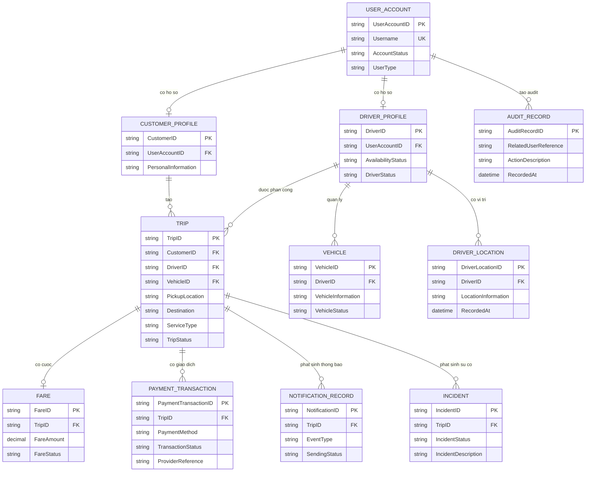

ERD không đưa `REPORT_DEFINITION` vào quan hệ chính vì cấu hình/KPI báo cáo và quan hệ dữ liệu báo cáo còn `[Cần làm rõ]`. Entity vẫn được giữ trong danh sách phân tích.

## VIII. Ma trận FR/BP/Rule -> Data

| FR/BP/Step/Rule                                  | Entity liên quan                                       | Attribute/Relationship liên quan                            | Dữ liệu đã đáp ứng? | Ghi chú                                                   |
| ------------------------------------------------ | ------------------------------------------------------ | ----------------------------------------------------------- | ------------------- | --------------------------------------------------------- |
| FR-01/BP-01/STEP-01                              | ENT-01, ENT-02, ENT-03                                 | AccountStatus, UserAccountID, hồ sơ                         | Có một phần         | Chi tiết thông tin cá nhân/tài khoản cần làm rõ           |
| FR-02/BP-01/STEP-02                              | ENT-05                                                 | PickupLocation, Destination, ServiceType                    | Có                  | Dữ liệu đặt xe được nêu trực tiếp                         |
| FR-04/BP-02/STEP-04                              | ENT-03, ENT-05, ENT-06                                 | AvailabilityStatus, vị trí, quan hệ phân công               | Có một phần         | Tiêu chí ưu tiên cần làm rõ                               |
| FR-05, FR-07/BP-02/STEP-05,06                    | ENT-03, ENT-05                                         | phản hồi, DriverID, TripStatus                              | Có một phần         | Thời gian không phản hồi cần làm rõ                       |
| FR-08, FR-09/BP-03/STEP-07,08                    | ENT-05                                                 | TripStatus, quan hệ Customer-Trip                           | Có một phần         | Trình tự/thời gian dự kiến cần làm rõ                     |
| FR-12/BP-02/STEP-04                              | ENT-06                                                 | LocationInformation, RecordedAt, REL-06                     | Có một phần         | Tần suất/độ chính xác cần làm rõ                          |
| FR-13, FR-14/BP-04/STEP-10,11                    | ENT-07                                                 | FareAmount, FareBasis, REL-07                               | Có một phần         | Công thức cước cần làm rõ                                 |
| FR-16 đến FR-18/BP-04/STEP-11,12                 | ENT-08                                                 | PaymentMethod, TransactionStatus, ProviderReference, REL-08 | Có một phần         | Không lưu dữ liệu nhạy cảm; retry cần làm rõ              |
| FR-19, FR-20/BP-05/STEP-13,14                    | ENT-09                                                 | EventType, RecipientReference, SendingStatus, REL-09        | Có một phần         | Kênh/provider cần làm rõ                                  |
| FR-21 đến FR-25/BP-06/STEP-15,17                 | ENT-01, ENT-02, ENT-03, ENT-04, ENT-05, ENT-10, ENT-12 | quyền, IncidentStatus, AuditRecord, REL-10/12               | Có một phần         | Ma trận quyền và audit cần làm rõ                         |
| FR-26, FR-27/BP-07/STEP-18,19                    | ENT-11, ENT-05, ENT-07, ENT-08                         | MetricDefinition, ReportScope, REL-11                       | Có một phần         | KPI/kỳ báo cáo cần làm rõ                                 |
| FR-28 đến FR-30/BP-08/STEP-20,21                 | ENT-11 [Cần làm rõ]                                    | phạm vi ảnh hưởng/thay đổi                                  | Chưa đủ             | Có khả năng vượt phạm vi; không tạo thêm dữ liệu kỹ thuật |
| BRULE-01, BRULE-02, BRULE-07, BRULE-09, BRULE-13 | ENT-01, ENT-05, ENT-07, ENT-08                         | trạng thái, cước, phương thức, dữ liệu nhạy cảm             | Có một phần         | Rule đã liên kết; chi tiết chưa chốt giữ `[Cần làm rõ]`   |
| EX-01, EX-03, EX-07, EX-11, EX-14, EX-19         | ENT-05, ENT-08, ENT-09, ENT-10, ENT-11                 | trạng thái/kết quả lỗi                                      | Có một phần         | Cách xử lý cuối cùng cần chính sách                       |

## IX. Kiểm tra tính đầy đủ và nhất quán

| Issue ID | Loại         | Nội dung                                                                           | Nguồn liên quan                             | Ảnh hưởng        | Xử lý/Đề xuất                                                                   |
| -------- | ------------ | ---------------------------------------------------------------------------------- | ------------------------------------------- | ---------------- | ------------------------------------------------------------------------------- |
| DATA-I01 | Entity       | Thông tin tài khoản và hồ sơ người dùng có thể được gộp/tách theo phạm vi chi tiết | FR-01; [P4], [P5], [P9]                     | Data/UC          | Giữ UserAccount và hồ sơ nghiệp vụ riêng ở mức phân tích; cần xác nhận chi tiết |
| DATA-I02 | Attribute    | Chi tiết thông tin cá nhân, phương tiện, trạng thái và cước chưa chốt              | FR-01, FR-13, FR-21; [P4], [P5], [P7], [P9] | Data/FR          | Đánh dấu `[Cần làm rõ]`, không tự thêm thuộc tính                               |
| DATA-I03 | Relationship | Số phương tiện của một tài xế chưa xác định                                        | REL-05; [P5]                                | Data/Rule        | Cardinality tạm ghi 1-N và cần xác nhận                                         |
| DATA-I04 | Relationship | Số lần thanh toán lại/giao dịch trên một chuyến chưa xác định                      | REL-08; EX-11, EX-12                        | Payment/Rule     | Giữ 1-N ở mức phân tích, cần xác nhận chính sách                                |
| DATA-I05 | Relationship | Cấu hình báo cáo và quan hệ dữ liệu báo cáo chưa đủ thông tin                      | ENT-11, REL-11; [P9], [P12]                 | Report/Data      | Không đưa quan hệ N-N vào ERD chính thức; cần xác nhận                          |
| DATA-I06 | Attribute    | ProviderReference cần có nhưng không được lưu dữ liệu thanh toán nhạy cảm          | ENT-08; BRULE-13, BRULE-14                  | Payment/Security | Giữ tham chiếu giao dịch ở mức phân tích, không thiết kế chi tiết               |
| DATA-I07 | Entity       | Không phát hiện Entity ngoài Scope                                                 | Tất cả nguồn trước                          | Scope            | Không phát hiện                                                                 |
| DATA-I08 | ERD          | ERD chính không chứa Entity báo cáo do quan hệ chưa đủ rõ                          | ENT-11                                      | Data/Report      | Ghi chú ngoài ERD, chờ xác nhận                                                 |

Không phát hiện Entity trùng lặp rõ ràng, Relationship không có cơ sở hoặc thuộc tính kỹ thuật không cần thiết. Các cardinality chưa chắc chắn được đánh dấu `[Cần làm rõ]`.

## X. Tổng hợp mô hình dữ liệu

| Thành phần             |                                         Số lượng |
| ---------------------- | -----------------------------------------------: |
| Tổng số Entity         |                                               12 |
| Entity đã xác nhận     |                                                8 |
| Entity suy ra          |                                                3 |
| Entity cần làm rõ      |                                                1 |
| Entity ngoài phạm vi   |                                                0 |
| Tổng số nhóm Attribute |                                               58 |
| Attribute bắt buộc     |                                               34 |
| Attribute tùy chọn     |                                                8 |
| Attribute cần làm rõ   |                                               16 |
| Tổng số Relationship   |                                               12 |
| Quan hệ 1-1/1-0..1     |                                                2 |
| Quan hệ 1-N            |                                                8 |
| Quan hệ N-N            |                                                1 |
| Entity trung gian      |                                                0 |
| FR/BP thiếu dữ liệu    | 0 hoàn toàn; 7 nhóm có dữ liệu cần xác nhận thêm |

## XI. Kết luận bước 12

### Entity chính

Các Entity cốt lõi là UserAccount, CustomerProfile, DriverProfile, Vehicle, Trip, DriverLocation, Fare, PaymentTransaction, NotificationRecord, Incident, ReportDefinition và AuditRecord.

### Relationship chính

Quan hệ trung tâm là CustomerProfile tạo Trip, DriverProfile được phân công Trip, DriverProfile có Vehicle và DriverLocation, Trip có Fare, PaymentTransaction, NotificationRecord và Incident. UserAccount liên kết với hồ sơ khách hàng/tài xế và tạo AuditRecord.

### Dữ liệu cần làm rõ

Cần xác nhận chi tiết thông tin tài khoản/hồ sơ/phương tiện, danh mục trạng thái, tiêu chí và tần suất vị trí, công thức cước, trạng thái/giao dịch thanh toán lại, kênh thông báo, trạng thái sự cố, KPI/kỳ báo cáo, cardinality phương tiện/thanh toán và chính sách lưu audit.

### Các vấn đề phát hiện

Không tạo Entity ngoài phạm vi hoặc thiết kế vật lý. Entity ReportDefinition và quan hệ N-N báo cáo chỉ được giữ ở mức phân tích có ghi chú cần làm rõ; không đưa phỏng đoán vào ERD chính thức.

## XII. Giới hạn của bước 12

- Chỉ mô hình hóa Entity, Attribute, Relationship, Cardinality và ERD phân tích.
- Không thiết kế Database vật lý, SQL, Index, Trigger, Stored Procedure hoặc tối ưu dữ liệu.
- Không chọn hệ quản trị Database, công nghệ lưu trữ, API hoặc Architecture.
- Không xác định Actor/Use Case, đặc tả Use Case, Acceptance Criteria hoặc Code.
- Không tạo Business Rule mới; chỉ phản ánh các Rule/Exception đã có.
- Không tự quyết định các thuộc tính/cardinality còn thiếu thông tin.

## XIII. Đầu ra chuyển tiếp

Kết quả bước 12 là đầu vào tham khảo cho xác định Actor/Use Case, đặc tả Use Case, Acceptance Criteria và RTM. Chuỗi truy xuất được giữ như sau:

`NEED -> STK -> SCOPE -> BR -> BP -> STEP -> FR -> FR con -> Rule / Exception -> NFR -> DATA -> ACTOR / UC -> AC -> RTM`

# Bước 13 - Xác định Actor và Use Case

## I. Phạm vi và nguyên tắc

Phần này thực hiện bước 13 theo `PROMPTS_BA/13_XacDinhActor_UseCase.md`, dựa trên Stakeholder, Scope, BR, BP, FR/FR con, Rule/Exception, NFR và Entity đã xác định ở các bước trước.

Mục tiêu của bước này là xác định các đối tượng thực sự tương tác trực tiếp với CAB System, các Use Case có mục tiêu nghiệp vụ rõ ràng và quan hệ truy xuất ban đầu. Phần này chưa vẽ Use Case Diagram, chưa đặc tả Main Flow/Alternative Flow/Exception Flow và chưa tạo Acceptance Criteria.

Chuỗi truy xuất được giữ như sau:

`NEED -> STK -> SCOPE -> BR -> BP -> STEP -> FR/FR con -> ACTOR/USE CASE`

## II. Phân biệt Stakeholder và Actor

Không phải mọi Stakeholder đều là Actor. Actor chỉ được xác định khi nguồn cho thấy đối tượng có thao tác hoặc trao đổi trực tiếp với CAB System để đạt một mục tiêu nghiệp vụ.

- Khách hàng, tài xế và nhân viên vận hành được xác định là Actor vì nguồn mô tả trực tiếp các hoạt động họ thực hiện.
- Payment Provider và Notification Provider được xác định là Actor hệ thống bên ngoài vì CAB cần trao đổi kết quả thanh toán hoặc kết quả gửi thông báo với các bên này.
- Đại diện doanh nghiệp/nhóm phát triển chỉ được giữ là Actor ứng viên cho nhóm Use Case mở rộng; cách tương tác trực tiếp chưa được nguồn xác nhận.
- Ban lãnh đạo là Stakeholder nhận lợi ích từ báo cáo nhưng chưa đủ bằng chứng trực tiếp sử dụng hệ thống, vì vậy chưa xác định là Actor chính thức.
- Business Analyst và nhóm phát triển là Stakeholder dự án; chưa có bằng chứng họ sử dụng CAB System như người dùng nghiệp vụ trong vận hành.

## III. Danh sách Actor

| Actor ID | Tên Actor                             | Loại                                    | Stakeholder liên quan  | Vai trò/mục tiêu                                         | Tương tác chính                                                                                                      | Nguồn                                                                         | Trạng thái                              |
| -------- | ------------------------------------- | --------------------------------------- | ---------------------- | -------------------------------------------------------- | -------------------------------------------------------------------------------------------------------------------- | ----------------------------------------------------------------------------- | --------------------------------------- |
| ACT-01   | Khách hàng                            | Người dùng trực tiếp                    | STK-02                 | Sử dụng dịch vụ đặt xe và theo dõi kết quả chuyến        | Quản lý tài khoản, tạo yêu cầu, theo dõi chuyến, thanh toán, xem lịch sử và nhận thông báo                           | STK-02; FR-01 đến FR-03, FR-09, FR-13 đến FR-20; [P4], [P7], [P8]             | Đã xác nhận                             |
| ACT-02   | Tài xế                                | Người dùng trực tiếp                    | STK-03                 | Nhận và thực hiện chuyến được phân công                  | Cập nhật hồ sơ/trạng thái/vị trí, nhận hoặc từ chối chuyến, cập nhật tiến trình và nhận thông báo                    | STK-03; FR-04 đến FR-08, FR-12, FR-19, FR-20; [P5], [P6], [P8]                | Đã xác nhận                             |
| ACT-03   | Nhân viên vận hành                    | Nhân viên vận hành                      | STK-04                 | Quản lý hoạt động, đối tượng, sự cố và giao dịch         | Quản lý dữ liệu vận hành, kiểm tra quyền, xử lý sự cố, tra cứu và cung cấp báo cáo                                   | STK-04; FR-11, FR-19 đến FR-27; [P9], [P11]                                   | Đã xác nhận                             |
| ACT-04   | Payment Provider                      | Hệ thống bên ngoài                      | STK-06                 | Xử lý thanh toán điện tử và trả kết quả giao dịch        | Nhận yêu cầu thanh toán và trả kết quả thành công, thất bại hoặc chưa xác định                                       | STK-06; FR-16 đến FR-18; [P7]                                                 | Đã xác nhận; provider cụ thể cần làm rõ |
| ACT-05   | Notification Provider/kênh thông báo  | Dịch vụ bên ngoài                       | STK-07                 | Gửi thông báo đến bên nhận được xác định                 | Nhận nội dung/kênh gửi và trả kết quả gửi hoặc lỗi gửi                                                               | STK-07; FR-19, FR-20; [P8], [P12]                                             | Đã xác nhận; provider/kênh cần làm rõ   |
| ACT-06   | Đại diện doanh nghiệp/nhóm phát triển | Người dùng hoặc nhóm dự án [Cần làm rõ] | STK-01, STK-05, STK-09 | Ghi nhận, đánh giá và theo dõi thay đổi/mở rộng nền tảng | Xác định nhu cầu thay đổi, phạm vi ảnh hưởng, ưu tiên và kết quả triển khai nếu được xác nhận là tương tác trực tiếp | STK-01, STK-05, STK-09; FR-28 đến FR-30; BP-08/STEP-20, STEP-21; [P10], [P12] | [Cần làm rõ]                            |

### Kiểm tra Actor

- ACT-01, ACT-02 và ACT-03 có mô tả thao tác trực tiếp, có mục tiêu nghiệp vụ và nằm trong phạm vi S-F01 đến S-F10.
- ACT-04 và ACT-05 có trao đổi trực tiếp với CAB ở ranh giới tích hợp bên ngoài, không phải người dùng nội bộ.
- ACT-06 chỉ là Actor ứng viên. Không gán chắc vai trò đại diện doanh nghiệp, ban lãnh đạo hoặc nhóm phát triển khi nguồn chưa xác nhận ai trực tiếp thao tác.
- STK-08 Business Analyst và STK-09 Nhóm phát triển không được tự động xem là Actor cho các Use Case vận hành; STK-09 chỉ liên quan ACT-06 ở BP-08 và cần xác nhận.

## IV. Danh sách Use Case

| UC ID | Tên Use Case                           | Mục tiêu nghiệp vụ                                                                                    | Actor liên quan                                  | FR/FR con liên quan                                                              | BP/Step liên quan            | Rule/Exception liên quan                   | Trạng thái                                                 |
| ----- | -------------------------------------- | ----------------------------------------------------------------------------------------------------- | ------------------------------------------------ | -------------------------------------------------------------------------------- | ---------------------------- | ------------------------------------------ | ---------------------------------------------------------- |
| UC-01 | Quản lý tài khoản                      | Cho phép khách hàng đăng ký, đăng nhập và cập nhật thông tin cá nhân để sử dụng dịch vụ               | ACT-01                                           | FR-01; FR-01.1, FR-01.2, FR-01.3                                                 | BP-01/STEP-01                | BRULE-01; EX-17                            | Đã xác nhận; tài khoản và thông tin chi tiết cần làm rõ    |
| UC-02 | Tạo yêu cầu đặt xe                     | Cho phép khách hàng cung cấp thông tin chuyến và gửi yêu cầu đặt xe                                   | ACT-01                                           | FR-02; FR-02.1, FR-02.2; FR-03                                                   | BP-01/STEP-02, STEP-03       | BRULE-02; EX-01, EX-02                     | Đã xác nhận                                                |
| UC-03 | Tìm và ưu tiên tài xế                  | Xác định tài xế phù hợp dựa trên vị trí, trạng thái sẵn sàng và tiêu chí vận hành                     | ACT-03, ACT-02                                   | FR-04; FR-04.1, FR-04.2, FR-04.3; FR-12                                          | BP-02/STEP-04                | BRULE-03, BRULE-04; EX-03, EX-06           | Đã xác nhận; tiêu chí và dữ liệu vị trí cần làm rõ         |
| UC-04 | Phản hồi yêu cầu chuyến                | Cho phép tài xế nhận thông tin chuyến và phản hồi chấp nhận, từ chối hoặc không phản hồi              | ACT-02                                           | FR-05; FR-05.1, FR-05.2                                                          | BP-02/STEP-05                | BRULE-05; EX-04, EX-05                     | Đã xác nhận; thời gian phản hồi cần làm rõ                 |
| UC-05 | Phân công và tìm tiếp tài xế           | Ghi nhận tài xế chấp nhận hoặc tiếp tục tìm tài xế khác khi bị từ chối/không phản hồi                 | ACT-03, ACT-02, ACT-01                           | FR-06, FR-07; FR-07.1, FR-07.2                                                   | BP-02/STEP-05, STEP-06       | BRULE-05, BRULE-06; EX-03, EX-04, EX-05    | Đã xác nhận; chính sách chuyển tiếp cần làm rõ             |
| UC-06 | Cập nhật tiến trình chuyến             | Cho phép tài xế cập nhật trạng thái chuyến theo tiến trình nghiệp vụ                                  | ACT-02                                           | FR-08; FR-08.1, FR-08.2                                                          | BP-03/STEP-07                | BRULE-07, BRULE-08; EX-07, EX-09           | Đã xác nhận; trình tự trạng thái và mất kết nối cần làm rõ |
| UC-07 | Theo dõi chuyến xe                     | Cho phép khách hàng xem trạng thái, tài xế, tiến trình và kết quả chuyến                              | ACT-01                                           | FR-09; FR-09.1, FR-09.2, FR-09.3; FR-10                                          | BP-03/STEP-08, STEP-09       | EX-09                                      | Đã xác nhận; thời gian dự kiến cần làm rõ                  |
| UC-08 | Ghi nhận chuyến có sự cố               | Ghi nhận và chuyển thông tin chuyến lỗi/sự cố cho bộ phận vận hành                                    | ACT-01, ACT-02, ACT-03                           | FR-11                                                                            | BP-03/STEP-09; BP-06/STEP-16 | EX-08, EX-18                               | Đã xác nhận                                                |
| UC-09 | Tính cước chuyến xe                    | Xác định số tiền khách hàng phải trả sau khi chuyến hoàn thành                                        | ACT-03                                           | FR-13; FR-13.1, FR-13.2, FR-13.3                                                 | BP-04/STEP-10                | BRULE-09, BRULE-10; EX-10                  | Đã xác nhận; công thức cước cần làm rõ                     |
| UC-10 | Thanh toán tiền mặt                    | Ghi nhận khách hàng đã chọn và thực hiện thanh toán tiền mặt theo chính sách doanh nghiệp             | ACT-01, ACT-03                                   | FR-14, FR-15                                                                     | BP-04/STEP-11, STEP-12       | BRULE-11; EX-13                            | Đã xác nhận; chính sách tiền mặt cần làm rõ                |
| UC-11 | Thanh toán điện tử                     | Gửi yêu cầu đến Payment Provider, nhận và ghi nhận kết quả giao dịch điện tử                          | ACT-01, ACT-04                                   | FR-14, FR-16, FR-17, FR-18; FR-16.1, FR-16.2, FR-16.3; FR-17.1, FR-17.2, FR-17.3 | BP-04/STEP-11, STEP-12       | BRULE-11 đến BRULE-14; EX-11, EX-12, EX-13 | Đã xác nhận; provider, retry và đối soát cần làm rõ        |
| UC-12 | Gửi thông báo sự kiện                  | Xác định người nhận/kênh, gửi thông báo và ghi nhận kết quả gửi                                       | ACT-03, ACT-05, ACT-01, ACT-02                   | FR-19, FR-20; FR-19.1, FR-19.2, FR-19.3; FR-20.1, FR-20.2                        | BP-05/STEP-13, STEP-14       | BRULE-15, BRULE-16; EX-14, EX-15           | Đã xác nhận; kênh và retry cần làm rõ                      |
| UC-13 | Quản lý dữ liệu vận hành               | Cho phép nhân viên vận hành xem và quản lý khách hàng, tài xế, phương tiện và chuyến theo quyền       | ACT-03                                           | FR-21; FR-21.1, FR-21.2                                                          | BP-06/STEP-15                | BRULE-17, BRULE-22; EX-16, EX-17           | Đã xác nhận; ma trận quyền cần làm rõ                      |
| UC-14 | Xử lý sự cố chuyến xe                  | Cho phép nhân viên vận hành ghi nhận, cập nhật và cung cấp kết quả xử lý sự cố                        | ACT-03, ACT-01, ACT-02                           | FR-23, FR-24; FR-23.1, FR-23.2                                                   | BP-06/STEP-16                | EX-18                                      | Đã xác nhận; trạng thái và cách thông báo cần làm rõ       |
| UC-15 | Lưu vết thao tác quan trọng            | Lưu dấu vết thao tác quản trị quan trọng để kiểm tra khi có sự cố                                     | ACT-03                                           | FR-25                                                                            | BP-06/STEP-17                | BRULE-18, BRULE-22                         | Đã xác nhận; danh sách và thời gian lưu cần làm rõ         |
| UC-16 | Cung cấp báo cáo hoạt động             | Tổng hợp và cung cấp dữ liệu về chuyến, doanh thu, tỷ lệ và hiệu quả tài xế                           | ACT-03; STK-05 là bên nhận/quan tâm [Cần làm rõ] | FR-26, FR-27; FR-27.1, FR-27.2, FR-27.3                                          | BP-07/STEP-18, STEP-19       | BRULE-19; EX-19, EX-20                     | Đã xác nhận; người sử dụng trực tiếp và KPI cần làm rõ     |
| UC-17 | Ghi nhận nhu cầu thay đổi nền tảng     | Ghi nhận nhu cầu mở rộng/thay đổi cùng phạm vi ảnh hưởng và ưu tiên                                   | ACT-06                                           | FR-28; FR-28.1, FR-28.2                                                          | BP-08/STEP-20                | BRULE-20, BRULE-21; EX-21                  | [Cần làm rõ]; có khả năng vượt phạm vi đồ án               |
| UC-18 | Theo dõi triển khai thay đổi từng phần | Ghi nhận việc triển khai và kiểm tra kết quả thay đổi theo phạm vi được xác nhận                      | ACT-06                                           | FR-29; FR-29.1, FR-29.2                                                          | BP-08/STEP-21                | BRULE-20; EX-22                            | [Cần làm rõ]; có khả năng vượt phạm vi đồ án               |
| UC-19 | Đánh giá ảnh hưởng sau thay đổi        | Ghi nhận thay đổi ảnh hưởng chức năng đang hoạt động hoặc làm hệ thống không ổn định để xem xét xử lý | ACT-06                                           | FR-30; FR-30.1, FR-30.2                                                          | BP-08/STEP-21                | BRULE-20, BRULE-21; EX-22, EX-23           | [Cần làm rõ]; có khả năng vượt phạm vi đồ án               |

FR-10 được gắn với UC-07 vì đây là điểm kết thúc theo dõi chuyến và chuyển sang tính cước; UC-09 thực hiện mục tiêu tính cước riêng. FR-14 được tham chiếu ở cả UC-10 và UC-11 vì đây là hai phương thức thanh toán có mục tiêu và Actor hỗ trợ khác nhau.

## V. Quan hệ Actor - Use Case

| Association ID | Actor ID | Use Case ID | Mục tiêu/tương tác                             | Hướng tham gia        | Nguồn                                | Trạng thái                             |
| -------------- | -------- | ----------- | ---------------------------------------------- | --------------------- | ------------------------------------ | -------------------------------------- |
| ASSOC-01       | ACT-01   | UC-01       | Quản lý tài khoản cá nhân                      | Khởi tạo              | FR-01; BP-01/STEP-01                 | Đã xác nhận                            |
| ASSOC-02       | ACT-01   | UC-02       | Tạo yêu cầu đặt xe                             | Khởi tạo              | FR-02; BP-01/STEP-02                 | Đã xác nhận                            |
| ASSOC-03       | ACT-03   | UC-03       | Theo dõi/hỗ trợ tìm tài xế                     | Tham gia              | FR-04, FR-12; BP-02/STEP-04          | Đã xác nhận                            |
| ASSOC-04       | ACT-02   | UC-03       | Cung cấp trạng thái sẵn sàng/vị trí            | Tham gia              | FR-04, FR-12; BP-02/STEP-04          | Đã xác nhận                            |
| ASSOC-05       | ACT-02   | UC-04       | Phản hồi yêu cầu chuyến                        | Khởi tạo              | FR-05; BP-02/STEP-05                 | Đã xác nhận                            |
| ASSOC-06       | ACT-03   | UC-05       | Ghi nhận kết quả phân công và tìm tiếp         | Tham gia              | FR-06, FR-07; BP-02/STEP-06          | Đã xác nhận                            |
| ASSOC-07       | ACT-02   | UC-05       | Cung cấp kết quả chấp nhận/từ chối             | Tham gia              | FR-05, FR-07; BP-02/STEP-05          | Đã xác nhận                            |
| ASSOC-08       | ACT-01   | UC-05       | Nhận kết quả không tìm được tài xế             | Tham gia              | FR-07.2; BP-02/STEP-06               | Đã xác nhận                            |
| ASSOC-09       | ACT-02   | UC-06       | Cập nhật trạng thái chuyến                     | Khởi tạo              | FR-08; BP-03/STEP-07                 | Đã xác nhận                            |
| ASSOC-10       | ACT-01   | UC-07       | Theo dõi trạng thái và tiến trình              | Khởi tạo              | FR-09; BP-03/STEP-08                 | Đã xác nhận                            |
| ASSOC-11       | ACT-01   | UC-08       | Cung cấp/nhận thông tin chuyến sự cố           | Tham gia              | FR-11; BP-03/STEP-09                 | Đã xác nhận                            |
| ASSOC-12       | ACT-02   | UC-08       | Thông báo chuyến phát sinh sự cố               | Tham gia              | FR-11; BP-03/STEP-09                 | Đã xác nhận                            |
| ASSOC-13       | ACT-03   | UC-08       | Tiếp nhận thông tin chuyến sự cố               | Tham gia              | FR-11; BP-06/STEP-16                 | Đã xác nhận                            |
| ASSOC-14       | ACT-03   | UC-09       | Xác định và quản lý số tiền phải trả           | Tham gia              | FR-13; BP-04/STEP-10                 | Đã xác nhận                            |
| ASSOC-15       | ACT-01   | UC-10       | Chọn và thực hiện thanh toán tiền mặt          | Khởi tạo              | FR-14, FR-15; BP-04/STEP-11          | Đã xác nhận                            |
| ASSOC-16       | ACT-03   | UC-10       | Ghi nhận kết quả tiền mặt                      | Tham gia              | FR-15; BP-04/STEP-12                 | Đã xác nhận; chính sách cần làm rõ     |
| ASSOC-17       | ACT-01   | UC-11       | Chọn phương thức và nhận kết quả điện tử       | Khởi tạo              | FR-14, FR-17; BP-04/STEP-11, STEP-12 | Đã xác nhận                            |
| ASSOC-18       | ACT-04   | UC-11       | Xử lý và trả kết quả giao dịch                 | Tham gia              | FR-16, FR-17; BP-04/STEP-11, STEP-12 | Đã xác nhận                            |
| ASSOC-19       | ACT-03   | UC-12       | Xác định sự kiện và người nhận/kênh            | Khởi tạo              | FR-19; BP-05/STEP-13                 | Đã xác nhận; chính sách cần làm rõ     |
| ASSOC-20       | ACT-05   | UC-12       | Gửi thông báo và trả kết quả gửi               | Tham gia              | FR-20; BP-05/STEP-14                 | Đã xác nhận; provider cần làm rõ       |
| ASSOC-21       | ACT-01   | UC-12       | Nhận thông báo sự kiện                         | Tham gia              | FR-19, FR-20; [P8]                   | Đã xác nhận                            |
| ASSOC-22       | ACT-02   | UC-12       | Nhận thông báo chuyến                          | Tham gia              | FR-19, FR-20; [P8]                   | Đã xác nhận                            |
| ASSOC-23       | ACT-03   | UC-13       | Xem và quản lý dữ liệu vận hành                | Khởi tạo              | FR-21; BP-06/STEP-15                 | Đã xác nhận                            |
| ASSOC-24       | ACT-03   | UC-14       | Ghi nhận và cập nhật xử lý sự cố               | Khởi tạo              | FR-23, FR-24; BP-06/STEP-16          | Đã xác nhận                            |
| ASSOC-25       | ACT-01   | UC-14       | Nhận kết quả xử lý sự cố khi liên quan         | Tham gia              | FR-24; BP-06/STEP-16                 | Đã xác nhận; cách thông báo cần làm rõ |
| ASSOC-26       | ACT-02   | UC-14       | Nhận kết quả xử lý sự cố khi liên quan         | Tham gia              | FR-24; BP-06/STEP-16                 | Đã xác nhận; cách thông báo cần làm rõ |
| ASSOC-27       | ACT-03   | UC-15       | Tạo dấu vết thao tác quan trọng                | Tham gia              | FR-25; BP-06/STEP-17                 | Đã xác nhận                            |
| ASSOC-28       | ACT-03   | UC-16       | Tập hợp và cung cấp báo cáo                    | Khởi tạo              | FR-26, FR-27; BP-07/STEP-18, STEP-19 | Đã xác nhận; KPI cần làm rõ            |
| ASSOC-29       | ACT-06   | UC-17       | Ghi nhận nhu cầu và phạm vi thay đổi           | Khởi tạo [Cần làm rõ] | FR-28; BP-08/STEP-20                 | [Cần làm rõ]                           |
| ASSOC-30       | ACT-06   | UC-18       | Ghi nhận triển khai và kiểm tra thay đổi       | Khởi tạo [Cần làm rõ] | FR-29; BP-08/STEP-21                 | [Cần làm rõ]                           |
| ASSOC-31       | ACT-06   | UC-19       | Ghi nhận ảnh hưởng và trạng thái không ổn định | Khởi tạo [Cần làm rõ] | FR-30; BP-08/STEP-21                 | [Cần làm rõ]                           |

## VI. Quan hệ giữa các Use Case

Chỉ xác định quan hệ khi có cơ sở nghiệp vụ rõ ràng. Không tạo Generalization vì nguồn chưa mô tả Actor hoặc Use Case kế thừa thực sự.

| Relationship ID | Thành phần nguồn                         | Quan hệ       | Thành phần đích                  | Điều kiện/cơ sở                                                                                    | Trạng thái                       |
| --------------- | ---------------------------------------- | ------------- | -------------------------------- | -------------------------------------------------------------------------------------------------- | -------------------------------- |
| REL-UC-01       | UC-02 Tạo yêu cầu đặt xe                 | `<<include>>` | UC-01 Quản lý tài khoản          | Yêu cầu đặt xe là chức năng yêu cầu tài khoản; BRULE-01 và FR-01/FR-02 liên quan                   | Đã xác nhận nguyên tắc           |
| REL-UC-02       | UC-05 Phân công và tìm tiếp tài xế       | `<<include>>` | UC-03 Tìm và ưu tiên tài xế      | Phân công cần kết quả tìm tài xế phù hợp trước khi ghi nhận chấp nhận hoặc tìm tiếp                | [Suy ra]; ranh giới cần xác nhận |
| REL-UC-03       | UC-11 Thanh toán điện tử                 | `<<include>>` | UC-09 Tính cước chuyến xe        | Thanh toán chỉ thực hiện sau khi có số tiền phải trả theo BP-04                                    | [Suy ra] từ BRULE-09, BRULE-10   |
| REL-UC-04       | UC-08 Ghi nhận chuyến có sự cố           | `<<extend>>`  | UC-07 Theo dõi chuyến xe         | Sự cố chỉ phát sinh trong một điều kiện của quá trình theo dõi, không phải mọi chuyến đều có sự cố | [Suy ra]                         |
| REL-UC-05       | UC-17 Ghi nhận nhu cầu thay đổi nền tảng | `<<extend>>`  | UC-16 Cung cấp báo cáo hoạt động | Chưa đủ cơ sở xác định thay đổi có bắt đầu từ báo cáo; quan hệ chỉ là ứng viên cần xác nhận        | [Cần làm rõ]                     |

REL-UC-05 không được đưa vào quan hệ chính thức cho sơ đồ nếu doanh nghiệp không xác nhận báo cáo là nguồn khởi tạo yêu cầu thay đổi. Không xác định Generalization.

## VII. Ma trận Stakeholder -> Actor

| Stakeholder ID | Actor ID | Có tương tác trực tiếp? | Cơ sở                                                                                     | Kết luận                      |
| -------------- | -------- | ----------------------- | ----------------------------------------------------------------------------------------- | ----------------------------- |
| STK-01         | ACT-06   | Cần làm rõ              | Doanh nghiệp đưa ra nhu cầu mở rộng nhưng chưa xác định người đại diện trực tiếp thao tác | Actor ứng viên                |
| STK-02         | ACT-01   | Có                      | Đăng ký, đặt xe, theo dõi, thanh toán, xem lịch sử và nhận thông báo                      | Actor                         |
| STK-03         | ACT-02   | Có                      | Nhận/từ chối chuyến, cập nhật trạng thái, hồ sơ và vị trí                                 | Actor                         |
| STK-04         | ACT-03   | Có                      | Quản lý đối tượng/chuyến, xử lý sự cố, giao dịch và báo cáo                               | Actor                         |
| STK-05         | -        | Cần làm rõ              | Quan tâm và nhận báo cáo nhưng chưa rõ có trực tiếp sử dụng CAB                           | Chỉ là Stakeholder ở bước này |
| STK-06         | ACT-04   | Có                      | Trao đổi yêu cầu và kết quả thanh toán điện tử                                            | Actor hệ thống bên ngoài      |
| STK-07         | ACT-05   | Có                      | Trao đổi yêu cầu gửi và kết quả gửi thông báo                                             | Actor dịch vụ bên ngoài       |
| STK-08         | -        | Không có cơ sở          | Chỉ tham gia làm rõ yêu cầu và tạo đầu ra phân tích                                       | Chỉ là Stakeholder dự án      |
| STK-09         | ACT-06   | Cần làm rõ              | BP-08 mô tả nhóm phát triển đánh giá/triển khai nhưng chưa xác định tương tác với CAB     | Actor ứng viên                |
| STK-10         | -        | Cần làm rõ              | Chưa định danh bên xác nhận chính sách/tiêu chí                                           | Chưa xác định Actor           |

## VIII. Ma trận FR/BP -> Use Case

| FR/BP/Step                                        | Use Case liên quan | Actor liên quan                | Đã bao phủ? | Ghi chú                                         |
| ------------------------------------------------- | ------------------ | ------------------------------ | ----------- | ----------------------------------------------- |
| FR-01/BP-01/STEP-01                               | UC-01              | ACT-01                         | Có          | Quản lý tài khoản                               |
| FR-02, FR-03/BP-01/STEP-02, STEP-03               | UC-02              | ACT-01                         | Có          | Tạo và tiếp nhận yêu cầu                        |
| FR-04, FR-12/BP-02/STEP-04                        | UC-03              | ACT-02, ACT-03                 | Có          | Tìm/ưu tiên và dữ liệu vị trí                   |
| FR-05/BP-02/STEP-05                               | UC-04              | ACT-02                         | Có          | Phản hồi tài xế                                 |
| FR-06, FR-07/BP-02/STEP-05, STEP-06               | UC-05              | ACT-01, ACT-02, ACT-03         | Có          | Phân công, tìm tiếp và thông báo không tìm được |
| FR-08/BP-03/STEP-07                               | UC-06              | ACT-02                         | Có          | Cập nhật trạng thái                             |
| FR-09, FR-10/BP-03/STEP-08, STEP-09               | UC-07              | ACT-01                         | Có          | Theo dõi và chuyển sang tính cước               |
| FR-11/BP-03/STEP-09; BP-06/STEP-16                | UC-08              | ACT-01, ACT-02, ACT-03         | Có          | Ghi nhận chuyến sự cố                           |
| FR-13/BP-04/STEP-10                               | UC-09              | ACT-03                         | Có          | Tính cước                                       |
| FR-14, FR-15/BP-04/STEP-11, STEP-12               | UC-10              | ACT-01, ACT-03                 | Có          | Tiền mặt                                        |
| FR-14, FR-16, FR-17, FR-18/BP-04/STEP-11, STEP-12 | UC-11              | ACT-01, ACT-04                 | Có          | Điện tử và bảo vệ dữ liệu                       |
| FR-19, FR-20/BP-05/STEP-13, STEP-14               | UC-12              | ACT-01, ACT-02, ACT-03, ACT-05 | Có          | Thông báo                                       |
| FR-21, FR-22/BP-06/STEP-15                        | UC-13              | ACT-03                         | Có          | Vận hành và quyền                               |
| FR-23, FR-24/BP-06/STEP-16                        | UC-14              | ACT-01, ACT-02, ACT-03         | Có          | Xử lý sự cố                                     |
| FR-25/BP-06/STEP-17                               | UC-15              | ACT-03                         | Có          | Audit                                           |
| FR-26, FR-27/BP-07/STEP-18, STEP-19               | UC-16              | ACT-03; STK-05 nhận kết quả    | Có          | Người dùng báo cáo cần xác nhận                 |
| FR-28/BP-08/STEP-20                               | UC-17              | ACT-06                         | Một phần    | Actor trực tiếp và phạm vi cần xác nhận         |
| FR-29/BP-08/STEP-21                               | UC-18              | ACT-06                         | Một phần    | Có khả năng vượt phạm vi đồ án                  |
| FR-30/BP-08/STEP-21                               | UC-19              | ACT-06                         | Một phần    | Có khả năng vượt phạm vi đồ án                  |

Mỗi FR từ FR-01 đến FR-30 đều được ánh xạ vào ít nhất một Use Case. Các FR-28 đến FR-30 chỉ được xem là bao phủ ở mức phân tích, chờ xác nhận Actor trực tiếp và phạm vi triển khai.

## IX. Use Case cần làm rõ

| Issue ID | Thành phần              | Nội dung chưa rõ                                                                       | Ảnh hưởng                | Cần xác nhận |
| -------- | ----------------------- | -------------------------------------------------------------------------------------- | ------------------------ | ------------ |
| UC-I01   | ACT-06/UC-17 đến UC-19  | Ai là người trực tiếp nhập, phê duyệt và theo dõi thay đổi nền tảng?                   | Actor/UC/Scope           | Có           |
| UC-I02   | ACT-03/UC-03            | Nhân viên vận hành có trực tiếp điều phối/tìm tài xế hay hệ thống tự thực hiện?        | Actor/UC/BP              | Có           |
| UC-I03   | ACT-03/UC-09            | Ai khởi tạo hoặc kiểm tra việc tính cước: hệ thống tự động, vận hành hay doanh nghiệp? | Actor/UC/FR              | Có           |
| UC-I04   | STK-05/UC-16            | Ban lãnh đạo có trực tiếp đăng nhập xem báo cáo hay chỉ nhận báo cáo từ vận hành?      | Actor/UC/FR              | Có           |
| UC-I05   | UC-03                   | Tiêu chí ưu tiên tài xế, cách dùng vị trí và ngưỡng thời gian dự kiến chưa chốt        | UC/Rule/NFR              | Có           |
| UC-I06   | UC-04, UC-05            | Thời gian không phản hồi và chính sách tìm tiếp tài xế chưa chốt                       | UC/Exception             | Có           |
| UC-I07   | UC-06, UC-07            | Trình tự trạng thái chuyến và chính sách mất kết nối chưa chốt                         | UC/Rule/Exception        | Có           |
| UC-I08   | UC-09                   | Công thức cước và dữ liệu đầu vào chưa chốt                                            | UC/Rule/Data             | Có           |
| UC-I09   | UC-10, UC-11            | Chính sách tiền mặt, retry/đối soát và provider thanh toán chưa chốt                   | UC/Exception/Integration | Có           |
| UC-I10   | UC-12                   | Kênh, người nhận, provider và retry thông báo chưa chốt                                | UC/Exception/NFR         | Có           |
| UC-I11   | UC-13, UC-15            | Ma trận quyền, thao tác nhạy cảm và thời gian lưu audit chưa chốt                      | Actor/UC/Security        | Có           |
| UC-I12   | REL-UC-01 đến REL-UC-05 | Ranh giới include/extend cần được xác nhận khi vẽ sơ đồ và đặc tả Use Case             | UC Diagram/UC Spec       | Có           |

## X. Kiểm tra tính đầy đủ và nhất quán

| Tiêu chí                        | Kết quả                                                                                    |
| ------------------------------- | ------------------------------------------------------------------------------------------ |
| Stakeholder bị nhầm thành Actor | Không; STK-05, STK-08 và STK-10 chưa được đưa thành Actor chính thức                       |
| Actor không có Use Case         | Không; ACT-01 đến ACT-06 đều có Use Case, ACT-06 ở trạng thái cần làm rõ                   |
| Use Case không có Actor         | Không; UC-17 đến UC-19 có ACT-06 là Actor ứng viên cần xác nhận                            |
| FR quan trọng chưa có Use Case  | Không; FR-01 đến FR-30 đều được bao phủ ít nhất một lần                                    |
| Use Case ngoài Scope            | Không; UC-17 đến UC-19 thuộc S-F11 nhưng có khả năng vượt phạm vi đồ án                    |
| Use Case không có nguồn         | Không; mỗi UC truy xuất về FR/BP/Step và Stakeholder                                       |
| Use Case trùng mục tiêu         | Không phát hiện; thanh toán tiền mặt và điện tử được tách theo phương thức và Actor hỗ trợ |
| Generalization có cơ sở         | Không xác định                                                                             |
| Include/Extend cần xác nhận     | Có; các quan hệ suy ra được đánh dấu riêng, không coi là chính sách đã chốt                |

## XI. Tổng hợp Actor và Use Case

| Thành phần                              |                                             Số lượng |
| --------------------------------------- | ---------------------------------------------------: |
| Tổng số Actor                           |                                                    6 |
| Actor người dùng trực tiếp              |                                                    3 |
| Actor hệ thống/dịch vụ bên ngoài        |                                                    2 |
| Actor ứng viên cần làm rõ               |                                                    1 |
| Actor suy ra                            |                                                    0 |
| Tổng số Use Case                        |                                                   19 |
| Use Case đã xác nhận ở mục tiêu         |                                                   16 |
| Use Case suy ra                         |                0 độc lập; một số quan hệ được suy ra |
| Use Case cần làm rõ                     |                                                    3 |
| Use Case ngoài phạm vi                  |                                                    0 |
| Use Case có khả năng vượt phạm vi đồ án |                                  3 (UC-17 đến UC-19) |
| Tổng số Association                     |                                                   31 |
| Quan hệ Include                         |                                                    3 |
| Quan hệ Extend                          | 2 ứng viên; 1 cần xác nhận trước khi dùng chính thức |
| Quan hệ Generalization                  |                                                    0 |
| FR chưa có Use Case                     |                                                    0 |
| Use Case chưa có Actor                  |                                                    0 |

## XII. Kết luận bước 13

### Actor chính

Ba Actor người dùng trực tiếp là khách hàng, tài xế và nhân viên vận hành. Payment Provider và Notification Provider là Actor bên ngoài do có trao đổi trực tiếp với CAB. Đại diện doanh nghiệp/nhóm phát triển là Actor ứng viên cho nhóm mở rộng và cần xác nhận người thao tác cụ thể.

### Use Case chính

CAB System có 19 Use Case ở mức phân tích, bao phủ quản lý tài khoản, đặt xe, tìm và phân công tài xế, thực hiện/theo dõi chuyến, xử lý sự cố, tính cước, thanh toán tiền mặt/điện tử, thông báo, vận hành, audit, báo cáo và quản lý thay đổi nền tảng.

### Quan hệ cần vẽ

Ba quan hệ `<<include>>` có cơ sở ban đầu là: tạo yêu cầu đặt xe bao gồm quản lý tài khoản; phân công bao gồm tìm và ưu tiên tài xế; thanh toán điện tử bao gồm tính cước. Quan hệ `<<extend>>` giữa theo dõi chuyến và ghi nhận sự cố chỉ là quan hệ suy ra ở mức phân tích. Không xác định Generalization.

### Nội dung cần làm rõ

Cần xác nhận Actor trực tiếp của BP-08, cách ban lãnh đạo nhận báo cáo, vai trò vận hành trong tìm tài xế và tính cước, tiêu chí ghép tài xế, trạng thái chuyến, chính sách thanh toán/thông báo, quyền vận hành, audit và ranh giới include/extend trước khi vẽ sơ đồ và đặc tả Use Case.

## XIII. Giới hạn của bước 13

- Chỉ chuyển Stakeholder/FR/BP thành Actor, Use Case và quan hệ phân tích.
- Không vẽ Use Case Diagram.
- Không đặc tả Main Flow, Alternative Flow hoặc Exception Flow chi tiết.
- Không tạo FR, BR, BP, Rule, Exception, NFR hoặc Entity mới.
- Không thiết kế UI, Database vật lý, Architecture, API hoặc Code.
- Không tự quyết định các Actor, chính sách hoặc quan hệ còn thiếu thông tin.

## XIV. Đầu ra chuyển tiếp

Kết quả bước 13 là đầu vào cho `14_XacDinhVaVeUseCase.md`, `15_DacTaUseCase.md`, `16_XacDinhAcceptanceCriteria_AC.md` và `17_TruyXuatNguonGocYeuCau_RTM.md`.

Các mã `ACT-01` đến `ACT-06`, `UC-01` đến `UC-19`, `ASSOC-01` đến `ASSOC-31` và `REL-UC-01` đến `REL-UC-05` phải được giữ nguyên ở các bước sau. Chuỗi truy xuất tiếp tục là:

`NEED -> STK -> SCOPE -> BR -> BP -> STEP -> FR -> FR con -> Rule / Exception -> NFR -> DATA -> ACTOR / UC -> AC -> RTM`

# Phụ lục - Nội dung Use Case Diagram làm đầu vào Bước 14

## I. Phạm vi và nguyên tắc

Phần này thực hiện bước 14 theo `PROMPTS_BA/14_XacDinhVaVeUseCase.md`, sử dụng các Actor, Use Case, Association và quan hệ đã xác định tại bước 13.

Sơ đồ chỉ thể hiện ranh giới CAB System, Actor, Use Case và các quan hệ phân tích. Không đưa Entity, Database, API, module kỹ thuật hoặc chi tiết luồng xử lý vào sơ đồ.

Chuỗi truy xuất được giữ như sau:

`NEED -> STK -> SCOPE -> BR -> BP -> STEP -> FR -> FR con -> ACTOR/UC -> Use Case Diagram`

## II. Thông tin hệ thống

| Thành phần     | Giá trị                                                                                                         |
| -------------- | --------------------------------------------------------------------------------------------------------------- |
| Tên hệ thống   | CAB System - nền tảng đặt xe                                                                                    |
| Phạm vi        | Đặt xe, phân công tài xế, thực hiện chuyến, cước/thanh toán, thông báo, vận hành, báo cáo và định hướng mở rộng |
| Số Actor       | 6, trong đó ACT-06 cần xác nhận                                                                                 |
| Số Use Case    | 19                                                                                                              |
| Số Association | 31                                                                                                              |
| Trạng thái     | Sơ đồ phân tích; các điểm chưa rõ được giữ nguyên                                                               |

## III. Danh sách Actor trước khi vẽ

| Actor ID | Actor                                 | Loại                                    | Vai trò                                             | Use Case liên quan                                                   | Trạng thái                              |
| -------- | ------------------------------------- | --------------------------------------- | --------------------------------------------------- | -------------------------------------------------------------------- | --------------------------------------- |
| ACT-01   | Khách hàng                            | Người dùng trực tiếp                    | Đặt xe, theo dõi, thanh toán và nhận kết quả chuyến | UC-01, UC-02, UC-05, UC-07, UC-08, UC-10, UC-11, UC-12, UC-14        | Đã xác nhận                             |
| ACT-02   | Tài xế                                | Người dùng trực tiếp                    | Nhận, từ chối và thực hiện chuyến                   | UC-03, UC-04, UC-05, UC-06, UC-08, UC-12, UC-14                      | Đã xác nhận                             |
| ACT-03   | Nhân viên vận hành                    | Nhân viên vận hành                      | Quản lý dữ liệu, sự cố, thông báo, audit và báo cáo | UC-03, UC-05, UC-08, UC-09, UC-10, UC-12, UC-13, UC-14, UC-15, UC-16 | Đã xác nhận                             |
| ACT-04   | Payment Provider                      | Hệ thống bên ngoài                      | Xử lý và trả kết quả thanh toán điện tử             | UC-11                                                                | Đã xác nhận; provider cụ thể cần làm rõ |
| ACT-05   | Notification Provider/kênh thông báo  | Dịch vụ bên ngoài                       | Gửi thông báo và trả kết quả gửi                    | UC-12                                                                | Đã xác nhận; provider/kênh cần làm rõ   |
| ACT-06   | Đại diện doanh nghiệp/nhóm phát triển | Người dùng hoặc nhóm dự án [Cần làm rõ] | Ghi nhận và theo dõi thay đổi/mở rộng nền tảng      | UC-17, UC-18, UC-19                                                  | [Cần làm rõ]                            |

ACT-06 được giữ trong sơ đồ phân tích để không làm mất UC-17 đến UC-19 đã được xác định ở bước 13. Actor trực tiếp và người đại diện cụ thể phải được xác nhận trước khi dùng sơ đồ làm cơ sở triển khai.

## IV. Danh sách Use Case trước khi vẽ

| UC ID | Use Case                               | Mục tiêu                                                  | Actor liên quan                | FR/FR con liên quan                                                  | Trạng thái                                       |
| ----- | -------------------------------------- | --------------------------------------------------------- | ------------------------------ | -------------------------------------------------------------------- | ------------------------------------------------ |
| UC-01 | Quản lý tài khoản                      | Quản lý tài khoản cá nhân để sử dụng dịch vụ              | ACT-01                         | FR-01; FR-01.1, FR-01.2, FR-01.3                                     | Đã xác nhận                                      |
| UC-02 | Tạo yêu cầu đặt xe                     | Gửi yêu cầu với điểm đón, điểm đến và loại xe             | ACT-01                         | FR-02; FR-02.1, FR-02.2; FR-03                                       | Đã xác nhận                                      |
| UC-03 | Tìm và ưu tiên tài xế                  | Xác định tài xế phù hợp theo dữ liệu và tiêu chí vận hành | ACT-02, ACT-03                 | FR-04; FR-04.1, FR-04.2, FR-04.3; FR-12                              | Đã xác nhận; tiêu chí cần làm rõ                 |
| UC-04 | Phản hồi yêu cầu chuyến                | Tài xế chấp nhận, từ chối hoặc không phản hồi             | ACT-02                         | FR-05; FR-05.1, FR-05.2                                              | Đã xác nhận; thời gian cần làm rõ                |
| UC-05 | Phân công và tìm tiếp tài xế           | Phân công hoặc tiếp tục tìm tài xế khác                   | ACT-01, ACT-02, ACT-03         | FR-06, FR-07; FR-07.1, FR-07.2                                       | Đã xác nhận; chính sách cần làm rõ               |
| UC-06 | Cập nhật tiến trình chuyến             | Cập nhật trạng thái chuyến theo tiến trình nghiệp vụ      | ACT-02                         | FR-08; FR-08.1, FR-08.2                                              | Đã xác nhận; trình tự cần làm rõ                 |
| UC-07 | Theo dõi chuyến xe                     | Theo dõi trạng thái, tài xế, tiến trình và kết quả        | ACT-01                         | FR-09; FR-09.1, FR-09.2, FR-09.3; FR-10                              | Đã xác nhận; thời gian dự kiến cần làm rõ        |
| UC-08 | Ghi nhận chuyến có sự cố               | Ghi nhận và chuyển chuyến lỗi/sự cố cho vận hành          | ACT-01, ACT-02, ACT-03         | FR-11                                                                | Đã xác nhận                                      |
| UC-09 | Tính cước chuyến xe                    | Xác định số tiền phải trả sau chuyến                      | ACT-03                         | FR-13; FR-13.1, FR-13.2, FR-13.3                                     | Đã xác nhận; công thức cần làm rõ                |
| UC-10 | Thanh toán tiền mặt                    | Ghi nhận kết quả thanh toán tiền mặt                      | ACT-01, ACT-03                 | FR-14, FR-15                                                         | Đã xác nhận; chính sách cần làm rõ               |
| UC-11 | Thanh toán điện tử                     | Trao đổi và ghi nhận kết quả thanh toán điện tử           | ACT-01, ACT-04                 | FR-14, FR-16, FR-17, FR-18; FR-16.1 đến FR-16.3; FR-17.1 đến FR-17.3 | Đã xác nhận; provider/retry cần làm rõ           |
| UC-12 | Gửi thông báo sự kiện                  | Xác định, gửi và ghi nhận kết quả thông báo               | ACT-01, ACT-02, ACT-03, ACT-05 | FR-19, FR-20; FR-19.1 đến FR-19.3; FR-20.1, FR-20.2                  | Đã xác nhận; kênh/retry cần làm rõ               |
| UC-13 | Quản lý dữ liệu vận hành               | Xem và quản lý đối tượng/chuyến theo quyền                | ACT-03                         | FR-21; FR-21.1, FR-21.2; FR-22                                       | Đã xác nhận; quyền cần làm rõ                    |
| UC-14 | Xử lý sự cố chuyến xe                  | Ghi nhận, cập nhật và cung cấp kết quả xử lý sự cố        | ACT-01, ACT-02, ACT-03         | FR-23, FR-24; FR-23.1, FR-23.2                                       | Đã xác nhận; cách thông báo cần làm rõ           |
| UC-15 | Lưu vết thao tác quan trọng            | Lưu dấu vết thao tác để kiểm tra khi có sự cố             | ACT-03                         | FR-25                                                                | Đã xác nhận; danh sách/thời gian lưu cần làm rõ  |
| UC-16 | Cung cấp báo cáo hoạt động             | Tổng hợp và cung cấp dữ liệu hoạt động                    | ACT-03; STK-05 nhận/quan tâm   | FR-26, FR-27; FR-27.1 đến FR-27.3                                    | Đã xác nhận; người dùng trực tiếp/KPI cần làm rõ |
| UC-17 | Ghi nhận nhu cầu thay đổi nền tảng     | Ghi nhận nhu cầu, phạm vi ảnh hưởng và ưu tiên            | ACT-06                         | FR-28; FR-28.1, FR-28.2                                              | [Cần làm rõ]; có khả năng vượt phạm vi đồ án     |
| UC-18 | Theo dõi triển khai thay đổi từng phần | Ghi nhận triển khai và kiểm tra thay đổi                  | ACT-06                         | FR-29; FR-29.1, FR-29.2                                              | [Cần làm rõ]; có khả năng vượt phạm vi đồ án     |
| UC-19 | Đánh giá ảnh hưởng sau thay đổi        | Ghi nhận ảnh hưởng hoặc trạng thái không ổn định          | ACT-06                         | FR-30; FR-30.1, FR-30.2                                              | [Cần làm rõ]; có khả năng vượt phạm vi đồ án     |

## V. Use Case Diagram tổng thể

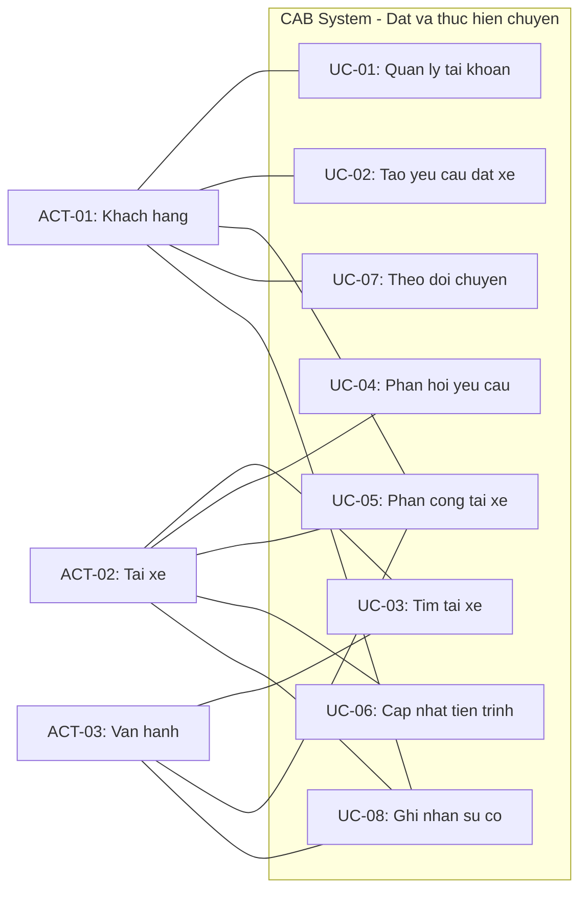

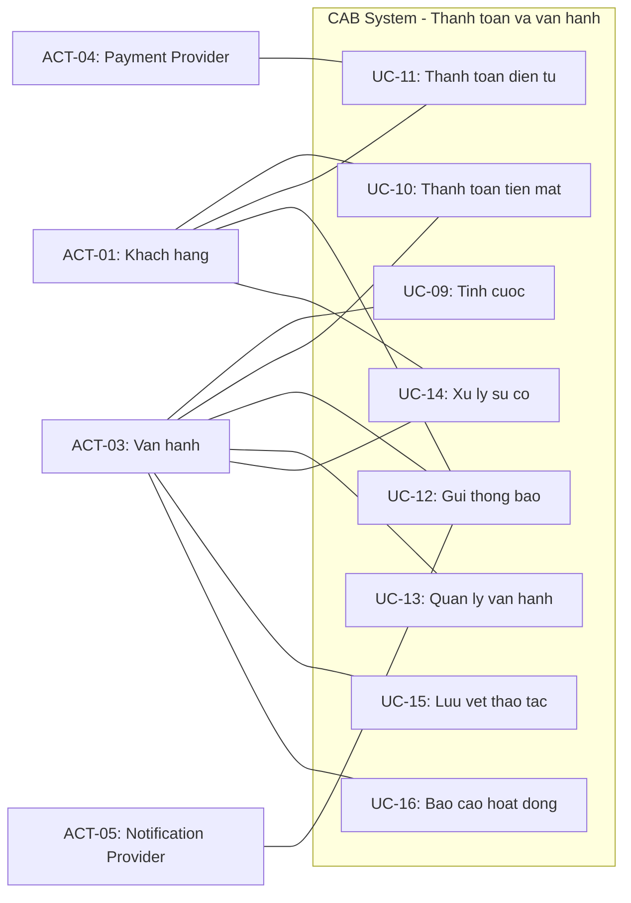

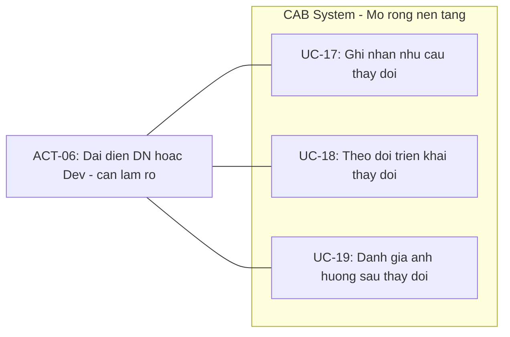

### Ghi chú về sơ đồ

- ACT-01 đến ACT-05 là các Actor có cơ sở tương tác trực tiếp trong nguồn.
- ACT-06 và UC-17 đến UC-19 được đưa vào sơ đồ phân tích với ghi chú `can lam ro`; chưa được xem là thiết kế triển khai đã chốt.
- Các quan hệ `include`/`extend` được giữ trong bảng phân tích bên dưới, không vẽ trên các sơ đồ nhóm để tránh giao cắt và giữ sơ đồ dễ đọc.
- Không có Generalization.

## VI. Giải thích sơ đồ và truy xuất

| Thành phần              | Ý nghĩa                                       | Nguồn                                           |
| ----------------------- | --------------------------------------------- | ----------------------------------------------- |
| ACT-01                  | Khách hàng đặt xe, theo dõi và thanh toán     | STK-02; FR-01 đến FR-03, FR-09, FR-13 đến FR-20 |
| ACT-02                  | Tài xế phản hồi và thực hiện chuyến           | STK-03; FR-04 đến FR-08, FR-12, FR-19, FR-20    |
| ACT-03                  | Nhân viên vận hành quản lý và xử lý hoạt động | STK-04; FR-11, FR-13, FR-15, FR-19 đến FR-27    |
| ACT-04                  | Payment Provider xử lý giao dịch điện tử      | STK-06; FR-16 đến FR-18; BP-04                  |
| ACT-05                  | Notification Provider gửi thông báo           | STK-07; FR-19, FR-20; BP-05                     |
| ACT-06                  | Actor ứng viên cho hoạt động mở rộng nền tảng | STK-01, STK-09; FR-28 đến FR-30; BP-08          |
| UC-01 đến UC-05         | Tài khoản, tạo yêu cầu và phân công tài xế    | FR-01 đến FR-07; BP-01, BP-02                   |
| UC-06 đến UC-08         | Thực hiện, theo dõi và ghi nhận sự cố chuyến  | FR-08 đến FR-11; BP-03, BP-06                   |
| UC-09 đến UC-12         | Tính cước, thanh toán và thông báo            | FR-13 đến FR-20; BP-04, BP-05                   |
| UC-13 đến UC-16         | Vận hành, xử lý sự cố, audit và báo cáo       | FR-21 đến FR-27; BP-06, BP-07                   |
| UC-17 đến UC-19         | Quản lý thay đổi/mở rộng nền tảng             | FR-28 đến FR-30; BP-08; [Cần làm rõ]            |
| REL-UC-01 đến REL-UC-03 | Các quan hệ include được giữ trong sơ đồ      | BRULE-01, BRULE-09, BRULE-10; bước 13           |
| REL-UC-04               | Quan hệ extend khi chuyến phát sinh sự cố     | EX-08, EX-18; bước 13                           |

## VII. Ma trận FR -> Use Case -> Sơ đồ

| FR/FR con                        | Use Case | Actor                          | Có trong sơ đồ? | Được bao phủ? | Ghi chú                                                        |
| -------------------------------- | -------- | ------------------------------ | --------------- | ------------- | -------------------------------------------------------------- |
| FR-01/FR-01.1 đến FR-01.3        | UC-01    | ACT-01                         | Có              | Có            | Quản lý tài khoản                                              |
| FR-02/FR-02.1, FR-02.2; FR-03    | UC-02    | ACT-01                         | Có              | Có            | Tạo và tiếp nhận yêu cầu                                       |
| FR-04/FR-04.1 đến FR-04.3; FR-12 | UC-03    | ACT-02, ACT-03                 | Có              | Có            | Tiêu chí/vị trí cần xác nhận                                   |
| FR-05/FR-05.1, FR-05.2           | UC-04    | ACT-02                         | Có              | Có            | Thời gian phản hồi cần xác nhận                                |
| FR-06, FR-07/FR-07.1, FR-07.2    | UC-05    | ACT-01, ACT-02, ACT-03         | Có              | Có            | Phân công và tìm tiếp                                          |
| FR-08/FR-08.1, FR-08.2           | UC-06    | ACT-02                         | Có              | Có            | Trình tự trạng thái cần xác nhận                               |
| FR-09/FR-09.1 đến FR-09.3; FR-10 | UC-07    | ACT-01                         | Có              | Có            | Theo dõi và chuyển tính cước                                   |
| FR-11                            | UC-08    | ACT-01, ACT-02, ACT-03         | Có              | Có            | Chuyến có sự cố                                                |
| FR-13/FR-13.1 đến FR-13.3        | UC-09    | ACT-03                         | Có              | Có            | Công thức cước cần xác nhận                                    |
| FR-14, FR-15                     | UC-10    | ACT-01, ACT-03                 | Có              | Có            | Thanh toán tiền mặt                                            |
| FR-14, FR-16 đến FR-18           | UC-11    | ACT-01, ACT-04                 | Có              | Có            | Thanh toán điện tử/provider                                    |
| FR-19, FR-20/FR-19.1 đến FR-20.2 | UC-12    | ACT-01, ACT-02, ACT-03, ACT-05 | Có              | Có            | Thông báo                                                      |
| FR-21/FR-21.1, FR-21.2; FR-22    | UC-13    | ACT-03                         | Có              | Có            | Quyền vận hành cần xác nhận                                    |
| FR-23/FR-23.1, FR-23.2; FR-24    | UC-14    | ACT-01, ACT-02, ACT-03         | Có              | Có            | Xử lý và cung cấp kết quả sự cố                                |
| FR-25                            | UC-15    | ACT-03                         | Có              | Có            | Audit                                                          |
| FR-26, FR-27/FR-27.1 đến FR-27.3 | UC-16    | ACT-03                         | Có              | Có            | Ban lãnh đạo là bên nhận/quan tâm; cách tương tác cần xác nhận |
| FR-28/FR-28.1, FR-28.2           | UC-17    | ACT-06                         | Có              | Một phần      | Actor trực tiếp và phạm vi cần xác nhận                        |
| FR-29/FR-29.1, FR-29.2           | UC-18    | ACT-06                         | Có              | Một phần      | Có khả năng vượt phạm vi đồ án                                 |
| FR-30/FR-30.1, FR-30.2           | UC-19    | ACT-06                         | Có              | Một phần      | Có khả năng vượt phạm vi đồ án                                 |

Không có FR nào từ FR-01 đến FR-30 bị bỏ khỏi sơ đồ. Các FR-28 đến FR-30 được đánh dấu bao phủ một phần vì Actor trực tiếp và mức triển khai của BP-08 chưa được xác nhận.

## VIII. Kiểm tra sơ đồ

### 8.1. Kiểm tra Actor

- Actor trong sơ đồ sử dụng đúng mã ACT-01 đến ACT-06 từ bước 13.
- Không đưa STK-05, STK-08 hoặc STK-10 vào sơ đồ như Actor chính thức.
- ACT-04 và ACT-05 nằm ngoài ranh giới hệ thống; xử lý nội bộ của provider không thuộc CAB.
- ACT-06 được gắn `[Cần làm rõ]`, không được hiểu là đã xác định chắc chắn người dùng trực tiếp.

### 8.2. Kiểm tra Use Case

- Đủ 19 Use Case, dùng đúng mã UC-01 đến UC-19.
- Mỗi Use Case thể hiện mục tiêu nghiệp vụ, không phải thao tác Database/API/UI.
- Không tạo Use Case ngoài Scope; UC-17 đến UC-19 thuộc S-F11 và được đánh dấu có khả năng vượt phạm vi đồ án.

### 8.3. Kiểm tra quan hệ

- Các association trong sơ đồ nối Actor với đúng nhóm Use Case theo ASSOC-01 đến ASSOC-31.
- Include được giới hạn ở UC-02/UC-01, UC-05/UC-03 và UC-11/UC-09.
- Extend chỉ giữ UC-08/UC-07 vì sự cố là tình huống có điều kiện trong quá trình theo dõi.
- Không có Generalization.
- REL-UC-05 không đưa vào sơ đồ vì chưa đủ cơ sở.

### 8.4. Kiểm tra Mermaid

- Sơ đồ dùng `flowchart LR`.
- Actor nằm ngoài subgraph `CAB` và Use Case nằm trong ranh giới hệ thống.
- Mỗi node có ID duy nhất trong sơ đồ.
- Không có node Database, Entity, API, Code hoặc module kỹ thuật.

## IX. Các vấn đề cần làm rõ

| Issue ID | Thành phần              | Nội dung chưa rõ                                                           | Ảnh hưởng đến sơ đồ | Cần xác nhận |
| -------- | ----------------------- | -------------------------------------------------------------------------- | ------------------- | ------------ |
| UCD-I01  | ACT-06/UC-17 đến UC-19  | Ai trực tiếp nhập, phê duyệt và theo dõi thay đổi nền tảng?                | Actor/UC/S-F11      | Có           |
| UCD-I02  | UC-03, UC-05            | Nhân viên vận hành hay hệ thống tự động thực hiện tìm và phân công tài xế? | Association/UC      | Có           |
| UCD-I03  | UC-09                   | Ai khởi tạo và kiểm tra việc tính cước?                                    | Association/UC      | Có           |
| UCD-I04  | UC-16/STK-05            | Ban lãnh đạo đăng nhập xem báo cáo hay nhận báo cáo qua vận hành?          | Actor/Association   | Có           |
| UCD-I05  | UC-03, UC-04, UC-05     | Tiêu chí ưu tiên, thời gian phản hồi và chính sách tìm tiếp chưa chốt      | UC/Relationship     | Có           |
| UCD-I06  | UC-06, UC-07            | Trình tự trạng thái và xử lý mất kết nối chưa chốt                         | UC/Exception        | Có           |
| UCD-I07  | UC-09 đến UC-12         | Công thức cước, retry thanh toán và kênh/retry thông báo chưa chốt         | UC/Relationship     | Có           |
| UCD-I08  | REL-UC-01 đến REL-UC-04 | Cần xác nhận lại include/extend khi đặc tả Use Case                        | Relationship        | Có           |
| UCD-I09  | Kích thước sơ đồ        | 19 Use Case làm sơ đồ lớn; có thể tách nhóm ở bước trình bày nếu cần       | Diagram readability | Có           |

## X. Tổng hợp

| Thành phần               |                                 Số lượng |
| ------------------------ | ---------------------------------------: |
| Tổng số Actor            |                                        6 |
| Tổng số Use Case         |                                       19 |
| Tổng số Association      |                                       31 |
| Quan hệ Include          |                                        3 |
| Quan hệ Extend           | 1 trong sơ đồ; 1 quan hệ khác cần làm rõ |
| Quan hệ Generalization   |                                        0 |
| FR chưa có Use Case      |                                        0 |
| Use Case chưa có Actor   |                                        0 |
| Use Case cần làm rõ      |                                        3 |
| Actor cần làm rõ         |                                        1 |
| FR được bao phủ một phần |                          FR-28 đến FR-30 |

## XI. Kết luận bước 14

- Actor chính trong sơ đồ là khách hàng, tài xế, nhân viên vận hành, Payment Provider và Notification Provider; ACT-06 được giữ như Actor ứng viên cần xác nhận.
- 19 Use Case của bước 13 đều được đưa vào ranh giới CAB System và giữ nguyên mã.
- Sơ đồ thể hiện 31 association, 3 include và 1 extend; không có Generalization.
- Các điểm chưa rõ về ACT-06, báo cáo, tìm/phân công tài xế, cước, thanh toán, thông báo và quan hệ include/extend được ghi ngoài sơ đồ, không tự suy đoán.

## XII. Giới hạn của bước 14

- Chỉ chuyển Actor/Use Case/Quan hệ thành Use Case Diagram bằng Mermaid.
- Không đặc tả Use Case hoặc Main Flow, Alternative Flow, Exception Flow chi tiết.
- Không tạo FR, BP, Rule, Actor hoặc Use Case mới.
- Không tạo Acceptance Criteria.
- Không thiết kế UI, Database vật lý, Architecture, API hoặc Code.

## XIII. Đầu ra chuyển tiếp

Kết quả bước 14 là đầu vào cho `15_DacTaUseCase.md`, `16_XacDinhAcceptanceCriteria_AC.md` và `17_TruyXuatNguonGocYeuCau_RTM.md`.

Các mã Actor, UC, Association, Relationship, FR, FR con, BR, BP, Step, Rule, Exception, NFR, Entity và Stakeholder phải được giữ nguyên ở các bước sau.

`NEED -> STK -> SCOPE -> BR -> BP -> STEP -> FR -> FR con -> Rule/Exception -> NFR -> DATA -> ACTOR/UC -> AC -> RTM`

## Ghi chú chuyển tiếp nội dung Bước 14

Nội dung thực hiện Bước 14 được trình bày đầy đủ tại [Phụ lục - Nội dung Use Case Diagram làm đầu vào Bước 14](#phụ-lục---nội-dung-use-case-diagram-làm-đầu-vào-bước-14), đặt sau phần Bước 12 để giữ nguyên các bảng Actor, Use Case, Mermaid Diagram, ma trận FR và kiểm tra sơ đồ mà không nhân đôi nội dung.

## Kết quả chuyển tiếp của Bước 14

- Ranh giới CAB System, 6 Actor và 19 Use Case được thể hiện trong Mermaid Diagram.
- Các Association được giữ theo `ASSOC-01` đến `ASSOC-31`.
- Các quan hệ `include` và `extend` được giữ theo `REL-UC-01` đến `REL-UC-04`; `REL-UC-05` vẫn cần xác nhận và không đưa vào sơ đồ chính.
- FR-01 đến FR-30 đều có Use Case trong sơ đồ; FR-28 đến FR-30 được đánh dấu cần xác nhận về Actor và phạm vi.
- Đầu ra tiếp theo là đặc tả Use Case, Acceptance Criteria và RTM.

# Bước 14 - Xác định và Vẽ Use Case Diagram

Nội dung chi tiết của Bước 14 được trình bày tại [Phụ lục - Nội dung Use Case Diagram làm đầu vào Bước 14](#phụ-lục---nội-dung-use-case-diagram-làm-đầu-vào-bước-14), gồm danh sách Actor/Use Case, sơ đồ Mermaid, giải thích truy xuất, ma trận FR và kiểm tra sơ đồ.

Kết quả chính: 6 Actor, 19 Use Case, 31 Association, 3 quan hệ `<<include>>`, 1 quan hệ `<<extend>>` trong sơ đồ và không có Generalization. FR-01 đến FR-30 đều được bao phủ; FR-28 đến FR-30 vẫn cần xác nhận Actor trực tiếp và phạm vi triển khai.

Các mã Actor, Use Case, Association, Relationship, FR, FR con, BR, BP, Step, Rule, Exception, NFR, Entity và Stakeholder được giữ nguyên để chuyển sang bước 15, 16 và 17.

# Bước 15 - Đặc tả Use Case

## I. Phạm vi và quy ước đặc tả

Phần này đặc tả 19 Use Case đã có trong Bước 13 và Bước 14. Chuỗi truy xuất được giữ theo `NEED -> STK -> SCOPE -> BR -> BP -> Step -> FR -> FR con -> Rule/Exception -> Actor/UC`. Nội dung chỉ mô tả tương tác nghiệp vụ; không bổ sung Use Case, Rule, Exception, dữ liệu hay giải pháp kỹ thuật mới.

Trong mỗi đặc tả, bảng **Kiểm tra** xác nhận các thành phần bắt buộc. `Có` nghĩa là nội dung đã được mô tả trong Use Case; nội dung có chính sách chưa chốt được ghi rõ `[Cần làm rõ]`.

## II. Đặc tả Use Case

## UC-01 — Quản lý tài khoản

### 1. Thông tin chung

| Thành phần | Nội dung |
| --- | --- |
| Mã/Tên | `UC-01` — Quản lý tài khoản |
| Mục tiêu | Cho phép khách hàng đăng ký, đăng nhập và cập nhật thông tin cá nhân để sử dụng dịch vụ. |
| Phạm vi/nguồn | `NEED-01 -> STK-02 -> S-F01 -> BR-01 -> BP-01/STEP-01 -> FR-01, FR-01.1 đến FR-01.3`. |
| Actor chính | `ACT-01` — Khách hàng. |
| Actor phụ | Không có. |
| Trigger | Khách hàng cần đăng ký, đăng nhập hoặc cập nhật thông tin tài khoản. |
| Precondition | Khách hàng có thể cung cấp thông tin tài khoản; các điều kiện hợp lệ chi tiết `[Cần làm rõ]`. |
| Postcondition | Tài khoản/thông tin được tạo, xác thực hoặc cập nhật hợp lệ để khách hàng tiếp tục sử dụng chức năng yêu cầu tài khoản. |

### 2. Dữ liệu, Rule, Exception và quan hệ

| Loại | Nội dung |
| --- | --- |
| Dữ liệu | `ENT-01 UserAccount`, `ENT-02 CustomerProfile`: tạo/xem/cập nhật trạng thái tài khoản và thông tin cá nhân. |
| Rule | `BRULE-01`: chỉ tài khoản hợp lệ sử dụng chức năng yêu cầu tài khoản. |
| Exception | `EX-17`: tài khoản không hợp lệ/bị khóa thì không tiếp tục chức năng yêu cầu tài khoản. |
| Include/Extend | Include: Không có. Extend: Không có. |

### 3. Main Flow

| Bước | Actor | Hệ thống |
| ---: | --- | --- |
| 1 | Khách hàng chọn đăng ký, đăng nhập hoặc cập nhật thông tin. | Tiếp nhận yêu cầu quản lý tài khoản. |
| 2 | Khách hàng cung cấp hoặc chỉnh sửa thông tin cần thiết. | Kiểm tra thông tin theo điều kiện đã xác nhận. |
| 3 | Khách hàng xác nhận gửi thông tin. | Ghi nhận kết quả hợp lệ và cho phép sử dụng chức năng phù hợp. |

### 4. Alternative Flow

**A1 — Cập nhật thông tin cá nhân:** Khách hàng đã có tài khoản hợp lệ, chọn cập nhật thông tin; hệ thống ghi nhận thay đổi hợp lệ và kết thúc Use Case.

### 5. Exception Flow

**E1 — Tài khoản không hợp lệ/bị khóa:** `EX-17`; phát hiện tại bước 2. Hệ thống không cho tiếp tục chức năng yêu cầu tài khoản và thông báo kết quả. Chi tiết điều kiện khóa/xử lý `[Cần làm rõ]`.

### 6. Kiểm tra

| Thành phần | Kết quả |
| --- | --- |
| Mục tiêu, Actor, Trigger, Pre/Postcondition, Main Flow | Có |
| Alternative/Exception Flow | Có; chi tiết điều kiện tài khoản cần làm rõ |
| Rule, FR/FR con, Include/Extend | Có; không có quan hệ |

## UC-02 — Tạo yêu cầu đặt xe

### 1. Thông tin chung

| Thành phần | Nội dung |
| --- | --- |
| Mã/Tên | `UC-02` — Tạo yêu cầu đặt xe |
| Mục tiêu | Gửi yêu cầu với điểm đón, điểm đến và loại xe để hệ thống tiếp nhận và chuyển tìm tài xế. |
| Phạm vi/nguồn | `NEED-02 -> STK-02 -> S-F02 -> BR-02 -> BP-01/STEP-02, STEP-03 -> FR-02, FR-02.1, FR-02.2, FR-03`. |
| Actor chính/phụ | Chính: `ACT-01` — Khách hàng. Phụ: Không có. |
| Trigger | Khách hàng có nhu cầu đặt xe. |
| Precondition | Khách hàng có tài khoản hợp lệ theo `BRULE-01`; có điểm đón, điểm đến và loại xe. |
| Postcondition | Yêu cầu được tiếp nhận để tìm tài xế. |

### 2. Dữ liệu, Rule, Exception và quan hệ

| Loại | Nội dung |
| --- | --- |
| Dữ liệu | `ENT-05 Trip`: tạo yêu cầu với PickupLocation, Destination, ServiceType. |
| Rule | `BRULE-02`: yêu cầu phải có điểm đón, điểm đến và loại xe. |
| Exception | `EX-01` thông tin không hợp lệ; `EX-02` mất kết nối khi tạo yêu cầu. |
| Include/Extend | Include: `UC-01` theo `REL-UC-01`. Extend: Không có. |

### 3. Main Flow

| Bước | Actor | Hệ thống |
| ---: | --- | --- |
| 1 | Khách hàng nhập điểm đón, điểm đến và chọn loại xe. | Hiển thị/tiếp nhận thông tin yêu cầu. |
| 2 | Khách hàng gửi yêu cầu. | Kiểm tra thông tin bắt buộc theo `BRULE-02`. |
| 3 |  | Ghi nhận yêu cầu chuyến `[Suy ra]` và chuyển yêu cầu sang quá trình tìm tài xế. |

### 4. Alternative Flow

Không có Alternative Flow được xác định từ nguồn.

### 5. Exception Flow

**E1 — Thông tin đặt xe không hợp lệ:** `EX-01`, tại bước 2; hệ thống yêu cầu khách hàng bổ sung/chỉnh sửa và quay lại bước 1.

**E2 — Mất kết nối khi tạo yêu cầu:** `EX-02`, tại bước 2 hoặc 3; cách giữ hoặc gửi lại thông tin `[Cần làm rõ]`, Use Case chưa có kết quả thành công.

### 6. Kiểm tra

| Thành phần | Kết quả |
| --- | --- |
| Mục tiêu, Actor, Trigger, Pre/Postcondition, Main Flow | Có |
| Alternative/Exception Flow | Không có alternative; 2 exception |
| Rule, FR/FR con, Include/Extend | Có; include `UC-01` |

## UC-03 — Tìm và ưu tiên tài xế

### 1. Thông tin chung

| Thành phần | Nội dung |
| --- | --- |
| Mã/Tên | `UC-03` — Tìm và ưu tiên tài xế |
| Mục tiêu | Xác định tài xế phù hợp theo vị trí, trạng thái sẵn sàng và tiêu chí vận hành. |
| Phạm vi/nguồn | `NEED-08, NEED-09 -> STK-01, STK-03, STK-04 -> S-F03, S-F05 -> BR-08, BR-09 -> BP-02/STEP-04 -> FR-04, FR-04.1 đến FR-04.3, FR-12`. |
| Actor chính | `ACT-03` — Nhân viên vận hành; vai trò trực tiếp cần xác nhận. |
| Actor phụ | `ACT-02` — Tài xế, cung cấp trạng thái/vị trí. |
| Trigger | Có yêu cầu đặt xe đã tiếp nhận. |
| Precondition | Có yêu cầu chuyến; dữ liệu vị trí và trạng thái sẵn sàng khả dụng nếu có. |
| Postcondition | Có danh sách/đề xuất tài xế phù hợp hoặc ghi nhận không thể tìm tài xế. |

### 2. Dữ liệu, Rule, Exception và quan hệ

| Loại | Nội dung |
| --- | --- |
| Dữ liệu | `ENT-03 DriverProfile`, `ENT-05 Trip`, `ENT-06 DriverLocation`: xem trạng thái sẵn sàng, yêu cầu và vị trí. |
| Rule | `BRULE-03` tài xế đủ điều kiện; `BRULE-04` ưu tiên theo tiêu chí doanh nghiệp `[Cần làm rõ]`. |
| Exception | `EX-03` không tìm thấy tài xế; `EX-06` vị trí không khả dụng. |
| Include/Extend | Include: Không có. Extend: Không có. UC này được `UC-05` include theo `REL-UC-02`. |

### 3. Main Flow

| Bước | Actor | Hệ thống |
| ---: | --- | --- |
| 1 | Nhân viên vận hành khởi tạo/tổ chức tìm tài xế khi cần `[Cần làm rõ]`. | Xác định nhóm tài xế có khả năng phù hợp. |
| 2 | Tài xế duy trì trạng thái sẵn sàng và thông tin vị trí khi khả dụng. | Xem xét vị trí, trạng thái và tiêu chí vận hành. |
| 3 |  | Ưu tiên hoặc đề xuất tài xế phù hợp để chuyển đến phản hồi yêu cầu. |

### 4. Alternative Flow

Không có Alternative Flow được xác định từ nguồn; tiêu chí ưu tiên chưa được chốt.

### 5. Exception Flow

**E1 — Không tìm thấy tài xế:** `EX-03`; tại bước 1–3, hệ thống ghi nhận không có tài xế phù hợp để `UC-05` thông báo khách hàng.

**E2 — Vị trí tài xế không khả dụng:** `EX-06`; cách tiếp tục tìm và xác định thời gian dự kiến `[Cần làm rõ]`.

### 6. Kiểm tra

| Thành phần | Kết quả |
| --- | --- |
| Mục tiêu, Actor, Trigger, Pre/Postcondition, Main Flow | Có; Actor chính cần xác nhận |
| Alternative/Exception Flow | Không có alternative xác định; 2 exception |
| Rule, FR/FR con, Include/Extend | Có |

## UC-04 — Phản hồi yêu cầu chuyến

### 1. Thông tin chung

| Thành phần | Nội dung |
| --- | --- |
| Mã/Tên | `UC-04` — Phản hồi yêu cầu chuyến |
| Mục tiêu | Cho phép tài xế chấp nhận hoặc từ chối yêu cầu chuyến được đề xuất. |
| Phạm vi/nguồn | `NEED-06, NEED-09 -> STK-03 -> S-F03, S-F07 -> BR-06, BR-10 -> BP-02/STEP-05 -> FR-05, FR-05.1, FR-05.2`. |
| Actor chính/phụ | Chính: `ACT-02` — Tài xế. Phụ: Không có. |
| Trigger | Tài xế nhận thông tin yêu cầu chuyến phù hợp. |
| Precondition | Có yêu cầu được gửi đến tài xế. |
| Postcondition | Phản hồi chấp nhận/từ chối được ghi nhận hoặc quá thời gian phản hồi theo chính sách chưa chốt. |

### 2. Dữ liệu, Rule, Exception và quan hệ

| Loại | Nội dung |
| --- | --- |
| Dữ liệu | `ENT-03 DriverProfile`, `ENT-05 Trip`: xem yêu cầu và cập nhật phản hồi. |
| Rule | `BRULE-05`: yêu cầu tiếp tục xử lý khi tài xế từ chối/không phản hồi. |
| Exception | `EX-04` tài xế từ chối; `EX-05` không phản hồi. |
| Include/Extend | Include: Không có. Extend: Không có. |

### 3. Main Flow

| Bước | Actor | Hệ thống |
| ---: | --- | --- |
| 1 | Tài xế nhận thông tin yêu cầu chuyến. | Cung cấp thông tin yêu cầu để tài xế phản hồi. |
| 2 | Tài xế chọn chấp nhận chuyến. | Ghi nhận phản hồi chấp nhận. |
| 3 |  | Chuyển kết quả sang `UC-05` để ghi nhận phân công. |

### 4. Alternative Flow

**A1 — Từ chối chuyến:** Tại bước 2, tài xế chọn từ chối; hệ thống ghi nhận phản hồi và chuyển `UC-05` tìm tài xế khác.

### 5. Exception Flow

**E1 — Không phản hồi:** `EX-05`; không có phản hồi trong thời gian quy định. Hệ thống chuyển tiếp theo chính sách; thời gian và cách chuyển tiếp `[Cần làm rõ]`.

### 6. Kiểm tra

| Thành phần | Kết quả |
| --- | --- |
| Mục tiêu, Actor, Trigger, Pre/Postcondition, Main Flow | Có |
| Alternative/Exception Flow | Có |
| Rule, FR/FR con, Include/Extend | Có; không có quan hệ |

## UC-05 — Phân công và tìm tiếp tài xế

### 1. Thông tin chung

| Thành phần | Nội dung |
| --- | --- |
| Mã/Tên | `UC-05` — Phân công và tìm tiếp tài xế |
| Mục tiêu | Ghi nhận tài xế chấp nhận hoặc tiếp tục tìm tài xế khác khi chưa phân công được. |
| Phạm vi/nguồn | `NEED-09 -> STK-02, STK-03, STK-04 -> S-F03, S-F07 -> BR-09, BR-10 -> BP-02/STEP-05, STEP-06 -> FR-06, FR-07, FR-07.1, FR-07.2`. |
| Actor chính | `ACT-03` — Nhân viên vận hành; vai trò tìm/phân công trực tiếp `[Cần làm rõ]`. |
| Actor phụ | `ACT-01` — Khách hàng nhận kết quả; `ACT-02` — Tài xế phản hồi. |
| Trigger | Có phản hồi từ tài xế hoặc kết quả tìm tài xế. |
| Precondition | Có yêu cầu đặt xe chưa được phân công. |
| Postcondition | Chuyến được phân công hoặc khách hàng được thông báo không thể phân công. |

### 2. Dữ liệu, Rule, Exception và quan hệ

| Loại | Nội dung |
| --- | --- |
| Dữ liệu | `ENT-05 Trip`, `ENT-03 DriverProfile`: cập nhật tài xế được phân công và trạng thái yêu cầu. |
| Rule | `BRULE-05` tiếp tục tìm; `BRULE-06` ghi nhận phân công trước khi thực hiện chuyến. |
| Exception | `EX-03`, `EX-04`, `EX-05`. |
| Include/Extend | Include: `UC-03` theo `REL-UC-02` `[Suy ra]`; Extend: Không có. |

### 3. Main Flow

| Bước | Actor | Hệ thống |
| ---: | --- | --- |
| 1 | Tài xế chấp nhận yêu cầu. | Nhận kết quả từ `UC-04`. |
| 2 |  | Ghi nhận tài xế được phân công theo `BRULE-06`. |
| 3 | Khách hàng nhận kết quả phân công. | Thông báo kết quả cho các bên liên quan và chuyển chuyến sang thực hiện. |

### 4. Alternative Flow

**A1 — Tìm tiếp tài xế:** Khi tài xế từ chối, hệ thống không yêu cầu khách hàng tạo lại yêu cầu, quay lại include `UC-03` để tìm tài xế khác.

### 5. Exception Flow

**E1 — Không tìm thấy tài xế:** `EX-03`; hệ thống thông báo rõ cho khách hàng và kết thúc phân công.

**E2 — Không phản hồi:** `EX-05`; thời gian chờ và chính sách tìm tiếp `[Cần làm rõ]`.

### 6. Kiểm tra

| Thành phần | Kết quả |
| --- | --- |
| Mục tiêu, Actor, Trigger, Pre/Postcondition, Main Flow | Có; Actor vận hành cần xác nhận |
| Alternative/Exception Flow | Có |
| Rule, FR/FR con, Include/Extend | Có; include `UC-03` |

## UC-06 — Cập nhật tiến trình chuyến

### 1. Thông tin chung

| Thành phần | Nội dung |
| --- | --- |
| Mã/Tên | `UC-06` — Cập nhật tiến trình chuyến |
| Mục tiêu | Tài xế cập nhật trạng thái chuyến trong quá trình thực hiện. |
| Phạm vi/nguồn | `NEED-07 -> STK-03 -> S-F04 -> BR-07 -> BP-03/STEP-07 -> FR-08, FR-08.1, FR-08.2`. |
| Actor chính/phụ | Chính: `ACT-02` — Tài xế. Phụ: Không có. |
| Trigger | Tài xế thực hiện chuyến đã được phân công. |
| Precondition | Tài xế được phân công chuyến; trạng thái mới phù hợp tiến trình hợp lệ. |
| Postcondition | Trạng thái chuyến được cập nhật hoặc trạng thái cũ được giữ nếu cập nhật không hợp lệ. |

### 2. Dữ liệu, Rule, Exception và quan hệ

| Loại | Nội dung |
| --- | --- |
| Dữ liệu | `ENT-05 Trip`: cập nhật TripStatus và thời điểm liên quan. |
| Rule | `BRULE-07` chuyển trạng thái đúng trình tự; `BRULE-08` chỉ cập nhật chuyến được phân công `[Suy ra]`. |
| Exception | `EX-07` trạng thái không hợp lệ; `EX-09` mất kết nối. |
| Include/Extend | Include: Không có. Extend: Không có. |

### 3. Main Flow

| Bước | Actor | Hệ thống |
| ---: | --- | --- |
| 1 | Tài xế chọn cập nhật trạng thái chuyến. | Tiếp nhận trạng thái mới. |
| 2 | Tài xế lần lượt cập nhật đã đến điểm đón, đã đón khách, đang di chuyển và hoàn thành theo thực tế. | Kiểm tra trạng thái theo `BRULE-07`, `BRULE-08`. |
| 3 |  | Cập nhật trạng thái hợp lệ để khách hàng theo dõi; khi hoàn thành, chuyển kết quả sang tính cước. |

### 4. Alternative Flow

Không có Alternative Flow được xác định từ nguồn.

### 5. Exception Flow

**E1 — Cập nhật trạng thái không hợp lệ:** `EX-07`; hệ thống từ chối cập nhật, thông báo lỗi và giữ trạng thái trước đó.

**E2 — Mất kết nối:** `EX-09`; chính sách lưu/gửi lại/đồng bộ `[Cần làm rõ]`.

### 6. Kiểm tra

| Thành phần | Kết quả |
| --- | --- |
| Mục tiêu, Actor, Trigger, Pre/Postcondition, Main Flow | Có |
| Alternative/Exception Flow | Không có alternative xác định; 2 exception |
| Rule, FR/FR con, Include/Extend | Có; không có quan hệ |

## UC-07 — Theo dõi chuyến xe

### 1. Thông tin chung

| Thành phần | Nội dung |
| --- | --- |
| Mã/Tên | `UC-07` — Theo dõi chuyến xe |
| Mục tiêu | Cho phép khách hàng xem trạng thái, tài xế, tiến trình và kết quả chuyến. |
| Phạm vi/nguồn | `NEED-03, NEED-04 -> STK-02 -> S-F04, S-F06 -> BR-03, BR-04 -> BP-03/STEP-08, STEP-09 -> FR-09, FR-09.1 đến FR-09.3, FR-10`. |
| Actor chính/phụ | Chính: `ACT-01` — Khách hàng. Phụ: Không có. |
| Trigger | Khách hàng cần xem yêu cầu/chuyến đã tạo. |
| Precondition | Có yêu cầu hoặc chuyến thuộc khách hàng. |
| Postcondition | Khách hàng nhận được thông tin tiến trình hiện có; chuyến hoàn thành được chuyển sang tính cước. |

### 2. Dữ liệu, Rule, Exception và quan hệ

| Loại | Nội dung |
| --- | --- |
| Dữ liệu | `ENT-05 Trip`, `ENT-03 DriverProfile`: xem trạng thái chuyến và thông tin tài xế. |
| Rule | `BRULE-09` áp dụng khi chuyến hoàn thành để chuyển sang tính cước. |
| Exception | `EX-09`: mất kết nối khi theo dõi. |
| Include/Extend | Include: Không có. Extend: `UC-08` theo `REL-UC-04` `[Suy ra]` khi phát sinh sự cố. |

### 3. Main Flow

| Bước | Actor | Hệ thống |
| ---: | --- | --- |
| 1 | Khách hàng yêu cầu xem thông tin chuyến. | Xác định chuyến/yêu cầu liên quan. |
| 2 |  | Hiển thị trạng thái, tiến trình và thông tin tài xế hiện có. |
| 3 | Khách hàng theo dõi đến khi chuyến hoàn thành. | Tiếp nhận kết quả hoàn thành và chuyển sang tính cước/thanh toán theo `FR-10`. |

### 4. Alternative Flow

Không có Alternative Flow được xác định từ nguồn. Cách xác định thời gian dự kiến `[Cần làm rõ]`.

### 5. Exception Flow

**E1 — Mất kết nối khi theo dõi:** `EX-09`; xử lý đồng bộ/trạng thái `[Cần làm rõ]`.

### 6. Kiểm tra

| Thành phần | Kết quả |
| --- | --- |
| Mục tiêu, Actor, Trigger, Pre/Postcondition, Main Flow | Có |
| Alternative/Exception Flow | Không có alternative xác định; 1 exception |
| Rule, FR/FR con, Include/Extend | Có; extend `UC-08` |

## UC-08 — Ghi nhận chuyến có sự cố

### 1. Thông tin chung

| Thành phần | Nội dung |
| --- | --- |
| Mã/Tên | `UC-08` — Ghi nhận chuyến có sự cố |
| Mục tiêu | Ghi nhận/chuyển thông tin chuyến lỗi hoặc bất thường cho vận hành xử lý. |
| Phạm vi/nguồn | `NEED-15 -> STK-02, STK-03, STK-04 -> S-F04, S-F08 -> BR-16 -> BP-03/STEP-09, BP-06/STEP-16 -> FR-11`. |
| Actor chính | `ACT-03` — Nhân viên vận hành. |
| Actor phụ | `ACT-01` — Khách hàng; `ACT-02` — Tài xế. |
| Trigger | Khách hàng, tài xế hoặc vận hành phát hiện chuyến lỗi/bất thường. |
| Precondition | Có chuyến cần hỗ trợ. |
| Postcondition | Có thông tin sự cố để vận hành theo dõi/xử lý. |

### 2. Dữ liệu, Rule, Exception và quan hệ

| Loại | Nội dung |
| --- | --- |
| Dữ liệu | `ENT-05 Trip`, `ENT-10 Incident`: tạo/cập nhật thông tin sự cố. |
| Rule | Không có Rule riêng được xác định; áp dụng xử lý theo `BR-16`. |
| Exception | `EX-08`, `EX-18`: chuyến phát sinh/cần xử lý sự cố. |
| Include/Extend | Include: Không có. Extend: mở rộng `UC-07` theo `REL-UC-04`. |

### 3. Main Flow

| Bước | Actor | Hệ thống |
| ---: | --- | --- |
| 1 | Khách hàng/tài xế/vận hành cung cấp thông tin chuyến có sự cố. | Tiếp nhận và liên kết thông tin với chuyến. |
| 2 | Nhân viên vận hành tiếp nhận nội dung cần xử lý. | Ghi nhận sự cố để theo dõi. |
| 3 |  | Chuyển thông tin sang `UC-14` xử lý sự cố. |

### 4. Alternative Flow

Không có Alternative Flow được xác định từ nguồn.

### 5. Exception Flow

**E1 — Chuyến phát sinh sự cố:** `EX-08`; là điều kiện kích hoạt extend, hệ thống tạo thông tin để vận hành xử lý. Chi tiết phân loại/trạng thái sự cố `[Cần làm rõ]`.

### 6. Kiểm tra

| Thành phần | Kết quả |
| --- | --- |
| Mục tiêu, Actor, Trigger, Pre/Postcondition, Main Flow | Có |
| Alternative/Exception Flow | Không có alternative xác định; 1 exception |
| Rule, FR/FR con, Include/Extend | Có; extend `UC-07` |

## UC-09 — Tính cước chuyến xe

### 1. Thông tin chung

| Thành phần | Nội dung |
| --- | --- |
| Mã/Tên | `UC-09` — Tính cước chuyến xe |
| Mục tiêu | Xác định số tiền khách hàng phải trả sau khi chuyến hoàn thành. |
| Phạm vi/nguồn | `NEED-11 -> STK-01, STK-02 -> S-F06 -> BR-12 -> BP-04/STEP-10 -> FR-13, FR-13.1 đến FR-13.3`. |
| Actor chính | `ACT-03` — Nhân viên vận hành; người khởi tạo/kiểm tra `[Cần làm rõ]`. |
| Actor phụ | Không có. |
| Trigger | Chuyến hoàn thành hoặc đạt điều kiện tính cước. |
| Precondition | Có thông tin loại dịch vụ và thông tin chuyến cần tính cước. |
| Postcondition | Số tiền phải trả được xác định, hoặc cước chờ xác nhận nếu không đủ dữ liệu/công thức. |

### 2. Dữ liệu, Rule, Exception và quan hệ

| Loại | Nội dung |
| --- | --- |
| Dữ liệu | `ENT-05 Trip`, `ENT-07 Fare`: xem thông tin chuyến, tạo/cập nhật FareAmount và FareBasis. |
| Rule | `BRULE-09` tính sau hoàn thành; `BRULE-10` xác định tiền trước thanh toán. |
| Exception | `EX-10`: không xác định được cước. |
| Include/Extend | Include: Không có. Extend: Không có. UC này được `UC-11` include theo `REL-UC-03`. |

### 3. Main Flow

| Bước | Actor | Hệ thống |
| ---: | --- | --- |
| 1 | Nhân viên vận hành khởi tạo/kiểm tra tính cước khi cần `[Cần làm rõ]`. | Tiếp nhận thông tin chuyến hoàn thành. |
| 2 |  | Xác định số tiền dựa trên loại dịch vụ và thông tin chuyến. |
| 3 |  | Cung cấp số tiền phải trả để khách hàng chọn phương thức thanh toán. |

### 4. Alternative Flow

Không có Alternative Flow được xác định từ nguồn; công thức cước chưa chốt.

### 5. Exception Flow

**E1 — Không xác định được cước:** `EX-10`; hệ thống không cho tiếp tục thanh toán và ghi nhận trạng thái chờ xác nhận cước.

### 6. Kiểm tra

| Thành phần | Kết quả |
| --- | --- |
| Mục tiêu, Actor, Trigger, Pre/Postcondition, Main Flow | Có; actor trực tiếp cần xác nhận |
| Alternative/Exception Flow | Không có alternative xác định; 1 exception |
| Rule, FR/FR con, Include/Extend | Có |

## UC-10 — Thanh toán tiền mặt

### 1. Thông tin chung

| Thành phần | Nội dung |
| --- | --- |
| Mã/Tên | `UC-10` — Thanh toán tiền mặt |
| Mục tiêu | Ghi nhận kết quả thanh toán tiền mặt theo chính sách doanh nghiệp. |
| Phạm vi/nguồn | `NEED-12 -> STK-01, STK-02 -> S-F06 -> BR-13 -> BP-04/STEP-11, STEP-12 -> FR-14, FR-15`. |
| Actor chính | `ACT-01` — Khách hàng. |
| Actor phụ | `ACT-03` — Nhân viên vận hành. |
| Trigger | Khách hàng đã có số tiền phải trả và chọn tiền mặt. |
| Precondition | Cước đã được xác định; phương thức tiền mặt được chọn. |
| Postcondition | Kết quả thanh toán tiền mặt được ghi nhận theo chính sách doanh nghiệp `[Cần làm rõ]`. |

### 2. Dữ liệu, Rule, Exception và quan hệ

| Loại | Nội dung |
| --- | --- |
| Dữ liệu | `ENT-07 Fare`, `ENT-08 PaymentTransaction`: xem số tiền và ghi nhận phương thức/kết quả. |
| Rule | `BRULE-11`: hỗ trợ tiền mặt và điện tử. |
| Exception | `EX-13` được ghi nhận ở mức dữ liệu thanh toán không hợp lệ, chi tiết áp dụng tiền mặt `[Cần làm rõ]`. |
| Include/Extend | Include: Không có. Extend: Không có. |

### 3. Main Flow

| Bước | Actor | Hệ thống |
| ---: | --- | --- |
| 1 | Khách hàng chọn thanh toán tiền mặt. | Tiếp nhận phương thức đã chọn. |
| 2 | Khách hàng thực hiện thanh toán theo chính sách doanh nghiệp. | Ghi nhận kết quả tiền mặt ở mức nghiệp vụ. |
| 3 | Nhân viên vận hành kiểm tra/hỗ trợ khi cần. | Cung cấp kết quả thanh toán cho các bên liên quan theo chính sách. |

### 4. Alternative Flow

Không có Alternative Flow được xác định từ nguồn.

### 5. Exception Flow

**E1 — Kết quả/dữ liệu thanh toán không hợp lệ:** `EX-13`; hệ thống không xác nhận thành công và thông báo lỗi. Điều kiện, người xác nhận và cách xử lý tiền mặt `[Cần làm rõ]`.

### 6. Kiểm tra

| Thành phần | Kết quả |
| --- | --- |
| Mục tiêu, Actor, Trigger, Pre/Postcondition, Main Flow | Có |
| Alternative/Exception Flow | Không có alternative xác định; exception cần làm rõ phạm vi |
| Rule, FR/FR con, Include/Extend | Có; không có quan hệ |

## UC-11 — Thanh toán điện tử

### 1. Thông tin chung

| Thành phần | Nội dung |
| --- | --- |
| Mã/Tên | `UC-11` — Thanh toán điện tử |
| Mục tiêu | Gửi yêu cầu thanh toán đến provider và ghi nhận kết quả giao dịch điện tử. |
| Phạm vi/nguồn | `NEED-12, NEED-13 -> STK-02, STK-06 -> S-F06, S-F09 -> BR-13, BR-14, BR-15 -> BP-04/STEP-11, STEP-12 -> FR-14, FR-16 đến FR-18; FR-16.1 đến FR-16.3; FR-17.1 đến FR-17.3`. |
| Actor chính | `ACT-01` — Khách hàng. |
| Actor phụ | `ACT-04` — Payment Provider. |
| Trigger | Khách hàng có số tiền phải trả và chọn thanh toán điện tử. |
| Precondition | Cước đã xác định; Payment Provider khả dụng theo chính sách. |
| Postcondition | Giao dịch thành công, thất bại hoặc chờ xử lý; CAB không lưu dữ liệu thanh toán nhạy cảm trực tiếp. |

### 2. Dữ liệu, Rule, Exception và quan hệ

| Loại | Nội dung |
| --- | --- |
| Dữ liệu | `ENT-07 Fare`, `ENT-08 PaymentTransaction`: ghi nhận phương thức, trạng thái và ProviderReference; không ghi dữ liệu thẻ/tài khoản nhạy cảm. |
| Rule | `BRULE-11`, `BRULE-12`, `BRULE-13`, `BRULE-14`. |
| Exception | `EX-11` giao dịch thất bại; `EX-12` provider không phản hồi; `EX-13` dữ liệu không hợp lệ. |
| Include/Extend | Include: `UC-09` theo `REL-UC-03` `[Suy ra]`. Extend: Không có. |

### 3. Main Flow

| Bước | Actor | Hệ thống |
| ---: | --- | --- |
| 1 | Khách hàng chọn phương thức điện tử và xác nhận thanh toán. | Có số tiền từ include `UC-09`; tiếp nhận lựa chọn. |
| 2 | Payment Provider tiếp nhận yêu cầu và xử lý giao dịch. | Gửi yêu cầu qua provider theo `BRULE-12`. |
| 3 | Payment Provider trả kết quả giao dịch. | Ghi nhận kết quả gắn với chuyến theo `BRULE-14`, không lưu dữ liệu nhạy cảm. |
| 4 | Khách hàng nhận kết quả. | Thông báo kết quả theo chính sách. |

### 4. Alternative Flow

Không có Alternative Flow được xác định từ nguồn ngoài việc khách hàng có thể chọn tiền mặt tại `UC-10`.

### 5. Exception Flow

**E1 — Thanh toán thất bại:** `EX-11`; hệ thống ghi nhận thất bại, thông báo khách hàng và cho phép xử lý lại theo chính sách `[Cần làm rõ]`.

**E2 — Provider không phản hồi:** `EX-12`; ghi nhận trạng thái và retry/đối soát theo chính sách `[Cần làm rõ]`.

**E3 — Dữ liệu thanh toán không hợp lệ:** `EX-13`; không xác nhận thành công và thông báo lỗi.

### 6. Kiểm tra

| Thành phần | Kết quả |
| --- | --- |
| Mục tiêu, Actor, Trigger, Pre/Postcondition, Main Flow | Có |
| Alternative/Exception Flow | Có; retry/đối soát cần làm rõ |
| Rule, FR/FR con, Include/Extend | Có; include `UC-09` |

## UC-12 — Gửi thông báo sự kiện

### 1. Thông tin chung

| Thành phần | Nội dung |
| --- | --- |
| Mã/Tên | `UC-12` — Gửi thông báo sự kiện |
| Mục tiêu | Xác định người nhận/kênh, gửi thông báo sự kiện và ghi nhận kết quả. |
| Phạm vi/nguồn | `NEED-10 -> STK-02, STK-03, STK-04, STK-07 -> S-F07 -> BR-11 -> BP-05/STEP-13, STEP-14 -> FR-19, FR-20; FR-19.1 đến FR-19.3; FR-20.1, FR-20.2`. |
| Actor chính | `ACT-03` — Nhân viên vận hành. |
| Actor phụ | `ACT-05` — Notification Provider; `ACT-01` — Khách hàng; `ACT-02` — Tài xế. |
| Trigger | Phát sinh sự kiện quan trọng về yêu cầu, chuyến hoặc thanh toán. |
| Precondition | Có sự kiện cần thông báo; người nhận/kênh được xác định theo chính sách. |
| Postcondition | Thông báo được gửi hoặc lỗi gửi được ghi nhận. |

### 2. Dữ liệu, Rule, Exception và quan hệ

| Loại | Nội dung |
| --- | --- |
| Dữ liệu | `ENT-09 Notification`: EventType, RecipientReference, SendingStatus. |
| Rule | `BRULE-15` thông báo sự kiện quan trọng; `BRULE-16` xác định người nhận/kênh `[Cần làm rõ]`. |
| Exception | `EX-14` không gửi được; `EX-15` không xác định người nhận/kênh. |
| Include/Extend | Include: Không có. Extend: Không có. |

### 3. Main Flow

| Bước | Actor | Hệ thống |
| ---: | --- | --- |
| 1 | Nhân viên vận hành theo dõi sự kiện khi cần. | Ghi nhận sự kiện cần thông báo. |
| 2 |  | Xác định bên liên quan, thông tin và kênh theo chính sách. |
| 3 | Notification Provider gửi thông báo. | Gửi thông báo qua provider/kênh được xác định. |
| 4 |  | Ghi nhận kết quả gửi ở mức nghiệp vụ. |

### 4. Alternative Flow

Không có Alternative Flow được xác định từ nguồn; kênh/provider thay thế chưa được chốt.

### 5. Exception Flow

**E1 — Không xác định người nhận/kênh:** `EX-15`; không gửi, ghi nhận cần xác nhận chính sách.

**E2 — Không gửi được thông báo:** `EX-14`; ghi nhận lỗi; retry hoặc cơ chế dự phòng `[Cần làm rõ]`.

### 6. Kiểm tra

| Thành phần | Kết quả |
| --- | --- |
| Mục tiêu, Actor, Trigger, Pre/Postcondition, Main Flow | Có |
| Alternative/Exception Flow | Không có alternative xác định; 2 exception |
| Rule, FR/FR con, Include/Extend | Có; không có quan hệ |

## UC-13 — Quản lý dữ liệu vận hành

### 1. Thông tin chung

| Thành phần | Nội dung |
| --- | --- |
| Mã/Tên | `UC-13` — Quản lý dữ liệu vận hành |
| Mục tiêu | Cho phép vận hành xem và quản lý khách hàng, tài xế, phương tiện và chuyến theo quyền. |
| Phạm vi/nguồn | `NEED-14, NEED-15, NEED-16 -> STK-04 -> S-F08, S-F09 -> BR-05, BR-16, BR-17 -> BP-06/STEP-15 -> FR-21, FR-21.1, FR-21.2, FR-22`. |
| Actor chính/phụ | Chính: `ACT-03` — Nhân viên vận hành. Phụ: Không có. |
| Trigger | Nhân viên vận hành cần quản lý đối tượng hoặc chuyến. |
| Precondition | Nhân viên có tài khoản hợp lệ và được kiểm tra quyền. |
| Postcondition | Dữ liệu được xem/cập nhật trong quyền, hoặc bị từ chối khi vượt quyền. |

### 2. Dữ liệu, Rule, Exception và quan hệ

| Loại | Nội dung |
| --- | --- |
| Dữ liệu | `ENT-01`, `ENT-02`, `ENT-03`, `ENT-04 Vehicle`, `ENT-05 Trip`: xem/cập nhật theo quyền. |
| Rule | `BRULE-17` kiểm soát quyền; `BRULE-22` bảo vệ dữ liệu nghiệp vụ. |
| Exception | `EX-16` không có quyền; `EX-17` tài khoản không hợp lệ/bị khóa. |
| Include/Extend | Include: Không có. Extend: Không có. |

### 3. Main Flow

| Bước | Actor | Hệ thống |
| ---: | --- | --- |
| 1 | Nhân viên vận hành chọn đối tượng/chuyến cần quản lý. | Kiểm tra quyền thao tác. |
| 2 | Nhân viên xem hoặc cập nhật thông tin trong phạm vi quyền. | Cung cấp và ghi nhận thay đổi hợp lệ. |
| 3 |  | Chuyển thao tác quan trọng sang `UC-15` để lưu vết khi áp dụng. |

### 4. Alternative Flow

Không có Alternative Flow được xác định từ nguồn; ma trận quyền chi tiết `[Cần làm rõ]`.

### 5. Exception Flow

**E1 — Không có quyền thao tác:** `EX-16`; hệ thống từ chối, dữ liệu không bị thay đổi.

**E2 — Tài khoản không hợp lệ/bị khóa:** `EX-17`; hệ thống không cho sử dụng chức năng yêu cầu tài khoản.

### 6. Kiểm tra

| Thành phần | Kết quả |
| --- | --- |
| Mục tiêu, Actor, Trigger, Pre/Postcondition, Main Flow | Có |
| Alternative/Exception Flow | Không có alternative xác định; 2 exception |
| Rule, FR/FR con, Include/Extend | Có; không có quan hệ |

## UC-14 — Xử lý sự cố chuyến xe

### 1. Thông tin chung

| Thành phần | Nội dung |
| --- | --- |
| Mã/Tên | `UC-14` — Xử lý sự cố chuyến xe |
| Mục tiêu | Vận hành ghi nhận, cập nhật quá trình xử lý và cung cấp kết quả sự cố cho bên liên quan. |
| Phạm vi/nguồn | `NEED-15 -> STK-02, STK-03, STK-04 -> S-F07, S-F08 -> BR-16 -> BP-06/STEP-16 -> FR-23, FR-24; FR-23.1, FR-23.2`. |
| Actor chính | `ACT-03` — Nhân viên vận hành. |
| Actor phụ | `ACT-01` — Khách hàng; `ACT-02` — Tài xế. |
| Trigger | Có thông tin chuyến lỗi/sự cố từ `UC-08` hoặc vận hành phát hiện. |
| Precondition | Có chuyến/sự cố cần xử lý. |
| Postcondition | Kết quả xử lý được cập nhật; bên liên quan nhận thông tin theo chính sách được xác nhận. |

### 2. Dữ liệu, Rule, Exception và quan hệ

| Loại | Nội dung |
| --- | --- |
| Dữ liệu | `ENT-10 Incident`, `ENT-05 Trip`: tạo/cập nhật nội dung và trạng thái xử lý. |
| Rule | Không có Business Rule riêng được xác định; áp dụng `BR-16`. |
| Exception | `EX-18`: chuyến cần xử lý vận hành. |
| Include/Extend | Include: Không có. Extend: Không có. |

### 3. Main Flow

| Bước | Actor | Hệ thống |
| ---: | --- | --- |
| 1 | Nhân viên vận hành tiếp nhận sự cố. | Cung cấp thông tin sự cố/chuyến liên quan. |
| 2 | Nhân viên ghi nhận và cập nhật quá trình xử lý. | Lưu thông tin xử lý để theo dõi. |
| 3 | Nhân viên phối hợp với khách hàng/tài xế khi cần. | Cung cấp kết quả cho bên liên quan theo chính sách. |

### 4. Alternative Flow

Không có Alternative Flow được xác định từ nguồn.

### 5. Exception Flow

**E1 — Chuyến cần xử lý vận hành:** `EX-18`; hệ thống tạo/ghi nhận sự cố để theo dõi. Trạng thái xử lý và cách thông báo kết quả `[Cần làm rõ]`.

### 6. Kiểm tra

| Thành phần | Kết quả |
| --- | --- |
| Mục tiêu, Actor, Trigger, Pre/Postcondition, Main Flow | Có |
| Alternative/Exception Flow | Không có alternative xác định; 1 exception |
| Rule, FR/FR con, Include/Extend | Có; không có quan hệ |

## UC-15 — Lưu vết thao tác quan trọng

### 1. Thông tin chung

| Thành phần | Nội dung |
| --- | --- |
| Mã/Tên | `UC-15` — Lưu vết thao tác quan trọng |
| Mục tiêu | Lưu dấu vết thao tác quan trọng để kiểm tra khi có sự cố. |
| Phạm vi/nguồn | `NEED-19 -> STK-01, STK-04 -> S-F09 -> BR-17 -> BP-06/STEP-17 -> FR-25`. |
| Actor chính/phụ | Chính: `ACT-03` — Nhân viên vận hành. Phụ: Không có. |
| Trigger | Có thao tác được xác định là quan trọng. |
| Precondition | Thao tác quản trị hợp lệ đã/đang được thực hiện. Danh sách thao tác quan trọng `[Cần làm rõ]`. |
| Postcondition | Dấu vết thao tác được lưu để phục vụ kiểm tra. |

### 2. Dữ liệu, Rule, Exception và quan hệ

| Loại | Nội dung |
| --- | --- |
| Dữ liệu | `ENT-12 AuditRecord`: tạo dấu vết và liên kết người thực hiện. |
| Rule | `BRULE-18` lưu vết thao tác quan trọng; `BRULE-22` bảo vệ dữ liệu. |
| Exception | Không có Exception riêng được xác định từ nguồn. |
| Include/Extend | Include: Không có. Extend: Không có. |

### 3. Main Flow

| Bước | Actor | Hệ thống |
| ---: | --- | --- |
| 1 | Nhân viên vận hành thực hiện thao tác quan trọng. | Xác định thao tác thuộc phạm vi lưu vết theo chính sách. |
| 2 |  | Ghi nhận dấu vết thao tác để phục vụ kiểm tra khi có sự cố. |
| 3 |  | Hoàn tất lưu vết ở mức nghiệp vụ. |

### 4. Alternative Flow

Không có Alternative Flow được xác định từ nguồn.

### 5. Exception Flow

Không có Exception Flow được xác định từ nguồn. Danh sách thao tác và thời gian lưu `[Cần làm rõ]`.

### 6. Kiểm tra

| Thành phần | Kết quả |
| --- | --- |
| Mục tiêu, Actor, Trigger, Pre/Postcondition, Main Flow | Có |
| Alternative/Exception Flow | Không có theo nguồn |
| Rule, FR/FR con, Include/Extend | Có; không có quan hệ |

## UC-16 — Cung cấp báo cáo hoạt động

### 1. Thông tin chung

| Thành phần | Nội dung |
| --- | --- |
| Mã/Tên | `UC-16` — Cung cấp báo cáo hoạt động |
| Mục tiêu | Tổng hợp và cung cấp dữ liệu chuyến, doanh thu, tỷ lệ và hiệu quả tài xế. |
| Phạm vi/nguồn | `NEED-17 -> STK-01, STK-05, STK-04 -> S-F10 -> BR-18 -> BP-07/STEP-18, STEP-19 -> FR-26, FR-27; FR-27.1 đến FR-27.3`. |
| Actor chính | `ACT-03` — Nhân viên vận hành. |
| Actor phụ | Không có; `STK-05` Ban lãnh đạo là bên nhận/quan tâm, tương tác trực tiếp `[Cần làm rõ]`. |
| Trigger | Có yêu cầu cung cấp báo cáo hoặc đến kỳ báo cáo `[Cần làm rõ]`. |
| Precondition | Có dữ liệu hoạt động; KPI và kỳ báo cáo được doanh nghiệp xác nhận. |
| Postcondition | Báo cáo với chỉ số được xác nhận được cung cấp, hoặc ghi nhận chưa hoàn chỉnh/chờ định nghĩa. |

### 2. Dữ liệu, Rule, Exception và quan hệ

| Loại | Nội dung |
| --- | --- |
| Dữ liệu | `ENT-11 ReportDefinition`, `ENT-05 Trip`, `ENT-07 Fare`, `ENT-08 PaymentTransaction`: tổng hợp dữ liệu báo cáo. |
| Rule | `BRULE-19`: chỉ tổng hợp chỉ số có dữ liệu và định nghĩa xác nhận. |
| Exception | `EX-19` dữ liệu không đầy đủ; `EX-20` KPI chưa định nghĩa. |
| Include/Extend | Include: Không có. Extend: Không có; `REL-UC-05` không được xác nhận nên không dùng. |

### 3. Main Flow

| Bước | Actor | Hệ thống |
| ---: | --- | --- |
| 1 | Nhân viên vận hành yêu cầu/cung cấp báo cáo khi cần. | Tập hợp dữ liệu hoạt động liên quan. |
| 2 |  | Tổng hợp số chuyến, doanh thu, trạng thái và các chỉ số đã xác nhận. |
| 3 | Nhân viên vận hành cung cấp báo cáo cho bên được chỉ định. | Cung cấp báo cáo để ban lãnh đạo theo dõi hoạt động. |

### 4. Alternative Flow

Không có Alternative Flow được xác định từ nguồn; kỳ báo cáo, bộ lọc và quyền xem `[Cần làm rõ]`.

### 5. Exception Flow

**E1 — Dữ liệu báo cáo không đầy đủ:** `EX-19`; ghi nhận thiếu dữ liệu, yêu cầu xác minh, báo cáo chưa hoàn chỉnh.

**E2 — KPI chưa định nghĩa:** `EX-20`; không tự tính theo giả định, chờ xác nhận định nghĩa.

### 6. Kiểm tra

| Thành phần | Kết quả |
| --- | --- |
| Mục tiêu, Actor, Trigger, Pre/Postcondition, Main Flow | Có; actor người nhận trực tiếp cần xác nhận |
| Alternative/Exception Flow | Không có alternative xác định; 2 exception |
| Rule, FR/FR con, Include/Extend | Có; không dùng `REL-UC-05` |

## UC-17 — Ghi nhận nhu cầu thay đổi nền tảng

### 1. Thông tin chung

| Thành phần | Nội dung |
| --- | --- |
| Mã/Tên | `UC-17` — Ghi nhận nhu cầu thay đổi nền tảng |
| Mục tiêu | Ghi nhận nhu cầu mở rộng/thay đổi cùng phạm vi ảnh hưởng và ưu tiên. |
| Phạm vi/nguồn | `NEED-18, NEED-20 -> STK-01, STK-05, STK-09 -> S-F11 -> BR-19, BR-20 -> BP-08/STEP-20 -> FR-28, FR-28.1, FR-28.2`. |
| Actor chính | `ACT-06` — Đại diện doanh nghiệp/nhóm phát triển `[Cần làm rõ]`. |
| Actor phụ | Không có. |
| Trigger | Doanh nghiệp có nhu cầu tăng quy mô, bổ sung dịch vụ/phương thức/provider hoặc thay đổi thành phần. |
| Precondition | Nhu cầu thay đổi được xác định ở mức ban đầu. |
| Postcondition | Nhu cầu, phạm vi ảnh hưởng và ưu tiên được ghi nhận hoặc chờ đánh giá thêm. |

### 2. Dữ liệu, Rule, Exception và quan hệ

| Loại | Nội dung |
| --- | --- |
| Dữ liệu | `ENT-11` chỉ được tham chiếu ở mức phân tích; dữ liệu thay đổi chi tiết chưa được mô hình hóa `[Cần làm rõ]`. |
| Rule | `BRULE-20` triển khai từng phần; `BRULE-21` bổ sung provider/dịch vụ theo phạm vi xác nhận. |
| Exception | `EX-21`: không xác định phạm vi/thành phần ảnh hưởng. |
| Include/Extend | Include: Không có. Extend: Không có; `REL-UC-05` chỉ là ứng viên, không áp dụng. |

### 3. Main Flow

| Bước | Actor | Hệ thống |
| ---: | --- | --- |
| 1 | ACT-06 ghi nhận nhu cầu mở rộng/thay đổi `[Cần làm rõ actor trực tiếp]`. | Tiếp nhận nhu cầu. |
| 2 | ACT-06 cung cấp phạm vi ảnh hưởng và ưu tiên khi xác định được. | Ghi nhận thông tin để phục vụ đánh giá. |
| 3 |  | Chuyển nhu cầu đã ghi nhận sang theo dõi triển khai từng phần. |

### 4. Alternative Flow

Không có Alternative Flow được xác định từ nguồn.

### 5. Exception Flow

**E1 — Không xác định phạm vi thay đổi:** `EX-21`; dừng quyết định triển khai và yêu cầu đánh giá thêm.

### 6. Kiểm tra

| Thành phần | Kết quả |
| --- | --- |
| Mục tiêu, Actor, Trigger, Pre/Postcondition, Main Flow | Có; actor và phạm vi cần xác nhận |
| Alternative/Exception Flow | Không có alternative xác định; 1 exception |
| Rule, FR/FR con, Include/Extend | Có; quan hệ `REL-UC-05` không áp dụng |

## UC-18 — Theo dõi triển khai thay đổi từng phần

### 1. Thông tin chung

| Thành phần | Nội dung |
| --- | --- |
| Mã/Tên | `UC-18` — Theo dõi triển khai thay đổi từng phần |
| Mục tiêu | Ghi nhận triển khai và kiểm tra kết quả thay đổi theo phạm vi được xác nhận. |
| Phạm vi/nguồn | `NEED-18, NEED-20 -> STK-09 -> S-F11 -> BR-19, BR-20 -> BP-08/STEP-21 -> FR-29, FR-29.1, FR-29.2`. |
| Actor chính/phụ | Chính: `ACT-06` — Đại diện doanh nghiệp/nhóm phát triển `[Cần làm rõ]`. Phụ: Không có. |
| Trigger | Có thay đổi được chấp thuận và phạm vi/ưu tiên được xác nhận. |
| Precondition | Phạm vi thay đổi đã được xác định đủ để triển khai từng phần. |
| Postcondition | Trạng thái triển khai và kết quả kiểm tra được ghi nhận, hoặc cần xem xét lại phạm vi. |

### 2. Dữ liệu, Rule, Exception và quan hệ

| Loại | Nội dung |
| --- | --- |
| Dữ liệu | Dữ liệu triển khai chi tiết chưa được mô hình hóa; chỉ ghi nhận trạng thái ở mức nghiệp vụ `[Cần làm rõ]`. |
| Rule | `BRULE-20`: triển khai thay đổi từng phần, hạn chế ảnh hưởng chức năng đang hoạt động. |
| Exception | `EX-22`: thay đổi ảnh hưởng chức năng đang hoạt động. |
| Include/Extend | Include: Không có. Extend: Không có. |

### 3. Main Flow

| Bước | Actor | Hệ thống |
| ---: | --- | --- |
| 1 | ACT-06 xác nhận phạm vi thay đổi để triển khai `[Cần làm rõ]`. | Tiếp nhận phạm vi/ưu tiên đã xác nhận. |
| 2 | ACT-06 ghi nhận việc triển khai từng phần và kiểm tra kết quả. | Ghi nhận trạng thái triển khai/kết quả kiểm tra. |
| 3 |  | Cung cấp thông tin để đánh giá ảnh hưởng sau thay đổi. |

### 4. Alternative Flow

Không có Alternative Flow được xác định từ nguồn.

### 5. Exception Flow

**E1 — Thay đổi ảnh hưởng chức năng đang hoạt động:** `EX-22`; xem xét lại phạm vi và ưu tiên. Cách quyết định tiếp theo `[Cần làm rõ]`.

### 6. Kiểm tra

| Thành phần | Kết quả |
| --- | --- |
| Mục tiêu, Actor, Trigger, Pre/Postcondition, Main Flow | Có; actor/phạm vi cần xác nhận |
| Alternative/Exception Flow | Không có alternative xác định; 1 exception |
| Rule, FR/FR con, Include/Extend | Có; không có quan hệ |

## UC-19 — Đánh giá ảnh hưởng sau thay đổi

### 1. Thông tin chung

| Thành phần | Nội dung |
| --- | --- |
| Mã/Tên | `UC-19` — Đánh giá ảnh hưởng sau thay đổi |
| Mục tiêu | Ghi nhận ảnh hưởng của thay đổi đến chức năng hoạt động hoặc tình trạng không ổn định. |
| Phạm vi/nguồn | `NEED-18, NEED-20 -> STK-01, STK-05, STK-09 -> S-F11 -> BR-19, BR-20 -> BP-08/STEP-21 -> FR-30, FR-30.1, FR-30.2`. |
| Actor chính/phụ | Chính: `ACT-06` — Đại diện doanh nghiệp/nhóm phát triển `[Cần làm rõ]`. Phụ: Không có. |
| Trigger | Sau khi triển khai/kiểm tra thay đổi. |
| Precondition | Có thay đổi đã được triển khai hoặc có kết quả kiểm tra sau thay đổi. |
| Postcondition | Ảnh hưởng/trạng thái không ổn định được ghi nhận để xem xét xử lý hoặc xác nhận hoạt động ổn định. |

### 2. Dữ liệu, Rule, Exception và quan hệ

| Loại | Nội dung |
| --- | --- |
| Dữ liệu | Dữ liệu đánh giá chi tiết chưa được mô hình hóa `[Cần làm rõ]`. |
| Rule | `BRULE-20`, `BRULE-21`. |
| Exception | `EX-22` ảnh hưởng chức năng đang hoạt động; `EX-23` hệ thống không ổn định sau mở rộng. |
| Include/Extend | Include: Không có. Extend: Không có. |

### 3. Main Flow

| Bước | Actor | Hệ thống |
| ---: | --- | --- |
| 1 | ACT-06 kiểm tra hoạt động sau thay đổi `[Cần làm rõ]`. | Tiếp nhận kết quả kiểm tra. |
| 2 | ACT-06 ghi nhận ảnh hưởng hoặc xác nhận trạng thái hoạt động. | Lưu trạng thái/kết quả ở mức nghiệp vụ. |
| 3 |  | Cung cấp thông tin để các bên xem xét xử lý khi có ảnh hưởng. |

### 4. Alternative Flow

Không có Alternative Flow được xác định từ nguồn.

### 5. Exception Flow

**E1 — Ảnh hưởng chức năng đang hoạt động:** `EX-22`; xem xét lại phạm vi/ưu tiên.

**E2 — Hoạt động không ổn định:** `EX-23`; cách xử lý hoặc khôi phục `[Cần làm rõ]`.

### 6. Kiểm tra

| Thành phần | Kết quả |
| --- | --- |
| Mục tiêu, Actor, Trigger, Pre/Postcondition, Main Flow | Có; actor và tiêu chí đánh giá cần xác nhận |
| Alternative/Exception Flow | Không có alternative xác định; 2 exception |
| Rule, FR/FR con, Include/Extend | Có; không có quan hệ |

## III. Ma trận Use Case → nguồn

| UC ID | Actor ID | FR/FR con | BP/Step | Rule | Exception | Có đặc tả? | Bao phủ |
| --- | --- | --- | --- | --- | --- | --- | --- |
| UC-01 | ACT-01 | FR-01/FR-01.1–01.3 | BP-01/STEP-01 | BRULE-01 | EX-17 | Có | Có |
| UC-02 | ACT-01 | FR-02/FR-02.1–02.2; FR-03 | BP-01/STEP-02–03 | BRULE-02 | EX-01, EX-02 | Có | Có |
| UC-03 | ACT-03, ACT-02 | FR-04/FR-04.1–04.3; FR-12 | BP-02/STEP-04 | BRULE-03, BRULE-04 | EX-03, EX-06 | Có | Có; actor/tiêu chí cần làm rõ |
| UC-04 | ACT-02 | FR-05/FR-05.1–05.2 | BP-02/STEP-05 | BRULE-05 | EX-04, EX-05 | Có | Có |
| UC-05 | ACT-03, ACT-02, ACT-01 | FR-06; FR-07/FR-07.1–07.2 | BP-02/STEP-05–06 | BRULE-05, BRULE-06 | EX-03–EX-05 | Có | Có |
| UC-06 | ACT-02 | FR-08/FR-08.1–08.2 | BP-03/STEP-07 | BRULE-07, BRULE-08 | EX-07, EX-09 | Có | Có |
| UC-07 | ACT-01 | FR-09/FR-09.1–09.3; FR-10 | BP-03/STEP-08–09 | BRULE-09 | EX-09 | Có | Có |
| UC-08 | ACT-03, ACT-01, ACT-02 | FR-11 | BP-03/STEP-09; BP-06/STEP-16 | — | EX-08, EX-18 | Có | Có |
| UC-09 | ACT-03 | FR-13/FR-13.1–13.3 | BP-04/STEP-10 | BRULE-09, BRULE-10 | EX-10 | Có | Có; actor/công thức cần làm rõ |
| UC-10 | ACT-01, ACT-03 | FR-14, FR-15 | BP-04/STEP-11–12 | BRULE-11 | EX-13 | Có | Có; chính sách tiền mặt cần làm rõ |
| UC-11 | ACT-01, ACT-04 | FR-14; FR-16–18 | BP-04/STEP-11–12 | BRULE-11–14 | EX-11–EX-13 | Có | Có |
| UC-12 | ACT-03, ACT-05, ACT-01, ACT-02 | FR-19–20 | BP-05/STEP-13–14 | BRULE-15, BRULE-16 | EX-14, EX-15 | Có | Có |
| UC-13 | ACT-03 | FR-21, FR-22 | BP-06/STEP-15 | BRULE-17, BRULE-22 | EX-16, EX-17 | Có | Có |
| UC-14 | ACT-03, ACT-01, ACT-02 | FR-23, FR-24 | BP-06/STEP-16 | — | EX-18 | Có | Có |
| UC-15 | ACT-03 | FR-25 | BP-06/STEP-17 | BRULE-18, BRULE-22 | — | Có | Có |
| UC-16 | ACT-03 | FR-26, FR-27 | BP-07/STEP-18–19 | BRULE-19 | EX-19, EX-20 | Có | Có; người nhận/KPI cần làm rõ |
| UC-17 | ACT-06 | FR-28/FR-28.1–28.2 | BP-08/STEP-20 | BRULE-20, BRULE-21 | EX-21 | Có | Một phần; cần xác nhận |
| UC-18 | ACT-06 | FR-29/FR-29.1–29.2 | BP-08/STEP-21 | BRULE-20 | EX-22 | Có | Một phần; cần xác nhận |
| UC-19 | ACT-06 | FR-30/FR-30.1–30.2 | BP-08/STEP-21 | BRULE-20, BRULE-21 | EX-22, EX-23 | Có | Một phần; cần xác nhận |

## IV. Các vấn đề cần làm rõ

| Issue ID | UC ID | Thành phần | Nội dung chưa rõ | Ảnh hưởng | Cần xác nhận |
| --- | --- | --- | --- | --- | --- |
| UCS-I01 | UC-03, UC-05 | Actor/Flow | Vận hành hay cơ chế tự động trực tiếp tìm/phân công tài xế. | Actor chính, Main Flow | Có |
| UCS-I02 | UC-03 đến UC-05 | Rule/Exception | Tiêu chí ưu tiên, dữ liệu vị trí, thời gian phản hồi và chính sách tìm tiếp. | Rule, Exception Flow | Có |
| UCS-I03 | UC-06, UC-07 | Rule/Exception | Trình tự trạng thái, xử lý mất kết nối và cách xác định thời gian dự kiến. | Main/Exception Flow | Có |
| UCS-I04 | UC-09 | Actor/Rule | Ai khởi tạo/kiểm tra tính cước; công thức và dữ liệu đầu vào. | Actor, Main/Exception Flow | Có |
| UCS-I05 | UC-10, UC-11 | Flow/Exception | Chính sách tiền mặt, provider, retry và đối soát thanh toán. | Main/Exception Flow | Có |
| UCS-I06 | UC-12, UC-14 | Rule/Exception | Kênh/người nhận/retry thông báo và cách thông báo kết quả sự cố. | Main/Exception Flow | Có |
| UCS-I07 | UC-13, UC-15 | Rule/Data | Ma trận quyền, thao tác cần audit và thời gian lưu vết. | Precondition, Rule | Có |
| UCS-I08 | UC-16 | Actor/Rule | Ban lãnh đạo có tương tác trực tiếp; KPI, kỳ báo cáo, bộ lọc và quyền xem. | Actor, Main/Exception Flow | Có |
| UCS-I09 | UC-17 đến UC-19 | Actor/Scope/Flow | Actor trực tiếp, dữ liệu nghiệp vụ và phạm vi triển khai thay đổi nền tảng. | Toàn bộ đặc tả | Có |
| UCS-I10 | UC-02, UC-05, UC-07, UC-11 | Include/Extend | Xác nhận lại ranh giới các quan hệ `REL-UC-01` đến `REL-UC-04`; `REL-UC-05` vẫn không áp dụng. | Quan hệ Use Case | Có |

## V. Tổng hợp đặc tả Use Case

| Thành phần | Số lượng |
| --- | ---: |
| Tổng số Use Case trong Diagram | 19 |
| Use Case đã đặc tả | 19 |
| Use Case chưa đặc tả | 0 |
| Use Case có Main Flow | 19 |
| Use Case có Alternative Flow xác định | 3 |
| Use Case có Exception Flow | 17 |
| Use Case có Business Rule liên quan | 16 |
| Use Case cần làm rõ | 10 |
| FR quan trọng đã liên kết | FR-01 đến FR-30 |
| BP/Step quan trọng đã bao phủ | BP-01 đến BP-08; STEP-01 đến STEP-21 |

### Use Case đã đặc tả đầy đủ

`UC-01` đến `UC-16` đã có đặc tả và truy xuất nguồn. Các chi tiết chính sách còn thiếu được giữ nhãn `[Cần làm rõ]`, không được suy đoán thành quy tắc mới.

### Use Case cần làm rõ

`UC-03`, `UC-05`, `UC-09`, `UC-16` cần xác nhận Actor hoặc chính sách vận hành. `UC-17` đến `UC-19` có Actor ứng viên `ACT-06`, thuộc `S-F11` và có khả năng vượt phạm vi đồ án.

### Kết luận bước 15

- Đã đặc tả toàn bộ 19 Use Case từ Bước 13/14, không tạo Use Case mới.
- Đã giữ nguyên `UC`, `ACT`, `FR`, `BP`, `STEP`, `BRULE`, `EX` và các quan hệ Use Case hiện có.
- `REL-UC-01` đến `REL-UC-03` được ghi nhận như include; `REL-UC-04` là extend; `REL-UC-05` không áp dụng vì chưa đủ cơ sở.
- Kết quả là đầu vào cho `16_XacDinhAcceptanceCriteria_AC.md` và `17_TruyXuatNguonGocYeuCau_RTM.md`.

# Bước 16 - Xác định Acceptance Criteria

## I. Phạm vi và nguyên tắc

Acceptance Criteria (AC) dưới đây chuyển `FR/Use Case/Rule/Exception` thành điều kiện có thể quan sát để xác nhận CAB System đạt yêu cầu. AC không phải Test Case và không quy định thiết kế kỹ thuật. Mỗi AC được truy xuất theo chuỗi `NEED -> STK -> SCOPE -> BR -> BP/STEP -> FR -> UC -> Rule/Exception -> AC`; các chi tiết chưa được nguồn xác định giữ trạng thái `[Cần làm rõ]`.

Không tạo AC NFR-related độc lập: các NFR hiện có chưa cung cấp ngưỡng đo cụ thể để đánh giá mà không suy đoán. Các yêu cầu bảo vệ dữ liệu/quyền đã có hành vi nghiệp vụ tương ứng được kiểm tra qua `AC-28`, `AC-32`, `AC-33` và `AC-35`.

## II. Danh sách Acceptance Criteria

| AC ID | Loại | FR/FR con | UC ID | Given | When | Then | Rule/Exception; BP/Step | Trạng thái |
| --- | --- | --- | --- | --- | --- | --- | --- | --- |
| AC-01 | Happy Path | FR-01/FR-01.1–01.3 | UC-01 | Khách hàng cung cấp thông tin tài khoản hợp lệ. | Đăng ký, đăng nhập hoặc cập nhật thông tin. | Hệ thống ghi nhận kết quả hợp lệ để khách hàng dùng chức năng yêu cầu tài khoản. | BRULE-01; BP-01/STEP-01 | Đã xác nhận |
| AC-02 | Business Rule | FR-01/FR-01.2 | UC-01 | Tài khoản không hợp lệ hoặc bị khóa. | Khách hàng dùng chức năng yêu cầu tài khoản. | Hệ thống không cho tiếp tục chức năng đó. | BRULE-01; EX-17 | [Suy ra]; điều kiện chi tiết cần làm rõ |
| AC-03 | Happy Path | FR-02/FR-02.1–02.2; FR-03 | UC-02 | Khách hàng có tài khoản hợp lệ, điểm đón, điểm đến và loại xe. | Gửi yêu cầu đặt xe. | Hệ thống tiếp nhận yêu cầu và chuyển sang quá trình tìm tài xế. | BRULE-02; BP-01/STEP-02–03 | Đã xác nhận; ghi nhận yêu cầu là [Suy ra] |
| AC-04 | Validation | FR-02/FR-02.1 | UC-02 | Thiếu hoặc không hợp lệ điểm đón, điểm đến hoặc loại xe. | Khách hàng gửi yêu cầu. | Hệ thống yêu cầu bổ sung/chỉnh sửa và chưa tiếp nhận yêu cầu hoàn chỉnh. | BRULE-02; EX-01 | Đã xác nhận điều kiện |
| AC-05 | Exception | FR-03 | UC-02 | Khách hàng mất kết nối khi tạo yêu cầu. | Đang gửi yêu cầu. | Kết quả giữ/gửi lại thông tin được đánh dấu cần xác nhận, không được xác nhận là tạo yêu cầu thành công. | EX-02; BP-01/STEP-03 | [Cần làm rõ] |
| AC-06 | Happy Path | FR-04/FR-04.1–04.3; FR-12 | UC-03 | Có yêu cầu đã tiếp nhận và có dữ liệu tài xế khả dụng. | Thực hiện tìm tài xế. | Hệ thống xác định và ưu tiên tài xế theo vị trí, trạng thái sẵn sàng và tiêu chí đã xác nhận. | BRULE-03, BRULE-04; BP-02/STEP-04 | Đã xác nhận; tiêu chí ưu tiên cần làm rõ |
| AC-07 | Exception | FR-04; FR-07/FR-07.2 | UC-03, UC-05 | Không có tài xế phù hợp/khả dụng. | Hoàn tất tìm tài xế. | Hệ thống ghi nhận không thể phân công và thông báo rõ cho khách hàng. | EX-03; BP-02/STEP-04,06 | Đã xác nhận |
| AC-08 | Exception | FR-04; FR-12 | UC-03 | Không có dữ liệu vị trí cần cho tìm gần/thời gian dự kiến. | Tìm tài xế. | Hệ thống không tự giả định cách tìm tiếp hoặc thời gian dự kiến; chính sách được đánh dấu cần xác nhận. | EX-06 | [Cần làm rõ] |
| AC-09 | Happy Path | FR-05/FR-05.1; FR-06 | UC-04, UC-05 | Tài xế nhận yêu cầu chuyến phù hợp. | Tài xế chấp nhận. | Hệ thống ghi nhận phản hồi và kết quả phân công trước khi chuyển sang thực hiện chuyến. | BRULE-06; BP-02/STEP-05–06 | Đã xác nhận; BRULE-06 [Suy ra] |
| AC-10 | Alternative | FR-05/FR-05.2; FR-07/FR-07.1 | UC-04, UC-05 | Tài xế nhận yêu cầu. | Tài xế từ chối. | Hệ thống giữ yêu cầu để tiếp tục tìm tài xế khác, không yêu cầu khách hàng tạo lại yêu cầu. | BRULE-05; EX-04 | Đã xác nhận |
| AC-11 | Exception | FR-05; FR-07 | UC-04, UC-05 | Không nhận phản hồi trong thời gian quy định. | Hết thời gian phản hồi. | Hệ thống xử lý chuyển tiếp theo chính sách; thời gian và cách chuyển tiếp cần xác nhận. | BRULE-05; EX-05 | [Cần làm rõ] |
| AC-12 | Business Rule | FR-06 | UC-05 | Tài xế đã chấp nhận chuyến. | Hoàn tất phân công. | Hệ thống ghi nhận tài xế được phân công trước khi chuyển chuyến sang thực hiện. | BRULE-06; BP-02/STEP-06 | [Suy ra] |
| AC-13 | Business Rule | FR-07/FR-07.1 | UC-05 | Tài xế từ chối hoặc không phản hồi. | Thực hiện phân công tiếp. | Hệ thống quay lại tìm tài xế khác mà không tạo yêu cầu mới. | BRULE-05; REL-UC-02 | Đã xác nhận; quan hệ include [Suy ra] |
| AC-14 | Happy Path | FR-08/FR-08.1 | UC-06 | Tài xế được phân công chuyến và chọn trạng thái kế tiếp hợp lệ. | Cập nhật tiến trình chuyến. | Hệ thống cập nhật trạng thái để khách hàng theo dõi; khi hoàn thành, chuyển kết quả sang tính cước. | BRULE-07, BRULE-08; BP-03/STEP-07 | Đã xác nhận; trình tự chi tiết cần làm rõ |
| AC-15 | Validation | FR-08/FR-08.2 | UC-06 | Trạng thái mới không đúng trình tự nghiệp vụ. | Tài xế gửi cập nhật trạng thái. | Hệ thống từ chối cập nhật, thông báo lỗi và giữ trạng thái trước đó. | BRULE-07; EX-07 | [Suy ra]; trình tự cần làm rõ |
| AC-16 | Exception | FR-08; FR-09 | UC-06, UC-07 | Tài xế/khách hàng mất kết nối trong khi thực hiện hoặc theo dõi chuyến. | Phát sinh mất kết nối. | Hệ thống chỉ xử lý theo chính sách được xác nhận; cơ chế đồng bộ chưa được xác định. | EX-09 | [Cần làm rõ] |
| AC-17 | Happy Path | FR-09/FR-09.1–09.3; FR-10 | UC-07 | Khách hàng có yêu cầu/chuyến liên quan. | Xem thông tin chuyến. | Hệ thống hiển thị trạng thái, tiến trình và thông tin tài xế hiện có; khi hoàn thành, tiếp nhận kết quả cho tính cước. | BP-03/STEP-08–09 | Đã xác nhận; thời gian dự kiến cần làm rõ |
| AC-18 | Exception | FR-11 | UC-08 | Chuyến có lỗi hoặc bất thường cần hỗ trợ. | Khách hàng, tài xế hoặc vận hành ghi nhận sự cố. | Hệ thống liên kết sự cố với chuyến và chuyển thông tin cho vận hành xử lý. | EX-08, EX-18; REL-UC-04 | Đã xác nhận; extend [Suy ra] |
| AC-19 | Happy Path | FR-13/FR-13.1–13.3 | UC-09 | Chuyến hoàn thành, có loại dịch vụ và thông tin chuyến. | Thực hiện tính cước. | Hệ thống xác định số tiền phải trả trước khi thanh toán. | BRULE-09, BRULE-10; BP-04/STEP-10 | Đã xác nhận; actor/công thức cần làm rõ |
| AC-20 | Exception | FR-13/FR-13.2 | UC-09 | Thiếu dữ liệu hoặc công thức cước chưa xác nhận. | Thực hiện tính cước. | Hệ thống không cho tiếp tục thanh toán và ghi nhận cước chờ xác nhận. | EX-10 | [Cần làm rõ] |
| AC-21 | Happy Path | FR-14, FR-15 | UC-10 | Cước đã xác định và khách hàng chọn tiền mặt. | Thực hiện thanh toán tiền mặt. | Hệ thống ghi nhận kết quả thanh toán theo chính sách doanh nghiệp. | BRULE-11; BP-04/STEP-11–12 | Đã xác nhận; chính sách tiền mặt cần làm rõ |
| AC-22 | Validation | FR-15 | UC-10 | Kết quả/dữ liệu thanh toán không hợp lệ. | Ghi nhận thanh toán tiền mặt. | Hệ thống không xác nhận thanh toán thành công và thông báo lỗi. | EX-13 | [Suy ra]; áp dụng tiền mặt cần làm rõ |
| AC-23 | Happy Path | FR-14; FR-16/FR-16.1–16.3 | UC-11 | Cước đã xác định, khách hàng chọn điện tử và provider khả dụng. | Khách hàng xác nhận thanh toán. | Hệ thống gửi yêu cầu qua Payment Provider và ghi nhận kết quả giao dịch liên quan đến chuyến. | BRULE-11, BRULE-12, BRULE-14; REL-UC-03 | Đã xác nhận; include [Suy ra] |
| AC-24 | Exception | FR-17/FR-17.1–17.3 | UC-11 | Payment Provider trả kết quả thất bại. | Nhận kết quả giao dịch. | Hệ thống ghi nhận thất bại, thông báo khách hàng và cho phép xử lý lại theo chính sách. | EX-11 | Đã xác nhận; chính sách xử lý lại cần làm rõ |
| AC-25 | Exception | FR-16, FR-17 | UC-11 | Không nhận được kết quả từ Payment Provider. | Chờ kết quả giao dịch. | Hệ thống ghi nhận trạng thái; retry/đối soát chỉ thực hiện theo chính sách được xác nhận. | EX-12 | [Cần làm rõ] |
| AC-26 | Business Rule | FR-18 | UC-11 | CAB xử lý thanh toán điện tử. | Ghi nhận kết quả giao dịch. | CAB chỉ ghi nhận kết quả/tham chiếu giao dịch cần thiết, không lưu trực tiếp thông tin thẻ/tài khoản nhạy cảm. | BRULE-13 | Đã xác nhận |
| AC-27 | Happy Path | FR-19/FR-19.1–19.3; FR-20/FR-20.1–20.2 | UC-12 | Phát sinh sự kiện quan trọng và đã xác định người nhận/kênh. | Gửi thông báo. | Hệ thống gửi qua provider/kênh được xác định và ghi nhận kết quả gửi. | BRULE-15, BRULE-16; BP-05/STEP-13–14 | Đã xác nhận; chính sách kênh cần làm rõ |
| AC-28 | Exception | FR-19/FR-19.2–19.3 | UC-12 | Chưa xác định người nhận hoặc kênh. | Chuẩn bị gửi thông báo. | Hệ thống chưa gửi và ghi nhận cần xác nhận chính sách. | EX-15 | [Cần làm rõ] |
| AC-29 | Exception | FR-20/FR-20.1–20.2 | UC-12 | Notification Provider/kênh trả lỗi gửi. | Gửi thông báo. | Hệ thống ghi nhận lỗi; retry/dự phòng chỉ áp dụng khi có chính sách xác nhận. | EX-14 | [Cần làm rõ] |
| AC-30 | Happy Path | FR-21/FR-21.1–21.2; FR-22 | UC-13 | Nhân viên vận hành có quyền cần thiết. | Xem hoặc cập nhật khách hàng, tài xế, phương tiện hoặc chuyến. | Hệ thống cho phép thao tác trong phạm vi quyền và ghi nhận thay đổi hợp lệ. | BRULE-17, BRULE-22; BP-06/STEP-15 | Đã xác nhận; ma trận quyền cần làm rõ |
| AC-31 | Permission | FR-22 | UC-13 | Nhân viên không có quyền thao tác. | Yêu cầu thao tác quản trị. | Hệ thống từ chối và dữ liệu không bị thay đổi bởi thao tác đó. | BRULE-17; EX-16 | Đã xác nhận |
| AC-32 | Happy Path | FR-23/FR-23.1–23.2; FR-24 | UC-14 | Có chuyến/sự cố cần vận hành xử lý. | Nhân viên ghi nhận, cập nhật và phối hợp xử lý. | Hệ thống lưu thông tin xử lý và cung cấp kết quả cho bên liên quan theo chính sách. | EX-18; BP-06/STEP-16 | Đã xác nhận; trạng thái/thông báo cần làm rõ |
| AC-33 | Business Rule | FR-25 | UC-15 | Phát sinh thao tác được xác định là quan trọng. | Hoàn tất thao tác. | Hệ thống lưu dấu vết thao tác để phục vụ kiểm tra khi có sự cố. | BRULE-18; BP-06/STEP-17 | Đã xác nhận; danh sách/thời gian lưu cần làm rõ |
| AC-34 | Happy Path | FR-26; FR-27/FR-27.1–27.3 | UC-16 | Có dữ liệu hoạt động, KPI và kỳ báo cáo đã xác nhận. | Yêu cầu/tổng hợp báo cáo. | Hệ thống cung cấp số chuyến, doanh thu, trạng thái và các chỉ số đã xác nhận cho bên được chỉ định. | BRULE-19; BP-07/STEP-18–19 | Đã xác nhận; actor người nhận cần làm rõ |
| AC-35 | Exception | FR-26, FR-27 | UC-16 | Dữ liệu báo cáo thiếu hoặc KPI chưa có định nghĩa. | Tổng hợp báo cáo. | Hệ thống ghi nhận báo cáo chưa hoàn chỉnh/chờ định nghĩa và không tự tính theo giả định. | EX-19, EX-20 | [Cần làm rõ] |
| AC-36 | Happy Path | FR-28/FR-28.1–28.2 | UC-17 | Có nhu cầu mở rộng/thay đổi nền tảng. | ACT-06 ghi nhận nhu cầu, phạm vi ảnh hưởng và ưu tiên. | Hệ thống ghi nhận thông tin để đánh giá/triển khai theo phạm vi xác nhận. | BRULE-20, BRULE-21; BP-08/STEP-20 | [Cần làm rõ]; actor/phạm vi chưa chốt |
| AC-37 | Exception | FR-28 | UC-17 | Chưa xác định được thành phần/chức năng bị ảnh hưởng. | Đánh giá phạm vi thay đổi. | Hệ thống dừng quyết định triển khai và ghi nhận cần đánh giá thêm. | EX-21 | [Cần làm rõ] |
| AC-38 | Happy Path | FR-29/FR-29.1–29.2 | UC-18 | Có thay đổi được chấp thuận và phạm vi đã xác nhận. | Ghi nhận triển khai/kiểm tra thay đổi từng phần. | Hệ thống ghi nhận trạng thái triển khai và kết quả kiểm tra. | BRULE-20; BP-08/STEP-21 | [Cần làm rõ]; phạm vi có thể vượt đồ án |
| AC-39 | Exception | FR-29 | UC-18 | Thay đổi ảnh hưởng chức năng đang hoạt động. | Kiểm tra thay đổi. | Hệ thống ghi nhận để xem xét lại phạm vi và ưu tiên; quyết định tiếp theo cần xác nhận. | EX-22 | [Cần làm rõ] |
| AC-40 | Happy Path | FR-30/FR-30.1–30.2 | UC-19 | Có kết quả kiểm tra sau thay đổi. | ACT-06 đánh giá ảnh hưởng. | Hệ thống ghi nhận ảnh hưởng hoặc trạng thái hoạt động để các bên xem xét. | BRULE-20, BRULE-21; BP-08/STEP-21 | [Cần làm rõ]; actor/tiêu chí chưa chốt |
| AC-41 | Exception | FR-30 | UC-19 | Sau thay đổi hệ thống hoạt động không ổn định. | Ghi nhận kết quả đánh giá. | Hệ thống ghi nhận tình trạng cần xử lý; cách khôi phục/xử lý cần xác nhận. | EX-23 | [Cần làm rõ] |

## III. AC theo từng Use Case

| UC ID | FR liên quan | AC Main Flow | AC Alternative Flow | AC Exception Flow | AC Business Rule |
| --- | --- | --- | --- | --- | --- |
| UC-01 | FR-01 | AC-01 | Không áp dụng | AC-02 | AC-02 |
| UC-02 | FR-02, FR-03 | AC-03 | Không áp dụng | AC-04, AC-05 | AC-04 |
| UC-03 | FR-04, FR-12 | AC-06 | Không áp dụng | AC-07, AC-08 | AC-06 |
| UC-04 | FR-05 | AC-09 | AC-10 | AC-11 | AC-10 |
| UC-05 | FR-06, FR-07 | AC-09, AC-12 | AC-10, AC-13 | AC-07, AC-11 | AC-12, AC-13 |
| UC-06 | FR-08 | AC-14 | Không áp dụng | AC-15, AC-16 | AC-14, AC-15 |
| UC-07 | FR-09, FR-10 | AC-17 | Không áp dụng | AC-16 | — |
| UC-08 | FR-11 | AC-18 | Không áp dụng | AC-18 | — |
| UC-09 | FR-13 | AC-19 | Không áp dụng | AC-20 | AC-19 |
| UC-10 | FR-14, FR-15 | AC-21 | Không áp dụng | AC-22 | AC-21 |
| UC-11 | FR-14, FR-16–18 | AC-23 | Không áp dụng | AC-24–AC-25 | AC-26 |
| UC-12 | FR-19, FR-20 | AC-27 | Không áp dụng | AC-28–AC-29 | AC-27 |
| UC-13 | FR-21, FR-22 | AC-30 | Không áp dụng | AC-31 | AC-30–AC-31 |
| UC-14 | FR-23, FR-24 | AC-32 | Không áp dụng | AC-32 | — |
| UC-15 | FR-25 | AC-33 | Không áp dụng | Không áp dụng | AC-33 |
| UC-16 | FR-26, FR-27 | AC-34 | Không áp dụng | AC-35 | AC-34 |
| UC-17 | FR-28 | AC-36 | Không áp dụng | AC-37 | AC-36 |
| UC-18 | FR-29 | AC-38 | Không áp dụng | AC-39 | AC-38 |
| UC-19 | FR-30 | AC-40 | Không áp dụng | AC-41 | AC-40 |

## IV. Ma trận FR/UC/Rule/Exception → AC

| Thành phần nguồn | AC liên quan | Có AC? | Bao phủ đầy đủ? | Ghi chú |
| --- | --- | --- | --- | --- |
| FR-01 đến FR-03 | AC-01 đến AC-05 | Có | Có | Điều kiện tài khoản/mất kết nối cần xác nhận |
| FR-04 đến FR-07, FR-12 | AC-06 đến AC-13 | Có | Có | Tiêu chí ưu tiên, vị trí, timeout cần xác nhận |
| FR-08 đến FR-11 | AC-14 đến AC-18 | Có | Có | Trình tự trạng thái, mất kết nối cần xác nhận |
| FR-13 đến FR-18 | AC-19 đến AC-26 | Có | Có | Cước, tiền mặt, retry/đối soát cần xác nhận |
| FR-19 đến FR-20 | AC-27 đến AC-29 | Có | Có | Người nhận/kênh/retry cần xác nhận |
| FR-21 đến FR-25 | AC-30 đến AC-33 | Có | Có | Ma trận quyền/audit cần xác nhận |
| FR-26 đến FR-27 | AC-34 đến AC-35 | Có | Có | KPI và bên nhận trực tiếp cần xác nhận |
| FR-28 đến FR-30 | AC-36 đến AC-41 | Có | Một phần | Actor trực tiếp, phạm vi và cách xử lý chưa chốt |
| UC-01 đến UC-19 Main Flow | AC-01,03,06,09,12,14,17–19,21,23,27,30,32–34,36,38,40 | Có | Có | UC-17 đến UC-19 cần xác nhận phạm vi |
| BRULE-01 đến BRULE-22 có liên quan | AC-02,04,06,09,12–15,19,21,23,26–27,30–31,33–34,36,38,40 | Có | Có một phần | Rule có chi tiết chưa chốt được giữ nhãn cần làm rõ |
| EX-01 đến EX-23 có liên quan | AC-04–05,07–08,10–11,15–16,18,20,22,24–25,28–29,31–32,35,37,39,41 | Có | Có | EX-02,05,06,09,10,12,14,15,19–23 cần chính sách chi tiết |

Không có AC nào ngoài phạm vi hoặc không truy xuất được về FR/UC/Rule/Exception. Mỗi FR từ `FR-01` đến `FR-30` có ít nhất một AC.

## V. Kiểm tra chất lượng AC

| Issue ID | AC ID | Nội dung | Thành phần liên quan | Ảnh hưởng | Xử lý/Đề xuất |
| --- | --- | --- | --- | --- | --- |
| AC-I01 | AC-06, AC-08, AC-11 | Thiếu tiêu chí ưu tiên, dữ liệu vị trí và timeout phản hồi. | UC-03–UC-05; BRULE-03–05 | Không thể đặt ngưỡng kiểm tra chi tiết. | Giữ AC ở mức kết quả nghiệp vụ; cần xác nhận chính sách. |
| AC-I02 | AC-14–AC-17 | Chưa có trình tự trạng thái và chính sách mất kết nối. | UC-06, UC-07; EX-07, EX-09 | Không thể xác định toàn bộ nhánh trạng thái. | Không suy đoán trạng thái/thời gian; cần xác nhận. |
| AC-I03 | AC-19–AC-25 | Công thức cước, tiền mặt, retry và đối soát chưa chốt. | UC-09–UC-11 | Một số AC chỉ kiểm tra được ở mức nguyên tắc. | Xác nhận chính sách cước/thanh toán trước khi viết Test Case. |
| AC-I04 | AC-27–AC-29 | Người nhận, kênh, retry thông báo chưa xác định. | UC-12; BRULE-16 | Không kiểm tra được kênh cụ thể. | Giữ tiêu chí chọn theo chính sách; cần xác nhận. |
| AC-I05 | AC-34–AC-35 | KPI, kỳ báo cáo và actor nhận báo cáo trực tiếp chưa rõ. | UC-16; BRULE-19 | Không thể xác minh số liệu/công thức KPI chi tiết. | Xác nhận định nghĩa KPI và quyền xem. |
| AC-I06 | AC-36–AC-41 | Actor, dữ liệu và phạm vi của khả năng mở rộng chưa chốt; có thể vượt đồ án. | UC-17–UC-19; S-F11 | Bao phủ chỉ ở mức phân tích. | Xác nhận phạm vi trước khi dùng làm tiêu chí triển khai. |

## VI. AC cần làm rõ

| Issue ID | FR/UC | AC dự kiến | Nội dung chưa rõ | Ảnh hưởng | Cần xác nhận |
| --- | --- | --- | --- | --- | --- |
| AC-C01 | FR-04–FR-07 / UC-03–UC-05 | AC-06, AC-08, AC-11 | Tiêu chí ghép xe, vị trí và timeout. | Kết quả tìm/phân công chi tiết | Có |
| AC-C02 | FR-08–FR-09 / UC-06–UC-07 | AC-14–AC-16 | Trình tự trạng thái, đồng bộ và thời gian dự kiến. | Luồng tiến trình chuyến | Có |
| AC-C03 | FR-13–FR-17 / UC-09–UC-11 | AC-19–AC-25 | Công thức cước, tiền mặt, retry/đối soát. | Kết quả thanh toán chi tiết | Có |
| AC-C04 | FR-19–FR-20 / UC-12 | AC-27–AC-29 | Người nhận, kênh và cơ chế gửi lại. | Kết quả thông báo chi tiết | Có |
| AC-C05 | FR-21–FR-27 / UC-13, UC-15, UC-16 | AC-30–AC-35 | Ma trận quyền, audit, KPI và quyền xem báo cáo. | Permission/Report AC | Có |
| AC-C06 | FR-28–FR-30 / UC-17–UC-19 | AC-36–AC-41 | Actor trực tiếp, phạm vi thay đổi và cách xử lý không ổn định. | Toàn bộ nhóm AC S-F11 | Có |

## VII. Tổng hợp Acceptance Criteria

| Thành phần | Số lượng |
| --- | ---: |
| Tổng số AC | 41 |
| AC Happy Path | 16 |
| AC Alternative | 1 |
| AC Validation | 3 |
| AC Business Rule | 5 |
| AC Exception | 15 |
| AC Permission | 1 |
| AC NFR-related | 0 |
| AC đã xác nhận | 22 |
| AC suy ra | 4 |
| AC cần làm rõ | 15 |
| FR quan trọng có AC | 30/30 |
| FR quan trọng chưa có AC | 0 |
| Rule quan trọng có AC | 22 Rule có liên quan |
| Exception quan trọng có AC | 23 Exception có liên quan |
| AC trùng lặp | 0 |
| AC ngoài phạm vi | 0 |

### Kết luận bước 16

- Đã tạo `AC-01` đến `AC-41` cho 19 Use Case, bao phủ `FR-01` đến `FR-30`.
- AC tập trung vào kết quả quan sát được của luồng chính, lựa chọn hợp lệ, Rule, quyền và Exception; không phải Test Case.
- Các AC có chính sách, Actor hoặc phạm vi chưa chốt được đánh dấu `[Cần làm rõ]`; không tạo tiêu chí định lượng NFR khi nguồn chưa có ngưỡng cụ thể.
- Đầu ra chuyển tiếp là `17_TruyXuatNguonGocYeuCau_RTM.md`; các mã AC, FR, UC, Rule, Exception, BP và Step phải được giữ nguyên.

# Bước 17 - Truy xuất Nguồn gốc Yêu cầu (RTM)

## I. Chuỗi truy xuất và quy ước RTM

RTM tổng hợp theo chuỗi `NEED -> STK -> SCOPE -> BR -> BP -> Step -> FR -> FR con -> Rule/Exception -> NFR -> DATA -> ACTOR/UC -> AC`. Cột Scope dùng các mã phạm vi đã được xác định là `S-F01` đến `S-F11`; `N/A` nghĩa là thành phần không áp dụng cho dòng đó. Liên kết `[Suy ra]` và `[Cần làm rõ]` không được hiểu là yêu cầu đã chốt.

## II. Ma trận RTM tổng quan

| NEED ID | STK ID | SCOPE ID | BR ID | BP ID | Step ID | FR ID | FR con ID | Rule ID | Exception ID | NFR ID | Entity ID | Actor ID | UC ID | AC ID | Trạng thái | Ghi chú |
| --- | --- | --- | --- | --- | --- | --- | --- | --- | --- | --- | --- | --- | --- | --- | --- | --- |
| NEED-01 | STK-02 | S-F01 | BR-01 | BP-01 | STEP-01 | FR-01 | FR-01.1–01.3 | BRULE-01 | EX-17 | NFR-04 | ENT-01, ENT-02 | ACT-01 | UC-01 | AC-01, AC-02 | Đầy đủ | FR-01.2 và EX-17 có yếu tố [Suy ra]. |
| NEED-02 | STK-02 | S-F02 | BR-02 | BP-01 | STEP-02–03 | FR-02, FR-03 | FR-02.1–02.2; N/A | BRULE-02 | EX-01, EX-02 | NFR-04, NFR-13 | ENT-05 | ACT-01 | UC-02 | AC-03–AC-05 | Cần làm rõ | FR-03 ghi nhận/chuyển yêu cầu là [Suy ra]; EX-02 chưa có chính sách. |
| NEED-03 | STK-02 | S-F04 | BR-03 | BP-03 | STEP-08 | FR-09 | FR-09.1–09.3 | N/A | EX-09 | NFR-01, NFR-02, NFR-09, NFR-12, NFR-14 | ENT-05, ENT-03 | ACT-01 | UC-07 | AC-16, AC-17 | Cần làm rõ | Thời gian dự kiến và xử lý mất kết nối chưa chốt. |
| NEED-04 | STK-02 | S-F04, S-F06 | BR-04 | BP-03 | STEP-08–09 | FR-09, FR-10 | FR-09.3; N/A | BRULE-09 | N/A | NFR-09, NFR-12 | ENT-05, ENT-07 | ACT-01 | UC-07, UC-09 | AC-17, AC-19 | Cần làm rõ | Lịch sử/đánh giá tài xế chưa thành FR/UC độc lập; chỉ phần theo dõi/tính cước có truy xuất. |
| NEED-05 | STK-03, STK-04 | S-F08 | BR-05 | BP-06 | STEP-15 | FR-21 | FR-21.1–21.2 | BRULE-17, BRULE-22 | EX-16 | NFR-05, NFR-06 | ENT-03, ENT-04 | ACT-03 | UC-13 | AC-30, AC-31 | Cần làm rõ | Quyền cập nhật hồ sơ/phương tiện chưa chi tiết. |
| NEED-06 | STK-03 | S-F03, S-F04, S-F07 | BR-06 | BP-02, BP-03 | STEP-05, STEP-07 | FR-05, FR-08 | FR-05.1–05.2; FR-08.1–08.2 | BRULE-05, BRULE-07, BRULE-08 | EX-04, EX-05, EX-07 | NFR-02, NFR-12 | ENT-03, ENT-05 | ACT-02 | UC-04, UC-06 | AC-09–AC-11, AC-14–AC-15 | Cần làm rõ | Timeout phản hồi và trình tự trạng thái cần xác nhận. |
| NEED-07 | STK-03, STK-02 | S-F04 | BR-07 | BP-03 | STEP-07–09 | FR-08, FR-10 | FR-08.1–08.2; N/A | BRULE-07, BRULE-08, BRULE-09 | EX-07, EX-09 | NFR-12, NFR-14 | ENT-05 | ACT-02, ACT-01 | UC-06, UC-07 | AC-14–AC-17 | Cần làm rõ | Trình tự trạng thái và đồng bộ khi mất kết nối chưa chốt. |
| NEED-08 | STK-01, STK-03 | S-F03, S-F05 | BR-08 | BP-02 | STEP-04 | FR-04, FR-12 | FR-04.1–04.3; N/A | BRULE-03, BRULE-04 | EX-06 | NFR-01, NFR-02, NFR-06, NFR-20 | ENT-03, ENT-05, ENT-06 | ACT-03, ACT-02 | UC-03 | AC-06, AC-08 | Cần làm rõ | Cách thu thập/tần suất/chất lượng vị trí chưa xác định. |
| NEED-09 | STK-01, STK-02, STK-03, STK-04 | S-F03, S-F07 | BR-09, BR-10 | BP-02 | STEP-04–06 | FR-04–FR-07 | FR-04.1–04.3; FR-05.1–05.2; FR-07.1–07.2 | BRULE-03–BRULE-06 | EX-03–EX-06 | NFR-02, NFR-09, NFR-10, NFR-13 | ENT-03, ENT-05, ENT-06, ENT-09 | ACT-01, ACT-02, ACT-03 | UC-03–UC-05 | AC-06–AC-13 | Cần làm rõ | Tiêu chí ưu tiên và thời gian không phản hồi chưa chốt. |
| NEED-10 | STK-02, STK-03, STK-04, STK-07 | S-F07 | BR-11 | BP-05 | STEP-13–14 | FR-19, FR-20 | FR-19.1–19.3; FR-20.1–20.2 | BRULE-15, BRULE-16 | EX-14, EX-15 | NFR-10, NFR-11, NFR-18 | ENT-09 | ACT-01, ACT-02, ACT-03, ACT-05 | UC-12 | AC-27–AC-29 | Cần làm rõ | Người nhận, kênh, provider và retry chưa chốt. |
| NEED-11 | STK-01, STK-02, STK-05 | S-F06 | BR-12 | BP-04 | STEP-10 | FR-13 | FR-13.1–13.3 | BRULE-09, BRULE-10 | EX-10 | NFR-09 | ENT-05, ENT-07 | ACT-03 | UC-09 | AC-19, AC-20 | Cần làm rõ | Công thức cước và actor khởi tạo/kiểm tra chưa xác định. |
| NEED-12 | STK-01, STK-02, STK-06 | S-F06 | BR-13, BR-14 | BP-04 | STEP-11–12 | FR-14–FR-17 | FR-16.1–16.3; FR-17.1–17.3 | BRULE-11, BRULE-12, BRULE-14 | EX-11–EX-13 | NFR-09–NFR-11, NFR-18 | ENT-07, ENT-08 | ACT-01, ACT-04 | UC-10, UC-11 | AC-21–AC-25 | Cần làm rõ | Chính sách tiền mặt, retry, đối soát và provider cụ thể chưa chốt. |
| NEED-13 | STK-01, STK-02, STK-06 | S-F06, S-F09 | BR-15 | BP-04 | STEP-12 | FR-18 | N/A | BRULE-13 | N/A | NFR-06, NFR-07 | ENT-08 | ACT-01, ACT-04 | UC-11 | AC-26 | Đầy đủ | Không lưu trực tiếp dữ liệu thanh toán nhạy cảm. |
| NEED-14 | STK-04 | S-F08 | BR-16 | BP-06 | STEP-15 | FR-21 | FR-21.1–21.2 | BRULE-17, BRULE-22 | EX-16 | NFR-05, NFR-06 | ENT-01–ENT-05 | ACT-03 | UC-13 | AC-30, AC-31 | Cần làm rõ | Ma trận quyền và thao tác cập nhật chưa chốt. |
| NEED-15 | STK-04, STK-02, STK-03 | S-F08 | BR-16 | BP-03, BP-06 | STEP-09, STEP-16 | FR-11, FR-23, FR-24 | FR-23.1–23.2; N/A | N/A | EX-08, EX-18 | NFR-13 | ENT-05, ENT-10 | ACT-01, ACT-02, ACT-03 | UC-08, UC-14 | AC-18, AC-32 | Cần làm rõ | Trạng thái sự cố và cách thông báo kết quả cần xác nhận. |
| NEED-16 | STK-01, STK-04 | S-F09 | BR-17 | BP-06 | STEP-15, STEP-17 | FR-22, FR-25 | N/A | BRULE-17, BRULE-18, BRULE-22 | EX-16 | NFR-05, NFR-06, NFR-08 | ENT-01, ENT-12 | ACT-03 | UC-13, UC-15 | AC-31, AC-33 | Cần làm rõ | Ma trận quyền, thao tác audit và thời gian lưu chưa chốt. |
| NEED-17 | STK-01, STK-05, STK-04 | S-F10 | BR-18 | BP-07 | STEP-18–19 | FR-26, FR-27 | FR-27.1–27.3 | BRULE-19 | EX-19, EX-20 | NFR-01, NFR-09, NFR-10, NFR-20 | ENT-05, ENT-07, ENT-08, ENT-11 | ACT-03 | UC-16 | AC-34, AC-35 | Cần làm rõ | KPI, kỳ báo cáo, dữ liệu và actor nhận trực tiếp chưa chốt. |
| NEED-18 | STK-01, STK-05, STK-09 | S-F11 | BR-19 | BP-08 | STEP-20–21 | FR-28–FR-30 | FR-28.1–28.2; FR-29.1–29.2; FR-30.1–30.2 | BRULE-20, BRULE-21 | EX-21–EX-23 | NFR-01, NFR-03, NFR-11, NFR-15–NFR-17, NFR-19 | ENT-11 [Cần làm rõ] | ACT-06 | UC-17–UC-19 | AC-36–AC-41 | Có khả năng vượt phạm vi | Actor, dữ liệu, ngưỡng ổn định và cách khôi phục chưa chốt. |
| NEED-19 | STK-01, STK-02, STK-03, STK-04 | S-F09 | BR-15, BR-17 | BP-04, BP-06 | STEP-12, STEP-15, STEP-17 | FR-18, FR-22, FR-25 | N/A | BRULE-13, BRULE-17, BRULE-18, BRULE-22 | EX-16 | NFR-04–NFR-08, NFR-20 | ENT-01, ENT-08, ENT-12 | ACT-03 | UC-11, UC-13, UC-15 | AC-26, AC-30–AC-33 | Cần làm rõ | Mức bảo vệ, quyền và thời gian audit/lưu trữ chưa chốt. |
| NEED-20 | STK-01, STK-05, STK-07, STK-09 | S-F11 | BR-20 | BP-08 | STEP-20–21 | FR-28–FR-30 | FR-28.1–28.2; FR-29.1–29.2; FR-30.1–30.2 | BRULE-20, BRULE-21 | EX-21–EX-23 | NFR-03, NFR-15–NFR-19 | ENT-11 [Cần làm rõ] | ACT-06 | UC-17–UC-19 | AC-36–AC-41 | Có khả năng vượt phạm vi | Provider/dịch vụ và cách triển khai từng phần chưa cụ thể. |

## III. Truy xuất xuôi (Forward Traceability)

| Thành phần nguồn | Thành phần đích | Đã chuyển đổi? | Trạng thái | Ghi chú |
| --- | --- | --- | --- | --- |
| NEED-01 đến NEED-20 | BR-01 đến BR-20 | Có | Đầy đủ | Mỗi NEED có ít nhất một BR; NEED-18/20 dẫn đến nhóm S-F11 cần xác nhận. |
| BR-01 đến BR-20 | S-F01 đến S-F11; BP-01 đến BP-08 | Có | Đầy đủ | BR-19/20 thuộc nhóm có khả năng vượt phạm vi. |
| BR-01 đến BR-20 | FR-01 đến FR-30 | Có | Đầy đủ | FR-03, FR-10, FR-24 có quan hệ suy ra nhưng có cơ sở BP/BR. |
| FR-01 đến FR-30 | FR con liên quan hoặc N/A | Có | Đầy đủ | 44 FR con được phân rã; các FR không có FR con có lý do không cần phân rã. |
| FR-01 đến FR-30 | UC-01 đến UC-19 | Có | Đầy đủ | UC-17–UC-19 có ACT-06 cần xác nhận. |
| FR-01 đến FR-30 | AC-01 đến AC-41 | Có | Đầy đủ | Mỗi FR có ít nhất một AC. |
| FR/BP/Step liên quan | BRULE-01 đến BRULE-22; EX-01 đến EX-23 | Có | Đầy đủ | Một số Rule/Exception có cách xử lý hoặc điều kiện chưa chốt. |
| FR/BP/Rule liên quan | NFR-01 đến NFR-20 | Có | Cần làm rõ | NFR truy xuất riêng; nhiều NFR thiếu ngưỡng/tiêu chí định lượng. |
| FR/BP/Rule liên quan | ENT-01 đến ENT-12 | Có | Cần làm rõ | ENT-11 và dữ liệu nhóm mở rộng chưa đủ chi tiết. |

## IV. Truy xuất ngược (Backward Traceability)

| Thành phần cần truy ngược | Thành phần nguồn tìm được | Có nguồn hợp lệ? | Trạng thái | Ghi chú |
| --- | --- | --- | --- | --- |
| AC-01 đến AC-05 | UC-01, UC-02 -> FR-01–FR-03 -> BR-01, BR-02 -> NEED-01, NEED-02 | Có | Đầy đủ | AC-05 kế thừa EX-02 cần làm rõ. |
| AC-06 đến AC-13 | UC-03–UC-05 -> FR-04–FR-07, FR-12 -> BR-06, BR-08–BR-10 -> NEED-06, NEED-08, NEED-09 | Có | Cần làm rõ | Tiêu chí ghép, vị trí và timeout chưa chốt. |
| AC-14 đến AC-18 | UC-06–UC-08 -> FR-08–FR-11 -> BR-03, BR-04, BR-07, BR-16 -> NEED-03, NEED-04, NEED-07, NEED-15 | Có | Cần làm rõ | Trạng thái/mất kết nối/sự cố cần chính sách. |
| AC-19 đến AC-26 | UC-09–UC-11 -> FR-13–FR-18 -> BR-12–BR-15 -> NEED-11–NEED-13 | Có | Cần làm rõ | Cước, tiền mặt, provider/retry cần xác nhận. |
| AC-27 đến AC-29 | UC-12 -> FR-19, FR-20 -> BR-11 -> NEED-10 | Có | Cần làm rõ | Người nhận/kênh/retry chưa chốt. |
| AC-30 đến AC-33 | UC-13–UC-15 -> FR-21–FR-25 -> BR-05, BR-16, BR-17 -> NEED-05, NEED-14–NEED-16, NEED-19 | Có | Cần làm rõ | Quyền/audit còn thiếu chính sách chi tiết. |
| AC-34 đến AC-35 | UC-16 -> FR-26, FR-27 -> BR-18 -> NEED-17 | Có | Cần làm rõ | KPI/kỳ báo cáo/actor nhận cần xác nhận. |
| AC-36 đến AC-41 | UC-17–UC-19 -> FR-28–FR-30 -> BR-19, BR-20 -> NEED-18, NEED-20 | Có | Có khả năng vượt phạm vi | ACT-06 và mức triển khai chưa được xác nhận. |
| UC-01 đến UC-19 | FR/BP/Step tương ứng trong Bước 13–15 | Có | Đầy đủ | UC-17–UC-19 được truy ngược nhưng chỉ ở mức phân tích. |
| ENT-01 đến ENT-12 | FR/BP/Rule/NFR liên quan trong Bước 12 | Có | Đầy đủ | Một số thuộc tính/quan hệ được đánh dấu cần làm rõ, không phải Entity không nguồn. |

Không phát hiện FR, UC hoặc AC nào tự phát sinh không truy ngược được về BR/NEED. `STK-08` là stakeholder dự án và `STK-10` là bên xác nhận chính sách chưa định danh; hai stakeholder này không phải chuỗi tương tác chức năng trực tiếp nên được ghi `N/A` trong RTM chức năng.

## V. Ma trận bao phủ

| Thành phần | Tổng số | Có liên kết hợp lệ | Không liên kết | Cần làm rõ | Ngoài phạm vi | Trạng thái |
| --- | ---: | ---: | ---: | ---: | ---: | --- |
| NEED | 20 | 20 | 0 | 10 | 0 | Đầy đủ; NEED-18, NEED-20 có khả năng vượt phạm vi |
| Stakeholder | 10 | 8 | 0 | 2 | 0 | Đầy đủ trong RTM chức năng; STK-08/STK-10 là N/A |
| Scope | 11 | 11 | 0 | 1 | 0 | Đầy đủ; S-F11 có khả năng vượt phạm vi |
| BR | 20 | 20 | 0 | 2 | 0 | Đầy đủ; BR-19, BR-20 cần xác nhận |
| BP | 8 | 8 | 0 | 1 | 0 | Đầy đủ; BP-08 có khả năng vượt phạm vi |
| Step | 21 | 21 | 0 | 2 | 0 | Đầy đủ; STEP-20, STEP-21 cần xác nhận |
| FR | 30 | 30 | 0 | 11 | 0 | Đầy đủ; FR-28 đến FR-30 có khả năng vượt phạm vi |
| FR con | 44 | 44 | 0 | 18 | 0 | Đầy đủ; các điều kiện chi tiết cần làm rõ |
| Business Rule | 22 | 22 | 0 | 10 | 0 | Đầy đủ; tiêu chí/ma trận/chính sách chưa chốt |
| Exception | 23 | 23 | 0 | 13 | 0 | Đầy đủ; nhiều cách xử lý chờ chính sách |
| NFR | 20 | 20 | 0 | 15 | 0 | Đầy đủ về liên kết; ngưỡng chất lượng chưa đủ |
| Entity/Data | 12 | 12 | 0 | 3 | 0 | Đầy đủ; ENT-11/báo cáo và dữ liệu mở rộng cần làm rõ |
| Actor | 6 | 6 | 0 | 1 | 0 | Đầy đủ; ACT-06 là actor ứng viên |
| Use Case | 19 | 19 | 0 | 3 | 0 | Đầy đủ; UC-17 đến UC-19 cần xác nhận |
| AC | 41 | 41 | 0 | 15 | 0 | Đầy đủ; AC cần làm rõ giữ theo nguồn |

## VI. Phát hiện vấn đề truy xuất

### A. Yêu cầu bị bỏ sót

| Thành phần | ID | Thiếu thành phần nào | Ảnh hưởng | Đề xuất tối thiểu |
| --- | --- | --- | --- | --- |
| NEED/BR | NEED-04, BR-04 | Chưa có FR/UC riêng cho xem lịch sử chuyến và đánh giá tài xế sau chuyến. | Một phần NEED-04 chưa có AC trực tiếp. | Xác nhận có đưa lịch sử/đánh giá vào phạm vi phiên bản hiện tại hay không; nếu có, bổ sung ở bước nguồn phù hợp. |

### B. Thành phần không có nguồn gốc

Không phát hiện FR, UC, AC, Rule, Exception, NFR hoặc Entity quan trọng không truy ngược được về nguồn/NEED/BR. Các thành phần `[Suy ra]` đều có cơ sở được ghi nhận trong BP/BR và không được coi là không có nguồn gốc.

### C. Thành phần dư thừa hoặc ngoài phạm vi

| Thành phần | ID | Lý do | Trạng thái |
| --- | --- | --- | --- |
| Scope/BR/BP/FR/UC/AC | S-F11, BR-19–BR-20, BP-08, FR-28–FR-30, UC-17–UC-19, AC-36–AC-41 | Có nguồn từ NEED-18/20 nhưng độ lớn mở rộng độc lập, thay provider/dịch vụ và triển khai từng phần có thể vượt quy mô đồ án. | Có khả năng vượt phạm vi |
| Stakeholder | STK-08, STK-10 | Không có tương tác nghiệp vụ trực tiếp đã xác định; STK-08 là bên dự án, STK-10 chưa định danh. | N/A trong RTM chức năng |

### D. Liên kết cần làm rõ hoặc không nhất quán

| Thành phần A | Thành phần B | Vấn đề | Ảnh hưởng | Đề xuất |
| --- | --- | --- | --- | --- |
| NEED-04/BR-04 | FR-09, FR-10/UC-07 | Nguồn nêu lịch sử chuyến và đánh giá tài xế, nhưng chuỗi hiện tại chỉ bao phủ theo dõi/kết quả/tính cước. | Thiếu AC trực tiếp cho lịch sử/đánh giá. | Xác nhận phạm vi và bổ sung tối thiểu nếu thuộc phiên bản. |
| FR-03, FR-10, FR-24 | BP/UC/AC liên quan | Các FR là `[Suy ra]` để nối quy trình hoặc cung cấp kết quả. | Cần xác nhận trước khi coi là yêu cầu triển khai chốt. | Giữ nhãn `[Suy ra]` trong RTM. |
| REL-UC-01 đến REL-UC-04 | UC-02, UC-05, UC-07, UC-11 | Quan hệ include/extend chưa được xác nhận đầy đủ; REL-UC-05 không áp dụng. | Ranh giới Use Case/AC. | Xác nhận ở giai đoạn đặc tả/thiết kế tiếp theo. |

### E. Yêu cầu cần làm rõ

| ID liên quan | Nội dung chưa rõ | Bước ảnh hưởng | Cần xác nhận |
| --- | --- | --- | --- |
| FR-04–FR-07; EX-05, EX-06 | Tiêu chí ghép, vị trí, thời gian phản hồi và tìm tiếp tài xế. | BP-02, UC-03–UC-05, AC-06–AC-13 | Có |
| FR-08, FR-09; EX-07, EX-09 | Trình tự trạng thái, mất kết nối, thời gian dự kiến. | BP-03, UC-06–UC-07, AC-14–AC-17 | Có |
| FR-13–FR-17; EX-10–EX-13 | Công thức cước, tiền mặt, retry/đối soát và provider. | BP-04, UC-09–UC-11, AC-19–AC-26 | Có |
| FR-19, FR-20; EX-14, EX-15 | Người nhận, kênh, provider và retry thông báo. | BP-05, UC-12, AC-27–AC-29 | Có |
| FR-21–FR-27 | Ma trận quyền, audit, KPI, kỳ báo cáo và quyền xem. | BP-06–BP-07, UC-13–UC-16, AC-30–AC-35 | Có |
| FR-28–FR-30; ACT-06 | Actor trực tiếp, dữ liệu, phạm vi mở rộng và xử lý sau thay đổi. | BP-08, UC-17–UC-19, AC-36–AC-41 | Có |

## VII. Ma trận tác động thay đổi

| Thành phần thay đổi | ID | Thành phần bị ảnh hưởng | Mức độ ảnh hưởng | Lý do | Ghi chú |
| --- | --- | --- | --- | --- | --- |
| BR | BR-02 | S-F02, BP-01, FR-02–FR-03, ENT-05, ACT-01, UC-02, AC-03–AC-05 | Cao | Thay đổi mục tiêu tạo yêu cầu ảnh hưởng toàn bộ đầu vào đặt xe. | EX-01/EX-02 cũng cần rà soát. |
| BR | BR-09, BR-10 | S-F03/S-F07, BP-02, FR-04–FR-07, ENT-03/05/06/09, UC-03–UC-05, AC-06–AC-13 | Cao | Thay đổi tìm/phân công ảnh hưởng nhiều Actor, Rule và thông báo. | Tiêu chí hiện cần làm rõ. |
| Rule | BRULE-07 | FR-08, FR-09, BP-03, ENT-05, UC-06/UC-07, AC-14–AC-17, NFR-12/NFR-14 | Cao | Quy tắc trạng thái chi phối tiến trình và tính nhất quán chuyến. | Trình tự cụ thể chưa chốt. |
| BR | BR-12–BR-15 | S-F06/S-F09, BP-04, FR-13–FR-18, ENT-07/08, UC-09–UC-11, AC-19–AC-26 | Cao | Thay đổi cước/thanh toán tác động kết quả giao dịch và bảo mật. | Provider/chính sách cần xác nhận. |
| BR | BR-11 | S-F07, BP-05, FR-19–FR-20, ENT-09, UC-12, AC-27–AC-29 | Trung bình | Thay đổi sự kiện thông báo ảnh hưởng người nhận/kênh/kết quả gửi. | Kênh/retry chưa chốt. |
| Rule | BRULE-17, BRULE-18 | FR-21, FR-22, FR-25, ENT-01/12, UC-13/UC-15, AC-30/31/33, NFR-05/06/08 | Cao | Quyền và audit tác động nhiều thao tác vận hành, dữ liệu bảo vệ. | Ma trận quyền/audit cần xác nhận. |
| BR | BR-18 | S-F10, BP-07, FR-26–FR-27, ENT-11, UC-16, AC-34–AC-35 | Trung bình | Thay đổi KPI/báo cáo ảnh hưởng tổng hợp dữ liệu và tiêu chí chấp nhận. | Định nghĩa KPI/kỳ báo cáo chưa chốt. |
| BR | BR-19, BR-20 | S-F11, BP-08, FR-28–FR-30, UC-17–UC-19, AC-36–AC-41, NFR-03/NFR-15–19 | Cao | Thay đổi định hướng mở rộng ảnh hưởng nhiều lớp và phạm vi dự án. | Có khả năng vượt phạm vi. |
| NFR | NFR-07 | FR-16, FR-18, BRULE-13, ENT-08, UC-11, AC-26 | Trung bình | Ràng buộc không lưu dữ liệu nhạy cảm chi phối thanh toán điện tử. | Đã xác nhận. |
| NFR | NFR-20 | FR-12, FR-25, FR-26, ENT-06/12/11, EX-19 | Trung bình | Thay đổi chính sách lưu trữ/phục hồi ảnh hưởng vị trí, audit và báo cáo. | Chính sách chưa chốt. |

## VIII. Kiểm tra chất lượng và tổng hợp RTM

| Tiêu chí | Kết quả |
| --- | --- |
| Tính đầy đủ | 20/20 NEED, 20/20 BR, 30/30 FR, 19/19 UC và 41/41 AC có liên kết hợp lệ. |
| Tính đúng đắn | Các ID dùng đúng mã đã có; NFR và DATA được truy xuất riêng, không thay cho FR. |
| Tính nhất quán | Không phát hiện UC/AC không có FR/BP nguồn; các liên kết suy ra vẫn được gắn nhãn. |
| Tính truy ngược | Không phát hiện FR/UC/AC tự phát sinh không truy ngược về BR/NEED. |
| Tính phạm vi | S-F11 và chuỗi BR-19/20 đến AC-36/41 được giữ lại nhưng đánh dấu có khả năng vượt phạm vi. |

| Thành phần | Tổng số | Đầy đủ | Thiếu | Dư thừa | Cần làm rõ |
| --- | ---: | ---: | ---: | ---: | ---: |
| NEED | 20 | 20 | 0 | 0 | 10 |
| STK | 10 | 8 | 0 | 0 | 2 |
| SCOPE | 11 | 10 | 0 | 0 | 1 |
| BR | 20 | 18 | 0 | 0 | 2 |
| BP | 8 | 7 | 0 | 0 | 1 |
| FR/FR con | 74 | 45 | 0 | 0 | 29 |
| Rule/Exception | 45 | 22 | 0 | 0 | 23 |
| NFR | 20 | 5 | 0 | 0 | 15 |
| DATA | 12 | 9 | 0 | 0 | 3 |
| ACTOR/UC | 25 | 22 | 0 | 0 | 3 |
| AC | 41 | 26 | 0 | 0 | 15 |

### Tình trạng truy xuất yêu cầu: Cần làm rõ

Chuỗi từ NEED đến AC đã được thiết lập cho toàn bộ FR và Use Case. Không có thành phần chức năng trọng yếu không nguồn. Tuy nhiên, NEED-04 có phần lịch sử/đánh giá chưa được bao phủ trực tiếp, và các chính sách về ghép tài xế, trạng thái/mất kết nối, cước/thanh toán, thông báo, quyền/audit, KPI và khả năng mở rộng cần được xác nhận trước khi chuyển thành Test Case hoặc triển khai. Bổ sung tối thiểu cần ưu tiên là quyết định phạm vi NEED-04 và xác nhận các chính sách nêu trong mục VI.E.
