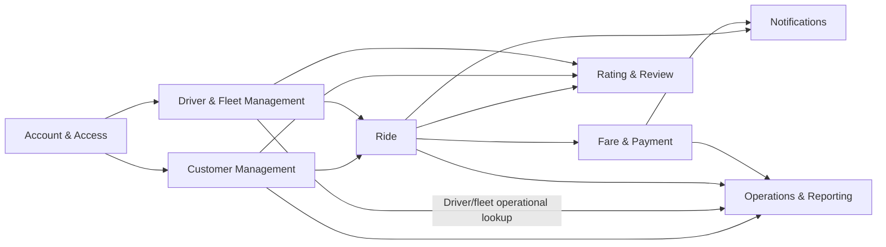

# Bounded Context — CAB System

## Cơ sở phân tích

Đối chiếu với `srs.md`: BP-01–BP-10, UC-01–UC-37, Domain Model mục 12 và baseline mục 18. Không thấy Use Case/Domain Model thành tệp riêng. Tài liệu này mô tả boundary nghiệp vụ, không quyết định kiến trúc API hay microservice. SRS 18.6 cho biết nhiều quyết định vẫn Proposed; `Confirmed` bên dưới chỉ có nghĩa boundary có cơ sở trong SRS hiện tại, không phải khách hàng đã phê duyệt.

## 6. Context Boundary Rationale

| Bounded Context | Trách nhiệm và lý do gom nghiệp vụ | Use Case |
|---|---|---|
| Account & Access | Quản lý Account dùng chung, đăng nhập và quyền theo role. Account có nguồn xác thực chung cho Customer/Driver và quy tắc số điện thoại đồng bộ, nên không thuộc riêng hồ sơ nào. | UC-01–02; phần Account trong UC-27 |
| Customer Management | Quản lý hồ sơ và vòng đời nghiệp vụ Customer. Tách với Driver vì quy tắc, hồ sơ và vai trò trong dịch vụ khác nhau. | UC-03, UC-23–26 |
| Driver & Fleet Management | Quản lý Driver, Vehicle, approval, availability và vị trí gần nhất. Đây là năng lực quản lý điều kiện nhận chuyến; Ride sử dụng các thông tin này để matching. | UC-04–06, UC-15, UC-27–34 |
| Ride | Quản lý TripRequest, matching/dispatch, assignment, trạng thái và theo dõi Trip. Booking/Dispatch cùng Trip vì BP-03–BP-06 mô tả một luồng nghiệp vụ xuyên suốt; ETA hiện hành thuộc Ride theo SRS 18.1. | UC-07–14, UC-16, UC-35 |
| Fare & Payment | Tính cước, xử lý phương thức thanh toán, giao dịch, retry và tra cứu. Fare, Pricing Rule, Payment và Transaction thuộc Fare & Payment. | UC-17–20, UC-36 |
| Notifications | Sở hữu và lưu Notification in-app, nội dung/type và persistent `isRead` từ baseline Trip/Payment events. Không sở hữu trạng thái Trip hoặc Payment. | UC-21 |
| Rating & Review | Ghi nhận đánh giá Customer dành cho Driver sau khi chuyến hoàn tất; đây là nghiệp vụ riêng với quy tắc đánh giá riêng. | UC-22 |
| Operations & Reporting | Hỗ trợ vận hành, tra cứu, theo dõi và can thiệp Trip theo quyền; quản trị Customer/Driver/Vehicle qua context sở hữu; sở hữu support note/audit và derived reporting projection trong Operations DB. Không sở hữu source business data. | UC-23–37 |

**Customer và Driver:** là hai context hồ sơ riêng. Account & Access là context hỗ trợ dùng chung vì SRS mô tả Account, đăng nhập, role và đồng bộ số điện thoại; nó không sở hữu hồ sơ Customer/Driver.

## 7. Context Separation

| Context A | Context B | Boundary Reason | Shared Concept? | Ownership |
|---|---|---|---|---|
| Account & Access | Customer Management | Danh tính/tài khoản khác với hồ sơ nghiệp vụ Customer. | Account identity | Account & Access sở hữu Account; Customer Management sở hữu Customer profile. |
| Account & Access | Driver & Fleet Management | Danh tính/tài khoản khác với hồ sơ nghiệp vụ Driver. | Account identity | Account & Access sở hữu Account; Driver & Fleet sở hữu Driver profile. |
| Customer Management | Driver & Fleet Management | Hồ sơ và quy tắc khác nhau; Driver có Vehicle, approval, availability. | Account identity | Mỗi context sở hữu hồ sơ tương ứng; Account thuộc Account & Access. |
| Customer Management | Ride | Customer đặt/xem chuyến; Ride quản lý request và Trip. | Customer reference | Customer sở hữu hồ sơ; Ride sở hữu TripRequest/Trip. |
| Driver & Fleet Management | Ride | Fleet quản lý điều kiện Driver; Ride dùng chúng để matching/dispatch. | Driver, VehicleType, latest location | Fleet sở hữu Driver/Fleet data; Ride sở hữu assignment/Trip. |
| Ride | Fare & Payment | Trip là căn cứ tính cước/thanh toán; Payment có lifecycle riêng. | Trip reference, Fare | Ride sở hữu Trip; Fare & Payment sở hữu Fare/Pricing Rule và Payment. |
| Ride | Notifications | Sự kiện Trip tạo nhu cầu thông báo. | Trip event/status | Ride sở hữu trạng thái; Notifications phụ trách gửi. |
| Fare & Payment | Notifications | Kết quả Payment được thông báo. | Payment outcome | Fare & Payment sở hữu Payment; Notifications phụ trách gửi. |
| Ride | Rating & Review | Hoàn tất Trip là điều kiện cho đánh giá. | Trip, Customer/Driver reference | Ride sở hữu Trip; Rating & Review sở hữu Rating. |
| Các context nghiệp vụ | Operations & Reporting | Vận hành xem/tra cứu dữ liệu nguồn và thực hiện thao tác được phân quyền. | Customer, Driver, Vehicle, Trip, Payment | Context nghiệp vụ giữ dữ liệu gốc; Operations sở hữu support note/audit, không sở hữu dữ liệu gốc. |

## 8. Context Map (domain)

Các mũi tên biểu thị dependency nghiệp vụ được Use Case/SRS hỗ trợ, không biểu thị hướng gọi hoặc công nghệ tích hợp.

## 9. Context Relationship Table

| Upstream Context | Downstream Context | Business Interaction | Relationship Type | Shared Data/Concept |
|---|---|---|---|---|
| Account & Access | Customer Management | Đăng ký/xác thực tài khoản gắn với hồ sơ Customer | Chưa xác định ở giai đoạn này | Account identity |
| Account & Access | Driver & Fleet Management | Tạo/xác thực Account liên kết hồ sơ Driver | Chưa xác định ở giai đoạn này | Account identity |
| Customer Management | Ride | Customer tạo yêu cầu và xem chuyến | Chưa xác định ở giai đoạn này | Customer reference |
| Driver & Fleet Management | Ride | Cung cấp điều kiện Driver/Vehicle và vị trí cho matching | Chưa xác định ở giai đoạn này | Driver, VehicleType, latest location |
| Ride | Fare & Payment | Cung cấp Trip làm căn cứ tính cước và thanh toán | Chưa xác định ở giai đoạn này | Trip reference, Fare |
| Ride | Notifications | Sự kiện request/assignment/status cần được thông báo | Chưa xác định ở giai đoạn này | Trip event/status |
| Fare & Payment | Notifications | Kết quả thanh toán cần được thông báo | Chưa xác định ở giai đoạn này | Payment outcome |
| Ride | Rating & Review | Trip hoàn tất cho phép đánh giá | Chưa xác định ở giai đoạn này | Trip status, Driver reference |
| Customer Management | Rating & Review | Xác định Customer gửi đánh giá | Chưa xác định ở giai đoạn này | Customer reference |
| Driver & Fleet Management | Rating & Review | Xác định Driver được đánh giá | Chưa xác định ở giai đoạn này | Driver reference |
| Customer Management | Operations & Reporting | Nhân viên quản lý/tra cứu hồ sơ Customer | Chưa xác định ở giai đoạn này | Customer |
| Driver & Fleet Management | Operations & Reporting | Nhân viên quản lý/tra cứu Driver và Vehicle | Chưa xác định ở giai đoạn này | Driver, Vehicle |
| Ride | Operations & Reporting | Theo dõi, hỗ trợ và can thiệp Trip theo quyền | Chưa xác định ở giai đoạn này | Trip/status |
| Fare & Payment | Operations & Reporting | Nhân viên tra cứu giao dịch | Chưa xác định ở giai đoạn này | Payment/transaction |

SRS chưa đủ thông tin để phân loại quan hệ thành Customer/Supplier, Conformist, Partnership, ACL, Open Host Service hoặc Published Language.

## 10. Data Ownership Matrix

| Business Data | Owning Context | Other Contexts Need It? | Ownership Rule |
|---|---|---|---|
| Account, authentication and role data | Account & Access | Customer, Driver & Fleet, Operations | Account dùng chung; PhoneNumber là nguồn xác thực và phải đồng bộ với hồ sơ theo SRS 12.3.9. |
| Customer profile | Customer Management | Ride, Fare & Payment, Rating, Operations | Một owner; context khác chỉ tham chiếu. |
| Driver profile, approval, availability | Driver & Fleet Management | Ride, Rating, Operations | Một owner; Ride sử dụng eligibility. |
| Vehicle | Driver & Fleet Management | Ride, Operations | Hồ sơ phương tiện thuộc nghiệp vụ quản lý Driver/Fleet. |
| VehicleType | Driver & Fleet Management | Ride, Fare & Payment | Driver & Fleet owns VehicleType; other contexts use a reference. |
| Pricing Rule / pricing data | Fare & Payment | Ride, Operations | Fare & Payment owns Pricing Rule and canonical pricing/fare calculation. |
| TripRequest, DriverAssignment, Trip/status | Ride | Customer, Fleet, Fare & Payment, Notifications, Rating, Operations | Ride sở hữu lifecycle request/assignment/Trip. |
| Latest DriverLocation | Driver & Fleet Management | Ride, Customer, Operations | SRS 18.1 giao Fleet sở hữu vị trí mới nhất; không lưu lịch sử tuyến. |
| Current Trip ETA | Ride | Customer, Operations | SRS 18.1 giao Ride sở hữu ETA hiện hành. |
| Fare/calculation result, Pricing Rule | Fare & Payment | Ride, Operations | Fare & Payment sở hữu Fare, Pricing Rule và tính/finalize Fare; consumer chỉ tham chiếu. |
| Payment/transaction/retry/provider reference | Fare & Payment | Notifications, Operations | Một owner; kết quả theo provider reference được xử lý idempotent (SRS 18.5). |
| Notification, content/type và `isRead` | Notifications | Customer, Driver | Persistent in-app record; `recipientAccountId` references Identity & Access Account and Trip ID references Ride; both are references, not cross-service FKs. Delivery retry/retention tuning remains implementation detail. |
| Rating/comment | Rating & Review | Customer, Driver, Operations | Rating gắn với Trip hoàn tất; Rating có một owner. |
| Support note/intervention audit | Operations & Reporting | Ride tham chiếu Trip | SRS 18.2–18.4 quy định note/audit; Operations sở hữu bản ghi hỗ trợ/audit. |
| Dữ liệu báo cáo dẫn xuất | Operations & Reporting | Leadership/Operations | Aggregate `ReportingView` projection in Operations PostgreSQL; source facts remain with Ride, Fare & Payment and Driver & Fleet. |

## 11. Transaction Boundary

| Transaction | Context | Main Business Operation | Consistency Requirement |
|---|---|---|---|
| Tạo TripRequest | Ride | Ghi nhận yêu cầu và bắt đầu matching | Chưa xác định ở giai đoạn này |
| Driver phản hồi assignment | Ride | Nhận/từ chối; tiếp tục tìm tài xế khi từ chối/hết 60 giây | Chưa xác định ở giai đoạn này |
| Cập nhật Trip status | Ride | Chuyển trạng thái theo luồng nghiệp vụ hoặc can thiệp được phép | Chưa xác định ở giai đoạn này |
| Cập nhật vị trí mới nhất | Driver & Fleet Management | Lưu vị trí và thời điểm cập nhật | Chưa xác định ở giai đoạn này |
| Cập nhật ETA | Ride | Cập nhật ETA; giữ ETA cũ và đánh dấu stale khi routing lỗi | Chưa xác định ở giai đoạn này |
| Ghi nhận Payment | Fare & Payment | Ghi kết quả và ngăn tác động trùng theo provider reference | SRS 18.5 yêu cầu idempotency; chưa quy định consistency/ranh giới commit. |
| Ghi Rating | Rating & Review | Lưu đánh giá hợp lệ sau khi Trip hoàn tất | Chưa xác định ở giai đoạn này |
| Ghi Notification/read state | Notifications | Persist notification and recipient read state | Local PostgreSQL transaction; baseline Kafka ingestion is at-least-once and deduplicated by eventId. Notification failure does not roll back Trip/Payment. |

SRS chưa đủ căn cứ để phân loại strong consistency hoặc eventual consistency cho các transaction trên. Idempotency và yêu cầu không làm mất TripRequest không tự xác định consistency giữa context.

## 12. Context Validation

| Context | Responsibility riêng | Thuật ngữ riêng | Data ownership | Business rules | Use Case | Boundary |
|---|---|---|---|---|---|---|
| Account & Access | PASS | PASS — Account/login/role | PASS | PASS — đăng nhập, role, unique phone | PASS — UC-01–02 | PASS |
| Customer Management | PASS | PASS — Customer/profile | PASS | PASS | PASS — UC-03, 23–26 | PASS |
| Driver & Fleet Management | PASS | PASS — approval/availability/location/VehicleType | PASS — VehicleType owner is Driver & Fleet; Pricing Rule belongs to Fare & Payment | PASS | PASS — UC-04–06, 15, 27–34 | PASS |
| Ride | PASS | PASS — Request/Assignment/Trip/ETA | PASS — trừ Fare | PASS | PASS — UC-07–14, 16, 35 | PASS |
| Fare & Payment | PASS | PASS — Fare/Pricing Rule/Payment/retry | PASS — Fare/Pricing Rule owner xác định | PASS | PASS — UC-17–20, 36 | PASS |
| Notifications | PASS | PASS — Notification/event/persistent `isRead` | PASS — QRY-NOT-001 listing/read state | OPEN — delivery retry/retention tuning | PASS — UC-21 | PASS |
| Rating & Review | PASS | PASS — Rating/comment | PASS | PASS | PASS — UC-22 | PASS |
| Operations & Reporting | PASS | PASS — support/audit/reporting projection | PASS — Operations-owned `ReportingView`; source ownership retained | PASS — quyền Staff/Supervisor | PASS — UC-23–37 | PASS |

## 13. Final Bounded Context List

| # | Bounded Context | Classification | Main Responsibility | Owned Data | Status |
|---:|---|---|---|---|---|
| 1 | Account & Access | Supporting | Quản lý Account, đăng nhập và quyền | Account, authentication, role | Confirmed |
| 2 | Customer Management | Supporting | Quản lý hồ sơ Customer | Customer profile | Confirmed |
| 3 | Driver & Fleet Management | Supporting | Quản lý Driver, Vehicle, eligibility và vị trí mới nhất | Driver, Vehicle, approval, availability, latest location | Confirmed |
| 4 | Ride | Core | Đặt/dispatch, thực hiện và theo dõi chuyến | TripRequest, DriverAssignment, Trip, ETA | Confirmed |
| 5 | Fare & Payment | Supporting | Tính cước và xử lý giao dịch | Fare, Pricing Rule, Payment, Transaction | Confirmed |
| 6 | Notifications | Supporting | Create/persist/list/mark-read in-app notification | Notification, type/content, persistent read state | Confirmed |
| 7 | Rating & Review | Supporting | Ghi nhận đánh giá sau Trip | Rating/comment | Confirmed |
| 8 | Operations & Reporting | Supporting | Hỗ trợ vận hành, can thiệp có quyền, audit, owned reporting projection | Support note/audit, aggregate ReportingView (derived only) | Confirmed |

Classification mô tả vai trò nghiệp vụ, không phải quyết định tách service.

## 14. Consistency Check

| Issue | Affected Artifact | Current State | Recommended Adjustment | Severity |
|---|---|---|---|---|
| Account/profile coordination | SRS mục 12, 18; Domain Model | Account dùng chung và đồng bộ PhoneNumber với hồ sơ Customer/Driver | Giữ Account tại Account & Access; làm rõ business interaction tạo/cập nhật hồ sơ | Medium |
| Fare and VehicleType ownership | 03–07 service architecture decisions | Fare/Pricing Rule → Fare & Payment; VehicleType → Driver & Fleet | Preserve the assigned owners | Resolved |
| Notification read/list capability | SRS 12.3.12/UC-21, SC-15 | Persistent `isRead` and recipient-scoped QRY-NOT-001 finalized; retry/retention tuning remains implementation detail | Preserve Notification ownership and no cross-service FK | Resolved |
| Reporting projection ownership | SRS UC-37/BR-14, SC-20 | Operations owns derived `ReportingView`; source data remains with owners; QRY-OPS-005 formulas/refresh defined | Do not treat the projection as source business data | Resolved |
| Trạng thái phê duyệt baseline | SRS mục 18.6 | Các quyết định mới ghi Proposed, chưa có bằng chứng xác nhận | Không xem Proposed là Approved; cập nhật khi có bằng chứng trong Decision Log | Medium |

Không có bằng chứng trong SRS rằng context đọc trực tiếp database của context khác. Bảng trên không sửa SRS/Domain Model; các dòng là điểm cần thống nhất ở bước sau.

## 15. Handoff to Next Stage

- Tám bounded context được chuyển sang service decomposition; Fare/Pricing Rule ownership đã được xác định là Fare & Payment.
- Giữ một owner cho từng dữ liệu: Fare/Pricing Rule/Payment/Transaction thuộc Fare & Payment; VehicleType thuộc Driver & Fleet; Notification persistence thuộc Notifications; reporting projection thuộc Operations while source facts remain owner-owned.
- Thiết kế tiếp dependency nghiệp vụ Customer/Fleet → Ride; Ride → Fare & Payment, Notifications, Rating; các context nguồn → Operations.
- Contract/protocol flows are defined in 04–06: owner queries/commands use synchronous REST, baseline notifications use Kafka, and `CMD-OPS-002` is finalized. Lower-level payload constraints and implementation tuning remain in their owning documents.

## Kiểm tra cuối

- Mỗi UC-01–UC-37 có owner theo nghiệp vụ chính: UC-01–02 Account & Access; UC-03 Customer; UC-04–06/15/27–34 Driver & Fleet; UC-07–14/16/35 Ride; UC-17–20/36 Fare & Payment; UC-21 Notifications; UC-22 Rating; UC-23–37 Operations cho tác vụ vận hành. Dữ liệu hồ sơ/giao dịch vẫn thuộc context nghiệp vụ tương ứng.
- Customer và Driver không bị gộp; Account thuộc Account & Access theo trách nhiệm quản lý đăng nhập/tài khoản trong SRS.
- Booking/Dispatch/Trip/Tracking thuộc Ride; vị trí gần nhất thuộc Driver & Fleet; ETA thuộc Ride theo SRS 18.1.
- Không tạo context chỉ vì entity/table; không gán nhiều owner cho cùng một dữ liệu.
- Không có dependency database trực tiếp nào được giả định.
