# 03 System Architecture — CAB System

## 1. Purpose

Tài liệu này phân rã 8 Bounded Context hiện có thành các Candidate Services ở mức logical design. Đây là đầu vào để xác định service boundary trước khi thiết kế contract hoặc kiến trúc triển khai.

```text
Bounded Context → Candidate Services → Service Contract → Implementation
```

- **Bounded Context** xác định business boundary, thuật ngữ và quyền sở hữu dữ liệu nghiệp vụ.
- **Candidate Service** là ranh giới dịch vụ ứng viên, được nhóm theo trách nhiệm, ownership và cohesion.
- **Service** là deployment/technical boundary có thể được quyết định độc lập với business boundary.
- Một BC có thể chứa một hoặc nhiều service; mỗi BC được đánh giá riêng và chỉ tách khi có bằng chứng về trách nhiệm, transaction, ownership hoặc use case đủ độc lập.
- Không tách service chỉ vì có nhiều entity.

Tài liệu chỉ xác định candidate boundary và dependency ở mức khái niệm. Đây chưa phải Service Contract và chưa xác định API, database schema, protocol hoặc kiến trúc triển khai cuối cùng.

## 2. Decomposition Principles

1. **Single Business Responsibility** — Mỗi service tập trung vào một nhóm trách nhiệm nghiệp vụ liên quan và đã có trong BC nguồn.
2. **Data Ownership** — Business data có đúng một owner. Service khác chỉ tham chiếu hoặc tiêu thụ dữ liệu đó.
3. **High Cohesion** — Đặt các operation cùng phục vụ một business capability và cùng vòng đời nghiệp vụ trong một service.
4. **Low Coupling** — Chỉ phụ thuộc dữ liệu hoặc hành động cần thiết từ service khác; ưu tiên business reference khi đủ.
5. **Transaction Boundary** — Nghiệp vụ cần tính nhất quán đồng bộ thuộc một service khi ownership nguồn cho phép. Ranh giới liên service cần được nhận diện, không giả định transaction phân tán.
6. **Independent Deployment** — Chọn boundary sao cho có thể triển khai độc lập về mặt logical design. Khả năng triển khai thực tế còn phụ thuộc contract và kiến trúc sau này.
7. **Security Boundary** — Giữ authentication và authorization trong Identity & Access; service nghiệp vụ chỉ chịu trách nhiệm dữ liệu và quy tắc thuộc BC của mình.
8. **Scalability Boundary** — Tách chỉ khi trách nhiệm hoặc nhu cầu mở rộng độc lập có căn cứ. Nguồn hiện tại không cung cấp tải hoặc yêu cầu hiệu năng để khẳng định nhu cầu tách.
9. **Avoid Distributed Monolith** — Không chia một vòng đời nghiệp vụ gắn chặt thành nhiều service khiến mọi thao tác cần phối hợp đồng bộ.
10. **Avoid Shared Database** — Mỗi service sở hữu dữ liệu nghiệp vụ của mình; không có service nào trực tiếp ghi dữ liệu thuộc service khác.

## 3. Bounded Context → Candidate Services

Mỗi BC được đánh giá theo responsibility, data ownership, transaction boundary, UC ownership, business dependency, coupling, cohesion, security, scalability và deployment boundary. Mỗi BC có một Candidate Service trong lần phân rã này: nguồn mô tả responsibility/ownership thống nhất và chưa xác định transaction hoặc use case độc lập bên trong BC đủ mạnh để biện minh cho việc tách. Đây không phải quy tắc một BC luôn bằng một service.

| Bounded Context           | Candidate Service                 | Responsibility                                                                              | Owned Data                                                                                                 | Related Use Cases                                                                     | Decomposition Reason                                                                                                                                                        |
| ------------------------- | --------------------------------- | ------------------------------------------------------------------------------------------- | ---------------------------------------------------------------------------------------------------------- | ------------------------------------------------------------------------------------- | --------------------------------------------------------------------------------------------------------------------------------------------------------------------------- |
| Identity & Access         | Identity & Access Service         | Account, authentication, authorization, role và trạng thái account liên quan authentication | Account, authentication credentials/information, Role, account status                                      | UC-01, UC-04; use case đăng nhập/xác thực và authorization không có mã UC trong nguồn | Giữ cùng nhau: một boundary bảo mật và identity; nguồn không nêu ownership/use case riêng cho phần nhỏ hơn.                                                                 |
| Customer Management       | Customer Management Service       | Hồ sơ và vòng đời nghiệp vụ Customer                                                        | Customer, Customer Profile, Customer Status                                                                | UC-01–UC-03, UC-23–UC-26                                                              | Giữ cùng nhau: dữ liệu cùng mô tả hồ sơ/trạng thái Customer; không có capability độc lập để tách.                                                                           |
| Driver & Fleet Management | Driver & Fleet Management Service | Driver, Vehicle, VehicleType, approval, availability, location và eligibility               | Driver, Driver Profile, Vehicle, VehicleType, Driver Approval, Driver Availability, Latest Driver Location | UC-04–UC-06, UC-15, UC-27–UC-34                                                       | Giữ cùng nhau: approval, điều kiện nhận chuyến và quan hệ Driver–Vehicle cùng hỗ trợ eligibility; tách location/approval không có ownership/use case độc lập được xác định. |
| Ride                      | Ride Service                      | TripRequest, matching/dispatch, DriverAssignment, Trip lifecycle và ETA                     | TripRequest, DriverAssignment, Trip, Trip Status, Current Trip ETA                                         | UC-07–UC-14, UC-16, UC-35                                                             | Giữ cùng nhau: request, assignment và lifecycle là một vòng đời chuyến; tách sẽ tăng phối hợp mà nguồn không chỉ ra boundary riêng.                                         |
| Fare & Payment            | Fare & Payment Service            | Pricing, finalized fare, payment, transaction, retry và kết quả provider                    | Fare, Pricing Rule, Payment, Transaction, Payment Method, Provider Reference, Payment Status               | UC-17–UC-20, UC-36                                                                    | Giữ cùng nhau: fare và payment có ownership chung trong BC; chưa có căn cứ transaction/use case để tách.                                                                    |
| Notifications             | Notifications Service             | Tạo/gửi Notification và quản lý delivery state                                              | Notification, Notification Type, Recipient Reference, Delivery State                                       | UC-21                                                                                 | Giữ một service: trách nhiệm thông báo thống nhất; nguồn không chỉ ra boundary delivery độc lập.                                                                            |
| Rating & Review           | Rating & Review Service           | Kiểm tra điều kiện và lưu đánh giá Trip/Driver                                              | Rating, Rating Value, Comment, Review                                                                      | UC-22                                                                                 | Giữ một service: Rating và Review cùng capability sau Trip hoàn thành; không có lý do ownership để tách.                                                                    |
| Operations & Reporting    | Operations & Reporting Service    | Hỗ trợ, can thiệp có kiểm soát, audit và operational reporting                              | Support Note, Intervention Record, Audit Record, Operational View, Reporting View (derived projection)     | UC-23–UC-37 theo ownership được liệt kê trong nguồn                                   | Operations owns its reporting projection; source data remains with owner services. No source business data is transferred. |

## 4. Candidate Service Definitions

### 4.1 Identity & Access Service

#### Responsibility

Quản lý Account, authentication, đăng nhập, access token, role, authorization và trạng thái tài khoản liên quan authentication.

#### Owned Data

Account, authentication credentials/information, Role, account status.

#### Related Bounded Context

Identity & Access.

#### Related Use Cases

UC-01, UC-04 và các use case đăng nhập/xác thực/authorization được nêu nhưng không có mã UC cụ thể trong nguồn.

#### Business Rules

- Account thuộc Identity & Access, không thuộc Customer Management hoặc Driver & Fleet Management.
- Identity & Access quản lý danh tính tài khoản, không quản lý hồ sơ nghiệp vụ Customer hoặc Driver.

#### Boundary

Sở hữu Account, thông tin xác thực, Role và thông tin authentication. Không sở hữu Customer Profile, Driver Profile, Trip hoặc Payment.

#### Internal Operations

Đăng ký account; xác thực/đăng nhập; cấp và xác thực access token; quản lý role và kiểm soát quyền; quản lý trạng thái account liên quan authentication.

#### Dependencies

- Customer Management để tạo/liên kết hồ sơ Customer sau khi account được đăng ký.
- Driver & Fleet Management để tạo/liên kết hồ sơ Driver sau khi account được đăng ký.
- Cách trao đổi chưa được nguồn xác định.

### 4.2 Customer Management Service

#### Responsibility

Quản lý hồ sơ, thông tin và trạng thái nghiệp vụ Customer trong vòng đời sử dụng dịch vụ.

#### Owned Data

Customer, Customer Profile, Customer Status.

#### Related Bounded Context

Customer Management.

#### Related Use Cases

UC-01–UC-03, UC-23–UC-26 theo danh sách ownership của BC trong nguồn.

#### Business Rules

- Customer Management sở hữu Customer Profile, không sở hữu Account.
- Không sở hữu Trip, Payment, Driver hoặc phương tiện.
- Các nghiệp vụ khác tham chiếu thông tin Customer.

#### Boundary

Sở hữu hồ sơ và trạng thái Customer. Không sở hữu Account, Driver, Trip, Payment hoặc Vehicle.

#### Internal Operations

Tạo hồ sơ Customer sau đăng ký account; cập nhật và tra cứu hồ sơ; quản lý trạng thái nghiệp vụ; cung cấp thông tin Customer để tham chiếu.

#### Dependencies

- Identity & Access liên kết danh tính Account.
- Ride tham chiếu Customer khi tạo/theo dõi yêu cầu chuyến.
- Rating & Review tham chiếu Customer khi xác định người gửi đánh giá.
- Operations & Reporting đọc thông tin Customer phục vụ vận hành.

### 4.3 Driver & Fleet Management Service

#### Responsibility

Quản lý Driver, Vehicle, VehicleType, hồ sơ/trạng thái phê duyệt, availability, latest location, eligibility và quan hệ Driver–Vehicle.

#### Owned Data

Driver, Driver Profile, Vehicle, VehicleType, Driver Approval, Driver Availability, Latest Driver Location.

#### Related Bounded Context

Driver & Fleet Management.

#### Related Use Cases

UC-04–UC-06, UC-15, UC-27–UC-34.

#### Business Rules

- Driver & Fleet Management sở hữu Driver và Vehicle; không sở hữu authentication credentials.
- Cung cấp eligibility và thông tin cần thiết cho matching.
- Ride quyết định DriverAssignment và Trip lifecycle; Ride không sở hữu hồ sơ Driver hoặc Vehicle.

#### Boundary

Sở hữu hồ sơ Driver/Vehicle, approval, availability và latest location. Không sở hữu Account credentials, DriverAssignment, Trip, Fare hoặc Payment.

#### Internal Operations

Quản lý hồ sơ Driver/Vehicle/VehicleType; xử lý approval; cập nhật Online/Offline và availability; cập nhật vị trí hiện tại; xác định eligibility; quản lý quan hệ Driver–Vehicle.

#### Dependencies

- Identity & Access liên kết Account identity.
- Ride cần Driver, Vehicle, eligibility và latest location cho matching; assignment do Ride sở hữu.
- Rating & Review tham chiếu Driver khi tạo đánh giá.
- Operations & Reporting đọc thông tin Driver/Vehicle phục vụ vận hành.

### 4.4 Ride Service

#### Responsibility

Quản lý vòng đời từ TripRequest, tìm tài xế, matching/dispatch, DriverAssignment đến trạng thái Trip, ETA, hủy và hoàn thành.

#### Owned Data

TripRequest, DriverAssignment, Trip, Trip Status, Current Trip ETA.

#### Related Bounded Context

Ride.

#### Related Use Cases

UC-07–UC-14, UC-16, UC-35.

#### Business Rules

- Ride sở hữu TripRequest, DriverAssignment, Trip, Trip Status và ETA.
- Ride quyết định DriverAssignment và Trip lifecycle.
- Chuyến hoàn thành có thể được dùng làm điều kiện tạo Rating.
- Lifecycle nguồn nêu: REQUESTED, SEARCHING_DRIVER, DRIVER_ASSIGNED, DRIVER_ARRIVING, IN_PROGRESS, COMPLETED; có thể kết thúc bằng CANCELED.

#### Boundary

Sở hữu dữ liệu chuyến và ETA. Không sở hữu hồ sơ Customer/Driver, Vehicle, Payment, Rating hoặc Notification.

#### Internal Operations

Tiếp nhận TripRequest; tìm/chọn Driver phù hợp; ghi nhận assignment; cập nhật trạng thái và ETA; xử lý hủy; xác định hoàn thành chuyến.

#### Dependencies

- Customer Management cung cấp Customer reference.
- Driver & Fleet Management cung cấp thông tin matching; assignment thuộc Ride.
- Fare & Payment nhận Trip đã hoàn tất để tính fare/thanh toán.
- Notifications nhận sự kiện Trip cần thông báo.
- Rating & Review dùng Trip hoàn thành để kiểm tra điều kiện.
- Operations & Reporting đọc thông tin Trip phục vụ vận hành.

### 4.5 Fare & Payment Service

#### Responsibility

Tính fare, áp dụng pricing rule và quản lý payment transaction, trạng thái, retry, kết quả provider và provider reference.

#### Owned Data

Fare, Pricing Rule, Payment, Transaction, Payment Method, Provider Reference, Payment Status.

#### Related Bounded Context

Fare & Payment.

#### Related Use Cases

UC-17–UC-20, UC-36.

#### Business Rules

- Fare & Payment sở hữu Fare, Pricing Rule, Payment và Transaction.
- Ride cung cấp Trip information; Payment không sở hữu Trip.
- Một giao dịch không bị xử lý lặp.

#### Boundary

Sở hữu fare và dữ liệu payment. Không sở hữu Trip, Customer Profile hoặc Driver Profile.

#### Internal Operations

Tính giá; áp dụng pricing rule; xác định finalized fare; tạo/theo dõi payment transaction; xử lý retry và kết quả provider; tránh xử lý lặp.

#### Dependencies

- Ride cung cấp Trip information/finalized Trip data.
- Notifications nhận payment outcome để gửi thông báo.
- Operations & Reporting đọc thông tin Payment phục vụ vận hành.

### 4.6 Notifications Service

#### Responsibility

Tạo và gửi thông báo cho Customer/Driver theo business event; quản lý notification type và delivery state, gồm in-app notification.

#### Owned Data

Notification, Notification Type, Recipient Reference, persistent read state (`isRead`), Delivery State.

#### Related Bounded Context

Notifications.

#### Related Use Cases

UC-21.

#### Business Rules

- Notifications owns persisted Notification, content/type, recipient reference and read state.
- Không quyết định Trip Status, không sở hữu Trip, Payment, Customer hoặc Driver.

#### Boundary

Sở hữu persisted Notification records and read/delivery state. Cross-service recipient and Trip identifiers are references only.

#### Internal Operations

Tiếp nhận thông tin sự kiện; tạo notification; gửi đến recipient; cập nhật delivery state; quản lý in-app notification.

#### Dependencies

- Ride cung cấp Trip event.
- Fare & Payment cung cấp Payment outcome.
- Customer và Driver là recipient reference, không phải dữ liệu sở hữu của service này.

### 4.7 Rating & Review Service

#### Responsibility

Kiểm tra điều kiện đánh giá và lưu Rating/Comment gắn với Trip, Customer và Driver reference.

#### Owned Data

Rating, Rating Value, Comment, Review.

#### Related Bounded Context

Rating & Review.

#### Related Use Cases

UC-22.

#### Business Rules

- Chỉ tạo Rating cho Trip đã hoàn thành.
- Rating & Review sở hữu Rating/Review, không sở hữu Trip hoặc Driver Profile.

#### Boundary

Sở hữu Rating, Rating Value, Comment và Review. Trip, Customer, Driver và Trip Status được tham chiếu từ context sở hữu.

#### Internal Operations

Kiểm tra điều kiện đánh giá; tạo Rating; lưu số sao và Comment; liên kết rating tới Trip, Customer và Driver reference.

#### Dependencies

- Ride cung cấp Trip/Trip Status để kiểm tra hoàn thành.
- Customer Management cung cấp Customer reference.
- Driver & Fleet Management cung cấp Driver reference.

### 4.8 Operations & Reporting Service

#### Responsibility

Tra cứu vận hành, hỗ trợ Customer/Driver, theo dõi Trip, thực hiện can thiệp được phép, ghi lý do/audit và cung cấp activity/operational reporting view.

#### Owned Data

Support Note, Intervention Record, Audit Record, Operational View, aggregate ReportingView projection.

#### Related Bounded Context

Operations & Reporting.

#### Related Use Cases

UC-23–UC-37, cùng các UC chia sẻ ownership với Customer Management, Driver & Fleet Management, Ride hoặc Fare & Payment theo bảng nguồn.

#### Business Rules

- Operations & Reporting không sở hữu dữ liệu nghiệp vụ gốc của context khác; projection is derived and locally owned.
- Ghi nhận lý do can thiệp và audit theo trách nhiệm BC.
- Chỉ dùng business reference hoặc dữ liệu phục vụ vận hành/báo cáo.

#### Boundary

Sở hữu Support Note, Intervention Record, Audit Record và view vận hành/báo cáo. Không sở hữu Customer, Driver, Vehicle, Trip, Payment hoặc Rating.

#### Internal Operations

Tra cứu dữ liệu vận hành; hỗ trợ người dùng; theo dõi Trip; thực hiện can thiệp được phép và ghi lý do; ghi audit; cung cấp activity view và operational report.

#### Dependencies

Đọc dữ liệu/reference từ Customer Management, Driver & Fleet Management, Ride và Fare & Payment. Ownership nguồn vẫn ở các service tương ứng.

## 5. Service Dependency Analysis

Các dependency là logical business dependencies. Kiểu đồng bộ/bất đồng bộ dưới đây chỉ là phân loại ứng viên; nguồn không xác định cơ chế trao đổi cụ thể.

| Source Service            | Target Service            | Business Dependency                         | Required Data                                               | Dependency Type                                                                      |
| ------------------------- | ------------------------- | ------------------------------------------- | ----------------------------------------------------------- | ------------------------------------------------------------------------------------ |
| Identity & Access         | Customer Management       | Liên kết đăng ký Account với hồ sơ Customer | Account identity/reference                                  | Synchronous candidate; kết quả liên kết cần thiết trong luồng đăng ký, cần xác nhận. |
| Identity & Access         | Driver & Fleet Management | Liên kết Account với hồ sơ Driver           | Account identity/reference                                  | Synchronous candidate; chi tiết phối hợp chưa được nguồn xác định.                   |
| Customer Management       | Ride                      | Khách hàng tạo/theo dõi yêu cầu chuyến      | Customer reference                                          | Query/reference; cách lấy chưa xác định.                                             |
| Driver & Fleet Management | Ride                      | Cung cấp ứng viên cho matching              | Driver, Vehicle, eligibility, availability, latest location | Query/reference; quyết định assignment thuộc Ride.                                   |
| Ride                      | Fare & Payment            | Cung cấp Trip để tính fare và payment       | Trip information, finalized Trip data                       | Synchronous REST baseline CMD-RID-004 / CMD-FP-001/002; EVT-FP-002 remains inactive candidate. |
| Ride                      | Notifications             | Thông báo sự kiện Trip                      | Trip event, recipient Account reference                      | Baseline Kafka EVT-RID-001/002/003.                                                   |
| Fare & Payment            | Notifications             | Thông báo payment outcome                   | Payment outcome, recipient Account reference                | Baseline Kafka EVT-FP-001.                                                           |
| Ride                      | Rating & Review           | Xác định Trip đã hoàn thành                 | Trip reference, Trip Status                                 | Synchronous REST query QRY-RID-001.                                                  |
| Customer Management       | Rating & Review           | Xác định người gửi Rating                   | Customer reference                                          | Query/reference; chưa quyết định.                                                    |
| Driver & Fleet Management | Rating & Review           | Xác định Driver được đánh giá               | Driver reference                                            | Query/reference; chưa quyết định.                                                    |
| Customer Management       | Operations & Reporting    | Tra cứu Customer phục vụ vận hành           | Customer operational data/reference                         | Query/read; không chuyển ownership.                                                  |
| Driver & Fleet Management | Operations & Reporting    | Tra cứu Driver/Vehicle phục vụ vận hành     | Driver/Vehicle operational data/reference                   | Query/read; không chuyển ownership.                                                  |
| Ride                      | Operations & Reporting    | Theo dõi Trip phục vụ vận hành              | Trip operational data/reference                             | Query/read; không chuyển ownership.                                                  |
| Fare & Payment            | Operations & Reporting    | Tra cứu Payment phục vụ vận hành            | Payment operational data/reference                          | Query/read; không chuyển ownership.                                                  |

## 6. Service Dependency Diagram

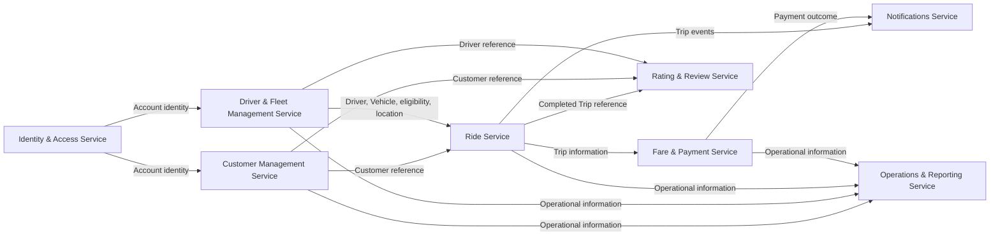

Diagram này thể hiện service dependency ở mức logical design, không phải API call sequence.

## 7. Service Data Ownership

| Service                           | Owned Data                                                                                                 | Source Bounded Context    |
| --------------------------------- | ---------------------------------------------------------------------------------------------------------- | ------------------------- |
| Identity & Access Service         | Account, Authentication Credentials/Information, Role, Account Status                                      | Identity & Access         |
| Customer Management Service       | Customer, Customer Profile, Customer Status                                                                | Customer Management       |
| Driver & Fleet Management Service | Driver, Driver Profile, Vehicle, VehicleType, Driver Approval, Driver Availability, Latest Driver Location | Driver & Fleet Management |
| Ride Service                      | TripRequest, DriverAssignment, Trip, Trip Status, Current Trip ETA                                         | Ride                      |
| Fare & Payment Service            | Fare, Pricing Rule, Payment, Transaction, Payment Method, Provider Reference, Payment Status               | Fare & Payment            |
| Notifications Service             | Notification, Notification Type, Recipient Reference, Delivery State                                       | Notifications             |
| Rating & Review Service           | Rating, Rating Value, Comment, Review                                                                      | Rating & Review           |
| Operations & Reporting Service    | Support Note, Intervention Record, Audit Record, Operational View, Reporting View                          | Operations & Reporting    |

**Invariant:** Mỗi business data chỉ có một owner. Service khác dùng reference/query hoặc dữ liệu cần thiết; không trở thành owner dữ liệu nguồn.

## 8. Service → Use Case Mapping

Nguồn có mã UC và BC ownership nhưng không có tên/mô tả chi tiết từng UC. Primary Service dưới đây được chọn theo responsibility/ownership của BC; với UC nhiều BC, primary/supporting là quyết định logical cần xác nhận khi có use case detail.

| Use Case | Primary Service                   | Supporting Service(s)                                                        | Bounded Context                                    |
| -------- | --------------------------------- | ---------------------------------------------------------------------------- | -------------------------------------------------- |
| UC-01    | Identity & Access Service         | Customer Management Service                                                  | Identity & Access / Customer Management            |
| UC-02    | Customer Management Service       | —                                                                            | Customer Management                                |
| UC-03    | Customer Management Service       | —                                                                            | Customer Management                                |
| UC-04    | Driver & Fleet Management Service | Identity & Access Service                                                    | Identity & Access / Driver & Fleet Management      |
| UC-05    | Driver & Fleet Management Service | —                                                                            | Driver & Fleet Management                          |
| UC-06    | Driver & Fleet Management Service | —                                                                            | Driver & Fleet Management                          |
| UC-07    | Ride Service                      | Customer Management Service                                                  | Ride                                               |
| UC-08    | Ride Service                      | Driver & Fleet Management Service                                            | Ride                                               |
| UC-09    | Ride Service                      | Driver & Fleet Management Service                                            | Ride                                               |
| UC-10    | Ride Service                      | Driver & Fleet Management Service                                            | Ride                                               |
| UC-11    | Ride Service                      | —                                                                            | Ride                                               |
| UC-12    | Ride Service                      | —                                                                            | Ride                                               |
| UC-13    | Ride Service                      | —                                                                            | Ride                                               |
| UC-14    | Ride Service                      | —                                                                            | Ride                                               |
| UC-15    | Driver & Fleet Management Service | —                                                                            | Driver & Fleet Management                          |
| UC-16    | Ride Service                      | —                                                                            | Ride                                               |
| UC-17    | Fare & Payment Service            | Ride Service                                                                 | Fare & Payment                                     |
| UC-18    | Fare & Payment Service            | —                                                                            | Fare & Payment                                     |
| UC-19    | Fare & Payment Service            | —                                                                            | Fare & Payment                                     |
| UC-20    | Fare & Payment Service            | —                                                                            | Fare & Payment                                     |
| UC-21    | Notifications Service             | Ride Service; Fare & Payment Service                                         | Notifications                                      |
| UC-22    | Rating & Review Service           | Ride Service; Customer Management Service; Driver & Fleet Management Service | Rating & Review                                    |
| UC-23    | Operations & Reporting Service    | Customer Management Service                                                  | Operations & Reporting                             |
| UC-24    | Customer Management Service       | Operations & Reporting Service                                               | Customer Management / Operations & Reporting       |
| UC-25    | Customer Management Service       | Operations & Reporting Service                                               | Customer Management / Operations & Reporting       |
| UC-26    | Customer Management Service       | Operations & Reporting Service                                               | Customer Management / Operations & Reporting       |
| UC-27    | Driver & Fleet Management Service | Operations & Reporting Service                                               | Driver & Fleet Management / Operations & Reporting |
| UC-28    | Driver & Fleet Management Service | Operations & Reporting Service                                               | Driver & Fleet Management / Operations & Reporting |
| UC-29    | Driver & Fleet Management Service | Operations & Reporting Service                                               | Driver & Fleet Management / Operations & Reporting |
| UC-30    | Driver & Fleet Management Service | Operations & Reporting Service                                               | Driver & Fleet Management / Operations & Reporting |
| UC-31    | Driver & Fleet Management Service | Operations & Reporting Service                                               | Driver & Fleet Management / Operations & Reporting |
| UC-32    | Driver & Fleet Management Service | Operations & Reporting Service                                               | Driver & Fleet Management / Operations & Reporting |
| UC-33    | Driver & Fleet Management Service | Operations & Reporting Service                                               | Driver & Fleet Management / Operations & Reporting |
| UC-34    | Driver & Fleet Management Service | Operations & Reporting Service                                               | Driver & Fleet Management / Operations & Reporting |
| UC-35    | Ride Service                      | Operations & Reporting Service                                               | Ride / Operations & Reporting                      |
| UC-36    | Fare & Payment Service            | Operations & Reporting Service                                               | Fare & Payment / Operations & Reporting            |
| UC-37    | Operations & Reporting Service    | —                                                                            | Operations & Reporting                             |

Supporting services chỉ thể hiện dependency có căn cứ. Tên và thao tác cụ thể cần được xác nhận từ use case specification trước khi thiết kế contract.

## 9. Transaction Boundary

| Nghiệp vụ                    | Boundary dự kiến                                                         | Phân loại và ghi chú                                                                                                                           |
| ---------------------------- | ------------------------------------------------------------------------ | ---------------------------------------------------------------------------------------------------------------------------------------------- |
| Account registration         | Identity & Access Service                                                | Tạo/quản lý Account nằm trong một service.                                                                                                     |
| Customer creation            | Customer Management Service                                              | Tạo hồ sơ/trạng thái Customer nằm trong một service. Liên kết sau đăng ký Account vượt boundary giữa Identity & Access và Customer Management. |
| Driver registration/approval | Driver & Fleet Management Service; Identity & Access Service cho Account | Hồ sơ, Vehicle và approval thuộc Fleet; Account thuộc IAM. Toàn luồng qua hai owner.                                                           |
| Trip request                 | Ride Service                                                             | Tiếp nhận/lưu TripRequest thuộc Ride; Customer reference là dependency ngoài service.                                                          |
| Driver assignment            | Ride Service                                                             | Quyết định/lưu DriverAssignment thuộc Ride; tra cứu eligibility/availability/location từ Fleet vượt boundary.                                  |
| Trip lifecycle               | Ride Service                                                             | Cập nhật lifecycle/ETA và xác định hoàn thành/hủy nằm trong Ride. Thông báo/reporting vượt boundary.                                           |
| Fare calculation             | Fare & Payment Service                                                   | Pricing Rule và Fare thuộc một service; Trip data đến từ Ride qua boundary.                                                                    |
| Payment                      | Fare & Payment Service                                                   | Payment/transaction/retry/provider outcome nằm trong service; thông báo outcome vượt boundary.                                                 |
| Rating                       | Rating & Review Service                                                  | Ghi Rating nằm trong service; xác minh Trip/Customer/Driver references cần dữ liệu ngoài. Chỉ cho Trip COMPLETED.                              |
| Notification                 | Notifications Service                                                    | Tạo notification và cập nhật delivery state nằm trong service; nhận Trip/Payment events vượt boundary.                                         |

Nguồn không chỉ định transaction phân tán hoặc cơ chế phối hợp. Các luồng liên service là boundary cần xử lý ở bước contract/architecture; không thiết kế Saga/Outbox ở đây.

## 10. Service Coupling Analysis

| Service                           | Depends On                        | Coupling Reason                                             | Coupling Level | Mitigation                                                                    |
| --------------------------------- | --------------------------------- | ----------------------------------------------------------- | -------------- | ----------------------------------------------------------------------------- |
| Identity & Access Service         | Customer Management Service       | Liên kết Account với hồ sơ Customer                         | Medium         | Account business reference; xác định kết quả liên kết trong contract.         |
| Identity & Access Service         | Driver & Fleet Management Service | Liên kết Account identity với hồ sơ Driver                  | Medium         | Dùng Account reference; credentials ở IAM, hồ sơ ở Fleet.                     |
| Customer Management Service       | Ride Service                      | Ride cần xác định Customer cho request                      | Low            | Business Reference; query thông tin hồ sơ khi cần.                            |
| Driver & Fleet Management Service | Ride Service                      | Matching cần eligibility, availability, vehicle và location | High           | Query dữ liệu cần thiết; trả reference/tối thiểu dữ liệu.                     |
| Ride Service                      | Fare & Payment Service            | Fare/payment cần Trip information/finalized data            | Medium         | Business Reference và dữ liệu Trip cần thiết; event/query cần quyết định sau. |
| Ride Service                      | Notifications Service             | Trip events kích hoạt thông báo                             | Low            | Event phù hợp về nghiệp vụ; chưa xác định protocol.                           |
| Fare & Payment Service            | Notifications Service             | Payment outcome cần thông báo                               | Low            | Event phù hợp; không chia sẻ Payment ownership.                               |
| Ride Service                      | Rating & Review Service           | Trip hoàn thành là điều kiện Rating                         | Medium         | Business Reference và Trip Status; event/query cần quyết định sau.            |
| Customer Management Service       | Rating & Review Service           | Xác định Customer gửi Rating                                | Low            | Business Reference; query nếu cần xác minh.                                   |
| Driver & Fleet Management Service | Rating & Review Service           | Xác định Driver được Rating                                 | Low            | Business Reference; query nếu cần xác minh.                                   |
| Customer Management Service       | Operations & Reporting Service    | Customer phục vụ vận hành                                   | Low            | Query hoặc Local Read Model nếu cần; không ghi ngược dữ liệu nguồn.           |
| Driver & Fleet Management Service | Operations & Reporting Service    | Driver/Vehicle phục vụ vận hành                             | Low            | Query hoặc Local Read Model; owner vẫn là Fleet.                              |
| Ride Service                      | Operations & Reporting Service    | Trip phục vụ theo dõi/can thiệp/báo cáo                     | Medium         | Query/Local Read Model; can thiệp phải tôn trọng Trip owner.                  |
| Fare & Payment Service            | Operations & Reporting Service    | Payment phục vụ tra cứu/báo cáo                             | Low            | Query/Local Read Model; Ops không sở hữu Payment.                             |

Mức coupling là định tính theo dependency nghiệp vụ, không phải phép đo triển khai. Command chỉ phù hợp nếu use case yêu cầu owner thực hiện thay đổi; nguồn chưa chỉ rõ command liên service. Event phù hợp với Trip/Payment notifications; Query/Local Read Model phù hợp cho tra cứu vận hành nếu bước sau xác nhận. Business Reference dùng cho quan hệ định danh xuyên boundary.

## 11. Service Boundary Validation

### 11.1 Single Ownership

Mỗi business data có một owner theo BC nguồn. Customer, Driver, Trip và Payment ở service khác chỉ là reference/consumption.

### 11.2 No Shared Business Database

Logical design không giao dữ liệu của service này cho service khác sở hữu. Theo SRS 18.7, cả tám service sử dụng PostgreSQL và mỗi service sở hữu database riêng; không đề xuất shared database.

### 11.3 No Circular Business Dependency

Các hướng chính là IAM → Customer/Fleet → Ride → Fare & Payment → Notifications, Ride/Customer/Fleet → Rating và các BC nghiệp vụ → Operations. Không thấy dependency vòng trực tiếp trong Context Map hoặc dependency logical đã liệt kê.

### 11.4 High Cohesion

Mỗi candidate gom responsibility và data thuộc một BC: TripRequest/assignment/lifecycle ở Ride; Driver/Vehicle/eligibility ở Fleet; fare/payment cùng boundary. Nguồn chưa hỗ trợ tách nhỏ hơn.

### 11.5 Low Coupling

Service trao đổi business reference hoặc thông tin cần thiết. Fleet–Ride là dependency nổi bật vì matching cần eligibility, availability và location. Operations & Reporting tham chiếu dữ liệu nguồn, không sở hữu chúng.

### 11.6 Independent Deployment

Cả 8 candidate có thể được xem là boundary triển khai độc lập về logical design nếu contract và data access được định nghĩa rõ. Registration qua IAM và Customer/Fleet, Ride với matching/Fare, và Ops intervention có thể cần phối hợp; khả năng độc lập thực tế chưa thể kết luận.

### 11.7 Bounded Context Consistency

Mỗi candidate thuộc đúng một BC và chỉ sở hữu dữ liệu của BC đó. Không tạo service xuyên BC để gom business data gốc hoặc tách entity thành service riêng.

## 12. Final Candidate Service List

|   # | Service                           | Bounded Context           | Main Responsibility                                               | Owned Data                                                                                   |
| --: | --------------------------------- | ------------------------- | ----------------------------------------------------------------- | -------------------------------------------------------------------------------------------- |
|   1 | Identity & Access Service         | Identity & Access         | Account identity, authentication, authorization                   | Account, Authentication Credentials/Information, Role, Account Status                        |
|   2 | Customer Management Service       | Customer Management       | Customer profile and lifecycle                                    | Customer, Customer Profile, Customer Status                                                  |
|   3 | Driver & Fleet Management Service | Driver & Fleet Management | Driver/fleet records and trip eligibility                         | Driver, Driver Profile, Vehicle, VehicleType, Approval, Availability, Latest Driver Location |
|   4 | Ride Service                      | Ride                      | Booking, matching/dispatch and Trip lifecycle                     | TripRequest, DriverAssignment, Trip, Trip Status, Current Trip ETA                           |
|   5 | Fare & Payment Service            | Fare & Payment            | Fare calculation and payment lifecycle                            | Fare, Pricing Rule, Payment, Transaction, Payment Method, Provider Reference, Payment Status |
|   6 | Notifications Service             | Notifications             | Notification creation/delivery                                    | Notification, Notification Type, Recipient Reference, Delivery State                         |
|   7 | Rating & Review Service           | Rating & Review           | Post-trip rating and review                                       | Rating, Rating Value, Comment, Review                                                        |
|   8 | Operations & Reporting Service    | Operations & Reporting    | Operational support, controlled intervention, audit and reporting | Support Note, Intervention Record, Audit Record, Operational View, Reporting View            |

## 13. Final Service Decomposition Diagram

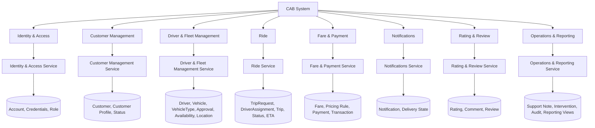

Các node dữ liệu minh họa nhóm owned data, không mô tả database/schema.

## 14. Decisions & Assumptions

### Confirmed from Source

- Có 8 BC như liệt kê trong tài liệu nguồn.
- Account/Role thuộc Identity & Access; Customer Profile thuộc Customer Management; Driver Profile/Vehicle thuộc Driver & Fleet Management; TripRequest/DriverAssignment/Trip/ETA thuộc Ride; Fare/Payment thuộc Fare & Payment; Notification thuộc Notifications; Rating/Comment thuộc Rating & Review; Support Note/Intervention/Audit/Reporting View thuộc Operations & Reporting.
- Ride quyết định assignment và Trip lifecycle; Fare & Payment nhận thông tin Trip; Notifications nhận sự kiện; Rating chỉ áp dụng cho Trip hoàn thành; Operations & Reporting không sở hữu dữ liệu nghiệp vụ gốc khác.
- UC-01–UC-37 và BC ownership được giữ theo nguồn.

### Design Decisions

- Chọn một Candidate Service cho mỗi BC vì nguồn chưa đưa ra bằng chứng đủ để tách thêm responsibility, ownership hoặc UC.
- Giữ Driver, Vehicle, approval, availability và latest location cùng nhau để bảo toàn responsibility eligibility/matching hiện có.
- Giữ TripRequest, DriverAssignment, Trip lifecycle và ETA cùng Ride vì cùng vòng đời.
- Giữ Fare và Payment cùng service vì nguồn đặt chung ownership/trách nhiệm.
- Chọn primary service cho UC nhiều BC theo responsibility owner; đây là quyết định logical vì nguồn không cung cấp tên/mô tả UC.
- Phân loại một số dependency synchronous/asynchronous candidate theo mục đích nghiệp vụ, không xác định protocol.

### Open Decisions

- Tên, luồng và transaction cụ thể từng UC, nhất là UC nhiều BC ownership.
- Phối hợp Account registration với tạo hồ sơ Customer/Driver.
- Cách Ride truy vấn eligibility/location và đồng bộ DriverAssignment với availability.
- Exact Ride → Fare calculation/finalization trigger and timing.
- Quyền hạn, loại command can thiệp, audit detail và nhu cầu freshness của Operations & Reporting.
- Tải, bảo mật chi tiết, latency và nhu cầu scale độc lập để xác nhận deployment boundary.
- Lower-level query payload fields and source-owner query pagination/update watermark details.


---

## Runtime Architecture

Service communication details and Contract IDs are authoritative in [04 Integration Contracts](04_Integration_Contracts.md). The runtime baseline below preserves the frozen deployment and operational decisions.


## 3. Runtime communication

The frozen transport model is public REST/HTTPS/JSON (`/api/v1`) at the API Gateway, Gateway-to-service gRPC, synchronous service-to-service REST/HTTP, and asynchronous Kafka for the four baseline events. The authoritative interaction matrix, Contract IDs, and exact producer/consumer mapping appear once in [04 Integration Contracts](04_Integration_Contracts.md). `EVT-FP-002` remains candidate/inactive. The fare calculation/finalization trigger and timing remain open for detailed design; candidate interactions must not be assumed active.

## 4. API Gateway and ingress

The Gateway is the only public application ingress. It terminates external TLS and REST/JSON, routes existing `/api/v1` OpenAPI operations, validates bearer access tokens, applies route-level authorization boundaries and rate limits, creates/propagates `requestId` and `correlationId`, and enforces payload/header limits. It invokes the target service using a gRPC downstream client; each service provides a Gateway-facing gRPC server/handler. Exact RPC method/schema mapping remains TBD where the existing contract is insufficient and must not be inferred mechanically from REST paths. The Gateway forwards identity claims as verifiable context; downstream services validate identity and enforce resource/business authorization. The Gateway contains no business rules, service data access, or business database credentials. Service-to-service synchronous calls stay REST/HTTP per 04/05.

Services are registered on the private service network using stable Compose DNS names locally and a platform service-discovery mechanism in later deployments. Gateway route configuration names an internal service and port; no service address is published to the host except the Gateway and explicitly chosen local development tooling.

## 5. Event architecture

### 5.1 Broker decision

**TAD: Apache Kafka** as the event broker. Its durable partitioned log supports event-driven consumers, replay/recovery, scalable consumer groups, and per-key ordering. At-least-once processing is implemented through manual/controlled offset acknowledgement after successful idempotent handling, bounded retry, and dead-letter topics. Kafka can run locally in Docker Compose; use a single-node KRaft configuration for development, with production replication and availability configured separately. These mechanics do not alter event meaning or introduce events.

### 5.2 Event routes

| Contract | Publisher | Kafka topic | Consumer | Business key |
|---|---|---|---|---|
| EVT-RID-001 `TripLifecycleChanged` | Ride | `cab.ride.trip-lifecycle-changed.v1` | Notifications | `tripReference` |
| EVT-RID-002 `TripCompleted` | Ride | `cab.ride.trip-completed.v1` | Notifications | `tripReference` |
| EVT-RID-003 `TripCanceled` | Ride | `cab.ride.trip-canceled.v1` | Notifications | `tripReference` |
| EVT-FP-001 `PaymentOutcomeRecorded` | Fare & Payment | `cab.fare-payment.payment-outcome-recorded.v1` | Notifications | `paymentReference` (or trip reference when contract defines trip-scoped ordering) |

Each record carries the 05 envelope: `eventId`, `eventType`, `eventVersion`, `occurredAt`, producer, `correlationId`, and payload with business references. `aggregateId`/Kafka key is the relevant business key (Trip or payment). Payload is the source contract's minimal business data; credentials, provider secrets, and payment credentials are prohibited. Unknown optional fields are ignored; unsupported versions are quarantined for operator review.

Delivery is at least once. Consumers persist processed `eventId` values (or equivalent deduplication key) alongside their local effect and make handlers idempotent. Retry transient errors with bounded exponential backoff; do not endlessly retry permanent schema/business errors. After configured attempts, route to a DLQ topic retaining the original event and failure metadata, alert operations, correct the issue, then replay safely. Partition by business key for per-key ordering; global ordering is not guaranteed. Consumers validate lifecycle/state and tolerate duplicates and late records.

**Outbox recommendation:** a producer writes its owned state change and outbox record in one local database transaction; a publisher relays committed outbox records to Kafka and marks them delivered. This prevents database/event publication drift without a distributed transaction. Consumer offset is committed only after its idempotent local transaction succeeds. Retention, retry count, and DLQ duration are environment configuration decisions.

## 6. Security architecture

### 6.1 Client identity

Clients connect using HTTPS and authenticate through Identity & Access. Use JWT bearer access tokens as a TAD consistent with the contract. The Gateway validates signature, issuer, audience, expiry, and allowed algorithm; it rejects invalid tokens and forwards token/claims context without logging it. Services validate the signed token or trusted delegated context and independently authorize the requested action and owned resource. Login credentials travel only to Identity & Access over TLS. Passwords are stored as salted adaptive password hashes, never plaintext or reversible encryption.

### 6.2 Service identity and internal transport

**TAD: mutual TLS (mTLS)** for Gateway-to-service gRPC, service-to-service REST/HTTP, and broker client connections. Gateway and each service have distinct workload identities and certificates; peers verify certificate identity and authorize only contract-specific callers/topics. The local Compose profile may use a development CA and short-lived local certificates; production uses managed issuance and rotation. Internal network membership alone is not authorization. Where mTLS termination is delegated to a mesh/proxy, the proxy must preserve verified workload identity to the service.

Apply least privilege to database users, Kafka ACLs, service identities, and operations routes. JWT signing keys, certificates/private keys, DB passwords, provider credentials, and broker credentials come from runtime secret mounts or an external secret manager, never source control or images. `.env.example` contains names/placeholders only; actual `.env` is ignored by Git. Rotate secrets and certificates without embedding them in event payloads or logs.

## 7. Data and database deployment

Each of the eight services owns its PostgreSQL database; business entities have one authoritative owner. Cross-service entity relationships use references and never cross-database foreign keys. Within the Fare & Payment database, `Payment.fareId` is a same-database foreign key to its Fare; `transactionType` remains a normal field. This distinction is represented in the ERD.

Exactly eight PostgreSQL databases are owned independently, one per service. Each service has a dedicated database credential restricted to its own database; the local topology uses a separate PostgreSQL container/database per service. No cross-service joins, foreign keys, credentials, or connection strings are permitted. Notifications persists Notification, `recipientAccountId` (a reference to Identity & Access Account, not an FK), and `isRead` in Notifications DB. Operations & Reporting persists its aggregate `ReportingView` snapshot in Operations DB; source data remains in Ride, Fare & Payment, and Driver & Fleet.

### 7.1 Reporting projection refresh and KPI contract

Operations & Reporting does not consume Kafka. A scheduled refresh runs every minute and reads source facts only through existing synchronous REST contracts `QRY-OPS-002` (Driver/Fleet reference and display data), `QRY-OPS-003` (Trip and assignment facts), and `QRY-OPS-004` (Payment/Transaction facts). Queries are paginated and incremental by owner update time; refresh replaces/upserts the aggregate `ReportingView` snapshot in one local transaction. No source database is accessed directly and no event or Contract ID is added for ingestion. If refresh age exceeds five minutes, dashboard responses set `isStale=true` and include the last successful `refreshedAt`.

Dashboard query `QRY-OPS-005` serves the existing `GET /operations/dashboard` route through Gateway REST/JSON → gRPC. The aggregate `ReportingView.metricValues` JSONB stores `tripCount`, `revenue`, `completionRate`, `cancellationRate`, per-driver performance and payment metrics; reference values in the JSON are not FKs. The default reporting window is the trailing 30 days in UTC; callers may provide UTC `periodStart` and `periodEnd`. Definitions: trip count counts unique Ride trips requested in the window; completion and cancellation rates use terminal trips closed in the window as denominator (`Completed + Canceled + Failed`), with respective numerators `Completed` and `Canceled`; revenue sums Payment amount for `Paid` status changes in the window; per-driver performance lists drivers with accepted assignments and calculates completed trips / accepted assignments; payment metrics group payment count and amount by method/status. Rates are percentages 0–100; empty denominators yield zero. Only paid amounts contribute to revenue. The projection is a read model, not a source of truth.

## 8. Docker network and topology

Use two Docker networks: `edge` connects Gateway to the public ingress and selected internal services; `backend` is internal-only and connects the Gateway, eight services, broker, and databases. Databases and broker expose no host ports by default. Only Gateway publishes a host port. Service DNS names are Compose service names. Secrets/configuration are injected per service; no service receives another service's DB credentials.

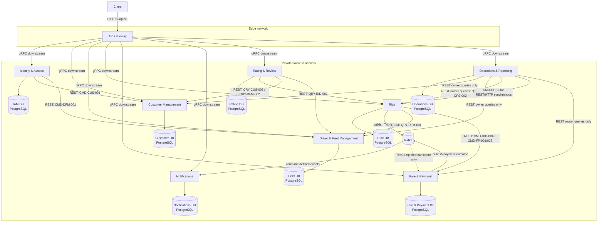

Solid arrows show baseline communication; the dashed Fare event arrow is an inactive candidate. Public ingress is REST/JSON, Gateway-to-service arrows are gRPC, internal synchronous arrows are REST/HTTP, and async arrows use Kafka. Every service's database is reachable only by that owner service. These transports use TLS/mTLS.

### 8.1 Compose components and readiness

Compose includes API Gateway; all eight services; eight owned databases; Kafka in single-node KRaft mode; and optional metrics/log/tracing collectors. Every app waits on its own database health and broker health where needed. A container being started does not mean it is ready. Each service provides liveness and readiness endpoints; readiness checks its ability to serve required operations and required dependencies, while optional integrations are reported separately. Compose `depends_on: condition: service_healthy` can order startup but services must still reconnect with bounded backoff after runtime dependency loss.

## 9. Configuration and secrets

Non-secret configuration includes service ports, public base URL, `/api/v1` route settings, timeout/retry limits, log level, Kafka topic/group names, and health intervals. Secrets include DB passwords/connection credentials, JWT signing/verification key material, mTLS private keys, broker credentials, and external payment-provider credentials. Configuration is service-specific environment variables; secrets are mounted files or secret-manager references. `.env.example` documents required variable names and safe local defaults only. Never commit real `.env`, certificates, keys, or credentials.

Each service receives only its own DB connection string and the broker permissions it needs. Identity & Access alone receives password-hash and token-signing capability. Provider credentials are restricted to Fare & Payment. Secret rotation and missing-secret startup behavior are explicit operational configuration, not fallback hard-coded values.

## 10. Resilience and operational behavior

- Set connect/response timeouts on every internal REST call and deadlines on Gateway gRPC calls; propagate an end-to-end deadline where supported. Initial local defaults may follow 05, then be tuned against service latency/SLOs.
- Retry only transient network/5xx failures with capped exponential backoff and jitter. Do not retry validation, authorization, or other permanent business errors. Never retry indefinitely.
- Use circuit breakers for repeated downstream failures; return a contract error or controlled unavailable response rather than cascading failure.
- Side-effect commands use the contract's idempotency behavior and `Idempotency-Key` where appropriate. Store key, request fingerprint, and outcome within the owner service. Duplicate requests return the original result; conflicting reuse is rejected.
- Kafka consumers use bounded retry, DLQ, eventId deduplication, and safe replay. Outbox relay retries publication without creating duplicate business effects.
- Payment unknown outcomes are resolved through owner-side status checking/reconciliation before retry; do not blindly repeat a provider charge. Payment retry does not change Ride lifecycle.
- Registration is two local owner writes coordinated by synchronous commands, not a distributed transaction. Partial completion follows the source's open recovery decision; do not invent rollback/compensation semantics here.

## 11. Observability

Emit structured JSON logs with `timestamp`, service, environment, severity, `requestId`, `correlationId`, trace/span identifiers where enabled, and contract/operation identifier. Gateway creates a request ID when absent and forwards it; correlation context is propagated over Gateway gRPC metadata and internal REST headers, then copied into event envelopes. Consumers restore correlation context from the event. This supports tracing Client → Gateway → services → broker → consumer.

Expose liveness, readiness, request/error/latency metrics, dependency health, broker consumer lag, retry/DLQ counts, and outbox backlog. Use distributed tracing (OpenTelemetry-compatible instrumentation) as a technical observability mechanism. Do not log passwords, bearer tokens, secret material, full sensitive payment data, or unfiltered provider payloads. Restrict operational dashboards and traces to authorized roles.

## 12. Runtime flow sequences

These diagrams show runtime interactions supported by 04/05. They intentionally omit business rules and do not add contract operations. CMD-OPS-002 is finalized by SRS and shown below; only internal audit persistence schema detail remains open.

### 12.1 Register Customer

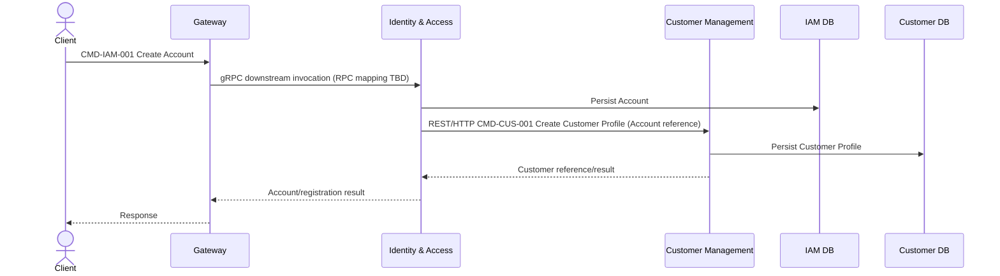

### 12.2 Register Driver

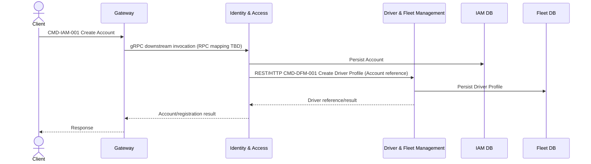

### 12.3 Login

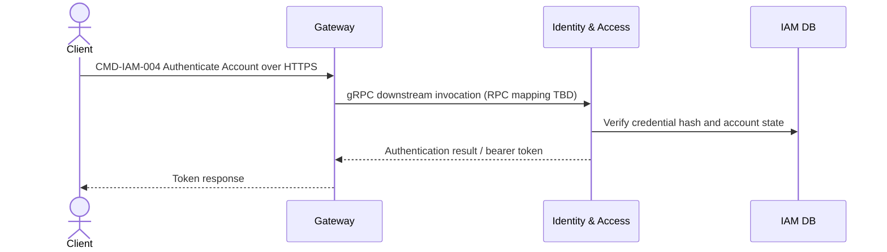

### 12.4 Request Ride

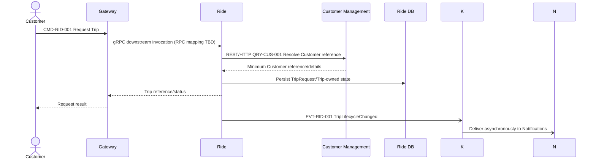

### 12.5 Driver Matching

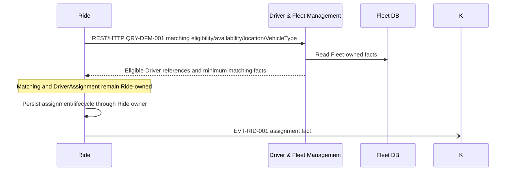

### 12.6 Driver Accept Trip

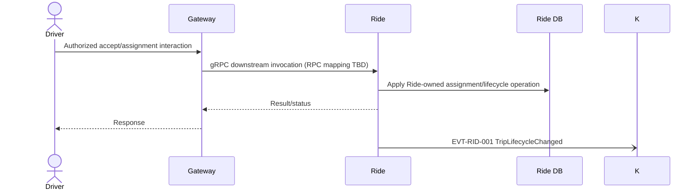

The exact accept operation/contract ID is not separately specified in 05; this runtime step must use the Ride-owned lifecycle operation already defined by CMD-RID-003 and must not be exposed as a new contract without contract revision.

### 12.7 Trip Lifecycle

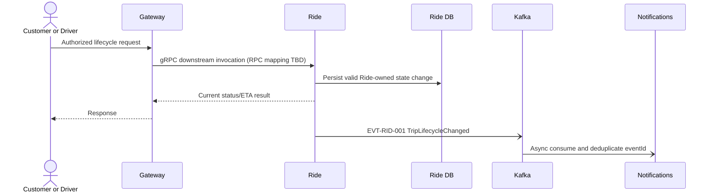

### 12.8 Trip Completion → Fare/Payment

The following diagrams show two contract interactions separately; their relative ordering is intentionally unspecified because the exact Fare trigger/timing remains open in 05.

**A. Ride completion and Notifications event delivery**

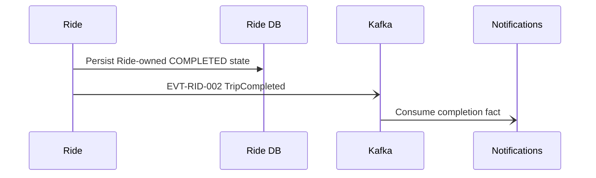

**B. Synchronous Ride-to-Fare contract interaction**

```mermaid
sequenceDiagram
  participant R as Ride
  participant F as Fare & Payment
  participant DF as Fare DB
  R->>F: CMD-RID-004 / CMD-FP-001/002 Calculate or Finalize Fare
  F->>DF: Persist Fare-owned state as applicable
  F-->>R: Fare result/reference
  Note over R,F: Exact timing/trigger remains open in 05; confirm before implementation
```

The Ride-to-Fare synchronous contract remains baseline. The `TripCompleted` event is consumed by Notifications; Fare & Payment's consumption of `TripCompleted` under `EVT-FP-002` remains candidate/inactive and is not part of the baseline flow. Do not infer whether Fare runs before or after completion publication from these separate diagrams.

### 12.9 Payment Outcome → Notification

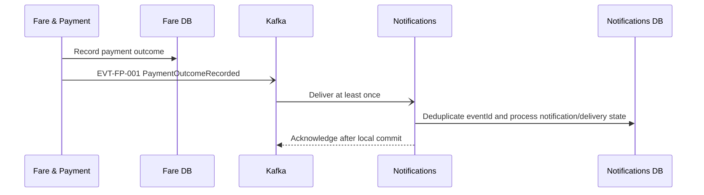

### 12.10 Trip Completion → Rating

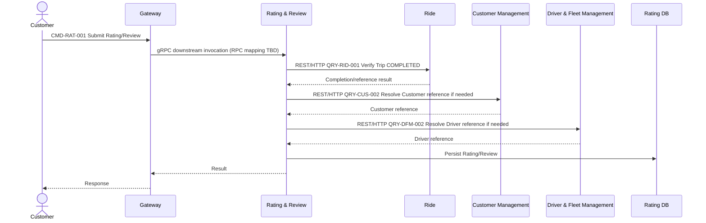

### 12.11 Trip Cancellation

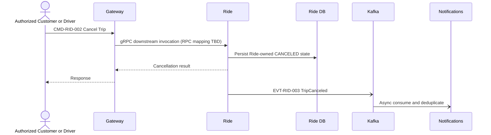

### 12.12 Operations Trip Intervention (`CMD-OPS-002`)

```mermaid
sequenceDiagram
  actor Supervisor as OperationsSupervisor
  participant G as API Gateway
  participant O as Operations & Reporting
  participant R as Ride Service
  participant DR as Ride Database
  Supervisor->>G: POST /operations/trips/{tripId}/interventions (REST/HTTPS/JSON)
  G->>O: gRPC downstream call; verify Supervisor role
  O->>O: Validate required reason and second confirmation
  O->>R: CMD-OPS-002 over REST/HTTP (synchronous)
  R->>DR: Validate eligibility; update Ride-owned Trip
  DR-->>R: Updated Trip state
  R-->>O: Intervention outcome and before/after state
  O->>O: Record audit (actor, role, action, entity, reason, before/after, createdAt, correlationId)
  O-->>G: Result
  G-->>Supervisor: Intervention response
```

OperationsStaff intervention attempts receive 403 and leave Trip unchanged (AC-172). Ride alone validates the business rule and updates Trip. Operations never accesses Ride Database; no Kafka event is emitted for the intervention. Audit detail beyond SRS-defined fields is open technical schema work.

## 14. Technical Architecture Decisions

| Decision | Choice | Reason | Impact |
|---|---|---|---|
| API Gateway technology | Kong Gateway in DB-less declarative mode for local deployment | Docker-ready routing, TLS termination, JWT validation, and rate-limit plugins in one Gateway runtime | Keep resource/business authorization in services; Gateway verifies token and applies route boundary without changing contracts |
| Public and Gateway downstream transport | Client → Gateway uses REST/HTTP/JSON; Gateway → each service uses gRPC | Keeps the existing OpenAPI public API and uses gRPC for Gateway IPC | Gateway terminates REST and invokes the target service gRPC server; exact RPC mapping is TBD where existing contracts are insufficient |
| Message Broker | Apache Kafka, single-node KRaft locally | Durable event log, replay, consumer groups, partition ordering, retry/DLQ patterns, scalable event throughput, Docker support | Partition by business key; production requires replicated cluster and operational capacity |
| Service-to-service communication | REST/HTTP for existing synchronous commands/queries; Kafka only for four contracted events | Preserves the interactions and dependencies in 04/05 | Do not convert internal REST calls to gRPC or add service dependencies |
| Service discovery | Docker Compose DNS locally; platform-native service discovery in deployment | Stable internal names without hard-coded IPs | Gateway and callers use service names; no public service ports |
| Authentication | Identity & Access-issued JWT bearer access token, validated at Gateway and services | Consistent with 05 external token flow and independent target authorization | Key rotation, issuer/audience validation and claim policy required |
| Gateway/service and service-to-service security | mTLS with workload identity and peer authorization | Protects Gateway gRPC, internal REST and broker connections | Certificate issuance/rotation and local development CA needed |
| Database deployment | PostgreSQL database per service; eight isolated local PostgreSQL databases/containers and credentials | Enforces 04/05 ownership and prevents cross-service access | More containers locally; independent migrations/backups |
| Configuration/secrets | Service-specific environment configuration; mounted secrets locally/external secret manager in deployed environments | Separates deploy-time configuration from sensitive credentials | `.env.example` only in Git; rotate external secrets |
| Health/readiness | Liveness and readiness HTTP endpoints; Compose healthchecks and dependency health gates | Distinguishes process-up from able-to-serve | Readiness reflects required dependencies; runtime reconnect remains necessary |
| Retry/resilience | Bounded retries with exponential backoff/jitter, timeouts, circuit breakers, idempotency | Prevents infinite retry and cascading failure | Tune values against observed latency; payment unknown outcomes reconcile first |
| Event delivery semantics | At-least-once, eventId dedupe, idempotent handlers, bounded retry and DLQ | Preserves source semantics and supports recovery | No exactly-once claim; consumers handle duplicates/out-of-order delivery |
| Local deployment strategy | Docker Compose, private backend network, only Gateway published, single-node Kafka and isolated service DBs | Reproducible local topology with clear ownership boundaries | Local HA differs from production; secrets remain local-only |

All choices above are technical. They do not revise business decisions, source contract IDs, ownership, or lifecycle semantics.

## 15. Architecture validation

### Boundary
- [x] Exactly 8 services
- [x] No service owns another service's data
- [x] No shared business database
- [x] No cross-service DB access

### Communication
- [x] Client → Gateway uses REST/HTTP/JSON `/api/v1`
- [x] Gateway → eight services uses gRPC; RPC mapping stays TBD where source contracts are insufficient
- [x] Existing synchronous service → service interactions use REST/HTTP
- [x] API Gateway is the only public ingress
- [x] Internal service communication follows 05 contracts
- [x] Message Broker for contracted events
- [x] Event-driven communication without inventing business events

### Reliability
- [x] Idempotency for side-effect commands/consumers
- [x] Bounded retry and DLQ
- [x] Timeouts
- [x] At-least-once delivery
- [x] Deduplication by eventId or equivalent
- [x] Outbox pattern recommended

### Security
- [x] HTTPS at public ingress
- [x] JWT/Bearer authentication
- [x] Authorization at Gateway boundary and target service
- [x] Per-service identity
- [x] TLS/mTLS for internal communication
- [x] Secrets externalized from source and images
- [x] Passwords stored as salted hashes, never plaintext

### Deployment
- [x] Docker Compose local topology
- [x] Edge and private backend Docker networks
- [x] Database per Service
- [x] Compose healthchecks
- [x] Readiness distinct from liveness
- [x] Service discovery via Compose DNS locally

### Observability
- [x] `requestId`
- [x] `correlationId` across HTTP and events
- [x] Structured logging
- [x] Metrics including broker lag/retry/DLQ
- [x] Health/readiness endpoints
