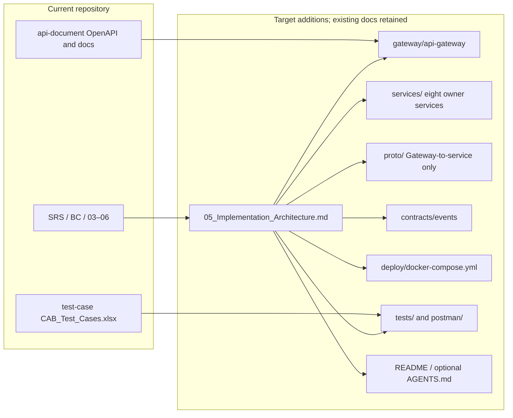
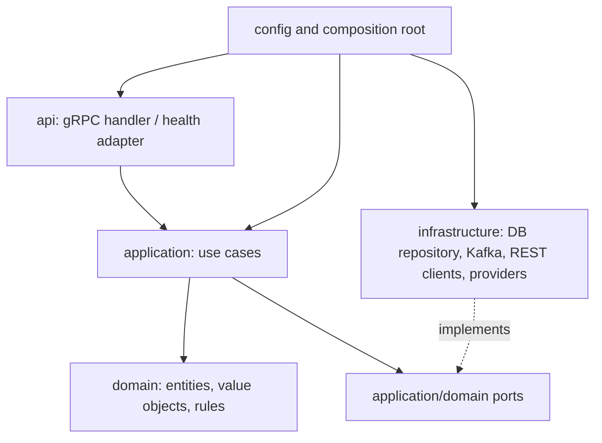
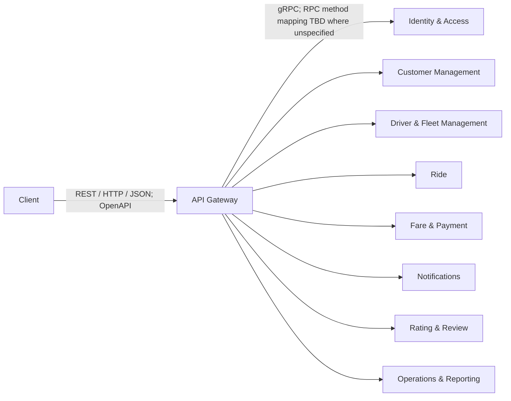
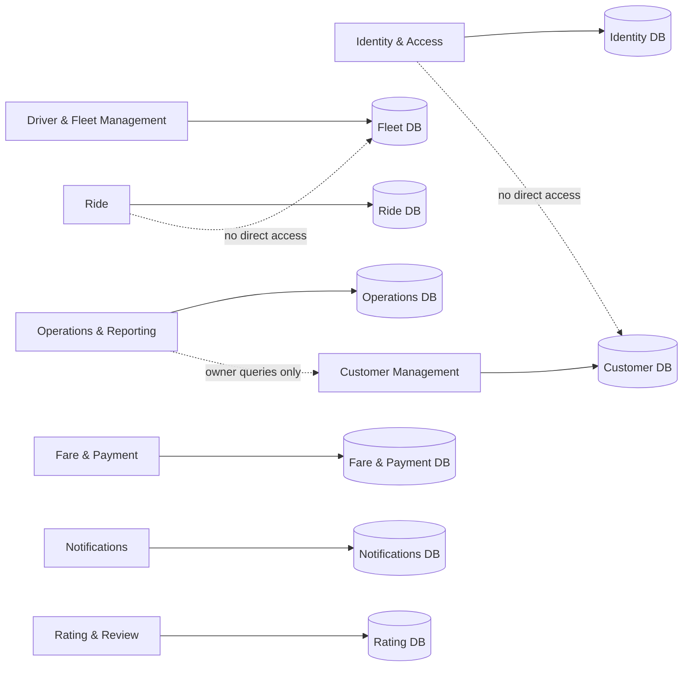
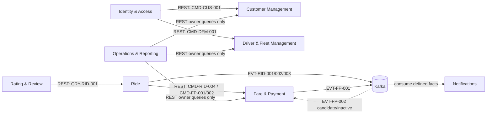
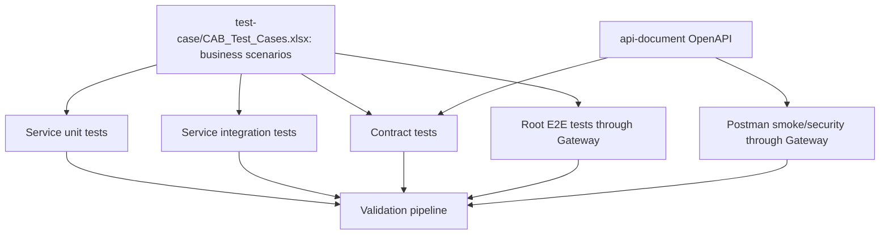
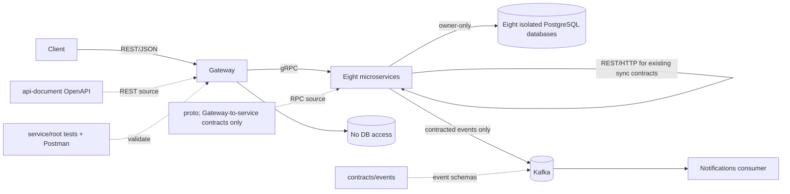

# 05 Implementation Architecture

## 1. Purpose

Tài liệu này chuyển các ranh giới nghiệp vụ, service contract, contract kỹ thuật và runtime đã có thành bố cục mã nguồn implementation-level cho CAB System. Đây là kiến trúc đề xuất cho bước triển khai tiếp theo; tài liệu không tạo mã nguồn, Dockerfile, Compose, proto, migration hay Postman collection.

07 giữ nguyên đúng tám service và data ownership đã chốt. Client gọi API Gateway bằng REST/HTTP/JSON; Gateway gọi tám service bằng gRPC. Các synchronous service-to-service interactions tiếp tục REST/HTTP theo 04/05; asynchronous event communication dùng Kafka theo 05/06. Không tự tạo RPC hoặc Contract ID để lấp khoảng trống mapping.

Repository hiện có `api-document/` và `test-case/`; 07 mở rộng cấu trúc đó, không tạo bộ tài liệu API thứ hai và không thay đổi file hiện có.

## 2. Source of Truth

Thứ tự phân xử nội dung:

1. `srs.md` là nguồn nghiệp vụ, use case, trạng thái, quy tắc, vai trò và yêu cầu chất lượng.
2. `bounded-context.md` là nguồn bounded context và ownership nghiệp vụ.
3. `03_System_Architecture.md` là nguồn số lượng/tên service và responsibility.
4. `03_System_Architecture.md` là nguồn logical commands, queries, events, dependencies và data boundary.
5. `04_Integration_Contracts.md` là nguồn Contract ID, protocol/envelope/event contract và open items kỹ thuật.
6. `03_System_Architecture.md` là nguồn runtime, Kafka, Gateway, bảo mật, database-per-service, Docker và health/readiness decisions.
7. `api-document/openapi.yaml` cùng `api-document/paths/`, `schemas/`, `responses/`, `parameters/`, `security/`, `docs/`, `examples/` và `dist/` là API documentation hiện hành; không nhân bản endpoint/schema ở 07.
8. `test-case/CAB_Test_Cases.xlsx` là business test specification, không phải implementation contract.
9. Tài liệu này chỉ quy định source location và hướng dẫn triển khai. Khi phát hiện mâu thuẫn với tài liệu nguồn, ghi nhận conflict; không âm thầm sửa nguồn.

Đã đọc sáu tài liệu 01–06 hiện diện tại root, `api-document/openapi.yaml`, README và tài liệu auth/authorization/convention/error/realtime trong `api-document/docs/`, cùng các path groups liên quan. Workbook đọc được: 20 sheet SC-01 đến SC-20, gồm các test case cho account, driver, vehicle, availability, trip request/matching/assignment/lifecycle/tracking, fare, cash/electronic payment, notification, rating, operations, transaction, KPI, security/authorization và performance/recovery. Các sheet có Test Case ID, Scenario, Preconditions, Steps, Test Data, Expected Result và Priority; workbook được giữ nguyên.

## 3. Current Repository Structure

```text
/
├── srs.md
├── bounded-context.md
├── 03_System_Architecture.md
├── 03_System_Architecture.md
├── 04_Integration_Contracts.md
├── 03_System_Architecture.md
├── api-document/
│   ├── openapi.yaml
│   ├── paths/ schemas/ responses/ parameters/
│   ├── docs/ examples/ security/ dist/
│   └── README.md
├── test-case/
│   └── CAB_Test_Cases.xlsx
└── .git/ .venv/
```

Themed API docs and the generated OpenAPI bundle already exist. No `gateway/`, `services/`, `proto/`, `contracts/`, `deploy/`, `postman/`, `.gitignore`, `.env.example`, root `README.md`, or root `AGENTS.md` is present in the inspected root. Do not infer that a missing component exists. This repository uses Codex; do not create Claude Code files or framework-specific agents.

## 4. Target Source Code Structure

Đây là cấu trúc đích được đề xuất; chỉ tạo các thư mục/file implementation ở bước triển khai sau. Giữ nguyên các tài liệu và thư mục hiện có tại root.

```text
/
├── srs.md
├── bounded-context.md
├── 03_System_Architecture.md
├── 03_System_Architecture.md
├── 04_Integration_Contracts.md
├── 03_System_Architecture.md
├── 05_Implementation_Architecture.md
├── api-document/                         # API docs duy nhất; giữ nguyên
├── test-case/CAB_Test_Cases.xlsx         # business test specification; giữ nguyên
├── gateway/
│   └── api-gateway/
│       ├── api/                 # REST/JSON handlers
│       ├── application/         # infrastructure-level orchestration only
│       ├── security/
│       ├── grpc/                # downstream gRPC clients
│       ├── routing/
│       ├── middleware/
│       ├── health/
│       ├── config/
│       ├── tests/{unit,integration,contract}/
│       ├── Dockerfile
│       └── .dockerignore
├── services/
│   ├── identity-access-service/
│   ├── customer-service/
│   ├── driver-fleet-service/
│   ├── ride-service/
│   ├── fare-payment-service/
│   ├── notification-service/
│   ├── rating-review-service/
│   └── operations-reporting-service/
│       ├── src/{api,application,domain,infrastructure,contracts,config,main}/
│       ├── migrations/
│       ├── tests/{unit,integration,contract}/
│       ├── Dockerfile
│       ├── .dockerignore
│       └── README.md
├── proto/                                 # chỉ Gateway → service; RPC mapping có thể TBD
│   ├── identity_access/  ├── customer/  ├── driver_fleet/  ├── ride/
│   ├── fare_payment/  ├── notification/  ├── rating_review/  └── operations_reporting/
├── contracts/
│   └── events/                            # EVT-* schemas/envelope theo 05
├── deploy/
│   ├── docker-compose.yml
│   └── config/
├── tests/{unit,integration,contract,e2e}/ # test liên service/system-level
├── postman/{smoke,security}/
├── .gitignore
├── .env.example
└── README.md
```

Mỗi service trong tám service lặp lại cùng template `src/`, `migrations/`, `tests/`, `Dockerfile`, `.dockerignore` và `README.md`; phần cây lược gọn hiển thị template ở cuối danh sách. Mỗi service có test gần source cho unit/integration/contract; `tests/` root dành cho cross-service contract và end-to-end. Không lặp các test-case Excel thành tài liệu API hoặc business spec mới. Nếu quy ước ngôn ngữ/build sau này cần project/solution files, đặt chúng ở root hoặc service tương ứng mà không thay đổi service boundary.

## 5. Repository Architecture

| Vùng | Đường dẫn | Trách nhiệm |
|---|---|---|
| Public edge | `gateway/api-gateway/` | REST ingress, OpenAPI route mapping, JWT validation, role/rate enforcement, gRPC forwarding, request/correlation context, aggregate dependency health. Không chứa nghiệp vụ hoặc DB access. |
| Business services | `services/*/` | Tám executable độc lập; mỗi service sở hữu domain logic, application workflows và persistence riêng. |
| RPC contract source | `proto/` | Chỉ Gateway → service gRPC. Không dùng proto cho internal service-to-service calls; không tự đặt message/method hoặc coi proto là event contract. Method/schema mapping có thể TBD. |
| Event contract source | `contracts/events/` | Versioned event schema/envelope cho các event ID hiện có trong 05; không phải nơi định nghĩa event mới. |
| API docs | `api-document/` | REST client-facing API source of truth. 07 chỉ tham chiếu endpoint hiện hữu và gRPC target/service source location. |
| Deploy | `deploy/` | Compose/config mô tả local topology; chỉ Gateway publish host port; tám DB và Kafka chỉ internal. |
| Automated tests | `services/*/tests/`, `tests/` | Unit, integration, contract, E2E theo scope ở mục 17. |
| Demonstration tests | `postman/` | Smoke/security flows cho giảng viên; gọi public Gateway, không gọi DB hay service port. |
| Codex guidance | `README.md` (hoặc `AGENTS.md` nếu thực sự cần ở bước sau) | Chỉ bổ sung hướng dẫn nếu cần; không tạo Claude Code files hoặc agent framework. |

Shared technical package nếu thực sự cần chỉ được chứa logging, tracing, correlation ID, serialization, common technical error và transport utilities. Không chứa business entities, repositories, business rules hoặc service logic.

## 6. API Gateway Source Architecture

Đường đi bên ngoài luôn là `Client --REST/HTTP/JSON--> API Gateway --gRPC--> target service`. Gateway xác thực JWT và policy ở edge, chuyển REST request theo OpenAPI thành gRPC invocation, và không làm business logic hoặc truy cập database. `application/` của Gateway chỉ điều phối hạ tầng request (route, auth context, protocol conversion/error mapping), không sở hữu business use case. Endpoint và public schema vẫn lấy từ OpenAPI hiện có.

| Gateway source location | Vai trò |
|---|---|
| `gateway/api-gateway/api/` | Public REST/JSON handlers/controllers theo OpenAPI hiện tại. Không khai báo endpoint mới. |
| `gateway/api-gateway/application/` | Infrastructure-level request orchestration/protocol conversion; không chứa business logic/use case. |
| `gateway/api-gateway/routing/` | Mapping từ OpenAPI operation hiện có tới logical owner và downstream client. |
| `gateway/api-gateway/grpc/` | Downstream gRPC channels/clients, deadlines, metadata propagation và error translation; RPC names/schema chỉ theo mapping được phê duyệt, phần thiếu để TBD. |
| `gateway/api-gateway/middleware/` | `requestId`/`correlationId`, headers, payload limits và transport policies. |
| `gateway/api-gateway/security/` | JWT signature/issuer/audience validation, role boundary, rate limit configuration và identity-context forwarding. Service vẫn enforce resource ownership/business authorization. |
| `gateway/api-gateway/health/` | Gateway liveness/readiness và dependency aggregation cho `/health/services`. |
| `gateway/api-gateway/config/` | Route target names, listen port, limits, health, TLS, secret references; không chứa secret values. |
| `gateway/api-gateway/tests/` | Route mapping, JWT tampering/authorization/rate-limit, gRPC client contract và health aggregation tests. |

### OpenAPI route to owner mapping

Các path dưới đây là path đã có trong `api-document/openapi.yaml`; đây là nhóm định tuyến, không phải endpoint list mới. Path cụ thể, method, payload, response và schema đọc từ OpenAPI/path files.

| OpenAPI path group | Public REST owner | Gateway downstream target | Source location |
|---|---|---|---|
| `/auth/*` (register, register-driver, login) | Identity & Access | Identity & Access gRPC server | `services/identity-access-service/src/api/` |
| `/customers/*` | Customer Management | Customer Management gRPC server | `services/customer-service/src/api/` |
| `/drivers/*`, `/vehicles/*` | Driver & Fleet Management | Driver & Fleet gRPC server | `services/driver-fleet-service/src/api/` |
| `/trip-requests/*`, `/driver-assignments/*`, `/trips/*` | Ride | Ride gRPC server | `services/ride-service/src/api/` |
| `/payments/*` | Fare & Payment | Fare & Payment gRPC server | `services/fare-payment-service/src/api/` |
| `/notifications/*` | Notifications | QRY-NOT-001 finalized list/mark-read capability; Notifications gRPC handler, recipient authorization, persistent read state | `services/notification-service/src/api/` |
| `/trips/{tripId}/rating` (existing OpenAPI operation) | Rating & Review | Rating & Review gRPC server | `services/rating-review-service/src/api/` |
| `/operations/*` | Operations & Reporting | Operations & Reporting gRPC server; `POST /operations/trips/{tripId}/interventions` maps to finalized `CMD-OPS-002` | `services/operations-reporting-service/src/api/` |

Existing `/trips/{tripId}/rating` belongs logically to Rating & Review, notwithstanding its path nesting under trips. The Operations intervention endpoint maps to finalized `CMD-OPS-002`: Gateway gRPC handler → Operations use case → REST client to Ride; Ride validates and updates Trip. `GET /notifications` and `PATCH /notifications/{notificationId}/read` map to finalized QRY-NOT-001 and read/write only Notifications-owned notification state.

## 7. Microservice Source Architecture

Mỗi service dùng dependency direction `api → application → domain`; infrastructure implements application/domain ports and is wired at startup. `api/` là gRPC server/handlers dành cho Gateway. Synchronous service-to-service calls dùng REST clients trong infrastructure, chỉ cho interaction đã có trong 04/05. Contracts expose only transport DTOs/adapters. Domain code không phụ thuộc framework, SQL, Kafka, gRPC/REST transport hoặc provider SDK.

#### Finalized Operations Trip Intervention mapping

`POST /operations/trips/{tripId}/interventions` follows the existing endpoint and `CMD-OPS-002`; it adds no Contract ID or event. The mapping is:

```text
Client REST/HTTPS/JSON → Gateway → Operations gRPC handler
  → Operations application use case / authorization
  → Operations REST client → Ride REST controller
  → Ride application → Ride domain → Ride repository → Ride Database
```

Operations records its intervention/audit record in its own database after the Ride result. Its domain contains no Trip lifecycle rule and it has no Trip repository. Ride validates eligible cancellation or failed-trip closure and alone updates Trip. `OperationsStaff` receives 403; `OperationsSupervisor` may submit the two SRS-defined actions.


```text
service/
├── src/
│   ├── api/             # Gateway-facing gRPC server/handlers; input validation/result mapping
│   ├── application/     # use cases, orchestration, authorization checks requiring business context
│   ├── domain/          # entities, value objects, invariants, domain services
│   ├── infrastructure/  # DB adapters/repositories, Kafka adapters, REST clients, external providers
│   ├── contracts/       # service-local transport mappings/interfaces; no duplicate public API spec
│   ├── config/          # config binding and service-specific DI/composition root
│   └── main/            # process entry point, server startup, graceful shutdown
├── migrations/          # schema changes for this service database only
├── tests/{unit,integration,contract}/
├── Dockerfile
├── .dockerignore
└── README.md
```

`api/` là Gateway-facing gRPC adapter; public REST/JSON chỉ chấm dứt tại Gateway. `application/` gọi repository/provider ports, không gọi SQL trực tiếp. `domain/` không gọi Kafka/gRPC/REST client. `infrastructure/` cài đặt interfaces như `ITripRepository`, `IEventPublisher`, `IFleetRestClient` khi interaction tương ứng đã có contract. Migrations không sửa schema của service khác.

Health handlers là adapter/process concern, đặt tại `api/` hoặc `infrastructure/health/` theo framework; chúng không thành use case nghiệp vụ. Mỗi service chạy độc lập, nhận config riêng, expose cổng nội bộ và không publish host port trong Compose.

## 8. Service-by-Service Structure

| Service | Domain source và ownership | Application/use cases | Infrastructure adapters | Event role theo 05/06 |
|---|---|---|---|---|
| Identity & Access Service (`identity-access-service`) | `domain/account/`, `credential/`, `role/`, `token/`, `account-status/`; Account, authentication, authorization, role, credential, token, account status. Không sở hữu Customer/Driver profile. | register Account, authenticate, manage role/account status; điều phối tạo profile qua owner service theo CMD-CUS-001/CMD-DFM-001. Partial registration recovery vẫn open. | Account repository/database, password hash/token signer, Customer/Fleet REST clients for the existing registration interactions. No new registration event. | Không có event baseline được chỉ định. |
| Customer Management Service (`customer-service`) | `domain/customer/`, `profile/`, `status/`; Customer, Customer Profile, Customer Status. | create/update/status changes, lookup profile. | Customer DB repository, identity reference check conditional; migration riêng. | Không có event baseline. |
| Driver & Fleet Management Service (`driver-fleet-service`) | `domain/driver/`, `vehicle/`, `vehicle-type/`, `approval/`, `availability/`, `location/`; Driver, Vehicle, VehicleType, approval, availability, latest location. | registration/profile, approval, availability/location updates, eligibility lookup. Reject Available nếu chưa approved theo SRS/API baseline. | Fleet DB, location/query adapter, conditional Identity REST client. Không ghi dữ liệu Ride. | Availability/location event là candidate, không activate. |
| Ride Service (`ride-service`) | `domain/trip-request/`, `assignment/`, `trip/`, `eta/`; TripRequest, DriverAssignment, Trip lifecycle/status, ETA/matching/dispatch. Chỉ tham chiếu finalized fare. | request, match/dispatch, assignment response, lifecycle/cancel/complete, ETA. Assignment và lifecycle vẫn Ride-owned. | Ride DB, Fleet/Customer/Fare REST clients for existing contract interactions, Kafka publisher/outbox for EVT-RID-001/002/003, routing provider adapter theo SRS. | Publish EVT-RID-001 TripLifecycleChanged, EVT-RID-002 TripCompleted, EVT-RID-003 TripCanceled đến Kafka topics trong 06; không tạo tên/event mới. |
| Fare & Payment Service (`fare-payment-service`) | `domain/fare/`, `pricing-rule/`, `payment/`, `transaction/`, `idempotency/`; Fare, Pricing Rule, fare calculation/finalization, Payment, Transaction. | calculate/finalize fare, initiate/retry payment, record outcome. Payment retry tối đa theo SRS; provider unknown outcome cần reconcile. | Fare/Payment DB, VNPAY Sandbox adapter, webhook signature verification, idempotency store, Kafka publisher/outbox EVT-FP-001. | Publish EVT-FP-001 PaymentOutcomeRecorded. EVT-FP-002 TripCompleted consumer remains inactive candidate. |
| Notifications Service (`notification-service`) | `domain/notification/`, `delivery-state/`; owns Notification, content/type and persistent `isRead`; `recipientAccountId` references Identity & Access Account and `tripId` references Ride, with no cross-service FK. Không sở hữu Trip/Payment. | consume baseline facts, persist/deliver in-app notification, list own notifications, mark owned notification read idempotently. | Notifications PostgreSQL DB, Kafka consumers EVT-RID-001/002/003 and EVT-FP-001, processed-event dedupe. QRY-NOT-001 is finalized. | Consume đúng bốn baseline event routes; at-least-once, idempotent processing. |
| Rating & Review Service (`rating-review-service`) | `domain/rating/`, `review/`, `eligibility/`; Rating/Review và rating eligibility. | submit rating chỉ khi Trip COMPLETED. | Rating DB, Ride completion REST client, conditional Customer/Fleet REST clients. | Không có event baseline; Rating-created event không được tự phát. |
| Operations & Reporting Service (`operations-reporting-service`) | `domain/support-note/`, `intervention/`, `audit/`, `operational-view/`, `reporting-view/`; owns support/intervention/audit and derived KPI projection only. Không sở hữu Customer/Driver/Trip/Fare/Payment source data. | support notes, restricted lookup, audit, scheduled reporting projection refresh, read-only KPI dashboard; finalized Supervisor intervention invokes Ride synchronously via REST. | Operations PostgreSQL DB holds aggregate `ReportingView`; REST clients call QRY-OPS-002/003/004; no direct DB access and no Kafka consumer. | No event baseline and no intervention event. |

Tên thư mục trong 07 là tên implementation đề xuất; tên service và responsibility giữ đúng `03_System_Architecture.md`. Mỗi `src/domain/` chỉ chứa aggregate/value objects thuộc owner đó; consumer chỉ giữ business references cần thiết.

## 9. Database Ownership and Persistence

Giữ database-per-service như 04/05/06. Local topology có tám database/container riêng; từng service có user/credential và migration riêng. SRS 18.7 selects PostgreSQL as the only database system; all eight service databases use PostgreSQL. Không shared business DB, cross-service joins, foreign keys qua DB, dùng chung repository hoặc connection string của service khác. Cross-service access uses only existing REST contracts or Kafka events.

| Service | Schema/database owner | Engine | Migration location | Dữ liệu thuộc owner |
|---|---|---|---|
| Identity & Access | Identity & Access | PostgreSQL | `services/identity-access-service/migrations/` | Account, credential/auth data, role/token/account status |
| Customer Management | Customer Management | PostgreSQL | `services/customer-service/migrations/` | Customer/Profile/Status |
| Driver & Fleet | Driver & Fleet | PostgreSQL | `services/driver-fleet-service/migrations/` | Driver, Vehicle, VehicleType, approval, availability, latest location |
| Ride | Ride | PostgreSQL | `services/ride-service/migrations/` | TripRequest, DriverAssignment, Trip, lifecycle/status, ETA, event outbox |
| Fare & Payment | Fare & Payment | PostgreSQL | `services/fare-payment-service/migrations/` | Fare, Pricing Rule, Payment, Transaction, idempotency records, outbox |
| Notifications | Notifications | PostgreSQL | `services/notification-service/migrations/` | Notification content/type, `recipientAccountId` and Trip references, persistent `isRead`, processed event IDs |
| Rating & Review | Rating & Review | PostgreSQL | `services/rating-review-service/migrations/` | Rating/Review |
| Operations & Reporting | Operations & Reporting | PostgreSQL | `services/operations-reporting-service/migrations/` | Support Note/Intervention/Audit and derived reporting projection; source facts stored as references/values, no source DB copies or cross-service FKs |

Encryption at rest được cấu hình ở database/storage/container-volume layer và quản lý khóa ngoài source. Các adapter persistence mã hóa trường nếu control/data classification yêu cầu; thuật toán/key management là deployment/security design chi tiết, chưa bị xác định trong 03–06. Không ghi credential, JWT secret hoặc provider secret vào migration/log.

### Reporting projection model and refresh

Operations' aggregate `ReportingView` snapshot is stored only in Operations PostgreSQL: `viewId` PK, `viewType`, `periodStart`, `periodEnd`, `metricValues` JSONB, and `refreshedAt`. `metricValues` holds trip count, revenue, completion/cancellation rates, per-driver performance and payment metrics; embedded Fleet/Trip/Payment references are values, never foreign keys. The refresh worker reads Fleet driver/display data through QRY-OPS-002, Ride trip/assignment/status data through QRY-OPS-003, and payment/transaction data through QRY-OPS-004. It paginates/increments by source update time and atomically updates the local aggregate snapshot every minute; it does not consume Kafka. A snapshot older than five minutes is returned with `isStale=true`.

The existing `GET /operations/dashboard` API is QRY-OPS-005. It defaults to the trailing 30 days UTC and accepts optional UTC period boundaries. `tripCount` counts unique trips requested in the window. Completion/cancellation rates use terminal trips closed in-window (`Completed + Canceled + Failed`) as denominator and the respective Completed/Canceled count as numerator. `revenue` sums Paid payment amounts by payment status-updated time. Per-driver performance lists drivers with accepted assignments and reports completed/accepted count and percent. Payment metrics group count and amount by method/status. Rates are 0–100 percent and an empty denominator yields zero. `refreshedAt` and `isStale` expose projection freshness.

## 10. gRPC / Proto Source Architecture

Luồng kiến trúc: `Client --REST/HTTP/JSON--> Gateway --gRPC--> service gRPC server`. Public REST endpoint/payload tiếp tục theo `api-document/openapi.yaml`; Gateway adapter chuyển DTO sang proto request, service handler chuyển proto result sang gateway response. Proto chỉ phục vụ Gateway → service, không thay thế internal service-to-service REST. Không publish service port ra host.

| Thành phần | Location đề xuất | Giới hạn |
|---|---|---|
| Proto source | `proto/<service-owner>/` | Chỉ Gateway → service RPC. Method/message mapping là TBD nếu 05/OpenAPI chưa đủ thông tin; không chuyển HTTP endpoint hoặc Contract ID thành RPC một cách máy móc. |
| Generated code | Build output của từng gateway/service, không sửa tay | Toolchain/codegen là TBD. Generated artifacts không thay thế source contract. |
| Gateway client | `gateway/api-gateway/grpc/` | Downstream client theo target service; deadline, auth context, correlation ID, status/error mapping. |
| Service server | `services/<service>/src/api/` | Handler gọi application use case, không truy cập database trực tiếp. |
| Service-to-service client | Calling service `src/infrastructure/rest/` | REST/HTTP only for synchronous dependencies already present in 04/05. Không gọi database owner. |

Danh sách gRPC RPC methods/messages remains TBD where existing 05/OpenAPI details are insufficient. Không tạo Contract ID, business operation, dependency hoặc service-to-service proto mới. Internal synchronous service calls tiếp tục dùng REST/HTTP theo 04/05.

## 11. Kafka / Event Source Architecture

06 đã chọn Apache Kafka, single-node KRaft cho local; giữ Kafka. Event schema/version/envelope nằm tại `contracts/events/` theo Contract ID và event definition ở 05. Producer/consumer code đặt trong infrastructure của đúng owner/consumer.

| Producer → Topic | Consumer | Source location | Contract |
|---|---|---|---|
| Ride → `cab.ride.trip-lifecycle-changed.v1` | Notifications | Ride `src/infrastructure/messaging/producers/`; Notifications `src/infrastructure/messaging/consumers/` | EVT-RID-001 |
| Ride → `cab.ride.trip-completed.v1` | Notifications | Như trên | EVT-RID-002 |
| Ride → `cab.ride.trip-canceled.v1` | Notifications | Như trên | EVT-RID-003 |
| Fare & Payment → `cab.fare-payment.payment-outcome-recorded.v1` | Notifications | Fare producer; Notification consumer | EVT-FP-001 |
| `cab.ride.trip-completed.v1` | Fare & Payment | Candidate handler location chỉ; không bind consumer/group đến khi được chốt | EVT-FP-002 candidate/inactive |

Event envelope và consumer behavior:

- Theo 05: `eventId`, `eventType`, `eventVersion`, `occurredAt`, producer, `correlationId`, payload reference; 06 dùng aggregate/business key làm Kafka key. `requestId`/trace context propagated khi có.
- Contract schema lưu trong `contracts/events/<owner>/<event-contract-id>/v<version>/`; tên/version chính thức phải tuân thủ event đã có trong 05/06, không tự tạo business event.
- Outbox table/migration cùng DB của producer; outbox publisher thuộc `src/infrastructure/messaging/`. Không dùng distributed transaction.
- Consumer lưu processed `eventId`/equivalent cùng local effect trong transaction; handler idempotent. Commit offset sau local commit.
- Retry transient error bounded exponential backoff; permanent/schema/business error không retry vô tận; cuối cùng DLQ giữ original event và failure metadata theo 06.
- Retry count, retention, DLQ duration và topic ACL là runtime configuration. Partition theo business key; không giả định global ordering.
- Notification consumer xử lý duplicate/late event an toàn và không trở thành owner của Trip/Payment.

## 12. Authentication and Authorization

Identity & Access sở hữu account, credential, roles và phát hành JWT Bearer token. Gateway xác minh chữ ký, issuer/audience/expiry và route-level role policy; service xác minh identity/workload context và bắt buộc kiểm tra resource ownership, state transition và business authorization. Không coi Gateway là nơi duy nhất enforce quyền.

| Concern | Source location | Quy tắc |
|---|---|---|
| JWT issue/refresh/signing capability | Identity `src/application/`, `src/infrastructure/security/` | Credential/password không trả về API response; password lưu salted hash theo 06. Signing key từ secret mount/manager. |
| JWT validation | Gateway `security/`; service `src/infrastructure/security/` hoặc API middleware | Signature/issuer/audience/expiry; reject tampering và token sai context. |
| Role/route authorization | Gateway `security/` và `routing/` | Chặn anonymous/role không phù hợp trước khi forward. |
| Resource ownership/business policy | Service `src/application/` + `src/domain/` | Customer/Driver chỉ được thao tác resource thuộc mình; driver assignment/lifecycle; operations scope; least privilege. |
| Operations roles | Operations service + Gateway policy | `OperationsStaff`, `OperationsSupervisor`, `Leadership` giữ quyền theo SRS/API docs; `CMD-OPS-002` chỉ Supervisor; Staff gets 403. |
| Service identity | Gateway/service `src/infrastructure/security/` | Per-service workload identity, mTLS và peer authorization theo 06; không dùng JWT user token thay workload identity. |

Role matrix canonical trong `api-document/docs/authorization.md` và SRS. Tránh sao chép chi tiết policy thành một bảng quyền cạnh tranh trong 07; code/test tham chiếu các nguồn trên.

## 13. Security Architecture

| Yêu cầu | Component | Source location | Test location |
|---|---|---|---|
| Encryption at rest | DB engine/storage/volume, secret/key configuration | `deploy/config/`, DB deployment settings; service persistence config chỉ tham chiếu key provider, không chứa key | `tests/integration/` security cases; xác nhận volume/db encryption config và dữ liệu không lưu plaintext theo policy |
| SQL injection protection | Repository/query adapter | Mỗi service `src/infrastructure/persistence/`; parameterized queries/ORM bindings, allowlist sort/filter fields | Service `tests/integration/` injection payload negative cases; use cases/API security suite |
| XSS protection | Gateway/API output/input boundary, clients consuming data | `gateway/api-gateway/api/`, `middleware/` validation/headers; service API validation; output encoding theo context ở presentation/client boundary | `postman/security/` và Gateway/service `tests/integration/`; stored/reflected payload không được thực thi khi render |
| JWT tampering protection | Gateway + service auth middleware | Gateway `security/`; mỗi service `src/infrastructure/security/` | Gateway/service contract security test: sửa payload/signature/issuer/audience/expiry phải bị reject |
| Unauthorized API protection | Gateway and target service | Gateway route policy; service application authorization and resource ownership | `postman/security/unauthorized-api.*`, Gateway/service integration tests: anonymous, wrong role, other-user resource |
| Rate limiting | API Gateway | `gateway/api-gateway/security/` policy/config | `postman/security/rate-limit.*`, Gateway integration test: burst vượt policy bị throttle |
| Replay/idempotency | Owner service, especially Fare & Payment | Payment `src/application/idempotency/`, `src/infrastructure/persistence/`; Ride/other side-effect owners likewise; Gateway forwards `Idempotency-Key` only where contract says | Payment unit/integration + `postman/security/replay-idempotency.*`: identical retry returns prior outcome, không tạo transaction/payment effect lần hai |
| VNPAY callback authenticity | Fare & Payment | `src/api/` callback adapter and `src/infrastructure/payment-provider/` signature verifier; verify provider reference idempotently | Fare & Payment provider integration/contract test with invalid signature and duplicate provider reference |

Gateway tạo/propagate `requestId`, `correlationId`; mọi service log structured và redact password, bearer token, secrets, raw payment credentials/provider payload. SQL Injection control nằm ở parameterized repository access, không dựa trên input filtering đơn thuần. XSS output encoding áp dụng tại nơi render nội dung; API validation/header policy là lớp bổ sung.

### Idempotency and replay behavior

`Idempotency-Key` được đọc tại API/Gateway adapter, truyền nguyên vẹn tới owner application command và không tự tạo thêm contract operation. Owner lưu key, request fingerprint và outcome bền vững trong database của chính mình. Cùng key/cùng payload trả lại outcome ban đầu; key bị dùng lại với payload khác trả conflict theo policy nguồn. Payment provider reference cũng có unique/deduplication enforcement. Key retention/format nếu chưa nêu trong 05 vẫn TBD.

Với lần thanh toán đầu, xử lý và persist transaction theo state machine của Payment. Request replay giống hệt không tạo payment attempt/transaction effect thứ hai và trả kết quả đã lưu. Nếu request đầu có kết quả không xác định do provider/network timeout, reconciliation theo provider reference diễn ra trước khi quyết định retry để tránh charge kép. Consumer Kafka dùng dedupe `eventId` riêng; không nhầm event dedupe với HTTP idempotency key.

## 14. Health and Readiness

| Endpoint | Owner | Source location | Ý nghĩa |
|---|---|---|---|
| `/health` | Mỗi service và Gateway | Health adapter trong `api/` hoặc `infrastructure/health/` | Liveness/process health: process có chạy và event loop/worker có hoạt động; không fail chỉ vì dependency tạm thời mất. |
| `/ready` | Mỗi service và Gateway | Cùng health adapter | Readiness: có thể nhận traffic; kiểm tra dependency bắt buộc theo service như owned DB và Kafka nếu service cần broker. Optional provider được báo riêng, không làm lẫn liveness. |
| `/health/services` | Gateway aggregate | `gateway/api-gateway/src/health/` | Tổng hợp health/readiness của các service qua nội bộ; không truy cập DB. Mất một downstream không làm liveness Gateway thành lỗi, nhưng kết quả aggregate phải biểu diễn degradation. |

06 chốt liveness/readiness HTTP endpoints, Compose healthchecks, dependency-aware readiness và startup ordering; path spelling ở bảng là vị trí theo yêu cầu 07. Gateway không expose service addresses ra host. Health output không tiết lộ secret, connection string hoặc dữ liệu nhạy cảm. Compose `depends_on: condition: service_healthy` chỉ hỗ trợ startup order; runtime vẫn reconnect/backoff.

## 15. Configuration and Environment

Config binding ở `services/<service>/src/config/` và `gateway/api-gateway/src/config/`. Ưu tiên environment variables/non-secret defaults và mounted secret references; không hardcode fallback secret.

`.env.example` ở root liệt kê tên biến và placeholder/safe local defaults cho Gateway port, service internal ports, DB endpoints/database names/users, Kafka bootstrap/topic/group, health intervals, timeouts, retry limits, log level và external URL. Không chứa credential có thể dùng thật. File `.env` local, signing keys, certificates, DB passwords, provider credentials và broker secrets bị ignore. 06 chọn secrets mount hoặc external secret manager; mỗi service chỉ nhận DB credential của mình và quyền Kafka tối thiểu.

`config/` deployment chỉ chứa non-secret config và Compose templates. Local secrets đặt trong secret files không commit. Environment-specific overrides không làm thay đổi event semantics, owner hay Contract ID.

## 16. Docker / Deployment Source Structure

| Artifact | Source location | Nội dung kiến trúc |
|---|---|---|
| Gateway image | `gateway/api-gateway/Dockerfile` | Build/package gateway REST ingress và gRPC clients; non-root runtime, healthcheck, không chứa secret. |
| Service images | `services/*/Dockerfile` | Build một service độc lập; healthcheck/lifecycle; chỉ nhận config và own DB credential. |
| Build context exclusions | `gateway/api-gateway/.dockerignore`, `services/*/.dockerignore` | Loại `.git`, `.venv`, local `.env`, secrets, test artifacts và unrelated source. |
| Local topology | `deploy/docker-compose.yml` | Gateway, 8 services, 8 DBs, Kafka KRaft; optional collectors theo 06. |
| Runtime config | `deploy/config/` | Non-secret route/broker/health settings; secrets mount được provision ngoài git. |
| Network | Compose `edge`, `backend` | Gateway tại edge; backend internal-only; services/DB/Kafka trên private backend theo 06. |

Chỉ Gateway publish host port. Service ports, DB và Kafka internal-only, kết nối bằng Compose DNS. Mỗi service chỉ kết nối database của mình. Compose cấu hình healthcheck, `depends_on` theo health cho startup, volume cho database/Kafka data và secret/config injection; ứng dụng chịu reconnect sau startup. TLS/mTLS, certificates và secret provisioning theo 06, không đóng gói key vào image. Không viết compose implementation tại bước kiến trúc này.

## 17. Testing Architecture

```text
test-case/CAB_Test_Cases.xlsx  → business scenarios and expected results
services/*/tests/unit         → domain/application behavior per owner
services/*/tests/integration  → own DB, Kafka adapter/provider, migrations
services/*/tests/contract     → proto/RPC and event compatibility after contract resolution
tests/contract                → cross-service contract/ownership boundary
tests/e2e                     → client → Gateway → services → event workflows
postman/smoke                 → instructor demonstration via Gateway
postman/security              → auth, authorization, injection, throttle, replay demonstrations
```

Excel là business test specification hiện có và giữ nguyên. Automated test dùng traceability tới sheet/scenario; không buộc tên test thành bản sao workbook. Unit test không cần database/network; integration chỉ truy cập database của service under test; contract test kiểm tra Contract ID/schema đã phê duyệt; E2E chỉ gọi public Gateway và kiểm tra kết quả observable. Không test bằng truy cập DB service khác.

Các use case cần automated coverage gồm register/login, customer/driver lookup, nearby driver/matching, booking/list, driver accept, trip lifecycle/cancel, fare/payment/retry/webhook, rating, driver registration/approval/availability, operations support/intervention per finalized `CMD-OPS-002`, event duplicate/retry/DLQ, health, auth, rate limit và idempotency. Existing driver accept REST route được giữ làm OpenAPI spec; 05 đánh dấu contract ID cho thao tác accept chưa tách riêng, vì vậy không tự thêm Contract ID khi viết test/implementation.

## 18. Postman Architecture

`postman/smoke/` và `postman/security/` đặt collection/environment examples ở bước triển khai. Collections gọi Gateway base URL duy nhất và tham chiếu OpenAPI operation; không chứa API definition thứ hai, không gọi internal service host hoặc database. Environment dùng biến placeholder, không commit token/JWT secret/VNPAY secret.

Smoke flows: register/login, authorized lookup/booking, assignment/lifecycle, payment status và rating theo điều kiện hợp lệ. Security flows: JWT tampering, anonymous/wrong-role, resource ownership, rate limit, SQLi/XSS payload safety, payment idempotency/replay, callback signature and duplicate provider reference. Test data/cleanup phải theo SRS logical-delete/retention semantics; không xóa dữ liệu business vật lý.

## 19. Rubric 1–30 Mapping

| STT | Tiêu chí | Source Component | File/Folder | Test |
|---:|---|---|---|---|
| 1 | Source code architecture | Repository layers, eight services | `gateway/api-gateway/`, `services/*/src/`, `proto/`, `contracts/` | `tests/contract/`, service unit/architecture checks |
| 2 | `.gitignore` / `.env` | Root config and secret policy | `.gitignore`, `.env.example` | config/security review; secret scan in CI |
| 3 | Gateway | REST ingress, routing, gRPC forwarding | `gateway/api-gateway/{api,routing,grpc}/` | Gateway route/contract integration |
| 4 | IPC | Gateway→service gRPC; internal REST; Kafka event adapters | `proto/`, service `src/api/`, `src/infrastructure/rest/`, `contracts/events/` | `tests/contract/`; RPC mapping cases stay TBD where unspecified |
| 5 | Docker Compose | Local runtime topology | `deploy/docker-compose.yml` | deployment smoke / healthchecks |
| 6 | Health/Ready | Liveness/readiness/aggregate dependency health | Gateway/service health adapters; `deploy/` | health/readiness integration tests |
| 7 | Kafka/RabbitMQ | Kafka selected by 06; producers/consumers | `contracts/events/`, service `src/infrastructure/messaging/` | consumer idempotency/retry/DLQ integration |
| 8 | Gateway enforcement | Auth, route authorization, rate limit | `gateway/api-gateway/security/` | Gateway security integration/Postman |
| 9 | Register | IAM + profile owner flows | IAM and Customer/Fleet `application/`, Gateway route | auth registration E2E; partial outcome tracked open |
| 10 | Login | Identity authentication/JWT | IAM `application/`, `infrastructure/security/` | login/auth unit, contract, E2E |
| 11 | Customer lookup | Customer owner query | `services/customer-service/src/` | Customer lookup integration/contract |
| 12 | Driver lookup | Fleet owner query | `services/driver-fleet-service/src/` | Fleet lookup integration/contract |
| 13 | Nearby Driver | Ride matching + Fleet-owned availability/location query | Ride application; Fleet query adapter | matching unit/integration with nearest eligible driver |
| 14 | Customer booking list | Ride-owned TripRequest/Trip query via Gateway | `services/ride-service/src/` | booking list E2E and ownership checks |
| 15 | Booking | Ride request/dispatch; Fare interaction per open trigger | Ride `application/`, Gateway | booking E2E; do not assume unresolved fare timing |
| 16 | Driver accept | Ride-owned assignment/lifecycle | Ride `application/`; documented OpenAPI accept path | assignment accept E2E; preserve 05 missing separate Contract ID |
| 17 | Trip lifecycle | Ride lifecycle + EVT-RID facts | Ride domain/application and event producer | state transition unit/E2E, event contract |
| 18 | Cancel | Ride-owned cancellation + EVT-RID-003 | Ride `application/`, messaging producer | cancel authorization/lifecycle/event tests |
| 19 | Payment | Fare & Payment + VNPAY adapter | `services/fare-payment-service/src/` | payment/provider/idempotency tests |
| 20 | Rating | Rating owner verifies completion through Ride | `services/rating-review-service/src/` | completed-trip eligibility contract/E2E |
| 21 | Driver registration | IAM + Fleet profile creation | IAM/Fleet `application/`; existing `/auth/register-driver` | driver registration E2E; registration recovery open |
| 22 | Driver approval | Fleet owns approval; role policy from API docs | Fleet domain/application | approval authorization/state tests |
| 23 | Driver online/offline | Fleet availability; approved-state invariant | Fleet domain/application | availability unit/API negative tests |
| 24 | Encryption at rest | DB/storage config and key management | `deploy/config/`, DB deployment config | security/deployment configuration validation |
| 25 | SQL injection | Parameterized repository adapters | each service `src/infrastructure/persistence/` | integration negative payload tests |
| 26 | XSS | Input/output handling at presentation boundary | Gateway/service API adapters; client rendering policy | `postman/security/`, security integration |
| 27 | JWT tampering | Gateway and service token validation | Gateway `security/`, service security middleware | invalid signature/claim tests |
| 28 | Unauthorized API | Gateway role checks + service resource authorization | Gateway `security/` and each service application | anonymous/wrong role/other-owner tests |
| 29 | Rate limiting | API Gateway policy | `gateway/api-gateway/security/` | burst/throttle integration and Postman |
| 30 | Replay/idempotency | Payment idempotency store and provider reference dedupe | Fare & Payment `application/idempotency/`, persistence | duplicate same request returns prior result; no second effect |

## 20. Repository Gap Analysis

Trạng thái tính theo repository đã inspect tại thời điểm tạo tài liệu.

| Thành phần | Hiện tại | 07 đề xuất | Trạng thái |
|---|---|---|---|
| Codex guidance | Chưa có root README/AGENTS; repo dùng Codex | Nếu cần, ghi hướng dẫn trong README hoặc AGENTS.md; không thêm agent framework | Không thuộc phạm vi transport correction |
| Gateway source | Chưa có | `gateway/api-gateway/` REST ingress → gRPC target | Chưa triển khai |
| Service source | Chưa có | Tám service folders và layer architecture | Chưa triển khai |
| Proto | Chưa có | `proto/<service>/`, chỉ Gateway → service | Chưa tạo; RPC mapping TBD when source contract is insufficient |
| Event contracts | Chưa có | `contracts/events/` cho Contract ID/event trong 05/06 | Chưa tạo |
| Docker | Chưa có | Gateway/service Dockerfile + `.dockerignore` | Chưa triển khai |
| `docker-compose.yml` | Chưa có | `deploy/docker-compose.yml`, edge/backend, Kafka, 8 DB | Chưa triển khai |
| `.gitignore` | Chưa có | Ignore `.env`, secrets, build/test outputs, IDE artifacts | Cần tạo trước khi scaffold |
| `.env.example` | Chưa có | Safe variable names/defaults/placeholders | Cần tạo trước khi scaffold |
| Health | Chưa có code endpoint; 06 mô tả liveness/readiness | `/health`, `/ready`, Gateway `/health/services` | Source design only |
| Kafka | Chưa có source/deployment; 06 đã chọn Kafka | Producers/consumers, outbox, dedupe, retry, DLQ | Chưa triển khai |
| Tests | Chỉ có workbook `test-case/CAB_Test_Cases.xlsx`; chưa có automated tests | Service `tests/`, root `tests/` unit/integration/contract/E2E | Workbook được giữ; cần automated suite |
| Postman | Chưa có | `postman/smoke/`, `postman/security/` | Chưa triển khai |
| README | `api-document/README.md` hiện có; root `README.md` chưa có | Root setup/architecture handoff README | Root README cần tạo bước kế tiếp |
| API documentation | Đã có `api-document/openapi.yaml`, path/schema/docs và dist bundle | Tiếp tục dùng như API source of truth; Gateway mapping tham chiếu | Đã có, không duplicate |
| Test case specification | Workbook có 20 sheet SC-01–SC-20 | Trace automated tests về sheet/scenario | Đã có, giữ nguyên |
| Root architecture docs | 03–06 và SRS/Bounded Context hiện diện | Thêm duy nhất `05_Implementation_Architecture.md` trong bước này | Được bổ sung |

## 21. Technical Architecture Decisions

| ADR | Decision | Status | Note |
|---|---|---|---|
| ADR-001 | Client → Gateway = REST/HTTP/JSON | Đã chốt | Gateway là public ingress; dùng OpenAPI hiện hữu. |
| ADR-002 | Gateway → Microservices = gRPC; service → service sync = REST/HTTP | Đã chốt | Public REST terminates at Gateway; gRPC is limited to Gateway-facing IPC; preserve existing internal REST interactions. RPC method/schema mapping stays TBD where contracts are insufficient. |
| ADR-003 | Database per Service | Đã chốt | Tám owner DB/schema riêng; không shared business DB/cross-service DB access. |
| ADR-004 | Kafka/RabbitMQ | Đã chốt Kafka | 06 chọn Apache Kafka single-node KRaft local; giữ event IDs/topics và semantics 05/06. |
| ADR-005 | Layered/Clean Source Architecture | Chốt trong 07 | API → Application → Domain; Infrastructure implements ports; no direct handler/controller-to-DB. |
| ADR-006 | No Shared Business Database | Đã chốt | Mọi cross-service read/write đi qua contract owner. |
| ADR-007 | JWT Authentication | Đã chốt | Identity issues JWT; Gateway and services validate; service enforces resource authorization. |
| ADR-008 | Idempotency | Đã chốt về behavior; một số detail TBD | Payment duplicate request returns prior result; owner persists key/fingerprint/outcome; key format/retention nếu chưa có trong 05 là TBD. |

## 22. Open Decisions

| Decision | Status | Source | Impact |
|---|---|---|---|
| Gateway-facing gRPC method/schema mapping | TBD per existing public operation | 04/05 and existing OpenAPI; no RPC catalog is defined | Do not mechanically map an HTTP path or Contract ID to an RPC; proto is limited to Gateway → service. |
| Fare calculation/finalization exact trigger and timing | TBD | 04/05/06 handoff | Ride ↔ Fare flow orchestration và E2E expected ordering. |
| `TripCompleted` consumer của Fare & Payment | Candidate/inactive | 04/05/06 | Không bind Kafka consumer/group cho EVT-FP-002. |
| Operations intervention contract/owner action | Finalized `CMD-OPS-002`; endpoint invokes Ride synchronously and Operations records SRS audit | SRS 18.2–18.4, 04/05/06 and `api-document/paths/operations/operations.yaml` | Trip business rule/repository stays in Ride; internal audit persistence schema detail remains open. |
| Notification retention and delivery retry tuning | OPEN implementation detail; QRY-NOT-001 list/mark-read and persistence are finalized | SRS 12.3.12, 04/05/06 | Does not change persistent `isRead` or recipient-scoped API behavior. |
| Reporting projection owner/source/KPI/freshness | Finalized: Operations projection via existing QRY-OPS-002/003/004; one-minute refresh, five-minute stale threshold | SRS BR-14/UC-37, 04/05/06 | Pagination batch size and retry tuning remain implementation detail; no source DB access/new event. |
| Partial registration recovery/compensation | TBD | 05/06 | Identity có thể tạo Account trước khi profile create fail; không giả định rollback/distributed transaction. |
| Idempotency key format, retention, conflict/error mapping | TBD nếu 05 chưa quy định | 05/06 | Persistence location/behavior đã chỉ định; wire-level details phải theo contract update. |
| Encryption-at-rest mechanism/key lifecycle | TBD | 06 secrets/storage guidance, SRS security NFR | Chọn DB/storage encryption mechanism, key manager/rotation per deployment; không chứa key trong source. |
| Language/framework/build/codegen toolchain | TBD | 03–06 không cố định implementation stack | Project files, generated proto location details và image build steps cần chốt trước scaffolding. |
| Database engine/technology per service | PostgreSQL for all eight service databases | SRS 18.7 | Use PostgreSQL; no NoSQL database. |
| Health path spelling and aggregate format | 06 chốt liveness/readiness semantics; path/detail TBD | 06 mục 8.1, yêu cầu 07 mục health | 07 dự kiến `/health`, `/ready`, `/health/services`; response format không phải API business contract. |

Khi source documents còn TBD, giữ đúng TBD. Nếu implementation discovery tìm thấy conflict, report conflict để chủ tài liệu có thẩm quyền xử lý; không sửa contract/business decision tự động.

## 23. Architecture Diagrams

### 23.1 Current Repository → Target Source Structure



### 23.2 Source Code Layer Architecture



### 23.3 REST Gateway → gRPC Services



Gateway-to-service gRPC is the selected transport; method/schema mapping remains TBD where existing contracts do not provide enough detail. Internal synchronous service calls remain REST/HTTP and only use interactions already listed in 04/05.

### 23.4 Service → Database Ownership



Dashed examples mark prohibited direct DB access; cross-service data is obtained through owner contract. Operations does not own or write other services' business source records.

### 23.5 Service REST + Kafka Communication



These are existing service-to-service REST interactions and Kafka event routes. Gateway → service gRPC is shown in diagram 23.3. No event or call beyond 04–06 is added; EVT-FP-002 remains inactive candidate.

### 23.6 Test Architecture



### 23.7 Overall Source Code Architecture



Gateway `DBs` node is labeled as no database access; there is no shared database. Source of truth and contract directories remain separate from runtime implementations.

## 24. Validation Checklist

- [x] Đúng tám service, giữ tên/boundary từ 03.
- [x] API Gateway là infrastructure/application entry point.
- [x] Client → Gateway = REST/HTTP/JSON.
- [x] Gateway → eight services = gRPC; RPC method/schema mapping is TBD where existing contracts are insufficient.
- [x] Service → Service sync = REST/HTTP only for existing 04/05 interactions.
- [x] Async = Kafka and only the event IDs/routes already present in 05/06.
- [x] Kafka giữ theo 06; event list/topic/consumer chỉ dùng event IDs hiện có.
- [x] Database ownership đúng; không shared DB và không cross-service DB access.
- [x] Không đổi Contract ID, không tự tạo RPC/business event.
- [x] OpenAPI hiện tại giữ nguyên và được tham chiếu; không tạo endpoint/schema documentation thứ hai.
- [x] Health/readiness/aggregate-health source locations được chỉ định.
- [x] Gateway authentication/authorization/rate-limit và service resource authorization có location.
- [x] Idempotency key, duplicate detection, persistence và replay protection có location; Payment có test mapping.
- [x] Security requirements map component → source location → test location.
- [x] Docker, Compose, network, volume, environment, healthcheck, depends_on và exposed port có source location.
- [x] Workbook giữ nguyên; automated test, Postman smoke/security có boundary riêng.
- [x] Rubric 1–30 đủ hàng và mapping.
- [x] No Claude Code files or agent framework are proposed.
- [x] Gap analysis hiện trạng dựa trên file/thư mục thực sự inspect.
- [x] Open decisions/TBD được bảo toàn.
- [x] Only 05, 06, and transport-affected portions of 07 are corrected; source documents 01–04 and API documentation are unchanged.

## 25. 07 Architecture Handoff

### 07 Architecture Handoff

Gateway-facing service calls use gRPC, but proto RPC names/messages remain TBD unless supported by an existing contract. Internal synchronous calls use only the REST/HTTP dependencies in 04/05, including finalized `CMD-OPS-002` Operations → Ride. Use `api-document/` for public REST operations and `test-case/CAB_Test_Cases.xlsx` for business expectations. Trip rules and repository remain in Ride; Operations stores only its own support/intervention/audit records. Preserve source-of-truth ordering and report unresolved conflicts rather than inventing contracts.

### Consistency Resolution

1. Client → Gateway: REST/HTTP/JSON
2. Gateway → Microservices: gRPC
3. Microservice → Microservice: REST/HTTP theo 04/05
4. Async events: Kafka

### Remaining TBD

- Gateway gRPC RPC method/schema mapping wherever 05/OpenAPI does not specify enough detail; no mechanical REST-to-RPC conversion.
- Fare calculation/finalization trigger and timing.
- EVT-FP-002 remains candidate/inactive; no Fare consumer runtime.
- Operations intervention is finalized as CMD-OPS-002; only internal audit persistence representation remains open.
- QRY-NOT-001 list/mark-read is finalized; notification retention and delivery retry tuning remain implementation detail.
- SC-20 uses QRY-OPS-005 and an Operations-owned projection refreshed through existing owner query contracts.
- Partial registration recovery; no distributed transaction, saga, or rollback inferred.
- Idempotency key wire details and retention not already decided in 05.
- Encryption-at-rest technology and key lifecycle.
- Database technology is resolved: PostgreSQL for all eight service databases per SRS 18.7.
- Language/framework/build/codegen toolchain and health response details.
