# CAB System — Microservice Design

## Mục đích và cách đọc

Tài liệu này hợp nhất bốn tài liệu kiến trúc chuẩn hiện hành của CAB System: phân rã hệ thống, hợp đồng tích hợp, kiến trúc triển khai và biên bản rà soát/freeze. Nội dung nguồn được giữ nguyên theo từng phần để bảo toàn bảng, mã contract, quy tắc, quyết định và các điểm còn TBD; phần đầu tài liệu cung cấp bản tóm tắt định hướng.

> **Trạng thái:** Kiến trúc đã READY FOR ARCHITECTURE FREEZE theo quyết định ở phần 4. Đây là trạng thái của tài liệu kiến trúc, không xác nhận rằng hệ thống đã được triển khai hoặc kiểm thử runtime.

## Mục lục

1. [Tóm tắt kiến trúc](#1-tóm-tắt-kiến-trúc)
2. [03 — System Architecture](#2-03--system-architecture)
3. [04 — Integration Contracts](#3-04--integration-contracts)
4. [05 — Implementation Architecture](#4-05--implementation-architecture)
5. [06 — Architecture Review and Freeze](#5-06--architecture-review-and-freeze)

## 1. Tóm tắt kiến trúc

### Service và quyền sở hữu

Hệ thống có tám bounded context tương ứng tám microservice. Mỗi service sở hữu dữ liệu nghiệp vụ của mình và một cơ sở dữ liệu PostgreSQL riêng; service khác chỉ dùng contract của owner để đọc hoặc yêu cầu thay đổi dữ liệu. Không dùng shared business database, truy cập chéo database hay distributed transaction.

| Service | Trách nhiệm chính | Dữ liệu sở hữu chính |
|---|---|---|
| Identity & Access | Account, authentication, authorization, role | Account, thông tin xác thực, Role, trạng thái Account |
| Customer Management | Hồ sơ và vòng đời Customer | Customer, Customer Profile, Customer Status |
| Driver & Fleet Management | Driver, phương tiện, approval, availability, location, eligibility | Driver, Vehicle, VehicleType, approval, availability, latest location |
| Ride | Yêu cầu chuyến, matching/dispatch, assignment, trip lifecycle, ETA | TripRequest, DriverAssignment, Trip, status, ETA |
| Fare & Payment | Pricing, fare, payment và transaction | Fare, Pricing Rule, Payment, Transaction, Payment Method, provider reference/status |
| Notifications | Notification và delivery/read state | Notification, loại, recipient reference, delivery state, `isRead` |
| Rating & Review | Điều kiện và dữ liệu đánh giá | Rating, Rating Value, Comment, Review |
| Operations & Reporting | Hỗ trợ, can thiệp, audit, operational/reporting views | Support Note, Intervention Record, Audit Record, các projection/view do Operations sở hữu |

### Giao tiếp

| Chặng | Giao thức | Ghi chú |
|---|---|---|
| Client → API Gateway | REST/HTTPS/JSON, `/api/v1` | OpenAPI trong `api-document/` là nguồn public API |
| API Gateway → service | gRPC | RPC method/message mapping còn TBD khi contract hiện có chưa đủ thông tin |
| Service → service đồng bộ | REST/HTTP | Chỉ các interaction đã xác định trong contract |
| Service → Kafka → consumer | Kafka, at-least-once | Chỉ baseline event đã xác nhận; consumer phải xử lý duplicate |

Baseline event gồm `EVT-RID-001`, `EVT-RID-002`, `EVT-RID-003`, `EVT-FP-001`. `EVT-FP-002` vẫn là candidate/inactive. Notification dùng `recipientAccountId` tham chiếu Account của Identity & Access, không phải foreign key xuyên service. Operations sở hữu projection reporting của mình, không sở hữu bản ghi nguồn.

### Các quyết định và điểm còn mở

Các quyết định nền tảng đã freeze: tám service, PostgreSQL riêng từng service, ownership đơn nhất, giao thức nêu trên và tập event baseline. Operations intervention dùng `CMD-OPS-002`: Ride xác thực điều kiện và cập nhật Trip; Operations ghi audit. Các điểm còn mở ở mức thiết kế/triển khai gồm RPC mapping, thời điểm Ride–Fare tính/chốt fare, xử lý lỗi tạo profile sau đăng ký, chi tiết idempotency/retention, encryption/key lifecycle, tuning retry/retention và toolchain. Không suy diễn các quyết định này thành business contract mới.

## 2. 03 — System Architecture

Nguồn: `03_System_Architecture.md`.

# 03 System Architecture — CAB System

## 1. Purpose

Tài liệu này phân rã 8 Bounded Context hiện có thành các Candidate Services ở mức logical design. Đây là đầu vào để xác định service boundary trước khi thiết kế contract hoặc kiến trúc triển khai.

```text
Bounded Context → Candidate Services → Service Contract → Implementation
```

- **Bounded Context** xác định business boundary, thuật ngữ và quyền sở hữu dữ liệu nghiệp vụ.
- **Candidate Service** là ranh giới dịch vụ ứng viên, được nhóm theo trách nhiệm, ownership và cohesion.
- **Service** là deployment/technical boundary có thể được quyết định độc lập với business boundary.
- Một BC có thể chứa một hoặc nhiều service; mỗi BC được đánh giá riêng và chỉ tách khi có bằng chứng về trách nhiệm, transaction, ownership hoặc use case đủ độc lập.
- Không tách service chỉ vì có nhiều entity.

Tài liệu chỉ xác định candidate boundary và dependency ở mức khái niệm. Đây chưa phải Service Contract và chưa xác định API, database schema, protocol hoặc kiến trúc triển khai cuối cùng.

## 2. Decomposition Principles

1. **Single Business Responsibility** — Mỗi service tập trung vào một nhóm trách nhiệm nghiệp vụ liên quan và đã có trong BC nguồn.
2. **Data Ownership** — Business data có đúng một owner. Service khác chỉ tham chiếu hoặc tiêu thụ dữ liệu đó.
3. **High Cohesion** — Đặt các operation cùng phục vụ một business capability và cùng vòng đời nghiệp vụ trong một service.
4. **Low Coupling** — Chỉ phụ thuộc dữ liệu hoặc hành động cần thiết từ service khác; ưu tiên business reference khi đủ.
5. **Transaction Boundary** — Nghiệp vụ cần tính nhất quán đồng bộ thuộc một service khi ownership nguồn cho phép. Ranh giới liên service cần được nhận diện, không giả định transaction phân tán.
6. **Independent Deployment** — Chọn boundary sao cho có thể triển khai độc lập về mặt logical design. Khả năng triển khai thực tế còn phụ thuộc contract và kiến trúc sau này.
7. **Security Boundary** — Giữ authentication và authorization trong Identity & Access; service nghiệp vụ chỉ chịu trách nhiệm dữ liệu và quy tắc thuộc BC của mình.
8. **Scalability Boundary** — Tách chỉ khi trách nhiệm hoặc nhu cầu mở rộng độc lập có căn cứ. Nguồn hiện tại không cung cấp tải hoặc yêu cầu hiệu năng để khẳng định nhu cầu tách.
9. **Avoid Distributed Monolith** — Không chia một vòng đời nghiệp vụ gắn chặt thành nhiều service khiến mọi thao tác cần phối hợp đồng bộ.
10. **Avoid Shared Database** — Mỗi service sở hữu dữ liệu nghiệp vụ của mình; không có service nào trực tiếp ghi dữ liệu thuộc service khác.

## 3. Bounded Context → Candidate Services

Mỗi BC được đánh giá theo responsibility, data ownership, transaction boundary, UC ownership, business dependency, coupling, cohesion, security, scalability và deployment boundary. Mỗi BC có một Candidate Service trong lần phân rã này: nguồn mô tả responsibility/ownership thống nhất và chưa xác định transaction hoặc use case độc lập bên trong BC đủ mạnh để biện minh cho việc tách. Đây không phải quy tắc một BC luôn bằng một service.

| Bounded Context           | Candidate Service                 | Responsibility                                                                              | Owned Data                                                                                                 | Related Use Cases                                                                     | Decomposition Reason                                                                                                                                                        |
| ------------------------- | --------------------------------- | ------------------------------------------------------------------------------------------- | ---------------------------------------------------------------------------------------------------------- | ------------------------------------------------------------------------------------- | --------------------------------------------------------------------------------------------------------------------------------------------------------------------------- |
| Identity & Access         | Identity & Access Service         | Account, authentication, authorization, role và trạng thái account liên quan authentication | Account, authentication credentials/information, Role, account status                                      | UC-01, UC-04; use case đăng nhập/xác thực và authorization không có mã UC trong nguồn | Giữ cùng nhau: một boundary bảo mật và identity; nguồn không nêu ownership/use case riêng cho phần nhỏ hơn.                                                                 |
| Customer Management       | Customer Management Service       | Hồ sơ và vòng đời nghiệp vụ Customer                                                        | Customer, Customer Profile, Customer Status                                                                | UC-01–UC-03, UC-23–UC-26                                                              | Giữ cùng nhau: dữ liệu cùng mô tả hồ sơ/trạng thái Customer; không có capability độc lập để tách.                                                                           |
| Driver & Fleet Management | Driver & Fleet Management Service | Driver, Vehicle, VehicleType, approval, availability, location và eligibility               | Driver, Driver Profile, Vehicle, VehicleType, Driver Approval, Driver Availability, Latest Driver Location | UC-04–UC-06, UC-15, UC-27–UC-34                                                       | Giữ cùng nhau: approval, điều kiện nhận chuyến và quan hệ Driver–Vehicle cùng hỗ trợ eligibility; tách location/approval không có ownership/use case độc lập được xác định. |
| Ride                      | Ride Service                      | TripRequest, matching/dispatch, DriverAssignment, Trip lifecycle và ETA                     | TripRequest, DriverAssignment, Trip, Trip Status, Current Trip ETA                                         | UC-07–UC-14, UC-16, UC-35                                                             | Giữ cùng nhau: request, assignment và lifecycle là một vòng đời chuyến; tách sẽ tăng phối hợp mà nguồn không chỉ ra boundary riêng.                                         |
| Fare & Payment            | Fare & Payment Service            | Pricing, finalized fare, payment, transaction, retry và kết quả provider                    | Fare, Pricing Rule, Payment, Transaction, Payment Method, Provider Reference, Payment Status               | UC-17–UC-20, UC-36                                                                    | Giữ cùng nhau: fare và payment có ownership chung trong BC; chưa có căn cứ transaction/use case để tách.                                                                    |
| Notifications             | Notifications Service             | Tạo/gửi Notification và quản lý delivery state                                              | Notification, Notification Type, Recipient Reference, Delivery State                                       | UC-21                                                                                 | Giữ một service: trách nhiệm thông báo thống nhất; nguồn không chỉ ra boundary delivery độc lập.                                                                            |
| Rating & Review           | Rating & Review Service           | Kiểm tra điều kiện và lưu đánh giá Trip/Driver                                              | Rating, Rating Value, Comment, Review                                                                      | UC-22                                                                                 | Giữ một service: Rating và Review cùng capability sau Trip hoàn thành; không có lý do ownership để tách.                                                                    |
| Operations & Reporting    | Operations & Reporting Service    | Hỗ trợ, can thiệp có kiểm soát, audit và operational reporting                              | Support Note, Intervention Record, Audit Record, Operational View, Reporting View (derived projection)     | UC-23–UC-37 theo ownership được liệt kê trong nguồn                                   | Operations owns its reporting projection; source data remains with owner services. No source business data is transferred. |

## 4. Candidate Service Definitions

### 4.1 Identity & Access Service

#### Responsibility

Quản lý Account, authentication, đăng nhập, access token, role, authorization và trạng thái tài khoản liên quan authentication.

#### Owned Data

Account, authentication credentials/information, Role, account status.

#### Related Bounded Context

Identity & Access.

#### Related Use Cases

UC-01, UC-04 và các use case đăng nhập/xác thực/authorization được nêu nhưng không có mã UC cụ thể trong nguồn.

#### Business Rules

- Account thuộc Identity & Access, không thuộc Customer Management hoặc Driver & Fleet Management.
- Identity & Access quản lý danh tính tài khoản, không quản lý hồ sơ nghiệp vụ Customer hoặc Driver.

#### Boundary

Sở hữu Account, thông tin xác thực, Role và thông tin authentication. Không sở hữu Customer Profile, Driver Profile, Trip hoặc Payment.

#### Internal Operations

Đăng ký account; xác thực/đăng nhập; cấp và xác thực access token; quản lý role và kiểm soát quyền; quản lý trạng thái account liên quan authentication.

#### Dependencies

- Customer Management để tạo/liên kết hồ sơ Customer sau khi account được đăng ký.
- Driver & Fleet Management để tạo/liên kết hồ sơ Driver sau khi account được đăng ký.
- Cách trao đổi chưa được nguồn xác định.

### 4.2 Customer Management Service

#### Responsibility

Quản lý hồ sơ, thông tin và trạng thái nghiệp vụ Customer trong vòng đời sử dụng dịch vụ.

#### Owned Data

Customer, Customer Profile, Customer Status.

#### Related Bounded Context

Customer Management.

#### Related Use Cases

UC-01–UC-03, UC-23–UC-26 theo danh sách ownership của BC trong nguồn.

#### Business Rules

- Customer Management sở hữu Customer Profile, không sở hữu Account.
- Không sở hữu Trip, Payment, Driver hoặc phương tiện.
- Các nghiệp vụ khác tham chiếu thông tin Customer.

#### Boundary

Sở hữu hồ sơ và trạng thái Customer. Không sở hữu Account, Driver, Trip, Payment hoặc Vehicle.

#### Internal Operations

Tạo hồ sơ Customer sau đăng ký account; cập nhật và tra cứu hồ sơ; quản lý trạng thái nghiệp vụ; cung cấp thông tin Customer để tham chiếu.

#### Dependencies

- Identity & Access liên kết danh tính Account.
- Ride tham chiếu Customer khi tạo/theo dõi yêu cầu chuyến.
- Rating & Review tham chiếu Customer khi xác định người gửi đánh giá.
- Operations & Reporting đọc thông tin Customer phục vụ vận hành.

### 4.3 Driver & Fleet Management Service

#### Responsibility

Quản lý Driver, Vehicle, VehicleType, hồ sơ/trạng thái phê duyệt, availability, latest location, eligibility và quan hệ Driver–Vehicle.

#### Owned Data

Driver, Driver Profile, Vehicle, VehicleType, Driver Approval, Driver Availability, Latest Driver Location.

#### Related Bounded Context

Driver & Fleet Management.

#### Related Use Cases

UC-04–UC-06, UC-15, UC-27–UC-34.

#### Business Rules

- Driver & Fleet Management sở hữu Driver và Vehicle; không sở hữu authentication credentials.
- Cung cấp eligibility và thông tin cần thiết cho matching.
- Ride quyết định DriverAssignment và Trip lifecycle; Ride không sở hữu hồ sơ Driver hoặc Vehicle.

#### Boundary

Sở hữu hồ sơ Driver/Vehicle, approval, availability và latest location. Không sở hữu Account credentials, DriverAssignment, Trip, Fare hoặc Payment.

#### Internal Operations

Quản lý hồ sơ Driver/Vehicle/VehicleType; xử lý approval; cập nhật Online/Offline và availability; cập nhật vị trí hiện tại; xác định eligibility; quản lý quan hệ Driver–Vehicle.

#### Dependencies

- Identity & Access liên kết Account identity.
- Ride cần Driver, Vehicle, eligibility và latest location cho matching; assignment do Ride sở hữu.
- Rating & Review tham chiếu Driver khi tạo đánh giá.
- Operations & Reporting đọc thông tin Driver/Vehicle phục vụ vận hành.

### 4.4 Ride Service

#### Responsibility

Quản lý vòng đời từ TripRequest, tìm tài xế, matching/dispatch, DriverAssignment đến trạng thái Trip, ETA, hủy và hoàn thành.

#### Owned Data

TripRequest, DriverAssignment, Trip, Trip Status, Current Trip ETA.

#### Related Bounded Context

Ride.

#### Related Use Cases

UC-07–UC-14, UC-16, UC-35.

#### Business Rules

- Ride sở hữu TripRequest, DriverAssignment, Trip, Trip Status và ETA.
- Ride quyết định DriverAssignment và Trip lifecycle.
- Chuyến hoàn thành có thể được dùng làm điều kiện tạo Rating.
- Lifecycle nguồn nêu: REQUESTED, SEARCHING_DRIVER, DRIVER_ASSIGNED, DRIVER_ARRIVING, IN_PROGRESS, COMPLETED; có thể kết thúc bằng CANCELED.

#### Boundary

Sở hữu dữ liệu chuyến và ETA. Không sở hữu hồ sơ Customer/Driver, Vehicle, Payment, Rating hoặc Notification.

#### Internal Operations

Tiếp nhận TripRequest; tìm/chọn Driver phù hợp; ghi nhận assignment; cập nhật trạng thái và ETA; xử lý hủy; xác định hoàn thành chuyến.

#### Dependencies

- Customer Management cung cấp Customer reference.
- Driver & Fleet Management cung cấp thông tin matching; assignment thuộc Ride.
- Fare & Payment nhận Trip đã hoàn tất để tính fare/thanh toán.
- Notifications nhận sự kiện Trip cần thông báo.
- Rating & Review dùng Trip hoàn thành để kiểm tra điều kiện.
- Operations & Reporting đọc thông tin Trip phục vụ vận hành.

### 4.5 Fare & Payment Service

#### Responsibility

Tính fare, áp dụng pricing rule và quản lý payment transaction, trạng thái, retry, kết quả provider và provider reference.

#### Owned Data

Fare, Pricing Rule, Payment, Transaction, Payment Method, Provider Reference, Payment Status.

#### Related Bounded Context

Fare & Payment.

#### Related Use Cases

UC-17–UC-20, UC-36.

#### Business Rules

- Fare & Payment sở hữu Fare, Pricing Rule, Payment và Transaction.
- Ride cung cấp Trip information; Payment không sở hữu Trip.
- Một giao dịch không bị xử lý lặp.

#### Boundary

Sở hữu fare và dữ liệu payment. Không sở hữu Trip, Customer Profile hoặc Driver Profile.

#### Internal Operations

Tính giá; áp dụng pricing rule; xác định finalized fare; tạo/theo dõi payment transaction; xử lý retry và kết quả provider; tránh xử lý lặp.

#### Dependencies

- Ride cung cấp Trip information/finalized Trip data.
- Notifications nhận payment outcome để gửi thông báo.
- Operations & Reporting đọc thông tin Payment phục vụ vận hành.

### 4.6 Notifications Service

#### Responsibility

Tạo và gửi thông báo cho Customer/Driver theo business event; quản lý notification type và delivery state, gồm in-app notification.

#### Owned Data

Notification, Notification Type, Recipient Reference, persistent read state (`isRead`), Delivery State.

#### Related Bounded Context

Notifications.

#### Related Use Cases

UC-21.

#### Business Rules

- Notifications owns persisted Notification, content/type, recipient reference and read state.
- Không quyết định Trip Status, không sở hữu Trip, Payment, Customer hoặc Driver.

#### Boundary

Sở hữu persisted Notification records and read/delivery state. Cross-service recipient and Trip identifiers are references only.

#### Internal Operations

Tiếp nhận thông tin sự kiện; tạo notification; gửi đến recipient; cập nhật delivery state; quản lý in-app notification.

#### Dependencies

- Ride cung cấp Trip event.
- Fare & Payment cung cấp Payment outcome.
- Customer và Driver là recipient reference, không phải dữ liệu sở hữu của service này.

### 4.7 Rating & Review Service

#### Responsibility

Kiểm tra điều kiện đánh giá và lưu Rating/Comment gắn với Trip, Customer và Driver reference.

#### Owned Data

Rating, Rating Value, Comment, Review.

#### Related Bounded Context

Rating & Review.

#### Related Use Cases

UC-22.

#### Business Rules

- Chỉ tạo Rating cho Trip đã hoàn thành.
- Rating & Review sở hữu Rating/Review, không sở hữu Trip hoặc Driver Profile.

#### Boundary

Sở hữu Rating, Rating Value, Comment và Review. Trip, Customer, Driver và Trip Status được tham chiếu từ context sở hữu.

#### Internal Operations

Kiểm tra điều kiện đánh giá; tạo Rating; lưu số sao và Comment; liên kết rating tới Trip, Customer và Driver reference.

#### Dependencies

- Ride cung cấp Trip/Trip Status để kiểm tra hoàn thành.
- Customer Management cung cấp Customer reference.
- Driver & Fleet Management cung cấp Driver reference.

### 4.8 Operations & Reporting Service

#### Responsibility

Tra cứu vận hành, hỗ trợ Customer/Driver, theo dõi Trip, thực hiện can thiệp được phép, ghi lý do/audit và cung cấp activity/operational reporting view.

#### Owned Data

Support Note, Intervention Record, Audit Record, Operational View, aggregate ReportingView projection.

#### Related Bounded Context

Operations & Reporting.

#### Related Use Cases

UC-23–UC-37, cùng các UC chia sẻ ownership với Customer Management, Driver & Fleet Management, Ride hoặc Fare & Payment theo bảng nguồn.

#### Business Rules

- Operations & Reporting không sở hữu dữ liệu nghiệp vụ gốc của context khác; projection is derived and locally owned.
- Ghi nhận lý do can thiệp và audit theo trách nhiệm BC.
- Chỉ dùng business reference hoặc dữ liệu phục vụ vận hành/báo cáo.

#### Boundary

Sở hữu Support Note, Intervention Record, Audit Record và view vận hành/báo cáo. Không sở hữu Customer, Driver, Vehicle, Trip, Payment hoặc Rating.

#### Internal Operations

Tra cứu dữ liệu vận hành; hỗ trợ người dùng; theo dõi Trip; thực hiện can thiệp được phép và ghi lý do; ghi audit; cung cấp activity view và operational report.

#### Dependencies

Đọc dữ liệu/reference từ Customer Management, Driver & Fleet Management, Ride và Fare & Payment. Ownership nguồn vẫn ở các service tương ứng.

## 5. Service Dependency Analysis

Các dependency là logical business dependencies. Kiểu đồng bộ/bất đồng bộ dưới đây chỉ là phân loại ứng viên; nguồn không xác định cơ chế trao đổi cụ thể.

| Source Service            | Target Service            | Business Dependency                         | Required Data                                               | Dependency Type                                                                      |
| ------------------------- | ------------------------- | ------------------------------------------- | ----------------------------------------------------------- | ------------------------------------------------------------------------------------ |
| Identity & Access         | Customer Management       | Liên kết đăng ký Account với hồ sơ Customer | Account identity/reference                                  | Synchronous candidate; kết quả liên kết cần thiết trong luồng đăng ký, cần xác nhận. |
| Identity & Access         | Driver & Fleet Management | Liên kết Account với hồ sơ Driver           | Account identity/reference                                  | Synchronous candidate; chi tiết phối hợp chưa được nguồn xác định.                   |
| Customer Management       | Ride                      | Khách hàng tạo/theo dõi yêu cầu chuyến      | Customer reference                                          | Query/reference; cách lấy chưa xác định.                                             |
| Driver & Fleet Management | Ride                      | Cung cấp ứng viên cho matching              | Driver, Vehicle, eligibility, availability, latest location | Query/reference; quyết định assignment thuộc Ride.                                   |
| Ride                      | Fare & Payment            | Cung cấp Trip để tính fare và payment       | Trip information, finalized Trip data                       | Synchronous REST baseline CMD-RID-004 / CMD-FP-001/002; EVT-FP-002 remains inactive candidate. |
| Ride                      | Notifications             | Thông báo sự kiện Trip                      | Trip event, recipient Account reference                      | Baseline Kafka EVT-RID-001/002/003.                                                   |
| Fare & Payment            | Notifications             | Thông báo payment outcome                   | Payment outcome, recipient Account reference                | Baseline Kafka EVT-FP-001.                                                           |
| Ride                      | Rating & Review           | Xác định Trip đã hoàn thành                 | Trip reference, Trip Status                                 | Synchronous REST query QRY-RID-001.                                                  |
| Customer Management       | Rating & Review           | Xác định người gửi Rating                   | Customer reference                                          | Query/reference; chưa quyết định.                                                    |
| Driver & Fleet Management | Rating & Review           | Xác định Driver được đánh giá               | Driver reference                                            | Query/reference; chưa quyết định.                                                    |
| Customer Management       | Operations & Reporting    | Tra cứu Customer phục vụ vận hành           | Customer operational data/reference                         | Query/read; không chuyển ownership.                                                  |
| Driver & Fleet Management | Operations & Reporting    | Tra cứu Driver/Vehicle phục vụ vận hành     | Driver/Vehicle operational data/reference                   | Query/read; không chuyển ownership.                                                  |
| Ride                      | Operations & Reporting    | Theo dõi Trip phục vụ vận hành              | Trip operational data/reference                             | Query/read; không chuyển ownership.                                                  |
| Fare & Payment            | Operations & Reporting    | Tra cứu Payment phục vụ vận hành            | Payment operational data/reference                          | Query/read; không chuyển ownership.                                                  |

## 6. Service Dependency Diagram

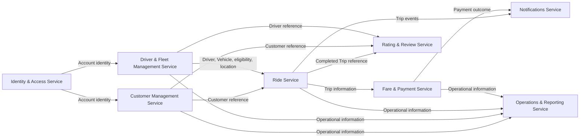

Diagram này thể hiện service dependency ở mức logical design, không phải API call sequence.

## 7. Service Data Ownership

| Service                           | Owned Data                                                                                                 | Source Bounded Context    |
| --------------------------------- | ---------------------------------------------------------------------------------------------------------- | ------------------------- |
| Identity & Access Service         | Account, Authentication Credentials/Information, Role, Account Status                                      | Identity & Access         |
| Customer Management Service       | Customer, Customer Profile, Customer Status                                                                | Customer Management       |
| Driver & Fleet Management Service | Driver, Driver Profile, Vehicle, VehicleType, Driver Approval, Driver Availability, Latest Driver Location | Driver & Fleet Management |
| Ride Service                      | TripRequest, DriverAssignment, Trip, Trip Status, Current Trip ETA                                         | Ride                      |
| Fare & Payment Service            | Fare, Pricing Rule, Payment, Transaction, Payment Method, Provider Reference, Payment Status               | Fare & Payment            |
| Notifications Service             | Notification, Notification Type, Recipient Reference, Delivery State                                       | Notifications             |
| Rating & Review Service           | Rating, Rating Value, Comment, Review                                                                      | Rating & Review           |
| Operations & Reporting Service    | Support Note, Intervention Record, Audit Record, Operational View, Reporting View                          | Operations & Reporting    |

**Invariant:** Mỗi business data chỉ có một owner. Service khác dùng reference/query hoặc dữ liệu cần thiết; không trở thành owner dữ liệu nguồn.

## 8. Service → Use Case Mapping

Nguồn có mã UC và BC ownership nhưng không có tên/mô tả chi tiết từng UC. Primary Service dưới đây được chọn theo responsibility/ownership của BC; với UC nhiều BC, primary/supporting là quyết định logical cần xác nhận khi có use case detail.

| Use Case | Primary Service                   | Supporting Service(s)                                                        | Bounded Context                                    |
| -------- | --------------------------------- | ---------------------------------------------------------------------------- | -------------------------------------------------- |
| UC-01    | Identity & Access Service         | Customer Management Service                                                  | Identity & Access / Customer Management            |
| UC-02    | Customer Management Service       | —                                                                            | Customer Management                                |
| UC-03    | Customer Management Service       | —                                                                            | Customer Management                                |
| UC-04    | Driver & Fleet Management Service | Identity & Access Service                                                    | Identity & Access / Driver & Fleet Management      |
| UC-05    | Driver & Fleet Management Service | —                                                                            | Driver & Fleet Management                          |
| UC-06    | Driver & Fleet Management Service | —                                                                            | Driver & Fleet Management                          |
| UC-07    | Ride Service                      | Customer Management Service                                                  | Ride                                               |
| UC-08    | Ride Service                      | Driver & Fleet Management Service                                            | Ride                                               |
| UC-09    | Ride Service                      | Driver & Fleet Management Service                                            | Ride                                               |
| UC-10    | Ride Service                      | Driver & Fleet Management Service                                            | Ride                                               |
| UC-11    | Ride Service                      | —                                                                            | Ride                                               |
| UC-12    | Ride Service                      | —                                                                            | Ride                                               |
| UC-13    | Ride Service                      | —                                                                            | Ride                                               |
| UC-14    | Ride Service                      | —                                                                            | Ride                                               |
| UC-15    | Driver & Fleet Management Service | —                                                                            | Driver & Fleet Management                          |
| UC-16    | Ride Service                      | —                                                                            | Ride                                               |
| UC-17    | Fare & Payment Service            | Ride Service                                                                 | Fare & Payment                                     |
| UC-18    | Fare & Payment Service            | —                                                                            | Fare & Payment                                     |
| UC-19    | Fare & Payment Service            | —                                                                            | Fare & Payment                                     |
| UC-20    | Fare & Payment Service            | —                                                                            | Fare & Payment                                     |
| UC-21    | Notifications Service             | Ride Service; Fare & Payment Service                                         | Notifications                                      |
| UC-22    | Rating & Review Service           | Ride Service; Customer Management Service; Driver & Fleet Management Service | Rating & Review                                    |
| UC-23    | Operations & Reporting Service    | Customer Management Service                                                  | Operations & Reporting                             |
| UC-24    | Customer Management Service       | Operations & Reporting Service                                               | Customer Management / Operations & Reporting       |
| UC-25    | Customer Management Service       | Operations & Reporting Service                                               | Customer Management / Operations & Reporting       |
| UC-26    | Customer Management Service       | Operations & Reporting Service                                               | Customer Management / Operations & Reporting       |
| UC-27    | Driver & Fleet Management Service | Operations & Reporting Service                                               | Driver & Fleet Management / Operations & Reporting |
| UC-28    | Driver & Fleet Management Service | Operations & Reporting Service                                               | Driver & Fleet Management / Operations & Reporting |
| UC-29    | Driver & Fleet Management Service | Operations & Reporting Service                                               | Driver & Fleet Management / Operations & Reporting |
| UC-30    | Driver & Fleet Management Service | Operations & Reporting Service                                               | Driver & Fleet Management / Operations & Reporting |
| UC-31    | Driver & Fleet Management Service | Operations & Reporting Service                                               | Driver & Fleet Management / Operations & Reporting |
| UC-32    | Driver & Fleet Management Service | Operations & Reporting Service                                               | Driver & Fleet Management / Operations & Reporting |
| UC-33    | Driver & Fleet Management Service | Operations & Reporting Service                                               | Driver & Fleet Management / Operations & Reporting |
| UC-34    | Driver & Fleet Management Service | Operations & Reporting Service                                               | Driver & Fleet Management / Operations & Reporting |
| UC-35    | Ride Service                      | Operations & Reporting Service                                               | Ride / Operations & Reporting                      |
| UC-36    | Fare & Payment Service            | Operations & Reporting Service                                               | Fare & Payment / Operations & Reporting            |
| UC-37    | Operations & Reporting Service    | —                                                                            | Operations & Reporting                             |

Supporting services chỉ thể hiện dependency có căn cứ. Tên và thao tác cụ thể cần được xác nhận từ use case specification trước khi thiết kế contract.

## 9. Transaction Boundary

| Nghiệp vụ                    | Boundary dự kiến                                                         | Phân loại và ghi chú                                                                                                                           |
| ---------------------------- | ------------------------------------------------------------------------ | ---------------------------------------------------------------------------------------------------------------------------------------------- |
| Account registration         | Identity & Access Service                                                | Tạo/quản lý Account nằm trong một service.                                                                                                     |
| Customer creation            | Customer Management Service                                              | Tạo hồ sơ/trạng thái Customer nằm trong một service. Liên kết sau đăng ký Account vượt boundary giữa Identity & Access và Customer Management. |
| Driver registration/approval | Driver & Fleet Management Service; Identity & Access Service cho Account | Hồ sơ, Vehicle và approval thuộc Fleet; Account thuộc IAM. Toàn luồng qua hai owner.                                                           |
| Trip request                 | Ride Service                                                             | Tiếp nhận/lưu TripRequest thuộc Ride; Customer reference là dependency ngoài service.                                                          |
| Driver assignment            | Ride Service                                                             | Quyết định/lưu DriverAssignment thuộc Ride; tra cứu eligibility/availability/location từ Fleet vượt boundary.                                  |
| Trip lifecycle               | Ride Service                                                             | Cập nhật lifecycle/ETA và xác định hoàn thành/hủy nằm trong Ride. Thông báo/reporting vượt boundary.                                           |
| Fare calculation             | Fare & Payment Service                                                   | Pricing Rule và Fare thuộc một service; Trip data đến từ Ride qua boundary.                                                                    |
| Payment                      | Fare & Payment Service                                                   | Payment/transaction/retry/provider outcome nằm trong service; thông báo outcome vượt boundary.                                                 |
| Rating                       | Rating & Review Service                                                  | Ghi Rating nằm trong service; xác minh Trip/Customer/Driver references cần dữ liệu ngoài. Chỉ cho Trip COMPLETED.                              |
| Notification                 | Notifications Service                                                    | Tạo notification và cập nhật delivery state nằm trong service; nhận Trip/Payment events vượt boundary.                                         |

Nguồn không chỉ định transaction phân tán hoặc cơ chế phối hợp. Các luồng liên service là boundary cần xử lý ở bước contract/architecture; không thiết kế Saga/Outbox ở đây.

## 10. Service Coupling Analysis

| Service                           | Depends On                        | Coupling Reason                                             | Coupling Level | Mitigation                                                                    |
| --------------------------------- | --------------------------------- | ----------------------------------------------------------- | -------------- | ----------------------------------------------------------------------------- |
| Identity & Access Service         | Customer Management Service       | Liên kết Account với hồ sơ Customer                         | Medium         | Account business reference; xác định kết quả liên kết trong contract.         |
| Identity & Access Service         | Driver & Fleet Management Service | Liên kết Account identity với hồ sơ Driver                  | Medium         | Dùng Account reference; credentials ở IAM, hồ sơ ở Fleet.                     |
| Customer Management Service       | Ride Service                      | Ride cần xác định Customer cho request                      | Low            | Business Reference; query thông tin hồ sơ khi cần.                            |
| Driver & Fleet Management Service | Ride Service                      | Matching cần eligibility, availability, vehicle và location | High           | Query dữ liệu cần thiết; trả reference/tối thiểu dữ liệu.                     |
| Ride Service                      | Fare & Payment Service            | Fare/payment cần Trip information/finalized data            | Medium         | Business Reference và dữ liệu Trip cần thiết; event/query cần quyết định sau. |
| Ride Service                      | Notifications Service             | Trip events kích hoạt thông báo                             | Low            | Event phù hợp về nghiệp vụ; chưa xác định protocol.                           |
| Fare & Payment Service            | Notifications Service             | Payment outcome cần thông báo                               | Low            | Event phù hợp; không chia sẻ Payment ownership.                               |
| Ride Service                      | Rating & Review Service           | Trip hoàn thành là điều kiện Rating                         | Medium         | Business Reference và Trip Status; event/query cần quyết định sau.            |
| Customer Management Service       | Rating & Review Service           | Xác định Customer gửi Rating                                | Low            | Business Reference; query nếu cần xác minh.                                   |
| Driver & Fleet Management Service | Rating & Review Service           | Xác định Driver được Rating                                 | Low            | Business Reference; query nếu cần xác minh.                                   |
| Customer Management Service       | Operations & Reporting Service    | Customer phục vụ vận hành                                   | Low            | Query hoặc Local Read Model nếu cần; không ghi ngược dữ liệu nguồn.           |
| Driver & Fleet Management Service | Operations & Reporting Service    | Driver/Vehicle phục vụ vận hành                             | Low            | Query hoặc Local Read Model; owner vẫn là Fleet.                              |
| Ride Service                      | Operations & Reporting Service    | Trip phục vụ theo dõi/can thiệp/báo cáo                     | Medium         | Query/Local Read Model; can thiệp phải tôn trọng Trip owner.                  |
| Fare & Payment Service            | Operations & Reporting Service    | Payment phục vụ tra cứu/báo cáo                             | Low            | Query/Local Read Model; Ops không sở hữu Payment.                             |

Mức coupling là định tính theo dependency nghiệp vụ, không phải phép đo triển khai. Command chỉ phù hợp nếu use case yêu cầu owner thực hiện thay đổi; nguồn chưa chỉ rõ command liên service. Event phù hợp với Trip/Payment notifications; Query/Local Read Model phù hợp cho tra cứu vận hành nếu bước sau xác nhận. Business Reference dùng cho quan hệ định danh xuyên boundary.

## 11. Service Boundary Validation

### 11.1 Single Ownership

Mỗi business data có một owner theo BC nguồn. Customer, Driver, Trip và Payment ở service khác chỉ là reference/consumption.

### 11.2 No Shared Business Database

Logical design không giao dữ liệu của service này cho service khác sở hữu. Theo SRS 18.7, cả tám service sử dụng PostgreSQL và mỗi service sở hữu database riêng; không đề xuất shared database.

### 11.3 No Circular Business Dependency

Các hướng chính là IAM → Customer/Fleet → Ride → Fare & Payment → Notifications, Ride/Customer/Fleet → Rating và các BC nghiệp vụ → Operations. Không thấy dependency vòng trực tiếp trong Context Map hoặc dependency logical đã liệt kê.

### 11.4 High Cohesion

Mỗi candidate gom responsibility và data thuộc một BC: TripRequest/assignment/lifecycle ở Ride; Driver/Vehicle/eligibility ở Fleet; fare/payment cùng boundary. Nguồn chưa hỗ trợ tách nhỏ hơn.

### 11.5 Low Coupling

Service trao đổi business reference hoặc thông tin cần thiết. Fleet–Ride là dependency nổi bật vì matching cần eligibility, availability và location. Operations & Reporting tham chiếu dữ liệu nguồn, không sở hữu chúng.

### 11.6 Independent Deployment

Cả 8 candidate có thể được xem là boundary triển khai độc lập về logical design nếu contract và data access được định nghĩa rõ. Registration qua IAM và Customer/Fleet, Ride với matching/Fare, và Ops intervention có thể cần phối hợp; khả năng độc lập thực tế chưa thể kết luận.

### 11.7 Bounded Context Consistency

Mỗi candidate thuộc đúng một BC và chỉ sở hữu dữ liệu của BC đó. Không tạo service xuyên BC để gom business data gốc hoặc tách entity thành service riêng.

## 12. Final Candidate Service List

|   # | Service                           | Bounded Context           | Main Responsibility                                               | Owned Data                                                                                   |
| --: | --------------------------------- | ------------------------- | ----------------------------------------------------------------- | -------------------------------------------------------------------------------------------- |
|   1 | Identity & Access Service         | Identity & Access         | Account identity, authentication, authorization                   | Account, Authentication Credentials/Information, Role, Account Status                        |
|   2 | Customer Management Service       | Customer Management       | Customer profile and lifecycle                                    | Customer, Customer Profile, Customer Status                                                  |
|   3 | Driver & Fleet Management Service | Driver & Fleet Management | Driver/fleet records and trip eligibility                         | Driver, Driver Profile, Vehicle, VehicleType, Approval, Availability, Latest Driver Location |
|   4 | Ride Service                      | Ride                      | Booking, matching/dispatch and Trip lifecycle                     | TripRequest, DriverAssignment, Trip, Trip Status, Current Trip ETA                           |
|   5 | Fare & Payment Service            | Fare & Payment            | Fare calculation and payment lifecycle                            | Fare, Pricing Rule, Payment, Transaction, Payment Method, Provider Reference, Payment Status |
|   6 | Notifications Service             | Notifications             | Notification creation/delivery                                    | Notification, Notification Type, Recipient Reference, Delivery State                         |
|   7 | Rating & Review Service           | Rating & Review           | Post-trip rating and review                                       | Rating, Rating Value, Comment, Review                                                        |
|   8 | Operations & Reporting Service    | Operations & Reporting    | Operational support, controlled intervention, audit and reporting | Support Note, Intervention Record, Audit Record, Operational View, Reporting View            |

## 13. Final Service Decomposition Diagram

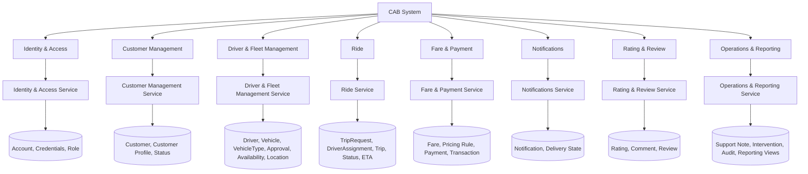

Các node dữ liệu minh họa nhóm owned data, không mô tả database/schema.

## 14. Decisions & Assumptions

### Confirmed from Source

- Có 8 BC như liệt kê trong tài liệu nguồn.
- Account/Role thuộc Identity & Access; Customer Profile thuộc Customer Management; Driver Profile/Vehicle thuộc Driver & Fleet Management; TripRequest/DriverAssignment/Trip/ETA thuộc Ride; Fare/Payment thuộc Fare & Payment; Notification thuộc Notifications; Rating/Comment thuộc Rating & Review; Support Note/Intervention/Audit/Reporting View thuộc Operations & Reporting.
- Ride quyết định assignment và Trip lifecycle; Fare & Payment nhận thông tin Trip; Notifications nhận sự kiện; Rating chỉ áp dụng cho Trip hoàn thành; Operations & Reporting không sở hữu dữ liệu nghiệp vụ gốc khác.
- UC-01–UC-37 và BC ownership được giữ theo nguồn.

### Design Decisions

- Chọn một Candidate Service cho mỗi BC vì nguồn chưa đưa ra bằng chứng đủ để tách thêm responsibility, ownership hoặc UC.
- Giữ Driver, Vehicle, approval, availability và latest location cùng nhau để bảo toàn responsibility eligibility/matching hiện có.
- Giữ TripRequest, DriverAssignment, Trip lifecycle và ETA cùng Ride vì cùng vòng đời.
- Giữ Fare và Payment cùng service vì nguồn đặt chung ownership/trách nhiệm.
- Chọn primary service cho UC nhiều BC theo responsibility owner; đây là quyết định logical vì nguồn không cung cấp tên/mô tả UC.
- Phân loại một số dependency synchronous/asynchronous candidate theo mục đích nghiệp vụ, không xác định protocol.

### Open Decisions

- Tên, luồng và transaction cụ thể từng UC, nhất là UC nhiều BC ownership.
- Phối hợp Account registration với tạo hồ sơ Customer/Driver.
- Cách Ride truy vấn eligibility/location và đồng bộ DriverAssignment với availability.
- Exact Ride → Fare calculation/finalization trigger and timing.
- Quyền hạn, loại command can thiệp, audit detail và nhu cầu freshness của Operations & Reporting.
- Tải, bảo mật chi tiết, latency và nhu cầu scale độc lập để xác nhận deployment boundary.
- Lower-level query payload fields and source-owner query pagination/update watermark details.


---

## Runtime Architecture

Service communication details and Contract IDs are authoritative in [04 Integration Contracts](04_Integration_Contracts.md). The runtime baseline below preserves the frozen deployment and operational decisions.


## 3. Runtime communication

The frozen transport model is public REST/HTTPS/JSON (`/api/v1`) at the API Gateway, Gateway-to-service gRPC, synchronous service-to-service REST/HTTP, and asynchronous Kafka for the four baseline events. The authoritative interaction matrix, Contract IDs, and exact producer/consumer mapping appear once in [04 Integration Contracts](04_Integration_Contracts.md). `EVT-FP-002` remains candidate/inactive. The fare calculation/finalization trigger and timing remain open for detailed design; candidate interactions must not be assumed active.

## 4. API Gateway and ingress

The Gateway is the only public application ingress. It terminates external TLS and REST/JSON, routes existing `/api/v1` OpenAPI operations, validates bearer access tokens, applies route-level authorization boundaries and rate limits, creates/propagates `requestId` and `correlationId`, and enforces payload/header limits. It invokes the target service using a gRPC downstream client; each service provides a Gateway-facing gRPC server/handler. Exact RPC method/schema mapping remains TBD where the existing contract is insufficient and must not be inferred mechanically from REST paths. The Gateway forwards identity claims as verifiable context; downstream services validate identity and enforce resource/business authorization. The Gateway contains no business rules, service data access, or business database credentials. Service-to-service synchronous calls stay REST/HTTP per 04/05.

Services are registered on the private service network using stable Compose DNS names locally and a platform service-discovery mechanism in later deployments. Gateway route configuration names an internal service and port; no service address is published to the host except the Gateway and explicitly chosen local development tooling.

## 5. Event architecture

### 5.1 Broker decision

**TAD: Apache Kafka** as the event broker. Its durable partitioned log supports event-driven consumers, replay/recovery, scalable consumer groups, and per-key ordering. At-least-once processing is implemented through manual/controlled offset acknowledgement after successful idempotent handling, bounded retry, and dead-letter topics. Kafka can run locally in Docker Compose; use a single-node KRaft configuration for development, with production replication and availability configured separately. These mechanics do not alter event meaning or introduce events.

### 5.2 Event routes

| Contract | Publisher | Kafka topic | Consumer | Business key |
|---|---|---|---|---|
| EVT-RID-001 `TripLifecycleChanged` | Ride | `cab.ride.trip-lifecycle-changed.v1` | Notifications | `tripReference` |
| EVT-RID-002 `TripCompleted` | Ride | `cab.ride.trip-completed.v1` | Notifications | `tripReference` |
| EVT-RID-003 `TripCanceled` | Ride | `cab.ride.trip-canceled.v1` | Notifications | `tripReference` |
| EVT-FP-001 `PaymentOutcomeRecorded` | Fare & Payment | `cab.fare-payment.payment-outcome-recorded.v1` | Notifications | `paymentReference` (or trip reference when contract defines trip-scoped ordering) |

Each record carries the 05 envelope: `eventId`, `eventType`, `eventVersion`, `occurredAt`, producer, `correlationId`, and payload with business references. `aggregateId`/Kafka key is the relevant business key (Trip or payment). Payload is the source contract's minimal business data; credentials, provider secrets, and payment credentials are prohibited. Unknown optional fields are ignored; unsupported versions are quarantined for operator review.

Delivery is at least once. Consumers persist processed `eventId` values (or equivalent deduplication key) alongside their local effect and make handlers idempotent. Retry transient errors with bounded exponential backoff; do not endlessly retry permanent schema/business errors. After configured attempts, route to a DLQ topic retaining the original event and failure metadata, alert operations, correct the issue, then replay safely. Partition by business key for per-key ordering; global ordering is not guaranteed. Consumers validate lifecycle/state and tolerate duplicates and late records.

**Outbox recommendation:** a producer writes its owned state change and outbox record in one local database transaction; a publisher relays committed outbox records to Kafka and marks them delivered. This prevents database/event publication drift without a distributed transaction. Consumer offset is committed only after its idempotent local transaction succeeds. Retention, retry count, and DLQ duration are environment configuration decisions.

## 6. Security architecture

### 6.1 Client identity

Clients connect using HTTPS and authenticate through Identity & Access. Use JWT bearer access tokens as a TAD consistent with the contract. The Gateway validates signature, issuer, audience, expiry, and allowed algorithm; it rejects invalid tokens and forwards token/claims context without logging it. Services validate the signed token or trusted delegated context and independently authorize the requested action and owned resource. Login credentials travel only to Identity & Access over TLS. Passwords are stored as salted adaptive password hashes, never plaintext or reversible encryption.

### 6.2 Service identity and internal transport

**TAD: mutual TLS (mTLS)** for Gateway-to-service gRPC, service-to-service REST/HTTP, and broker client connections. Gateway and each service have distinct workload identities and certificates; peers verify certificate identity and authorize only contract-specific callers/topics. The local Compose profile may use a development CA and short-lived local certificates; production uses managed issuance and rotation. Internal network membership alone is not authorization. Where mTLS termination is delegated to a mesh/proxy, the proxy must preserve verified workload identity to the service.

Apply least privilege to database users, Kafka ACLs, service identities, and operations routes. JWT signing keys, certificates/private keys, DB passwords, provider credentials, and broker credentials come from runtime secret mounts or an external secret manager, never source control or images. `.env.example` contains names/placeholders only; actual `.env` is ignored by Git. Rotate secrets and certificates without embedding them in event payloads or logs.

## 7. Data and database deployment

Each of the eight services owns its PostgreSQL database; business entities have one authoritative owner. Cross-service entity relationships use references and never cross-database foreign keys. Within the Fare & Payment database, `Payment.fareId` is a same-database foreign key to its Fare; `transactionType` remains a normal field. This distinction is represented in the ERD.

Exactly eight PostgreSQL databases are owned independently, one per service. Each service has a dedicated database credential restricted to its own database; the local topology uses a separate PostgreSQL container/database per service. No cross-service joins, foreign keys, credentials, or connection strings are permitted. Notifications persists Notification, `recipientAccountId` (a reference to Identity & Access Account, not an FK), and `isRead` in Notifications DB. Operations & Reporting persists its aggregate `ReportingView` snapshot in Operations DB; source data remains in Ride, Fare & Payment, and Driver & Fleet.

### 7.1 Reporting projection refresh and KPI contract

Operations & Reporting does not consume Kafka. A scheduled refresh runs every minute and reads source facts only through existing synchronous REST contracts `QRY-OPS-002` (Driver/Fleet reference and display data), `QRY-OPS-003` (Trip and assignment facts), and `QRY-OPS-004` (Payment/Transaction facts). Queries are paginated and incremental by owner update time; refresh replaces/upserts the aggregate `ReportingView` snapshot in one local transaction. No source database is accessed directly and no event or Contract ID is added for ingestion. If refresh age exceeds five minutes, dashboard responses set `isStale=true` and include the last successful `refreshedAt`.

Dashboard query `QRY-OPS-005` serves the existing `GET /operations/dashboard` route through Gateway REST/JSON → gRPC. The aggregate `ReportingView.metricValues` JSONB stores `tripCount`, `revenue`, `completionRate`, `cancellationRate`, per-driver performance and payment metrics; reference values in the JSON are not FKs. The default reporting window is the trailing 30 days in UTC; callers may provide UTC `periodStart` and `periodEnd`. Definitions: trip count counts unique Ride trips requested in the window; completion and cancellation rates use terminal trips closed in the window as denominator (`Completed + Canceled + Failed`), with respective numerators `Completed` and `Canceled`; revenue sums Payment amount for `Paid` status changes in the window; per-driver performance lists drivers with accepted assignments and calculates completed trips / accepted assignments; payment metrics group payment count and amount by method/status. Rates are percentages 0–100; empty denominators yield zero. Only paid amounts contribute to revenue. The projection is a read model, not a source of truth.

## 8. Docker network and topology

Use two Docker networks: `edge` connects Gateway to the public ingress and selected internal services; `backend` is internal-only and connects the Gateway, eight services, broker, and databases. Databases and broker expose no host ports by default. Only Gateway publishes a host port. Service DNS names are Compose service names. Secrets/configuration are injected per service; no service receives another service's DB credentials.

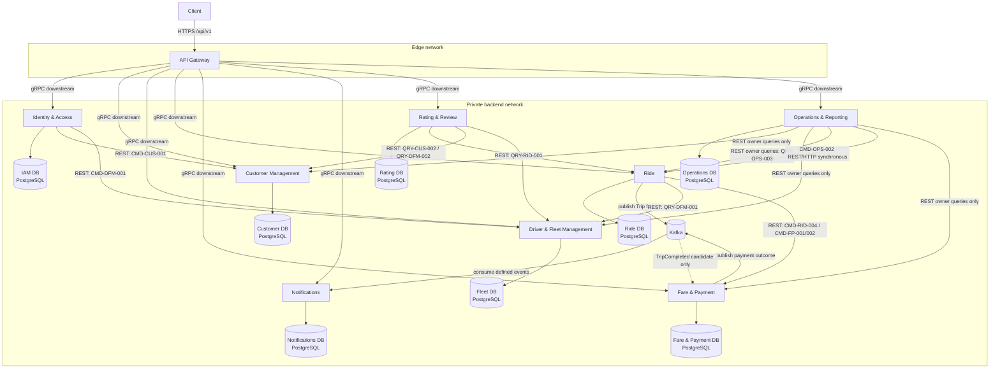

Solid arrows show baseline communication; the dashed Fare event arrow is an inactive candidate. Public ingress is REST/JSON, Gateway-to-service arrows are gRPC, internal synchronous arrows are REST/HTTP, and async arrows use Kafka. Every service's database is reachable only by that owner service. These transports use TLS/mTLS.

### 8.1 Compose components and readiness

Compose includes API Gateway; all eight services; eight owned databases; Kafka in single-node KRaft mode; and optional metrics/log/tracing collectors. Every app waits on its own database health and broker health where needed. A container being started does not mean it is ready. Each service provides liveness and readiness endpoints; readiness checks its ability to serve required operations and required dependencies, while optional integrations are reported separately. Compose `depends_on: condition: service_healthy` can order startup but services must still reconnect with bounded backoff after runtime dependency loss.

## 9. Configuration and secrets

Non-secret configuration includes service ports, public base URL, `/api/v1` route settings, timeout/retry limits, log level, Kafka topic/group names, and health intervals. Secrets include DB passwords/connection credentials, JWT signing/verification key material, mTLS private keys, broker credentials, and external payment-provider credentials. Configuration is service-specific environment variables; secrets are mounted files or secret-manager references. `.env.example` documents required variable names and safe local defaults only. Never commit real `.env`, certificates, keys, or credentials.

Each service receives only its own DB connection string and the broker permissions it needs. Identity & Access alone receives password-hash and token-signing capability. Provider credentials are restricted to Fare & Payment. Secret rotation and missing-secret startup behavior are explicit operational configuration, not fallback hard-coded values.

## 10. Resilience and operational behavior

- Set connect/response timeouts on every internal REST call and deadlines on Gateway gRPC calls; propagate an end-to-end deadline where supported. Initial local defaults may follow 05, then be tuned against service latency/SLOs.
- Retry only transient network/5xx failures with capped exponential backoff and jitter. Do not retry validation, authorization, or other permanent business errors. Never retry indefinitely.
- Use circuit breakers for repeated downstream failures; return a contract error or controlled unavailable response rather than cascading failure.
- Side-effect commands use the contract's idempotency behavior and `Idempotency-Key` where appropriate. Store key, request fingerprint, and outcome within the owner service. Duplicate requests return the original result; conflicting reuse is rejected.
- Kafka consumers use bounded retry, DLQ, eventId deduplication, and safe replay. Outbox relay retries publication without creating duplicate business effects.
- Payment unknown outcomes are resolved through owner-side status checking/reconciliation before retry; do not blindly repeat a provider charge. Payment retry does not change Ride lifecycle.
- Registration is two local owner writes coordinated by synchronous commands, not a distributed transaction. Partial completion follows the source's open recovery decision; do not invent rollback/compensation semantics here.

## 11. Observability

Emit structured JSON logs with `timestamp`, service, environment, severity, `requestId`, `correlationId`, trace/span identifiers where enabled, and contract/operation identifier. Gateway creates a request ID when absent and forwards it; correlation context is propagated over Gateway gRPC metadata and internal REST headers, then copied into event envelopes. Consumers restore correlation context from the event. This supports tracing Client → Gateway → services → broker → consumer.

Expose liveness, readiness, request/error/latency metrics, dependency health, broker consumer lag, retry/DLQ counts, and outbox backlog. Use distributed tracing (OpenTelemetry-compatible instrumentation) as a technical observability mechanism. Do not log passwords, bearer tokens, secret material, full sensitive payment data, or unfiltered provider payloads. Restrict operational dashboards and traces to authorized roles.

## 12. Runtime flow sequences

These diagrams show runtime interactions supported by 04/05. They intentionally omit business rules and do not add contract operations. CMD-OPS-002 is finalized by SRS and shown below; only internal audit persistence schema detail remains open.

### 12.1 Register Customer

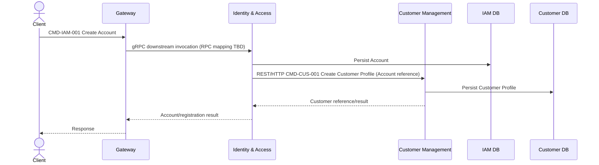

### 12.2 Register Driver

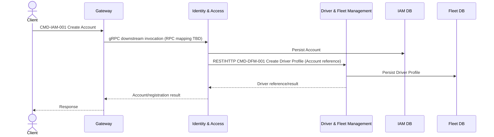

### 12.3 Login

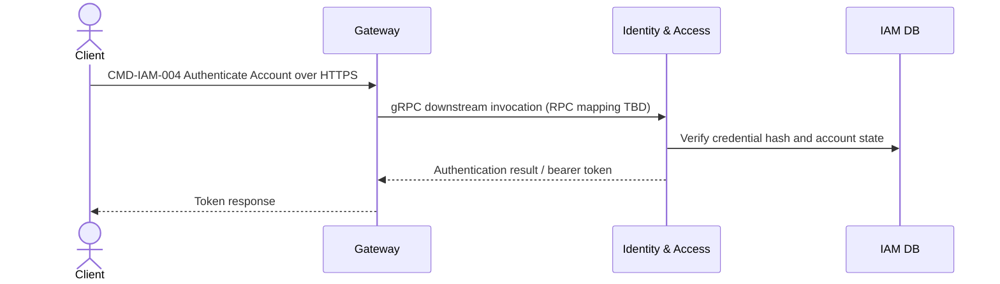

### 12.4 Request Ride

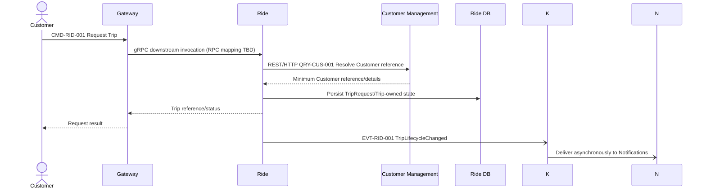

### 12.5 Driver Matching

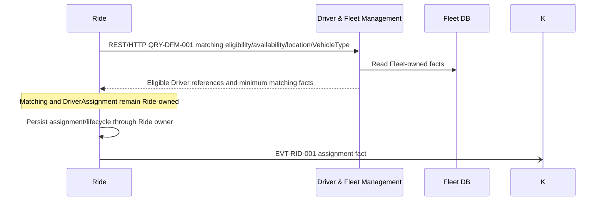

### 12.6 Driver Accept Trip

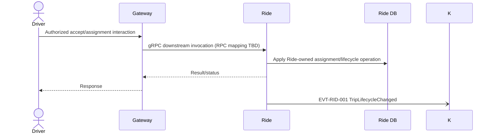

The exact accept operation/contract ID is not separately specified in 05; this runtime step must use the Ride-owned lifecycle operation already defined by CMD-RID-003 and must not be exposed as a new contract without contract revision.

### 12.7 Trip Lifecycle

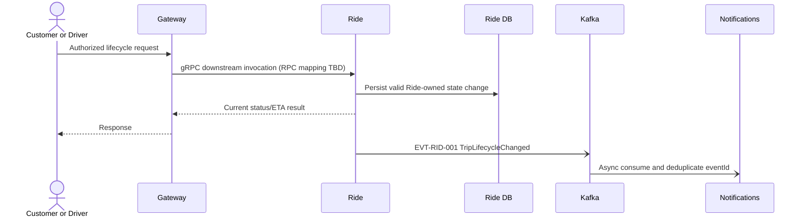

### 12.8 Trip Completion → Fare/Payment

The following diagrams show two contract interactions separately; their relative ordering is intentionally unspecified because the exact Fare trigger/timing remains open in 05.

**A. Ride completion and Notifications event delivery**

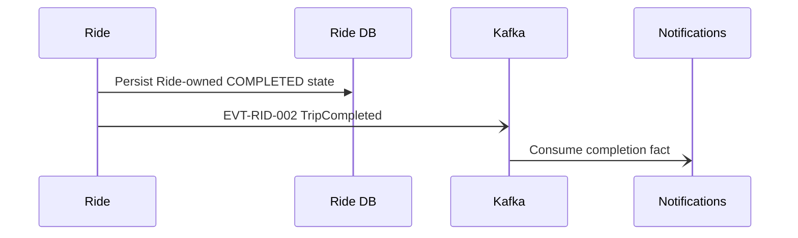

**B. Synchronous Ride-to-Fare contract interaction**

```mermaid
sequenceDiagram
  participant R as Ride
  participant F as Fare & Payment
  participant DF as Fare DB
  R->>F: CMD-RID-004 / CMD-FP-001/002 Calculate or Finalize Fare
  F->>DF: Persist Fare-owned state as applicable
  F-->>R: Fare result/reference
  Note over R,F: Exact timing/trigger remains open in 05; confirm before implementation
```

The Ride-to-Fare synchronous contract remains baseline. The `TripCompleted` event is consumed by Notifications; Fare & Payment's consumption of `TripCompleted` under `EVT-FP-002` remains candidate/inactive and is not part of the baseline flow. Do not infer whether Fare runs before or after completion publication from these separate diagrams.

### 12.9 Payment Outcome → Notification

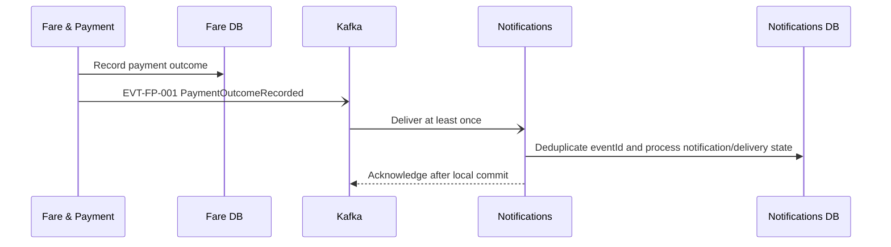

### 12.10 Trip Completion → Rating

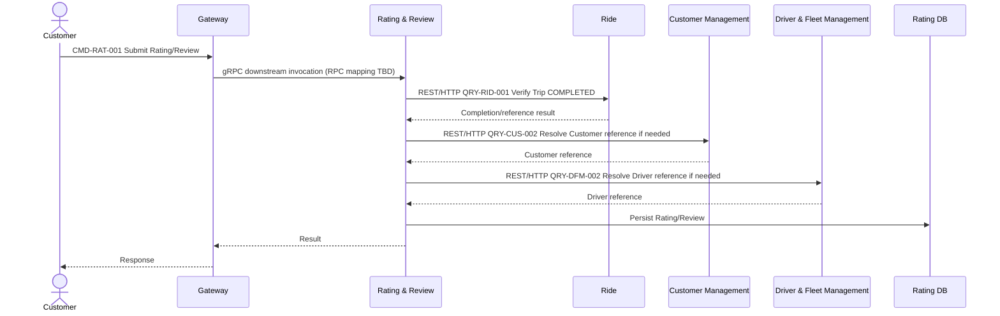

### 12.11 Trip Cancellation

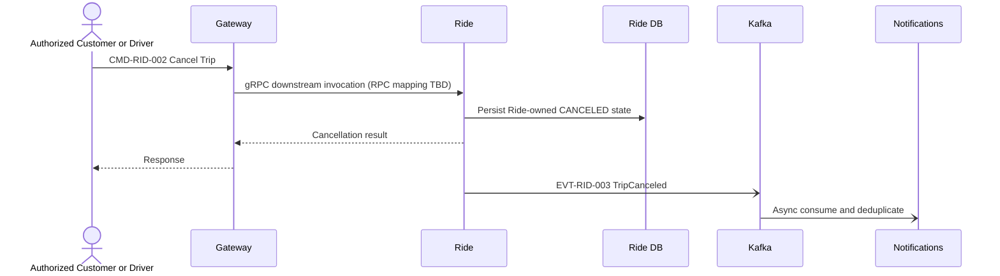

### 12.12 Operations Trip Intervention (`CMD-OPS-002`)

```mermaid
sequenceDiagram
  actor Supervisor as OperationsSupervisor
  participant G as API Gateway
  participant O as Operations & Reporting
  participant R as Ride Service
  participant DR as Ride Database
  Supervisor->>G: POST /operations/trips/{tripId}/interventions (REST/HTTPS/JSON)
  G->>O: gRPC downstream call; verify Supervisor role
  O->>O: Validate required reason and second confirmation
  O->>R: CMD-OPS-002 over REST/HTTP (synchronous)
  R->>DR: Validate eligibility; update Ride-owned Trip
  DR-->>R: Updated Trip state
  R-->>O: Intervention outcome and before/after state
  O->>O: Record audit (actor, role, action, entity, reason, before/after, createdAt, correlationId)
  O-->>G: Result
  G-->>Supervisor: Intervention response
```

OperationsStaff intervention attempts receive 403 and leave Trip unchanged (AC-172). Ride alone validates the business rule and updates Trip. Operations never accesses Ride Database; no Kafka event is emitted for the intervention. Audit detail beyond SRS-defined fields is open technical schema work.

## 14. Technical Architecture Decisions

| Decision | Choice | Reason | Impact |
|---|---|---|---|
| API Gateway technology | Kong Gateway in DB-less declarative mode for local deployment | Docker-ready routing, TLS termination, JWT validation, and rate-limit plugins in one Gateway runtime | Keep resource/business authorization in services; Gateway verifies token and applies route boundary without changing contracts |
| Public and Gateway downstream transport | Client → Gateway uses REST/HTTP/JSON; Gateway → each service uses gRPC | Keeps the existing OpenAPI public API and uses gRPC for Gateway IPC | Gateway terminates REST and invokes the target service gRPC server; exact RPC mapping is TBD where existing contracts are insufficient |
| Message Broker | Apache Kafka, single-node KRaft locally | Durable event log, replay, consumer groups, partition ordering, retry/DLQ patterns, scalable event throughput, Docker support | Partition by business key; production requires replicated cluster and operational capacity |
| Service-to-service communication | REST/HTTP for existing synchronous commands/queries; Kafka only for four contracted events | Preserves the interactions and dependencies in 04/05 | Do not convert internal REST calls to gRPC or add service dependencies |
| Service discovery | Docker Compose DNS locally; platform-native service discovery in deployment | Stable internal names without hard-coded IPs | Gateway and callers use service names; no public service ports |
| Authentication | Identity & Access-issued JWT bearer access token, validated at Gateway and services | Consistent with 05 external token flow and independent target authorization | Key rotation, issuer/audience validation and claim policy required |
| Gateway/service and service-to-service security | mTLS with workload identity and peer authorization | Protects Gateway gRPC, internal REST and broker connections | Certificate issuance/rotation and local development CA needed |
| Database deployment | PostgreSQL database per service; eight isolated local PostgreSQL databases/containers and credentials | Enforces 04/05 ownership and prevents cross-service access | More containers locally; independent migrations/backups |
| Configuration/secrets | Service-specific environment configuration; mounted secrets locally/external secret manager in deployed environments | Separates deploy-time configuration from sensitive credentials | `.env.example` only in Git; rotate external secrets |
| Health/readiness | Liveness and readiness HTTP endpoints; Compose healthchecks and dependency health gates | Distinguishes process-up from able-to-serve | Readiness reflects required dependencies; runtime reconnect remains necessary |
| Retry/resilience | Bounded retries with exponential backoff/jitter, timeouts, circuit breakers, idempotency | Prevents infinite retry and cascading failure | Tune values against observed latency; payment unknown outcomes reconcile first |
| Event delivery semantics | At-least-once, eventId dedupe, idempotent handlers, bounded retry and DLQ | Preserves source semantics and supports recovery | No exactly-once claim; consumers handle duplicates/out-of-order delivery |
| Local deployment strategy | Docker Compose, private backend network, only Gateway published, single-node Kafka and isolated service DBs | Reproducible local topology with clear ownership boundaries | Local HA differs from production; secrets remain local-only |

All choices above are technical. They do not revise business decisions, source contract IDs, ownership, or lifecycle semantics.

## 15. Architecture validation

### Boundary
- [x] Exactly 8 services
- [x] No service owns another service's data
- [x] No shared business database
- [x] No cross-service DB access

### Communication
- [x] Client → Gateway uses REST/HTTP/JSON `/api/v1`
- [x] Gateway → eight services uses gRPC; RPC mapping stays TBD where source contracts are insufficient
- [x] Existing synchronous service → service interactions use REST/HTTP
- [x] API Gateway is the only public ingress
- [x] Internal service communication follows 05 contracts
- [x] Message Broker for contracted events
- [x] Event-driven communication without inventing business events

### Reliability
- [x] Idempotency for side-effect commands/consumers
- [x] Bounded retry and DLQ
- [x] Timeouts
- [x] At-least-once delivery
- [x] Deduplication by eventId or equivalent
- [x] Outbox pattern recommended

### Security
- [x] HTTPS at public ingress
- [x] JWT/Bearer authentication
- [x] Authorization at Gateway boundary and target service
- [x] Per-service identity
- [x] TLS/mTLS for internal communication
- [x] Secrets externalized from source and images
- [x] Passwords stored as salted hashes, never plaintext

### Deployment
- [x] Docker Compose local topology
- [x] Edge and private backend Docker networks
- [x] Database per Service
- [x] Compose healthchecks
- [x] Readiness distinct from liveness
- [x] Service discovery via Compose DNS locally

### Observability
- [x] `requestId`
- [x] `correlationId` across HTTP and events
- [x] Structured logging
- [x] Metrics including broker lag/retry/DLQ
- [x] Health/readiness endpoints


## 3. 04 — Integration Contracts

Nguồn: `04_Integration_Contracts.md`.

# 04 Integration Contracts — CAB System

## 5.1 Purpose

Tài liệu này chuyển logical interaction contract trong `03_System_Architecture.md` thành technical communication contract cho đúng tám service CAB System. Tài liệu chốt loại tương tác, hình dạng envelope, quy tắc lỗi, retry, idempotency, versioning và security boundary; không phải đặc tả code hay hạ tầng.

## 5.2 Scope

Phạm vi gồm public REST contract, Gateway downstream IPC, synchronous service-to-service command/query và business event bất đồng bộ. Public API tiếp tục theo OpenAPI; các RPC mapping cụ thể chưa được định nghĩa tại tài liệu này nếu Contract ID/API contract chưa cung cấp đủ chi tiết.

Business contract có một số chi tiết chưa xác định. Tài liệu đánh dấu `OPEN DECISION` ở đúng các điểm đó; việc lựa chọn giao thức hoặc envelope không được hiểu là bổ sung business requirement. `AccountCreated`, `CustomerProfileCreated`, `DriverProfileCreated`, `TripStarted`, `PaymentCompleted`, `PaymentFailed`, `RatingSubmitted` và `NotificationRequested` không được mặc định là event đã chốt. Chỉ event fact có căn cứ trong 04 được đưa vào catalog; các tên cụ thể được chuẩn hóa ở đây ở mức technical contract và cần tương thích với source.

## 5.3 Contract Principles

- Một service chỉ đọc hoặc thay đổi dữ liệu qua contract của service sở hữu dữ liệu. Database per service; không shared database/table, không truy cập database trực tiếp.
- Command yêu cầu một side effect do owner thực hiện; query chỉ đọc dữ liệu và không side effect; event là fact đã xảy ra, không phải yêu cầu thực hiện.
- Payload chỉ mang business identifier/reference và trường tối thiểu cần cho consumer. Không công khai entity nội bộ, credential, schema lưu trữ hoặc dữ liệu nhạy cảm không cần thiết.
- Side-effect command có thể được gửi lại phải có idempotency strategy phù hợp. Consumer event phải dung nạp duplicate.
- Không dùng distributed transaction. Cross-service flow chấp nhận trạng thái trung gian và phối hợp qua response/event phù hợp.
- Contract technical không đổi bounded context, service boundary, ownership, responsibility, dependency, invariant hoặc use case ownership trong 04.

## 5.4 Communication Strategy

| Decision | Chọn cho tài liệu này | Lý do và trade-off |
|---|---|---|
| Public API | Client → API Gateway = REST/HTTP/JSON, phiên bản `/api/v1` | Public API source là OpenAPI hiện có trong `api-document/`. |
| Gateway downstream IPC | API Gateway → mỗi microservice = gRPC | Gateway chuyển REST request thành gRPC invocation; gRPC server/handler thuộc target service. RPC method/schema mapping chưa được suy diễn ở đây. |
| Internal synchronous IPC | Service → Service = REST/HTTP theo interactions đã xác định trong 04/05 | Giữ command/query synchronous hiện có. Không chuyển các interaction này sang gRPC và không thêm dependency. |
| Asynchronous communication | Service → Kafka → consumer, at-least-once | Kafka được chọn trong 06; chỉ dùng event IDs đã có trong catalog. Consumer xử lý duplicate/retry/DLQ theo contract/runtime design. |

| Interaction layer | Transport | Purpose |
|---|---|---|
| Client → Gateway | REST/HTTP/JSON | Public API theo OpenAPI hiện tại |
| Gateway → Service | gRPC | Internal downstream invocation; RPC mapping chi tiết TBD |
| Service → Service | REST/HTTP | Existing synchronous business interaction trong 04/05 |
| Service → Kafka | Kafka | Async event communication theo event catalog hiện có |

Gateway gRPC downstream là lớp chuyển tải các public operations hiện có; nó không tạo thêm business capability/Contract ID. Gateway-facing gRPC server/handler được yêu cầu cho tám service, nhưng RPC mapping là TBD nếu contract hiện tại chưa đủ thông tin. Sync service-to-service tiếp tục REST/HTTP. Event dùng khi consumer phản ứng với business fact mà caller không cần chờ consumer hoàn thành. Không biến mọi logical reference thành API call.

## 5.5 Communication Matrix

| From Service | To Service | Interaction | Type | Protocol | Purpose | Sync/Async |
|---|---|---|---|---|---|---|
| Identity & Access | Customer Management | Create Customer Profile với Account reference sau khi tạo Account | Command | REST/HTTP | Tạo profile bởi owner | Sync |
| Identity & Access | Driver & Fleet Management | Create Driver Profile với Account reference sau khi tạo Account | Command | REST/HTTP | Tạo profile bởi owner | Sync |
| Ride | Fare & Payment | Calculate/Finalize Fare; nhận finalized fare reference/information | Command + response; query nếu cần lấy lại kết quả | REST/HTTP | Fare owner thực hiện calculation/finalization | Sync; trigger/payment timing OPEN DECISION |
| Rating & Review | Ride | Lấy/verify Trip completion | Query | REST/HTTP | Chỉ cho phép rating với Trip COMPLETED | Sync; event alternative chưa chốt |
| Ride | Notifications | Trip request/assignment/status/completion/cancellation facts | Event | Kafka (selected in 06) | Tạo/gửi notification phù hợp | Async |
| Fare & Payment | Notifications | Payment outcome fact | Event | Kafka (selected in 06) | Thông báo outcome payment | Async |
| Ride | Customer Management | Customer profile/reference query cần cho Ride | Query | REST/HTTP | Xác nhận/tham chiếu Customer | Sync; fields tối thiểu OPEN |
| Ride | Driver & Fleet Management | Eligible drivers, availability, latest location, VehicleType reference | Query | REST/HTTP | Matching; Ride không sở hữu Fleet data | Sync |
| Operations & Reporting | Customer Management | Customer query | Query | REST/HTTP | Hỗ trợ/tra cứu vận hành | Sync |
| Operations & Reporting | Driver & Fleet Management | Driver/Vehicle query | Query | REST/HTTP | Hỗ trợ/tra cứu vận hành | Sync |
| Operations & Reporting | Ride | Trip query | Query | REST/HTTP | Theo dõi/hỗ trợ Trip | Sync |
| Operations & Reporting | Fare & Payment | Payment/transaction query | Query | REST/HTTP | Tra cứu giao dịch | Sync |
| Operations & Reporting | Ride | CMD-OPS-002 — Supervisor Trip intervention | Command | REST/HTTP | Ride validates eligibility and owns Trip update; OperationsStaff is forbidden (403), OperationsSupervisor may cancel an unfinished Trip or close a failed Trip as `Failed`; required reason and second confirmation; Operations records audit | Synchronous; finalized baseline |
| Customer Management | Identity & Access | Resolve/verify Account identity khi cần | Query/reference | REST/HTTP nếu cần xác minh | Liên kết Account reference | Conditional sync; không bắt buộc nếu reference đủ |
| Driver & Fleet Management | Identity & Access | Resolve/verify Account identity khi cần | Query/reference | REST/HTTP nếu cần xác minh | Liên kết Account reference | Conditional sync; không bắt buộc nếu reference đủ |
| Rating & Review | Customer Management | Resolve Customer reference khi cần | Query | REST/HTTP | Xác định evaluator | Sync |
| Rating & Review | Driver & Fleet Management | Resolve Driver reference khi cần | Query | REST/HTTP | Xác định subject của rating | Sync |

Các dòng Client/Gateway trong service/API catalogs mô tả public REST operation; Gateway dùng gRPC downstream cho invocation tương ứng. Các dòng service-to-service trong matrix này giữ REST/HTTP. Contract IDs, command/query semantics và RPC method names không được suy ra từ nhau; RPC mapping remains TBD where the existing contract is insufficient.

## 5.6 Identity & Access Service

### 5.6.1 Service Communication Contract

- **Responsibility:** Account, authentication, authorization và role/account status theo 04.
- **Exposed Commands:** Create Account; Authenticate Account; Manage Role/Account Status. Role/status details OPEN.
- **Exposed Queries:** Resolve Account Identity; Check Authentication/Authorization State trong phạm vi đã xác nhận.
- **Published Events:** Không publish registration event trong baseline. 04 nói rõ logical coordination bằng command/reference; không tự tạo `AccountCreated`.
- **Consumed Events:** Không xác định trong 04.
- **Synchronous Dependencies:** Sau Create Account, cung cấp Account identity/reference tới service profile tương ứng. `CMD-CUS-001` là command do Customer Management sở hữu để tạo Customer Profile; `CMD-DFM-001` là command do Driver & Fleet Management sở hữu để tạo Driver Profile. Identity & Access không sở hữu hai business operation này.
- **Asynchronous Dependencies:** Không xác định.

### 5.6.2 Contracts

| Contract ID | Type | From | To | Purpose | Protocol |
|---|---|---|---|---|---|
| CMD-IAM-001 | Command | Client/Gateway | Identity & Access | Create Account | REST/HTTP |
| CMD-IAM-004 | Command | Client/Gateway | Identity & Access | Authenticate Account | REST/HTTP |
| QRY-IAM-001 | Query | Internal authorized caller | Identity & Access | Resolve Account identity/auth state nếu contract consumer cần | REST/HTTP |

Create Account API chỉ trả Account identity/reference và authentication result cần thiết; không trả credential. Nếu profile creation thất bại sau Account creation, hệ thống có partial outcome; rollback/distributed transaction không được giả định. Recovery/compensation cho registration là OPEN DECISION.

## 5.7 Customer Management Service

### 5.7.1 Service Communication Contract

- **Responsibility:** Customer profile và lifecycle.
- **Exposed Commands:** Create/Update Customer Profile; Change Customer Status.
- **Exposed Queries:** Customer profile/reference và status tối thiểu.
- **Published Events:** Không có event được 04 xác nhận.
- **Consumed Events:** Không có event. Nhận Create Customer Profile command từ Identity & Access.
- **Synchronous Dependencies:** Identity & Access identity resolution chỉ khi reference cần xác minh; Operations query; Ride/Rating query/reference theo nhu cầu.
- **Asynchronous Dependencies:** Không xác định.

### 5.7.2 Contracts

| Contract ID | Type | From | To | Purpose | Protocol |
|---|---|---|---|---|---|
| CMD-CUS-001 | Command | Identity & Access | Customer Management | Create Customer Profile | REST/HTTP |
| CMD-CUS-002 | Command | Authorized client/Gateway | Customer Management | Update Customer Profile | REST/HTTP |
| CMD-CUS-003 | Command | Authorized client/Gateway | Customer Management | Change Customer Status | REST/HTTP |
| QRY-CUS-001 | Query | Ride | Customer Management | Resolve Customer reference/required fields | REST/HTTP |
| QRY-CUS-002 | Query | Rating & Review | Customer Management | Resolve Customer reference | REST/HTTP |
| QRY-CUS-003 | Query | Operations & Reporting | Customer Management | Operational Customer lookup | REST/HTTP |

## 5.8 Driver & Fleet Management Service

### 5.8.1 Service Communication Contract

- **Responsibility:** Driver, Vehicle, VehicleType, approval, availability, latest location và eligibility.
- **Exposed Commands:** Create/Update Driver Profile; Manage Vehicle/VehicleType; Review Approval; Update Availability/Latest Location.
- **Exposed Queries:** Find Eligible Drivers; Get Driver/Vehicle/VehicleType reference; Get latest location, approval/availability.
- **Published Events:** Availability/location/eligibility change event chỉ là candidate trong 04; không đưa vào baseline catalog đến khi publication được chốt. Không có registration event.
- **Consumed Events:** Không xác định trong 04.
- **Synchronous Dependencies:** Identity reference verification nếu cần; Ride matching query; Rating/Operations lookup.
- **Asynchronous Dependencies:** Không xác định.

### 5.8.2 Contracts

| Contract ID | Type | From | To | Purpose | Protocol |
|---|---|---|---|---|---|
| CMD-DFM-001 | Command | Identity & Access | Driver & Fleet Management | Create Driver Profile | REST/HTTP |
| CMD-DFM-002 | Command | Authorized client/Gateway | Driver & Fleet Management | Update Driver Profile / manage vehicle and VehicleType | REST/HTTP |
| CMD-DFM-003 | Command | Authorized client/Gateway | Driver & Fleet Management | Review approval / update availability / latest location | REST/HTTP |
| QRY-DFM-001 | Query | Ride | Driver & Fleet Management | Matching eligibility, availability, location and VehicleType reference | REST/HTTP |
| QRY-DFM-002 | Query | Rating & Review | Driver & Fleet Management | Resolve Driver reference | REST/HTTP |
| QRY-DFM-003 | Query | Operations & Reporting | Driver & Fleet Management | Operational Driver/Vehicle lookup | REST/HTTP |

Ride chỉ query/reference VehicleType, Vehicle và Driver fields cần matching; Fleet là owner duy nhất. Exact criteria và freshness/location contract là OPEN DECISION.

## 5.9 Ride Service

### 5.9.1 Service Communication Contract

- **Responsibility:** TripRequest, matching/dispatch, DriverAssignment, Trip lifecycle/status và Current Trip ETA.
- **Exposed Commands:** Request Trip; Match/Assign Driver; update Trip lifecycle; cancel/complete Trip; update ETA.
- **Exposed Queries:** Trip/request/assignment/status/ETA và thông tin Trip tối thiểu.
- **Published Events:** Trip request/assignment/status facts; `TripCompleted`; `TripCanceled`. Tên chi tiết fact khác và payload được định nghĩa ở 5.21-5.22.
- **Consumed Events:** Không có event consumer được chốt; matching dùng Fleet query. Không dùng event Fleet candidate trong baseline.
- **Synchronous Dependencies:** Customer/Fleet queries; Fare & Payment Calculate/Finalize Fare; Rating gọi Ride query để verify completion; Operations query.
- **Asynchronous Dependencies:** Notifications consume Trip events.

### 5.9.2 Contracts

| Contract ID | Type | From | To | Purpose | Protocol |
|---|---|---|---|---|---|
| CMD-RID-001 | Command | Customer/Gateway | Ride | Request Trip | REST/HTTP |
| CMD-RID-002 | Command | Authorized client/Gateway | Ride | Cancel Trip | REST/HTTP |
| CMD-RID-003 | Command | Authorized caller/Ride workflow | Ride | Assign Driver / update Trip lifecycle | REST/HTTP/internal owner operation |
| QRY-RID-001 | Query | Rating & Review | Ride | Verify Trip completion | REST/HTTP |
| QRY-RID-002 | Query | Operations & Reporting | Ride | Trip/status lookup | REST/HTTP |
| CMD-RID-004 | Command | Ride | Fare & Payment | Calculate/Finalize Fare | REST/HTTP |
| EVT-RID-001 | Event | Ride | Notifications | Trip request/assignment/status facts | Kafka |
| EVT-RID-002 | Event | Ride | Notifications; Fare & Payment candidate consumer | TripCompleted | Kafka |
| EVT-RID-003 | Event | Ride | Notifications | TripCanceled | Kafka |

Ride may store/reference finalized fare result with Trip; it does not own Fare, Pricing Rule or canonical calculation. Ride can read current VehicleType/Vehicle/Driver matching information from Fleet and cannot change Fleet-owned data.

## 5.10 Fare & Payment Service

### 5.10.1 Service Communication Contract

- **Responsibility:** Fare, Pricing Rule, calculation/finalization, Payment, Transaction and payment lifecycle.
- **Exposed Commands:** Calculate/Finalize Fare; Initiate/Retry Payment; Record Payment Outcome.
- **Exposed Queries:** Fare result, payment status and transaction result.
- **Published Events:** Payment outcome fact to Notifications; concrete outcome status taxonomy OPEN.
- **Consumed Events:** `TripCompleted` is a candidate input identified in 04. Whether fare/payment starts from event or synchronous Ride command, and exact timing, remains OPEN. No event subscription is treated as baseline until decided.
- **Synchronous Dependencies:** Ride sends Trip reference/minimal required facts for fare calculation/finalization; Operations queries payment/transaction.
- **Asynchronous Dependencies:** Notifications consumes payment outcome. Trip completion event consumption is a candidate.

### 5.10.2 Contracts

| Contract ID | Type | From | To | Purpose | Protocol |
|---|---|---|---|---|---|
| CMD-FP-001 | Command | Ride | Fare & Payment | Calculate Fare | REST/HTTP |
| CMD-FP-002 | Command | Ride | Fare & Payment | Finalize Fare | REST/HTTP |
| CMD-FP-003 | Command | Authorized client/workflow | Fare & Payment | Initiate/Retry Payment | REST/HTTP; exact caller flow OPEN |
| CMD-FP-004 | Command | Provider-facing authorized boundary | Fare & Payment | Record Payment Outcome | REST/HTTP/internal boundary; callback design OPEN |
| QRY-FP-001 | Query | Ride | Fare & Payment | Retrieve finalized fare information if needed | REST/HTTP |
| QRY-FP-002 | Query | Operations & Reporting | Fare & Payment | Payment/transaction lookup | REST/HTTP |
| EVT-FP-001 | Event | Fare & Payment | Notifications | Payment outcome recorded | Kafka |
| EVT-FP-002 | Event candidate | Ride | Fare & Payment | TripCompleted input if async flow selected | Kafka; OPEN |

Payment must not modify Ride lifecycle. Fare/Pricing Rule and canonical calculation/finalization remain owned exclusively by Fare & Payment.

## 5.11 Notifications Service

### 5.11.1 Service Communication Contract

- **Responsibility:** Create, persist, list, and mark in-app notifications for Customer/Driver from Trip/payment facts. Notifications owns notification content and persistent read state.
- **Exposed Commands:** Create/persist notification from baseline event; mark an owned notification as read (idempotent one-way transition).
- **Exposed Queries:** Finalized recipient-scoped notification list/read-state capability under QRY-NOT-001.
- **Published Events:** Delivery fact publication not specified in 04; no baseline event.
- **Consumed Events:** Ride Trip request/assignment/status facts and Fare & Payment outcome.
- **Synchronous Dependencies:** May query Ride or Fare only if minimal recipient/content data in event is insufficient; avoid default callback dependency.
- **Asynchronous Dependencies:** Consumes Ride and Fare & Payment events.

### 5.11.2 Contracts

| Contract ID | Type | From | To | Purpose | Protocol |
|---|---|---|---|---|---|
| EVT-NOT-001 | Event consumption | Ride | Notifications | Consume EVT-RID-001 lifecycle facts | Kafka; baseline |
| EVT-NOT-002 | Event consumption | Ride | Notifications | Consume EVT-RID-002 completion fact | Kafka; baseline |
| EVT-NOT-003 | Event consumption | Ride | Notifications | Consume EVT-RID-003 cancellation fact | Kafka; baseline |
| EVT-NOT-004 | Event consumption | Fare & Payment | Notifications | Consume EVT-FP-001 payment outcome | Kafka; baseline |
| QRY-NOT-001 | Query capability | Authorized Customer/Driver via Gateway | Notifications | List own notifications and retrieve updated notification after mark-read; persistent `isRead` | Public REST through Gateway → gRPC; FINALIZED |

Notification is persisted in the Notifications PostgreSQL database. Its `recipientAccountId` references Account owned by Identity & Access; it and the Trip identifier are cross-service references, not foreign keys. Read state is stored as `isRead`; list is scoped to the authenticated recipient and mark-read is idempotent. Delivery retry/retention tuning remains implementation-level; it does not make QRY-NOT-001 provisional. Notification does not become source of truth for Trip or Payment.

## 5.12 Rating & Review Service

### 5.12.1 Service Communication Contract

- **Responsibility:** Validate eligibility and record Customer Rating/Review for a completed Trip/Driver.
- **Exposed Commands:** Create Rating/Review.
- **Exposed Queries:** Get Rating/Review only within a scope that business confirms; scope OPEN.
- **Published Events:** Rating created fact is a candidate only; publication/consumer not specified in 04, so no baseline event.
- **Consumed Events:** No baseline event. `TripCompleted` is a candidate; completion is verified by Ride query in baseline.
- **Synchronous Dependencies:** Query Ride for Trip completion; resolve Customer and Driver references where needed.
- **Asynchronous Dependencies:** None confirmed.

### 5.12.2 Contracts

| Contract ID | Type | From | To | Purpose | Protocol |
|---|---|---|---|---|---|
| CMD-RAT-001 | Command | Customer/Gateway | Rating & Review | Submit Rating/Review for references | REST/HTTP |
| QRY-RAT-001 | Query | Rating & Review | Ride | Verify Trip is COMPLETED | REST/HTTP |
| QRY-RAT-002 | Query | Rating & Review | Customer Management | Resolve Customer reference if needed | REST/HTTP |
| QRY-RAT-003 | Query | Rating & Review | Driver & Fleet Management | Resolve Driver reference if needed | REST/HTTP |

Rating is valid only for a completed Trip. The rating command must verify the Ride-owned status before accepting it; event-based verification can replace this only through an explicit decision.

## 5.13 Operations & Reporting Service

### 5.13.1 Service Communication Contract

- **Responsibility:** Support, authorized intervention, audit and reporting. It does not own source business data of other services.
- **Exposed Commands:** Record Support Note/Audit; finalized synchronous `CMD-OPS-002` Supervisor intervention request to Ride. Ride owns validation and Trip mutation.
- **Exposed Queries:** Operational queries against Customer, Fleet, Ride, Fare & Payment owners.
- **Published Events:** Support/intervention/audit publication is not specified; no baseline event.
- **Consumed Events:** No event consumer specified in 04.
- **Synchronous Dependencies:** Query Customer, Driver/Vehicle, Trip and Payment/transaction owners.
- **Asynchronous Dependencies:** None. Operations does not consume Kafka. Reporting projection refresh calls source owners through existing QRY-OPS-002/003/004 REST contracts.

### 5.13.2 Contracts

| Contract ID | Type | From | To | Purpose | Protocol |
|---|---|---|---|---|---|
| CMD-OPS-001 | Command | Authorized operations actor | Operations & Reporting | Record Support Note/Audit | REST/HTTP |
| QRY-OPS-001 | Query | Operations & Reporting | Customer Management | Operational Customer query | REST/HTTP |
| QRY-OPS-002 | Query | Operations & Reporting | Driver & Fleet Management | Operational Driver/Vehicle query | REST/HTTP |
| QRY-OPS-003 | Query | Operations & Reporting | Ride | Operational Trip query | REST/HTTP |
| QRY-OPS-004 | Query | Operations & Reporting | Fare & Payment | Payment/transaction query, including reportable amount/method/status/update time | REST/HTTP |
| QRY-OPS-005 | Query | Leadership via Client/Gateway | Operations & Reporting | Read-only operations dashboard/KPIs from Operations-owned reporting projection | Gateway REST/JSON → gRPC; FINALIZED |
| CMD-OPS-002 | Command | Operations & Reporting (OperationsSupervisor) | Ride | Cancel eligible unfinished Trip or close failed Trip as `Failed`; reason and second confirmation required | REST/HTTP synchronous; FINALIZED |

Operations must call the owner for any business-data change. It must not directly change Ride, Fleet, Customer or Payment state.

## 5.14 API / IPC Contract Catalog

Trong catalog này, Client/Gateway-facing command/query tiếp tục là public REST contract. Gateway downstream transport là gRPC nhưng không có Contract ID riêng trong 04/05; method/schema mapping được để TBD khi source hiện có chưa đủ. Tất cả cross-service synchronous entries trong catalog/matrix tiếp tục dùng REST/HTTP.

| Contract ID | Type | From | To | Purpose | Protocol |
|---|---|---|---|---|---|
| CMD-IAM-001 | Command | Client/Gateway | Identity & Access | Create Account | REST |
| CMD-IAM-004 | Command | Client/Gateway | Identity & Access | Authenticate Account | REST |
| CMD-CUS-001 | Command | Identity & Access | Customer Management | Create Customer Profile | REST |
| CMD-DFM-001 | Command | Identity & Access | Driver & Fleet Management | Create Driver Profile | REST |
| CMD-RID-001 | Command | Customer/Gateway | Ride | Request Trip | REST |
| CMD-RID-002 | Command | Authorized caller | Ride | Cancel Trip | REST |
| CMD-FP-001/002 | Command | Ride | Fare & Payment | Calculate/Finalize Fare | REST |
| CMD-FP-003 | Command | Authorized payment workflow | Fare & Payment | Initiate/Retry Payment | REST |
| CMD-RAT-001 | Command | Customer/Gateway | Rating & Review | Create Rating/Review | REST |
| CMD-OPS-002 | Command | Client/Gateway → Operations & Reporting → Ride | Supervisor Trip intervention; Gateway ingress remains REST/HTTPS/JSON, Gateway → Operations gRPC, Operations → Ride REST/HTTP | End-to-end synchronous; FINALIZED |
| QRY-IAM-001 | Query | Authorized internal caller | Identity & Access | Resolve identity/auth state | REST |
| QRY-CUS-001/002/003 | Query | Ride/Rating/Operations | Customer Management | Required Customer information | REST |
| QRY-DFM-001/002/003 | Query | Ride/Rating/Operations | Driver & Fleet Management | Matching/Driver/Vehicle information | REST |
| QRY-RID-001/002 | Query | Rating/Operations | Ride | Completion or Trip information | REST |
| QRY-FP-001/002 | Query | Ride/Operations | Fare & Payment | Fare or payment/transaction information | REST |
| QRY-OPS-001..004 | Query | Operations & Reporting | Customer/Fleet/Ride/Fare owners | Operational lookup and reporting-projection refresh inputs | REST |
| QRY-OPS-005 | Query | Leadership via Client/Gateway | Operations & Reporting | KPI dashboard projection | Gateway REST/JSON → gRPC |
| QRY-NOT-001 | Query capability | Customer/Driver via Client/Gateway | Notifications | Recipient-scoped list and persistent read-state capability | Gateway REST/JSON → gRPC; FINALIZED |

The identifiers above are stable catalog identifiers; exact endpoint paths and payload fields not determined by 04 remain OPEN. Request/response envelope is defined in 5.15-5.16. Event contracts are listed separately in 5.21.

`QRY-OPS-002/003/004` additionally support the Operations projection refresh with paginated, incremental source results: Fleet driver reference/display name/source update time; Ride trip reference, optional driver reference, requested time, status, accepted time, terminal time/source update time; Fare & Payment payment reference, optional trip reference, amount, method, status and status-updated time. These remain queries served by each source owner; Operations stores only its aggregate derived view.

## 5.15 Request Contract

REST command/query bodies use JSON. Common metadata is carried in headers where practical (`X-Request-Id`, `X-Correlation-Id`, `Idempotency-Key`, bearer token); a transport adapter may represent it in an envelope while preserving meaning. Business payload does not include database keys or internal model fields.

| Field | Type | Required | Description | Validation |
|---|---|---:|---|---|
| requestId | string | Yes | Unique request identifier for this attempt | Non-empty; unique per attempt where caller can generate it |
| correlationId | string | Yes | End-to-end workflow trace identifier | Non-empty; retain across downstream calls/events |
| idempotencyKey | string/header | Conditional | Stable key for retryable side-effect command | Required for commands listed in 5.18; scope is authenticated caller + command/operation |
| actor | identity claims | Yes for protected command/query | Authenticated user or service identity and relevant delegated context | Derived from verified token/service credential; never trust body claims alone |
| business payload | object | Yes as operation requires | Only fields needed to carry command/query intent and business references | Owner validates business rules; exact fields for several commands OPEN in 04 |

For a query, `Idempotency-Key` is not required because query must not cause side effects. Query still carries request/correlation identifiers and actor context. Credentials/passwords are sent only to Identity & Access over protected client→Gateway→Identity path and are never forwarded to other services.

## 5.16 Response Contract

Successful synchronous calls use:

```json
{
  "requestId": "req-...",
  "correlationId": "corr-...",
  "data": {},
  "error": null
}
```

Failure uses the same envelope with `data: null` and a populated `error` object from 5.17. HTTP status distinguishes transport/API outcome; `error.code` is the stable machine-readable meaning. A command response confirms the owner accepted/completed its local operation; it does not imply a cross-service transaction completed. An accepted asynchronous event is not a synchronous response to its eventual consumers.

| Outcome | HTTP mapping | Contract behavior |
|---|---:|---|
| Success | 200/201; 202 only for explicitly accepted async command | `data` contains minimal result/reference; exact status selection per endpoint |
| Business failure | 422 | Rule prevents operation, e.g. invalid lifecycle transition; no hidden side effect |
| Validation failure | 400 | Malformed or invalid request fields |
| Authentication failure | 401 | Missing/invalid caller authentication |
| Authorization failure | 403 | Authenticated actor lacks permission |
| Not found | 404 | Owner cannot find referenced business resource |
| Conflict | 409 | State conflict or idempotency key reused with different intent |
| Timeout | 504 | Synchronous dependency did not respond within deadline; outcome may be unknown for side-effect call |
| Dependency failure | 502/503 | Downstream unavailable or invalid upstream response |
| Internal error | 500 | Unexpected service failure; do not expose stack/internal detail |

## 5.17 Error Contract

```json
{
  "requestId": "req-...",
  "correlationId": "corr-...",
  "data": null,
  "error": {
    "code": "RESOURCE_NOT_FOUND",
    "message": "Referenced resource was not found",
    "details": {},
    "correlationId": "corr-..."
  }
}
```

| Error Code | HTTP | Retryable | Client action |
|---|---:|---|---|
| VALIDATION_ERROR | 400 | No | Correct request fields |
| AUTHENTICATION_REQUIRED | 401 | No, until credentials refreshed | Authenticate again |
| FORBIDDEN | 403 | No | Use authorized actor or stop |
| RESOURCE_NOT_FOUND | 404 | No | Verify business reference |
| BUSINESS_RULE_VIOLATION | 422 | No unless business state/input changes | Resolve business condition |
| STATE_CONFLICT | 409 | Usually no | Refresh state; do not blindly replay |
| IDEMPOTENCY_CONFLICT | 409 | No | Use original key for identical intent or a new key for a new operation |
| RATE_LIMITED | 429 | Yes after server guidance | Respect `Retry-After` |
| DEPENDENCY_UNAVAILABLE | 503 | Conditional | Retry only if operation is idempotent/safe and within budget |
| DEPENDENCY_TIMEOUT | 504 | Conditional/unknown outcome | Query operation status or retry with same idempotency key |
| INTERNAL_ERROR | 500 | Conditional | Retry only safe/idempotent operations; report correlation ID |

`message` is safe for the caller and not a source for program logic. `details` contains only non-sensitive field/business diagnostics. Do not reveal credentials, tokens, provider secrets, stack trace or internal database identifiers.

## 5.18 Idempotency

`Idempotency-Key` is mandatory for retryable commands that can create/change business state. Scope: `(authenticated actor/service identity, contract/operation, key)`. Owner stores/reconstructs the operation result for the period needed by the workflow; retention duration is OPEN DECISION. The same key and same normalized intent returns the original outcome/reference. Same key with different intent returns `IDEMPOTENCY_CONFLICT`. Concurrent duplicates must produce at most one business effect.

| Command | Required | Duplicate behavior |
|---|---|---|
| Create Account | Yes | Return original Account reference/result; do not create another Account |
| Create Customer Profile | Yes | Return original Customer reference for same Account/intent |
| Create Driver Profile | Yes | Return original Driver reference for same Account/intent |
| Request Trip | Yes | Return original TripRequest/Trip reference; do not create a second request |
| Accept/Assign Trip | Yes | Same assignment result; reject conflicting assignment with state conflict |
| Cancel Trip | Yes | Return resulting canceled state for same command; invalid transition is business failure |
| Calculate/Finalize Fare | Yes for mutating/finalize operation; calculation query-like preview may omit | Return original finalized Fare result for same Trip/operation |
| Initiate Payment | Yes | Return same payment/transaction reference; no duplicate transaction |
| Retry Payment | Yes | Same retry attempt key returns existing attempt outcome; a new intentional retry requires a new key and source-defined retry eligibility |
| Rating submission | Yes | Return original Rating reference; prevent duplicate submission for same operation; uniqueness rule details OPEN |
| Update profile/status/availability/location | Yes when caller may retry mutation | Return current result for same operation; do not apply duplicate transition twice |
| Queries | No | No side effect; no idempotency key required |

Payment processing is explicitly non-repeatable as a business effect in 04. Retry must preserve key for transport retry; a genuinely new retry attempt is a new command only when permitted by payment workflow. Unknown timeout outcomes must be reconciled by same-key retry or owner query, never by issuing an unkeyed payment.

## 5.19 Timeout & Retry

Initial defaults below are technical design values for the đồ án and can be tuned in architecture. Retry only transient network/503/429 failures and only where idempotency or read-only semantics make replay safe. Never retry validation, auth, not-found, business-rule or state-conflict errors automatically.

| Interaction | Timeout | Retry | Max Retry | Backoff | Condition |
|---|---:|---|---:|---|---|
| Identity → Customer/Fleet profile creation | 2 s per call | Yes, same idempotency key | 2 | Exponential 200 ms, jitter | 503/network; timeout outcome reconciled with same key |
| Ride → Fleet matching queries | 1 s | Yes | 1 | 100 ms + jitter | Network/503 only; query is side-effect free |
| Ride → Customer query | 1 s | Yes | 1 | 100 ms + jitter | Network/503 only |
| Ride → Fare calculate/finalize | 2 s | Yes, same key | 1 | 200 ms + jitter | Only idempotent keyed call; do not create second finalization |
| Rating → Ride completion query | 1 s | Yes | 1 | 100 ms + jitter | Network/503 only; otherwise fail submission temporarily |
| Rating → Customer/Fleet reference queries | 1 s each | Yes | 1 | 100 ms + jitter | Network/503 only |
| Operations → owner queries | 2 s per call | Yes | 1 | 150 ms + jitter | Query only, within caller total deadline |
| Payment initiation/retry | 3 s initial request | Conditional, same key | 0 automatic payment replay; status reconciliation only | N/A | Provider outcome may be unknown; query/reconcile before a new attempt |
| Event consumer handling | 5 s processing lease/attempt target | Broker redelivery | bounded retries then DLQ | Exponential with jitter | Consumer effect idempotent; detailed limits broker OPEN |

Deadlines are per-call caps; callers must propagate an overall deadline and avoid retry amplification. Values and budget are provisional technical decision, not source business rules.

## 5.20 Event Contract

Business event envelope:

```json
{
  "eventId": "evt-...",
  "eventType": "cab.ride.trip-completed",
  "eventVersion": 1,
  "occurredAt": "2026-10-02T10:00:00Z",
  "producer": "Ride Service",
  "correlationId": "corr-...",
  "payload": {}
}
```

All fields are required. `eventId` is globally unique; `eventType` is stable reverse-DNS-like name; `eventVersion` versions payload contract; `occurredAt` is UTC ISO-8601; `producer` is service identity; `correlationId` links originating workflow. Event payload contains business references and facts, not database schema. No password, access token, payment credential or unnecessary personal data.

## 5.21 Event Catalog

Events are limited to business facts and dependencies supported in 04. `Trip request/assignment/status fact` is represented as a compact lifecycle event with `eventName` distinguishing fact; exact event taxonomy is a technical open point. No `AccountCreated`, profile-created, `TripStarted`, rating-submitted or `NotificationRequested` event is implied by this catalog.

| Event ID | Event Name | Producer | Consumers | Trigger | Payload Summary | Version |
|---|---|---|---|---|---|---:|
| EVT-RID-001 | TripLifecycleChanged | Ride Service | Notifications Service | Trip request, assignment, or status fact occurs | Trip reference, fact name/status, recipient Account references, profile references if needed | 1 |
| EVT-RID-002 | TripCompleted | Ride Service | Notifications Service; Fare & Payment candidate; Rating uses query baseline | Trip enters COMPLETED | Trip reference, Customer/Driver and recipient Account references, completion time; minimum fare input references only if agreed | 1 |
| EVT-RID-003 | TripCanceled | Ride Service | Notifications Service | Trip enters CANCELED | Trip reference, recipient Account references, cancellation time; reason only if supported | 1 |
| EVT-FP-001 | PaymentOutcomeRecorded | Fare & Payment Service | Notifications Service | Payment outcome recorded | Trip/payment and recipient Account references, outcome/status, occurred time; no payment credentials | 1 |

Fare & Payment consumption of `TripCompleted` remains explicitly candidate because 04 does not settle sync vs async or trigger. It is not an active consumer until that decision is made. Event consumers are not added merely for technical convenience.

## 5.22 Event Payload

### 5.22.1 TripLifecycleChanged

```json
{
  "eventId": "evt-...",
  "eventType": "cab.ride.trip-lifecycle-changed",
  "eventVersion": 1,
  "occurredAt": "2026-10-02T10:00:00Z",
  "producer": "Ride Service",
  "correlationId": "corr-...",
  "payload": {
    "tripReference": "trip-ref",
    "factType": "REQUESTED|ASSIGNED|STATUS_CHANGED",
    "recipientAccountReferences": ["account-ref"],
    "customerReference": "customer-ref",
    "driverReference": "driver-ref"
  }
}
```

| Field | Type | Required | Description |
|---|---|---:|---|
| tripReference | string | Yes | Ride-owned business reference |
| factType | enum/string | Yes | Which source-supported lifecycle fact occurred; values finalized with Ride contract |
| customerReference | string | Conditional | Recipient/business reference if needed by Notification |
| driverReference | string | Conditional | Assigned Driver reference if applicable |
| recipientAccountReferences | array<string> | Yes | Account references of the Customer/Driver recipients for this fact; references only, no FK |

### 5.22.2 TripCompleted

```json
{
  "eventId": "evt-...",
  "eventType": "cab.ride.trip-completed",
  "eventVersion": 1,
  "occurredAt": "2026-10-02T10:00:00Z",
  "producer": "Ride Service",
  "correlationId": "corr-...",
  "payload": {
    "tripReference": "trip-ref",
    "recipientAccountReferences": ["customer-account-ref", "driver-account-ref"],
    "customerReference": "customer-ref",
    "driverReference": "driver-ref",
    "completedAt": "2026-10-02T10:00:00Z"
  }
}
```

| Field | Type | Required | Description |
|---|---|---:|---|
| tripReference | string | Yes | Ride-owned Trip reference; Rating eligibility and potential Fare input |
| customerReference | string | Yes | Customer linked to completed Trip |
| driverReference | string | Yes | Driver linked to completed Trip |
| completedAt | string/date-time | Yes | Completion time |
| recipientAccountReferences | array<string> | Yes | Account references of the notification recipients |

Fare input details beyond Trip reference are OPEN; do not put canonical fare or pricing data into Ride event. Fare & Payment requests additional minimal data from Ride through its owner contract if needed.

### 5.22.3 TripCanceled

```json
{
  "eventId": "evt-...",
  "eventType": "cab.ride.trip-canceled",
  "eventVersion": 1,
  "occurredAt": "2026-10-02T10:00:00Z",
  "producer": "Ride Service",
  "correlationId": "corr-...",
  "payload": {
    "tripReference": "trip-ref",
    "recipientAccountReferences": ["customer-account-ref", "driver-account-ref"],
    "customerReference": "customer-ref",
    "driverReference": "driver-ref"
  }
}
```

| Field | Type | Required | Description |
|---|---|---:|---|
| tripReference | string | Yes | Ride-owned Trip reference |
| customerReference | string | Conditional | Notification recipient reference |
| driverReference | string | Conditional | Notification recipient reference if assigned |
| recipientAccountReferences | array<string> | Yes | Account references of the notification recipients |

Cancellation reason is omitted until source contract confirms purpose and allowed values.

### 5.22.4 PaymentOutcomeRecorded

```json
{
  "eventId": "evt-...",
  "eventType": "cab.fare-payment.payment-outcome-recorded",
  "eventVersion": 1,
  "occurredAt": "2026-10-02T10:00:00Z",
  "producer": "Fare & Payment Service",
  "correlationId": "corr-...",
  "payload": {
    "tripReference": "trip-ref",
    "paymentReference": "payment-ref",
    "recipientAccountReference": "account-ref",
    "outcome": "SUCCESS|FAILURE",
    "status": "owner-defined-status"
  }
}
```

| Field | Type | Required | Description |
|---|---|---:|---|
| tripReference | string | Yes when payment is trip-related | Business reference for notification context |
| paymentReference | string | Yes | Fare & Payment-owned reference, not provider secret |
| recipientAccountReference | string | Yes for trip-related notification | Authenticated recipient Account reference propagated to the payment owner; reference only |
| outcome | string | Yes | Coarse outcome used by consumer; exact status mapping OPEN |
| status | string | Yes | Payment owner status as agreed in schema; no internal provider payload |

## 5.23 Event Delivery Semantics

- **Delivery:** At-least-once. No exactly-once claim; broker plus independent service storage cannot guarantee atomic effect in this contract alone. At-most-once is unsuitable for important business facts.
- **Duplicates:** Consumer deduplicates by `eventId` and makes its local effect idempotent. Retain deduplication state for at least the broker replay/retention window; exact duration OPEN.
- **Ordering:** Preserve order per business key (`tripReference` for Ride facts; `paymentReference` for payment outcomes) where broker supports it. Consumers must validate business state and tolerate late/out-of-order events. Global ordering is not guaranteed.
- **Retry:** Transient handler failures are retried with backoff; permanent schema/business failures are not retried indefinitely.
- **Dead letter:** After bounded retries, route event to a dead-letter channel with original envelope and failure metadata; alert/inspect and replay after correction. Broker configuration and retention are architecture decisions.
- **Recovery:** Consumer replay is safe through deduplication. Producer must publish committed business facts reliably; transactional outbox or equivalent is a recommended architecture mechanism, not an implementation decision here.
- **Consumer state:** Notifications delivery failure does not reverse Trip or Payment state. Notification is not source of truth.

## 5.24 Versioning

- **REST API:** Prefix `/api/v1/...`; compatible optional response fields may be added. Removing/renaming fields, changing semantics, or making optional input required is breaking and requires `/v2` or an agreed migration.
- **Internal service-to-service IPC:** REST/HTTP uses the same major-version and compatibility rules as the external REST contract. Internal status does not waive compatibility.
- **Gateway-facing gRPC:** RPC method/message versioning and compatibility mapping remain TBD; do not derive them mechanically from `/api/v1` paths or Contract IDs.
- **Events:** Stable `eventType` plus integer `eventVersion`. Additive optional fields may remain v1; field removal, type/meaning change, or required-field change increments version. Consumers ignore unknown optional fields and reject/quarantine unsupported major versions.
- **Migration:** Deploy consumers that accept old and new versions first; then producers; monitor adoption; retire old version after all consumers migrate and retention/replay window passes. Do not dual-publish semantically duplicate facts without deduplication identity strategy.
- **Compatibility ownership:** Producer owns schema documentation; each consumer declares supported version. Schema registry choice is OPEN DECISION.

## 5.25 Authentication & Authorization

### External client → Gateway → Service

External client authenticates through Identity & Access and presents an access token to Gateway over public REST/HTTP. Gateway validates token and routes only permitted operations, then invokes the target service through gRPC. For delegated requests, propagate a verifiable token/claims context; downstream service validates identity and enforces resource/business authorization. RPC method/schema mapping and authentication context representation are TBD where contracts do not specify them. Password is sent only to Identity & Access over TLS; never pass password to profile services.

### Service → Service

Each service authenticates as its own service identity over TLS. Calls carry caller identity and correlation metadata; caller user context is propagated only when required for authorization/audit and must remain distinguishable from service identity. Target authorizes the specific contract/action (least privilege); internal network location alone is not authorization. Tokens/secrets must not appear in event payloads or logs. Credential issuance mechanism, mTLS vs signed service token, and rotation are OPEN technical decisions.

Events are accepted only from authenticated producer identity at the broker boundary; consumers authorize producer/topic and validate envelope. Broker transport encryption and credential mechanisms are decided in architecture.

## 5.26 Cross-Service Contract Matrix

This matrix is the single source of truth for baseline inter-service communication. External client calls are cataloged in service/API sections but are not inter-service edges.

| Contract | Producer | Consumer | Type | Protocol | Sync/Async | Idempotent | Auth | Version |
|---|---|---|---|---|---|---|---|---|
| CMD-CUS-001 | Identity & Access | Customer Management | Command | REST | Sync | Yes | Service identity + delegated registration context | v1 |
| CMD-DFM-001 | Identity & Access | Driver & Fleet Management | Command | REST | Sync | Yes | Service identity + delegated registration context | v1 |
| QRY-IAM-001 | Customer Management/Driver & Fleet (conditional) | Identity & Access | Query | REST | Sync | N/A | Service identity | v1 |
| QRY-CUS-001 | Ride | Customer Management | Query | REST | Sync | N/A | Service identity + caller context as needed | v1 |
| QRY-CUS-002 | Rating & Review | Customer Management | Query | REST | Sync | N/A | Service identity + caller context | v1 |
| QRY-CUS-003 | Operations & Reporting | Customer Management | Query | REST | Sync | N/A | Operations service identity + authorized actor context | v1 |
| QRY-DFM-001 | Ride | Driver & Fleet Management | Query | REST | Sync | N/A | Service identity | v1 |
| QRY-DFM-002 | Rating & Review | Driver & Fleet Management | Query | REST | Sync | N/A | Service identity + caller context | v1 |
| QRY-DFM-003 | Operations & Reporting | Driver & Fleet Management | Query | REST | Sync | N/A | Operations service identity + authorized actor context | v1 |
| CMD-RID-004 | Ride | Fare & Payment | Command | REST | Sync | Yes | Service identity | v1 |
| QRY-FP-001 | Ride | Fare & Payment | Query | REST | Sync | N/A | Service identity | v1 |
| QRY-RID-001 | Rating & Review | Ride | Query | REST | Sync | N/A | Service identity + caller context | v1 |
| QRY-RID-002 | Operations & Reporting | Ride | Query | REST | Sync | N/A | Operations service identity + authorized actor context | v1 |
| CMD-OPS-002 | Operations & Reporting | Ride | Command | REST | Sync | Yes | Operations service identity + authenticated OperationsSupervisor actor context; Staff denied (403) | v1 FINALIZED |
| QRY-FP-002 | Operations & Reporting | Fare & Payment | Query | REST | Sync | N/A | Operations service identity + authorized actor context | v1 |
| QRY-OPS-005 | Leadership via Client/Gateway | Operations & Reporting | Query | REST via Gateway → gRPC | Sync | N/A | Leadership role | v1 FINALIZED |
| QRY-NOT-001 | Customer/Driver via Client/Gateway | Notifications | Query capability (list + mark-read) | REST via Gateway → gRPC | Sync | Mark-read idempotent | Recipient identity; resource must belong to authenticated recipient | v1 FINALIZED |
| EVT-RID-001 | Ride | Notifications | Event | Kafka | Async | Consumer idempotent | Producer service identity/topic authorization | v1 |
| EVT-RID-002 | Ride | Notifications; Fare candidate | Event | Kafka | Async | Consumer idempotent | Producer service identity/topic authorization | v1 |
| EVT-RID-003 | Ride | Notifications | Event | Kafka | Async | Consumer idempotent | Producer service identity/topic authorization | v1 |
| EVT-FP-001 | Fare & Payment | Notifications | Event | Kafka | Async | Consumer idempotent | Producer service identity/topic authorization | v1 |
| EVT-FP-002 | Ride | Fare & Payment candidate | Event candidate | Kafka | Async if selected | Consumer idempotent | Producer service identity/topic authorization | v1 if selected |

## 5.27 Contract Invariants

- Ride does not own Fare, Pricing Rule, canonical calculation or finalization; it requests Fare & Payment and holds/references finalized fare only.
- Driver & Fleet owns Driver, Vehicle and VehicleType; Ride only queries/references required facts.
- Identity & Access owns Account/authentication; Customer Management or Driver & Fleet creates the corresponding profile using Account identity/reference. There is no shared owner/database.
- No service accesses another service's database or exposes internal storage model.
- Payment cannot change Trip lifecycle. Ride is the Trip lifecycle owner.
- Rating is accepted only for a Ride-owned completed Trip.
- Notifications does not become source of truth for Trip or Payment state.
- Operations & Reporting does not own source business data; changes are executed by source owner.
- `CMD-OPS-002` is synchronous: OperationsSupervisor only; Ride validates and mutates Trip; Operations records the SRS-defined audit fields. OperationsStaff receives 403. Operations has no Ride Database access and does not consume Kafka for intervention.
- Event consumers handle duplicates and do not claim exactly-once processing.
- Side-effect commands have suitable idempotency. Ordinary read-only queries have no side effects; the mark-read state transition is explicitly idempotent under the existing QRY-NOT-001 capability per the finalized SC-15 contract.
- No distributed transaction or circular synchronous call is required by baseline contracts.

## 5.28 Contract Validation

| Check | Result |
|---|---|
| Cross-service database access? | No. Contracts are REST queries/commands or events; no shared DB/table. |
| Ownership overlap? | No. Fare and VehicleType ownership are assigned to their decided owners; Notifications owns notification persistence/read state; Operations owns only its derived reporting projection, not source business data. |
| Circular dependency? | No baseline cycle. Registration is IAM→profile owner; Ride→Fleet/Fare and Ride→Notifications events; Rating→Ride query; Operations queries owners. No response path from consumer is required. |
| Command has response/error contract? | Yes for synchronous commands through common envelopes/status mapping. Async event consumption is explicitly not a command response. Exact operation payload/results remain OPEN where 04 has no detail. |
| Side-effect command idempotency? | Covered for registration, trip request/assignment/cancel, fare finalization, payment, rating and retryable mutations. |
| Event producer/consumer identified? | Yes for baseline four event types. Candidate Fare consumption of TripCompleted is explicitly not active pending decision. No consumers are invented for candidate profile/rating/delivery events. |
| Internal data exposed in events? | No schema/storage fields, credentials or unnecessary personal data; business references only. |
| Distributed monolith risk? | Synchronous edges exist where immediate owner response is needed (registration coordination, matching queries, fare response, rating eligibility). Notifications is asynchronous. Availability coupling is bounded with timeouts; no synchronous Notification callback. Matching freshness and fare timing are OPEN risks. |
| Retry can duplicate effect? | Idempotency keys used for side-effect commands; payment unknown outcome is reconciled, not blindly retried. Query/event consumer retry is safe by semantics/deduplication. |
| Security boundary? | External token via Gateway and independent service identity for internal calls/events; target authorization required. Mechanism details OPEN. |
| Versioning strategy? | REST major path and event version/compatibility migration defined. |
| Conflict with 04? | No ownership/boundary conflict identified. Exact lower-level payload constraints, fare trigger/sync-vs-async, notification retention and delivery retry tuning, and refresh batch/retry tuning remain open. QRY-NOT-001, QRY-OPS-005, SC-15 read behavior, and SC-20 KPI definitions/data path are finalized. CMD-OPS-002 is finalized by SRS 18.2–18.4; intervention audit internal schema detail remains open only where it exceeds SRS-defined fields. |

### Conflict / Open Decision

Không phát hiện mâu thuẫn cần thay đổi 04. Các chi tiết technical còn mở được ghi rõ ở 5.29; các candidate event/command không được trình bày thành business fact đã được chốt. Không phát `AccountCreated` vì 04 xác định registration coordination bằng lệnh tạo profile sau Create Account và ghi rõ không có registration event đã chốt. `CMD-OPS-002` is the finalized synchronous command exception; no intervention event is introduced.

## 5.29 Open Technical Decisions

| Decision | Current Decision | Reason | Impact | Status |
|---|---|---|---|---|
| Broker product (Kafka/RabbitMQ) | Apache Kafka theo TAD trong 06; local single-node KRaft | Runtime broker đã được chọn tại 06 | Deployment, routing, replay, DLQ configuration | Chốt tại 06 |
| Kafka topic names | Dùng topic mapping đã xác định trong 06 cho bốn baseline events | Runtime routes/topics đã có trong 06 | Producer/consumer binding | Chốt tại 06; event payload/semantics vẫn theo 05 |
| Gateway gRPC RPC mapping | Gateway downstream dùng gRPC; RPC method/schema chưa đủ căn cứ để định nghĩa | Không tự suy RPC từ REST path hoặc thêm Contract ID | Gateway/service handler generation và compatibility | TBD |
| Fare trigger and interaction timing | Ride gọi Calculate/Finalize đồng bộ; Fare consume TripCompleted chỉ là candidate | 04 chưa chốt timing hoặc sync/async | Fare readiness, Trip completion latency, recovery | OPEN |
| Timeout/retry tuning | Dùng initial defaults ở 5.19, cần xác nhận theo runtime | Chưa có latency/SLO baseline | End-to-end deadline and load behavior | OPEN |
| Service authentication mechanism | Require service identity + TLS; mTLS vs signed token undecided | Credential/infrastructure choice thuộc architecture | Identity issuance, rotation, trust config | OPEN |
| Idempotency retention/key format | Scope and semantics defined; exact key format/retention undecided | Depends on operation/replay windows | Storage/duplicate window | OPEN |
| Event schema registry | Version field and compatibility rules defined; registry choice undecided | Tooling depends on broker/scale | Validation and schema publication | OPEN |
| Event retention and DLQ retention | At-least-once, retry/DLQ semantics defined; durations undecided | Operational recovery needs runtime sizing | Replay horizon and storage | OPEN |
| Registration partial failure recovery | IAM creates Account then profile owner command; no distributed rollback | 04 does not define compensation | Orphan Account handling/support workflow | OPEN |
| Notification retention and delivery retry tuning | Notification service owns persistent Notification and `isRead`; QRY-NOT-001 listing/mark-read finalized | SRS 12.3.12 and SC-15; 04/06 | Retention and delivery retry configuration only | OPEN implementation detail |
| Reporting refresh tuning | Operations-owned projection, source queries, KPI formulas, API, one-minute refresh and five-minute stale threshold finalized | SRS UC-37/BR-14 and SC-20; 04/06 | Pagination batch size, backoff and refresh retry only | OPEN implementation detail |
| CMD-OPS-002 Trip intervention | Ride validates and updates Trip; Operations records audit; Staff denied, Supervisor permitted for the two SRS actions | SRS 18.2–18.4, AC-171–AC-175 | Synchronous REST/HTTP command; audit records actorAccountId, role, action, entityType, entityId, reason, before/after, createdAt and correlationId | FINALIZED; only internal persistence representation OPEN |
| Payload details/status taxonomy | References/minimal fields selected; exact field constraints and business status values need source-owner confirmation | 04 marks exact schemas/statuses unspecified | Validation and consumer compatibility | OPEN |

## 5.30 Handoff to Microservice Architecture

Tài liệu này đã xác định:

- Service-to-service communication và communication matrix.
- API/IPC contract catalog, tách command, query và event.
- Request/response envelope và error handling.
- Idempotency cho side-effect command.
- Timeout/retry policy ban đầu.
- Event envelope, catalog, payload và delivery semantics.
- API/IPC/event versioning.
- External và service-to-service security boundary.

Bước tiếp theo là thiết kế `03_System_Architecture.md`, sử dụng contract này để xác định runtime architecture, service deployment/instances, API Gateway, broker, network, infrastructure, observability và health/readiness. Các OPEN DECISION trong 5.29 là đầu vào cho bước đó; không thay đổi ba business decision và ownership đã chốt trong `03_System_Architecture.md`.

## Contract ID Consistency Check

- CMD-IAM-002: Removed
- CMD-IAM-003: Removed
- CMD-CUS-001: Unique – Create Customer Profile
- CMD-DFM-001: Unique – Create Driver Profile
- Các Contract ID còn lại: không bị thay đổi.


## 4. 05 — Implementation Architecture

Nguồn: `05_Implementation_Architecture.md`.

# 05 Implementation Architecture

## 1. Purpose

Tài liệu này chuyển các ranh giới nghiệp vụ, service contract, contract kỹ thuật và runtime đã có thành bố cục mã nguồn implementation-level cho CAB System. Đây là kiến trúc đề xuất cho bước triển khai tiếp theo; tài liệu không tạo mã nguồn, Dockerfile, Compose, proto, migration hay Postman collection.

07 giữ nguyên đúng tám service và data ownership đã chốt. Client gọi API Gateway bằng REST/HTTP/JSON; Gateway gọi tám service bằng gRPC. Các synchronous service-to-service interactions tiếp tục REST/HTTP theo 04/05; asynchronous event communication dùng Kafka theo 05/06. Không tự tạo RPC hoặc Contract ID để lấp khoảng trống mapping.

Repository hiện có `api-document/` và `test-case/`; 07 mở rộng cấu trúc đó, không tạo bộ tài liệu API thứ hai và không thay đổi file hiện có.

## 2. Source of Truth

Thứ tự phân xử nội dung:

1. `srs.md` là nguồn nghiệp vụ, use case, trạng thái, quy tắc, vai trò và yêu cầu chất lượng.
2. `bounded-context.md` là nguồn bounded context và ownership nghiệp vụ.
3. `03_System_Architecture.md` là nguồn số lượng/tên service và responsibility.
4. `03_System_Architecture.md` là nguồn logical commands, queries, events, dependencies và data boundary.
5. `04_Integration_Contracts.md` là nguồn Contract ID, protocol/envelope/event contract và open items kỹ thuật.
6. `03_System_Architecture.md` là nguồn runtime, Kafka, Gateway, bảo mật, database-per-service, Docker và health/readiness decisions.
7. `api-document/openapi.yaml` cùng `api-document/paths/`, `schemas/`, `responses/`, `parameters/`, `security/`, `docs/`, `examples/` và `dist/` là API documentation hiện hành; không nhân bản endpoint/schema ở 07.
8. `test-case/CAB_Test_Cases.xlsx` là business test specification, không phải implementation contract.
9. Tài liệu này chỉ quy định source location và hướng dẫn triển khai. Khi phát hiện mâu thuẫn với tài liệu nguồn, ghi nhận conflict; không âm thầm sửa nguồn.

Đã đọc sáu tài liệu 01–06 hiện diện tại root, `api-document/openapi.yaml`, README và tài liệu auth/authorization/convention/error/realtime trong `api-document/docs/`, cùng các path groups liên quan. Workbook đọc được: 20 sheet SC-01 đến SC-20, gồm các test case cho account, driver, vehicle, availability, trip request/matching/assignment/lifecycle/tracking, fare, cash/electronic payment, notification, rating, operations, transaction, KPI, security/authorization và performance/recovery. Các sheet có Test Case ID, Scenario, Preconditions, Steps, Test Data, Expected Result và Priority; workbook được giữ nguyên.

## 3. Current Repository Structure

```text
/
├── srs.md
├── bounded-context.md
├── 03_System_Architecture.md
├── 03_System_Architecture.md
├── 04_Integration_Contracts.md
├── 03_System_Architecture.md
├── api-document/
│   ├── openapi.yaml
│   ├── paths/ schemas/ responses/ parameters/
│   ├── docs/ examples/ security/ dist/
│   └── README.md
├── test-case/
│   └── CAB_Test_Cases.xlsx
└── .git/ .venv/
```

Themed API docs and the generated OpenAPI bundle already exist. No `gateway/`, `services/`, `proto/`, `contracts/`, `deploy/`, `postman/`, `.gitignore`, `.env.example`, root `README.md`, or root `AGENTS.md` is present in the inspected root. Do not infer that a missing component exists. This repository uses Codex; do not create Claude Code files or framework-specific agents.

## 4. Target Source Code Structure

Đây là cấu trúc đích được đề xuất; chỉ tạo các thư mục/file implementation ở bước triển khai sau. Giữ nguyên các tài liệu và thư mục hiện có tại root.

```text
/
├── srs.md
├── bounded-context.md
├── 03_System_Architecture.md
├── 03_System_Architecture.md
├── 04_Integration_Contracts.md
├── 03_System_Architecture.md
├── 05_Implementation_Architecture.md
├── api-document/                         # API docs duy nhất; giữ nguyên
├── test-case/CAB_Test_Cases.xlsx         # business test specification; giữ nguyên
├── gateway/
│   └── api-gateway/
│       ├── api/                 # REST/JSON handlers
│       ├── application/         # infrastructure-level orchestration only
│       ├── security/
│       ├── grpc/                # downstream gRPC clients
│       ├── routing/
│       ├── middleware/
│       ├── health/
│       ├── config/
│       ├── tests/{unit,integration,contract}/
│       ├── Dockerfile
│       └── .dockerignore
├── services/
│   ├── identity-access-service/
│   ├── customer-service/
│   ├── driver-fleet-service/
│   ├── ride-service/
│   ├── fare-payment-service/
│   ├── notification-service/
│   ├── rating-review-service/
│   └── operations-reporting-service/
│       ├── src/{api,application,domain,infrastructure,contracts,config,main}/
│       ├── migrations/
│       ├── tests/{unit,integration,contract}/
│       ├── Dockerfile
│       ├── .dockerignore
│       └── README.md
├── proto/                                 # chỉ Gateway → service; RPC mapping có thể TBD
│   ├── identity_access/  ├── customer/  ├── driver_fleet/  ├── ride/
│   ├── fare_payment/  ├── notification/  ├── rating_review/  └── operations_reporting/
├── contracts/
│   └── events/                            # EVT-* schemas/envelope theo 05
├── deploy/
│   ├── docker-compose.yml
│   └── config/
├── tests/{unit,integration,contract,e2e}/ # test liên service/system-level
├── postman/{smoke,security}/
├── .gitignore
├── .env.example
└── README.md
```

Mỗi service trong tám service lặp lại cùng template `src/`, `migrations/`, `tests/`, `Dockerfile`, `.dockerignore` và `README.md`; phần cây lược gọn hiển thị template ở cuối danh sách. Mỗi service có test gần source cho unit/integration/contract; `tests/` root dành cho cross-service contract và end-to-end. Không lặp các test-case Excel thành tài liệu API hoặc business spec mới. Nếu quy ước ngôn ngữ/build sau này cần project/solution files, đặt chúng ở root hoặc service tương ứng mà không thay đổi service boundary.

## 5. Repository Architecture

| Vùng | Đường dẫn | Trách nhiệm |
|---|---|---|
| Public edge | `gateway/api-gateway/` | REST ingress, OpenAPI route mapping, JWT validation, role/rate enforcement, gRPC forwarding, request/correlation context, aggregate dependency health. Không chứa nghiệp vụ hoặc DB access. |
| Business services | `services/*/` | Tám executable độc lập; mỗi service sở hữu domain logic, application workflows và persistence riêng. |
| RPC contract source | `proto/` | Chỉ Gateway → service gRPC. Không dùng proto cho internal service-to-service calls; không tự đặt message/method hoặc coi proto là event contract. Method/schema mapping có thể TBD. |
| Event contract source | `contracts/events/` | Versioned event schema/envelope cho các event ID hiện có trong 05; không phải nơi định nghĩa event mới. |
| API docs | `api-document/` | REST client-facing API source of truth. 07 chỉ tham chiếu endpoint hiện hữu và gRPC target/service source location. |
| Deploy | `deploy/` | Compose/config mô tả local topology; chỉ Gateway publish host port; tám DB và Kafka chỉ internal. |
| Automated tests | `services/*/tests/`, `tests/` | Unit, integration, contract, E2E theo scope ở mục 17. |
| Demonstration tests | `postman/` | Smoke/security flows cho giảng viên; gọi public Gateway, không gọi DB hay service port. |
| Codex guidance | `README.md` (hoặc `AGENTS.md` nếu thực sự cần ở bước sau) | Chỉ bổ sung hướng dẫn nếu cần; không tạo Claude Code files hoặc agent framework. |

Shared technical package nếu thực sự cần chỉ được chứa logging, tracing, correlation ID, serialization, common technical error và transport utilities. Không chứa business entities, repositories, business rules hoặc service logic.

## 6. API Gateway Source Architecture

Đường đi bên ngoài luôn là `Client --REST/HTTP/JSON--> API Gateway --gRPC--> target service`. Gateway xác thực JWT và policy ở edge, chuyển REST request theo OpenAPI thành gRPC invocation, và không làm business logic hoặc truy cập database. `application/` của Gateway chỉ điều phối hạ tầng request (route, auth context, protocol conversion/error mapping), không sở hữu business use case. Endpoint và public schema vẫn lấy từ OpenAPI hiện có.

| Gateway source location | Vai trò |
|---|---|
| `gateway/api-gateway/api/` | Public REST/JSON handlers/controllers theo OpenAPI hiện tại. Không khai báo endpoint mới. |
| `gateway/api-gateway/application/` | Infrastructure-level request orchestration/protocol conversion; không chứa business logic/use case. |
| `gateway/api-gateway/routing/` | Mapping từ OpenAPI operation hiện có tới logical owner và downstream client. |
| `gateway/api-gateway/grpc/` | Downstream gRPC channels/clients, deadlines, metadata propagation và error translation; RPC names/schema chỉ theo mapping được phê duyệt, phần thiếu để TBD. |
| `gateway/api-gateway/middleware/` | `requestId`/`correlationId`, headers, payload limits và transport policies. |
| `gateway/api-gateway/security/` | JWT signature/issuer/audience validation, role boundary, rate limit configuration và identity-context forwarding. Service vẫn enforce resource ownership/business authorization. |
| `gateway/api-gateway/health/` | Gateway liveness/readiness và dependency aggregation cho `/health/services`. |
| `gateway/api-gateway/config/` | Route target names, listen port, limits, health, TLS, secret references; không chứa secret values. |
| `gateway/api-gateway/tests/` | Route mapping, JWT tampering/authorization/rate-limit, gRPC client contract và health aggregation tests. |

### OpenAPI route to owner mapping

Các path dưới đây là path đã có trong `api-document/openapi.yaml`; đây là nhóm định tuyến, không phải endpoint list mới. Path cụ thể, method, payload, response và schema đọc từ OpenAPI/path files.

| OpenAPI path group | Public REST owner | Gateway downstream target | Source location |
|---|---|---|---|
| `/auth/*` (register, register-driver, login) | Identity & Access | Identity & Access gRPC server | `services/identity-access-service/src/api/` |
| `/customers/*` | Customer Management | Customer Management gRPC server | `services/customer-service/src/api/` |
| `/drivers/*`, `/vehicles/*` | Driver & Fleet Management | Driver & Fleet gRPC server | `services/driver-fleet-service/src/api/` |
| `/trip-requests/*`, `/driver-assignments/*`, `/trips/*` | Ride | Ride gRPC server | `services/ride-service/src/api/` |
| `/payments/*` | Fare & Payment | Fare & Payment gRPC server | `services/fare-payment-service/src/api/` |
| `/notifications/*` | Notifications | QRY-NOT-001 finalized list/mark-read capability; Notifications gRPC handler, recipient authorization, persistent read state | `services/notification-service/src/api/` |
| `/trips/{tripId}/rating` (existing OpenAPI operation) | Rating & Review | Rating & Review gRPC server | `services/rating-review-service/src/api/` |
| `/operations/*` | Operations & Reporting | Operations & Reporting gRPC server; `POST /operations/trips/{tripId}/interventions` maps to finalized `CMD-OPS-002` | `services/operations-reporting-service/src/api/` |

Existing `/trips/{tripId}/rating` belongs logically to Rating & Review, notwithstanding its path nesting under trips. The Operations intervention endpoint maps to finalized `CMD-OPS-002`: Gateway gRPC handler → Operations use case → REST client to Ride; Ride validates and updates Trip. `GET /notifications` and `PATCH /notifications/{notificationId}/read` map to finalized QRY-NOT-001 and read/write only Notifications-owned notification state.

## 7. Microservice Source Architecture

Mỗi service dùng dependency direction `api → application → domain`; infrastructure implements application/domain ports and is wired at startup. `api/` là gRPC server/handlers dành cho Gateway. Synchronous service-to-service calls dùng REST clients trong infrastructure, chỉ cho interaction đã có trong 04/05. Contracts expose only transport DTOs/adapters. Domain code không phụ thuộc framework, SQL, Kafka, gRPC/REST transport hoặc provider SDK.

#### Finalized Operations Trip Intervention mapping

`POST /operations/trips/{tripId}/interventions` follows the existing endpoint and `CMD-OPS-002`; it adds no Contract ID or event. The mapping is:

```text
Client REST/HTTPS/JSON → Gateway → Operations gRPC handler
  → Operations application use case / authorization
  → Operations REST client → Ride REST controller
  → Ride application → Ride domain → Ride repository → Ride Database
```

Operations records its intervention/audit record in its own database after the Ride result. Its domain contains no Trip lifecycle rule and it has no Trip repository. Ride validates eligible cancellation or failed-trip closure and alone updates Trip. `OperationsStaff` receives 403; `OperationsSupervisor` may submit the two SRS-defined actions.


```text
service/
├── src/
│   ├── api/             # Gateway-facing gRPC server/handlers; input validation/result mapping
│   ├── application/     # use cases, orchestration, authorization checks requiring business context
│   ├── domain/          # entities, value objects, invariants, domain services
│   ├── infrastructure/  # DB adapters/repositories, Kafka adapters, REST clients, external providers
│   ├── contracts/       # service-local transport mappings/interfaces; no duplicate public API spec
│   ├── config/          # config binding and service-specific DI/composition root
│   └── main/            # process entry point, server startup, graceful shutdown
├── migrations/          # schema changes for this service database only
├── tests/{unit,integration,contract}/
├── Dockerfile
├── .dockerignore
└── README.md
```

`api/` là Gateway-facing gRPC adapter; public REST/JSON chỉ chấm dứt tại Gateway. `application/` gọi repository/provider ports, không gọi SQL trực tiếp. `domain/` không gọi Kafka/gRPC/REST client. `infrastructure/` cài đặt interfaces như `ITripRepository`, `IEventPublisher`, `IFleetRestClient` khi interaction tương ứng đã có contract. Migrations không sửa schema của service khác.

Health handlers là adapter/process concern, đặt tại `api/` hoặc `infrastructure/health/` theo framework; chúng không thành use case nghiệp vụ. Mỗi service chạy độc lập, nhận config riêng, expose cổng nội bộ và không publish host port trong Compose.

## 8. Service-by-Service Structure

| Service | Domain source và ownership | Application/use cases | Infrastructure adapters | Event role theo 05/06 |
|---|---|---|---|---|
| Identity & Access Service (`identity-access-service`) | `domain/account/`, `credential/`, `role/`, `token/`, `account-status/`; Account, authentication, authorization, role, credential, token, account status. Không sở hữu Customer/Driver profile. | register Account, authenticate, manage role/account status; điều phối tạo profile qua owner service theo CMD-CUS-001/CMD-DFM-001. Partial registration recovery vẫn open. | Account repository/database, password hash/token signer, Customer/Fleet REST clients for the existing registration interactions. No new registration event. | Không có event baseline được chỉ định. |
| Customer Management Service (`customer-service`) | `domain/customer/`, `profile/`, `status/`; Customer, Customer Profile, Customer Status. | create/update/status changes, lookup profile. | Customer DB repository, identity reference check conditional; migration riêng. | Không có event baseline. |
| Driver & Fleet Management Service (`driver-fleet-service`) | `domain/driver/`, `vehicle/`, `vehicle-type/`, `approval/`, `availability/`, `location/`; Driver, Vehicle, VehicleType, approval, availability, latest location. | registration/profile, approval, availability/location updates, eligibility lookup. Reject Available nếu chưa approved theo SRS/API baseline. | Fleet DB, location/query adapter, conditional Identity REST client. Không ghi dữ liệu Ride. | Availability/location event là candidate, không activate. |
| Ride Service (`ride-service`) | `domain/trip-request/`, `assignment/`, `trip/`, `eta/`; TripRequest, DriverAssignment, Trip lifecycle/status, ETA/matching/dispatch. Chỉ tham chiếu finalized fare. | request, match/dispatch, assignment response, lifecycle/cancel/complete, ETA. Assignment và lifecycle vẫn Ride-owned. | Ride DB, Fleet/Customer/Fare REST clients for existing contract interactions, Kafka publisher/outbox for EVT-RID-001/002/003, routing provider adapter theo SRS. | Publish EVT-RID-001 TripLifecycleChanged, EVT-RID-002 TripCompleted, EVT-RID-003 TripCanceled đến Kafka topics trong 06; không tạo tên/event mới. |
| Fare & Payment Service (`fare-payment-service`) | `domain/fare/`, `pricing-rule/`, `payment/`, `transaction/`, `idempotency/`; Fare, Pricing Rule, fare calculation/finalization, Payment, Transaction. | calculate/finalize fare, initiate/retry payment, record outcome. Payment retry tối đa theo SRS; provider unknown outcome cần reconcile. | Fare/Payment DB, VNPAY Sandbox adapter, webhook signature verification, idempotency store, Kafka publisher/outbox EVT-FP-001. | Publish EVT-FP-001 PaymentOutcomeRecorded. EVT-FP-002 TripCompleted consumer remains inactive candidate. |
| Notifications Service (`notification-service`) | `domain/notification/`, `delivery-state/`; owns Notification, content/type and persistent `isRead`; `recipientAccountId` references Identity & Access Account and `tripId` references Ride, with no cross-service FK. Không sở hữu Trip/Payment. | consume baseline facts, persist/deliver in-app notification, list own notifications, mark owned notification read idempotently. | Notifications PostgreSQL DB, Kafka consumers EVT-RID-001/002/003 and EVT-FP-001, processed-event dedupe. QRY-NOT-001 is finalized. | Consume đúng bốn baseline event routes; at-least-once, idempotent processing. |
| Rating & Review Service (`rating-review-service`) | `domain/rating/`, `review/`, `eligibility/`; Rating/Review và rating eligibility. | submit rating chỉ khi Trip COMPLETED. | Rating DB, Ride completion REST client, conditional Customer/Fleet REST clients. | Không có event baseline; Rating-created event không được tự phát. |
| Operations & Reporting Service (`operations-reporting-service`) | `domain/support-note/`, `intervention/`, `audit/`, `operational-view/`, `reporting-view/`; owns support/intervention/audit and derived KPI projection only. Không sở hữu Customer/Driver/Trip/Fare/Payment source data. | support notes, restricted lookup, audit, scheduled reporting projection refresh, read-only KPI dashboard; finalized Supervisor intervention invokes Ride synchronously via REST. | Operations PostgreSQL DB holds aggregate `ReportingView`; REST clients call QRY-OPS-002/003/004; no direct DB access and no Kafka consumer. | No event baseline and no intervention event. |

Tên thư mục trong 07 là tên implementation đề xuất; tên service và responsibility giữ đúng `03_System_Architecture.md`. Mỗi `src/domain/` chỉ chứa aggregate/value objects thuộc owner đó; consumer chỉ giữ business references cần thiết.

## 9. Database Ownership and Persistence

Giữ database-per-service như 04/05/06. Local topology có tám database/container riêng; từng service có user/credential và migration riêng. SRS 18.7 selects PostgreSQL as the only database system; all eight service databases use PostgreSQL. Không shared business DB, cross-service joins, foreign keys qua DB, dùng chung repository hoặc connection string của service khác. Cross-service access uses only existing REST contracts or Kafka events.

| Service | Schema/database owner | Engine | Migration location | Dữ liệu thuộc owner |
|---|---|---|---|
| Identity & Access | Identity & Access | PostgreSQL | `services/identity-access-service/migrations/` | Account, credential/auth data, role/token/account status |
| Customer Management | Customer Management | PostgreSQL | `services/customer-service/migrations/` | Customer/Profile/Status |
| Driver & Fleet | Driver & Fleet | PostgreSQL | `services/driver-fleet-service/migrations/` | Driver, Vehicle, VehicleType, approval, availability, latest location |
| Ride | Ride | PostgreSQL | `services/ride-service/migrations/` | TripRequest, DriverAssignment, Trip, lifecycle/status, ETA, event outbox |
| Fare & Payment | Fare & Payment | PostgreSQL | `services/fare-payment-service/migrations/` | Fare, Pricing Rule, Payment, Transaction, idempotency records, outbox |
| Notifications | Notifications | PostgreSQL | `services/notification-service/migrations/` | Notification content/type, `recipientAccountId` and Trip references, persistent `isRead`, processed event IDs |
| Rating & Review | Rating & Review | PostgreSQL | `services/rating-review-service/migrations/` | Rating/Review |
| Operations & Reporting | Operations & Reporting | PostgreSQL | `services/operations-reporting-service/migrations/` | Support Note/Intervention/Audit and derived reporting projection; source facts stored as references/values, no source DB copies or cross-service FKs |

Encryption at rest được cấu hình ở database/storage/container-volume layer và quản lý khóa ngoài source. Các adapter persistence mã hóa trường nếu control/data classification yêu cầu; thuật toán/key management là deployment/security design chi tiết, chưa bị xác định trong 03–06. Không ghi credential, JWT secret hoặc provider secret vào migration/log.

### Reporting projection model and refresh

Operations' aggregate `ReportingView` snapshot is stored only in Operations PostgreSQL: `viewId` PK, `viewType`, `periodStart`, `periodEnd`, `metricValues` JSONB, and `refreshedAt`. `metricValues` holds trip count, revenue, completion/cancellation rates, per-driver performance and payment metrics; embedded Fleet/Trip/Payment references are values, never foreign keys. The refresh worker reads Fleet driver/display data through QRY-OPS-002, Ride trip/assignment/status data through QRY-OPS-003, and payment/transaction data through QRY-OPS-004. It paginates/increments by source update time and atomically updates the local aggregate snapshot every minute; it does not consume Kafka. A snapshot older than five minutes is returned with `isStale=true`.

The existing `GET /operations/dashboard` API is QRY-OPS-005. It defaults to the trailing 30 days UTC and accepts optional UTC period boundaries. `tripCount` counts unique trips requested in the window. Completion/cancellation rates use terminal trips closed in-window (`Completed + Canceled + Failed`) as denominator and the respective Completed/Canceled count as numerator. `revenue` sums Paid payment amounts by payment status-updated time. Per-driver performance lists drivers with accepted assignments and reports completed/accepted count and percent. Payment metrics group count and amount by method/status. Rates are 0–100 percent and an empty denominator yields zero. `refreshedAt` and `isStale` expose projection freshness.

## 10. gRPC / Proto Source Architecture

Luồng kiến trúc: `Client --REST/HTTP/JSON--> Gateway --gRPC--> service gRPC server`. Public REST endpoint/payload tiếp tục theo `api-document/openapi.yaml`; Gateway adapter chuyển DTO sang proto request, service handler chuyển proto result sang gateway response. Proto chỉ phục vụ Gateway → service, không thay thế internal service-to-service REST. Không publish service port ra host.

| Thành phần | Location đề xuất | Giới hạn |
|---|---|---|
| Proto source | `proto/<service-owner>/` | Chỉ Gateway → service RPC. Method/message mapping là TBD nếu 05/OpenAPI chưa đủ thông tin; không chuyển HTTP endpoint hoặc Contract ID thành RPC một cách máy móc. |
| Generated code | Build output của từng gateway/service, không sửa tay | Toolchain/codegen là TBD. Generated artifacts không thay thế source contract. |
| Gateway client | `gateway/api-gateway/grpc/` | Downstream client theo target service; deadline, auth context, correlation ID, status/error mapping. |
| Service server | `services/<service>/src/api/` | Handler gọi application use case, không truy cập database trực tiếp. |
| Service-to-service client | Calling service `src/infrastructure/rest/` | REST/HTTP only for synchronous dependencies already present in 04/05. Không gọi database owner. |

Danh sách gRPC RPC methods/messages remains TBD where existing 05/OpenAPI details are insufficient. Không tạo Contract ID, business operation, dependency hoặc service-to-service proto mới. Internal synchronous service calls tiếp tục dùng REST/HTTP theo 04/05.

## 11. Kafka / Event Source Architecture

06 đã chọn Apache Kafka, single-node KRaft cho local; giữ Kafka. Event schema/version/envelope nằm tại `contracts/events/` theo Contract ID và event definition ở 05. Producer/consumer code đặt trong infrastructure của đúng owner/consumer.

| Producer → Topic | Consumer | Source location | Contract |
|---|---|---|---|
| Ride → `cab.ride.trip-lifecycle-changed.v1` | Notifications | Ride `src/infrastructure/messaging/producers/`; Notifications `src/infrastructure/messaging/consumers/` | EVT-RID-001 |
| Ride → `cab.ride.trip-completed.v1` | Notifications | Như trên | EVT-RID-002 |
| Ride → `cab.ride.trip-canceled.v1` | Notifications | Như trên | EVT-RID-003 |
| Fare & Payment → `cab.fare-payment.payment-outcome-recorded.v1` | Notifications | Fare producer; Notification consumer | EVT-FP-001 |
| `cab.ride.trip-completed.v1` | Fare & Payment | Candidate handler location chỉ; không bind consumer/group đến khi được chốt | EVT-FP-002 candidate/inactive |

Event envelope và consumer behavior:

- Theo 05: `eventId`, `eventType`, `eventVersion`, `occurredAt`, producer, `correlationId`, payload reference; 06 dùng aggregate/business key làm Kafka key. `requestId`/trace context propagated khi có.
- Contract schema lưu trong `contracts/events/<owner>/<event-contract-id>/v<version>/`; tên/version chính thức phải tuân thủ event đã có trong 05/06, không tự tạo business event.
- Outbox table/migration cùng DB của producer; outbox publisher thuộc `src/infrastructure/messaging/`. Không dùng distributed transaction.
- Consumer lưu processed `eventId`/equivalent cùng local effect trong transaction; handler idempotent. Commit offset sau local commit.
- Retry transient error bounded exponential backoff; permanent/schema/business error không retry vô tận; cuối cùng DLQ giữ original event và failure metadata theo 06.
- Retry count, retention, DLQ duration và topic ACL là runtime configuration. Partition theo business key; không giả định global ordering.
- Notification consumer xử lý duplicate/late event an toàn và không trở thành owner của Trip/Payment.

## 12. Authentication and Authorization

Identity & Access sở hữu account, credential, roles và phát hành JWT Bearer token. Gateway xác minh chữ ký, issuer/audience/expiry và route-level role policy; service xác minh identity/workload context và bắt buộc kiểm tra resource ownership, state transition và business authorization. Không coi Gateway là nơi duy nhất enforce quyền.

| Concern | Source location | Quy tắc |
|---|---|---|
| JWT issue/refresh/signing capability | Identity `src/application/`, `src/infrastructure/security/` | Credential/password không trả về API response; password lưu salted hash theo 06. Signing key từ secret mount/manager. |
| JWT validation | Gateway `security/`; service `src/infrastructure/security/` hoặc API middleware | Signature/issuer/audience/expiry; reject tampering và token sai context. |
| Role/route authorization | Gateway `security/` và `routing/` | Chặn anonymous/role không phù hợp trước khi forward. |
| Resource ownership/business policy | Service `src/application/` + `src/domain/` | Customer/Driver chỉ được thao tác resource thuộc mình; driver assignment/lifecycle; operations scope; least privilege. |
| Operations roles | Operations service + Gateway policy | `OperationsStaff`, `OperationsSupervisor`, `Leadership` giữ quyền theo SRS/API docs; `CMD-OPS-002` chỉ Supervisor; Staff gets 403. |
| Service identity | Gateway/service `src/infrastructure/security/` | Per-service workload identity, mTLS và peer authorization theo 06; không dùng JWT user token thay workload identity. |

Role matrix canonical trong `api-document/docs/authorization.md` và SRS. Tránh sao chép chi tiết policy thành một bảng quyền cạnh tranh trong 07; code/test tham chiếu các nguồn trên.

## 13. Security Architecture

| Yêu cầu | Component | Source location | Test location |
|---|---|---|---|
| Encryption at rest | DB engine/storage/volume, secret/key configuration | `deploy/config/`, DB deployment settings; service persistence config chỉ tham chiếu key provider, không chứa key | `tests/integration/` security cases; xác nhận volume/db encryption config và dữ liệu không lưu plaintext theo policy |
| SQL injection protection | Repository/query adapter | Mỗi service `src/infrastructure/persistence/`; parameterized queries/ORM bindings, allowlist sort/filter fields | Service `tests/integration/` injection payload negative cases; use cases/API security suite |
| XSS protection | Gateway/API output/input boundary, clients consuming data | `gateway/api-gateway/api/`, `middleware/` validation/headers; service API validation; output encoding theo context ở presentation/client boundary | `postman/security/` và Gateway/service `tests/integration/`; stored/reflected payload không được thực thi khi render |
| JWT tampering protection | Gateway + service auth middleware | Gateway `security/`; mỗi service `src/infrastructure/security/` | Gateway/service contract security test: sửa payload/signature/issuer/audience/expiry phải bị reject |
| Unauthorized API protection | Gateway and target service | Gateway route policy; service application authorization and resource ownership | `postman/security/unauthorized-api.*`, Gateway/service integration tests: anonymous, wrong role, other-user resource |
| Rate limiting | API Gateway | `gateway/api-gateway/security/` policy/config | `postman/security/rate-limit.*`, Gateway integration test: burst vượt policy bị throttle |
| Replay/idempotency | Owner service, especially Fare & Payment | Payment `src/application/idempotency/`, `src/infrastructure/persistence/`; Ride/other side-effect owners likewise; Gateway forwards `Idempotency-Key` only where contract says | Payment unit/integration + `postman/security/replay-idempotency.*`: identical retry returns prior outcome, không tạo transaction/payment effect lần hai |
| VNPAY callback authenticity | Fare & Payment | `src/api/` callback adapter and `src/infrastructure/payment-provider/` signature verifier; verify provider reference idempotently | Fare & Payment provider integration/contract test with invalid signature and duplicate provider reference |

Gateway tạo/propagate `requestId`, `correlationId`; mọi service log structured và redact password, bearer token, secrets, raw payment credentials/provider payload. SQL Injection control nằm ở parameterized repository access, không dựa trên input filtering đơn thuần. XSS output encoding áp dụng tại nơi render nội dung; API validation/header policy là lớp bổ sung.

### Idempotency and replay behavior

`Idempotency-Key` được đọc tại API/Gateway adapter, truyền nguyên vẹn tới owner application command và không tự tạo thêm contract operation. Owner lưu key, request fingerprint và outcome bền vững trong database của chính mình. Cùng key/cùng payload trả lại outcome ban đầu; key bị dùng lại với payload khác trả conflict theo policy nguồn. Payment provider reference cũng có unique/deduplication enforcement. Key retention/format nếu chưa nêu trong 05 vẫn TBD.

Với lần thanh toán đầu, xử lý và persist transaction theo state machine của Payment. Request replay giống hệt không tạo payment attempt/transaction effect thứ hai và trả kết quả đã lưu. Nếu request đầu có kết quả không xác định do provider/network timeout, reconciliation theo provider reference diễn ra trước khi quyết định retry để tránh charge kép. Consumer Kafka dùng dedupe `eventId` riêng; không nhầm event dedupe với HTTP idempotency key.

## 14. Health and Readiness

| Endpoint | Owner | Source location | Ý nghĩa |
|---|---|---|---|
| `/health` | Mỗi service và Gateway | Health adapter trong `api/` hoặc `infrastructure/health/` | Liveness/process health: process có chạy và event loop/worker có hoạt động; không fail chỉ vì dependency tạm thời mất. |
| `/ready` | Mỗi service và Gateway | Cùng health adapter | Readiness: có thể nhận traffic; kiểm tra dependency bắt buộc theo service như owned DB và Kafka nếu service cần broker. Optional provider được báo riêng, không làm lẫn liveness. |
| `/health/services` | Gateway aggregate | `gateway/api-gateway/src/health/` | Tổng hợp health/readiness của các service qua nội bộ; không truy cập DB. Mất một downstream không làm liveness Gateway thành lỗi, nhưng kết quả aggregate phải biểu diễn degradation. |

06 chốt liveness/readiness HTTP endpoints, Compose healthchecks, dependency-aware readiness và startup ordering; path spelling ở bảng là vị trí theo yêu cầu 07. Gateway không expose service addresses ra host. Health output không tiết lộ secret, connection string hoặc dữ liệu nhạy cảm. Compose `depends_on: condition: service_healthy` chỉ hỗ trợ startup order; runtime vẫn reconnect/backoff.

## 15. Configuration and Environment

Config binding ở `services/<service>/src/config/` và `gateway/api-gateway/src/config/`. Ưu tiên environment variables/non-secret defaults và mounted secret references; không hardcode fallback secret.

`.env.example` ở root liệt kê tên biến và placeholder/safe local defaults cho Gateway port, service internal ports, DB endpoints/database names/users, Kafka bootstrap/topic/group, health intervals, timeouts, retry limits, log level và external URL. Không chứa credential có thể dùng thật. File `.env` local, signing keys, certificates, DB passwords, provider credentials và broker secrets bị ignore. 06 chọn secrets mount hoặc external secret manager; mỗi service chỉ nhận DB credential của mình và quyền Kafka tối thiểu.

`config/` deployment chỉ chứa non-secret config và Compose templates. Local secrets đặt trong secret files không commit. Environment-specific overrides không làm thay đổi event semantics, owner hay Contract ID.

## 16. Docker / Deployment Source Structure

| Artifact | Source location | Nội dung kiến trúc |
|---|---|---|
| Gateway image | `gateway/api-gateway/Dockerfile` | Build/package gateway REST ingress và gRPC clients; non-root runtime, healthcheck, không chứa secret. |
| Service images | `services/*/Dockerfile` | Build một service độc lập; healthcheck/lifecycle; chỉ nhận config và own DB credential. |
| Build context exclusions | `gateway/api-gateway/.dockerignore`, `services/*/.dockerignore` | Loại `.git`, `.venv`, local `.env`, secrets, test artifacts và unrelated source. |
| Local topology | `deploy/docker-compose.yml` | Gateway, 8 services, 8 DBs, Kafka KRaft; optional collectors theo 06. |
| Runtime config | `deploy/config/` | Non-secret route/broker/health settings; secrets mount được provision ngoài git. |
| Network | Compose `edge`, `backend` | Gateway tại edge; backend internal-only; services/DB/Kafka trên private backend theo 06. |

Chỉ Gateway publish host port. Service ports, DB và Kafka internal-only, kết nối bằng Compose DNS. Mỗi service chỉ kết nối database của mình. Compose cấu hình healthcheck, `depends_on` theo health cho startup, volume cho database/Kafka data và secret/config injection; ứng dụng chịu reconnect sau startup. TLS/mTLS, certificates và secret provisioning theo 06, không đóng gói key vào image. Không viết compose implementation tại bước kiến trúc này.

## 17. Testing Architecture

```text
test-case/CAB_Test_Cases.xlsx  → business scenarios and expected results
services/*/tests/unit         → domain/application behavior per owner
services/*/tests/integration  → own DB, Kafka adapter/provider, migrations
services/*/tests/contract     → proto/RPC and event compatibility after contract resolution
tests/contract                → cross-service contract/ownership boundary
tests/e2e                     → client → Gateway → services → event workflows
postman/smoke                 → instructor demonstration via Gateway
postman/security              → auth, authorization, injection, throttle, replay demonstrations
```

Excel là business test specification hiện có và giữ nguyên. Automated test dùng traceability tới sheet/scenario; không buộc tên test thành bản sao workbook. Unit test không cần database/network; integration chỉ truy cập database của service under test; contract test kiểm tra Contract ID/schema đã phê duyệt; E2E chỉ gọi public Gateway và kiểm tra kết quả observable. Không test bằng truy cập DB service khác.

Các use case cần automated coverage gồm register/login, customer/driver lookup, nearby driver/matching, booking/list, driver accept, trip lifecycle/cancel, fare/payment/retry/webhook, rating, driver registration/approval/availability, operations support/intervention per finalized `CMD-OPS-002`, event duplicate/retry/DLQ, health, auth, rate limit và idempotency. Existing driver accept REST route được giữ làm OpenAPI spec; 05 đánh dấu contract ID cho thao tác accept chưa tách riêng, vì vậy không tự thêm Contract ID khi viết test/implementation.

## 18. Postman Architecture

`postman/smoke/` và `postman/security/` đặt collection/environment examples ở bước triển khai. Collections gọi Gateway base URL duy nhất và tham chiếu OpenAPI operation; không chứa API definition thứ hai, không gọi internal service host hoặc database. Environment dùng biến placeholder, không commit token/JWT secret/VNPAY secret.

Smoke flows: register/login, authorized lookup/booking, assignment/lifecycle, payment status và rating theo điều kiện hợp lệ. Security flows: JWT tampering, anonymous/wrong-role, resource ownership, rate limit, SQLi/XSS payload safety, payment idempotency/replay, callback signature and duplicate provider reference. Test data/cleanup phải theo SRS logical-delete/retention semantics; không xóa dữ liệu business vật lý.

## 19. Rubric 1–30 Mapping

| STT | Tiêu chí | Source Component | File/Folder | Test |
|---:|---|---|---|---|
| 1 | Source code architecture | Repository layers, eight services | `gateway/api-gateway/`, `services/*/src/`, `proto/`, `contracts/` | `tests/contract/`, service unit/architecture checks |
| 2 | `.gitignore` / `.env` | Root config and secret policy | `.gitignore`, `.env.example` | config/security review; secret scan in CI |
| 3 | Gateway | REST ingress, routing, gRPC forwarding | `gateway/api-gateway/{api,routing,grpc}/` | Gateway route/contract integration |
| 4 | IPC | Gateway→service gRPC; internal REST; Kafka event adapters | `proto/`, service `src/api/`, `src/infrastructure/rest/`, `contracts/events/` | `tests/contract/`; RPC mapping cases stay TBD where unspecified |
| 5 | Docker Compose | Local runtime topology | `deploy/docker-compose.yml` | deployment smoke / healthchecks |
| 6 | Health/Ready | Liveness/readiness/aggregate dependency health | Gateway/service health adapters; `deploy/` | health/readiness integration tests |
| 7 | Kafka/RabbitMQ | Kafka selected by 06; producers/consumers | `contracts/events/`, service `src/infrastructure/messaging/` | consumer idempotency/retry/DLQ integration |
| 8 | Gateway enforcement | Auth, route authorization, rate limit | `gateway/api-gateway/security/` | Gateway security integration/Postman |
| 9 | Register | IAM + profile owner flows | IAM and Customer/Fleet `application/`, Gateway route | auth registration E2E; partial outcome tracked open |
| 10 | Login | Identity authentication/JWT | IAM `application/`, `infrastructure/security/` | login/auth unit, contract, E2E |
| 11 | Customer lookup | Customer owner query | `services/customer-service/src/` | Customer lookup integration/contract |
| 12 | Driver lookup | Fleet owner query | `services/driver-fleet-service/src/` | Fleet lookup integration/contract |
| 13 | Nearby Driver | Ride matching + Fleet-owned availability/location query | Ride application; Fleet query adapter | matching unit/integration with nearest eligible driver |
| 14 | Customer booking list | Ride-owned TripRequest/Trip query via Gateway | `services/ride-service/src/` | booking list E2E and ownership checks |
| 15 | Booking | Ride request/dispatch; Fare interaction per open trigger | Ride `application/`, Gateway | booking E2E; do not assume unresolved fare timing |
| 16 | Driver accept | Ride-owned assignment/lifecycle | Ride `application/`; documented OpenAPI accept path | assignment accept E2E; preserve 05 missing separate Contract ID |
| 17 | Trip lifecycle | Ride lifecycle + EVT-RID facts | Ride domain/application and event producer | state transition unit/E2E, event contract |
| 18 | Cancel | Ride-owned cancellation + EVT-RID-003 | Ride `application/`, messaging producer | cancel authorization/lifecycle/event tests |
| 19 | Payment | Fare & Payment + VNPAY adapter | `services/fare-payment-service/src/` | payment/provider/idempotency tests |
| 20 | Rating | Rating owner verifies completion through Ride | `services/rating-review-service/src/` | completed-trip eligibility contract/E2E |
| 21 | Driver registration | IAM + Fleet profile creation | IAM/Fleet `application/`; existing `/auth/register-driver` | driver registration E2E; registration recovery open |
| 22 | Driver approval | Fleet owns approval; role policy from API docs | Fleet domain/application | approval authorization/state tests |
| 23 | Driver online/offline | Fleet availability; approved-state invariant | Fleet domain/application | availability unit/API negative tests |
| 24 | Encryption at rest | DB/storage config and key management | `deploy/config/`, DB deployment config | security/deployment configuration validation |
| 25 | SQL injection | Parameterized repository adapters | each service `src/infrastructure/persistence/` | integration negative payload tests |
| 26 | XSS | Input/output handling at presentation boundary | Gateway/service API adapters; client rendering policy | `postman/security/`, security integration |
| 27 | JWT tampering | Gateway and service token validation | Gateway `security/`, service security middleware | invalid signature/claim tests |
| 28 | Unauthorized API | Gateway role checks + service resource authorization | Gateway `security/` and each service application | anonymous/wrong role/other-owner tests |
| 29 | Rate limiting | API Gateway policy | `gateway/api-gateway/security/` | burst/throttle integration and Postman |
| 30 | Replay/idempotency | Payment idempotency store and provider reference dedupe | Fare & Payment `application/idempotency/`, persistence | duplicate same request returns prior result; no second effect |

## 20. Repository Gap Analysis

Trạng thái tính theo repository đã inspect tại thời điểm tạo tài liệu.

| Thành phần | Hiện tại | 07 đề xuất | Trạng thái |
|---|---|---|---|
| Codex guidance | Chưa có root README/AGENTS; repo dùng Codex | Nếu cần, ghi hướng dẫn trong README hoặc AGENTS.md; không thêm agent framework | Không thuộc phạm vi transport correction |
| Gateway source | Chưa có | `gateway/api-gateway/` REST ingress → gRPC target | Chưa triển khai |
| Service source | Chưa có | Tám service folders và layer architecture | Chưa triển khai |
| Proto | Chưa có | `proto/<service>/`, chỉ Gateway → service | Chưa tạo; RPC mapping TBD when source contract is insufficient |
| Event contracts | Chưa có | `contracts/events/` cho Contract ID/event trong 05/06 | Chưa tạo |
| Docker | Chưa có | Gateway/service Dockerfile + `.dockerignore` | Chưa triển khai |
| `docker-compose.yml` | Chưa có | `deploy/docker-compose.yml`, edge/backend, Kafka, 8 DB | Chưa triển khai |
| `.gitignore` | Chưa có | Ignore `.env`, secrets, build/test outputs, IDE artifacts | Cần tạo trước khi scaffold |
| `.env.example` | Chưa có | Safe variable names/defaults/placeholders | Cần tạo trước khi scaffold |
| Health | Chưa có code endpoint; 06 mô tả liveness/readiness | `/health`, `/ready`, Gateway `/health/services` | Source design only |
| Kafka | Chưa có source/deployment; 06 đã chọn Kafka | Producers/consumers, outbox, dedupe, retry, DLQ | Chưa triển khai |
| Tests | Chỉ có workbook `test-case/CAB_Test_Cases.xlsx`; chưa có automated tests | Service `tests/`, root `tests/` unit/integration/contract/E2E | Workbook được giữ; cần automated suite |
| Postman | Chưa có | `postman/smoke/`, `postman/security/` | Chưa triển khai |
| README | `api-document/README.md` hiện có; root `README.md` chưa có | Root setup/architecture handoff README | Root README cần tạo bước kế tiếp |
| API documentation | Đã có `api-document/openapi.yaml`, path/schema/docs và dist bundle | Tiếp tục dùng như API source of truth; Gateway mapping tham chiếu | Đã có, không duplicate |
| Test case specification | Workbook có 20 sheet SC-01–SC-20 | Trace automated tests về sheet/scenario | Đã có, giữ nguyên |
| Root architecture docs | 03–06 và SRS/Bounded Context hiện diện | Thêm duy nhất `05_Implementation_Architecture.md` trong bước này | Được bổ sung |

## 21. Technical Architecture Decisions

| ADR | Decision | Status | Note |
|---|---|---|---|
| ADR-001 | Client → Gateway = REST/HTTP/JSON | Đã chốt | Gateway là public ingress; dùng OpenAPI hiện hữu. |
| ADR-002 | Gateway → Microservices = gRPC; service → service sync = REST/HTTP | Đã chốt | Public REST terminates at Gateway; gRPC is limited to Gateway-facing IPC; preserve existing internal REST interactions. RPC method/schema mapping stays TBD where contracts are insufficient. |
| ADR-003 | Database per Service | Đã chốt | Tám owner DB/schema riêng; không shared business DB/cross-service DB access. |
| ADR-004 | Kafka/RabbitMQ | Đã chốt Kafka | 06 chọn Apache Kafka single-node KRaft local; giữ event IDs/topics và semantics 05/06. |
| ADR-005 | Layered/Clean Source Architecture | Chốt trong 07 | API → Application → Domain; Infrastructure implements ports; no direct handler/controller-to-DB. |
| ADR-006 | No Shared Business Database | Đã chốt | Mọi cross-service read/write đi qua contract owner. |
| ADR-007 | JWT Authentication | Đã chốt | Identity issues JWT; Gateway and services validate; service enforces resource authorization. |
| ADR-008 | Idempotency | Đã chốt về behavior; một số detail TBD | Payment duplicate request returns prior result; owner persists key/fingerprint/outcome; key format/retention nếu chưa có trong 05 là TBD. |

## 22. Open Decisions

| Decision | Status | Source | Impact |
|---|---|---|---|
| Gateway-facing gRPC method/schema mapping | TBD per existing public operation | 04/05 and existing OpenAPI; no RPC catalog is defined | Do not mechanically map an HTTP path or Contract ID to an RPC; proto is limited to Gateway → service. |
| Fare calculation/finalization exact trigger and timing | TBD | 04/05/06 handoff | Ride ↔ Fare flow orchestration và E2E expected ordering. |
| `TripCompleted` consumer của Fare & Payment | Candidate/inactive | 04/05/06 | Không bind Kafka consumer/group cho EVT-FP-002. |
| Operations intervention contract/owner action | Finalized `CMD-OPS-002`; endpoint invokes Ride synchronously and Operations records SRS audit | SRS 18.2–18.4, 04/05/06 and `api-document/paths/operations/operations.yaml` | Trip business rule/repository stays in Ride; internal audit persistence schema detail remains open. |
| Notification retention and delivery retry tuning | OPEN implementation detail; QRY-NOT-001 list/mark-read and persistence are finalized | SRS 12.3.12, 04/05/06 | Does not change persistent `isRead` or recipient-scoped API behavior. |
| Reporting projection owner/source/KPI/freshness | Finalized: Operations projection via existing QRY-OPS-002/003/004; one-minute refresh, five-minute stale threshold | SRS BR-14/UC-37, 04/05/06 | Pagination batch size and retry tuning remain implementation detail; no source DB access/new event. |
| Partial registration recovery/compensation | TBD | 05/06 | Identity có thể tạo Account trước khi profile create fail; không giả định rollback/distributed transaction. |
| Idempotency key format, retention, conflict/error mapping | TBD nếu 05 chưa quy định | 05/06 | Persistence location/behavior đã chỉ định; wire-level details phải theo contract update. |
| Encryption-at-rest mechanism/key lifecycle | TBD | 06 secrets/storage guidance, SRS security NFR | Chọn DB/storage encryption mechanism, key manager/rotation per deployment; không chứa key trong source. |
| Language/framework/build/codegen toolchain | TBD | 03–06 không cố định implementation stack | Project files, generated proto location details và image build steps cần chốt trước scaffolding. |
| Database engine/technology per service | PostgreSQL for all eight service databases | SRS 18.7 | Use PostgreSQL; no NoSQL database. |
| Health path spelling and aggregate format | 06 chốt liveness/readiness semantics; path/detail TBD | 06 mục 8.1, yêu cầu 07 mục health | 07 dự kiến `/health`, `/ready`, `/health/services`; response format không phải API business contract. |

Khi source documents còn TBD, giữ đúng TBD. Nếu implementation discovery tìm thấy conflict, report conflict để chủ tài liệu có thẩm quyền xử lý; không sửa contract/business decision tự động.

## 23. Architecture Diagrams

### 23.1 Current Repository → Target Source Structure

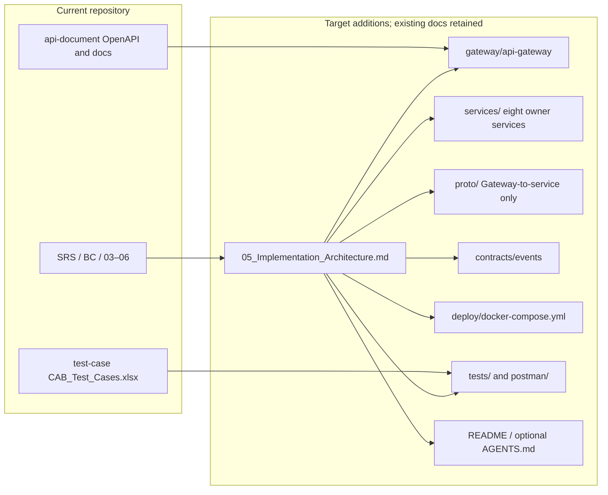

### 23.2 Source Code Layer Architecture

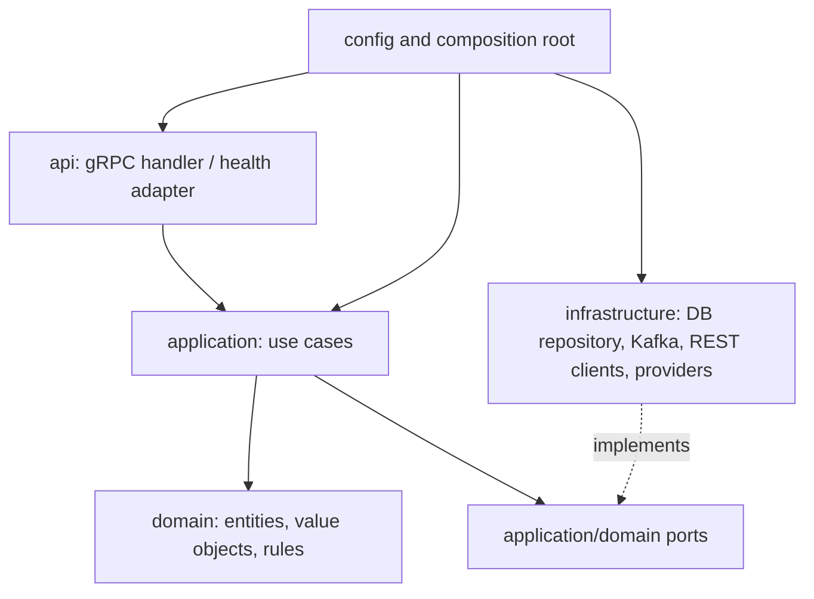

### 23.3 REST Gateway → gRPC Services

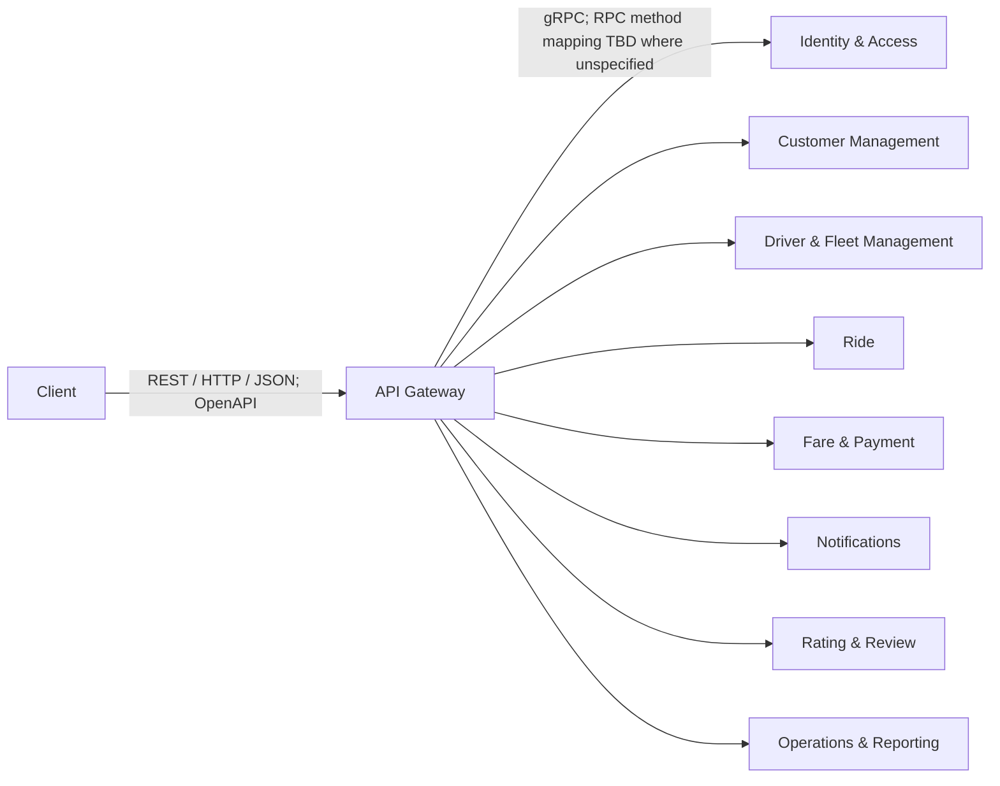

Gateway-to-service gRPC is the selected transport; method/schema mapping remains TBD where existing contracts do not provide enough detail. Internal synchronous service calls remain REST/HTTP and only use interactions already listed in 04/05.

### 23.4 Service → Database Ownership

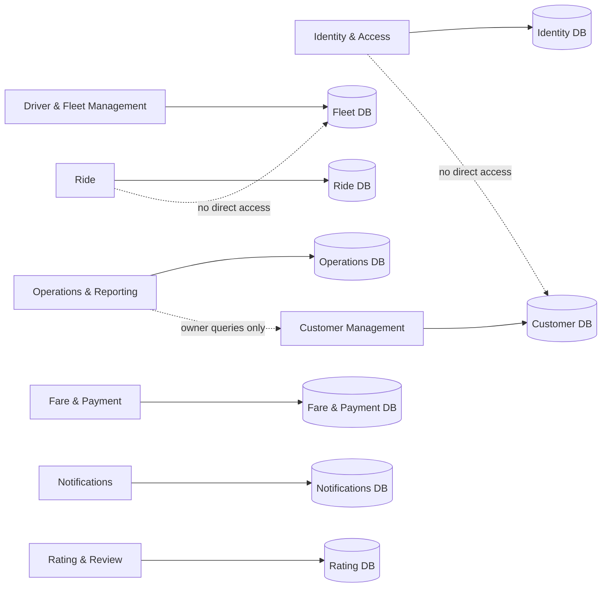

Dashed examples mark prohibited direct DB access; cross-service data is obtained through owner contract. Operations does not own or write other services' business source records.

### 23.5 Service REST + Kafka Communication

```mermaid
flowchart LR
  I[Identity & Access] -->|REST: CMD-CUS-001| C[Customer Management]
  I -->|REST: CMD-DFM-001| FLEET[Driver & Fleet Management]
  R[Ride] -->|REST: CMD-RID-004 / CMD-FP-001/002| P[Fare & Payment]
  R -->|EVT-RID-001/002/003| K[(Kafka)]
  P -->|EVT-FP-001| K
  K -->|consume defined facts| N[Notifications]
  K -.->|EVT-FP-002 candidate/inactive| P
  RAT[Rating & Review] -->|REST: QRY-RID-001| R
  O[Operations & Reporting] -->|REST owner queries only| C
  O -->|REST owner queries only| FLEET
  O -->|REST owner queries only| P
```

These are existing service-to-service REST interactions and Kafka event routes. Gateway → service gRPC is shown in diagram 23.3. No event or call beyond 04–06 is added; EVT-FP-002 remains inactive candidate.

### 23.6 Test Architecture

```mermaid
flowchart TB
  XLS[test-case/CAB_Test_Cases.xlsx: business scenarios] --> UT[Service unit tests]
  XLS --> IT[Service integration tests]
  XLS --> CT[Contract tests]
  XLS --> E2E[Root E2E tests through Gateway]
  API[api-document OpenAPI] --> CT
  API --> PM[Postman smoke/security through Gateway]
  UT --> CI[Validation pipeline]
  IT --> CI
  CT --> CI
  E2E --> CI
  PM --> CI
```

### 23.7 Overall Source Code Architecture

```mermaid
flowchart LR
  Client -->|REST/JSON| Gateway
  Gateway -->|gRPC| S[Eight microservices]
  S -->|REST/HTTP for existing sync contracts| S
  Gateway --> DBs[(No DB access)]
  S -->|owner-only| DB[(Eight isolated PostgreSQL databases)]
  S -->|contracted events only| Kafka[(Kafka)]
  Kafka --> N[Notifications consumer]
  API[api-document OpenAPI] -.REST source.-> Gateway
  Proto[proto; Gateway-to-service contracts only] -.RPC source.-> S
  Events[contracts/events] -.event schemas.-> Kafka
  Tests[service/root tests + Postman] -.validate.-> Gateway
```

Gateway `DBs` node is labeled as no database access; there is no shared database. Source of truth and contract directories remain separate from runtime implementations.

## 24. Validation Checklist

- [x] Đúng tám service, giữ tên/boundary từ 03.
- [x] API Gateway là infrastructure/application entry point.
- [x] Client → Gateway = REST/HTTP/JSON.
- [x] Gateway → eight services = gRPC; RPC method/schema mapping is TBD where existing contracts are insufficient.
- [x] Service → Service sync = REST/HTTP only for existing 04/05 interactions.
- [x] Async = Kafka and only the event IDs/routes already present in 05/06.
- [x] Kafka giữ theo 06; event list/topic/consumer chỉ dùng event IDs hiện có.
- [x] Database ownership đúng; không shared DB và không cross-service DB access.
- [x] Không đổi Contract ID, không tự tạo RPC/business event.
- [x] OpenAPI hiện tại giữ nguyên và được tham chiếu; không tạo endpoint/schema documentation thứ hai.
- [x] Health/readiness/aggregate-health source locations được chỉ định.
- [x] Gateway authentication/authorization/rate-limit và service resource authorization có location.
- [x] Idempotency key, duplicate detection, persistence và replay protection có location; Payment có test mapping.
- [x] Security requirements map component → source location → test location.
- [x] Docker, Compose, network, volume, environment, healthcheck, depends_on và exposed port có source location.
- [x] Workbook giữ nguyên; automated test, Postman smoke/security có boundary riêng.
- [x] Rubric 1–30 đủ hàng và mapping.
- [x] No Claude Code files or agent framework are proposed.
- [x] Gap analysis hiện trạng dựa trên file/thư mục thực sự inspect.
- [x] Open decisions/TBD được bảo toàn.
- [x] Only 05, 06, and transport-affected portions of 07 are corrected; source documents 01–04 and API documentation are unchanged.

## 25. 07 Architecture Handoff

### 07 Architecture Handoff

Gateway-facing service calls use gRPC, but proto RPC names/messages remain TBD unless supported by an existing contract. Internal synchronous calls use only the REST/HTTP dependencies in 04/05, including finalized `CMD-OPS-002` Operations → Ride. Use `api-document/` for public REST operations and `test-case/CAB_Test_Cases.xlsx` for business expectations. Trip rules and repository remain in Ride; Operations stores only its own support/intervention/audit records. Preserve source-of-truth ordering and report unresolved conflicts rather than inventing contracts.

### Consistency Resolution

1. Client → Gateway: REST/HTTP/JSON
2. Gateway → Microservices: gRPC
3. Microservice → Microservice: REST/HTTP theo 04/05
4. Async events: Kafka

### Remaining TBD

- Gateway gRPC RPC method/schema mapping wherever 05/OpenAPI does not specify enough detail; no mechanical REST-to-RPC conversion.
- Fare calculation/finalization trigger and timing.
- EVT-FP-002 remains candidate/inactive; no Fare consumer runtime.
- Operations intervention is finalized as CMD-OPS-002; only internal audit persistence representation remains open.
- QRY-NOT-001 list/mark-read is finalized; notification retention and delivery retry tuning remain implementation detail.
- SC-20 uses QRY-OPS-005 and an Operations-owned projection refreshed through existing owner query contracts.
- Partial registration recovery; no distributed transaction, saga, or rollback inferred.
- Idempotency key wire details and retention not already decided in 05.
- Encryption-at-rest technology and key lifecycle.
- Database technology is resolved: PostgreSQL for all eight service databases per SRS 18.7.
- Language/framework/build/codegen toolchain and health response details.


## 5. 06 — Architecture Review and Freeze

Nguồn: `06_Architecture_Review_and_Freeze.md`.

# 06 Architecture Review and Freeze

## 1. Review Scope

This record consolidates the final architecture review, resolution passes, and validation matrix. It records documentation and architecture artifact consistency; it does not claim that implementation code or automated runtime tests exist. The SRS, `bounded-context.md`, OpenAPI source/bundle, ERD, diagrams, and `test-case/CAB_Test_Cases.xlsx` remain independent authoritative artifacts for their respective content.

Historical review documents are preserved unchanged in [`docs/archive/architecture-review/`](../archive/architecture-review/).

## 2. Review History

| Review point | Historical finding | Final resolution/status |
|---|---|---|
| Architecture Review V3 | H-1 database wording, H-2 SC-15 capability, and H-3 SC-20 reporting were reviewed. Those paths were already resolved. AR-01 remained HIGH: Service Contract used `recipientAccountId`, ERD used `recipientId`, OpenAPI used `accountId`. Final conclusion: **NOT READY FOR ARCHITECTURE FREEZE**. | Historical result preserved unchanged in [`FINAL_ARCHITECTURE_REVIEW_V3.md`](../archive/architecture-review/FINAL_ARCHITECTURE_REVIEW_V3.md). |
| Freeze/finalization pass | Canonical notification recipient field aligned across contract, ERD notes/rendered artifacts, OpenAPI schema and bundle; SC-15 regression checks passed. | AR-01 **RESOLVED**; `recipientAccountId` is canonical and references Identity & Access `Account.accountId`; it is a reference, not a cross-service FK. |
| Final validation matrix | Rechecked service/context/database counts, ownership, protocols, Kafka, SC-15, SC-20, `CMD-OPS-002`, OpenAPI, ERD, diagrams, and traceability. | All final checks **PASS** or **RESOLVED** as applicable. |

### H-1 — Database technology conflict

All eight service databases use PostgreSQL as specified by SRS §18.7. Encryption, backup, credentials, and deployment tuning do not reopen the engine decision. **Final status: RESOLVED.**

### H-2 — SC-15 Notification architecture gap

Notifications owns persisted Notification records, recipient-scoped listing and mark-read, and persistent `isRead` state in its PostgreSQL database. `QRY-NOT-001` supports the finalized list/read capability. **Final status: RESOLVED.**

### H-3 — SC-20 Reporting architecture gap

Operations & Reporting owns the derived `ReportingView` and `QRY-OPS-005`. It refreshes from owner queries `QRY-OPS-002/003/004`; source records remain with Driver & Fleet, Ride, and Fare & Payment. **Final status: RESOLVED.**

### AR-01 — Notification recipient identifier mismatch

The historical V3 mismatch was `recipientAccountId` vs `recipientId` vs `accountId`. The final contract, OpenAPI schema/bundle, ERD notes and rendered diagrams use canonical `recipientAccountId`. It points to the Account owned by Identity & Access and is not a cross-service FK. **Final status: RESOLVED.**

## 3. Final Architecture Decisions

- Eight bounded contexts map to eight microservices and eight isolated PostgreSQL databases, using database-per-service and single-owner entity ownership.
- Public clients use REST/HTTPS/JSON under `/api/v1` through the API Gateway. Gateway-to-service calls use gRPC. Synchronous service-to-service calls use REST/HTTP. Asynchronous events use Kafka.
- The baseline event set is `EVT-RID-001`, `EVT-RID-002`, `EVT-RID-003`, and `EVT-FP-001`. `EVT-FP-002` remains candidate/inactive. Delivery is at-least-once with event ID deduplication, retries, DLQ, per-key ordering guidance, and outbox recommendation as recorded in Integration Contracts.
- Ride owns Trip lifecycle and `DriverAssignment`; Fare & Payment owns Fare, pricing and Payment; Notifications owns Notification and read state; Operations & Reporting owns intervention/audit records and its derived reporting projection, not source business records.
- Operations intervention uses finalized synchronous `CMD-OPS-002`: Ride validates and changes its Trip; Operations records the required audit. Driver & Fleet and Payment remain Operations dependencies for authorized lookup/reporting.
- Notification's canonical recipient field is `recipientAccountId`, a reference to the IAM-owned Account.
- Detailed command/query/event IDs, routes, request/response/error rules, and security/idempotency requirements are maintained in [04 Integration Contracts](04_Integration_Contracts.md). Implementation structure is maintained in [05 Implementation Architecture](05_Implementation_Architecture.md).

## 4. Final Validation Matrix

| Area | Status | Evidence |
|---|---|---|
| 8 bounded contexts | PASS | `bounded-context.md`; System Architecture mapping |
| 8 services | PASS | System Architecture service mapping and definitions |
| PostgreSQL per service | PASS | SRS §18.7; System Architecture; ERD |
| Entity ownership and references | PASS | System Architecture ownership; ERD; no shared business DB or cross-service FK |
| Gateway | PASS | System Architecture runtime topology and security boundary |
| REST/gRPC | PASS | Public REST/HTTPS/JSON; Gateway downstream gRPC; service sync REST/HTTP |
| Kafka | PASS | Four baseline events; `EVT-FP-002` candidate/inactive |
| SC-15 | PASS | Test → notification API → `QRY-NOT-001` → Notifications PostgreSQL → `recipientAccountId` → persistent `isRead` |
| SC-20 | PASS | Test → dashboard API/`QRY-OPS-005` → Operations `ReportingView` → owner queries and defined KPIs |
| Operations intervention | PASS | Finalized `CMD-OPS-002`; Ride owner action and Operations audit |
| OpenAPI | PASS | Source and bundled schemas/routes aligned with canonical recipient field |
| ERD | PASS | Ownership, PostgreSQL-per-service, reference/FK distinction and canonical field |
| Diagrams | PASS | Eight contexts/services/databases, protocols, projection, intervention and references |
| SC-01–SC-20 traceability | PASS | Existing test workbook and contract/API/service/data ownership mapping |
| Contract IDs | PASS | `CMD-*`, `QRY-*`, and `EVT-*` catalogs retained in Integration Contracts |

Traceability remains available as SRS/use case → bounded context → service → owned entity → contract → OpenAPI operation (where public) → test case. Internal-only flows remain traced to their owner contracts and service boundaries. OpenAPI remains a separate source; it is not copied wholesale into Markdown.

## 5. Architecture Freeze

# READY FOR ARCHITECTURE FREEZE

The finalization pass resolves AR-01. No unresolved architecture blocker remains in the reviewed baseline. This is the final decision and supersedes the historical V3 conclusion without rewriting that record.

## 6. Remaining OPEN/TBD

The following remain detailed-design or implementation work and do not block the frozen architecture:

- Gateway gRPC method/message mapping where the existing contracts do not define RPC schemas.
- Exact Ride-to-Fare calculation/finalization trigger and timing; asynchronous `EVT-FP-002` remains inactive unless formally changed.
- Lower-level service payload constraints and status taxonomy where not specified by owner contracts.
- Partial registration failure recovery/compensation without assuming a distributed transaction.
- Internal persistence representation for the finalized Operations intervention audit facts.
- Notification retention and delivery retry tuning; reporting projection pagination, batch, backoff, and retry tuning.
- Idempotency key format/retention; event and DLQ retention; timeout/retry tuning; schema-registry selection.
- Encryption-at-rest mechanism and key lifecycle; deployment/runtime/toolchain details.

These items must be resolved within existing service boundaries, ownership, protocols, and contracts unless a formal architecture change is approved.

## 7. Freeze Rule

Reopen architecture review only when a change affects a bounded context or service boundary, entity ownership, database-per-service, communication protocol, baseline business event set, or public API semantics. Implementation details that preserve those decisions do not require a new Architecture Review.

